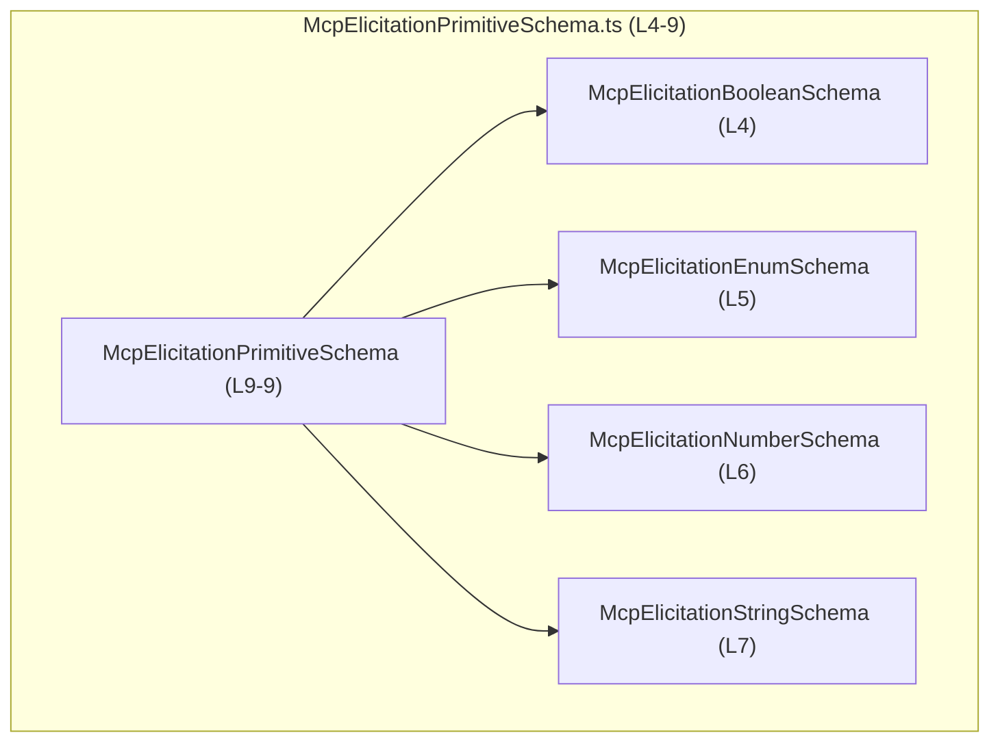
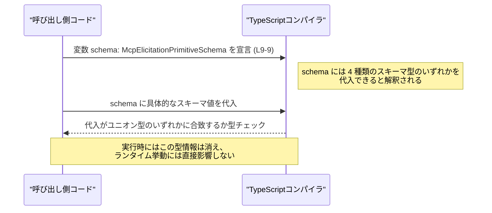

# app-server-protocol/schema/typescript/v2/McpElicitationPrimitiveSchema.ts

## 0. ざっくり一言

`McpElicitationPrimitiveSchema` は、エリシテーション（問い合わせ）に使われる「プリミティブ値」のスキーマ型を、列挙・文字列・数値・真偽値の 4 種類の型のユニオン型としてまとめた TypeScript の型エイリアスです（`McpElicitationPrimitiveSchema.ts:L9-9`）。

---

## 1. このモジュールの役割

### 1.1 概要

- このモジュールは、**プリミティブなエリシテーション項目のスキーマ型を 1 つの共通型に統合する**ために存在しています。
- 具体的には、`McpElicitationEnumSchema` / `McpElicitationStringSchema` / `McpElicitationNumberSchema` / `McpElicitationBooleanSchema` の 4 つの型をユニオン型として束ねています（`McpElicitationPrimitiveSchema.ts:L4-7, L9-9`）。
- ファイル冒頭のコメントから、このファイルは `ts-rs` によって自動生成されており、**手動で編集すべきではない**ことが明示されています（`McpElicitationPrimitiveSchema.ts:L1-3`）。

### 1.2 アーキテクチャ内での位置づけ

このファイルは、他の 4 つのスキーマ型に依存しており、それらをまとめる「集約型」として機能します。



- ノード名の括弧内の行番号は、このチャンク内での定義/参照位置を示します。
- `McpElicitationBooleanSchema` などの具体的な中身は、このチャンクには現れていません。ファイル名から用途は想像できますが、**実際のフィールド構成などは不明**です。

### 1.3 設計上のポイント

- **ユニオン型による集約**  
  4 種類のプリミティブスキーマ型をユニオン型でまとめることで、「プリミティブ値のスキーマ」という抽象的な概念を 1 つの型で表現しています（`McpElicitationPrimitiveSchema.ts:L9-9`）。
- **型専用インポート**  
  すべて `import type` を使用しており、ランタイムには影響しない**型レベルの依存のみ**であることが明示されています（`McpElicitationPrimitiveSchema.ts:L4-7`）。
- **自動生成コード**  
  冒頭コメントにより、このファイルは `ts-rs` によって生成されることが示されており（`McpElicitationPrimitiveSchema.ts:L1-3`）、**変更は生成元（Rust 側など）で行う設計**になっていると分かります。

---

## 2. 主要な機能一覧

このファイルは関数を含まず、1 つの型エイリアスのみを提供します。

- `McpElicitationPrimitiveSchema`:  
  エリシテーション用の**プリミティブスキーマ**を表すユニオン型。列挙／文字列／数値／真偽値の 4 種類いずれかのスキーマを受け付ける（`McpElicitationPrimitiveSchema.ts:L9-9`）。

---

## 3. 公開 API と詳細解説

### 3.1 型一覧（構造体・列挙体など）

このチャンクで「定義」されている型は 1 つのみです。その他は型インポートです。

| 名前 | 種別 | 定義 or 参照 | 役割 / 用途 | 根拠 |
|------|------|--------------|-------------|------|
| `McpElicitationPrimitiveSchema` | 型エイリアス（ユニオン型） | 定義 | `McpElicitationEnumSchema` / `McpElicitationStringSchema` / `McpElicitationNumberSchema` / `McpElicitationBooleanSchema` のいずれかであることを表すプリミティブスキーマの共通型 | `McpElicitationPrimitiveSchema.ts:L9-9` |
| `McpElicitationBooleanSchema` | 型（詳細不明） | 参照（`import type`） | 真偽値型のエリシテーションスキーマを表すと名前から推測されますが、このチャンクでは構造は不明 | `McpElicitationPrimitiveSchema.ts:L4-4` |
| `McpElicitationEnumSchema` | 型（詳細不明） | 参照（`import type`） | 列挙型のエリシテーションスキーマを表すと推測されますが、このチャンクでは構造は不明 | `McpElicitationPrimitiveSchema.ts:L5-5` |
| `McpElicitationNumberSchema` | 型（詳細不明） | 参照（`import type`） | 数値型のエリシテーションスキーマを表すと推測されますが、このチャンクでは構造は不明 | `McpElicitationPrimitiveSchema.ts:L6-6` |
| `McpElicitationStringSchema` | 型（詳細不明） | 参照（`import type`） | 文字列型のエリシテーションスキーマを表すと推測されますが、このチャンクでは構造は不明 | `McpElicitationPrimitiveSchema.ts:L7-7` |

> インポートされている 4 つの型については、**名前と import 文以外の情報がこのチャンクには存在しない**ため、フィールドや制約については「不明」となります。

### 3.2 関数詳細

このファイルには**関数・メソッドは一切定義されていません**（`McpElicitationPrimitiveSchema.ts:L1-9` の全体を見ても `function` / `=>` な関数宣言が存在しないため）。

### 3.3 その他の関数

- 補助的な関数やラッパー関数も、このチャンクには存在しません。

---

## 4. データフロー

このファイル自体は**型定義のみ**で、実行時ロジックやデータ処理は含みません。そのため、データフローは「コンパイル時の型レベル」での利用イメージとして説明します。

典型的な利用イメージとしては：

1. 呼び出し側コードが、あるスキーマ変数や引数に `McpElicitationPrimitiveSchema` 型を指定する。
2. その変数には、`McpElicitationEnumSchema` など 4 種のうちいずれかのスキーマオブジェクトが代入される。
3. TypeScript コンパイラは、その値がユニオンのいずれかの型に適合しているかをコンパイル時にチェックする。

概念的なシーケンス図（あくまで利用イメージであり、このチャンク内にこうした関数は定義されていません）:



---

## 5. 使い方（How to Use）

### 5.1 基本的な使用方法

以下は、この型エイリアスを利用する**概念的なコード例**です。この関数や値はこのファイルには定義されていませんが、利用パターンを示します。

```typescript
// McpElicitationPrimitiveSchema 型をインポートする
import type { McpElicitationPrimitiveSchema } from "./McpElicitationPrimitiveSchema"; // このファイル

// プリミティブスキーマを受け取り、何らかの処理を行う関数を定義する例
function handlePrimitiveSchema(schema: McpElicitationPrimitiveSchema) { // schema は 4 種のどれか
    // ユニオン型なので、型ガードや共通フィールドを使って分岐することが多い
    // 具体的なフィールド構造はこのチャンクからは不明
}
```

- このように、関数の引数や変数の型として `McpElicitationPrimitiveSchema` を指定することで、「プリミティブスキーマであれば列挙／文字列／数値／真偽値いずれでもよい」という API 契約を表現できます。

### 5.2 よくある使用パターン

1. **関数引数としての利用**

   ```typescript
   function validatePrimitive(value: unknown, schema: McpElicitationPrimitiveSchema) {
       // schema の中身に応じて value を検証する、という設計が考えられます
       // （検証ロジック自体はこのファイルには存在しません）
   }
   ```

2. **配列やマップでの利用**

   ```typescript
   // 複数のプリミティブスキーマを配列で持つ例
   const primitiveSchemas: McpElicitationPrimitiveSchema[] = [];
   ```

3. **ユニオン型の絞り込み（型ガード）**

   実際のスキーマ型にタグフィールドがあれば（これは別ファイルを見ないと不明ですが）、タグで分岐する形がよく利用されます。

   ```typescript
   function processSchema(schema: McpElicitationPrimitiveSchema) {
       // ここでは仮に kind プロパティが存在すると仮定した例です。
       // 実際に存在するかどうかは、このチャンクからは分かりません。
       // if (schema.kind === "enum") { ... }
   }
   ```

   > 上記のようなプロパティ構造は**推測例**であり、実際に存在するかは `McpElicitationEnumSchema` などの定義を確認する必要があります。

### 5.3 よくある間違い（想定）

この型エイリアスに関する、起こりがちな誤用パターンとその対策を TypeScript の一般的な観点から示します。

```typescript
// 誤りの例: any を使ってしまい、型安全性が失われる
function badHandler(schema: any) {              // any では何でも入る
    // schema の具体的な構造が分からず、IDE 補完も効きにくい
}

// 正しい方向性の例: McpElicitationPrimitiveSchema を使う
function goodHandler(schema: McpElicitationPrimitiveSchema) {
    // 少なくとも 4 種類のどれかであることが保証される
}
```

- `any` を使うと `McpElicitationPrimitiveSchema` の型安全性が失われます。
- 必要に応じて `unknown` を使い、適切な型ガードで `McpElicitationPrimitiveSchema` に変換する方が安全です。

### 5.4 使用上の注意点（まとめ）

- **自動生成コードを直接編集しないこと**  
  `// GENERATED CODE! DO NOT MODIFY BY HAND!` とコメントされており（`McpElicitationPrimitiveSchema.ts:L1-3`）、このファイルに手動で変更を加えると、再生成時に上書きされる可能性があります。
- **型定義のみであり、ランタイム挙動は持たない**  
  すべて `import type` と `export type` であるため（`McpElicitationPrimitiveSchema.ts:L4-7, L9-9`）、**実行時のエラーやパフォーマンスには直接関与しません**。これは TypeScript 特有の「型消去」の性質です。
- **エラーハンドリングは利用側で行う必要がある**  
  この型は「値の形」をコンパイル時に制約するのみであり、実際の値検証（パースエラー、形式不正など）は別のロジックが担う必要があります。このチャンクにはそのようなロジックは存在しません。
- **並行性・スレッドセーフティの懸念はない**  
  型定義のみで状態を持たないため、このファイル単体による並行性問題はありません。
- **テストについて**  
  このチャンクにはテストコードは含まれておらず、`McpElicitationPrimitiveSchema` 向けのテストが存在するかは、この情報だけでは分かりません。

---

## 6. 変更の仕方（How to Modify）

### 6.1 新しい機能を追加する場合

このファイルは `ts-rs` により生成されているため（`McpElicitationPrimitiveSchema.ts:L1-3`）、**直接編集ではなく生成元を変更する**のが前提になります。

- たとえば「新しいプリミティブ型（例: Date 型）のスキーマ」を追加したい場合、通常は：
  1. Rust 側などの元スキーマ定義に、新しい型（例: `McpElicitationDateSchema`）を追加する。
  2. `ts-rs` によるコード生成プロセスを再実行する。
  3. その結果として、このファイルの `McpElicitationPrimitiveSchema` ユニオンに新しい型が自動的に含まれることが期待されます。

> 具体的な生成元やビルド手順は、このチャンクからは不明です。プロジェクトのビルド・生成スクリプトを参照する必要があります。

### 6.2 既存の機能を変更する場合

- **ユニオン構成の変更（型の追加・削除）**  
  `McpElicitationPrimitiveSchema` のユニオンメンバーを変える場合も、基本的には生成元に対する変更になります。
- **変更時に注意すべき契約**
  - `McpElicitationPrimitiveSchema` を引数やフィールドに使っているコードは、「4 種類いずれかである」という前提で実装されている可能性があります。
  - ユニオンから型を削除すると、既存コードがコンパイルエラーやランタイムエラーを起こす可能性があります（削除された型を想定した分岐など）。
  - 型を追加すると、利用側で「全ケース網羅」の `switch` などを書いていた場合に、**コンパイル時に網羅性チェックが効かない書き方だと気づきにくい**点に注意が必要です。
- **テスト・利用箇所の再確認**
  - `McpElicitationPrimitiveSchema` を使用している関数やクラスを検索し、新しいユニオン構成に対して期待通り動作するか、テストを用意することが望ましいです。
  - このチャンクには利用箇所が出てこないため、検索はプロジェクト全体で行う必要があります。

---

## 7. 関連ファイル

このファイルと密接に関係するファイルは、import 文から特定できます。

| パス | 役割 / 関係 |
|------|------------|
| `./McpElicitationBooleanSchema` | `McpElicitationBooleanSchema` 型を提供するファイルです（`McpElicitationPrimitiveSchema.ts:L4-4`）。真偽値型のエリシテーションスキーマであると推測されますが、構造はこのチャンクには現れません。 |
| `./McpElicitationEnumSchema` | `McpElicitationEnumSchema` 型を提供するファイルです（`McpElicitationPrimitiveSchema.ts:L5-5`）。列挙型スキーマと推測されますが、詳細は不明です。 |
| `./McpElicitationNumberSchema` | `McpElicitationNumberSchema` 型を提供するファイルです（`McpElicitationPrimitiveSchema.ts:L6-6`）。数値型スキーマと推測されます。 |
| `./McpElicitationStringSchema` | `McpElicitationStringSchema` 型を提供するファイルです（`McpElicitationPrimitiveSchema.ts:L7-7`）。文字列型スキーマと推測されます。 |

> これらのファイルの中身は、このチャンクには含まれていないため、フィールドやバリデーションルールなどの詳細は「不明」です。必要に応じて、それぞれのファイルの定義を別途確認する必要があります。
