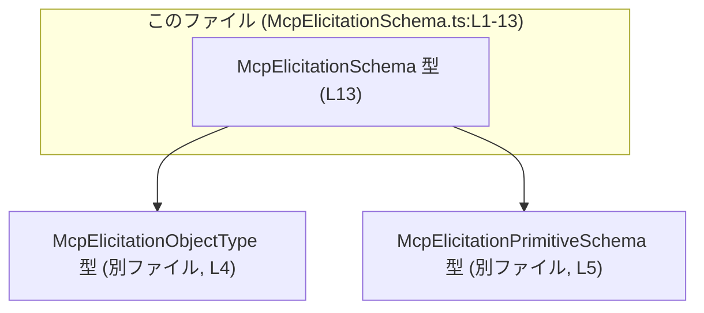
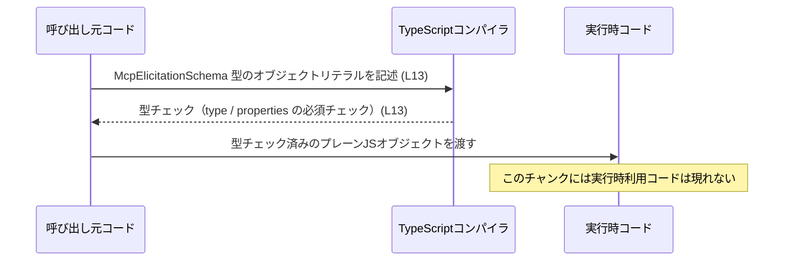

# app-server-protocol/schema/typescript/v2/McpElicitationSchema.ts

## 0. ざっくり一言

MCP の `elicitation/create` リクエスト用フォームスキーマを表す **型エイリアス（TypeScript の型定義）** です。実行時の処理は持たず、オブジェクト構造を静的に保証するための型だけが定義されています（`export type McpElicitationSchema`、McpElicitationSchema.ts:L13-13）。

---

## 1. このモジュールの役割

### 1.1 概要

- このモジュールは、MCP プロトコルの `elicitation/create` リクエストで使用されるフォームスキーマの構造を TypeScript の型として表現します（コメント、McpElicitationSchema.ts:L7-11）。
- `McpElicitationSchema` 型は、フォーム全体の JSON Schema 風オブジェクトを表し、プロパティ定義や必須フィールドの一覧を含みます（McpElicitationSchema.ts:L13-13）。
- 実行時のロジックは一切なく、**コンパイル時型チェック**と IDE 補完のための情報を提供する役割のみを持ちます。

### 1.2 アーキテクチャ内での位置づけ

このファイルは、他の 2 つの型に依存し、それらを組み合わせてフォーム全体のスキーマを定義しています。

- `McpElicitationObjectType`  
  フォームのトップレベルの `type` を表す型としてインポートされています（McpElicitationSchema.ts:L4-4）。
- `McpElicitationPrimitiveSchema`  
  `properties` 内の各フィールドに対応するプリミティブなスキーマを表す型としてインポートされています（McpElicitationSchema.ts:L5-5）。



※ `McpElicitationObjectType` と `McpElicitationPrimitiveSchema` の中身は、このチャンクには現れないため不明です。

### 1.3 設計上のポイント

- **自動生成コード**  
  ファイル先頭に「GENERATED CODE! DO NOT MODIFY BY HAND!」と明記されており（McpElicitationSchema.ts:L1-3）、`ts-rs` によって生成されたコードであることが分かります。
- **純粋な型定義**  
  関数・クラスは存在せず、1 つの `export type` のみを提供するシンプルな構造です（McpElicitationSchema.ts:L13-13）。
- **JSON Schema ライクな構造**  
  `$schema`, `type`, `properties`, `required` といった典型的な JSON Schema に類似したフィールド構成になっています（McpElicitationSchema.ts:L13-13）。
- **インデックスシグネチャによる任意プロパティ**  
  `properties` は `"任意の文字列キー" →`McpElicitationPrimitiveSchema` というインデックスシグネチャで定義されており、任意のプロパティ名を持つフォームを表現できます（McpElicitationSchema.ts:L13-13）。
- **必須/任意の明確な区別**  
  `$schema` と `required` がオプショナル（`?`）で、`type` と `properties` は必須フィールドとして表現されています（McpElicitationSchema.ts:L13-13）。

### 1.4 コンポーネントインベントリー（このチャンク）

| 種別 | 名前 | 役割 / 用途 | エクスポート | 定義 / 使用行 |
|------|------|-------------|-------------|---------------|
| 型エイリアス | `McpElicitationSchema` | MCP `elicitation/create` リクエストのフォームスキーマ全体を表す | `export` | 定義: McpElicitationSchema.ts:L13-13 |
| 型（インポート） | `McpElicitationObjectType` | スキーマの `type` フィールドの型 | なし（他ファイルから import type） | 使用: McpElicitationSchema.ts:L4-4, L13-13 |
| 型（インポート） | `McpElicitationPrimitiveSchema` | `properties` 内の各プロパティスキーマの型 | なし（他ファイルから import type） | 使用: McpElicitationSchema.ts:L5-5, L13-13 |

---

## 2. 主要な機能一覧

このファイルは関数を持たないため、「機能」は型定義としての役割になります。

- `McpElicitationSchema`: MCP `elicitation/create` 用フォームスキーマの **型レベルの表現**。トップレベルスキーマ、プロパティ定義、必須プロパティ一覧を 1 つのオブジェクト型で表現します（McpElicitationSchema.ts:L13-13）。

---

## 3. 公開 API と詳細解説

### 3.1 型一覧（構造体・列挙体など）

| 名前 | 種別 | 役割 / 用途 | 補足 | 行 |
|------|------|-------------|------|----|
| `McpElicitationSchema` | 型エイリアス | MCP `elicitation/create` リクエストに用いるフォームスキーマの構造を表す | `$schema`, `type`, `properties`, `required` を持つオブジェクト型 | McpElicitationSchema.ts:L13-13 |
| `McpElicitationObjectType` | 型（外部定義） | `McpElicitationSchema["type"]` の型 | このチャンクでは定義不明。`import type` のみ（L4） | 使用: McpElicitationSchema.ts:L4-4, L13-13 |
| `McpElicitationPrimitiveSchema` | 型（外部定義） | `properties` の各値の型 | このチャンクでは定義不明。`import type` のみ（L5） | 使用: McpElicitationSchema.ts:L5-5, L13-13 |

### 3.2 `McpElicitationSchema` 型の詳細

#### 概要

`McpElicitationSchema` は、MCP の `elicitation/create` リクエストで使用されるフォームスキーマを表すオブジェクト型です（コメントと定義より、McpElicitationSchema.ts:L7-11, L13-13）。  
JSON Schema に類似した形で、以下の情報を持ちます。

- スキーマバージョン（任意）:`$schema`
- フォーム全体の型: `type`
- 各フォーム項目のスキーマ: `properties`
- 必須プロパティ名のリスト（任意）: `required`

#### フィールド

`export type McpElicitationSchema = { ... };` の中身を分解すると、次の 4 フィールドがあります（McpElicitationSchema.ts:L13-13）。

| フィールド名 | TypeScript 型 | 必須 / 任意 | 説明 |
|-------------|---------------|------------|------|
| `$schema` | `string` | 任意（`?`） | スキーマのバージョンやメタ情報を示す文字列。JSON Schema の `$schema` に相当すると考えられますが、具体的な意味はこのチャンクからは不明です。 |
| `type` | `McpElicitationObjectType` | 必須 | フォームスキーマのトップレベル `type` を表す型。実際のバリエーション（例: `"object"` など）が何かはこのチャンクには現れません。 |
| `properties` | `{ [key in string]?: McpElicitationPrimitiveSchema }` | 必須 | プロパティ名（文字列）をキーとし、そのプロパティのプリミティブスキーマを値に持つマップ。各キーはオプショナルで、存在するキーに対して対応する `McpElicitationPrimitiveSchema` が定義されます。 |
| `required` | `Array<string>` | 任意（`?`） | 必須とみなされるプロパティ名の配列。`properties` のキーと論理的に対応する想定ですが、型レベルではその整合性はチェックされません。 |

#### 内部構造のポイント（型ルール）

- `$schema` と `required` はオプショナル  
  フィールド名の後ろに `?` が付いているため、これらを省略したオブジェクトも `McpElicitationSchema` として型チェックを通ります（McpElicitationSchema.ts:L13-13）。
- `type` と `properties` は必須  
  `?` が付いていないため、これらが存在しないリテラルオブジェクトは型エラーになります（McpElicitationSchema.ts:L13-13）。
- `properties` のキーは任意の文字列  
  インデックスシグネチャ `{ [key in string]?: McpElicitationPrimitiveSchema }` により、任意のプロパティ名を受け入れます（McpElicitationSchema.ts:L13-13）。
- `required` と `properties` の整合性は型レベルで保証されない  
  `required` は単なる `Array<string>` であり、`properties` のキーと型レベルで結びついていません（McpElicitationSchema.ts:L13-13）。したがって、`required` に `properties` に存在しない名前を入れてもコンパイルは通ります。

#### Examples（使用例）

> ここでは、`McpElicitationPrimitiveSchema` の中身がこのチャンクにないため、`/* ... */` で詳細を省略しています。

**例 1: 最小限のスキーマ定義**

```typescript
import type {
    McpElicitationSchema,                 // このファイルで定義されている型
} from "./McpElicitationSchema";
import type {
    McpElicitationPrimitiveSchema,        // 別ファイルで定義されているプリミティブスキーマ
} from "./McpElicitationPrimitiveSchema";

// プロパティ "question" のプリミティブスキーマ定義（詳細はこのチャンクからは不明）
const questionSchema: McpElicitationPrimitiveSchema = {
    /* MCP プロトコル側で要求される設定をここに書く */
};

// 最小限のフォームスキーマ: type と properties は必須
const schema: McpElicitationSchema = {    // McpElicitationSchema 型を明示
    type: "object" as any,               // 実際の型は McpElicitationObjectType に依存（このチャンクでは不明）
    properties: {
        question: questionSchema,        // "question" フィールドのスキーマを設定
    },
    // $schema と required は省略可能
};
```

この例では、`type` と `properties` が存在するため `McpElicitationSchema` として型チェックを通過します（McpElicitationSchema.ts:L13-13）。

**例 2: `$schema` と `required` を使ったスキーマ**

```typescript
const fullSchema: McpElicitationSchema = {
    $schema: "https://example.com/mcp/elicitation-schema.json", // スキーマ識別子
    type: "object" as any,                                      // 実際の型は別ファイル定義
    properties: {
        question: questionSchema,
        answer: {/* ... */} as McpElicitationPrimitiveSchema,
    },
    required: ["question"],                                     // "question" を必須とする
};
```

このように、`required` に必須プロパティ名を列挙することで、「どの項目が必須か」を表現できます。ただし、`required` の文字列と `properties` のキーの整合性は型システムでは保証されません。

#### Errors / Panics（型レベルのエラー）

このファイルには実行時コードがないため、発生しうるのは **コンパイル時の型エラー** だけです。

- **`type` を欠いている場合**  
  `McpElicitationSchema` であるとアノテーションしたオブジェクトから `type` を省略するとコンパイルエラーとなります（`type` が必須フィールドのため、McpElicitationSchema.ts:L13-13）。
- **`properties` を欠いている場合**  
  同様に、`properties` が存在しないとコンパイルエラーになります（McpElicitationSchema.ts:L13-13）。
- **`properties` の値の型が不一致な場合**  
  あるキーに `McpElicitationPrimitiveSchema` ではない型の値を入れると、型エラーになります（`properties` の値型が固定されているため、McpElicitationSchema.ts:L13-13）。

実行時のランタイムエラーやパニック（panic）は、このファイル単体からは直接は発生しません。

#### Edge cases（エッジケース）

- **空の `properties`**  
  `properties: {}` のようにプロパティが 0 件でも、型的には問題ありません（インデックスシグネチャは空オブジェクトも許すため、McpElicitationSchema.ts:L13-13）。  
  実際にそれが有効かどうかは、MCP プロトコル側の仕様に依存し、このチャンクからは不明です。
- **`required` が空配列**  
  `required: []` としても型的には許容されます。これは「必須プロパティがない」ことを意味します。
- **`required` に `properties` に存在しない名前を含める**  
  型レベルでは `Array<string>` でしかないため、`required: ["unknown"]` のような記述はコンパイルを通過します（McpElicitationSchema.ts:L13-13）。  
  そのような不整合はランタイム側または上位のバリデーションで検出する必要があります。
- **`$schema` のフォーマット**  
  `$schema` は単なる `string` のため、URL 形式でなくともコンパイルは通ります（McpElicitationSchema.ts:L13-13）。フォーマットの制約はこの型では表現されていません。

#### 使用上の注意点

- **このファイルは手で編集しない**  
  冒頭コメントに「GENERATED CODE! DO NOT MODIFY BY HAND!」とあり（McpElicitationSchema.ts:L1-3）、`ts-rs` により自動生成されることが明示されています。  
  変更が必要な場合は、生成元（Rust 側の構造体定義など）があるリポジトリ/モジュールを変更する必要があります（生成元の場所はこのチャンクには現れません）。
- **`required` と `properties` の整合性は別途検証が必要**  
  型レベルで整合性が保証されないため、実行時にバリデーションを行うか、より厳密な型（例えば `as const` と `keyof` を組み合わせた型）を別途用意する必要があります（McpElicitationSchema.ts:L13-13）。
- **セキュリティ面**  
  この型自体は構造を表すだけであり、入力のサニタイズやバリデーションは行いません。  
  フォーム入力の検証やサニタイズは、スキーマを利用する側のロジックが担う必要があります（このチャンクにはそのコードは現れません）。

### 3.3 その他の関数

このファイルには関数定義が存在しません（全行を確認しても `function` や `=>` による関数宣言・式はありません: McpElicitationSchema.ts:L1-13）。

---

## 4. データフロー

このモジュールは型定義のみを提供するため、**実行時の処理フロー**は直接は表しません。  
ここでは「McpElicitationSchema 型の値がどのように利用されるか」という、コンパイル時〜実行時の観点でのデータフローを図示します。



要点:

- `McpElicitationSchema` はあくまで **型** であり、コンパイル時の整合性チェックに使われます（McpElicitationSchema.ts:L13-13）。
- 実行時には通常の JavaScript オブジェクトとして扱われ、シリアライズやネットワーク送信などに利用されると考えられますが、その具体的な利用箇所はこのチャンクには現れません。

---

## 5. 使い方（How to Use）

### 5.1 基本的な使用方法

最も基本的な使い方は、「`McpElicitationSchema` 型としてスキーマオブジェクトを定義する」ことです。

```typescript
import type { McpElicitationSchema } from "./McpElicitationSchema"; // このファイルの型を import
import type { McpElicitationPrimitiveSchema } from "./McpElicitationPrimitiveSchema";

// プリミティブフィールドのスキーマ（詳細は別ファイル）
const textField: McpElicitationPrimitiveSchema = {
    /* 文字列入力用の設定など */
};

// フォーム全体のスキーマを定義
const elicitationSchema: McpElicitationSchema = {
    type: "object" as any,             // 実際には McpElicitationObjectType に合わせる必要がある
    properties: {
        prompt: textField,             // "prompt" フィールドのスキーマ
    },
    required: ["prompt"],              // "prompt" を必須とする
    // $schema は任意
};
```

このように型注釈を付けることで:

- `type` と `properties` の付け忘れをコンパイル時に防げる（McpElicitationSchema.ts:L13-13）。
- `properties` の各値が `McpElicitationPrimitiveSchema` であることを保証できる（McpElicitationSchema.ts:L13-13）。

### 5.2 よくある使用パターン

1. **定数としてスキーマを定義し、複数箇所で再利用する**

```typescript
export const ELICITATION_SCHEMA: McpElicitationSchema = {
    type: "object" as any,
    properties: {
        question: {/* ... */} as McpElicitationPrimitiveSchema,
        // 他のフィールド...
    },
    required: ["question"],
};
```

- 利用側は `ELICITATION_SCHEMA` を import して使うだけでよく、型定義を共有できます。

1. **部分的に動的に構築する**

```typescript
function buildSchema(extraProps: Record<string, McpElicitationPrimitiveSchema>): McpElicitationSchema {
    return {
        type: "object" as any,
        properties: {
            question: {/* ... */} as McpElicitationPrimitiveSchema,
            ...extraProps,                    // 呼び出し元から追加プロパティを受け取る
        },
        required: ["question"],
    };
}
```

- `properties` のインデックスシグネチャにより、`...extraProps` のような動的な追加にも対応できます（McpElicitationSchema.ts:L13-13）。

### 5.3 よくある間違い

**誤 1: `type` を定義し忘れる**

```typescript
// コンパイルエラーになる例
const badSchema: McpElicitationSchema = {
    // type: ...     // ← 必須フィールドが抜けている
    properties: {}, // この行だけでは McpElicitationSchema を満たさない
};
```

- `type` は必須フィールドなので、省略するとコンパイルエラーになります（McpElicitationSchema.ts:L13-13）。

**誤 2: `properties` の値に誤った型を入れる**

```typescript
// コンパイルエラーになる例
const badSchema2: McpElicitationSchema = {
    type: "object" as any,
    properties: {
        question: "string", // ← McpElicitationPrimitiveSchema ではない
    },
};
```

- `properties` の値型は `McpElicitationPrimitiveSchema` で固定されているため、文字列など別の型を入れると型エラーになります（McpElicitationSchema.ts:L13-13）。

**誤 3: `required` に存在しないプロパティ名を書く（コンパイルは通る）**

```typescript
// コンパイルは通るが論理的に怪しい例
const suspiciousSchema: McpElicitationSchema = {
    type: "object" as any,
    properties: {
        question: {/* ... */} as McpElicitationPrimitiveSchema,
    },
    required: ["answer"], // "answer" プロパティは properties に存在しない
};
```

- 型システム上は問題ありませんが、実際には `required` の内容と `properties` のキーが一致しているかを別途チェックする必要があります（McpElicitationSchema.ts:L13-13）。

### 5.4 使用上の注意点（まとめ）

- このファイルは **自動生成** されるため、手動で編集しない（McpElicitationSchema.ts:L1-3）。
- `type` と `properties` は必須であり、`McpElicitationSchema` を使う限りこれらの定義が必要（McpElicitationSchema.ts:L13-13）。
- `required` の整合性は型レベルでは保証されないため、必要なら別途バリデーションロジックを用意する。
- この型は並行性やスレッド安全性とは無関係で、純粋に **静的な構造の表現**にのみ関与する。

---

## 6. 変更の仕方（How to Modify）

### 6.1 新しい機能を追加する場合

このファイルは自動生成されているため、直接の変更は推奨されません（McpElicitationSchema.ts:L1-3）。  
新しいフィールドや機能を追加したい場合の一般的な流れは次のとおりです。

1. **生成元のスキーマ定義を変更する**  
   - `ts-rs` は通常 Rust の型定義から TypeScript 型を生成します。  
   - 新しいフィールドを追加したい場合は、その Rust 構造体やスキーマ定義を変更する必要があります（生成元の場所はこのチャンクからは不明です）。
2. **コード生成を再実行する**  
   - プロジェクトのビルドスクリプトや `cargo` コマンドなどを通じて `ts-rs` を再実行し、新しい TypeScript 型を生成します。
3. **変更後の影響箇所を確認する**  
   - `McpElicitationSchema` を使用している呼び出し側コードで、新たな必須フィールドが追加された場合などは型エラーが発生するため、その箇所を修正します。

### 6.2 既存の機能を変更する場合

既存フィールドの意味や必須/任意を変更する場合も、同様に**生成元の定義**を変更する必要があります。

変更時に注意すべき点:

- **必須フィールドを増やす**と、既存の全ての `McpElicitationSchema` 利用箇所に型エラーが出る可能性があります（特に `type` や `properties` などの必須性変更）。
- **フィールド名を変更する**と、`properties` キーや `required` の内容との整合性が変わるため、呼び出し側のロジックも更新が必要です。
- `required` の型をより厳密にしたい場合（例: `Array<keyof typeof properties>` のような関係を表現したい場合）は、この単純な自動生成型だけでは表現しきれないため、別途手書きの型ラッパーを用意する選択肢もあります（このファイル自体は自動生成のままにしておくことが望ましいです）。

---

## 7. 関連ファイル

このモジュールと密接に関係するファイル（このチャンクから分かる範囲）は次の通りです。

| パス | 役割 / 関係 |
|------|------------|
| `./McpElicitationObjectType` | `McpElicitationSchema["type"]` の型を提供する。具体的な定義内容はこのチャンクには現れません（インポートのみ: McpElicitationSchema.ts:L4-4）。 |
| `./McpElicitationPrimitiveSchema` | `McpElicitationSchema["properties"][key]` の型を提供する。プロパティ用のプリミティブスキーマ定義と推測されますが、詳細はこのチャンクからは不明です（インポートのみ: McpElicitationSchema.ts:L5-5）。 |

テストコードや、この型を実際に利用しているコードはこのチャンクには現れないため、どこからどのように呼び出されているかは不明です。
