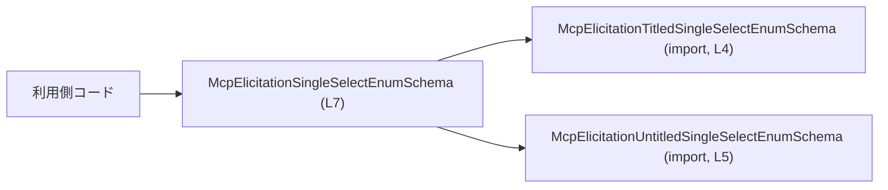
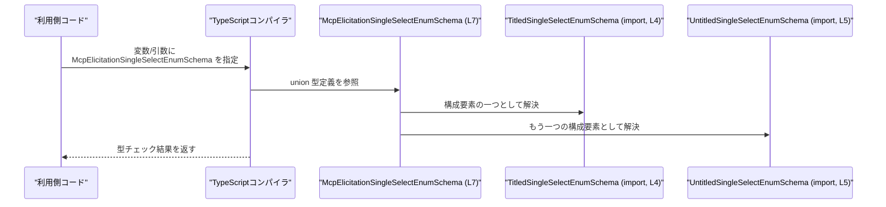

# app-server-protocol/schema/typescript/v2/McpElicitationSingleSelectEnumSchema.ts

## 0. ざっくり一言

`McpElicitationSingleSelectEnumSchema` は、タイトル付きとタイトル無しの 2 種類の単一選択列挙スキーマ型をまとめる **型エイリアス（union 型）** です（`McpElicitationSingleSelectEnumSchema.ts:L7`）。  
このファイルは `ts-rs` によって自動生成されており、**手動編集は禁止**と明記されています（`McpElicitationSingleSelectEnumSchema.ts:L1-3`）。

---

## 1. このモジュールの役割

### 1.1 概要

- このモジュールは、単一選択（Single Select）の列挙スキーマを表す 2 つの型  
  `McpElicitationTitledSingleSelectEnumSchema` と  
  `McpElicitationUntitledSingleSelectEnumSchema` を **1 つの union 型**としてまとめる役割を持ちます（`McpElicitationSingleSelectEnumSchema.ts:L4-5,L7`）。
- これにより、利用側コードは「タイトル付きかどうかを区別せずに」単一選択列挙スキーマを扱うことができます。

### 1.2 アーキテクチャ内での位置づけ

このファイルは TypeScript 側のスキーマ定義の一部であり、  
**上位のアプリケーションコードから参照される入口の型**として機能し、  
内部的には 2 つのより具体的なスキーマ型に依存しています。

根拠となる依存関係:

- `import type { McpElicitationTitledSingleSelectEnumSchema } from "./McpElicitationTitledSingleSelectEnumSchema";`  
  （`McpElicitationSingleSelectEnumSchema.ts:L4`）
- `import type { McpElicitationUntitledSingleSelectEnumSchema } from "./McpElicitationUntitledSingleSelectEnumSchema";`  
  （`McpElicitationSingleSelectEnumSchema.ts:L5`）
- `export type McpElicitationSingleSelectEnumSchema = McpElicitationUntitledSingleSelectEnumSchema | McpElicitationTitledSingleSelectEnumSchema;`  
  （`McpElicitationSingleSelectEnumSchema.ts:L7`）

これを図にすると次のようになります。



### 1.3 設計上のポイント

- **union 型エイリアスによる抽象化**  
  - 2 つの具体的な型を union 型にまとめ、利用側からは「単一の概念」として扱えるようになっています（`L7`）。
- **型のみ（コンパイル時専用）のモジュール**  
  - 実行時コード（関数やクラス）は一切なく、型レベルのみの定義です（`L4-7`）。
  - そのため、このファイル単体ではランタイムでのエラーや並行性の問題は発生しません。
- **自動生成コード**  
  - `// GENERATED CODE! DO NOT MODIFY BY HAND!`  
    `// This file was generated by [ts-rs] ...` とあり、自動生成であることが明示されています（`L1-3`）。
  - 変更が必要な場合は、生成元（通常は Rust 側の型定義）で行い、再生成することが前提です。この点はコメントから読み取れますが、生成元の具体的な場所はこのチャンクには現れていません。

---

## 2. 主要な機能一覧

このファイルが提供する機能は型定義のみで、次の 1 点に集約されます。

- `McpElicitationSingleSelectEnumSchema`:  
  タイトル付き／無しの単一選択列挙スキーマを 1 つの union 型として表現するエイリアス（`L7`）。

---

## 3. 公開 API と詳細解説

### 3.0 コンポーネントインベントリー（型・依存関係）

このチャンクに現れる型・構造の一覧です。

| 名前 | 種別 | 役割 / 状態 | 行番号根拠 |
|------|------|-------------|------------|
| `McpElicitationSingleSelectEnumSchema` | 型エイリアス（union 型） | タイトル付き／無し単一選択列挙スキーマをまとめた公開型 | `McpElicitationSingleSelectEnumSchema.ts:L7` |
| `McpElicitationTitledSingleSelectEnumSchema` | 型（定義は他ファイル） | タイトル付き単一選択列挙スキーマ。`type` import されている | `McpElicitationSingleSelectEnumSchema.ts:L4` |
| `McpElicitationUntitledSingleSelectEnumSchema` | 型（定義は他ファイル） | タイトル無し単一選択列挙スキーマ。`type` import されている | `McpElicitationSingleSelectEnumSchema.ts:L5` |

`McpElicitationTitledSingleSelectEnumSchema` と  
`McpElicitationUntitledSingleSelectEnumSchema` の中身は、このチャンクには定義がなく不明です。

### 3.1 型一覧（構造体・列挙体など）

このモジュールから公開されている主要な型は次の 1 つです。

| 名前 | 種別 | 役割 / 用途 | 定義位置 |
|------|------|-------------|----------|
| `McpElicitationSingleSelectEnumSchema` | 型エイリアス（union 型） | 単一選択列挙スキーマを「タイトル付き／無し」にまたがって一括で表すための公開型 | `McpElicitationSingleSelectEnumSchema.ts:L7` |

#### 型エイリアス `McpElicitationSingleSelectEnumSchema`

**概要**

- タイトル付きとタイトル無しの 2 種類の単一選択列挙スキーマ型を union として束ねる型エイリアスです（`L7`）。

**定義**

```typescript
// McpElicitationSingleSelectEnumSchema.ts:L7
export type McpElicitationSingleSelectEnumSchema =
    McpElicitationUntitledSingleSelectEnumSchema
    | McpElicitationTitledSingleSelectEnumSchema;
```

**構成要素**

| 構成要素 | 説明 | 行番号根拠 |
|----------|------|------------|
| `McpElicitationUntitledSingleSelectEnumSchema` | union の一方のメンバ型。タイトル無しのスキーマを表すと推測されますが、中身はこのチャンクからは不明です | `L5,L7` |
| `McpElicitationTitledSingleSelectEnumSchema` | union のもう一方のメンバ型。タイトル付きのスキーマを表すと推測されますが、中身はこのチャンクからは不明です | `L4,L7` |

> 「タイトル付き／無し」という解釈は型名からの推測であり、具体的なフィールド構造はこのチャンクには現れていません。

**型システム上の役割（TypeScript 特有の観点）**

- **型安全性**  
  - 関数やオブジェクトのプロパティとして `McpElicitationSingleSelectEnumSchema` を使うことで、  
    「どちらか一方のスキーマである」ことをコンパイル時に保証できます。
  - ただし、`any` や無理な型アサーションを使うと、この保証は崩れます（一般的な TypeScript の性質です）。
- **エラー・並行性**  
  - このファイルは型定義のみのため、**実行時エラーやスレッド並行性の問題は直接は発生しません**。
  - 型が使われる先のロジックで、JSON などの外部入力のバリデーションが不足している場合には、実行時エラーにつながる可能性がありますが、そのような処理はこのチャンクには現れていません。

**Examples（使用例）**

このチャンクには利用例はありませんが、一般的な union 型エイリアスとして、次のように利用できます。

```typescript
// 他ファイルからの利用例（例示）
// 実際の利用コードはこのチャンクには含まれていません。
import type {
    McpElicitationSingleSelectEnumSchema,  // 単一の入口型として import
} from "./McpElicitationSingleSelectEnumSchema";

// スキーマを保持する設定オブジェクトの例
interface QuestionConfig {
    // 単一選択列挙のスキーマを保持
    schema: McpElicitationSingleSelectEnumSchema;
}

// 単一選択列挙スキーマを受け取り、別処理に渡す関数の例
function handleSingleSelectSchema(
    schema: McpElicitationSingleSelectEnumSchema, // union 型として受け取る
) {
    // ここでは union のどちらの型か意識せずに
    // 別の関数にそのまま渡すなどの処理が想定されます。
    forwardToAnotherLayer(schema);
}

// 型の使われ方を示すためのダミー関数
function forwardToAnotherLayer(
    schema: McpElicitationSingleSelectEnumSchema, // 同じ union 型を再利用
) {
    // 実際の処理内容は、このチャンクからは分かりません。
}
```

> 上記コードは、この型の一般的な使い方を示すための例であり、  
> 実際のリポジトリ内に同一の関数が存在することを意味しません。

**Edge cases（エッジケース）**

この型は union 型であり、一般的に次のような点がエッジケースになりがちです。

- **実行時データがどちらの型にも合致しない場合**  
  - TypeScript はコンパイル時の型チェックのみを行うため、実行時に渡されるオブジェクトが  
    `McpElicitationUntitledSingleSelectEnumSchema` と `McpElicitationTitledSingleSelectEnumSchema` のどちらにも適合しない場合でも、  
    型アサーションや `any` 経由で代入されると、静的チェックでは検出されません。
  - これは union 型全般に共通する注意点で、このチャンクのコードから具体的なバリデーション戦略は分かりません。
- **プロパティアクセス時の制約**  
  - union 型に対しては、両方のメンバ型に共通して存在するプロパティしか直接アクセスできません。  
    個別のプロパティにアクセスするには、型ガードや `in` 演算子などで **型を絞り込む必要**があります。

**使用上の注意点**

- このファイルは `// GENERATED CODE! DO NOT MODIFY BY HAND!` とあるため（`L1-3`）、  
  **直接編集しないことが前提条件**です。
- `McpElicitationSingleSelectEnumSchema` を利用する側のコードでは、
  - `any` や乱暴な `as` に頼らず、型推論と型ガードを活用することが TypeScript 的な安全性確保に有効です。
  - 並行処理（Promise/async など）との関係は、この型自体からは読み取れませんが、  
    型はスレッド共有されても不変の定義であり、並行性の安全性に直接問題を起こすことはありません。

### 3.2 関数詳細（最大 7 件）

- このファイルには **関数・メソッドは一切定義されていません**（`McpElicitationSingleSelectEnumSchema.ts:L1-7` 全体を確認）。  
  したがって、このセクション対象の公開 API 関数はありません。

### 3.3 その他の関数

- 同様に、補助的な関数やラッパー関数も定義されていません。

---

## 4. データフロー

このファイル自体には実行時処理はありませんが、  
「型レベル」でのデータ（値の型がどう解釈されるか）の流れをイメージとして示します。

### 4.1 型使用時のフロー（コンパイル時）



この図が示すポイント:

- 利用側コードは `McpElicitationSingleSelectEnumSchema` を使うだけで、  
  その内部が 2 つの型の union であることを意識する必要はありません。
- TypeScript コンパイラは、`L7` の定義に基づき、  
  「この値は `McpElicitationTitledSingleSelectEnumSchema` または `McpElicitationUntitledSingleSelectEnumSchema` を満たす必要がある」  
  と判断して型チェックを行います。
- 実行時にはこの union 情報は存在せず、  
  ランタイムでの安全性は実際の値の検証ロジック（このチャンクには現れていない）に依存します。

---

## 5. 使い方（How to Use）

### 5.1 基本的な使用方法

この型を利用して、設定オブジェクトや関数の引数に「単一選択列挙スキーマ」を受け渡す例です。

```typescript
// McpElicitationSingleSelectEnumSchema.ts を他ファイルから利用する例
import type {
    McpElicitationSingleSelectEnumSchema, // このファイルで定義されている union 型
} from "./McpElicitationSingleSelectEnumSchema";

// 単一選択列挙の質問を表す設定オブジェクトの例
interface SingleSelectQuestionConfig {
    // この質問で使う選択肢スキーマ
    schema: McpElicitationSingleSelectEnumSchema; // タイトル付き／無しどちらでも可
}

// スキーマを受け取り、どこかに登録する関数の例
function registerSingleSelectQuestion(
    config: SingleSelectQuestionConfig, // union 型を含む設定を受け取る
) {
    // この関数内では config.schema が 2 種類のどちらかであることが型として保証されます。
    saveQuestionConfig(config);
}

// 保存処理のダミー関数
function saveQuestionConfig(
    config: SingleSelectQuestionConfig, // 同じ型を再利用
) {
    // 実際の保存ロジックは、このチャンクからは分かりません。
}
```

### 5.2 よくある使用パターン

このチャンクには実際の使用コードは現れていませんが、  
union 型スキーマは一般に次のようなパターンで使われます。

1. **API 入出力の型として使う**
   - HTTP リクエスト／レスポンスボディや、  
     RPC のペイロードの型に `McpElicitationSingleSelectEnumSchema` を指定し、  
     呼び出し側・応答側の型整合性を保証する。
2. **設定ファイルの型として使う**
   - アプリケーション設定やフォーム定義などの型として利用し、  
     JSON などから読み込む際の型注釈に使う。

いずれも、この型自体は **「どちらか一方のスキーマである」という制約** を与える役割にとどまり、  
具体的なフィールドやバリデーションロジックは、このチャンクには記述されていません。

### 5.3 よくある間違い

このファイル自体に誤用はありませんが、  
`McpElicitationSingleSelectEnumSchema` を利用するコードで起こりがちな union 型特有のミスを例示します。

```typescript
import type { McpElicitationSingleSelectEnumSchema } from "./McpElicitationSingleSelectEnumSchema";

function useSchema(schema: McpElicitationSingleSelectEnumSchema) {
    // ❌ よくある誤り（例示用）
    // 下記の `someField` は仮の名前であり、
    // 実際に存在するプロパティかどうかは、このチャンクからは分かりません。
    //
    // schema.someField; // 片方の型にしかないプロパティだとコンパイルエラーになる

    // ✅ 正しい方向性（概念）
    // - 両方の型に共通して存在するプロパティのみ直接アクセスする
    // - あるいは、判別用プロパティ（discriminant）が定義されている場合は
    //   それに基づいて型を絞り込んでから個別のプロパティにアクセスする
}
```

> 上記のプロパティ名や具体的な判別方法はすべて例示であり、  
> 実際にこの union を構成する型にどういったプロパティがあるかは、このチャンクからは分かりません。

### 5.4 使用上の注意点（まとめ）

- **手動編集しない**  
  - ファイル先頭で「GENERATED CODE」「Do not edit this file manually」と明記されているため（`L1-3`）、  
    この型のシグネチャを直接書き換えると、次回の自動生成で上書きされます。
- **静的型安全性に依存している**  
  - この型は TypeScript の静的型チェックにのみ関与し、  
    実行時に値が本当にスキーマ定義を満たしているかどうかは別途バリデーションが必要です（このチャンクには記述なし）。
- **並行性・エラー**  
  - 型定義のみであり、非同期処理やスレッドとの直接の関係はありません。  
  - 実際のロジックでこの型を使う際のエラー処理や並行処理は、そのロジック側で設計する必要があります。

---

## 6. 変更の仕方（How to Modify）

### 6.1 新しい機能を追加する場合

- ファイル先頭に

  ```typescript
  // GENERATED CODE! DO NOT MODIFY BY HAND!
  // This file was generated by [ts-rs](https://github.com/Aleph-Alpha/ts-rs). Do not edit this file manually.
  ```

  とあり（`L1-3`）、**このファイルの手動変更は前提に反します**。

- `McpElicitationSingleSelectEnumSchema` に新たなバリアント型を追加したい場合は、
  - 通常は ts-rs の生成元（Rust 側の型定義）を編集し、
  - ts-rs を再実行して TypeScript コードを再生成する、という手順になります。
- このチャンクには生成元ファイルのパスや ts-rs の設定は現れていないため、  
  具体的にどこを変更すべきかは「不明」です。

### 6.2 既存の機能を変更する場合

`McpElicitationSingleSelectEnumSchema` の定義を変更するときに注意すべき点:

- **影響範囲**
  - この型を引数・返り値・プロパティとして利用しているすべての箇所に影響します。
  - union の構成要素を変えると、利用側での型ガードやパターンマッチングのコードが壊れる可能性があります。
- **契約（コン契約的な意味での仕様）**
  - 現状、「タイトル付き／無しのいずれかの単一選択列挙スキーマである」という契約を暗黙に表現しています（`L7`）。
  - これを変更する場合、呼び出し側との合意（仕様）を確認する必要があります。
- **実際の変更手順**
  - 前述の通り、自動生成ファイルであるため、  
    実際には生成元を変えてから再生成することが推奨されます。  
    生成元がどこかは、このチャンクには記載されていません。

---

## 7. 関連ファイル

このモジュールと密接に関係するファイルは、import から次の 2 つが分かります。

| パス | 役割 / 関係 |
|------|------------|
| `./McpElicitationTitledSingleSelectEnumSchema` | `McpElicitationTitledSingleSelectEnumSchema` 型を定義するファイルです。タイトル付き単一選択列挙スキーマの型と推測されますが、実際の構造はこのチャンクには現れていません（`McpElicitationSingleSelectEnumSchema.ts:L4`）。 |
| `./McpElicitationUntitledSingleSelectEnumSchema` | `McpElicitationUntitledSingleSelectEnumSchema` 型を定義するファイルです。タイトル無し単一選択列挙スキーマの型と推測されますが、実際の構造はこのチャンクには現れていません（`McpElicitationSingleSelectEnumSchema.ts:L5`）。 |

テストコードや、この型を実際に利用している上位モジュールの情報は、このチャンクには現れないため不明です。
