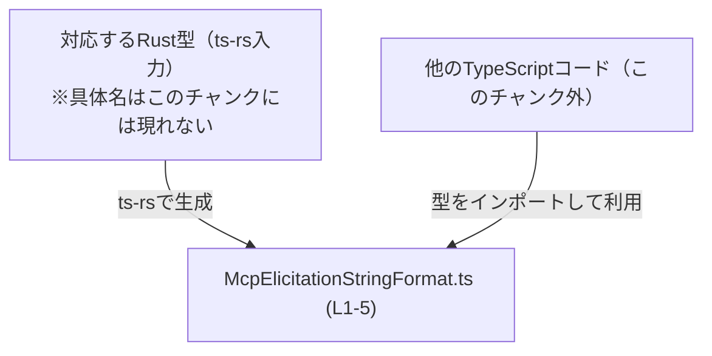
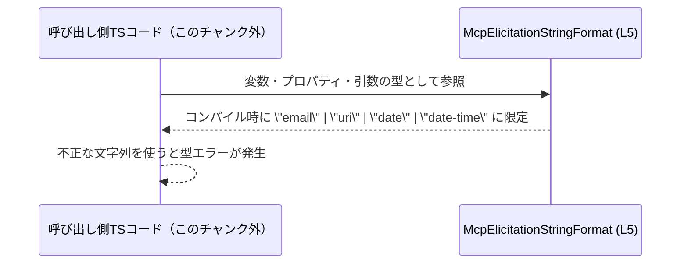

# app-server-protocol/schema/typescript/v2/McpElicitationStringFormat.ts

## 0. ざっくり一言

このファイルは、`"email" | "uri" | "date" | "date-time"` のいずれかだけを許可する文字列リテラル型 `McpElicitationStringFormat` を定義する、自動生成された TypeScript スキーマファイルです（`McpElicitationStringFormat.ts:L1-5`）。

---

## 1. このモジュールの役割

### 1.1 概要

- このモジュールは、`McpElicitationStringFormat` という **文字列リテラルのユニオン型**（複数の文字列リテラルの集合）を定義します（`McpElicitationStringFormat.ts:L5-5`）。
- 値をこの型で注釈した箇所では、コンパイル時に `"email" | "uri" | "date" | "date-time"` 以外の文字列が使われると TypeScript の型エラーになります。
- ファイル全体は `ts-rs` により Rust 側の定義から自動生成されており、手動編集は禁止されています（`McpElicitationStringFormat.ts:L1-3`）。

### 1.2 アーキテクチャ内での位置づけ

- コメントから、このファイルは Rust 向けライブラリ `ts-rs` によるコード生成物であることが分かります（`McpElicitationStringFormat.ts:L1-3`）。
- そのため、アーキテクチャ上は次のような位置づけと解釈できます（Rust 側の具体的な型名・ファイルパスはこのチャンクからは分かりません）。



- 実際にどの TypeScript ファイルがこの型をインポートしているかは、このチャンクには現れないため不明です。

### 1.3 設計上のポイント

- **自動生成コード**  
  - 冒頭コメントで「GENERATED CODE」「Do not edit this file manually」と明記されています（`McpElicitationStringFormat.ts:L1-3`）。
- **状態を持たない型定義のみ**  
  - 変数・関数・クラスなどは一切なく、**型エイリアス 1 つのみ**が公開 API になっています（`McpElicitationStringFormat.ts:L5-5`）。
- **エラーハンドリング・並行性は非対象**  
  - 実行時の処理ロジックを含まないため、このファイル自身は実行時エラーや並行性の問題を直接は持ちません。
  - 型注釈として利用されることで、**コンパイル時**に不正な文字列の利用を防ぐ役割を持ちます。

---

## 2. 主要な機能一覧

- `McpElicitationStringFormat` 型定義:  
  `"email" | "uri" | "date" | "date-time"` のいずれかに値を制限する文字列リテラル・ユニオン型を提供します（`McpElicitationStringFormat.ts:L5-5`）。

---

## 3. 公開 API と詳細解説

### 3.1 型一覧（構造体・列挙体など）

このファイルに定義される公開コンポーネントは次の 1 つです。

| 名前 | 種別 | 役割 / 用途 | 定義位置 |
|------|------|-------------|----------|
| `McpElicitationStringFormat` | 型エイリアス（文字列リテラル・ユニオン型） | `"email"`, `"uri"`, `"date"`, `"date-time"` のいずれかだけを許容する文字列型。プロパティや関数引数の型として使うことで、誤った文字列をコンパイル時に検出可能にします。 | `McpElicitationStringFormat.ts:L5-5` |

**型定義の内容**

```ts
export type McpElicitationStringFormat = "email" | "uri" | "date" | "date-time";
```

- TypeScript の文字列リテラル・ユニオン型により、値が 4 つのリテラルのどれかに**静的に制限**されます。
- 実行時にはこの型情報は消えるため、**パフォーマンス上のオーバーヘッドはありません**（TypeScript 型システムの一般的な性質による）。

**契約（Contracts）**

この型を使うコード側が暗黙に前提とする契約は次の通りです。

- 変数・プロパティ・引数などに `McpElicitationStringFormat` を指定した場合、その値は常に  
  `"email" | "uri" | "date" | "date-time"` のいずれかである。
- `null` や `undefined`、その他の任意の文字列（例: `"EMAIL"`, `"mail"`, `"http"`, 空文字 `""` など）は **許容されない**。
- 大文字小文字やスペースを含む変種は、型としては別の文字列と見なされるため、**完全一致**が必要。

**Edge cases（エッジケース）**

この型自体に関して考えられるエッジケースは次のようになります。

- `"EMAIL"` のような大文字表記 → 型不一致（コンパイルエラー）。
- `""`（空文字） → 型不一致。
- `"date "` のように末尾にスペースを含む文字列 → 型不一致。
- `null` / `undefined` → 型不一致（この型は純粋な文字列リテラルのユニオンであり、`null` や `undefined` は含まれません）。
- シリアライズ/デシリアライズ時の文字列比較は、この型だけでは保証されず、実際の値の検証は利用側のロジックに依存します。

**安全性・セキュリティ**

- この型自体は **コンパイル時のみ**存在し、実行時のデータ変換や I/O を行わないため、単独ではセキュリティ上のリスクはほぼありません。
- ただし、アプリケーションの他部分でユーザー入力をこの型にマッピングする際に、検証不足があると、意図しないブランチに入る可能性はあります（このファイルではその処理は定義されていません）。

### 3.2 関数詳細（最大 7 件）

- このファイルには **関数・メソッドは一切定義されていません**（`McpElicitationStringFormat.ts:L1-5`）。
- したがって、このセクションで詳細解説する対象はありません。

### 3.3 その他の関数

- 補助関数やラッパー関数も存在しません。

| 関数名 | 役割（1 行） |
|--------|--------------|
| なし   | このファイルには関数は定義されていません |

---

## 4. データフロー

このファイルは実行時処理を持たず、型定義のみを提供します。したがって「データがこのファイル内で処理される」という意味でのデータフローはありません。

一方で、**型レベル**では次のような「利用フロー」が想定されます（利用元コードはこのチャンクには現れませんが、一般的な TypeScript の使い方としての概念図です）。



要点:

- 実際の値は常に呼び出し側のコードが生成・保持し、このファイルは**その値の取りうる選択肢を静的に制約**するのみです。
- 実行時には `McpElicitationStringFormat` という名前のオブジェクトは存在せず、型情報は消えます。

---

## 5. 使い方（How to Use）

### 5.1 基本的な使用方法

この型をプロパティや関数引数の型として利用することで、値を 4 種類に限定できます。

```ts
// 実際の import パスはプロジェクト構成に依存します。
// ここでは同一ディレクトリにあると仮定した例です。
import type { McpElicitationStringFormat } from "./McpElicitationStringFormat";

// 質問設定などのフォーマットを表すインターフェースの例
interface QuestionConfig {
    format: McpElicitationStringFormat; // 4 種類のいずれかに限定される
}

// 正しい代入例
const emailQuestion: QuestionConfig = {
    format: "email", // OK: 型に含まれるリテラル
};

// 間違い例（コンパイルエラーになるパターン）
const invalidQuestion: QuestionConfig = {
    // @ts-expect-error: 型 '"mail"' は型 'McpElicitationStringFormat' に割り当てられません
    format: "mail",
};
```

この例のポイント:

- `QuestionConfig.format` に `"mail"` のような未定義の文字列を指定すると、**コンパイル時に型エラー**となり、実行前に誤りを検出できます。
- 実行時には追加コストは発生しません（型はコンパイルで消えるため）。

### 5.2 よくある使用パターン

#### パターン 1: 関数引数として利用する

```ts
import type { McpElicitationStringFormat } from "./McpElicitationStringFormat";

// フォーマットごとに処理を切り替える関数の例
function handleFormat(format: McpElicitationStringFormat): void {
    switch (format) {
        case "email":
            // email 用の処理
            break;
        case "uri":
            // uri 用の処理
            break;
        case "date":
            // date 用の処理
            break;
        case "date-time":
            // date-time 用の処理
            break;
        default:
            // ここには到達しないはず（形式上のフォールバック）
            // format の型が McpElicitationStringFormat である限り、
            // default に来るのは、型の不整合がある場合のみ
            const _exhaustiveCheck: never = format;
            throw new Error(`未知のフォーマット: ${format}`);
    }
}
```

- `switch` 文と組み合わせることで、**すべてのケースを網羅しているかどうか**をコンパイラにチェックさせることもできます（`default` で `never` を使ったパターン）。

#### パターン 2: オプション値との組み合わせ

```ts
import type { McpElicitationStringFormat } from "./McpElicitationStringFormat";

interface OptionalFormatConfig {
    format?: McpElicitationStringFormat; // format 自体を省略可能にする
}

const config1: OptionalFormatConfig = {};           // OK: format を指定しない
const config2: OptionalFormatConfig = { format: "uri" };  // OK: 指定する場合は 4 種類に限定
```

- 型そのものは非オプションですが、インターフェース側で `format?` とすることで、「存在する場合は 4 種類のどれか」という契約を表現できます。

### 5.3 よくある間違い

**1. 自動生成ファイルを直接編集する**

```ts
// ❌ 間違い: このファイルを直接書き換える
export type McpElicitationStringFormat = "email" | "uri" | "date";
```

- コメントに「GENERATED CODE」「Do not edit this file manually」とある通り（`McpElicitationStringFormat.ts:L1-3`）、このファイルは **手動編集してはいけません**。
- 修正が必要な場合は、**元になっている Rust 側の型定義と ts-rs 設定を変更し、再生成**する必要があります。
- 手動で変更すると、次回の自動生成で上書きされる、もしくは TypeScript と Rust の定義が不整合になる危険があります。

**2. 型に含まれない文字列を使う**

```ts
import type { McpElicitationStringFormat } from "./McpElicitationStringFormat";

// ❌ 間違い: 型に含まれないリテラル
const format: McpElicitationStringFormat = "EMAIL"; // コンパイルエラー
```

- 大文字・小文字を変えたり、スペースを含めたりすると、**別の文字列リテラルと扱われる**ため、型に合致しなくなります。

### 5.4 使用上の注意点（まとめ）

- このファイルは **自動生成**されるため、**手動で編集しないこと**（`McpElicitationStringFormat.ts:L1-3`）。
- `McpElicitationStringFormat` は `"email" | "uri" | "date" | "date-time"` のみを許容する型であり、それ以外の文字列・`null`・`undefined` はコンパイル時に弾かれます（`McpElicitationStringFormat.ts:L5-5`）。
- 実行時の検証はこの型だけでは行われないため、外部入力を扱う際は別途バリデーションロジックが必要です（このファイルにはその実装はありません）。
- 型定義だけなので、スレッド安全性やパフォーマンスへの影響はほとんどありません（TypeScript の型システムの一般的性質）。

---

## 6. 変更の仕方（How to Modify）

### 6.1 新しい機能（フォーマット）を追加する場合

このファイルは `ts-rs` により自動生成されるため（`McpElicitationStringFormat.ts:L1-3`）、**直接この型定義を変更するのではなく、元となる Rust 側の定義を変更する必要があります**。具体的な Rust ファイル名・パスはこのチャンクには現れないため不明ですが、一般的な手順は次のようになります。

1. 対応する Rust 型を特定する  
   - `ts-rs` を使っている Rust プロジェクト内に、この型に対応する struct/enum などが存在していると考えられます（名前や ts-rs の属性から特定する）。
2. Rust 側の型定義に、新しいバリアント（例: `"phone"` など）を追加する。  
   - このチャンクからは具体的な書き方は分かりません。
3. `ts-rs` によるコード生成を再実行する。  
   - ビルドスクリプトや専用コマンドで TypeScript スキーマを再生成する（具体的なコマンドはこのチャンクからは分かりません）。
4. 生成された `McpElicitationStringFormat.ts` を確認し、新しいリテラルがユニオン型に追加されていることを確かめる。

**注意点**

- 既存の文字列リテラルに変更がある場合、TypeScript 側のコンパイルエラーとして顕在化する可能性が高いため、呼び出し元の修正範囲を確認する必要があります。
- 新しい値を追加すると、その値を扱うロジック（`switch` 文など）も拡張する必要がありますが、それらはこのチャンクには現れません。

### 6.2 既存の機能を変更する場合

- `"email"` や `"uri"` など、既存リテラルの名称を変更したい場合も、同様に **Rust 側の定義を変更し、ts-rs で再生成**する前提になります。
- 既存リテラルを削除・変更することは、**型レベルの破壊的変更**（breaking change）になりうるため、影響範囲は次のように考える必要があります。

  - `McpElicitationStringFormat` を使用しているすべての TypeScript コードがコンパイルエラーになる可能性。
  - ネットワークやシリアライズ形式のプロトコルとしてこの値が使われている場合（このチャンクからは不明）、クライアント/サーバ間で仕様の同期が必要。

- このファイル内にはテストや利用箇所はないため、影響範囲の把握には **プロジェクト全体の検索**などが必要です（このチャンクでは確認できません）。

---

## 7. 関連ファイル

このチャンクから直接分かる関連はディレクトリ単位にとどまります。具体的な他ファイル名や Rust 側のパスは分かりません。

| パス | 役割 / 関係 |
|------|------------|
| `app-server-protocol/schema/typescript/v2/` | 本ファイルを含むディレクトリ。TypeScript 版のスキーマ（バージョン 2）をまとめた場所と考えられますが、他ファイルの具体名や内容はこのチャンクには現れません。 |
| （不明: 対応する Rust 側の型定義ファイル） | コメントにある通り `ts-rs` により生成されているため、Rust プロジェクト内のいずれかの型定義が元になっていますが、このチャンクからはファイルパスや型名は特定できません（`McpElicitationStringFormat.ts:L1-3`）。 |

---

### Bugs / Security / Tests / パフォーマンスに関する補足（このファイル単体の観点）

- **バグの可能性**  
  - このファイル自体は単純な型エイリアスのみであり、ロジック上のバグは含まれていません。  
  - ただし、元となる Rust 定義とこの型が不整合になると、プロトコル上の意図しない不一致が発生しうるため、生成パイプラインの整合性が重要です（パイプラインはこのチャンクには現れません）。

- **セキュリティ**  
  - 型レベルの制約のみであるため、このファイル単体が直接セキュリティリスクを生むことはほぼありません。
  - 値の検証は実行時ロジックに委ねられており、それらはこのチャンクには現れません。

- **テスト**  
  - 型定義のみなので、通常はこのファイル専用の実行時テストは不要です。
  - 代わりに、利用側のコードで `McpElicitationStringFormat` のケース分岐が期待通り動くかどうかを検証する統合テストや E2E テストが重要になります（テストコードはこのチャンクには現れません）。

- **パフォーマンス / スケーラビリティ**  
  - TypeScript の型情報はコンパイル時にのみ存在し、実行時には消えるため、この型の有無がパフォーマンスやスケーラビリティに与える影響は無視できる程度です。

- **オブザーバビリティ**  
  - ログ出力やメトリクスなどのオブザーバビリティに直接関与するコードは含まれていません。  
  - ただし、他の箇所でこの型の値（例: `"email"` など）がログに出力されることは考えられますが、その実装はこのチャンクには存在しません。
