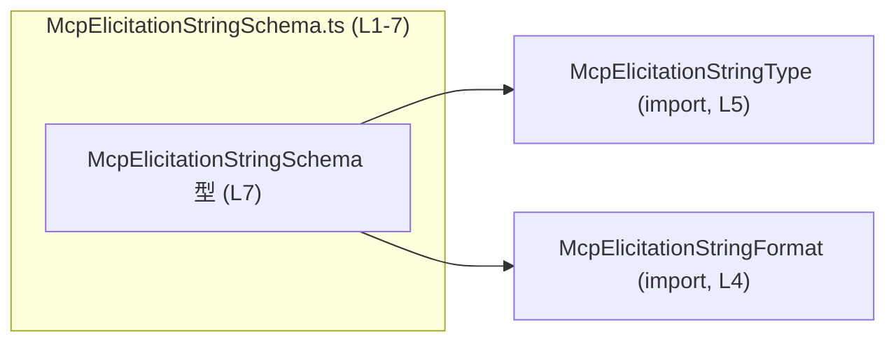
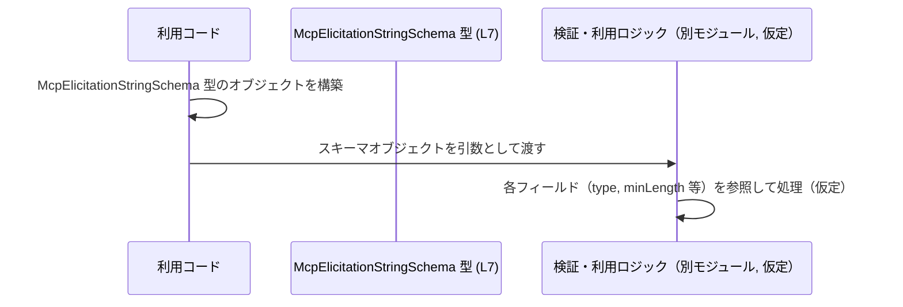

# app-server-protocol/schema/typescript/v2/McpElicitationStringSchema.ts

## 0. ざっくり一言

`McpElicitationStringSchema` という、文字列に関するスキーマ情報（型・長さ・フォーマットなど）を表す TypeScript のオブジェクト型を 1 つだけ定義している自動生成ファイルです（根拠: コメントと型定義 `McpElicitationStringSchema.ts:L1-3,7`）。

---

## 1. このモジュールの役割

### 1.1 概要

- このモジュールは、Rust から ts-rs によって生成された文字列スキーマ用の TypeScript 型定義を提供します（根拠: コメント `McpElicitationStringSchema.ts:L1-3`）。
- 具体的には、`type`（必須）と、`title`, `description`, `minLength`, `maxLength`, `format`, `default` などの任意のメタ情報を持つオブジェクト型 `McpElicitationStringSchema` を定義しています（根拠: 型定義 `McpElicitationStringSchema.ts:L7`）。

このファイルだけからは、どのモジュールがこの型を利用しているか、具体的な用途（バリデーション・UI 生成など）は分かりません。

### 1.2 アーキテクチャ内での位置づけ

このファイルは 2 つの型を「型としてのみ」インポートし、それらを使って 1 つの型エイリアスをエクスポートします（根拠: `import type` と `export type` の使用 `McpElicitationStringSchema.ts:L4-5,7`）。



- `McpElicitationStringFormat`: 文字列のフォーマット種別を表す型と推測されますが、定義はこのチャンクには現れません（根拠: 型名と import のみ `McpElicitationStringSchema.ts:L4`）。
- `McpElicitationStringType`: 文字列の種別（例: 通常の文字列、パスワードなど）を表す型と推測されますが、同様に定義は不明です（根拠: 型名と import のみ `McpElicitationStringSchema.ts:L5`）。

### 1.3 設計上のポイント

- **自動生成コード**  
  先頭コメントに「GENERATED CODE! DO NOT MODIFY BY HAND!」とあり、ts-rs によって生成されたファイルであることが明示されています（根拠: `McpElicitationStringSchema.ts:L1-3`）。  
  → 手作業による編集は想定されていません。

- **型レベル定義のみ（ランタイムロジックなし）**  
  `export type ...` だけで、関数やクラス、実行時処理は存在しません（根拠: ファイル全体の構造 `McpElicitationStringSchema.ts:L1-7`）。  
  → 型チェックや IDE 補完のための定義に特化しています。

- **`import type` の利用**  
  `import type { ... }` により、コンパイル後の JavaScript にはインポートが出力されず、純粋な型依存であることが明確です（根拠: `McpElicitationStringSchema.ts:L4-5`）。

- **必須フィールドと任意フィールドの分離**  
  - `type`: 必須  
  - `title`, `description`, `minLength`, `maxLength`, `format`, `default`: すべて `?` 付きで任意  
  （根拠: 型定義 `McpElicitationStringSchema.ts:L7`）  
  → 呼び出し側は、これらのフィールドが `undefined` である可能性を扱う必要があります。

---

## 2. 主要な機能一覧

このファイルが提供する主要な要素は 1 つです。

- `McpElicitationStringSchema` 型: 文字列に関するスキーマ情報（型・タイトル・説明・長さ制約・フォーマット・デフォルト値）を表現するオブジェクト型（根拠: `McpElicitationStringSchema.ts:L7`）。

---

## 3. 公開 API と詳細解説

### 3.1 型一覧（構造体・列挙体など）

| 名前 | 種別 | 役割 / 用途 | 定義箇所 |
|------|------|-------------|----------|
| `McpElicitationStringSchema` | 型エイリアス（オブジェクト型） | 文字列スキーマ情報を保持するオブジェクトの形を表現する | `McpElicitationStringSchema.ts:L7` |

`McpElicitationStringSchema` のフィールド構造は次の通りです（すべて 1 行に定義されていますが内容を分解しています。根拠: `McpElicitationStringSchema.ts:L7`）。

| フィールド名 | 型 | 必須/任意 | 説明（コードから読み取れる範囲） |
|--------------|----|-----------|----------------------------------|
| `type` | `McpElicitationStringType` | 必須 | 文字列スキーマの種別を表す型。具体的な定義は別ファイル。 |
| `title` | `string` | 任意 (`?`) | スキーマのタイトルやラベルと解釈できる文字列。 |
| `description` | `string` | 任意 | 説明文を表すと考えられる文字列。 |
| `minLength` | `number` | 任意 | 文字列長の下限を表す数値と解釈できる。 |
| `maxLength` | `number` | 任意 | 文字列長の上限を表す数値と解釈できる。 |
| `format` | `McpElicitationStringFormat` | 任意 | 文字列のフォーマットを示す型。定義は別ファイル。 |
| `default` | `string` | 任意 | デフォルト値となる文字列を表すと解釈できる。 |

※ 具体的な意味や制約（例: `minLength <= maxLength` の保証など）は、この型定義だけからは分かりません。

### 3.2 関数詳細

このファイルには関数定義（通常関数、メソッド、アロー関数など）は存在しません（根拠: ファイル全体 `McpElicitationStringSchema.ts:L1-7`）。

### 3.3 その他の関数

同上の理由で該当なしです。

---

## 4. データフロー

このファイル自体には実行時処理がないため、厳密な「データフロー」は存在しません。  
ここでは、「この型を使う典型的な利用イメージ」を示します。これは一般的な利用例であり、実際にこのリポジトリに同名の関数やモジュールが存在するかどうかは、このチャンクからは分かりません。

- 利用コードが `McpElicitationStringSchema` 型のオブジェクトを構築する。
- そのオブジェクトを、バリデーションロジックや UI 生成ロジックに渡す。
- 受け取った側は `minLength` / `maxLength` / `format` などのフィールドを参照して処理する。



この図は、型の典型的な役割を示す概念図であり、実在する関数・モジュール名を表すものではありません。

---

## 5. 使い方（How to Use）

### 5.1 基本的な使用方法

`McpElicitationStringSchema` を用いて、型安全にスキーマオブジェクトを記述する例です。

```typescript
// 型定義をインポートする                                    // McpElicitationStringSchema 型を利用する
import type { McpElicitationStringSchema } from "./McpElicitationStringSchema"; // 同一ディレクトリから型を読み込む
import type { McpElicitationStringType } from "./McpElicitationStringType";     // type フィールドに使う型
import type { McpElicitationStringFormat } from "./McpElicitationStringFormat"; // format フィールドに使う型

// 具体的な値はこのチャンクからは分からないため、仮の値を使う       // 実際には別モジュールで定義された定数や値を使う想定
const someType: McpElicitationStringType = undefined as unknown as McpElicitationStringType;
const someFormat: McpElicitationStringFormat = undefined as unknown as McpElicitationStringFormat;

// 文字列スキーマを定義する                                   // McpElicitationStringSchema 型に適合するオブジェクト
const schema: McpElicitationStringSchema = {                   // 型アノテーションによりプロパティの型がチェックされる
    type: someType,                                            // 必須フィールド: McpElicitationStringType 型
    title: "ユーザー名",                                       // 任意フィールド: string
    description: "ログインに使用するユーザー名",               // 任意フィールド: string
    minLength: 1,                                              // 任意フィールド: number
    maxLength: 64,                                             // 任意フィールド: number
    format: someFormat,                                        // 任意フィールド: McpElicitationStringFormat 型
    default: "guest",                                          // 任意フィールド: string
};

// schema を他の関数に渡して使用する（例）                      // 実際の処理は別モジュール側で実装される想定
// useSchema(schema);
```

このコードでは、`schema` オブジェクトが `McpElicitationStringSchema` に適合していない場合、TypeScript のコンパイラが型エラーを報告します。

### 5.2 よくある使用パターン

1. **最小限のスキーマ（必須のみ）**

```typescript
import type { McpElicitationStringSchema } from "./McpElicitationStringSchema";
import type { McpElicitationStringType } from "./McpElicitationStringType";

const someType: McpElicitationStringType = undefined as unknown as McpElicitationStringType;

// 必須フィールドのみを指定したスキーマ                         // オプションは一切指定しない例
const minimalSchema: McpElicitationStringSchema = {
    type: someType,                                           // type さえあれば型上は有効
};
```

1. **制約を詳細に指定したスキーマ**

```typescript
import type { McpElicitationStringSchema } from "./McpElicitationStringSchema";

const strictSchema: McpElicitationStringSchema = {
    type: undefined as any,    // 仮の値（実際は有効な McpElicitationStringType）
    title: "パスワード",
    minLength: 8,
    maxLength: 128,
    // format や default は用途に応じて追加
};
```

### 5.3 よくある間違い

この型定義から推測できる、起こりやすい誤用例とその修正例です。

1. **必須フィールド `type` の指定漏れ**

```typescript
import type { McpElicitationStringSchema } from "./McpElicitationStringSchema";

// 間違い例: type フィールドを定義していない                    // 必須フィールド欠如
const invalidSchema1: McpElicitationStringSchema = {
    // type: ...                                               // ← これがないとコンパイルエラー
    title: "ラベルのみ",
};
// → TypeScript のコンパイルエラー: プロパティ 'type' が不足
```

1. **フィールドの型不一致**

```typescript
import type { McpElicitationStringSchema } from "./McpElicitationStringSchema";

// 間違い例: minLength を string で指定している                 // number 型であるべきフィールド
const invalidSchema2: McpElicitationStringSchema = {
    type: undefined as any,
    minLength: "1",                                           // エラー: string を number に代入している
};

// 正しい例: number 型で指定する
const validSchema2: McpElicitationStringSchema = {
    type: undefined as any,
    minLength: 1,                                             // OK: number 型
};
```

1. **オプションフィールドを常に存在する前提で扱う**

型定義上 `minLength?` となっているため、利用コード側で `schema.minLength` を使う場合は `undefined` でないかどうかのチェックが必要になります（根拠: `?` の有無 `McpElicitationStringSchema.ts:L7`）。

### 5.4 使用上の注意点（まとめ）

- **オプションフィールドの `undefined`**  
  `title`, `description`, `minLength`, `maxLength`, `format`, `default` はすべて任意です。利用側では `undefined` を許容したロジックを組む必要があります（根拠: `?` 付き定義 `McpElicitationStringSchema.ts:L7`）。

- **数値制約の内容までは型で保証されない**  
  `minLength` や `maxLength` は単に `number` 型であり、負数でないことや `minLength <= maxLength` であることなどは、この型定義だけでは保証されません（根拠: 型が単なる `number` である点 `McpElicitationStringSchema.ts:L7`）。  
  → そうした制約が必要な場合は、別途ランタイム検証ロジックが必要になります。

- **セキュリティや並行性に関する挙動は、この型だけではわからない**  
  このファイルは型定義のみであり、I/O やスレッド操作は行っていません（根拠: 関数・クラス不在 `McpElicitationStringSchema.ts:L1-7`）。  
  → セキュリティや並行性は、この型を利用する側の実装に依存します。

---

## 6. 変更の仕方（How to Modify）

### 6.1 新しい機能を追加する場合

先頭コメントで「GENERATED CODE! DO NOT MODIFY BY HAND!」「This file was generated by ts-rs」と明示されています（根拠: `McpElicitationStringSchema.ts:L1-3`）。  
このため、このファイルそのものを直接編集して新しいフィールドや機能を追加するのは想定されていません。

一般的には次のような方針が考えられます（※生成元のコードはこのチャンクには現れません）:

1. ts-rs の生成元となっている Rust 側の型定義を変更する。
2. ts-rs のコード生成を再実行し、このファイルを再生成する。

このチャンクからは、具体的な生成元のファイル名や Rust 型名は分かりません。

### 6.2 既存の機能を変更する場合

同様に、`McpElicitationStringSchema` の構造を変えたい場合も、直接編集ではなく生成元の変更が前提と考えられます（根拠: 自動生成コメント `McpElicitationStringSchema.ts:L1-3`）。

変更時に特に注意すべき点:

- **互換性**  
  - `type` フィールドは必須であり、これを削除したり型を変えると、多くの利用コードに影響する可能性があります（根拠: 唯一の必須フィールド `McpElicitationStringSchema.ts:L7`）。
  - オプションフィールドを必須化すると、既存のオブジェクトリテラルがコンパイルエラーになる可能性があります。

- **利用箇所の確認**  
  実際にどのモジュールがこの型をインポートしているかは、このチャンクからは分かりませんが、型変更の前にはリポジトリ全体での参照を検索して影響範囲を確認することが必要になります。

---

## 7. 関連ファイル

このモジュールと直接の依存関係にあるファイルは、インポートされている型定義です（根拠: `import type` 文 `McpElicitationStringSchema.ts:L4-5`）。

| パス | 役割 / 関係 |
|------|------------|
| `./McpElicitationStringFormat` | `format` フィールドの型 `McpElicitationStringFormat` を提供する。フォーマット種別に関する定義と考えられるが、このチャンクには内容は現れません。 |
| `./McpElicitationStringType`   | `type` フィールドの型 `McpElicitationStringType` を提供する。文字列スキーマの種別を定義していると考えられるが、詳細は不明です。 |

また、コメントから、このファイルには **ts-rs による生成元の Rust ファイル** が存在することが推測されますが、その具体的なパスや型名はこのチャンクには含まれていません（根拠: `This file was generated by [ts-rs]` コメント `McpElicitationStringSchema.ts:L2-3`）。

---

### 補足: Bugs / Security / テスト / パフォーマンスに関する所見

- **バグ要因**  
  - オプションフィールドを「常に存在する」と仮定して利用側で扱うと、`undefined` による実行時エラーを招く可能性があります（根拠: `?` 付きフィールド `McpElicitationStringSchema.ts:L7`）。

- **セキュリティ**  
  - このファイル自体は型定義のみで外部入力や I/O を扱わないため、直接的なセキュリティホールは含まれていません（根拠: 実行ロジックなし `McpElicitationStringSchema.ts:L1-7`）。
  - ただし、もしこのスキーマが入力バリデーションに使われている場合、不適切な `minLength` / `maxLength` / `format` の設定は、期待したセキュリティレベルを満たさないバリデーションにつながる可能性があります（これは一般論であり、このチャンクから用途は断定できません）。

- **テスト**  
  - このファイルにはテストコードは含まれていません（根拠: テストらしき記述なし `McpElicitationStringSchema.ts:L1-7`）。  
  - 実際の検証は、この型を利用するモジュールのテストで行う設計になると考えられます。

- **パフォーマンス / 並行性**  
  - 型定義のみであり、実行時のループや I/O、非同期処理は一切含まれません（根拠: 関数・クラス不在 `McpElicitationStringSchema.ts:L1-7`）。  
  → パフォーマンスや並行性に関する懸念は、このファイルからは生じません。
