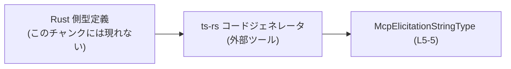
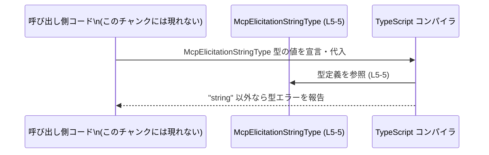

# app-server-protocol/schema/typescript/v2/McpElicitationStringType.ts

## 0. ざっくり一言

`"string"` という**文字列リテラルだけを許可する型エイリアス** `McpElicitationStringType` を公開する、自動生成された TypeScript スキーマ定義ファイルです。  
（根拠: `McpElicitationStringType.ts:L1-5`）

---

## 1. このモジュールの役割

### 1.1 概要

- このモジュールは、`McpElicitationStringType` という**エクスポートされた型エイリアス**を定義します。（根拠: `McpElicitationStringType.ts:L5-5`）
- 型の中身は `"string"` という **文字列リテラル型** であり、この型を使う箇所では `"string"` という値のみを許可します。（根拠: `McpElicitationStringType.ts:L5-5`）
- ファイル全体は `ts-rs` というツールによって Rust 側の型定義から自動生成されており、手動で編集しない前提になっています。（根拠: `McpElicitationStringType.ts:L1-3`）

### 1.2 アーキテクチャ内での位置づけ

- パス `schema/typescript/v2` から、このファイルは「アプリケーションサーバプロトコルの TypeScript スキーマ定義 v2」の一部と位置づけられます。（根拠: ファイルパス）
- このチャンクには他モジュールとの具体的な依存関係や利用箇所は現れませんが、`export type` で公開されているため、他の TypeScript コードからインポートされて使われることが想定されます。（根拠: `McpElicitationStringType.ts:L5-5`）

依存関係イメージ（コード生成フロー）:



### 1.3 設計上のポイント

- **コード生成ファイルであることが明示**されており、手作業での編集は禁止されています。（根拠: `// GENERATED CODE! DO NOT MODIFY BY HAND!` `McpElicitationStringType.ts:L1-1` および `Do not edit this file manually.` `L3-3`）
- 型定義は **単一の文字列リテラル型**に限定されているため、利用側のコードでは `"string"` 以外の値をコンパイル時に排除できます。（根拠: `export type McpElicitationStringType = "string";` `McpElicitationStringType.ts:L5-5`）
- 実行時の状態やロジックは一切持たず、純粋に**コンパイル時の型チェックのためだけのモジュール**です。（根拠: ファイル内に関数・値定義がない `McpElicitationStringType.ts:L1-5`）

---

## 2. 主要な機能一覧

- `McpElicitationStringType` 型定義: `"string"` という文字列リテラルのみを許可する型エイリアスを提供します。（根拠: `McpElicitationStringType.ts:L5-5`）

---

## 3. 公開 API と詳細解説

### 3.1 型一覧（構造体・列挙体など）

| 名前                       | 種別            | 役割 / 用途                                                                 | 根拠 (行番号)                        |
|----------------------------|-----------------|-------------------------------------------------------------------------------|--------------------------------------|
| `McpElicitationStringType` | 型エイリアス    | 値として `"string"` のみを許可する文字列リテラル型のエイリアスを定義するために用います。 | `McpElicitationStringType.ts:L5-5` |

補足:  
TypeScript における **文字列リテラル型**は、その文字列そのものだけを許可する型です。`"string"` というリテラル型は `"string"` 以外の `"foo"` などをコンパイル時にエラーにできます。

### 3.2 関数詳細（最大 7 件）

このファイルには**関数やメソッドの定義は存在しません**。（根拠: `McpElicitationStringType.ts:L1-5` に `function`・`=>` を伴う宣言がない）

したがって、本セクションで詳解すべき公開関数はありません。

### 3.3 その他の関数

- なし（このチャンクには関数定義が一切現れません）。

---

## 4. データフロー

このファイル自体は値やロジックを持たず、**コンパイル時の型情報**のみを提供します。  
そのため、データフローは「呼び出し側コードの値」が「`McpElicitationStringType` に適合するかどうか」をコンパイル時に検証される、という形になります。

### 4.1 型利用時のフロー（コンパイル時）



要点:

- 呼び出し側コードが `McpElicitationStringType` 型の変数やプロパティを宣言すると、コンパイラはこの型定義を参照します。（根拠: `export type ...` による公開 `McpElicitationStringType.ts:L5-5`）
- 代入される値が `"string"` でなければ、コンパイル時に型エラーとなります（TypeScript の文字列リテラル型の仕様による）。

---

## 5. 使い方（How to Use）

### 5.1 基本的な使用方法

`McpElicitationStringType` 型を利用した、もっとも基本的な使い方の例です。  
インポートパスは説明用の仮の例であり、実際のパスはプロジェクト構成に依存します（このチャンクからは不明です）。

```typescript
// 型エイリアスをインポートする例                      // このファイルから型を利用する側のコード例
import type { McpElicitationStringType } from "./McpElicitationStringType"; // 実際の相対パスはプロジェクト構成次第

// 正しい代入例                                      // McpElicitationStringType 型の変数を宣言
const okValue: McpElicitationStringType = "string";   // 許可されるのは "string" のみ（コンパイル OK）

// 間違った代入例（コメントアウト）                   // 別の文字列を代入するとコンパイルエラー
// const badValue: McpElicitationStringType = "other"; // エラー: "other" は "string" 型に代入できない
```

この例では、`okValue` には `"string"` を代入しているためコンパイルが通りますが、`badValue` のように `"other"` を代入すると TypeScript コンパイラが型エラーを報告します。

### 5.2 よくある使用パターン

#### パターン 1: プロトコル・メッセージのフィールドとして使う

この型はプロトコルの「種別」や「タイプ」を表すフィールドに使われることが想定されます（用途はこのチャンクには現れませんが、文字列リテラル型の一般的な利用パターンです）。

```typescript
// 型定義をインポートする                              // 型エイリアスを利用
import type { McpElicitationStringType } from "./McpElicitationStringType";

// プロトコルメッセージの例                            // あるメッセージの型を定義する例（仮）
interface ExampleMessage {                            // メッセージ全体の型
    type: McpElicitationStringType;                  // type フィールドには "string" だけを許可
    payload: string;                                 // 実際の内容（通常の string）
}

// 値を作る                                           // ExampleMessage 型の値を作成
const msg: ExampleMessage = {                        // オブジェクトリテラル
    type: "string",                                  // 許可されたリテラル
    payload: "some content",                         // 任意の文字列
};
```

### 5.3 よくある間違い

#### 間違い例: 単なる `string` として扱ってしまう

```typescript
import type { McpElicitationStringType } from "./McpElicitationStringType";

// 間違い例: any を介して型チェックを回避してしまう       // any を使うと型安全性が失われる
const unsafe: any = "other";                         // どんな型でも入る any 型
const value: McpElicitationStringType = unsafe;      // コンパイラはチェックできず、実行時まで不正値が潜む
```

正しい例は、`any` を使わずコンパイラにチェックさせることです。

```typescript
import type { McpElicitationStringType } from "./McpElicitationStringType";

// 正しい例: リテラルで直接指定する                       // コンパイル時に厳密にチェックされる
const safe: McpElicitationStringType = "string";     // "string" 以外はエラー
```

### 5.4 使用上の注意点（まとめ）

- **`"string"` 以外の値は許可されない**  
  - `McpElicitationStringType` は `"string"` という単一の文字列リテラル型です。`"foo"` や `someVariable: string` などの一般的な `string` はそのままでは代入できません。（根拠: `McpElicitationStringType.ts:L5-5`）
- **`any` や型アサーションで型チェックを回避しない**  
  - `any` や `as McpElicitationStringType` を乱用すると、本来コンパイル時に検出されるべき不正値が実行時まで残ります。
- **ファイル自体は編集しない**  
  - コメントに「手で編集するな」と明記されているため、この型を変更したい場合は Rust 側の型定義や `ts-rs` の設定を変更する必要があります。（根拠: `McpElicitationStringType.ts:L1-3`）

---

## 6. 変更の仕方（How to Modify）

### 6.1 新しい機能を追加する場合

このファイルは `ts-rs` による**自動生成ファイル**であり、先頭コメントで「手で変更しない」と明示されています。（根拠: `McpElicitationStringType.ts:L1-3`）

そのため、以下の方針が前提になります。

1. **直接このファイルにコードを追加しない**  
   - 関数や新しい型をこのファイルに書き足しても、次回のコード生成時に上書きされる可能性があります。
2. **Rust 側の元となる型定義を変更**  
   - 新しい TypeScript 型が必要な場合は、Rust の型（`ts-rs` が参照する構造体や列挙体など）を変更・追加します。  
   - ただし、その Rust コードや `ts-rs` の設定はこのチャンクには現れないため、具体的なファイル名や場所は不明です。
3. **ts-rs による再生成を実行**  
   - Rust 側を変更後、`ts-rs` のコード生成コマンドを再実行することで、このファイルが自動的に更新されます。

### 6.2 既存の機能を変更する場合

`McpElicitationStringType` の定義を `"string"` 以外も受け付けるようにしたい場合なども、同様に**生成元側を変える**必要があります。

変更時の注意点:

- **契約（Contract）の維持**  
  - 現状、この型を使うコードは「`type` フィールドなどが必ず `"string"` になる」と期待している可能性があります。この期待はこのチャンクからは直接は分かりませんが、文字列リテラル型を使っていること自体がその契約を表すことが多いです。
- **影響範囲の調査**  
  - `McpElicitationStringType` を利用している全ての TypeScript ファイルを検索し、値の比較や条件分岐（`if (type === "string")` など）が前提としているロジックへの影響を確認する必要があります。この利用箇所はこのチャンクには現れないため、別途コードベース全体を検索する必要があります。

---

## 7. 関連ファイル

このチャンクから直接参照している他ファイルはありませんが、ディレクトリ構成から推測できる範囲を整理します。

| パス                                           | 役割 / 関係 |
|----------------------------------------------|------------|
| `app-server-protocol/schema/typescript/v2/`  | 本ファイルを含む TypeScript スキーマ v2 用のディレクトリです。ここに他のスキーマ定義ファイルが存在する可能性がありますが、このチャンクには具体的なファイル一覧は現れません。 |
| Rust 側の型定義ファイル（パス不明）           | コメントにある `ts-rs` が参照する元の Rust 型定義です。`McpElicitationStringType` の生成元ですが、このチャンクには現れません。（根拠: `McpElicitationStringType.ts:L3-3`） |

---

## 付録: コンポーネントインベントリー & 契約・エッジケース・テスト・その他観点

### コンポーネントインベントリー（このチャンク内）

| 種別        | 名前                       | 説明                                                         | 根拠 (行番号)                        |
|-------------|----------------------------|--------------------------------------------------------------|--------------------------------------|
| コメント    | 自動生成ファイル警告       | 手で編集しないこと、`ts-rs` による生成であることを示すコメント | `McpElicitationStringType.ts:L1-3` |
| 型エイリアス | `McpElicitationStringType` | `"string"` という文字列リテラル型のエイリアス                | `McpElicitationStringType.ts:L5-5` |

### Bugs / Security

- **バグの可能性**  
  - このファイル単体には実行時ロジックがないため、直接的なバグの原因にはなりにくいです。
  - ただし、利用側で `any` を多用するなどして型チェックを回避すると、本来検出されるべき不正値が実行時まで残る可能性があります。
- **セキュリティ**  
  - 型定義ファイルであり、実行時の入力検証や認可などは行っていません。  
  - したがって、このファイルだけでセキュリティを保証することはできず、実行時のバリデーションは別途必要です。

### Contracts / Edge Cases

- **契約 (Contract)**  
  - `McpElicitationStringType` 型を受け取る箇所は、「値が必ず `"string"` である」という前提で実装できる契約を持ちます。（根拠: `"string"` リテラル型 `McpElicitationStringType.ts:L5-5`）
- **エッジケース**  
  - 空文字 `""` やその他の文字列 `"foo"` はコンパイル時に拒否されます。
  - `string` 型の変数をそのまま代入しようとすると、TypeScript の型推論や制約によってエラーになる場合があります（特に `noImplicitAny` などの設定が有効な場合）。

### Tests

- このチャンクにはテストコードは含まれていません。
- 一般には、こうした自動生成された型定義自体をテストするよりも、  
  - Rust 側の型と `ts-rs` の生成設定  
  - 生成された型を使うアプリケーションコードのテスト  
  を通じて、プロトコル全体の整合性を検証することが多いです。

### パフォーマンス / スケーラビリティ

- 型エイリアスのみであり、実行時には JavaScript に残らないため、このファイルが**ランタイム性能やスケーラビリティに与える影響はありません**。
- TypeScript コンパイル時の負荷も、1 行の型定義に過ぎないため無視できるレベルです。

### トレードオフ

- **利点**:  
  - 非常に厳密な型制約により `"string"` 以外の値を排除でき、誤った文字列を使うミスを防ぎます。
- **欠点**:  
  - `"string"` 以外のバージョン（たとえば `"number"` など）を追加したくなった場合、生成元や他の型との整合を慎重に調整する必要があります。

### リファクタリング / 観測性

- **リファクタリング**  
  - このファイル自体は手動でリファクタリングしません。変更は生成元（Rust + ts-rs 設定）側で行います。
- **観測性（ログ・メトリクス等）**  
  - 実行時ロジックを持たないため、ログ出力やメトリクスといった観測性の対象ではありません。
