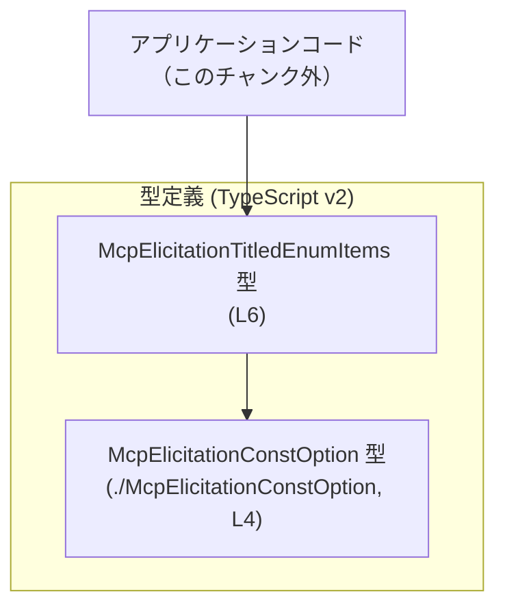

# app-server-protocol/schema/typescript/v2/McpElicitationTitledEnumItems.ts

## 0. ざっくり一言

`McpElicitationTitledEnumItems` という 1 つの型エイリアスを定義する、**ts-rs 生成の TypeScript 型定義ファイル**です（`McpElicitationTitledEnumItems.ts:L1-3, L6-6`）。  
この型は `anyOf` プロパティに `McpElicitationConstOption` の配列を持つ構造になっています（`McpElicitationTitledEnumItems.ts:L4, L6`）。

---

## 1. このモジュールの役割

### 1.1 概要

- このモジュールは、Rust 側の型から [ts-rs](https://github.com/Aleph-Alpha/ts-rs) によって自動生成された **スキーマ用の TypeScript 型定義**を提供します（`McpElicitationTitledEnumItems.ts:L1-3`）。
- 公開 API は `McpElicitationTitledEnumItems` 型エイリアス 1 つだけで、`anyOf` という配列プロパティに `McpElicitationConstOption` 型の要素を持つオブジェクト型です（`McpElicitationTitledEnumItems.ts:L4, L6`）。
- 型名・フィールド名からは「列挙的な選択肢群」を表す用途が想定されますが、**このチャンクのコードだけでは用途は断定できません**。

### 1.2 アーキテクチャ内での位置づけ

このファイルは、他のコードから利用される「型定義レイヤー」に属し、`McpElicitationConstOption` に依存しています（`McpElicitationTitledEnumItems.ts:L4, L6`）。  
呼び出し側コードや Rust 側の元定義は、このチャンクには現れません。



### 1.3 設計上のポイント

- **自動生成コード**  
  - 冒頭コメントで「GENERATED CODE」「Do not edit this file manually」と明示されています（`McpElicitationTitledEnumItems.ts:L1-3`）。
  - 設計の変更は、Rust 側の元定義を変更し ts-rs を再実行する前提の構造です（Rust 側コードはこのチャンクには現れません）。

- **型専用の依存解決**  
  - `import type { McpElicitationConstOption } from "./McpElicitationConstOption";` により、**型専用インポート**として依存しています（`McpElicitationTitledEnumItems.ts:L4`）。
  - これにより、コンパイル後の JavaScript にはこの import が出力されず、ランタイム依存が増えない構造です（TypeScript の仕様に基づく）。

- **オブジェクト型 1 つのみ**  
  - `export type McpElicitationTitledEnumItems = { anyOf: Array<McpElicitationConstOption>, };` として、`anyOf` プロパティを持つオブジェクト型を定義しています（`McpElicitationTitledEnumItems.ts:L6`）。
  - `anyOf` は **必須プロパティ**であり、`undefined` や `null` は型上許容されません（TypeScript のオブジェクト型ルールによる）。

- **実行時ロジックなし**  
  - 関数やクラスは一切定義されておらず、**コンパイル時の型安全性を提供するのみ**です（`McpElicitationTitledEnumItems.ts:L1-6`）。
  - そのため、エラー処理・並行処理などのランタイムロジックはこのファイルには存在しません。

---

## 2. 主要な機能一覧

このモジュールが提供する主要な「機能」は、型レベルの契約のみです。

- `McpElicitationTitledEnumItems` 型:  
  `anyOf: Array<McpElicitationConstOption>` を持つオブジェクト型を定義します（`McpElicitationTitledEnumItems.ts:L6`）。  
  これにより、`anyOf` 配列の各要素が `McpElicitationConstOption` 型であることを **コンパイル時に保証**できます（`McpElicitationTitledEnumItems.ts:L4, L6`）。

---

## 3. 公開 API と詳細解説

### 3.1 型一覧（構造体・列挙体など）

| 名前 | 種別 | 役割 / 用途 | 定義位置 |
|------|------|-------------|----------|
| `McpElicitationTitledEnumItems` | 型エイリアス（オブジェクト型） | `anyOf` プロパティに `McpElicitationConstOption` 型の配列を保持する構造。スキーマ上、「複数の定数オプションの集合」を表す型として利用されることが想定されますが、用途はこのチャンクからは断定できません。 | `McpElicitationTitledEnumItems.ts:L6-6` |

関連するがこのファイル外にある型:

- `McpElicitationConstOption`: `import type` で参照される別ファイル定義の型です（`McpElicitationTitledEnumItems.ts:L4`）。  
  具体的なフィールド構造はこのチャンクには現れません。

### 3.2 関数詳細（最大 7 件）

このファイルには、**関数・メソッド・クラスコンストラクタは一切定義されていません**（`McpElicitationTitledEnumItems.ts:L1-6`）。  
したがって、このセクションで詳細解説すべき公開関数はありません。

### 3.3 その他の関数

- なし（このファイル内には関数定義が存在しません）。

---

## 4. データフロー

このファイルには実行時処理はなく、型定義のみが存在するため、**ファイル単体のデータフローは定義されていません**（`McpElicitationTitledEnumItems.ts:L1-6`）。

ただし、`McpElicitationTitledEnumItems` 型がどのように利用されるかの **典型的なイメージ**を示すために、一般的な TypeScript コードでの利用例を前提としたシーケンス図を示します。  
※この図は TypeScript 型利用の典型例であり、**本リポジトリの実コードの実態はこのチャンクからは分かりません**。

```mermaid
sequenceDiagram
  %% 本図は McpElicitationTitledEnumItems 型 (L6) と McpElicitationConstOption 型 (L4) の一般的な利用イメージ

  participant Caller as 呼び出し元コード<br/>（このチャンク外）
  participant Option as McpElicitationConstOption 値<br/>（別ファイル定義）
  participant Items as McpElicitationTitledEnumItems 値<br/>(L6)

  Caller->>Option: 複数の McpElicitationConstOption を生成
  Caller->>Items: anyOf プロパティに<br/>Option の配列を設定
  Caller->>Caller: Items を使って<br/>バリデーションやシリアライズを実施（想定）
```

要点:

- コンパイル時には、`Items.anyOf` の各要素が `McpElicitationConstOption` 型であることがチェックされます（`McpElicitationTitledEnumItems.ts:L4, L6`）。
- ランタイムでは型情報は消えるため、この型定義自体は性能や並行性には影響しません（TypeScript の型消去の仕様による）。

---

## 5. 使い方（How to Use）

### 5.1 基本的な使用方法

このファイルは型定義のみなので、利用側では「インポートして型注釈に使う」形になります。  
以下は、同一ディレクトリ内からの利用を想定した一般的な例です。

```typescript
// McpElicitationTitledEnumItems 型と McpElicitationConstOption 型を型としてインポートする
import type { McpElicitationTitledEnumItems } from "./McpElicitationTitledEnumItems"; // このファイル自身を参照
import type { McpElicitationConstOption } from "./McpElicitationConstOption";          // L4 で参照されている型

// 1つの選択肢を表す定数オプションの例（実際のフィールド構造はこのチャンクからは不明）
const optionA: McpElicitationConstOption = {
  // 必要なフィールドをここに定義する（別ファイルの定義に従う）
};

// もう1つの選択肢
const optionB: McpElicitationConstOption = {
  // 必要なフィールドをここに定義する
};

// McpElicitationTitledEnumItems 型の値を作成する
const items: McpElicitationTitledEnumItems = {
  anyOf: [optionA, optionB], // anyOf プロパティに McpElicitationConstOption 配列を設定
};

// items を他の関数の引数や返り値の型として利用できる
function useItems(input: McpElicitationTitledEnumItems) {
  // input.anyOf にアクセスすると、要素は McpElicitationConstOption 型として扱える
  for (const opt of input.anyOf) {
    // opt は McpElicitationConstOption 型として型安全に扱える
  }
}
```

ポイント:

- `anyOf` プロパティは必須なので、`McpElicitationTitledEnumItems` 型の値を作るときは **必ず設定**する必要があります（`McpElicitationTitledEnumItems.ts:L6`）。
- `anyOf` の配列要素は `McpElicitationConstOption` 型以外を代入するとコンパイル時エラーになります（`McpElicitationTitledEnumItems.ts:L4, L6`）。

### 5.2 よくある使用パターン

1. **関数の引数・戻り値として使う**

```typescript
// 質問項目の定義を受け取って何らかの処理を行う関数の例
function processItems(items: McpElicitationTitledEnumItems) {
  // items.anyOf は McpElicitationConstOption[] として扱える
  const count = items.anyOf.length;
  // ...
}

// 呼び出し側
processItems({
  anyOf: [], // 空配列も型上は許容される（制約はこのチャンクからは読み取れない）
});
```

1. **API レスポンスや設定スキーマとして使う**

```typescript
// API レスポンス型の一部として利用する例
interface ElicitationResponse {
  items: McpElicitationTitledEnumItems; // items フィールドで利用
  // 他のフィールド...
}
```

### 5.3 よくある間違い

#### 1. `anyOf` を省略してしまう

```typescript
// 誤り例: anyOf プロパティが存在しない
const wrong1: McpElicitationTitledEnumItems = {
  // anyOf がないためコンパイルエラー
};
```

- `anyOf` は必須プロパティとして定義されているため、省略するとコンパイルエラーになります（`McpElicitationTitledEnumItems.ts:L6`）。

#### 2. 配列要素の型が一致していない

```typescript
// 誤り例: anyOf に文字列を入れてしまっている
const wrong2: McpElicitationTitledEnumItems = {
  anyOf: ["not const option" as any], // any を使わない限りコンパイルエラー
};
```

- `anyOf` の要素は `McpElicitationConstOption` 型に限られるため、文字列や数値など別の型を入れるとコンパイルエラーになります（`McpElicitationTitledEnumItems.ts:L4, L6`）。

#### 3. 生成ファイルを直接編集する

```typescript
// このファイル（McpElicitationTitledEnumItems.ts）を手で書き換えるのは非推奨
// GENERATED CODE! DO NOT MODIFY BY HAND! というコメントに反します
```

- 冒頭コメントにより、「手で編集しない」ことが明示されています（`McpElicitationTitledEnumItems.ts:L1-3`）。
- 直接編集すると、次回 ts-rs による再生成で上書きされる可能性があります。

### 5.4 使用上の注意点（まとめ）

- **型安全性**  
  - `anyOf` は `McpElicitationConstOption[]` として型チェックされるため、誤った型の要素をコンパイル時に検出できます（`McpElicitationTitledEnumItems.ts:L4, L6`）。
- **エッジケース（空配列など）**  
  - 型としては `anyOf: []`（空配列）も許容されます（`McpElicitationTitledEnumItems.ts:L6`）。  
    空配列を許容するかどうかはビジネスロジック側の判断であり、このチャンクからは制約は読み取れません。
- **並行性・ランタイムエラー**  
  - 型定義のみのため、このファイル自体はランタイムの並行処理やエラーに直接関与しません。
- **自動生成ファイルであること**  
  - 修正は Rust 側の元定義に対して行い、ts-rs を通じて再生成する前提です（`McpElicitationTitledEnumItems.ts:L1-3`）。

---

## 6. 変更の仕方（How to Modify）

### 6.1 新しい機能を追加する場合

このファイルは ts-rs による **自動生成コード**であり、冒頭コメントで手動編集が禁止されています（`McpElicitationTitledEnumItems.ts:L1-3`）。  
そのため、「機能追加」は基本的に **Rust 側の元型定義**で行う必要があります。

一般的な作業手順（Rust 側の具体的なファイル名・型名はこのチャンクには現れません）:

1. Rust 側で ts-rs 対応の型（`#[derive(TS)]` が付いた構造体や列挙体など）に変更・追加を行う。  
2. ts-rs のコード生成コマンドを実行し、TypeScript 側の型を再生成する。  
3. 生成された `McpElicitationTitledEnumItems.ts` を **直接は編集せず**、利用側 TypeScript コードで新しいプロパティや型を扱うロジックを追加する。

注意点:

- `anyOf` にプロパティを追加する（例: `title` など）といった変更は、Rust 側の定義と ts-rs の設定に依存し、このチャンクからは具体的なやり方は分かりません。
- 型が変わると、この型を利用している TypeScript コード全体に影響するため、利用箇所のビルドエラーを確認することが重要です。

### 6.2 既存の機能を変更する場合

`anyOf` プロパティの型や必須／任意の区別などを変更したい場合も、基本的には Rust 側での変更＋再生成になります。

変更時の観点:

- **契約（Contract）の維持・変更**  
  - `anyOf` をオプショナルにする、名前を変える、要素型を変えるなどは、API 契約の変更に相当します。  
    このファイルの型定義を利用する全てのコードが影響を受けるため、影響範囲の把握が重要です。
- **エッジケース**  
  - 型上、空配列が許容されるかどうか、`null` を許容するかどうかなどは、Rust 側での型と ts-rs の設定で決まります。現在の定義からは、`null` / `undefined` は許容されていませんが（`McpElicitationTitledEnumItems.ts:L6`）、空配列は許容されています。
- **テスト**  
  - このファイルにはテストコードは含まれていません（`McpElicitationTitledEnumItems.ts:L1-6`）。  
    動作検証は、型を利用する上位レイヤー（API レスポンス、UI ロジックなど）のテストで行う必要があります（テストコードはこのチャンクには現れません）。

---

## 7. 関連ファイル

このモジュールと密接に関係するファイル・コンポーネントは次のとおりです。

| パス / 名称 | 役割 / 関係 |
|------------|------------|
| `./McpElicitationConstOption` | `import type { McpElicitationConstOption } from "./McpElicitationConstOption";` として参照される型定義ファイルです（`McpElicitationTitledEnumItems.ts:L4`）。拡張子（`.ts` / `.d.ts` など）や具体的な中身はこのチャンクには現れません。 |
| Rust 側 ts-rs 対応型定義 | この TypeScript ファイルを生成した元の Rust 型定義です。コメントに「This file was generated by ts-rs」とあることから存在が推測されますが、具体的なファイルパスや型名はこのチャンクには現れません（`McpElicitationTitledEnumItems.ts:L1-3`）。 |
| `app-server-protocol/schema/typescript/v2/` ディレクトリ配下の他のスキーマファイル | プロトコルスキーマの v2 版 TypeScript 定義群であると考えられますが、このチャンクには具体的なファイル名・内容は現れません。 |

このファイルは型定義のみであり、バグ・セキュリティ・パフォーマンス・観測性の多くは **この型を利用する実装側** に依存します。  
型定義と実際のデータ構造が食い違わないよう、Rust 側と TypeScript 側の定義を ts-rs を通じて一貫させることが重要です。
