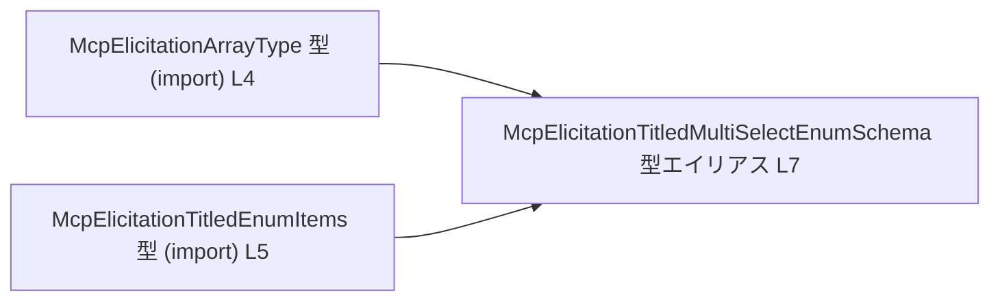
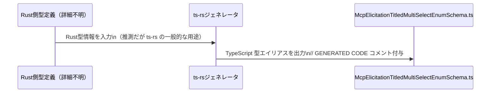
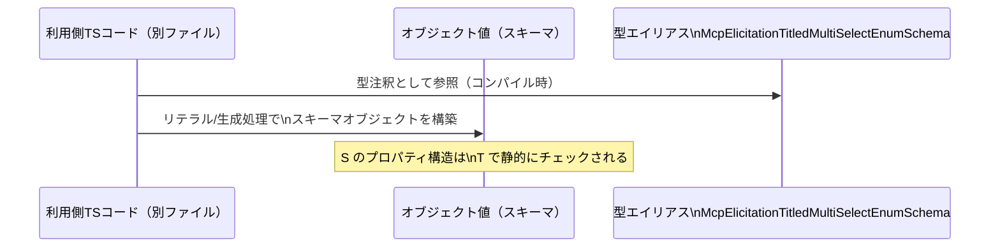

# app-server-protocol\schema\typescript\v2\McpElicitationTitledMultiSelectEnumSchema.ts

## 0. ざっくり一言

`McpElicitationTitledMultiSelectEnumSchema` は、タイトル付きの「配列ベース列挙スキーマ」を表す TypeScript の型エイリアスです（型名とフィールド構造から読み取れます `McpElicitationTitledMultiSelectEnumSchema.ts:L7`）。  
このファイルは `ts-rs` により自動生成されており、手動編集しないことが明示されています（`L1-3`）。

---

## 1. このモジュールの役割

### 1.1 概要

- Rust 側の定義から `ts-rs` により生成された、**質問/項目スキーマ** に相当するオブジェクト型エイリアスです（`L1-3, L7`）。
- 配列型 (`type`)・項目定義 (`items`)・タイトルや説明・最小/最大アイテム数・デフォルト値といったメタ情報を 1 つのオブジェクトで表現します（`L7`）。
- 実行時のロジックや関数は一切含まれず、**コンパイル時の型安全性** を提供することが主な役割です。

### 1.2 アーキテクチャ内での位置づけ

このファイル内で確認できる依存関係は、以下の 3 つの型の関係のみです。

- `McpElicitationTitledMultiSelectEnumSchema` が
  - `McpElicitationArrayType` に依存（`import type` で読み込み `L4`、フィールド `type` として使用 `L7`）
  - `McpElicitationTitledEnumItems` に依存（同様に `L5` と `L7`）



このチャンクには、`McpElicitationTitledMultiSelectEnumSchema` を利用する側のコードや、`McpElicitationArrayType` / `McpElicitationTitledEnumItems` の定義本体は現れません。

### 1.3 設計上のポイント

- **生成コードであることが明示されている**  
  - コメントで `GENERATED CODE! DO NOT MODIFY BY HAND!` と `ts-rs` による生成であることが記載されています（`L1-3`）。
  - これにより、このファイルを直接編集せず、生成元を変更する設計になっています。
- **状態を持たない純粋な型定義**  
  - クラスや関数は存在せず、1 つの型エイリアスのみを定義しています（`L7`）。
- **型レベルの必須/任意の区別**  
  - `type` と `items` は必須フィールド、それ以外は `?` によるオプショナルフィールドです（`L7`）。
- **関係制約は型では表現していない**  
  - `minItems` と `maxItems` の大小関係や、`default` の値が `items` と整合するかどうかなどは、型レベルでは表現されていません（`L7`）。  
    これらは利用側でチェックする契約になります。
- **BigInt 型の採用**  
  - `minItems` / `maxItems` に `bigint` が使われており、非常に大きな数も表現可能です（`L7`）。  
    JSON との相互運用時には注意が必要になります（詳細は「使用上の注意点」で後述します）。

---

## 2. 主要な機能一覧（コンポーネントインベントリー）

このファイルは 1 つの公開型エイリアスを提供し、その中のフィールド構造が主な「機能」です。

- `McpElicitationTitledMultiSelectEnumSchema`: 配列ベース列挙スキーマを表すオブジェクト型エイリアス（`L7`）
  - `type`: 配列型を表す `McpElicitationArrayType`（必須）（`L4, L7`）
  - `title?`: スキーマのタイトル文字列（任意）（`L7`）
  - `description?`: スキーマの説明文字列（任意）（`L7`）
  - `minItems?`: 最小アイテム数 (`bigint`)（任意）（`L7`）
  - `maxItems?`: 最大アイテム数 (`bigint`)（任意）（`L7`）
  - `items`: 列挙項目の定義集合 `McpElicitationTitledEnumItems`（必須）（`L5, L7`）
  - `default?`: デフォルト選択値の配列（`Array<string>`、任意）（`L7`）

---

## 3. 公開 API と詳細解説

### 3.1 型一覧（構造体・列挙体など）

**公開型（このファイルで定義されるもの）**

| 名前 | 種別 | 役割 / 用途 | 定義位置 |
|------|------|-------------|----------|
| `McpElicitationTitledMultiSelectEnumSchema` | 型エイリアス（オブジェクト型） | 配列型の列挙スキーマ（タイトル・説明・min/max・アイテム・デフォルト値を含む）を表す | `McpElicitationTitledMultiSelectEnumSchema.ts:L7` |

**依存型（このファイルでは定義されないもの）**

| 名前 | 種別 | 役割 / 用途（このチャンクから分かる範囲） | 参照位置 |
|------|------|-------------------------------------------|----------|
| `McpElicitationArrayType` | 型（詳細不明） | フィールド `type` の型として使用される配列関連の型 | `McpElicitationTitledMultiSelectEnumSchema.ts:L4, L7` |
| `McpElicitationTitledEnumItems` | 型（詳細不明） | フィールド `items` の型として使用される列挙項目集合 | `McpElicitationTitledMultiSelectEnumSchema.ts:L5, L7` |

**オブジェクトフィールドの詳細**

| フィールド名 | 型 | 必須/任意 | 説明（このチャンクから読み取れる範囲） | 定義位置 |
|-------------|----|-----------|-----------------------------------------|----------|
| `type` | `McpElicitationArrayType` | 必須 | 配列型を表す識別子または構造（詳細は別ファイル） | `L4, L7` |
| `title` | `string` | 任意 (`?`) | スキーマのタイトル文字列 | `L7` |
| `description` | `string` | 任意 (`?`) | スキーマの説明文字列 | `L7` |
| `minItems` | `bigint` | 任意 (`?`) | 許容される最小アイテム数 | `L7` |
| `maxItems` | `bigint` | 任意 (`?`) | 許容される最大アイテム数 | `L7` |
| `items` | `McpElicitationTitledEnumItems` | 必須 | 列挙される項目群の定義 | `L5, L7` |
| `default` | `Array<string>` | 任意 (`?`) | デフォルトで選択される要素のキーや値の配列 | `L7` |

### 3.2 関数詳細

このファイルには関数・メソッドは定義されていません（`L1-7`）。  
そのため、関数詳細テンプレートを適用すべき対象はありません。

### 3.3 その他の関数

- 該当なし（ヘルパー関数やラッパー関数も存在しません）。

---

## 4. データフロー

このファイルには実行時処理はありませんが、**「型としてのデータの流れ」** と、コメントから読み取れる「生成フロー」を整理します。

### 4.1 生成フロー（コメントから読み取れる範囲）

コメントより、このファイルは `ts-rs` により生成されています（`L1-3`）。一般的には以下のような流れになります。



- Rust 側の具体的な型名や場所は、このチャンクには現れません。
- `ts-rs` がどのようなオプションで実行されているかも不明です。

### 4.2 型としての利用フロー（概念）

`McpElicitationTitledMultiSelectEnumSchema` は、他モジュールのコードから「この形のオブジェクトを扱う」ための型として利用されると考えられます（型であるため、**コンパイル時のみ**参照されます）。



- 実際にどのファイルが `McpElicitationTitledMultiSelectEnumSchema` をインポートしているかは、このチャンクには現れません。
- ランタイムには `T` は存在せず、`S`（実際のオブジェクト）だけが存在します。

---

## 5. 使い方（How to Use）

### 5.1 基本的な使用方法

この型は **型注釈** に用いるのが基本的な使い方です。  
以下は、`McpElicitationTitledMultiSelectEnumSchema` 型の値を構築する例です。

```typescript
// 型定義をインポートする                                     // このファイルから型エイリアスを読み込む
import type { McpElicitationTitledMultiSelectEnumSchema } from "./McpElicitationTitledMultiSelectEnumSchema"; // パスは例
import type { McpElicitationArrayType } from "./McpElicitationArrayType";                                     // 型のみ参照
import type { McpElicitationTitledEnumItems } from "./McpElicitationTitledEnumItems";                         // 型のみ参照

// 実際の値はどこかで用意される想定                        // ここでは型だけ宣言し、具体値は別で定義される
declare const arrayType: McpElicitationArrayType;                       // type フィールド用の値
declare const items: McpElicitationTitledEnumItems;                     // items フィールド用の値

// スキーマオブジェクトを構築する
const schema: McpElicitationTitledMultiSelectEnumSchema = {             // スキーマの型を明示
    type: arrayType,                                                    // 必須: 配列型を表す値
    items,                                                              // 必須: 列挙項目の定義
    title: "選択してください",                                              // 任意: タイトル
    description: "複数の選択肢から選べます",                               // 任意: 説明
    minItems: 1n,                                                       // 任意: 最小数 (bigint リテラル)
    maxItems: 5n,                                                       // 任意: 最大数 (bigint リテラル)
    default: ["option-a", "option-b"],                                  // 任意: デフォルト選択
};
```

- TypeScript の型システムにより、`type` と `items` は必須であること、`minItems` / `maxItems` が `bigint` であることなどがコンパイル時にチェックされます。
- 逆に、**ランタイムでのバリデーションは一切行われません**。  
  実際のデータがこの型に適合しているかどうかは、利用側のコードで検証する必要があります。

### 5.2 よくある使用パターン

1. **関数の引数としてスキーマを受け取る**

```typescript
// スキーマを受け取り、何らかの処理をする関数を定義する
function handleSchema(schema: McpElicitationTitledMultiSelectEnumSchema) { // 引数の型注釈
    // schema.type, schema.items などを安全に参照できる
    console.log(schema.title);                                            // title は string | undefined
}
```

1. **配列で複数スキーマを扱う**

```typescript
const schemas: McpElicitationTitledMultiSelectEnumSchema[] = [];          // スキーマの配列
// schemas.push(...) で複数のスキーマを管理できる
```

### 5.3 よくある間違い

```typescript
// 間違い例: 必須フィールド items を省略している
// const invalidSchema: McpElicitationTitledMultiSelectEnumSchema = {
//     type: arrayType,
// };

// ↑ は TypeScript コンパイルエラーになる:
// Property 'items' is missing in type '{ type: ... }' but required in type 'McpElicitationTitledMultiSelectEnumSchema'.

// 正しい例: type と items を必ず指定する
const validSchema: McpElicitationTitledMultiSelectEnumSchema = {
    type: arrayType,
    items,
};
```

- このように、型定義により **必須フィールドの抜け漏れ** がコンパイル時に検出されます。
- ただし、`default` の中身が `items` に含まれていない、`minItems` > `maxItems` のような**意味的な不整合**は型レベルでは防げません（後述）。

### 5.4 使用上の注意点（まとめ）

- **BigInt と JSON の相互運用**  
  - `minItems` / `maxItems` は `bigint` 型なので、標準の `JSON.stringify` ではそのままシリアライズできません。  
    JSON 経由で送受信する場合は、文字列に変換する等の対策が必要です。
- **ランタイムバリデーションは別途必要**  
  - この型はコンパイル時にのみ存在し、**実行時に自動チェックはされません**。  
    外部から渡ってくる任意のデータ（JSON など）を受け取る場合は、Zod などのバリデーションライブラリや自前のチェックが必要です。
- **論理的な整合性は保証しない**  
  - `minItems` と `maxItems` の関係（`minItems <= maxItems`）や、`default` 配列の要素が `items` の候補と一致しているかどうかは型では保証されません。  
    これらは利用側の **契約（コントラクト）** として扱い、明示的に検証する必要があります。
- **並行性・エラー処理**  
  - このファイルには非同期処理や I/O は一切含まれず、**並行性やエラーハンドリングに関わるロジックはありません**。  
    型としての利用においては、コンパイルエラー以外のエラー要因はありません。

---

## 6. 変更の仕方（How to Modify）

### 6.1 新しい機能を追加する場合

コメントに **「GENERATED CODE! DO NOT MODIFY BY HAND!」** とあるため（`L1-3`）、この TypeScript ファイルを直接編集することは想定されていません。

- **変更の入口**
  - 追加フィールドや型の変更は、`ts-rs` の生成元（おそらく Rust 側の構造体や属性定義）を変更する必要があります。
  - その具体的な場所や名前はこのチャンクには現れないため、「どの Rust ファイルか」は不明です。
- **一般的な手順（概念的）**
  1. Rust 側の型定義にフィールドを追加・変更する。
  2. `ts-rs` を再実行して TypeScript ファイルを再生成する。
  3. 生成された `McpElicitationTitledMultiSelectEnumSchema.ts` をコミットする。

このファイルを直接編集すると、次回の自動生成で上書きされる可能性が高く、変更が失われる点に注意が必要です。

### 6.2 既存の機能を変更する場合

- **影響範囲**
  - `McpElicitationTitledMultiSelectEnumSchema` のフィールド構造を変えると、この型を参照している全ての TypeScript コードに影響します。
  - 具体的な使用箇所はこのチャンクには現れないため、別途 `grep` や IDE での参照検索が必要です。
- **契約（コントラクト）上の注意点**
  - `type` / `items` が必須という前提を崩すと、既存コードでそれを前提にしている箇所がコンパイルエラーまたはランタイムエラーになる可能性があります。
  - `minItems` / `maxItems` の型を `bigint` から `number` に変えるなどの変更は、JSON やデータベースとの連携仕様にも影響します。
- **テスト**
  - この型そのものには振る舞いがないため、テストは「この型を利用する関数やクラス」に対して書かれます。
  - 型変更後は、利用側の単体テスト・統合テストを実行し、コンパイルエラーと挙動を確認する必要があります。

---

## 7. 関連ファイル

このモジュールと直接的に関係しているファイルは、`import type` によって参照されている 2 つの型定義ファイルです。

| パス | 役割 / 関係 | 根拠 |
|------|------------|------|
| `./McpElicitationArrayType` | フィールド `type` の型として使用される配列関連の型定義ファイル（と推定されるが、内容はこのチャンクには現れない） | `import type { McpElicitationArrayType } from "./McpElicitationArrayType";`（`L4`） |
| `./McpElicitationTitledEnumItems` | フィールド `items` の型として使用される列挙項目定義ファイル（と推定されるが、内容はこのチャンクには現れない） | `import type { McpElicitationTitledEnumItems } from "./McpElicitationTitledEnumItems";`（`L5`） |

**テストコード・ユーティリティ**

- このチャンクにはテストコードや補助ユーティリティへの参照は現れません。
- テストがどこに存在するか、あるいは存在するかどうかも、このファイルだけからは分かりません。

---

### Bugs / Security / Edge Cases まとめ（この型に固有の観点）

- **潜在的なバグ要因**
  - `minItems` > `maxItems` や、`default` の要素が `items` に存在しないといった「論理的な不整合」は型レベルで表現されていないため、利用側がチェックしないとバグの原因になります。
- **セキュリティ**
  - この型自体は単なる型定義であり、危険な処理（I/O・システムコールなど）は含みません。  
    セキュリティ上の懸念は主に「このスキーマをもとにどのような UI や API を組むか」に依存し、このチャンクからは判断できません。
- **エッジケース**
  - `minItems` / `maxItems` が未設定 (`undefined`) の場合をどう扱うか、`default` が空配列または `undefined` の場合をどう扱うかは、利用側ロジックの仕様になります（このファイルでは定義されていません）。

このファイルは、純粋に「データ構造の型」を提供するだけであり、実際のエラー処理・並行性制御・ログ出力などの**オブザーバビリティ**は、すべてこの型を利用する別モジュール側の責務となります。
