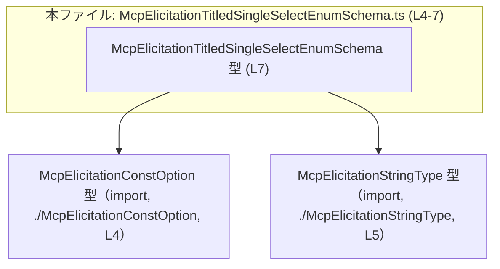
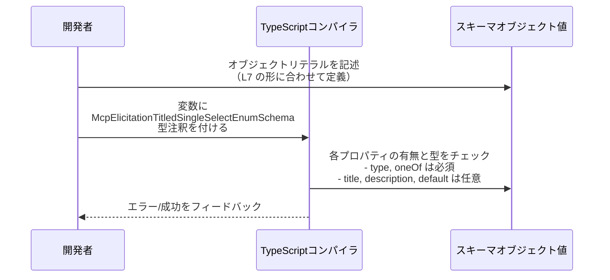

# app-server-protocol\\schema\\typescript\\v2\\McpElicitationTitledSingleSelectEnumSchema.ts

## 0. ざっくり一言

- `McpElicitationTitledSingleSelectEnumSchema` という **単一選択列挙のスキーマ** を表す TypeScript の型エイリアスを 1 つだけ定義しているファイルです（L7）。
- 選択肢リスト（`oneOf`）とタイトル・説明・デフォルト値を持つオブジェクトの形を型として表現します。

---

## 1. このモジュールの役割

### 1.1 概要

- このモジュールは、**単一選択形式の設問／パラメータのスキーマ構造**を TypeScript の型として提供します。
- フィールドは以下の 5 つです（L7）。

  - `type: McpElicitationStringType` … スキーマの型種別（必須）
  - `title?: string` … タイトル（任意）
  - `description?: string` … 説明（任意）
  - `oneOf: Array<McpElicitationConstOption>` … 選択肢の一覧（必須）
  - `default?: string` … デフォルト値（任意）

- ファイル先頭コメントにより、**ts-rs による自動生成コード**であり、手動変更は想定されていないことが明示されています（L1–3）。

  - `// GENERATED CODE! DO NOT MODIFY BY HAND!`（L1）
  - `// ... Do not edit this file manually.`（L3）

### 1.2 アーキテクチャ内での位置づけ

- このファイルは **1 つの型エイリアスをエクスポート**し（L7）、その定義は 2 つの外部型に依存しています。

  - `McpElicitationConstOption`（L4）  
  - `McpElicitationStringType`（L5）

- これら 2 つは `import type` されているため、**型情報のみを参照し、実行時の依存はありません**（L4–5）。

依存関係を Mermaid 図で示します（この図は本ファイル L4–7 に現れる依存だけを表します）。



> 補足: `McpElicitationConstOption` と `McpElicitationStringType` の中身はこのチャンクには現れないため、具体的なフィールド構造や列挙値の内容は不明です。

### 1.3 設計上のポイント

- **自動生成コード**  
  - ts-rs により生成されており、コメントで手動編集禁止が明示されています（L1–3: `GENERATED CODE` / `Do not edit`）。  
  - 実際の仕様変更は生成元（Rust 側の構造体など）で行い、再生成する運用が想定されます。

- **型専用のモジュール**  
  - すべての import が `import type` であり（L4–5）、実行時にバンドルされるコードを持たない型定義専用モジュールです。
  - そのため、このファイル単体には **実行時エラーや並行性の問題は発生しません**。

- **必須／任意フィールドの明確化**（L7）  
  - `type` と `oneOf` は必須プロパティです。  
  - `title`, `description`, `default` は `?` 付きでオプションです。

- **型レベルで表現されていない制約**  
  - `default` は単なる `string` 型であり（L7）、`oneOf` の中のどの選択肢と対応するかといった関係は型システムでは表現されていません。
  - `oneOf` の配列長に関する制約（空配列禁止など）も型では表現されていません。

- **セキュリティ・バグ観点**  
  - このファイルは型だけを定義しており、直接的な I/O や検証処理は持ちません。そのため、**このファイル由来の実行時バグや脆弱性はありません**。  
  - ただし、型が緩い部分（`default: string` など）があるため、「型上はコンパイルが通るが、実行時に意味的に不正な値」という状態は起こりえます。

---

## 2. 主要な機能一覧

このモジュールが提供する機能は、1 つの型定義に集約されています。

- `McpElicitationTitledSingleSelectEnumSchema`:  
  単一選択（single select）形式の設問／パラメータスキーマを表すオブジェクト型。タイトル・説明・選択肢（`oneOf`）・デフォルト値を持つ（L7）。

---

## 3. 公開 API と詳細解説

### 3.1 型一覧（構造体・列挙体など）

本チャンクに現れる型と、その役割・定義／参照位置を整理します。

| 名前 | 種別 | 役割 / 用途 | 定義/参照位置 |
|------|------|------------|---------------|
| `McpElicitationTitledSingleSelectEnumSchema` | 型エイリアス（オブジェクト型） | 単一選択列挙のスキーマ。`type`・`title`・`description`・`oneOf`・`default` を持つオブジェクトの形を表現する | 定義: `app-server-protocol\schema\typescript\v2\McpElicitationTitledSingleSelectEnumSchema.ts:L7-7` |
| `McpElicitationConstOption` | 型（import のみ） | `oneOf` 配列要素の型。型名から、定数的な選択肢オプションを表す型だと考えられますが、詳細構造はこのチャンクには現れません | 参照: 同上ファイル L4-4 |
| `McpElicitationStringType` | 型（import のみ） | `type` プロパティの型。型名から、文字列型に関する種別や制約を表す型であると推測されますが、具体的な定義はこのチャンクでは不明です | 参照: 同上ファイル L5-5 |

> `McpElicitationConstOption` / `McpElicitationStringType` の説明は、型名と import 名からの推測であり、実際のフィールド構造や値の種類は **このチャンクだけでは断定できません**。

### 3.2 関数詳細（最大 7 件）

- このファイルには **関数・メソッドの定義は 1 つも存在しません**。  
  - 確認根拠: ファイル内容はコメント（L1–3）、型 import（L4–5）、および `export type` 1 行（L7）のみです。

そのため、「関数詳細」テンプレートに沿って説明すべき対象はありません。

### 3.3 その他の関数

- 該当なし（本ファイルには関数・メソッド・クラスは存在しません）。

---

## 4. データフロー

このファイル自体は型定義のみであり、**内部でデータ処理は行いません**。  
ここでは、TypeScript 型としてこのスキーマがどのように関わるかの一般的なフローを示します（あくまで利用イメージであり、このリポジトリ内の具体的な呼び出しは本チャンクからは分かりません）。

### 4.1 型チェックの流れ（利用イメージ）



要点:

- このファイルで定義された型は、**コンパイル時にオブジェクト構造を検査するための契約**として機能します（L7）。
- 実行時には型情報は消えるため、**ランタイム検証やバリデーションは別の層で行われる必要があります**（このファイル内には存在しません）。

---

## 5. 使い方（How to Use）

### 5.1 基本的な使用方法

`McpElicitationTitledSingleSelectEnumSchema` 型の値を定義する基本パターンです。  
`McpElicitationConstOption` や `McpElicitationStringType` の中身は不明なので、ここでは `declare` を使って「どこかで定義済み」と仮定した安全な例にします。

```typescript
// 型定義のインポート（L4-5, L7 に対応）
import type { McpElicitationTitledSingleSelectEnumSchema } from "./McpElicitationTitledSingleSelectEnumSchema";
import type { McpElicitationConstOption } from "./McpElicitationConstOption";
import type { McpElicitationStringType } from "./McpElicitationStringType";

// どこか別の場所で具体的に定義されていると仮定する値
declare const questionType: McpElicitationStringType;   // スキーマの型種別
declare const yesOption: McpElicitationConstOption;     // 選択肢1
declare const noOption: McpElicitationConstOption;      // 選択肢2

// スキーマオブジェクトの定義
const schema: McpElicitationTitledSingleSelectEnumSchema = {
    type: questionType,                                 // 必須フィールド (L7)
    title: "続行しますか？",                             // 任意フィールド (L7)
    description: "はいを選ぶと処理を続行します。",       // 任意フィールド (L7)
    oneOf: [yesOption, noOption],                       // 必須フィールド: 選択肢リスト (L7)
    default: "yes",                                     // 任意フィールド: string 型 (L7)
};
```

このコードでは:

- `type` と `oneOf` が必須なので、これらが欠けるとコンパイルエラーになります。
- `default` は単なる `string` 型なので、`"yes"` のような任意の文字列を指定できます。  
  型レベルでは「`oneOf` と整合しているか」はチェックされません。

### 5.2 よくある使用パターン

#### パターン1: 最小限の必須フィールドのみを指定する

`title`, `description`, `default` を省略し、必須の `type` と `oneOf` だけを指定する例です。

```typescript
declare const questionType: McpElicitationStringType;
declare const option1: McpElicitationConstOption;
declare const option2: McpElicitationConstOption;

const minimalSchema: McpElicitationTitledSingleSelectEnumSchema = {
    type: questionType,          // 必須
    oneOf: [option1, option2],   // 必須
    // title, description, default は省略可能
};
```

#### パターン2: デフォルト値つきで詳細な説明を付与する

```typescript
declare const questionType: McpElicitationStringType;
declare const optionA: McpElicitationConstOption;
declare const optionB: McpElicitationConstOption;

const detailedSchema: McpElicitationTitledSingleSelectEnumSchema = {
    type: questionType,
    title: "モードを選択してください",
    description: "標準モードか拡張モードのどちらかを選択します。",
    oneOf: [optionA, optionB],
    default: "standard",      // 実際にどの文字列が妥当かはプロトコル仕様側の問題
};
```

### 5.3 よくある間違い

この型定義から推測できる、起こりやすい型エラー例を示します。

```typescript
declare const questionType: McpElicitationStringType;
declare const option1: McpElicitationConstOption;

// 間違い例1: 必須の oneOf を指定していない
const badSchema1: McpElicitationTitledSingleSelectEnumSchema = {
    type: questionType,
    // oneOf が欠けているためコンパイルエラー
    // Property 'oneOf' is missing ...
};

// 間違い例2: oneOf の要素型が違う
const badSchema2: McpElicitationTitledSingleSelectEnumSchema = {
    type: questionType,
    oneOf: ["A", "B"],   // string[] は Array<McpElicitationConstOption> と互換ではない
    // → コンパイルエラー
};

// 間違い例3: type に不正な型を入れる
const badSchema3: McpElicitationTitledSingleSelectEnumSchema = {
    type: "string",      // McpElicitationStringType ではない（と仮定）のでエラー
    oneOf: [option1],
};
```

> `McpElicitationStringType` / `McpElicitationConstOption` が実際にどのような union / interface であっても、「他の型を入れるとエラーになる」という点はこのファイルの型定義から確実に言えます（L4–5, L7）。

### 5.4 使用上の注意点（まとめ）

- **必須フィールドの欠落**  
  - `type` と `oneOf` は必須なので、省略するとコンパイルエラーになります（L7）。
- **`default` と `oneOf` の整合性**  
  - 型定義上、`default` は単なる `string` であり、`oneOf` の中身との関係は表現されていません（L7）。  
    実際のプロトコル仕様で「default は oneOf のいずれかでなければならない」という制約がある場合は、**別途ランタイムバリデーション**が必要です。
- **空の `oneOf`**  
  - 型上は `Array<McpElicitationConstOption>` なので、空配列も許容されます（L7）。  
    空配列を禁止したい場合も、型ではなく別レイヤでのチェックが必要です。
- **セキュリティ面**  
  - この型自体には I/O や文字列処理がなく、直接的な脆弱性源にはなりません。  
  - ただし、外部入力をこのスキーマにマッピングする部分（このチャンクには現れない）でのバリデーション不足には注意が必要です。
- **並行性・パフォーマンス**  
  - 型定義のみであり、実行時コストや並行性の問題はありません。

---

## 6. 変更の仕方（How to Modify）

### 6.1 新しい機能を追加する場合

このファイルには「GENERATED CODE」「Do not edit this file manually」と明記されているため（L1–3）、**直接編集は前提とされていません**。  
一般的な運用としては、以下のような手順が想定されます。

1. **生成元の定義を探す**  
   - コメントに `ts-rs` のリンクがあるため（L3）、Rust 側の構造体などに対応する定義が存在していると考えられます。
2. **生成元（Rust 側）にフィールドを追加／変更する**  
   - 例: Rust の構造体に `subtitle: Option<String>` を追加する、など（あくまで例であり、このリポジトリに実際に存在するかは不明）。
3. **ts-rs のコード生成を再実行する**  
   - これにより、`McpElicitationTitledSingleSelectEnumSchema` の TypeScript 定義（L7）が自動更新されます。
4. **影響範囲の確認**  
   - この型を参照している TypeScript コード（他ファイル）でコンパイルエラーが出ていないか確認します。

> このチャンクには Rust 側の構造体やビルドスクリプトは含まれていないため、具体的なコマンドやファイル名は不明です。

### 6.2 既存の機能を変更する場合

`McpElicitationTitledSingleSelectEnumSchema` 型のフィールドを変更すると、これを利用しているすべてのコードに影響します。

- **影響範囲の確認方法**  
  - IDE や `tsc` のエラー出力で、この型の利用箇所を洗い出します。
  - 典型的には、フォーム定義・API プロトコル記述・スキーマ検証ロジックなどが依存している可能性がありますが、具体的なファイルはこのチャンクには現れません。
- **契約（前提条件）として守るべき点**（L7 に基づく）  
  - `type` は `McpElicitationStringType` 型の値であること。
  - `oneOf` は `McpElicitationConstOption` の配列であること。
  - `title`, `description`, `default` は任意であり、変更によりこれらを必須にすると、呼び出し側で大きな修正が必要になる可能性があります。
- **テスト・バリデーション**  
  - この型の変更後は、実行時にこの型のオブジェクトを生成している箇所のテストを再実行し、特に `default` と `oneOf` の整合性など、プロトコル上の制約が守られているかを確認する必要があります（テストコードは本チャンクには現れません）。

---

## 7. 関連ファイル

このモジュールと直接的に関係するファイルは、import 先として明示されている 2 つです。

| パス | 役割 / 関係 |
|------|------------|
| `app-server-protocol\schema\typescript\v2\McpElicitationConstOption.ts` | `McpElicitationConstOption` 型の定義ファイルと推測されます（本ファイル L4-4 で `import type` されている）。`oneOf: Array<McpElicitationConstOption>` の要素の構造を決めるため、本型の実用上重要な依存先です。具体的な定義内容はこのチャンクには現れません。 |
| `app-server-protocol\schema\typescript\v2\McpElicitationStringType.ts` | `McpElicitationStringType` 型の定義ファイルと推測されます（本ファイル L5-5 で `import type` されている）。`type` プロパティにどのような値が入るかはこの型に依存します。こちらも定義内容はこのチャンクには現れません。 |

> いずれも `import type` であるため、**実行時依存ではなくコンパイル時の型依存**である点が重要です（L4–5）。
