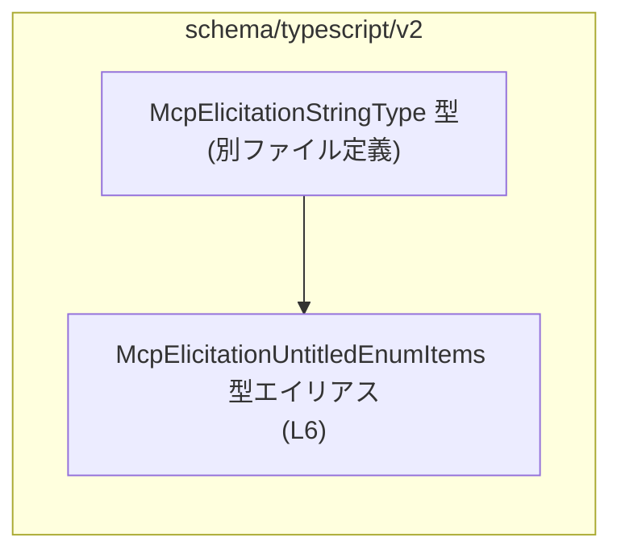
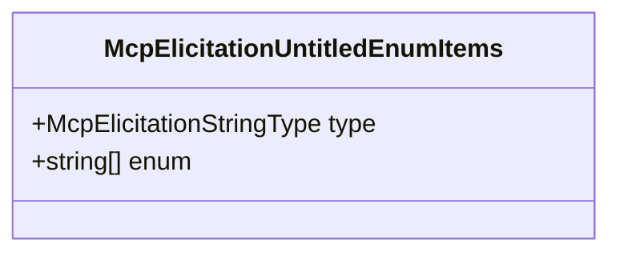

# app-server-protocol/schema/typescript/v2/McpElicitationUntitledEnumItems.ts コード解説

## 0. ざっくり一言

- `McpElicitationUntitledEnumItems` という **オブジェクト型エイリアス**を 1 つだけ定義する、自動生成された TypeScript 型定義ファイルです。  
- 文字列型に関する別定義 `McpElicitationStringType` と、`string` 配列 `enum` を組み合わせた構造を表現します。

---

## 1. このモジュールの役割

### 1.1 概要

- このモジュールは、Rust 側から `ts-rs` によって生成された **スキーマ的なオブジェクト型**を提供します（コメントより: `This file was generated by [ts-rs] ...` `McpElicitationUntitledEnumItems.ts:L1-3`）。  
- `McpElicitationUntitledEnumItems` 型は、次の 2 つのプロパティを持つオブジェクトを表します（`McpElicitationUntitledEnumItems.ts:L6`）。
  - `type`: `McpElicitationStringType` 型（別ファイルで定義、詳細はこのチャンクには現れません）
  - `enum`: `Array<string>` 型（文字列の配列）

### 1.2 アーキテクチャ内での位置づけ

- このファイルは **型だけを提供するモジュール**であり、実行時の処理や関数は含まれません。  
- `McpElicitationUntitledEnumItems` は、同じディレクトリにある `McpElicitationStringType` 型（`./McpElicitationStringType`）に依存しています（`import type` 行より `McpElicitationUntitledEnumItems.ts:L4`）。

依存関係を簡単な Mermaid 図で表すと、次のようになります（この図は `McpElicitationUntitledEnumItems.ts:L1-6` の内容に基づく静的依存関係です）。



### 1.3 設計上のポイント

- **自動生成コード**  
  - 冒頭コメントで「GENERATED CODE」「Do not edit this file manually」と明示されており（`McpElicitationUntitledEnumItems.ts:L1-3`）、人手による編集を前提としていません。
- **型専用モジュール**  
  - `import type` を使った型専用インポートです（`McpElicitationUntitledEnumItems.ts:L4`）。  
    これにより、ビルド後の JavaScript にはこのインポートが出力されず、実行時オーバーヘッドがありません。
- **シンプルな構造**  
  - 1 つの型エイリアスのみをエクスポートし（`McpElicitationUntitledEnumItems.ts:L6`）、状態やロジックを一切持ちません。
- **エラーハンドリング・並行性**  
  - 関数や実行時コードが存在しないため、このファイル自体にはエラー処理ロジック・並行処理ロジックは存在しません。  
  - 型による **コンパイル時の安全性** のみを提供します。

---

## 2. 主要な機能一覧

このモジュールが提供する「機能」は型定義 1 つだけです。

- `McpElicitationUntitledEnumItems`:  
  `type: McpElicitationStringType` と `enum: Array<string>` を持つオブジェクト型を表現する型エイリアス。

---

## 3. 公開 API と詳細解説

### 3.1 型一覧（構造体・列挙体など）

このファイル内で定義・利用されている主な型の一覧です。

| 名前 | 種別 | 定義位置 | 役割 / 用途 |
|------|------|----------|-------------|
| `McpElicitationUntitledEnumItems` | 型エイリアス | `McpElicitationUntitledEnumItems.ts:L6` | `type: McpElicitationStringType` と `enum: Array<string>` を持つオブジェクトの型。スキーマ的なメタ情報を表す用途が想定されますが、このチャンクからは目的は断定できません。 |
| `McpElicitationStringType` | 型（インポート） | `McpElicitationUntitledEnumItems.ts:L4` | 別ファイル `./McpElicitationStringType` で定義される文字列関連の型。ここでは `type` プロパティの型として使用されていることのみが分かります。 |

#### `McpElicitationUntitledEnumItems` の構造

`McpElicitationUntitledEnumItems.ts:L6` から読み取れる構造は次のとおりです。

```typescript
export type McpElicitationUntitledEnumItems = {
    type: McpElicitationStringType;
    enum: Array<string>;
};
```

- `type`  
  - 型: `McpElicitationStringType`  
  - 役割: このチャンクからは詳細不明ですが、「どのような文字列型なのか」を示すメタ情報を表している可能性があります（命名からの推測であり、コードからは断定できません）。
- `enum`  
  - 型: `Array<string>`  
  - 役割: 文字列の配列です。JSON Schema などでは「許容される列挙値リスト」として `enum` を使う慣習がありますが、このコード単体からは同じ意味かどうかは不明です。

### 3.2 関数詳細（最大 7 件）

このファイルには **関数・メソッドは一切定義されていません**（`export type` のみ `McpElicitationUntitledEnumItems.ts:L6`）。

そのため、「関数詳細」テンプレートに沿って説明できる公開関数は存在しません。

### 3.3 その他の関数

- このファイルには補助関数やラッパー関数も存在しません。

---

## 4. データフロー

このモジュールは型定義のみを提供し、実行時の処理は含まないため、「どの関数からどの関数へデータが渡るか」といった実行時データフローは、このチャンクからは分かりません。

ここでは、**TypeScript コンパイル時における型チェックの流れ**と、`McpElicitationUntitledEnumItems` 型の **フィールド間の関係** を表すイメージを示します。

### 4.1 コンパイル時の型チェックの流れ（イメージ）

以下は、開発者が `McpElicitationUntitledEnumItems` 型の値を記述したときに、TypeScript コンパイラがどのようにチェックするかの一般的なイメージです（TypeScript の動作に基づく一般的説明であり、特定の呼び出しコードはこのチャンクには現れません）。

```mermaid
sequenceDiagram
    participant Dev as "開発者コード"
    participant TS as "TypeScriptコンパイラ"

    Dev->>TS: McpElicitationUntitledEnumItems 型のオブジェクトリテラルを記述 (L6 に基づく型)
    TS-->>Dev: プロパティ `type` が<br/>McpElicitationStringType かを確認 (L4, L6)
    TS-->>Dev: プロパティ `enum` が<br/>Array&lt;string&gt; かを確認 (L6)
    TS-->>Dev: 条件を満たさない場合は型エラーを報告
```

### 4.2 型内部のデータ構造の関係

`McpElicitationUntitledEnumItems` 内部のフィールド構造を図示すると、次のようになります。



- 上記は **オブジェクト構造**のみを表しており、どこで生成・利用されるかはこのチャンクからは不明です。

---

## 5. 使い方（How to Use）

このファイルは型定義のみを提供しているため、典型的には **他の TypeScript ファイルから型としてインポートして使用**します。

### 5.1 基本的な使用方法

以下は、`McpElicitationUntitledEnumItems` 型の値を変数に代入する基本的な例です。  
`McpElicitationStringType` の具体的な値はこのチャンクには現れないため、コメントで「別定義に従う」ことを明示しています。

```typescript
// 型だけをインポートする（実行時には出力されない）                   // 型専用インポート
import type {
    McpElicitationUntitledEnumItems,                                  // このファイルで定義された型エイリアス
} from "./McpElicitationUntitledEnumItems";                           // 相対パスはプロジェクト構成に合わせて調整

import type { McpElicitationStringType } from "./McpElicitationStringType"; // `type` プロパティ用の型

// McpElicitationStringType の具体的な値の決め方は                   // ここでは詳細不明
// ./McpElicitationStringType.ts の定義に依存する                     // このチャンクには現れない
const stringType: McpElicitationStringType = /* 具体値を設定 */ null as any;

// McpElicitationUntitledEnumItems 型の値を作成する例                 // この型の基本的な利用イメージ
const items: McpElicitationUntitledEnumItems = {
    type: stringType,                                                 // `type` プロパティ: McpElicitationStringType 型
    enum: ["foo", "bar", "baz"],                                      // `enum` プロパティ: string[] 型
};
```

- TypeScript の型システムにより、`type` に `McpElicitationStringType` 以外を代入するとコンパイルエラーになります。
- 同様に、`enum` に `number[]` などを渡すとエラーになります。

### 5.2 よくある使用パターン（想定）

実際の利用コードはこのチャンクには現れませんが、このような構造の型は次のような用途で使われることが **一般的** です（用途は推測であり、このファイル単体からは確定できません）。

1. **スキーマ定義の一部としての利用**  
   - 何らかの「項目」に対して、`type` で型情報、`enum` で候補値リストを表す。

2. **UI コンポーネントへのメタ情報渡し**  
   - フォームや選択コンポーネントに対し、「この項目はこの文字列型で、この候補値を選択できる」といった情報を渡す。

いずれの場合も、実際の処理ロジックは他ファイルの関数側に存在し、この型は **コンパイル時の安全なデータ形状の表現** を担当します。

### 5.3 よくある間違い（起こりうる誤用）

この型定義から想定される誤用パターンと、その修正例を示します。

```typescript
import type {
    McpElicitationUntitledEnumItems,
} from "./McpElicitationUntitledEnumItems";

// 間違い例: enum に number[] を渡している                          // 型が一致しない
const wrongItems: McpElicitationUntitledEnumItems = {
    // type プロパティも本来は必須だが、省略している                // これもエラー
    // type: ...,
    enum: [1, 2, 3],                                                  // number[] は string[] ではない
};

// 正しい例: type を指定し、enum を string[] にする                 // 型定義に従う
const correctItems: McpElicitationUntitledEnumItems = {
    type: /* McpElicitationStringType 型の値 */ null as any,         // 詳細は別ファイル定義に従う
    enum: ["one", "two", "three"],                                    // string[] として定義
};
```

- 誤用例では、TypeScript コンパイラが
  - `type` プロパティ欠落
  - `enum` の要素型不一致  
  を検出し、コンパイル時エラーになります。

### 5.4 使用上の注意点（まとめ）

- **前提条件**
  - `type` プロパティには、必ず `McpElicitationStringType` 型の値を設定する必要があります。
  - `enum` は `string` の配列であり、`number` や `boolean` は代入できません。
- **ランタイムの安全性**
  - TypeScript の型はコンパイル時にのみ有効であり、実行時には消えます。  
    実行時に外部入力を検証したい場合は、別途バリデーションロジックが必要です。
- **エッジケース**
  - `enum` が空配列 `[]` であっても型的には許容されます（`Array<string>` は空配列も許す）。  
    空を禁止したい場合は、別途ロジックでチェックする必要があります。
  - `enum` 内の重複値（例: `["a", "a"]`）についても、型レベルでは検出されません。

---

## 6. 変更の仕方（How to Modify）

### 6.1 新しい機能を追加する場合

このファイルは `ts-rs` によって自動生成されているため、**直接編集すべきではない** ことがコメントで明示されています（`McpElicitationUntitledEnumItems.ts:L1-3`）。

新しいフィールドや機能を追加したい場合の一般的な方針は次のとおりです。

1. **生成元（Rust 側）の定義を特定する**
   - Rust の構造体や型に `ts-rs` のアトリビュートが付与されているはずですが、その場所はこのチャンクには現れないため不明です。
2. **Rust 側の型定義を変更する**
   - `enum` 以外のプロパティを追加したい、などの要望がある場合は、Rust 側のフィールドや属性を変更します。
3. **`ts-rs` を再実行して TypeScript を再生成する**
   - ビルドや専用スクリプトを通じて、TypeScript 側のファイルを再生成します。
4. **生成された TypeScript 型に基づき、呼び出し側コードを更新する**
   - 追加・変更されたプロパティに対応するよう、TypeScript の利用箇所を修正します。

### 6.2 既存の機能を変更する場合

既存の型定義を変更したい場合の注意点です。

- **影響範囲の確認**
  - `McpElicitationUntitledEnumItems` を参照している全ての TypeScript ファイルが影響を受けます。  
    参照箇所の特定にはエディタの「シンボル参照検索」などを利用します。
- **契約（前提条件）の確認**
  - `type` や `enum` の意味は、このチャンクからは明確には分かりませんが、呼び出し側コードは一定の前提に依存している可能性があります。  
    型の意味を変える変更は慎重に行う必要があります。
- **テストの確認**
  - このファイル内にはテストコードは存在しませんが、別の場所でこの型を前提としたテストが存在する可能性があります。型変更後は、それらのテストの成功を確認する必要があります。
- **性能・スケーラビリティへの影響**
  - このファイル自体はコンパイル時の型定義のみであり、実行時性能やスケーラビリティに直接影響する処理は含まれません。

---

## 7. 関連ファイル

このモジュールと密接に関係するファイルは、インポートとパスから次のように推測できます。

| パス | 役割 / 関係 |
|------|------------|
| `app-server-protocol/schema/typescript/v2/McpElicitationStringType.ts` | `McpElicitationUntitledEnumItems.ts` から `import type { McpElicitationStringType }` されている型定義ファイル（`McpElicitationUntitledEnumItems.ts:L4`）。`type` プロパティの型を提供します。 |

- その他の関連ファイル（この型を利用しているファイルなど）は、このチャンクには現れないため不明です。
