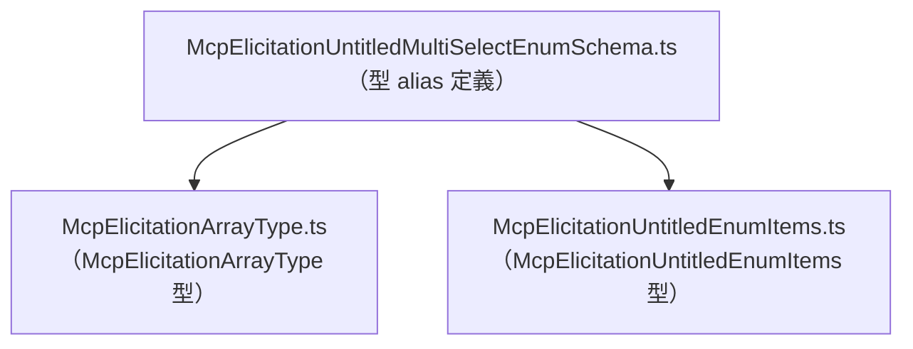
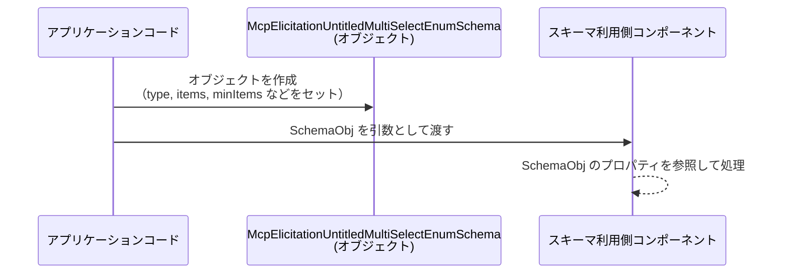

# app-server-protocol/schema/typescript/v2/McpElicitationUntitledMultiSelectEnumSchema.ts コード解説

## 0. ざっくり一言

`McpElicitationUntitledMultiSelectEnumSchema` は、配列（複数選択）形式の列挙値スキーマを表現する **型エイリアス** を定義する、TypeScript の自動生成ファイルです（`McpElicitationUntitledMultiSelectEnumSchema.ts:L1-3,7`）。

---

## 1. このモジュールの役割

### 1.1 概要

- このモジュールは、他のコードから利用される **型定義（スキーマ情報の構造）** を提供します。
- 具体的には、配列型 (`McpElicitationArrayType`) と列挙アイテム型 (`McpElicitationUntitledEnumItems`) を組み合わせたオブジェクトの構造を、`McpElicitationUntitledMultiSelectEnumSchema` という名前で表現しています（`McpElicitationUntitledMultiSelectEnumSchema.ts:L4-5,7`）。
- コメントから、このファイルは Rust から `ts-rs` によって自動生成されていることが分かります（`McpElicitationUntitledMultiSelectEnumSchema.ts:L1-3`）。

### 1.2 アーキテクチャ内での位置づけ

このモジュールは **型定義専用モジュール** であり、他モジュールからインポートされて利用されることが想定されます（実際の呼び出し元はこのチャンクには現れません）。

依存関係（このファイルから見た「使っている側」）は以下のとおりです。

- `./McpElicitationArrayType` から `McpElicitationArrayType` を型としてインポート（`import type`）（`McpElicitationUntitledMultiSelectEnumSchema.ts:L4`）
- `./McpElicitationUntitledEnumItems` から `McpElicitationUntitledEnumItems` を型としてインポート（`McpElicitationUntitledMultiSelectEnumSchema.ts:L5`）

これを Mermaid の依存関係図で表すと、次のようになります。



このチャンクには、`McpElicitationUntitledMultiSelectEnumSchema` をインポートする側のコードは現れないため、どこから利用されているかは不明です。

### 1.3 設計上のポイント

コードから読み取れる設計上の特徴は次のとおりです。

- **自動生成コード**  
  - ファイル先頭コメントで `GENERATED CODE! DO NOT MODIFY BY HAND!` と明示されています（`McpElicitationUntitledMultiSelectEnumSchema.ts:L1-3`）。
  - 変更は元となる Rust 側定義（`ts-rs` の生成元）で行うことが前提です（元定義の場所はこのチャンクにはありません）。

- **型専用モジュール**  
  - `import type` を使っており、**ランタイムには一切影響しない型参照**になっています（`McpElicitationUntitledMultiSelectEnumSchema.ts:L4-5`）。
  - エクスポートも `export type` のみで、関数やクラス、実行時コードは存在しません（`McpElicitationUntitledMultiSelectEnumSchema.ts:L7`）。

- **状態やロジックを持たない**  
  - フィールド定義のみからなるオブジェクト型であり、状態遷移や振る舞いはコード上には定義されていません（`McpElicitationUntitledMultiSelectEnumSchema.ts:L7`）。

- **オプショナルフィールドが多い構造**  
  - `title`, `description`, `minItems`, `maxItems`, `default` は `?` によりオプショナルであるため、これらが未定義のケースを呼び出し側は考慮する必要があります（`McpElicitationUntitledMultiSelectEnumSchema.ts:L7`）。

---

## 2. 主要な機能一覧

このモジュールは実行時の「機能」というより、静的な「型情報」を提供します。コードから読み取れる主な役割は次のとおりです（`McpElicitationUntitledMultiSelectEnumSchema.ts:L4-5,7`）。

- `McpElicitationUntitledMultiSelectEnumSchema` 型の提供:  
  配列型による複数選択列挙スキーマを表現するオブジェクト構造を定義する。
- 他のスキーマ関連型の合成:  
  `McpElicitationArrayType` と `McpElicitationUntitledEnumItems` をプロパティ型として利用することで、より複雑なスキーマ型を構成する。

---

## 3. 公開 API と詳細解説

### 3.1 型一覧（構造体・列挙体など）

#### このモジュールで公開される主要な型

| 名前 | 種別 | 役割 / 用途 | 根拠 |
|------|------|------------|------|
| `McpElicitationUntitledMultiSelectEnumSchema` | 型エイリアス（オブジェクト型） | 配列型のマルチセレクト列挙スキーマの構造を表現する | `McpElicitationUntitledMultiSelectEnumSchema.ts:L7` |

#### `McpElicitationUntitledMultiSelectEnumSchema` のプロパティ一覧

`McpElicitationUntitledMultiSelectEnumSchema` は次のフィールドを持つオブジェクト型です（`McpElicitationUntitledMultiSelectEnumSchema.ts:L7`）。

| フィールド名 | 型 | 必須/任意 | 説明（名前から読み取れる範囲） |
|--------------|----|-----------|--------------------------------|
| `type` | `McpElicitationArrayType` | 必須 | このスキーマがどのような配列型かを表す型。具体的内容は別ファイルの定義に依存する。 |
| `title` | `string` | 任意 (`?`) | スキーマのタイトルや表示名を表す文字列と解釈できる。 |
| `description` | `string` | 任意 (`?`) | スキーマの説明文を表す文字列と解釈できる。 |
| `minItems` | `bigint` | 任意 (`?`) | 配列要素数の下限を示す整数値と解釈できる。 |
| `maxItems` | `bigint` | 任意 (`?`) | 配列要素数の上限を示す整数値と解釈できる。 |
| `items` | `McpElicitationUntitledEnumItems` | 必須 | 列挙アイテムの集合や定義を表す型。具体的内容は別ファイルに依存する。 |
| `default` | `Array<string>` | 任意 (`?`) | デフォルト値として選択される文字列の配列と解釈できる。 |

> `McpElicitationArrayType` と `McpElicitationUntitledEnumItems` の詳細はこのチャンクには現れないため、「配列型」「列挙アイテム」といった役割は名前から推測される範囲にとどまります。

#### インポートされる型（依存コンポーネントインベントリ）

| 名前 | 由来 | 種別 | このファイル内での役割 | 根拠 |
|------|------|------|------------------------|------|
| `McpElicitationArrayType` | `"./McpElicitationArrayType"` | 型 | `type` プロパティの型として利用される | `McpElicitationUntitledMultiSelectEnumSchema.ts:L4,7` |
| `McpElicitationUntitledEnumItems` | `"./McpElicitationUntitledEnumItems"` | 型 | `items` プロパティの型として利用される | `McpElicitationUntitledMultiSelectEnumSchema.ts:L5,7` |

### 3.2 関数詳細（最大 7 件）

このファイルには **関数・メソッド定義は存在しません**（`McpElicitationUntitledMultiSelectEnumSchema.ts:L1-7` 全体に関数キーワードがない）。

そのため、「関数詳細」のテンプレートを適用すべき対象はありません。

### 3.3 その他の関数

- 補助関数やラッパー関数も一切定義されていません（`McpElicitationUntitledMultiSelectEnumSchema.ts:L1-7`）。

---

## 4. データフロー

このファイル自体には実行時ロジックがなく、明示的なデータフローは書かれていません。そのため、ここでは **この型を利用する際の典型的なデータフローの「例」** を示します。

> 注: 以下の図は、この型定義の構造から考えられる一般的な利用イメージであり、実際のコードベース内での具体的な呼び出し関係はこのチャンクからは分かりません。

### 4.1 典型的な利用イメージ（例）

想定される流れ:

1. アプリケーションコードが、何らかの設定やスキーマ情報を組み立てる。
2. そのスキーマ情報を `McpElicitationUntitledMultiSelectEnumSchema` 型として構築する。
3. 構築したオブジェクトを、別のコンポーネント（フォーム生成・バリデーションなど）に渡す。

これを sequence diagram で表すと、次のようになります。



このチャンクには `Consumer` 側の具体的な実装は存在しないため、実際にどのように使われているかは不明です。

---

## 5. 使い方（How to Use）

### 5.1 基本的な使用方法

`McpElicitationUntitledMultiSelectEnumSchema` は **型エイリアス** なので、通常は次のようにオブジェクトを定義する際の型注釈として使用します。

```typescript
// 他ファイルから型をインポートする                              // 型定義を読み込む
import type { McpElicitationArrayType } from "./McpElicitationArrayType";           // 配列型を表す型（定義は別ファイル）
import type { McpElicitationUntitledEnumItems } from "./McpElicitationUntitledEnumItems"; // 列挙アイテムを表す型（定義は別ファイル）
import type { McpElicitationUntitledMultiSelectEnumSchema } from "./McpElicitationUntitledMultiSelectEnumSchema"; // 本ファイルで定義された型

// ここでは具体的な定義が不明なため、ダミー値とコメントで示しています
const arrayType: McpElicitationArrayType = /* 配列型に対応する値 */ null as any;   // 実際には正しい値を設定する必要がある
const items: McpElicitationUntitledEnumItems = /* 列挙アイテム定義 */ null as any; // 実際には正しい値を設定する必要がある

// スキーマオブジェクトを定義する                                   // このオブジェクトは型チェックされる
const schema: McpElicitationUntitledMultiSelectEnumSchema = {                         // 型注釈により構造が保証される
    type: arrayType,                                                                  // 必須フィールド
    title: "複数選択",                                                                  // 任意フィールド（省略可能）
    description: "複数の選択肢から選ぶ項目です",                                           // 任意フィールド
    minItems: 1n,                                                                     // bigint リテラル（要素数の下限） 
    maxItems: 3n,                                                                     // bigint リテラル（要素数の上限）
    items,                                                                            // 必須フィールド
    default: ["A", "B"],                                                              // デフォルト選択値（文字列配列）
};
```

- `minItems` / `maxItems` が `bigint` 型であるため、`1` ではなく `1n` のような `bigint` リテラルを使う必要があります（`McpElicitationUntitledMultiSelectEnumSchema.ts:L7`）。
- `title`, `description`, `minItems`, `maxItems`, `default` は省略可能です。省略した場合、TypeScript 上では `undefined` も許容される型となります。

### 5.2 よくある使用パターン（例）

#### パターン 1: 最低・最大アイテム数を指定しないシンプルなスキーマ

```typescript
import type { McpElicitationUntitledMultiSelectEnumSchema } from "./McpElicitationUntitledMultiSelectEnumSchema";

const simpleSchema: McpElicitationUntitledMultiSelectEnumSchema = {
    type: arrayType,        // 必須
    items,                  // 必須
    // title, description, minItems, maxItems, default は省略
};
```

- オプショナルフィールドを指定しないことで、最小限の構造だけでスキーマを記述できます。

#### パターン 2: デフォルト選択のみを設定

```typescript
const defaultOnly: McpElicitationUntitledMultiSelectEnumSchema = {
    type: arrayType,
    items,
    default: ["option1", "option2"], // デフォルト選択
};
```

- 型定義では `default` の内容と `items` の整合性までは表現されていないため、**不整合はコンパイル時には検出されません**（後述）。

### 5.3 よくある間違い（想定されるもの）

このチャンクには利用例やテストがないため、以下は TypeScript の型とプロパティ定義から見て起こりやすい誤用例の例示です。

#### 誤り例 1: `minItems` / `maxItems` に `number` を設定してしまう

```typescript
// 間違い例: bigint ではなく number を使っている
const wrongSchema1: McpElicitationUntitledMultiSelectEnumSchema = {
    type: arrayType,
    items,
    minItems: 1,   // エラー: 型 'number' を型 'bigint' に割り当てることはできない
    maxItems: 3,   // エラー
};
```

**正しい例:**

```typescript
const correctSchema1: McpElicitationUntitledMultiSelectEnumSchema = {
    type: arrayType,
    items,
    minItems: 1n,  // OK: bigint リテラル
    maxItems: 3n,  // OK
};
```

#### 誤り例 2: `default` に文字列以外を入れてしまう

```typescript
// 間違い例: default に number を含めている
const wrongSchema2: McpElicitationUntitledMultiSelectEnumSchema = {
    type: arrayType,
    items,
    default: ["ok", 1], // エラー: 型 'number' を型 'string' に割り当てできない
};
```

**正しい例:**

```typescript
const correctSchema2: McpElicitationUntitledMultiSelectEnumSchema = {
    type: arrayType,
    items,
    default: ["ok", "also-ok"], // OK: string の配列
};
```

### 5.4 使用上の注意点（まとめ）

- **オプショナルプロパティの存在**  
  - `title`, `description`, `minItems`, `maxItems`, `default` は存在しない（`undefined`）可能性があります（`McpElicitationUntitledMultiSelectEnumSchema.ts:L7`）。
  - 利用側でこれらにアクセスする場合は、`if (schema.title) { ... }` のような存在チェックが必要になることが多いです。

- **`bigint` 型の扱い**  
  - `minItems` / `maxItems` は `bigint` 型であり、通常の `number` とは別の型です（`McpElicitationUntitledMultiSelectEnumSchema.ts:L7`）。
  - `bigint` と `number` は算術演算で混在させられないため、計算する場合はどちらかの型に統一する必要があります。

- **`default` と `items` の整合性は型では保証されない**  
  - `default` は `Array<string>` で、`items` の中身との関係（例えば「items に存在する値のみ許可」など）はこの型定義には含まれていません（`McpElicitationUntitledMultiSelectEnumSchema.ts:L7`）。
  - そのため、**不正なデフォルト値が設定されてもコンパイルエラーにはならず、実行時まで発見できない**可能性があります。別途バリデーションロジックが必要になることが想定されます（ロジック自体はこのチャンクには現れません）。

- **並行性・スレッド安全性**  
  - このモジュールは純粋な型定義のみであり実行時の状態を持たないため、並行性やスレッド安全性に関する懸念は直接は存在しません。

- **Bugs / Security 観点**  
  - 型定義自体に実行時のバグやセキュリティホールは含まれませんが、`default` と `items` の不整合など、**型では表現しきれない制約を前提に実装している場合**、利用側にバグや検証漏れが生じる余地があります。

---

## 6. 変更の仕方（How to Modify）

### 6.1 新しい機能を追加する場合

このファイルは `ts-rs` により **自動生成** されており、「手で変更するな」と明示されています（`McpElicitationUntitledMultiSelectEnumSchema.ts:L1-3`）。

そのため、新しいプロパティを追加する・型を変更するなどの拡張は、直接この TypeScript ファイルを編集せず、**生成元の Rust コード側で変更を行う**必要があります。

一般的な手順イメージ（生成元はこのチャンクには存在しないため抽象的な説明になります）:

1. Rust 側の対応する構造体または型定義にフィールドを追加・変更する。
2. `ts-rs` のコード生成を再実行して、この TypeScript ファイルを再生成する。
3. 生成された `McpElicitationUntitledMultiSelectEnumSchema` 型の変更内容に応じて、TypeScript 側の呼び出しコードを調整する。

このチャンクからは、Rust 側の具体的な型名やファイルパスは分かりません。

### 6.2 既存の機能を変更する場合

既存プロパティの型や名前を変えたい場合も、同様に **Rust 側定義を変更 → 再生成** の流れになります。

変更時に注意すべき点の観点だけ列挙すると:

- **契約（Contracts）**  
  - `type` と `items` は必須プロパティであり、この前提に依存した呼び出し側コードが存在する可能性があります。
  - これらをオプショナルに変更したり、型を変えたりする場合、既存コードとの互換性が壊れる可能性があります（互換性の有無はこのチャンクからは不明）。

- **エッジケース**  
  - `minItems` / `maxItems` の型を `bigint` から `number` に変えるなどの変更は、既存コードで `bigint` を前提とした処理（比較・計算など）に影響します。
  - `default` の型を変えると、デフォルト値を利用しているすべての箇所に影響が出ます。

- **テスト**  
  - このチャンクにはテストコードが存在しませんが、実際のプロジェクトではこの型を利用した部分のテスト（型テスト、ランタイム検証）が必要になります。

- **Refactoring 観点**  
  - この型は他のモジュールから広くインポートされている可能性があるため、リネームやフィールド削除は影響範囲が大きくなりがちです。IDE のリファクタリング機能や型エラーを手がかりに影響箇所を洗い出すのが一般的です。

- **Observability（可観測性）**  
  - このモジュール単体にはログやメトリクスなどの可観測性はありません。スキーマを使う側のコードで、入力値やスキーマ内容をログ出力するなどの対策が必要になります。

---

## 7. 関連ファイル

このモジュールと直接関係するファイルは、`import type` されている 2 つです（`McpElicitationUntitledMultiSelectEnumSchema.ts:L4-5`）。

| パス | 役割 / 関係 | 根拠 |
|------|------------|------|
| `./McpElicitationArrayType` | `McpElicitationUntitledMultiSelectEnumSchema` の `type` プロパティの型を提供する。具体的な定義内容はこのチャンクには現れない。 | `McpElicitationUntitledMultiSelectEnumSchema.ts:L4,7` |
| `./McpElicitationUntitledEnumItems` | `McpElicitationUntitledMultiSelectEnumSchema` の `items` プロパティの型を提供する。具体的な定義内容はこのチャンクには現れない。 | `McpElicitationUntitledMultiSelectEnumSchema.ts:L5,7` |

テストコードや、この型を実際に利用しているモジュールはこのチャンクには現れないため、それらとの関係やデータフローは「不明」です。

---

### まとめ

- このファイルは、Rust から `ts-rs` によって生成された **TypeScript 型定義ファイル** です（`L1-3`）。
- `McpElicitationUntitledMultiSelectEnumSchema` 型は、複数選択可能な列挙値スキーマの構造を表すオブジェクト型として設計されており、`type`, `items` を必須、その他を任意としています（`L7`）。
- 実行時ロジックや並行処理は含まれておらず、型安全性の向上と IDE 支援を目的とした静的情報を提供するモジュールになっています。
