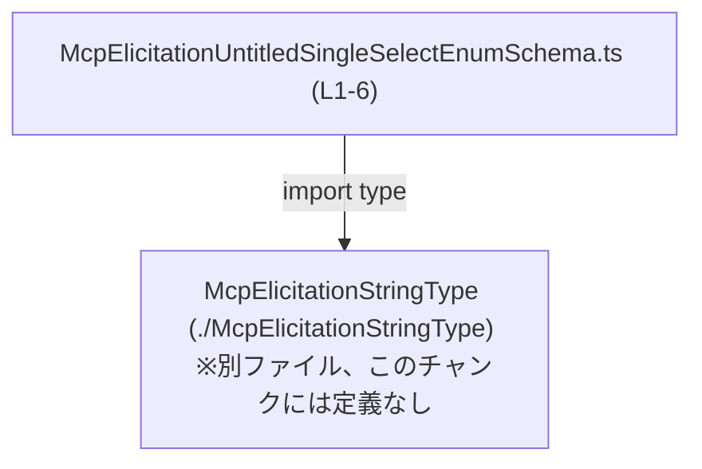
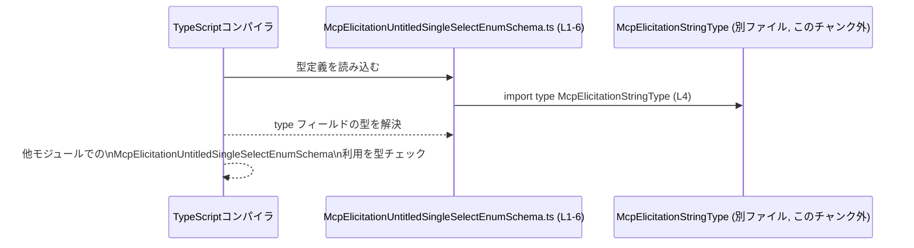

# app-server-protocol/schema/typescript/v2/McpElicitationUntitledSingleSelectEnumSchema.ts

## 0. ざっくり一言

`McpElicitationUntitledSingleSelectEnumSchema` は、**単一選択の列挙（enum）的な入力スキーマ**を表す TypeScript の型エイリアスです。  
Rust から `ts-rs` によって自動生成される「型定義専用」のファイルであり、実行時のロジックは含まれていません。（根拠: 自動生成コメントと `export type` のみで構成されているため。`McpElicitationUntitledSingleSelectEnumSchema.ts:L1-3,L6`）

---

## 1. このモジュールの役割

### 1.1 概要

- このモジュールは、`ts-rs` によって生成された **質問スキーマ用の TypeScript 型定義**を提供します。（根拠: `// GENERATED CODE! DO NOT MODIFY BY HAND!` と `This file was generated by ts-rs` コメント。`McpElicitationUntitledSingleSelectEnumSchema.ts:L1-3`）
- `McpElicitationUntitledSingleSelectEnumSchema` 型は、`type`, `title`, `description`, `enum`, `default` といったプロパティを持つオブジェクト構造を定義し、**単一選択の列挙値とそのメタデータ**を型レベルで表現しています。（根拠: 型定義のプロパティ名と型。`McpElicitationUntitledSingleSelectEnumSchema.ts:L6`）

### 1.2 アーキテクチャ内での位置づけ

- このファイルは **型定義のみを提供するモジュール**であり、実行時コードは持ちません。（根拠: `import type` と `export type` のみで、関数・クラス定義が存在しない。`McpElicitationUntitledSingleSelectEnumSchema.ts:L4,L6`）
- `McpElicitationUntitledSingleSelectEnumSchema` は、別ファイル `./McpElicitationStringType` で定義される `McpElicitationStringType` に依存しています。（根拠: `import type { McpElicitationStringType } from "./McpElicitationStringType";`。`McpElicitationUntitledSingleSelectEnumSchema.ts:L4`）
- 他のモジュールからは、この型が **型注釈（TypeScript のコンパイル時チェック用）として import されて利用**されることが想定されますが、実際の利用箇所はこのチャンクには現れません。

依存関係の概略図は次のとおりです。



### 1.3 設計上のポイント

- **自動生成コード**  
  - 冒頭のコメントにより、`ts-rs` によって生成されたコードであり、手動編集しないことが明記されています。（`McpElicitationUntitledSingleSelectEnumSchema.ts:L1-3`）
- **型専用インポート**  
  - `import type` により、`McpElicitationStringType` は型としてのみインポートされ、トランスパイル後の JavaScript には影響しません。（`McpElicitationUntitledSingleSelectEnumSchema.ts:L4`）
- **オブジェクト型のエイリアス**  
  - `export type ... = { ... }` という構造で、オブジェクトリテラル型に名前を付けています。（`McpElicitationUntitledSingleSelectEnumSchema.ts:L6`）
- **必須／任意プロパティの区別**  
  - `type` と `enum` が必須プロパティ、`title`, `description`, `default` は `?` によってオプショナルであると定義されています。（`McpElicitationUntitledSingleSelectEnumSchema.ts:L6`）
- **エラーハンドリング・並行性**  
  - 関数や実行時ロジックが一切ないため、このファイル単体ではエラー処理や並行処理に関する挙動や方針は存在しません。

---

## 2. 主要な機能一覧

このモジュールが提供する「機能」は、実行処理ではなく **型情報**です。

- `McpElicitationUntitledSingleSelectEnumSchema` 型定義:  
  単一選択の列挙値と、そのメタ情報（タイトル・説明・デフォルト値など）を表すオブジェクトの構造を定義する。（`McpElicitationUntitledSingleSelectEnumSchema.ts:L6`）

---

## 3. 公開 API と詳細解説

### 3.1 型一覧（構造体・列挙体など）

#### コンポーネントインベントリー（型）

| 名前 | 種別 | 役割 / 用途 | 行範囲 |
|------|------|-------------|--------|
| `McpElicitationUntitledSingleSelectEnumSchema` | 型エイリアス（オブジェクト型） | 単一選択列挙スキーマの型定義。`type`, 任意の `title`/`description`, 必須の `enum` 配列と任意の `default` を持つオブジェクトを表現する。 | `McpElicitationUntitledSingleSelectEnumSchema.ts:L6` |

#### 依存型一覧

| 名前 | 種別 | 役割 / 用途 | 行範囲 |
|------|------|-------------|--------|
| `McpElicitationStringType` | 型（詳細不明・別ファイル） | `type` プロパティの型として利用される文字列ベースの型。具体的な定義はこのチャンクには現れません。 | `McpElicitationUntitledSingleSelectEnumSchema.ts:L4,L6` |

#### `McpElicitationUntitledSingleSelectEnumSchema` のフィールド詳細

```ts
export type McpElicitationUntitledSingleSelectEnumSchema = {
    type: McpElicitationStringType,
    title?: string,
    description?: string,
    enum: Array<string>,
    default?: string,
};
```

（整形した形。元コードは1行にまとまっていますが、内容は同一です。`McpElicitationUntitledSingleSelectEnumSchema.ts:L6`）

**概要**

- 単一の列挙選択肢を持つエリシテーション用スキーマを表すオブジェクトの構造を型として定義しています。（名前とフィールド構造からの解釈であり、詳細仕様はこのファイルからは確定できません。`McpElicitationUntitledSingleSelectEnumSchema.ts:L6`）

**フィールド一覧**

| フィールド名 | 型 | 必須/任意 | 説明（コードから読み取れる範囲） | 根拠 |
|-------------|----|-----------|----------------------------------|------|
| `type` | `McpElicitationStringType` | 必須 | スキーマの種別を表す文字列型。具体的な値のバリエーションは別ファイル定義のため不明です。 | `McpElicitationUntitledSingleSelectEnumSchema.ts:L6` |
| `title` | `string` | 任意 | スキーマのタイトルやラベルを表す文字列と解釈できますが、用途はコードからは明示されていません。 | `McpElicitationUntitledSingleSelectEnumSchema.ts:L6` |
| `description` | `string` | 任意 | スキーマの詳細説明を表す文字列と解釈できますが、用途はコードからは明示されていません。 | `McpElicitationUntitledSingleSelectEnumSchema.ts:L6` |
| `enum` | `Array<string>` | 必須 | 選択肢の一覧を表す文字列配列です。TypeScript の型レベルでは空配列や重複要素も許容されます。 | `McpElicitationUntitledSingleSelectEnumSchema.ts:L6` |
| `default` | `string` | 任意 | デフォルト選択値を表すと考えられますが、`enum` の要素であることまでは型レベルでは保証されていません。 | `McpElicitationUntitledSingleSelectEnumSchema.ts:L6` |

**TypeScript 的なポイント**

- `?` が付いている `title`, `description`, `default` は **オプショナルプロパティ** であり、オブジェクトを作る際に省略可能です。（`McpElicitationUntitledSingleSelectEnumSchema.ts:L6`）
- `enum` は `Array<string>` として定義されており、TypeScript の組み込み `Array` 型を用いています。（`McpElicitationUntitledSingleSelectEnumSchema.ts:L6`）
- `type` は `McpElicitationStringType` であり、**一般的な string 型ではなく、別ファイル定義の型**を利用することで、より厳密な型チェックが行われます。（`McpElicitationUntitledSingleSelectEnumSchema.ts:L4,L6`）

**Examples（使用例）**

`McpElicitationUntitledSingleSelectEnumSchema` 型の値を生成し、関数に渡す例です。  
`McpElicitationStringType` の具体的な内容はこのチャンクにないため、`declare` で外部から与えられるものとして扱います。

```typescript
// 型定義のインポート（型のみ）                         // このファイルが提供する型をインポートする
import type {
    McpElicitationUntitledSingleSelectEnumSchema,      // 単一選択列挙スキーマの型
} from "./McpElicitationUntitledSingleSelectEnumSchema";

// 依存する型のインポート（型のみ）                     // type プロパティに使われる型
import type { McpElicitationStringType } from "./McpElicitationStringType";

// どこか別の場所で定義されていると仮定した値           // 具体的な値はこのファイルでは分からないため declare
declare const questionType: McpElicitationStringType;

// スキーマオブジェクトを作成する例                     // 必須項目 type, enum を指定する
const schema: McpElicitationUntitledSingleSelectEnumSchema = {
    type: questionType,                                // McpElicitationStringType 型の値
    enum: ["red", "green", "blue"],                    // 選択肢の配列
    title: "Color",                                    // 任意のタイトル
    description: "Pick one color",                     // 任意の説明
    default: "red",                                    // 任意のデフォルト値
};

// この型を引数に取る関数の例                            // コンパイル時に schema の構造がチェックされる
function handleSchema(
    s: McpElicitationUntitledSingleSelectEnumSchema,   // 間違った構造のオブジェクトはコンパイルエラーになる
) {
    console.log(s.enum);                               // enum は必須なので常に存在する
}

handleSchema(schema);                                  // 正しい型の値なので問題なく渡せる
```

### 3.2 関数詳細

このファイルには **関数・メソッド・クラスの定義は存在しません**。  
したがって、「関数詳細」テンプレートを適用すべき公開 API はありません。（根拠: `import type` と `export type` 以外に function / class / const などがない。`McpElicitationUntitledSingleSelectEnumSchema.ts:L1-6`）

### 3.3 その他の関数

- このチャンクには関数定義が一切現れません。補助関数やラッパー関数も存在しません。（`McpElicitationUntitledSingleSelectEnumSchema.ts:L1-6`）

---

## 4. データフロー

このファイルは型定義のみを含むため、**実行時のデータフロー（値の受け渡し）**はこのファイル単体からは分かりません。  
ここでは、「型として利用される際のコンパイル時のフロー」を概念的に示します。

### 概念的な型利用フロー

- TypeScript コンパイラは、本ファイルを読み込み、`McpElicitationUntitledSingleSelectEnumSchema` 型を解決します。（`McpElicitationUntitledSingleSelectEnumSchema.ts:L6`）
- その際、`McpElicitationStringType` の定義を得るために `./McpElicitationStringType` を参照します。（`McpElicitationUntitledSingleSelectEnumSchema.ts:L4`）
- 他モジュール（このチャンクには現れません）は、この型を import して変数や関数引数の型注釈に利用し、コンパイル時に構造の整合性チェックが行われます。



---

## 5. 使い方（How to Use）

### 5.1 基本的な使用方法

基本的な使い方は、**この型を import して、変数や関数引数の型として利用する**ことです。  
ファイルのコメントにある通り、このファイル自体は編集せず、あくまで読み取り専用の型定義として扱います。（`McpElicitationUntitledSingleSelectEnumSchema.ts:L1-3`）

```typescript
// 型定義をインポートする                                   // 実行時には存在しない型情報のみを読み込む
import type {
    McpElicitationUntitledSingleSelectEnumSchema,
} from "./McpElicitationUntitledSingleSelectEnumSchema";

// 依存している型も必要に応じてインポートする               // type フィールドの型
import type { McpElicitationStringType } from "./McpElicitationStringType";

// スキーマを受け取って何かを行う関数の例                   // 呼び出し側はこの型に従ったオブジェクトを渡す必要がある
function registerSingleSelectSchema(
    schema: McpElicitationUntitledSingleSelectEnumSchema,
) {
    // ここでは schema.enum や schema.default を使った処理を実装すると想定されるが、
    // このチャンクにはその実装は存在しない
    console.log(schema.enum);
}

// どこかで用意された type 値を仮定する                     // 具体的な定義はこのチャンクには現れない
declare const stringType: McpElicitationStringType;

// 呼び出し側でスキーマを構築する例                          // 型に従ってオブジェクトを組み立てる
const exampleSchema: McpElicitationUntitledSingleSelectEnumSchema = {
    type: stringType,                                      // 必須
    enum: ["A", "B", "C"],                                 // 必須
    // title, description, default は省略可能
};

registerSingleSelectSchema(exampleSchema);
```

### 5.2 よくある使用パターン

この型定義に基づく、代表的な利用パターンとして考えられるものを示します（あくまで一般的な TypeScript の使い方であり、実際の利用コードはこのチャンクには現れません）。

1. **設定オブジェクトの型として利用する**  
   - 質問スキーマやフォーム定義の設定ファイルを読み込んだ後、その設定オブジェクトに対してこの型を適用し、型チェックを行う。
2. **API クライアント／サーバー間の契約として利用する**  
   - Rust 側の型から `ts-rs` で生成されているため、Rust と TypeScript 間で共有されるデータ構造の契約として機能することが想定できます。（ただし具体的な Rust 側の定義はこのチャンクには現れません。`McpElicitationUntitledSingleSelectEnumSchema.ts:L1-3`）

### 5.3 よくある間違い

この型に対して起こりうる誤用と、その結果（コンパイル時エラーになる）を示します。

```typescript
import type {
    McpElicitationUntitledSingleSelectEnumSchema,
} from "./McpElicitationUntitledSingleSelectEnumSchema";

// 間違い例: 必須プロパティ enum を指定していない
const wrongSchema1: McpElicitationUntitledSingleSelectEnumSchema = {
    // type も enum もないため、コンパイルエラーになる
    // 型の要求するプロパティが不足している
    // title: "Only title", // これだけでは型を満たさない
};

// 間違い例: type プロパティの型が不正（仮に string を直接指定している場合）
const wrongSchema2: McpElicitationUntitledSingleSelectEnumSchema = {
    // McpElicitationStringType ではなく単なる string を使うと
    // 型が一致せずコンパイルエラーになる可能性がある
    // ここでは具体的な McpElicitationStringType の定義が不明なため、
    // 実際に許容される文字列はこのチャンクからは判断できない
    // @ts-expect-error: デモ用。実際にはコンパイラによりエラーになる可能性がある。
    type: "some-string",
    enum: ["A", "B"],
};

// 正しい例: 必須プロパティを満たしている
declare const someType: import("./McpElicitationStringType").McpElicitationStringType;

const correctSchema: McpElicitationUntitledSingleSelectEnumSchema = {
    type: someType,              // 正しい型
    enum: ["A", "B"],            // 必須プロパティ
};
```

### 5.4 使用上の注意点（まとめ）

- **このファイルは編集しない**  
  - 冒頭に「GENERATED CODE! DO NOT MODIFY BY HAND!」とあり、`ts-rs` により生成されることが明記されています。編集する必要がある場合は、元となる Rust 側の定義や生成設定を変更する必要があります。（`McpElicitationUntitledSingleSelectEnumSchema.ts:L1-3`）
- **`type` フィールドの値**  
  - `type` は `McpElicitationStringType` 型であり、普通の `string` ではない可能性があります。そのため、リテラル文字列を直接書くとコンパイルエラーになる場合があります。（`McpElicitationUntitledSingleSelectEnumSchema.ts:L4,L6`）
- **`default` の一貫性は型レベルでは保証されない**  
  - `default` は単なる `string` 型であり、`enum` 配列の値と一致しているかどうかは TypeScript 型ではチェックされません。この一貫性チェックは、もし必要であれば実行時ロジック側で行う必要があります。（`McpElicitationUntitledSingleSelectEnumSchema.ts:L6`）
- **エラー処理・並行性**  
  - 本ファイルは型定義のみであり、エラーハンドリングや並行処理に関する実装は一切含まれていません。これらは本型を利用するロジック側の責務になります。

---

## 6. 変更の仕方（How to Modify）

### 6.1 新しい機能を追加する場合

このファイルは自動生成コードであり、**直接の編集は推奨されません**。（`McpElicitationUntitledSingleSelectEnumSchema.ts:L1-3`）  
新しいフィールドや機能を追加したい場合の一般的な手順は次のとおりです（元となる Rust 側や生成設定はこのチャンクには現れないため、あくまで一般論です）。

1. **Rust 側の元型を変更する**  
   - `ts-rs` が参照している Rust の構造体や型定義に、新たなフィールドを追加・変更する。
2. **`ts-rs` による再生成を行う**  
   - ビルドスクリプトやコマンドを通じて TypeScript コードを再生成し、このファイルを更新する。
3. **TypeScript 側の利用コードを更新する**  
   - 追加されたフィールドを利用するコードを必要に応じて修正する。

このチャンクには Rust 側のファイルパスや生成手順は現れないため、実際の変更方法はリポジトリ全体のビルド手順に依存します。

もし TypeScript 側で追加情報を持たせたいが自動生成を変えたくない場合は、次のように「拡張型」を別ファイルに作る方法もあります。

```typescript
import type {
    McpElicitationUntitledSingleSelectEnumSchema,
} from "./McpElicitationUntitledSingleSelectEnumSchema";

// 既存の生成型を拡張する例                             // 生成コードはそのまま、利用側で拡張する
export type ExtendedSingleSelectSchema =
    McpElicitationUntitledSingleSelectEnumSchema & {
        uiHint?: string;                                 // 追加の UI 用情報（例）
    };
```

### 6.2 既存の機能を変更する場合

- **直接編集しない**  
  - コメントにある通り、手動変更は再生成時に上書きされる可能性があります。（`McpElicitationUntitledSingleSelectEnumSchema.ts:L1-3`）
- **影響範囲の確認**  
  - `type` や `enum` の型が変わると、この型を利用している TypeScript コード全体にコンパイルエラーが波及します。
- **契約の確認（前提条件・返り値の意味など）**  
  - この型は Rust 側との「契約」となっている可能性が高いため、Rust 側と TypeScript 側の両方で意味が一致しているかを確認する必要があります（ただし Rust 側の定義はこのチャンクには現れません）。
- **テスト**  
  - このファイル内にはテストコードはありません。（`McpElicitationUntitledSingleSelectEnumSchema.ts:L1-6`）  
    型変更後は、型を利用しているユニットテストや統合テスト側でコンパイル／実行確認を行う必要があります。

---

## 7. 関連ファイル

このモジュールと密接に関係するファイル・ディレクトリ（このチャンクから分かる範囲）は次のとおりです。

| パス | 役割 / 関係 |
|------|------------|
| `app-server-protocol/schema/typescript/v2/McpElicitationStringType.ts`（推定） | `import type { McpElicitationStringType } from "./McpElicitationStringType";` に対応するファイルと推定されます。`type` プロパティの型定義を提供しますが、このチャンクにはその中身は現れません。（`McpElicitationUntitledSingleSelectEnumSchema.ts:L4`） |
| Rust 側の元定義ファイル（パス不明） | 冒頭コメントから、この TypeScript 型は `ts-rs` により Rust の型から生成されていることが分かります。元となる Rust の構造体・型定義がどこにあるかは、このチャンクからは分かりません。（`McpElicitationUntitledSingleSelectEnumSchema.ts:L1-3`） |

---

### Bugs / Security / Edge Cases（補足）

- **Bugs**  
  - このファイルは型定義のみであり、実行時ロジックが無いため、直接的なバグ（誤った計算など）は存在しません。
- **Security**  
  - 実行時コードを含まないため、このファイル自身が直接攻撃ベクトルになることはありません。  
    ただし、`default` が `enum` に含まれるかどうかなどの一貫性は型レベルでは保証されないため、入力検証ロジック（別モジュール）側で対処する必要があります。（`McpElicitationUntitledSingleSelectEnumSchema.ts:L6`）
- **Edge Cases（型としてのエッジケース）**  
  - `enum: []` のような空配列も型としては許容されます。  
  - `default` が `enum` に含まれない文字列でもコンパイルは通ります。  
  - `title` / `description` / `default` は省略可能であり、未定義状態（`undefined`）を取り得ます。  
  これらはすべて型定義上の許容範囲であり、実際に許容するかどうかは利用側のロジック次第です。

以上が、このチャンクに含まれる `McpElicitationUntitledSingleSelectEnumSchema.ts` の構造・役割・利用方法の整理です。
