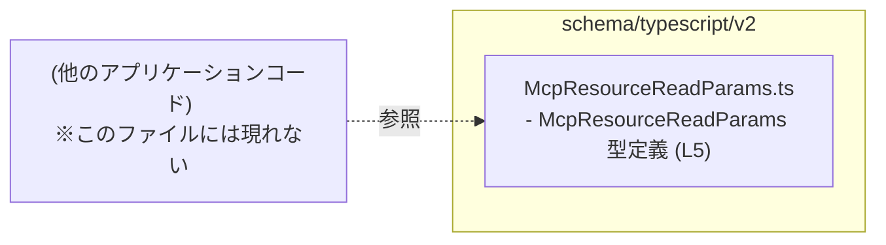
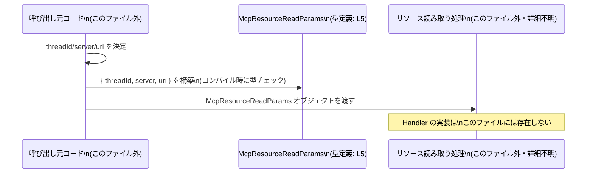

# app-server-protocol\schema\typescript\v2\McpResourceReadParams.ts コード解説

## 0. ざっくり一言

`McpResourceReadParams.ts` は、`McpResourceReadParams` という **3つの文字列プロパティを持つパラメータ用オブジェクト型**を 1 つだけ公開する、自動生成された TypeScript 型定義ファイルです（`McpResourceReadParams.ts:L1-5`）。

---

## 1. このモジュールの役割

### 1.1 概要

- このモジュールは、`McpResourceReadParams` というオブジェクト型を定義し、外部から利用できるようにエクスポートしています（`McpResourceReadParams.ts:L5`）。
- 型名とファイルパスから考えると、「MCP リソース読み取り」に関するパラメータをまとめる用途が想定されますが、その具体的な使われ方はこのファイルからは分かりません（命名からの推測であり、コード上の事実ではありません）。
- ファイル先頭コメントから、この型定義は Rust 側の型から `ts-rs` によって自動生成されていることが分かります（`McpResourceReadParams.ts:L1-3`）。

### 1.2 アーキテクチャ内での位置づけ

このファイル単体では他モジュールを `import` しておらず、**依存先はありません**（`McpResourceReadParams.ts` に import 文が存在しないことから分かります）。

一方で、この型は他のアプリケーションコードからパラメータ型として参照される「データスキーマ」の役割を持つと考えられます（これは利用イメージであり、このファイルには利用側コードは現れません）。



### 1.3 設計上のポイント

- **自動生成コード**  
  - 先頭コメントで「GENERATED CODE」「Do not edit this file manually」と明示されており（`McpResourceReadParams.ts:L1-3`）、直接編集せず生成元を変更する前提になっています。
- **データのみを表す型**  
  - 関数・クラス・メソッドは存在せず、1 つのオブジェクト型エイリアスのみを提供します（`McpResourceReadParams.ts:L5`）。
- **すべて必須プロパティ・型は string**  
  - `threadId`, `server`, `uri` の 3 プロパティはすべて `string` 型でオプショナルではありません（`McpResourceReadParams.ts:L5`）。
- **エラーハンドリング・並行性の要素はなし**  
  - このファイルにはロジックがないため、エラーハンドリングや並行処理に関わるコードは一切ありません。

---

## 2. 主要な機能一覧（コンポーネントインベントリー）

このファイルに含まれる「コンポーネント」は 1 つの公開型のみです。

- `McpResourceReadParams`: リソース読み取り用と考えられるパラメータを表すオブジェクト型（`threadId`, `server`, `uri` すべて `string`）（`McpResourceReadParams.ts:L5`）。

---

## 3. 公開 API と詳細解説

### 3.1 型一覧（構造体・列挙体など）

| 名前 | 種別 | 役割 / 用途 | 定義箇所 |
|------|------|-------------|----------|
| `McpResourceReadParams` | 型エイリアス（オブジェクト型） | `threadId`, `server`, `uri` の 3 つの文字列プロパティから成るパラメータオブジェクト。リソース読み取り処理のパラメータとして利用されることが想定されます（用途は命名からの推測）。 | `McpResourceReadParams.ts:L5` |

`McpResourceReadParams` のフィールド詳細（コードに書かれている事実のみ）:

- `threadId: string`  
- `server: string`  
- `uri: string`  
（いずれも `McpResourceReadParams.ts:L5` に定義）

フィールドの意味やフォーマット（例: `uri` がどのスキームか、`threadId` の形式など）は、このファイルには記述がなく不明です。

### 3.2 関数詳細（最大 7 件）

このファイルには**関数・メソッドは 1 つも定義されていません**（`McpResourceReadParams.ts` 全体に `function`/`=>` を伴う定義が存在しないことから判別）。

したがって、関数詳細テンプレートに沿った解説対象はありません。

### 3.3 その他の関数

- なし（このファイルには補助関数やラッパー関数も存在しません）。

---

## 4. データフロー

このファイルには処理ロジックがなく、**実際の呼び出しフローは現れていません**。  
ここでは、`McpResourceReadParams` 型がどのようにデータフローに関与しうるかの「典型的な利用イメージ」を示します（あくまで例であり、このファイル内に存在するコードではありません）。

### 4.1 典型的な利用イメージ

1. 呼び出し元コードが `threadId`, `server`, `uri` を決定する。
2. それらを用いて `McpResourceReadParams` 型のオブジェクトを構築する（型チェックはコンパイル時に行われる）。
3. 構築したオブジェクトを、リソース読み取り用の関数や RPC ハンドラに渡す。



**注意**: 上記の `Handler` や具体的な呼び出しは、このチャンクには現れない想定コードです。

---

## 5. 使い方（How to Use）

### 5.1 基本的な使用方法

以下は、この型を利用する最も基本的な例です。`readResource` 関数は仮の利用例であり、このファイルには定義されていません。

```typescript
// McpResourceReadParams 型をインポートする                     // このファイル（パスは環境に応じて変更）から型を読み込む
import type { McpResourceReadParams } from "./McpResourceReadParams"; // 型のみをインポートするために import type を使用

// McpResourceReadParams を引数に取る仮の関数を定義する          // 利用側の処理例（このファイルには存在しない）
function readResource(params: McpResourceReadParams) {               // params は threadId/server/uri を必須で持つ
    // ここで params.threadId, params.server, params.uri を使って処理する // 具体的な処理内容は利用側の責務
}

// McpResourceReadParams オブジェクトを構築する                 // 型に沿ったオブジェクトを作る
const params: McpResourceReadParams = {                             // 3 つの必須プロパティをすべて指定する必要がある
    threadId: "thread-123",                                         // threadId は string 型
    server: "server-1",                                             // server も string 型
    uri: "https://example.com/resource/1",                          // uri も string 型（形式はこのファイルからは不明）
};

// 関数に渡して利用する                                           // コンパイル時に型安全性が確保される
readResource(params);                                               // 各プロパティが欠けているとコンパイルエラーになる
```

ポイント:

- TypeScript の型チェックにより、`threadId`, `server`, `uri` の 3 つをすべて `string` で指定しないとコンパイル時にエラーになります。
- 実行時にはこの型は存在せず、JavaScript 側では単なるオブジェクトになるため、**実行時の検証は別途行う必要があります**。

### 5.2 よくある使用パターン

#### パターン 1: 直接オブジェクトリテラルで渡す

```typescript
import type { McpResourceReadParams } from "./McpResourceReadParams"; // 型定義をインポート

function readResource(params: McpResourceReadParams) {                // McpResourceReadParams 型を受け取る
    // ...
}

// オブジェクトリテラルをその場で渡す                             // 変数に代入せず直接渡す
readResource({
    threadId: "thread-123",                                           // 必須プロパティ
    server: "server-1",                                               // 必須プロパティ
    uri: "https://example.com/resource/1",                            // 必須プロパティ
});
```

#### パターン 2: 分割代入で取り出して使う

```typescript
import type { McpResourceReadParams } from "./McpResourceReadParams"; // 型定義をインポート

function readResource(params: McpResourceReadParams) {                // 型付き引数
    const { threadId, server, uri } = params;                         // 分割代入で各プロパティを取り出す
    // threadId, server, uri は自動的に string 型と推論される       // IDE で補完・型チェックが効く
}
```

### 5.3 よくある間違い

#### 間違い 1: プロパティ名のスペルミス

```typescript
import type { McpResourceReadParams } from "./McpResourceReadParams";

// 間違い例: プロパティ名を typo している
const badParams: McpResourceReadParams = {
    threadID: "thread-123",        // ❌ threadId ではなく threadID（型に存在しない）
    server: "server-1",
    uri: "https://example.com",
};
// → コンパイルエラー: 'threadID' は型 'McpResourceReadParams' に存在しない
```

#### 間違い 2: 必須プロパティの欠落

```typescript
import type { McpResourceReadParams } from "./McpResourceReadParams";

// 間違い例: uri を指定していない
const badParams2: McpResourceReadParams = {
    threadId: "thread-123",
    server: "server-1",
    // uri がない
};
// → コンパイルエラー: プロパティ 'uri' が型 'McpResourceReadParams' に必須
```

#### 間違い 3: 型の不一致

```typescript
import type { McpResourceReadParams } from "./McpResourceReadParams";

// 間違い例: 数値を渡している
const badParams3: McpResourceReadParams = {
    threadId: 123 as any,          // ❌ 本来 string 型。any による迂回は型安全性を損なう
    server: "server-1",
    uri: "https://example.com",
};
// any を使うとコンパイラがチェックできず、実行時エラーの原因になる
```

### 5.4 使用上の注意点（まとめ）

- **プロパティはすべて必須**  
  - `threadId`, `server`, `uri` を省略できません（`McpResourceReadParams.ts:L5`）。
- **すべて string 型**  
  - 数値やオブジェクトを直接渡すとコンパイルエラーになるか、`any` によって型安全性が失われます。
- **実行時の検証は別途必要**  
  - TypeScript の型はコンパイル時のみ有効であり、実行時に `threadId` が本当に有効な ID かどうかなどは、別のレイヤーで検証する必要があります。
- **ファイルは自動生成されるため直接編集しない**  
  - 変更が必要な場合は生成元（Rust 側の型定義など）を修正し、`ts-rs` によって再生成する必要があります（`McpResourceReadParams.ts:L1-3`）。

---

## 6. 変更の仕方（How to Modify）

### 6.1 新しい機能（フィールド）を追加する場合

このファイルは自動生成されているため、**直接の編集は推奨されません**（`McpResourceReadParams.ts:L1-3`）。

新しいプロパティ（例: `userId`）を追加したい場合の一般的な手順（推測を含みますが、自動生成コードの運用として自然なパターンです）:

1. **生成元の Rust 型定義を探す**  
   - `ts-rs` のコメントから、Rust 側に対応する構造体または型が存在すると考えられます（`McpResourceReadParams.ts:L1-3`）。
2. **Rust 側の型にフィールドを追加する**  
   - 例: `user_id: String` のようなフィールドを追加し、`ts-rs` の導出属性（`#[derive(TS)]` など）を付ける。
3. **`ts-rs` を用いて TypeScript コードを再生成する**  
   - 再生成後、このファイルに新しいフィールドが反映されます。
4. **利用側コードを更新する**  
   - 新しいプロパティを必須とした場合、既存の呼び出し箇所がすべてコンパイルエラーになるため、順次修正する必要があります。

### 6.2 既存の機能（フィールド）を変更・削除する場合

- **フィールド名の変更**  
  - 生成元（Rust 側）でフィールド名を変更すると、再生成後に TypeScript 側も変わります。
  - 既存の TypeScript コードで古いプロパティ名を使っている箇所はコンパイルエラーになるため、影響範囲を検索して修正する必要があります。
- **型の変更（例: `string` → より厳密な型）**  
  - このファイルではすべて `string` のため、より厳密な型（ユニオン型など）にしたい場合も、生成元の定義を変更し、生成方法を調整する必要があります。
- **フィールドの削除**  
  - 生成元からフィールドを削除すると、このファイルからも消えます。
  - 利用側でそのフィールドにアクセスしているコードはコンパイルエラーになるため、削除前に利用箇所を洗い出す必要があります。

---

## 7. 関連ファイル

このチャンクから確実に分かる関連ファイル・コンポーネントは限定的です。

| パス | 役割 / 関係 |
|------|------------|
| 不明（ts-rs による生成元の Rust 定義） | 先頭コメントから、この TypeScript ファイルは `ts-rs` によって Rust 側の型定義から生成されていることが分かります（`McpResourceReadParams.ts:L1-3`）。ただし、具体的な Rust ファイルのパスや構造体名はこのチャンクには現れません。 |

---

### まとめ（安全性・エラー・並行性の観点）

- **型安全性**  
  - TypeScript の静的型付けにより、`threadId`, `server`, `uri` の欠落や非 `string` 値をコンパイル時に検出できます（ただし `any` を用いると回避されてしまうため注意が必要です）。
- **エラー**  
  - このファイル自体にはエラーハンドリングはありません。値の検証やエラー処理は、`McpResourceReadParams` を利用する側のコードの責務になります。
- **並行性**  
  - このファイルは純粋な型定義のみであり、状態や処理を持たないため、並行処理・スレッドセーフティに関する懸念は直接的にはありません。
