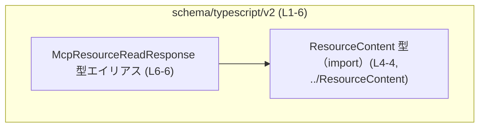
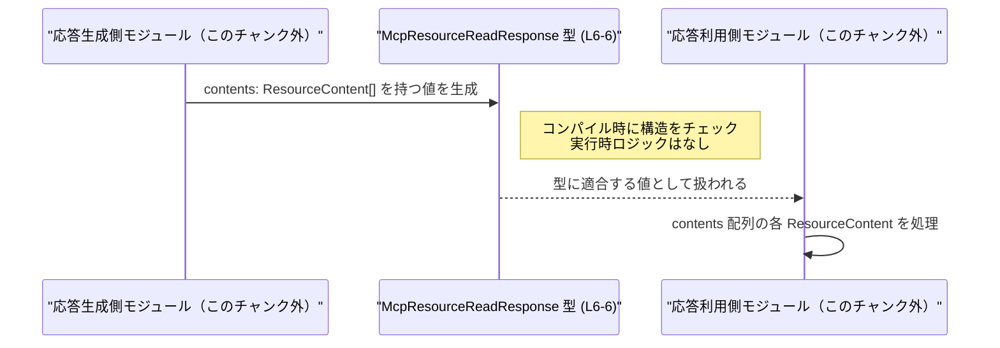

# app-server-protocol/schema/typescript/v2/McpResourceReadResponse.ts コード解説

## 0. ざっくり一言

- Rust の型定義から `ts-rs` によって自動生成された、`McpResourceReadResponse` という **レスポンスオブジェクトの型エイリアス**を定義する TypeScript ファイルです（McpResourceReadResponse.ts:L1-3, L6-6）。
- 内容は `contents` プロパティに `ResourceContent` 型の配列を持つオブジェクトという構造だけを表現しており、実行時ロジックや関数は一切含みません（McpResourceReadResponse.ts:L4-6）。

---

## 1. このモジュールの役割

### 1.1 概要

- このモジュールは、`McpResourceReadResponse` という名前の **TypeScript 型エイリアス**を提供します（McpResourceReadResponse.ts:L6-6）。
- `McpResourceReadResponse` は、`contents` という必須プロパティを持ち、その値は `ResourceContent` 型の配列と定義されています（McpResourceReadResponse.ts:L4-6）。
- ファイル先頭のコメントから、この型は Rust 側の定義から `ts-rs` によって自動生成されていることが分かります（McpResourceReadResponse.ts:L1-3）。

> 型名から、ある種の「リソース読み取り」に対するレスポンスの構造を表現するための型であることが想定されますが、これは名前からの推測であり、コードだけでは用途は確定しません。

### 1.2 アーキテクチャ内での位置づけ

このファイルで分かる依存関係は以下のとおりです。

- `McpResourceReadResponse` は `ResourceContent` 型に依存しています（McpResourceReadResponse.ts:L4-6）。
- `ResourceContent` の中身や、`McpResourceReadResponse` を利用する上位モジュールは、このチャンクには現れません。



この図は、`McpResourceReadResponse` が単一の依存先 `ResourceContent` を持つだけの、シンプルな型定義モジュールであることを示しています。

### 1.3 設計上のポイント

- **自動生成コード**  
  - `// GENERATED CODE! DO NOT MODIFY BY HAND!` というコメントにより、手動編集禁止であることが明示されています（McpResourceReadResponse.ts:L1-1）。
  - `ts-rs` による自動生成であり、元の設計は Rust 側の型定義にあります（McpResourceReadResponse.ts:L3-3）。
- **型専用のモジュール**  
  - `import type { ResourceContent }` により、型だけをインポートしているため、ビルド後の JavaScript にはこの import は現れません（McpResourceReadResponse.ts:L4-4）。
  - `export type` による型エイリアス定義のみで、実行時の値や関数は存在しません（McpResourceReadResponse.ts:L6-6）。
- **シンプルな構造**  
  - プロパティは `contents` の 1 つだけで、型は `Array<ResourceContent>` です（McpResourceReadResponse.ts:L6-6）。
- **エラー・並行性**  
  - このファイル自身には実行時の処理がないため、直接的なランタイムエラーや並行性の問題は発生しません。
  - 型定義として、コンパイル時に `contents` プロパティの存在と要素型をチェックする役割を持ちます。

---

## 2. 主要な機能一覧

このファイルは型定義のみを提供します。機能は次の 1 点に集約されます。

- `McpResourceReadResponse` 型の提供:  
  `contents: Array<ResourceContent>` を持つレスポンスオブジェクト構造を TypeScript で表現する（McpResourceReadResponse.ts:L4-6）。

---

## 3. 公開 API と詳細解説

### 3.1 型一覧（構造体・列挙体など）

このファイルに登場する型（およびインポートされる型）の一覧です。

| 名前                      | 種別           | 定義/由来         | 役割 / 用途                                                                 | 根拠 |
|---------------------------|----------------|-------------------|-----------------------------------------------------------------------------|------|
| `ResourceContent`         | 型（詳細不明） | 外部からの import | `contents` 配列の要素型として利用されるドメイン固有のコンテンツ表現と推測されるが、中身はこのチャンクからは不明。 | McpResourceReadResponse.ts:L4-4 |
| `McpResourceReadResponse` | 型エイリアス   | 本ファイルで定義 | `contents: Array<ResourceContent>` を持つオブジェクトの構造を表すレスポンス型。               | McpResourceReadResponse.ts:L6-6 |

> `ResourceContent` の実際の構造や役割は、インポートされているだけでこのチャンクに定義がないため不明です（McpResourceReadResponse.ts:L4-4）。

### 3.2 関数詳細（最大 7 件）

このファイルには、関数・メソッドは **一切定義されていません**（McpResourceReadResponse.ts:L1-6）。

- そのため、ランタイムのアルゴリズムやエラーハンドリング、並行処理に関するロジックは存在しません。
- エラーや安全性に関する影響は、「型としてどのプロパティを要求するか」という契約の形で現れます。

### 3.3 その他の関数

- 補助関数・ラッパー関数も含め、関数は存在しません（McpResourceReadResponse.ts:L1-6）。

---

## 4. データフロー

このファイル自体はデータ処理ロジックを持たず、型だけを定義します。そのため、ここでは **「McpResourceReadResponse 型に従ったオブジェクトがどのように生成・消費されるか」** という典型的な利用シナリオを抽象的に示します。

- あるモジュール（応答生成側）が `contents: ResourceContent[]` を持つオブジェクトを作成する。
- TypeScript の型チェックにより、そのオブジェクトが `McpResourceReadResponse` として正しい構造か検証される（コンパイル時）。
- 別のモジュール（応答利用側）が、このオブジェクトを受け取り、`contents` を読み取る。



> `Producer` / `Consumer` は、このチャンクには現れない想定上のモジュールであり、実際の名前や場所は不明です。

---

## 5. 使い方（How to Use）

### 5.1 基本的な使用方法

`McpResourceReadResponse` を使ってレスポンスオブジェクトの構造を型安全に表現する基本例です。  
インポートパスはプロジェクト構成に依存するため、ここでは仮のパスを示します（このチャンクからは正確なパスは特定できません）。

```typescript
// ResourceContent 型と McpResourceReadResponse 型をインポートする例
// ※ 実際のパスはプロジェクト構成によって異なります。
import type { ResourceContent } from "../ResourceContent";         // McpResourceReadResponse.ts と同じ import（L4）
import type { McpResourceReadResponse } from "./McpResourceReadResponse"; // このファイル自体を import すると仮定

// ResourceContent を一つ作る（実際の構造は ResourceContent の定義に依存）
const content: ResourceContent = /* ... */ {} as ResourceContent;  // 型アサーションは例示用

// McpResourceReadResponse 型の値を作る
const response: McpResourceReadResponse = {                        // McpResourceReadResponse を型注釈に使用
    contents: [content],                                           // contents は ResourceContent[] でなければならない
};

// 関数の戻り値として使う例
function readResource(): McpResourceReadResponse {                 // 戻り値の型を明示
    return response;                                               // 構造が合わないとコンパイルエラー
}
```

この例から分かること:

- `contents` プロパティは必須であり、省略するとコンパイルエラーになります（McpResourceReadResponse.ts:L6-6）。
- `contents` の各要素は `ResourceContent` 型でなければならず、異なる型を入れようとするとコンパイルエラーになります（McpResourceReadResponse.ts:L4-6）。

### 5.2 よくある使用パターン

#### 1. 関数の引数としてレスポンスを受け取る

```typescript
import type { McpResourceReadResponse } from "./McpResourceReadResponse";

function handleResourceRead(response: McpResourceReadResponse) {
    // contents 配列をループして処理
    for (const item of response.contents) {
        // item は ResourceContent 型として扱える
        // ここで item のプロパティにアクセスする（定義は ResourceContent 側）
    }
}
```

- このように、**引数の型**として指定することで、呼び出し側に `contents` プロパティの存在と要素型を要求できます。

#### 2. 非同期処理の戻り値として使う

```typescript
import type { McpResourceReadResponse } from "./McpResourceReadResponse";

async function fetchResource(): Promise<McpResourceReadResponse> {
    // 実際の実装では HTTP や IPC などからデータを取得する想定
    const raw = await someTransportLayerCall(); // 実装はこのチャンクには現れない

    // ここでは any を使っているが、実務では適切なパースと検証が必要
    return raw as McpResourceReadResponse;
}
```

- TypeScript の型は実行時には存在しないため、外部入力に対しては別途 **ランタイムバリデーション** が必要になります。
- このファイルはそのバリデーション処理を含まない点に注意が必要です（McpResourceReadResponse.ts:L1-6）。

### 5.3 よくある間違い

#### 間違い例 1: `contents` プロパティ名の誤り

```typescript
import type { McpResourceReadResponse } from "./McpResourceReadResponse";

const badResponse: McpResourceReadResponse = {
    // content: [...]  // 間違い: 'contents' ではなく 'content' と書いている
    contents: [],      // 正しくはこの名前が必要（McpResourceReadResponse.ts:L6-6）
};
```

- `contents` という名前は固定であり、スペルミスや別名は許容されません（コンパイルエラー）。

#### 間違い例 2: 配列要素の型不一致

```typescript
import type { McpResourceReadResponse } from "./McpResourceReadResponse";

const badResponse: McpResourceReadResponse = {
    // number 型の配列を入れようとするとエラー
    // contents: [1, 2, 3], // コンパイルエラー: number は ResourceContent に代入不可
    contents: [] as any[], // any を使うと型安全性が失われるので注意
};
```

- TypeScript 的には `any` を使うとコンパイラのチェックを回避できてしまうため、**型安全性を保つなら `any` は避けるべき**です。

### 5.4 使用上の注意点（まとめ）

- **前提条件**
  - `McpResourceReadResponse` 型の値は、少なくとも `contents` プロパティを持つ必要があります（McpResourceReadResponse.ts:L6-6）。
  - `contents` は実行時にはただの配列であり、各要素が `ResourceContent` に準拠しているかどうかは TypeScript ではコンパイル時チェックのみです。
- **ランタイムバリデーションの必要性**
  - この型定義だけでは、外部から取得した JSON 等が正しい構造かどうかを **実行時に検証することはできません**。
  - 必要に応じて `zod` などのスキーマバリデーションライブラリと組み合わせることが考えられますが、このチャンクにはそのようなコードは存在しません。
- **並行性**
  - 型定義のみのため、スレッド安全性や非同期処理の制御といった並行性に関する問題はこのファイルには直接関係しません。
- **自動生成コードの編集禁止**
  - コメントにあるとおり、このファイルを直接編集すると、再生成時に上書きされるリスクや Rust 側との不整合が生じる可能性があります（McpResourceReadResponse.ts:L1-3）。

---

## 6. 変更の仕方（How to Modify）

### 6.1 新しい機能を追加する場合

このファイルは `ts-rs` により **自動生成**されているため、基本的に **直接編集してはいけません**（McpResourceReadResponse.ts:L1-3）。

`McpResourceReadResponse` に新しいプロパティを追加したい場合の一般的な流れは次のとおりです。

1. **Rust 側の元定義を変更する**
   - `ts-rs` を付与した Rust の構造体や型定義を修正し、新しいフィールドを追加する必要があります。
   - この元定義の場所や名前は、このチャンクからは分かりません。
2. **`ts-rs` による再生成を行う**
   - Rust プロジェクトのビルドや専用スクリプトを通じて TypeScript の型を再生成します。
3. **TypeScript 側の利用コードを更新する**
   - 追加したプロパティを前提としたコードへの変更が必要です。
   - `McpResourceReadResponse` を使用している箇所で、新しいプロパティの扱いを検討します。

> このファイルを直接編集した場合、次回の自動生成で変更が消える可能性が高く、また Rust 側の型との整合性も失われます。

### 6.2 既存の機能を変更する場合

既存の `contents` プロパティの意味や型を変更する場合も、基本的には **Rust 側の定義を変更 → `ts-rs` で再生成**という流れになります。

注意点:

- **影響範囲**
  - `McpResourceReadResponse` を参照する全ての TypeScript コードに影響します。
  - `contents` の型や存在が前提になっている処理はコンパイルエラーになったり、挙動が変わる可能性があります。
- **契約の変更**
  - プロトコルレベルの「契約」が変わることになるため、クライアント／サーバ双方の実装の整合性に注意が必要ですが、その実装はこのチャンクには現れません。
- **テスト**
  - このファイルにはテストコードは含まれていません（McpResourceReadResponse.ts:L1-6）。
  - 実際のプロジェクトでは、プロトコル変更に対応したテストが必要になります。

---

## 7. 関連ファイル

このモジュールと密接に関係する、または関係が推測されるファイル・コンポーネントです。

| パス / コンポーネント | 種別 / 関係 | 役割 / 関係性 | 根拠 |
|-----------------------|------------|---------------|------|
| `../ResourceContent`  | 型定義（import） | `contents` 配列の要素型として利用される。実体はおそらく `ResourceContent.ts` などだが、このチャンクからは拡張子は不明。 | McpResourceReadResponse.ts:L4-4 |
| Rust 側の ts-rs 対象型（ファイル名不明） | Rust 型定義 | `McpResourceReadResponse` の元になっている Rust の構造体や型。`ts-rs` により本ファイルが生成されているとコメントに記載されているが、具体的な場所は不明。 | McpResourceReadResponse.ts:L3-3 |
| この型を利用するアプリケーションコード（不特定） | 利用側コード | `McpResourceReadResponse` を引数・戻り値・変数の型として利用するモジュール。実際のファイルや名前は、このチャンクには現れません。 | 不明（このチャンクには現れない） |

---

### まとめ（安全性・エッジケースの観点）

- このファイルは **型定義のみ** を提供し、ランタイムのバグやセキュリティホールを直接は含みません（McpResourceReadResponse.ts:L1-6）。
- 安全性・エッジケースは、主に以下の形で現れます。
  - `contents` が欠けたオブジェクトを扱おうとすると、**コンパイル時エラー**になります。
  - ただし、外部入力の JSON などに対しては、**ランタイムバリデーションが別途必要**であり、このファイルはそれを提供しません。
- 並行性やパフォーマンス、スケーラビリティについては、このファイル単体では特に問題となる処理は存在しません。
