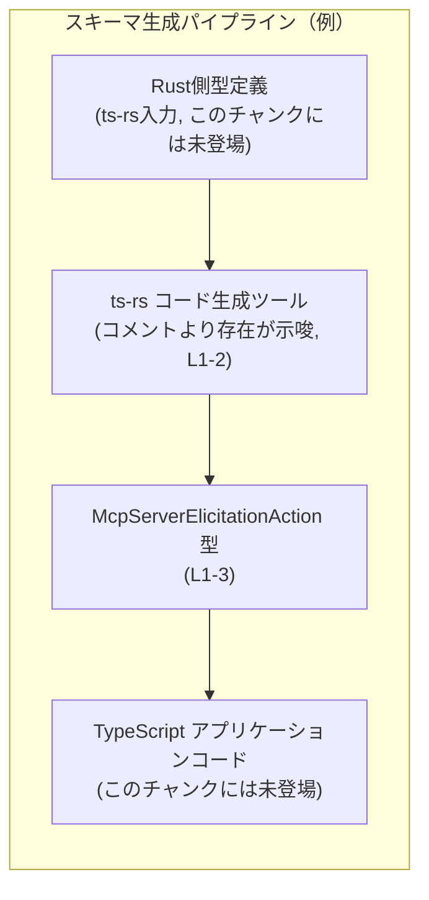
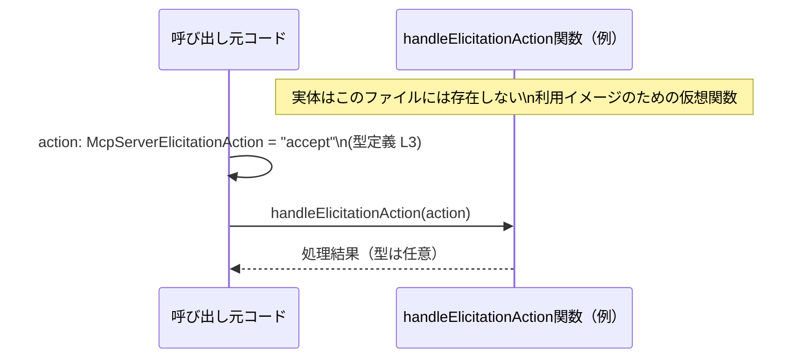

# `app-server-protocol/schema/typescript/v2/McpServerElicitationAction.ts` コード解説

## 0. ざっくり一言

- MCP サーバーの「エリシテーション（何かを求めるやり取り）」に対するサーバー側アクションを、 `"accept" | "decline" | "cancel"` の 3 種類に限定する **文字列リテラル・ユニオン型** を定義する TypeScript ファイルです（`McpServerElicitationAction.ts:L3-3`）。  

---

## 1. このモジュールの役割

### 1.1 概要

- このモジュールは、**MCP サーバーが取り得るエリシテーションアクションの種類**を型として表現し、TypeScript コードから安全に扱えるようにするために存在しています（`McpServerElicitationAction.ts:L3-3`）。
- 型定義は手作業ではなく、Rust から TypeScript 型を生成するツール **ts-rs** によって自動生成されています（`McpServerElicitationAction.ts:L1-2`）。

### 1.2 アーキテクチャ内での位置づけ

コメントから、このファイルは Rust 側の型定義から ts-rs によって生成された **スキーマ定義の一部**であることが分かります（`McpServerElicitationAction.ts:L1-2`）。  
以下は、ts-rs を利用した一般的な構成例です（図は推定であり、このリポジトリが必ずしもこの通りとは限りません）。



- `McpServerElicitationAction` は **スキーマ層**（型定義）に属し、ビジネスロジックや通信層から参照される側と考えられます（型名とコメントからの推測であり、具体的な使用箇所はこのチャンクからは分かりません）。

### 1.3 設計上のポイント

- **自動生成されたコード**
  - 冒頭コメントで「GENERATED CODE」「Do not edit this file manually」と明示されています（`McpServerElicitationAction.ts:L1-2`）。
  - 設計上、このファイルは **直接編集せず、元になっている Rust 型や ts-rs 設定を変更して再生成**する前提になっています。
- **文字列リテラル・ユニオン型**
  - `"accept" | "decline" | "cancel"` の 3 つの文字列だけを許す型として設計されています（`McpServerElicitationAction.ts:L3-3`）。
  - TypeScript の型システムにより、「スペルミスした文字列」や「想定外の文字列」をコンパイル時に検出できます。
- **状態やロジックを持たない**
  - 関数・クラス・メソッドは一切なく、**純粋な型宣言のみ**です（`McpServerElicitationAction.ts:L3-3`）。
  - 実行時の副作用や並行性・スレッド安全性の懸念は、このファイル単体では発生しません。

---

## 2. 主要な機能一覧

このファイルが提供する主な要素は 1 つです。

- `McpServerElicitationAction` 型:  
  MCP サーバーのエリシテーションアクションを `"accept" | "decline" | "cancel"` の 3 値に制約する文字列リテラル・ユニオン型（`McpServerElicitationAction.ts:L3-3`）。

---

## 3. 公開 API と詳細解説

### 3.1 型一覧（構造体・列挙体など）

| 名前                       | 種別                   | 定義箇所                  | 役割 / 用途 |
|----------------------------|------------------------|---------------------------|-------------|
| `McpServerElicitationAction` | 型エイリアス（ユニオン型） | `McpServerElicitationAction.ts:L3-3` | `"accept"`, `"decline"`, `"cancel"` のいずれかであることを表す型。サーバーのエリシテーションアクションを表現するために使用されると想定されます（用途は型名からの推測であり、コードからは具体的な使用箇所は分かりません）。 |

#### 型の詳細

```ts
export type McpServerElicitationAction = "accept" | "decline" | "cancel";
```

- **意味**
  - TypeScript において、`McpServerElicitationAction` は上記 3 つの文字列のいずれかしか取れないことを表します（`McpServerElicitationAction.ts:L3-3`）。
- **TypeScript 固有の安全性**
  - 変数、関数の引数・戻り値等で `McpServerElicitationAction` を使うと、IDE とコンパイラが `"accept"`, `"decline"`, `"cancel"` 以外の文字列リテラルを拒否します。
  - `switch` 文などで全てのケースを列挙している場合、将来値が追加されたときにコンパイルエラーとして検出できる **網羅性チェック** が働きます（`never` を使ったパターンなど）。
- **実行時の注意（セキュリティ / 安全性）**
  - TypeScript の型は **コンパイル時だけ**存在します。実行時にはただの `string` です。
  - 外部入力（HTTP リクエスト、JSON など）から文字列を受け取る場合、**実行時に `"accept" | "decline" | "cancel"` のいずれかであることを検証しない限り、不正な値も入り得ます**。
  - したがって、ネットワーク境界などでは、別途バリデーションロジックが必要になります（このチャンクにはそのロジックは登場しません）。

### 3.2 関数詳細（最大 7 件）

- このファイルには、関数・メソッドは一切定義されていません（`McpServerElicitationAction.ts:L1-3`）。
- したがって、関数に対する詳細テンプレートは適用対象がありません。

### 3.3 その他の関数

- 補助的な関数・ラッパー関数も存在しません（`McpServerElicitationAction.ts:L1-3`）。

---

## 4. データフロー

このファイル自体は型定義のみですが、`McpServerElicitationAction` を引数に取る関数を想定した **利用シナリオの例** を示します（この関数はこのファイルには定義されておらず、説明用の仮想コードです）。

### 処理の流れ（例）

1. 呼び出し元コードが、`"accept" | "decline" | "cancel"` のいずれかを `McpServerElicitationAction` 型として生成または決定する（`McpServerElicitationAction.ts:L3-3`）。
2. その値を、`handleElicitationAction(action: McpServerElicitationAction)` のような関数に渡す。
3. 関数側は、`switch` 文などで値に応じた処理を実行する。
4. 将来、新しい値が追加された場合は、`switch` 文がコンパイルエラーになり、処理分岐の追加漏れを検出できる。

### データフロー図（例）



- 図中の `McpServerElicitationAction` 型定義は、このファイルの `L3` に対応します（`McpServerElicitationAction.ts:L3-3`）。

---

## 5. 使い方（How to Use）

### 5.1 基本的な使用方法

`McpServerElicitationAction` 型をインポートして、関数の引数として利用する例です。  
インポートパスはプロジェクト構成に依存するため、ここでは同一ディレクトリを仮定しています（このパス自体はコードからは分かりません）。

```ts
// McpServerElicitationAction 型をインポートする                           // 型定義を読み込む
import type { McpServerElicitationAction } from "./McpServerElicitationAction"; // パスはプロジェクトに合わせて調整

// サーバーのエリシテーションアクションを処理する関数の例               // この関数は利用側コードの一例
function handleElicitationAction(action: McpServerElicitationAction) {          // 引数にユニオン型を指定
    switch (action) {                                                           // 値に応じて分岐
        case "accept":                                                          // "accept" の場合
            // 受諾時の処理を書く
            break;
        case "decline":                                                         // "decline" の場合
            // 辞退時の処理を書く
            break;
        case "cancel":                                                          // "cancel" の場合
            // キャンセル時の処理を書く
            break;
        default:                                                                // 将来の拡張に備えた網羅性チェック
            const _exhaustiveCheck: never = action;                             // 新しい値が追加されるとコンパイルエラー
            return _exhaustiveCheck;
    }
}

// 使用例: 正しい値                                                             // コンパイル時に型チェックされる
handleElicitationAction("accept");                                              // OK

// 使用例: 誤った値                                                             // コンパイルエラー
// handleElicitationAction("accepted");                                        // エラー: 型 '"accepted"' は 'McpServerElicitationAction' に割り当てられない
```

- `"accept"`, `"decline"`, `"cancel"` 以外の文字列を渡そうとすると、コンパイルエラーになります（`McpServerElicitationAction.ts:L3-3` が根拠）。

### 5.2 よくある使用パターン

1. **型付きプロパティとして利用**

```ts
// 設定や状態を表すインターフェースの例                                 // オブジェクトの型に組み込む
interface ElicitationState {
    lastAction: McpServerElicitationAction;                                   // 最後に行われたアクション
    // 他のフィールド...
}
```

1. **API レスポンス・リクエストの型として利用**

```ts
// API レスポンスの一部として利用する例                                     // 外部とのやり取りの型に使う
interface ElicitationResponse {
    action: McpServerElicitationAction;                                      // サーバー側がとったアクション
    // 他のフィールド...
}
```

1. **型ガードやランタイムバリデーションと組み合わせる**

```ts
// ランタイムに文字列を検証してから型を付ける例                           // 実行時安全性を高めるパターン
function parseElicitationAction(value: string): McpServerElicitationAction | null {
    if (value === "accept" || value === "decline" || value === "cancel") {   // 許可された値のみ
        return value;                                                        // ここではコンパイラ的にも型が絞られる
    }
    return null;                                                             // 不正な値は null などで扱う
}
```

### 5.3 よくある間違い

```ts
// 間違い例: 型を単なる string にしてしまう                                // 型安全性を失うパターン
function handle(action: string) {                                             // string だと何でも渡せてしまう
    // "accept" / "decline" / "cancel" 前提の処理を書いても、型が守ってくれない
}

// 正しい例: McpServerElicitationAction を使う                               // 許可された値だけに絞る
function handleSafe(action: McpServerElicitationAction) {
    // action は3つのうちいずれかであることが保証される
}
```

```ts
// 間違い例: 外部入力を検証せずに代入する                                  // 実行時の安全性の問題
declare const rawValue: string;                                              // 例: HTTP リクエストから取得した文字列

// コンパイラを騙す型アサーションは危険                                     // ランタイムにはチェックがない
const unsafeAction = rawValue as McpServerElicitationAction;                 // 不正な値でも通ってしまう

// 正しい例: 実行時に検証してから使う                                       // セキュリティ・堅牢性の観点で重要
const parsed = parseElicitationAction(rawValue);                             // 5.2 の例を流用
if (parsed !== null) {
    handleSafe(parsed);                                                      // 検証済みの値を渡す
}
```

### 5.4 使用上の注意点（まとめ）

- **前提条件**
  - `McpServerElicitationAction` 型として扱われる値は、コンパイル時には `"accept" | "decline" | "cancel"` のいずれかでなければなりません（`McpServerElicitationAction.ts:L3-3`）。
- **ランタイム検証の必要性**
  - TypeScript の型は実行時には消えるため、**外部入力に対しては別途バリデーションが必要**です。
  - 特に、ユーザー入力やネットワーク越しのデータには、型アサーション（`as`）だけで頼らないようにすることが重要です。
- **並行性 / スレッド安全性**
  - このファイルは純粋な型定義のみであり、状態やミューテーションを伴う処理はありません（`McpServerElicitationAction.ts:L1-3`）。
  - したがって、この型自体についての並行性・スレッド安全性の問題は特にありません。
- **パフォーマンス**
  - 型定義はコンパイル時にのみ影響し、実行時にはオーバーヘッドを生みません。
  - 多用しても実行時パフォーマンスへの影響はありません。

---

## 6. 変更の仕方（How to Modify）

### 6.1 新しい機能を追加する場合（新しいアクションを追加したい場合）

- 冒頭コメントにある通り、このファイルは **ts-rs による自動生成**であり、「Do not edit this file manually」と明記されています（`McpServerElicitationAction.ts:L1-2`）。
- 新しいアクション（例: `"timeout"` など）を追加したい場合は、次のような方針になります（一般論であり、このリポジトリ固有の手順はこのチャンクからは分かりません）。

  1. **元になっている Rust 側の型定義**（ts-rs の対象）を更新する。  
     - 例えば Rust 側の `enum` に新しいバリアントを追加するなど。
  2. ts-rs を再実行して TypeScript スキーマを再生成する。  
     - その結果として、このファイルのユニオン型に新しい文字列リテラルが追加されることが期待されます。
  3. TypeScript 側の呼び出しコードでは、`switch` 文などで新しいケースを扱うように修正する。  
     - `never` を用いた網羅性チェックをしていれば、コンパイルエラーとして不足箇所を検出しやすくなります。

- **注意点（契約 / 互換性）**
  - ユニオン型に値を追加することは、既存コードにとっては **コンパイル時のブレイキングチェンジ** になる可能性があります。
  - API として外部に公開している場合、クライアント側のアップデート手順も含めて設計する必要があります（このチャンクからはクライアント構成は分かりません）。

### 6.2 既存の機能を変更する場合（値の削除・変更）

- `"accept"`, `"decline"`, `"cancel"` 自体を変更・削除したい場合も、同様に **直接編集ではなく元の Rust 型を変更し、ts-rs で再生成**する必要があります（`McpServerElicitationAction.ts:L1-2`）。
- 変更の影響:
  - **値を削除した場合**
    - その値を使っている TypeScript コードはすべてコンパイルエラーになります。
    - API 仕様としても後方互換性が失われる可能性があります。
  - **値をリネームした場合**
    - 旧名を使っている箇所がすべて修正対象となります。
    - サーバーとクライアントで型定義のバージョンがずれると、ランタイムでの不整合が発生し得ます。
- いずれの場合も、**型が契約（Contract）として機能している**ことを意識し、変更前後でのクライアント・サーバーの整合性を確認する必要があります。

---

## 7. 関連ファイル

このチャンクには、具体的な他ファイルのパスやモジュール名は登場しませんが、コメントや型名から次のような関連が推測されます。

| パス / コンポーネント | 役割 / 関係 |
|------------------------|-------------|
| Rust 側 ts-rs 対象型（パス不明） | コメントより、この TypeScript 型の元になっている Rust 型定義が存在すると考えられます（`McpServerElicitationAction.ts:L1-2`）。具体的なファイルパスはこのチャンクには現れません。 |
| ts-rs 設定 / ビルドスクリプト（パス不明） | このファイルを生成するために使用される ts-rs の設定・ビルドステップが存在すると考えられます（`McpServerElicitationAction.ts:L1-2`）。 |
| `McpServerElicitationAction` を利用する TypeScript コード（不明） | 実際にこの型を参照してビジネスロジックや API 通信を行うコードが存在するはずですが、このチャンクからは特定できません。 |

> 不明なファイル・ディレクトリについては、コードやコメントから直接読み取れる情報がないため、具体的なパスは記述していません。
