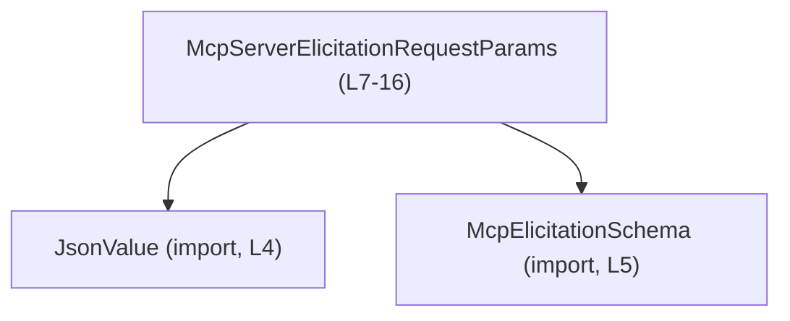
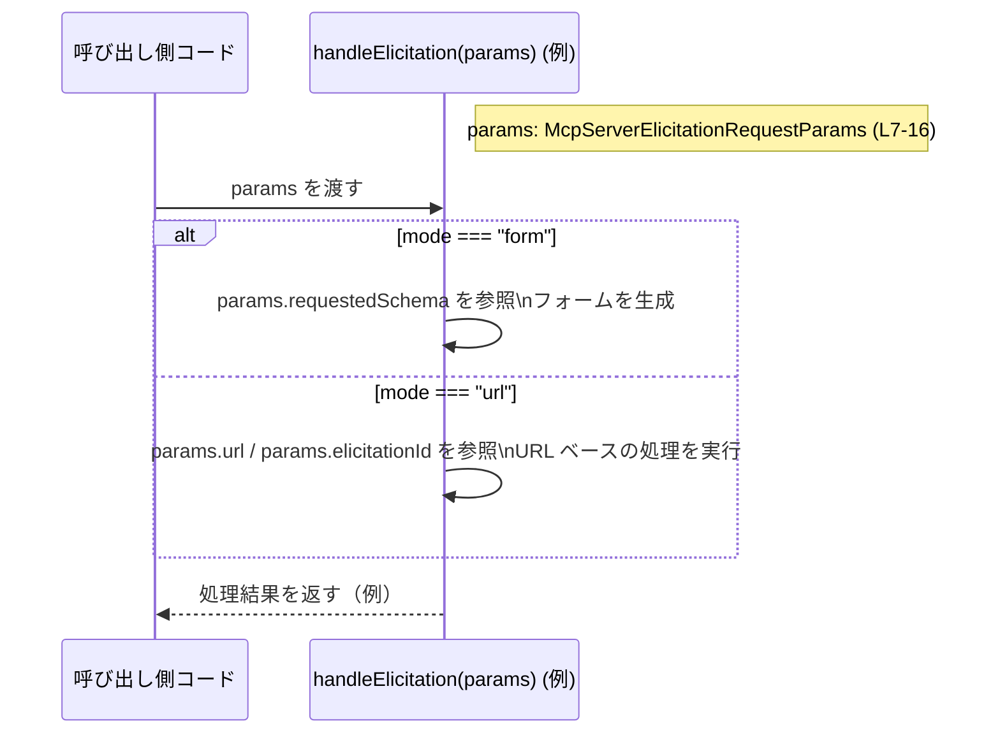

# app-server-protocol/schema/typescript/v2/McpServerElicitationRequestParams.ts

## 0. ざっくり一言

MCP プロトコルにおける「elicitation（追加情報の要求）」の server-to-client リクエストに使われるパラメータを、TypeScript の型として表現した自動生成ファイルです（McpServerElicitationRequestParams.ts:L1-3, L7-16）。

---

## 1. このモジュールの役割

### 1.1 概要

- このファイルは、MCP サーバーからクライアントへ送信される「elicitation」リクエストのパラメータ構造を `McpServerElicitationRequestParams` 型として定義します（L7-16）。
- 共通情報（`threadId`, `turnId`, `serverName`）と、「フォーム入力を求める」モード（`mode: "form"`）または「URL を提示する」モード（`mode: "url"`）のどちらか一方の詳細情報を、**型安全に** 表現します（L7, L16）。
- `turnId` フィールドのコメントから、この elicitation がアプリ側の「ターン」と関連付けられる場合があるが、プロトコル上は独立した server-to-client リクエストとして扱われることが分かります（L8-15）。

### 1.2 アーキテクチャ内での位置づけ

このファイルは**スキーマ定義レイヤ**に属し、実際の送受信ロジックは含まず、以下のような依存関係を持ちます。

- 依存先:
  - `JsonValue`（任意の JSON 値を表す型であると推測されるが、詳細はこのチャンクには現れない）（L4）。
  - `McpElicitationSchema`（フォームモード時の `requestedSchema` の型。詳細はこのチャンクには現れない）（L5）。
- 公開 API:
  - `export type McpServerElicitationRequestParams`（L7-16）

依存関係を Mermaid で表すと次のようになります。



この図は、「McpServerElicitationRequestParams」が `JsonValue` と `McpElicitationSchema` に依存していることを示します。

### 1.3 設計上のポイント

コードから読み取れる設計上の特徴は次のとおりです。

- **自動生成コード**  
  - 冒頭コメントで ts-rs による自動生成であり、手動編集禁止であることが明示されています（L1, L3）。
- **交差型（intersection）+ 判別可能ユニオン（discriminated union）**  
  - 共通フィールドのオブジェクト型 `{ threadId, turnId, serverName }` と、`mode` に応じた 2 つのバリアント型との交差型として定義されています（L7, L16）。
  - `mode: "form"` と `mode: "url"` が**判別キー**になっており、TypeScript の型ナローイングによる安全な分岐が可能です（L16）。
- **null を使ったオプション表現**  
  - `turnId: string | null` によって、「関連するターンがない」ことを `null` で表現します（L16）。
  - `_meta: JsonValue | null` も同様に、メタデータが存在しない場合を `null` で表現します（L16）。
- **実行時ロジック・状態を持たない**  
  - このファイルは型定義のみであり、関数やクラスの実装は含まれていません（L1-16）。  
  - したがって、直接的なエラーハンドリングや並行処理ロジックは登場しません。

---

## 2. 主要な機能一覧

このファイルが提供する「機能」は、すべて型定義レベルのものです。

- `McpServerElicitationRequestParams`:  
  MCP サーバーからの elicitation リクエストを、
  - スレッド ID（`threadId`）
  - 関連付け可能なターン ID（`turnId`、null 許容）
  - サーバー名（`serverName`）
  - `mode: "form"` の場合: メッセージ・要求スキーマ・メタ情報
  - `mode: "url"` の場合: メッセージ・URL・elicitation ID・メタ情報  
 という構造で表現する型エイリアスです（L7-16）。

---

## 3. 公開 API と詳細解説

### 3.1 型一覧（構造体・列挙体など）

このファイル内の主要なコンポーネントのインベントリです。

| 名前 | 種別 | 役割 / 用途 | 定義位置 |
|------|------|-------------|----------|
| `McpServerElicitationRequestParams` | 型エイリアス（交差型 & 判別ユニオン） | MCP サーバーからクライアントに送られる elicitation リクエストのパラメータ全体を表現する | `McpServerElicitationRequestParams.ts:L7-16` |
| `JsonValue` | 型（他ファイルで定義） | `_meta` フィールドに格納される任意の JSON メタデータを表現する型と思われるが、具体的内容はこのチャンクには現れない | import: `McpServerElicitationRequestParams.ts:L4` |
| `McpElicitationSchema` | 型（他ファイルで定義） | `mode: "form"` のときに要求されるフォームのスキーマを表現する型。詳細はこのチャンクには現れない | import: `McpServerElicitationRequestParams.ts:L5` |

`McpServerElicitationRequestParams` の内部構造（共通部と 2 つのバリアント）は以下の通りです（L7, L16）。

- 共通フィールド:
  - `threadId: string`
  - `turnId: string | null`
  - `serverName: string`
- `mode: "form"` バリアント:
  - `"mode": "form"`
  - `_meta: JsonValue | null`
  - `message: string`
  - `requestedSchema: McpElicitationSchema`
- `mode: "url"` バリアント:
  - `"mode": "url"`
  - `_meta: JsonValue | null`
  - `message: string`
  - `url: string`
  - `elicitationId: string`

### 3.2 公開 API 詳細（このファイルでは型の詳細）

このファイルには関数は存在しないため、主要な公開要素である `McpServerElicitationRequestParams` 型について、関数詳細テンプレートに似た形で整理します。

#### `McpServerElicitationRequestParams` （型エイリアス）

**概要**

- MCP サーバーがクライアントに対して行う elicitation リクエストのパラメータを表現する型です（L7-16）。
- 共通フィールドと、`mode` に応じた 2 種類の詳細フィールドを組み合わせた型です（交差型 + 判別ユニオン）。

**フィールド**

共通部（両モードで必須）:

| フィールド名 | 型 | 説明 | 根拠 |
|-------------|----|------|------|
| `threadId` | `string` | この elicitation が属するスレッドを識別する ID | 定義: L7 |
| `turnId` | `string \| null` | この elicitation が観測された「アクティブな Codex ターン」を識別する ID。アプリサーバーが相関できない場合や、turn コンテキストが不要な場合は `null` になるとコメントから読み取れます | 定義: L16、コメント: L8-15 |
| `serverName` | `string` | この elicitation を送信した MCP サーバーの名前 | 定義: L16 |

`mode: "form"` バリアント:

| フィールド名 | 型 | 説明 | 根拠 |
|-------------|----|------|------|
| `mode` | `"form"` リテラル | このバリアントが「フォームベース」の elicitation であることを示す判別キー | 定義: L16 |
| `_meta` | `JsonValue \| null` | 追加メタデータ。存在しない場合は `null` | 定義: L16 |
| `message` | `string` | クライアントに提示されるメッセージ本文 | 定義: L16 |
| `requestedSchema` | `McpElicitationSchema` | 要求されるフォーム構造を表すスキーマ | 定義: L16 |

`mode: "url"` バリアント:

| フィールド名 | 型 | 説明 | 根拠 |
|-------------|----|------|------|
| `mode` | `"url"` リテラル | このバリアントが「URL ベース」の elicitation であることを示す判別キー | 定義: L16 |
| `_meta` | `JsonValue \| null` | 追加メタデータ。存在しない場合は `null` | 定義: L16 |
| `message` | `string` | クライアントに提示されるメッセージ本文 | 定義: L16 |
| `url` | `string` | クライアントに提示される URL | 定義: L16 |
| `elicitationId` | `string` | この URL ベースの elicitation 自体の ID | 定義: L16 |

**内部構造（アルゴリズム的な流れ）**

実行時処理ではなく型レベルの構造ですが、利用時の典型的な流れは次のようになります。

1. 呼び出し側コードが `McpServerElicitationRequestParams` 型としてオブジェクトを受け取るまたは構築する（L7-16）。
2. コードは `threadId` / `turnId` / `serverName` で文脈情報を参照する（L7, L16）。
3. `mode` フィールドの値（"form" または "url"）に基づいて条件分岐する（L16）。
4. `mode === "form"` の場合、`requestedSchema` を使ってフォームを生成し、`message` と `_meta` を利用する（L16）。
5. `mode === "url"` の場合、`url` と `elicitationId` を用いてリンク型の elicitation を処理し、同様に `message` / `_meta` を利用する（L16）。

※ 3〜5 の処理はこのファイルには含まれず、想定される利用パターンとしての説明です（「handleElicitation」などの関数はこのチャンクには現れません）。

**Examples（使用例）**

以下の例は、この型を利用する TypeScript コード例であり、本ファイルには含まれていません。

```typescript
// フォームモードの elicitation パラメータを構築する例
import type { McpServerElicitationRequestParams } from "./McpServerElicitationRequestParams";  // 本ファイルの型をインポート

const formParams: McpServerElicitationRequestParams = {  // 型注釈により構造をチェック
    threadId: "thread-123",                              // スレッド ID
    turnId: "turn-5",                                    // 関連するターン ID（なければ null も可）
    serverName: "example-mcp-server",                    // サーバー名
    mode: "form",                                        // 判別キー: フォームモード
    _meta: null,                                         // メタデータがなければ null
    message: "Please fill in this form.",                // ユーザー向けメッセージ
    requestedSchema: {/* ... */} as any,                 // 実際は McpElicitationSchema 型の値
};

// URL モードの elicitation パラメータを構築する例
const urlParams: McpServerElicitationRequestParams = {   // 同じ型で別モード
    threadId: "thread-123",
    turnId: null,                                        // ターンと紐付かない場合
    serverName: "example-mcp-server",
    mode: "url",                                         // 判別キー: URL モード
    _meta: { source: "system" } as any,                  // 任意の JSON メタ情報（JsonValue として表現）
    message: "Open the following link to continue.",     // メッセージ
    url: "https://example.com/continue",                 // 提示する URL
    elicitationId: "elic-789",                           // elicitation 自体の ID
};
```

**TypeScript の安全性（型ガード・ユニオンの扱い）**

```typescript
function handleElicitation(params: McpServerElicitationRequestParams) {
    // mode フィールドによる判別で型がナローイングされる
    if (params.mode === "form") {                        // このブロック内では mode は "form" に確定
        // params.requestedSchema が利用可能（"form" バリアント専用フィールド）
        renderForm(params.requestedSchema);              // requestedSchema に安全にアクセスできる
    } else {                                             // ここでは "url" バリアントに絞られる
        openUrl(params.url);                             // url フィールドに安全にアクセスできる
    }
}
```

- `params.mode` による条件分岐により、TypeScript コンパイラは `params` の型をそれぞれのバリアントに絞り込みます。
- これにより、`mode === "form"` ブロックで `params.url` にアクセスしようとするとコンパイルエラーになり、誤用を防げます。

**Edge cases（エッジケース）**

- `turnId` が `null` の場合  
  - コメントにある通り、elicitation が特定のターンに紐付かないケースを表現します（L8-15）。
  - 呼び出し側は `turnId` に対して null チェックを行う必要があります。
- `_meta` が `null` の場合  
  - メタデータが存在しない通常ケースとして扱うことが想定されます（L16）。
- `mode` の値が "form" / "url" 以外  
  - 型定義上、それ以外の文字列リテラルは許容されませんが（L16）、外部から JSON をパースする場合は実行時のバリデーションが別途必要です（このファイルには含まれません）。
- 判別ユニオンの分岐忘れ  
  - `switch (params.mode)` などで両モードを網羅しない場合、将来のモード追加時にデッドコードや未処理経路が発生する可能性があります。  
  - 現時点では 2 モードのみですが（L16）、 exhaustiveness チェックを行うコードスタイルを採用すると安全です。

**使用上の注意点**

- この型は**型レベル定義のみ**であり、実行時の入力検証は別途必要です。  
  外部から JSON を受け取ってこの型にマッピングする場合、`mode` フィールドや必須プロパティの存在を検証しないと、ランタイムエラーが起こり得ます。
- `turnId` および `_meta` は `null` を取り得るため、コード側で null チェックを前提に設計する必要があります（L16）。
- 判別フィールド `mode` に依存した処理を行う場合、TypeScript のユニオン型ナローイングを活用し、`as any` や無理な型アサーションは可能な限り避けると、型安全性が高まります。
- 並行性: この型自体には並行処理やミューテーションに関する特別な制約はありません。  
  JavaScript/TypeScript の通常のオブジェクトと同様に参照共有されるため、同じオブジェクトを複数箇所から書き換える設計を行う場合は、アプリケーション側で整合性を管理する必要があります。

### 3.3 その他の関数

- このファイルには関数・メソッド・クラスは定義されていません（L1-16）。  
  補助関数などもこのチャンクには現れません。

---

## 4. データフロー

このファイルは型定義のみですが、`McpServerElicitationRequestParams` 型オブジェクトがどのように処理されるかの典型例を、**仮想的な** シーケンスとして示します。  
（`handleElicitation` 関数などはこのファイルには存在せず、利用イメージのための例です。）



要点:

- `params` は `McpServerElicitationRequestParams` 型であり、`mode` により処理経路が分岐します（L16）。
- 共通フィールド `threadId` / `turnId` / `serverName` は、どちらの分岐でも文脈情報として利用できます（L7, L16）。

---

## 5. 使い方（How to Use）

### 5.1 基本的な使用方法

典型的なコードフローの一例です。このコードは説明用であり、本ファイルには含まれていません。

```typescript
// 設定や依存オブジェクトを用意する（省略）
// ...

// elicitation パラメータを受け取って処理する関数の例
function handleElicitation(
    params: McpServerElicitationRequestParams,       // 本ファイルの型を利用
) {
    console.log("thread:", params.threadId);         // 共通フィールドを参照
    console.log("server:", params.serverName);

    if (params.turnId !== null) {                    // turnId は null を許容するのでチェックが必要
        console.log("turn:", params.turnId);
    }

    if (params.mode === "form") {                    // 判別ユニオンによる分岐
        // ここでは params は "form" バリアントに絞られる
        renderForm(params.message, params.requestedSchema);
    } else {                                         // "url" バリアント
        // ここでは params.url と params.elicitationId に安全にアクセスできる
        showUrl(params.message, params.url);
    }
}
```

このように、`McpServerElicitationRequestParams` は関数の引数型として利用されることが想定されます。

### 5.2 よくある使用パターン

1. **フォーム入力要求として使う**

```typescript
function requestForm(params: McpServerElicitationRequestParams) {
    if (params.mode !== "form") {                    // モードのチェックを明示
        throw new Error("form mode required");
    }

    // requestedSchema に従って UI を構築する
    const form = buildFormFromSchema(params.requestedSchema);
    showForm(params.message, form, params._meta);    // _meta を補足情報として渡す
}
```

1. **URL ベースのフローとして使う**

```typescript
function handleUrlElicitation(params: McpServerElicitationRequestParams) {
    if (params.mode !== "url") {                     // URL モードであることを確認
        throw new Error("url mode required");
    }

    logElicitation(params.elicitationId, params._meta);  // ID とメタデータをログに残す
    openExternalUrl(params.url);                         // URL を開く処理
}
```

### 5.3 よくある間違い

**例 1: mode を確認せずにバリアント固有フィールドを読む**

```typescript
// 間違い例: mode をチェックせずに url にアクセスする
function badHandler(params: McpServerElicitationRequestParams) {
    console.log(params.url);      // コンパイルエラー: "form" バリアントには url が無い
}
```

**正しい例: mode で分岐する**

```typescript
function goodHandler(params: McpServerElicitationRequestParams) {
    if (params.mode === "url") {
        console.log(params.url);  // OK: "url" バリアントに絞られる
    }
}
```

**例 2: `turnId` が必ず文字列だと仮定する**

```typescript
// 間違い例: turnId の null 可能性を考慮していない
function badTurnUsage(params: McpServerElicitationRequestParams) {
    console.log(params.turnId.toUpperCase());  // コンパイルエラー or 実行時例外の原因
}
```

**正しい例: null チェックを行う**

```typescript
function goodTurnUsage(params: McpServerElicitationRequestParams) {
    if (params.turnId !== null) {
        console.log(params.turnId.toUpperCase());  // turnId が string に絞られる
    }
}
```

### 5.4 使用上の注意点（まとめ）

- **型安全性**  
  - 判別ユニオン（`mode: "form" | "url"`）を活用し、分岐ごとに適切なフィールドにアクセスする必要があります（L16）。
  - `any` や過度な型アサーションを用いると、この型が提供する安全性が損なわれます。
- **null 可能なフィールド**  
  - `turnId` と `_meta` は `null` を取り得るため、利用時の null チェックを前提とした実装が必要です（L16）。
- **外部入力と検証**  
  - この型はコンパイラレベルの制約のみを提供し、実行時に JSON をパースしてこの構造に当てはめる処理は別途実装する必要があります。  
  - 不正な `mode` 値や欠落した必須フィールドに対しては、パース・検証側のコードでエラーとする必要があります（このチャンクにはその実装は現れません）。
- **セキュリティ**  
  - `_meta: JsonValue` は任意構造の JSON を想定している可能性があり、外部からの入力をそのまま UI 表示や評価に用いると XSS 等のリスクになることがあります。  
    ただし `JsonValue` の具体的性質はこのチャンクには現れないため、利用側で適切なサニタイズやエスケープを行うことが前提になります。
- **並行性**  
  - この型は単なるデータ構造なので、並行・非同期処理に関する特別な仕組みはありません。  
  - 非同期処理チェーンで同一オブジェクトを共有する場合、ミューテーションの有無に注意する必要があります（TypeScript はイミュータビリティを強制しません）。

---

## 6. 変更の仕方（How to Modify）

### 6.1 新しい機能を追加する場合

このファイルの先頭コメントから、この型定義は ts-rs により**自動生成**されており、手作業による編集は想定されていません（L1, L3）。

- 新しいモード（例: `mode: "xyz"`）やフィールドを追加したい場合:
  - 直接この TypeScript ファイルを編集するのではなく、**生成元**（おそらく Rust 側の型定義）を変更し、ts-rs による再生成を行う必要があります。  
  - 生成元の具体的な場所・定義はこのチャンクには現れませんので、プロジェクト全体の構成を確認する必要があります。
- アプリケーションコード側で「この型に対応する新しい処理」を追加する場合:
  1. 既存コードで `McpServerElicitationRequestParams` がどこで使われているかを検索する（このファイルからは使用箇所は分かりません）。
  2. 新しい利用パターンに応じて、`mode` 分岐の中に処理を追加する、あるいは新しいハンドラ関数を定義する。
  3. 型の変更（もしあれば）に合わせてコンパイルエラーを解消することで、利用側の漏れを検出できます。

### 6.2 既存の機能を変更する場合

- **型構造の変更**  
  - フィールド名・型・モード構造を変更したい場合は、同様に生成元の定義を変更し、ts-rs によって再生成する必要があります（L1, L3）。
  - `threadId` / `turnId` / `serverName` の意味や必須性を変えると、広範な影響を及ぼす可能性があります。  
    変更前に、これらを参照している全コードパスを確認することが重要です（使用箇所はこのチャンクには現れません）。
- **契約（前提条件）の確認ポイント**
  - `mode` ごとに必須フィールドが異なる、という契約が崩れないようにする必要があります（L16）。
  - `turnId` / `_meta` の null 可能性を変える場合は、それに依存する処理（null チェックや既定値の扱い）を見直す必要があります。
- **テスト**
  - 型の変更に対しては、コンパイルエラーの有無に加え、実行時に JSON からマッピングするテスト（シリアライズ／デシリアライズ）が必要です。  
  - このファイルにはテストコードは含まれていないため、別ファイルでのテスト実装が前提になります（不明: このチャンクには現れない）。

---

## 7. 関連ファイル

このモジュールと密接に関係するファイル・型は、import 文から次のように読み取れます。

| パス | 役割 / 関係 |
|------|------------|
| `../serde_json/JsonValue` | `_meta` フィールドの型として利用される `JsonValue` を定義するファイルです（McpServerElicitationRequestParams.ts:L4）。具体的な構造・制約はこのチャンクには現れません。 |
| `./McpElicitationSchema` | `mode: "form"` バリアントの `requestedSchema` フィールドに使われる `McpElicitationSchema` 型を定義するファイルです（McpServerElicitationRequestParams.ts:L5）。スキーマの詳細はこのチャンクには現れません。 |
| （生成元 Rust ファイル） | コメントにより、ts-rs がこの TypeScript ファイルを生成していることが示唆されますが（L1, L3）、具体的な Rust ファイル名・位置はこのチャンクには現れません。 |

このファイル自体は、TypeScript スキーマ層の一部として、他の実装コード（リクエスト送信・受信・処理ロジック）から `McpServerElicitationRequestParams` 型を経由して利用されることが想定されますが、それらの具体的な関係はこのチャンクには現れません。
