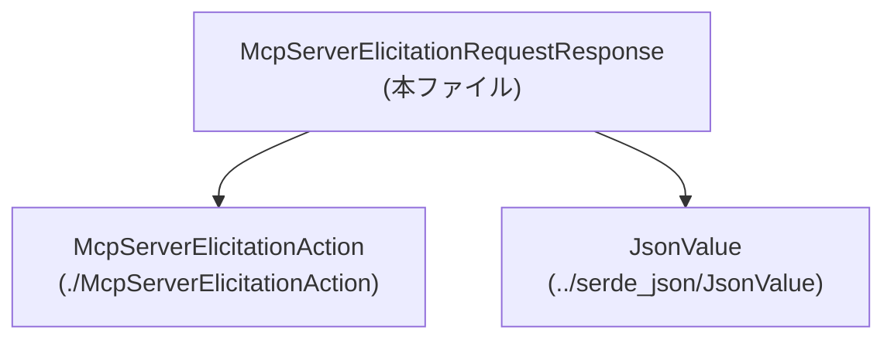
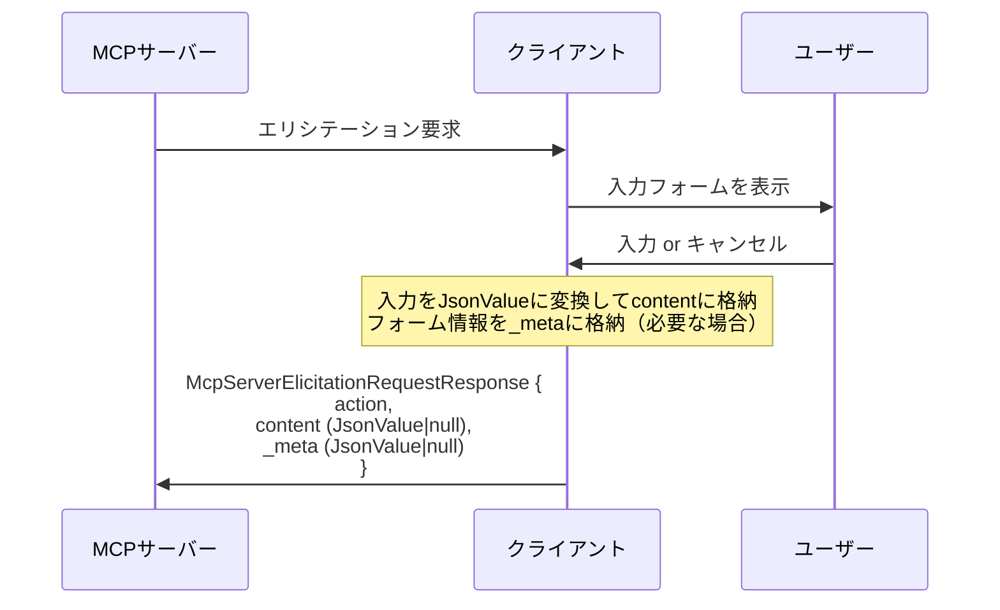

# app-server-protocol/schema/typescript/v2/McpServerElicitationRequestResponse.ts

## 0. ざっくり一言

`McpServerElicitationRequestResponse` は、MCP サーバーの「エリシテーション（追加質問・フォーム入力）」に対するクライアント側の応答を表す **JSON 互換のデータ構造**を定義する型エイリアスです（`action`, `content`, `_meta` の3フィールド）  
（根拠: ファイル先頭コメントと型定義名・プロパティ名 `McpServerElicitationRequestResponse.ts:L1-3,7-17`）

---

## 1. このモジュールの役割

### 1.1 概要

- このモジュールは、MCP サーバーからのエリシテーションに対して、クライアントが返すレスポンスの **型定義のみ** を提供します。
- レスポンスは以下の 3 要素から構成されます:
  - 実際に実行するアクションを表す `action`
  - 受諾されたエリシテーションに対する構造化されたユーザー入力 `content`
  - フォームモードのハンドリング用クライアントメタデータ `_meta`  
  （根拠: コメントとプロパティ名 `McpServerElicitationRequestResponse.ts:L7-17`）

### 1.2 アーキテクチャ内での位置づけ

このファイルは純粋な型定義であり、実行ロジックは含みません。  
外部型への依存関係は次の通りです。



- `McpServerElicitationRequestResponse` は `McpServerElicitationAction` と `JsonValue` 型に依存しています（import 文 `McpServerElicitationRequestResponse.ts:L4-5`）。
- このチャンクには、この型がどこから呼ばれるか・どのレイヤーで使われるかは現れていません（「不明」とします）。

### 1.3 設計上のポイント

- **自動生成コード**  
  - ファイル先頭に「GENERATED CODE! DO NOT MODIFY BY HAND!」と明記されています（`McpServerElicitationRequestResponse.ts:L1-3`）。
  - スキーマから ts-rs により再生成される前提のため、手動変更は想定されていません。
- **データ専用（ステートレス）**  
  - 関数やクラスは定義されておらず、1 つの型エイリアスだけを提供するデータキャリアです（`McpServerElicitationRequestResponse.ts:L7-17`）。
- **null 許容による状態表現**  
  - `content` と `_meta` は `JsonValue | null` として定義されており、「値がない」状態を `null` で明示的に表します（`McpServerElicitationRequestResponse.ts:L13,17`）。
  - コメントに「decline/cancel responses have no content」とあり、ビジネスロジック上の状態（拒否/キャンセル）を `null` により表現していることがわかります（`McpServerElicitationRequestResponse.ts:L8-12`）。
- **型安全のための type import**  
  - `import type` を使用しており、コンパイル後に JavaScript へは出力されない純粋な型依存です（`McpServerElicitationRequestResponse.ts:L4-5`）。

---

## 2. 主要な機能一覧

このファイルが提供する主な「機能」（= 型）を列挙します。

- `McpServerElicitationRequestResponse`: MCP サーバーのエリシテーションに対するクライアント応答を表すデータ構造  
  - 必須フィールド `action`
  - 任意の構造化入力 `content`（受諾時のみ）
  - 任意のクライアントメタデータ `_meta`

その他に関数やクラスなどの機能は定義されていません（`McpServerElicitationRequestResponse.ts:L7-17`）。

---

## 3. 公開 API と詳細解説

### 3.1 型一覧（構造体・列挙体など）

このチャンクに現れる主要な型と依存関係の一覧です。

#### 自身が定義する型

| 名前 | 種別 | フィールド | 役割 / 用途 | 根拠 |
|------|------|-----------|------------|------|
| `McpServerElicitationRequestResponse` | 型エイリアス（オブジェクト形） | `action`, `content`, `_meta` | MCP サーバーのエリシテーション要求への応答を表す JSON 互換のオブジェクト | `McpServerElicitationRequestResponse.ts:L7-17` |

**フィールド詳細**

| フィールド名 | 型 | 必須/nullable | 説明 | 根拠 |
|-------------|----|--------------|------|------|
| `action` | `McpServerElicitationAction` | 必須 / 非 null | 実行するエリシテーションアクション。具体的な中身は別ファイルで定義されています。 | `McpServerElicitationRequestResponse.ts:L7` |
| `content` | `JsonValue \| null` | 任意 / null 許容 | 受諾されたエリシテーションに対する構造化されたユーザー入力。拒否/キャンセル時は `null`。 | `McpServerElicitationRequestResponse.ts:L8-13` |
| `_meta` | `JsonValue \| null` | 任意 / null 許容 | フォームモードのアクションハンドリング用のオプションメタデータ。 | `McpServerElicitationRequestResponse.ts:L14-17` |

#### インポートしている外部型

| 名前 | 種別 | 役割 / 用途（わかる範囲） | 根拠 |
|------|------|-------------------------|------|
| `JsonValue` | 型（詳細不明） | JSON 値（オブジェクト/配列/プリミティブ）を表す型と推測されますが、このチャンクには定義がないため詳細は不明です。 | `McpServerElicitationRequestResponse.ts:L4` |
| `McpServerElicitationAction` | 型（詳細不明） | エリシテーションに対するアクション（実行する処理種別など）を表す型と考えられますが、詳細は本チャンクには現れません。 | `McpServerElicitationRequestResponse.ts:L5` |

> 「JSON 値」「アクション」という解釈は命名とコメントからの推測であり、**構造やバリアントの詳細はこのチャンクからは分かりません**。

### 3.2 関数詳細（最大 7 件）

このファイルには関数が **1 つも定義されていません**（`export type` のみ、`McpServerElicitationRequestResponse.ts:L7-17`）。  
したがって、関数詳細テンプレートを適用できる対象はありません。

- エラー処理・並行処理はすべて「この型を利用する側のコード」に委ねられています。
- このファイル自体には実行時のロジックがないため、**型レベルの契約**（「null の可能性がある」「プロパティが必須」など）のみが仕様になります。

### 3.3 その他の関数

- 該当なし（このチャンクには関数・メソッド定義が存在しません）。

---

## 4. データフロー

このセクションでは、「エリシテーション応答」の典型的なデータフローを、**名前とコメントから推測できる範囲で** 整理します。

### 4.1 データ構造としての流れ

コメントより `content` は「Structured user input for accepted elicitations」と説明され、「decline/cancel responses have no content」とあります（`McpServerElicitationRequestResponse.ts:L8-12`）。  
このことから、次のようなフローが想定されます（実際の送受信コードはこのチャンクにはありません）:

1. クライアント側ロジックが、サーバーからのエリシテーションに対してユーザー入力を収集する。
2. ユーザーがエリシテーションを受諾した場合、入力値を `JsonValue` 形式に構造化して `content` に入れる。
3. ユーザーがエリシテーションを拒否・キャンセルした場合、`content` は `null` とする。
4. 必要に応じて、フォームモード用のメタデータを `_meta` に格納する。
5. これらを `McpServerElicitationRequestResponse` 型オブジェクトとしてまとめ、RPC/プロトコルを介して MCP サーバーへ返す。

> 2〜5 の処理を行うコードは **このチャンクには現れません**。ここではコメントと型定義の構造から、上記のような利用が「想定される」ことだけがわかります。

### 4.2 Sequence Diagram（想定されるやり取り）



- 上記は **型の名前とコメントから推測した典型パターン** であり、具体的な RPC メソッド名やトランスポートはこのチャンクからは分かりません。

---

## 5. 使い方（How to Use）

### 5.1 基本的な使用方法

このファイルが提供するのは型エイリアスだけなので、典型的な使い方は「値の作成」と「型アノテーション」です。

```typescript
import type { JsonValue } from "../serde_json/JsonValue";               // JSON互換の値を表す型（詳細は別ファイル）
import type { McpServerElicitationAction } from "./McpServerElicitationAction"; // エリシテーションアクション
import type { McpServerElicitationRequestResponse } from "./McpServerElicitationRequestResponse";

// サーバーに送るエリシテーション応答オブジェクトを作る例
const action: McpServerElicitationAction = /* ... */;                   // 何らかのアクション値を準備する

const userInput: JsonValue = {                                          // ユーザー入力をJSON互換データに構造化
  name: "Alice",
  age: 42,
};

const meta: JsonValue = {                                               // フォームモード用のメタデータ例
  source: "web-form",
};

const response: McpServerElicitationRequestResponse = {                 // 型アノテーションにより構造を保証
  action,                                                                // 必須: null は許容されない
  content: userInput,                                                    // 受諾された場合は JsonValue
  _meta: meta,                                                           // 任意のメタ情報。不要なら null でもよい
};
```

- TypeScript の型チェックにより、`action` を省略したり `undefined` を代入したりするとコンパイルエラーになる点が型安全性の利点です。
- `content` と `_meta` は `JsonValue | null` なので、`null` を代入しても型エラーにはなりません。（`McpServerElicitationRequestResponse.ts:L13,17`）

### 5.2 よくある使用パターン

#### パターン1: 受諾されたエリシテーション

```typescript
const acceptedResponse: McpServerElicitationRequestResponse = {
  action,                                                                // 実行するアクション
  content: {                                                             // ユーザーが実際に入力した内容
    comment: "Looks good",
    rating: 5,
  } as JsonValue,
  _meta: null,                                                           // メタ情報が不要なら null
};
```

- `content` に実際の入力内容を JSON 互換形式で入れます。
- メタデータが不要な場合でも `_meta` プロパティ自体は必須なので、`null` を明示します（`| null` のため）。

#### パターン2: 拒否/キャンセルされたエリシテーション

```typescript
const declinedResponse: McpServerElicitationRequestResponse = {
  action,                                                                // 拒否/キャンセルを表すアクション値など
  content: null,                                                         // コメントから: decline/cancel時はnull
  _meta: { reason: "user-cancelled" } as JsonValue,                      // 理由などをメタとして渡す例
};
```

- コメントに記載されている通り、「decline/cancel responses have no content」の契約に従い `content: null` とします（`McpServerElicitationRequestResponse.ts:L8-12`）。
- `_meta` にキャンセル理由を入れるなどの使い方が考えられますが、これはこのチャンクには現れないため、あくまで一例です。

### 5.3 よくある間違い

この型定義から推測できる「誤用しやすそうな点」とその対策です。

```typescript
// ❌ 間違い例: 必須フィールド action を省略している
const bad1: McpServerElicitationRequestResponse = {
  // action: missing
  content: null,
  _meta: null,
};

// ❌ 間違い例: null ではなく undefined を使う（strictNullChecks によっては型エラー）
const bad2: McpServerElicitationRequestResponse = {
  action,
  // content: undefined, // 型は JsonValue | null なので undefined は想定外
  content: null,        // ✅ 正しくは null を明示
  _meta: null,
};

// ✅ 正しい例: すべての必須プロパティを埋め、nullable には null を使う
const good: McpServerElicitationRequestResponse = {
  action,
  content: null,
  _meta: null,
};
```

- `action` プロパティは型定義上必須であり、省略するとコンパイルエラーになります（`McpServerElicitationRequestResponse.ts:L7`）。
- `content` / `_meta` は `null` 許容であり、`undefined` は型定義上許容されていません（`JsonValue | null`）。

### 5.4 使用上の注意点（まとめ）

- **null チェックの徹底**  
  - `content` と `_meta` は常に `JsonValue` とは限らず `null` の可能性があります（`McpServerElicitationRequestResponse.ts:L13,17`）。
  - 利用側では `if (response.content !== null) { ... }` のように、必ず null チェックを行う必要があります。
- **`JsonValue` の具体的構造**  
  - このチャンクには `JsonValue` の中身が現れないため、利用者は定義ファイル `../serde_json/JsonValue` を参照し、どのような値が許されるかを確認する必要があります（`McpServerElicitationRequestResponse.ts:L4`）。
- **生成コードであること**  
  - このファイルを直接編集すると、再生成時に上書きされるだけでなく、スキーマとの不整合が発生する可能性があります（`McpServerElicitationRequestResponse.ts:L1-3`）。
  - 仕様変更は元のスキーマ（Rust 側の定義など）を変更するのが前提です。
- **安全性・セキュリティ**  
  - `JsonValue` は任意の JSON データを受け取りうるため、そのまま信頼して利用すると XSS やコマンドインジェクションのリスクにつながる可能性があります。
  - この型定義自体はバリデーションを行わないため、**実際の処理側でのバリデーション・サニタイズが必須**となります（ただしその処理コードはこのチャンクには現れません）。

---

## 6. 変更の仕方（How to Modify）

### 6.1 新しい機能を追加する場合

このファイルは「GENERATED CODE」と明記されているため（`McpServerElicitationRequestResponse.ts:L1-3`）、直接の変更は推奨されません。

新しいフィールドを追加したい場合の一般的な流れ（推測されるプロセス）は次の通りです:

1. **元スキーマの更新**  
   - Rust 側など ts-rs の入力となる型定義に新フィールドを追加する。
   - 例: Rust の `struct McpServerElicitationRequestResponse` にフィールドを追加。
2. **コード生成の再実行**  
   - ts-rs を再実行し、TypeScript 側の型を再生成する。
3. **利用箇所の更新**  
   - 生成された新フィールドを利用する TypeScript コードを更新する。

> 元スキーマファイルや生成スクリプトの位置は、このチャンクには現れません。「不明」とします。

### 6.2 既存の機能を変更する場合

型の意味（契約）を変える場合は、影響範囲が大きくなるため注意が必要です。

- **`content` の nullable を外す** などの変更を行うと:
  - これまで `null` を使っていた呼び出し側コードがコンパイルエラーになります。
  - プロトコル上の互換性が失われる可能性があります。
- **`_meta` の型を絞る**（例えば特定の構造体にする）と:
  - 柔軟性は下がる一方で、型安全性は向上します。
  - 既存の自由な JSON メタデータを期待しているコードとの整合性を確認する必要があります。

変更時に確認すべき点（このチャンクから推測できる範囲）:

- この型を import しているファイル（検索が必要。このチャンクには現れません）。
- プロトコル仕様書や RPC スキーマ（このチャンクには現れません）。
- `JsonValue` や `McpServerElicitationAction` 側の契約との整合性（`McpServerElicitationRequestResponse.ts:L4-5`）。

---

## 7. 関連ファイル

このモジュールと直接的に関係するファイルは import 文から次の通りです。

| パス | 役割 / 関係 | 根拠 |
|------|------------|------|
| `app-server-protocol/schema/typescript/serde_json/JsonValue.ts`（正確なファイル名は不明） | `JsonValue` 型を定義していると推測されるファイル。`content` や `_meta` がどのような JSON 構造を許容するかは、ここで決まります。 | `McpServerElicitationRequestResponse.ts:L4` |
| `app-server-protocol/schema/typescript/v2/McpServerElicitationAction.ts` | `McpServerElicitationAction` 型を定義しているファイル。`action` プロパティの取りうる値やバリアントはここで定義されます。 | `McpServerElicitationRequestResponse.ts:L5` |

> 正確なファイル拡張子やディレクトリ構成は、このチャンクからは一部推測に頼っています。import パスをもとに相対位置だけが確実に分かります。
