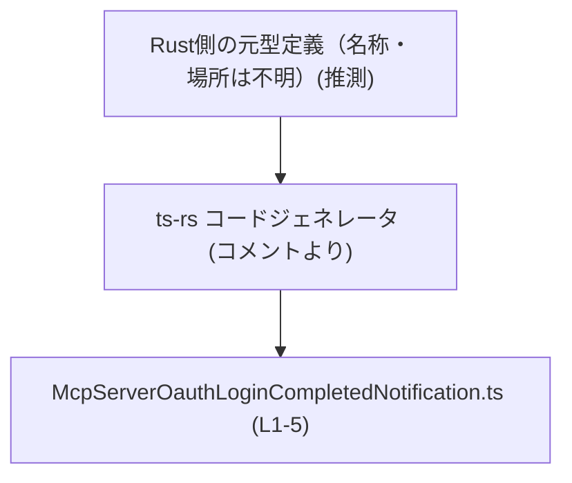
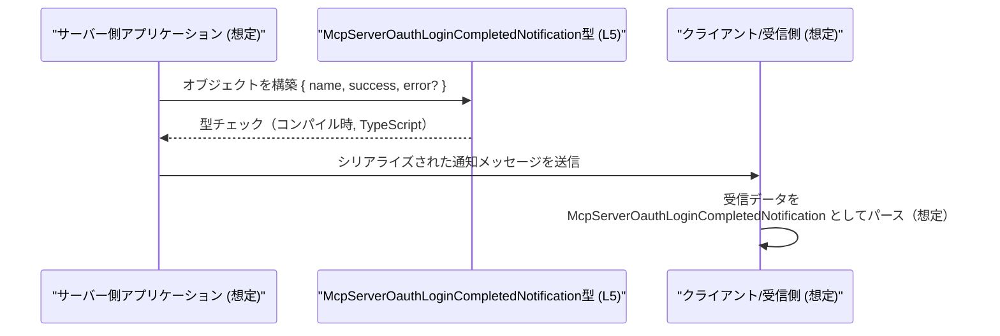

# app-server-protocol/schema/typescript/v2/McpServerOauthLoginCompletedNotification.ts コード解説

## 0. ざっくり一言

- `McpServerOauthLoginCompletedNotification` という **通知メッセージのペイロード構造** を表す TypeScript 型エイリアスを 1 つだけ定義しているファイルです（根拠: `McpServerOauthLoginCompletedNotification.ts:L5`）。
- ファイル全体は `ts-rs` による自動生成であり、**手動編集しないこと** がコメントで明記されています（根拠: `McpServerOauthLoginCompletedNotification.ts:L1-3`）。

---

## 1. このモジュールの役割

### 1.1 概要

- このモジュールは、`McpServerOauthLoginCompletedNotification` という **オブジェクト形の型エイリアス** を 1 つエクスポートします（根拠: `McpServerOauthLoginCompletedNotification.ts:L5`）。
- コメントから、この型は Rust から `ts-rs` によって生成された **プロトコル用のスキーマ定義** であり、手動での編集やロジック追加は想定されていません（根拠: `McpServerOauthLoginCompletedNotification.ts:L1-3`）。

型名やファイルパス（`schema/typescript/v2`）から、**OAuth ログイン完了時の通知メッセージのペイロード**を表す用途が想定されますが、その具体的な利用箇所や意味論はこのチャンクのコードからは読み取れません（命名とディレクトリ名に基づく推測であり、利用コードはこのチャンクには現れません）。

### 1.2 アーキテクチャ内での位置づけ

コードに現れている事実に基づく関係は次の 2 点です。

- このファイルは TypeScript 側のスキーマ定義（`schema/typescript/v2` 配下）に属します（根拠: ファイルパス）。
- コメントにより、Rust 側の型定義から `ts-rs` によって生成されていることが示されています（根拠: `McpServerOauthLoginCompletedNotification.ts:L3`）。

これを踏まえた概念的な依存関係は次のように表現できます（Rust 側の型や利用側コードの実体は、このチャンクには現れません）。



- `RustType` は、`ts-rs` が TypeScript 型を生成するための元になる Rust 型が存在するという **コメントからの推測** です（根拠: `McpServerOauthLoginCompletedNotification.ts:L3`）。
- このファイル自身からは、他の TypeScript モジュール（インポート元/先）との依存関係は読み取れません。**import/export は型エイリアス 1 つのみ**です（根拠: `McpServerOauthLoginCompletedNotification.ts:L5`）。

### 1.3 設計上のポイント

コードから読み取れる設計上の特徴は次のとおりです。

- **自動生成ファイル**  
  - 冒頭のコメントで「GENERATED CODE」「Do not edit manually」と明記されています（根拠: `McpServerOauthLoginCompletedNotification.ts:L1-3`）。
  - このため、仕様変更は元となる Rust 側の定義やコード生成設定で行う前提になっています。

- **状態を持たないスキーマ定義のみ**  
  - 実行時ロジック・関数・クラスは一切なく、**構造のみを表す型エイリアス**です（根拠: `McpServerOauthLoginCompletedNotification.ts:L5`）。
  - したがって、このファイル単体ではエラー処理・並行処理・副作用などは発生しません。

- **シンプルなオブジェクト構造**  
  - `name: string`, `success: boolean`, `error?: string` という 3 つのプロパティのみで構成されています（根拠: `McpServerOauthLoginCompletedNotification.ts:L5`）。
  - `error` が `?` 付きで **オプショナルなプロパティ** になっている点が設計上の特徴です。成功時に `error` を省略できるようにしていると解釈できますが、意味的な約束はコードからは明示されていません。

---

## 2. 主要な機能一覧

このモジュールが提供する機能は、構造定義のみです。

- `McpServerOauthLoginCompletedNotification` 型定義:  
  OAuth ログイン完了通知（と推測される）メッセージのペイロード構造を、`name`/`success`/`error` の 3 プロパティから成るオブジェクト型として表現します（根拠: `McpServerOauthLoginCompletedNotification.ts:L5`）。

※ 「OAuth ログイン完了通知」という意味付けは型名とパスからの推測であり、コード上で明示されているわけではありません。

---

## 3. 公開 API と詳細解説

### 3.1 型一覧（構造体・列挙体など）

このファイルで公開されている型は 1 つです。

| 名前 | 種別 | 役割 / 用途 | 定義位置（根拠） |
|------|------|-------------|------------------|
| `McpServerOauthLoginCompletedNotification` | 型エイリアス（オブジェクト型） | `name`・`success`・任意の `error` からなる通知ペイロード構造を表現するための TypeScript 型です。型名から、OAuth ログイン完了通知のメッセージスキーマと解釈できますが、利用コードはこのチャンクには現れません。 | `McpServerOauthLoginCompletedNotification.ts:L5` |

#### `McpServerOauthLoginCompletedNotification` フィールド詳細

`McpServerOauthLoginCompletedNotification` は、次の 3 つのプロパティを持つオブジェクト型です（根拠: `McpServerOauthLoginCompletedNotification.ts:L5`）。

| フィールド名 | 型 | 必須/任意 | 説明（コードから読み取れる範囲） | 定義位置（根拠） |
|-------------|----|-----------|----------------------------------|------------------|
| `name`      | `string`  | 必須 | 通知に紐づく名称を表す文字列です。名前の具体的な意味（サーバー名・プロバイダ名など）はコードからは分かりません。 | `McpServerOauthLoginCompletedNotification.ts:L5` |
| `success`   | `boolean` | 必須 | 処理が成功したかどうかを表す真偽値です。`true`/`false` のどちらの場合にも `error` の有無について型上の制約はありません。 | `McpServerOauthLoginCompletedNotification.ts:L5` |
| `error`     | `string`  | 任意（オプショナル） | エラー内容を表す文字列と推測されるプロパティです。`?` により、存在しない状態も許容されます。成功時に省略することを意図していると考えられますが、その契約は型レベルでは強制されていません。 | `McpServerOauthLoginCompletedNotification.ts:L5` |

##### 契約 / 前提条件（型から分かる範囲）

- この型が保証するのは、**構造上の契約** のみです。
  - `name` は常に `string` で存在する。
  - `success` は常に `boolean` で存在する。
  - `error` が存在する場合、その値は `string` である。
- それ以外の意味的な契約（例: `success === true` のときに `error` が必ず `undefined` であるべき、など）は **コードからは読み取れません**。そのような制約がある場合は、この型を利用する上位ロジックの責務になります。

##### Edge cases（エッジケース）

型レベルで想定される主な組み合わせと挙動は次のとおりです。

- `success: true` かつ `error` 未定義  
  - 正常に利用されるであろう典型的なパターンですが、型上は特別扱いされません。
- `success: false` かつ `error` 未定義  
  - **型レベルでは許容されます**。エラー理由が必須かどうかは、上位プロトコルの仕様次第であり、本ファイルからは判断できません。
- `success: true` かつ `error` に文字列が設定されている  
  - これも型レベルでは許容されます。意味的には矛盾する可能性がありますが、型で防いではいません。
- `error` に `null` や `number` などを入れる  
  - TypeScript の型チェックではコンパイルエラーとなるため、**そのような値は割り当てられません**（構造上の型安全性）。

##### バグ / セキュリティ観点（このファイル単体）

- このファイルには **実行ロジックが存在しない** ため、分岐ミスや例外処理漏れといった実行時バグは内包していません（根拠: 型エイリアス定義のみで関数がないこと: `McpServerOauthLoginCompletedNotification.ts:L5`）。
- `name` や `error` の文字列内容に対するバリデーションやサニタイズは、この型では行いません。**入力の妥当性やセキュリティは、この型を使う側のコードの責務** になります。
- 並行性・スレッド安全性も、この型定義のレベルでは問題になりません。単なるデータ構造であり、並行アクセスの可否は実際の実装（サーバー/クライアント側コード）に依存します。

### 3.2 関数詳細（最大 7 件）

このファイルには **関数・メソッド・クラスコンストラクタ等の実行可能な API は定義されていません**（根拠: `export type ...` の 1 行のみで関数定義がないこと: `McpServerOauthLoginCompletedNotification.ts:L5`）。

したがって、このセクションで説明すべき対象関数は存在しません。

### 3.3 その他の関数

- 補助的な関数やラッパー関数も **一切定義されていません**（根拠: 関数構文や `function`/`=>` がファイル内に存在しないこと: `McpServerOauthLoginCompletedNotification.ts:L1-5`）。

---

## 4. データフロー

このファイル内にはデータの生成・送信・受信といった処理フローは定義されていませんが、型名・ディレクトリ構成から想定される典型的な利用イメージを **概念図** として記載します。  
（※以下の図はあくまで利用イメージであり、実際の呼び出し関係はこのチャンクには現れません。）



このイメージにおける要点:

- `McpServerOauthLoginCompletedNotification` 型（L5）は、サーバー・クライアント双方のコードにおいて「この通知ペイロードはこの形をしている」という **コンパイル時の契約** を提供します。
- 実際のシリアライズ形式（JSON など）、送信プロトコル（HTTP, WebSocket など）、送信タイミングは **このファイルには書かれていません**。

---

## 5. 使い方（How to Use）

このセクションでは、`McpServerOauthLoginCompletedNotification` 型を **利用する側の TypeScript コード例** を示します。例中の import パスは、このファイルと同じディレクトリにあることを前提とした相対パスです。

### 5.1 基本的な使用方法

#### 成功時の通知ペイロードを作成する

```typescript
// 型をインポートする（同じディレクトリにある場合の例）         // import で型エイリアスを読み込む
import type { McpServerOauthLoginCompletedNotification } from "./McpServerOauthLoginCompletedNotification"; // ファイル名と一致

// OAuth ログインが成功したケースのペイロードを作成する         // 成功パターンのオブジェクトを生成
const successNotification: McpServerOauthLoginCompletedNotification = {
    name: "example-login-flow",                                         // name: string は必須
    success: true,                                                      // success: boolean も必須
    // error は成功時なので省略可能                                   // error?: string はこのように省略できる
};

// successNotification はコンパイル時に型チェックされる              // プロパティ名や型を間違えるとコンパイルエラーになる
console.log(successNotification);
```

このコードでは、

- `name` が `string`、`success` が `boolean` であることを TypeScript コンパイラが検証します。
- `error` はオプショナルなため、省略してもコンパイルが通ります（根拠: `error?: string` 定義: `McpServerOauthLoginCompletedNotification.ts:L5`）。

#### 失敗時の通知ペイロードを作成する

```typescript
import type { McpServerOauthLoginCompletedNotification } from "./McpServerOauthLoginCompletedNotification";

// OAuth ログインが失敗したケースのペイロードを作成する          // エラー情報付きのパターンを生成
const failureNotification: McpServerOauthLoginCompletedNotification = {
    name: "example-login-flow",                                         // 同じ name を利用
    success: false,                                                     // 失敗なので false
    error: "invalid_credentials",                                       // エラー内容を文字列で指定
};
```

ここでは、

- `error` プロパティを指定することで、失敗理由を文字列で表現できます。
- `success: false` と `error` の組み合わせは型上許容されますが、「失敗時に必ず `error` が必要かどうか」はこの型からは読み取れません。プロトコル仕様に依存する点です。

### 5.2 よくある使用パターン

#### ハンドラ関数の引数として利用する

通知メッセージを処理する関数の引数に、この型を指定するパターンです。

```typescript
import type { McpServerOauthLoginCompletedNotification } from "./McpServerOauthLoginCompletedNotification";

// 通知を処理する関数（利用側コードの例）                       // この関数自身は本ファイルには存在しない
function handleOauthLoginCompleted(
    notification: McpServerOauthLoginCompletedNotification,           // 型エイリアスを引数に指定
): void {
    if (notification.success) {                                       // success が true かどうかで分岐
        console.log(`Login flow '${notification.name}' succeeded.`);  // name にアクセス
    } else {
        console.error(
            `Login flow '${notification.name}' failed: ${notification.error ?? "unknown error"}`, // error はオプショナルなので ?? で補う
        );
    }
}
```

ポイント:

- `notification` オブジェクトに対して、補完や型チェックが効くようになります。
- `error` がオプショナルなため、`notification.error ?? "unknown error"` のような **null 合体演算子** と組み合わせると扱いやすくなります。

### 5.3 よくある間違い

#### プロパティ名のタイプミス

```typescript
import type { McpServerOauthLoginCompletedNotification } from "./McpServerOauthLoginCompletedNotification";

// 間違い例: プロパティ名を typo している                            // 'error' を 'err' と書いてしまったケース
const badNotification: McpServerOauthLoginCompletedNotification = {
    name: "example-login-flow",
    success: false,
    // err: "invalid_credentials",                                    // コンパイルエラー: err プロパティは定義されていない
};
```

正しい例:

```typescript
const goodNotification: McpServerOauthLoginCompletedNotification = {
    name: "example-login-flow",
    success: false,
    error: "invalid_credentials",                                     // 定義どおり error を使う
};
```

#### オプショナルプロパティを常に存在するとみなしてしまう

```typescript
function logError(notification: McpServerOauthLoginCompletedNotification) {
    // 間違い例: error が必ずある前提で toUpperCase を呼んでいる      // error はオプショナルなので undefined の可能性がある
    // console.error(notification.error.toUpperCase());               // コンパイルエラーになるか、strict 設定によっては警告される
}
```

正しい例（型を尊重した書き方）:

```typescript
function logErrorSafe(notification: McpServerOauthLoginCompletedNotification) {
    if (!notification.success && notification.error) {                // success が false かつ error が truthy の場合のみ使う
        console.error(notification.error.toUpperCase());
    }
}
```

### 5.4 使用上の注意点（まとめ）

- **このファイルは自動生成であり、手動編集しないこと**  
  - コメントに明記されています（根拠: `McpServerOauthLoginCompletedNotification.ts:L1-3`）。
  - 仕様変更が必要な場合は、元の Rust 型定義や `ts-rs` の設定を変更した上で再生成する必要があります。

- **意味的な契約は上位レイヤーで管理すること**  
  - 「`success: false` のときに `error` を必須とする」などのビジネスルールは、この型には埋め込まれていません。
  - そのようなルールは、バリデーション関数やハンドラ側で実装する必要があります。

- **セキュリティ・バリデーションは利用側の責務**  
  - 型定義は `string` であることのみを保証し、長さ・内容・エンコードなどは制約しません。
  - ログ出力・画面表示・外部送信などの前に、必要に応じてエスケープやフィルタリングを行うことが推奨されます。

---

## 6. 変更の仕方（How to Modify）

### 6.1 新しい機能を追加する場合

このファイルはコメントにより **自動生成コード** であると宣言されています（根拠: `McpServerOauthLoginCompletedNotification.ts:L1-3`）。そのため、

- **直接このファイルに新しいフィールドや型を追加することは推奨されません。**
- 新しい機能（たとえば `timestamp` フィールドや追加のメタデータ）を追加したい場合の一般的な手順は次のようになります（推奨フローであり、このリポジトリの実装詳細はこのチャンクからは不明です）:
  1. Rust 側の元となる型定義（`ts-rs` が参照する構造体や enum）に、新しいフィールドを追加する。
  2. `ts-rs` のコード生成を再実行し、TypeScript スキーマを再生成する。
  3. 生成された新しい型を利用する側の TypeScript コード（サーバー/クライアント）を更新する。

### 6.2 既存の機能を変更する場合

既存のプロパティ名や型を変更したい場合も、基本的には **同様に元の Rust 側定義の変更と再生成** が正しい手順です。

変更時に注意すべき点:

- **影響範囲の確認**
  - `McpServerOauthLoginCompletedNotification` 型を使用しているすべての TypeScript コードが影響を受ける可能性があります。
  - 名前変更や型変更によってコンパイルエラーが発生する箇所を確認し、修正が必要です。
- **プロトコル互換性**
  - この型はおそらくサーバーとクライアント間のプロトコル仕様の一部として利用されています（ディレクトリ名 `app-server-protocol` および `schema` からの推測）。
  - フィールドの削除や型の変更は、既存クライアントとの互換性を損なう可能性があるため、バージョニングポリシー（`v2` ディレクトリ）に従う必要があります。
- **テスト**
  - このファイルにはテストコードは存在しません（根拠: `McpServerOauthLoginCompletedNotification.ts:L1-5`）。
  - 変更後は、プロトコルを利用する側（サーバー/クライアント）のテストで、シリアライズ/デシリアライズと型整合性を確認することが望ましいです（推奨事項）。

---

## 7. 関連ファイル

このチャンクから直接参照できる関連情報は限られていますが、コメントやパスから推測できる関係を整理します。

| パス / リソース | 役割 / 関係 |
|----------------|------------|
| `app-server-protocol/schema/typescript/v2/` ディレクトリ | 本ファイルを含む TypeScript スキーマ定義群のディレクトリです。`v2` というバージョン付きのパスから、プロトコルのバージョニングが行われていると推測されますが、他ファイルの中身はこのチャンクには現れません。 |
| Rust側の元定義ファイル（パス不明） | コメントにより `ts-rs` によって生成されていることが示されているため、この型に対応する Rust の型定義が別途存在すると考えられます（根拠: `McpServerOauthLoginCompletedNotification.ts:L3`）。ただし、そのファイルパスやモジュール構成はこのチャンクからは不明です。 |
| `https://github.com/Aleph-Alpha/ts-rs` | コメントに記載されているコード生成ツール `ts-rs` の GitHub リポジトリです（根拠: `McpServerOauthLoginCompletedNotification.ts:L3`）。Rust の型定義から TypeScript の型を生成するために利用されています。 |

このファイル単体は非常に小さく、**型定義 1 行とコメントのみ**で構成されるため（根拠: `McpServerOauthLoginCompletedNotification.ts:L1-5`）、実際の処理ロジックやテスト・観測（ログなど）はすべて別ファイル側に存在すると考えられますが、その詳細はこのチャンクには現れていません。
