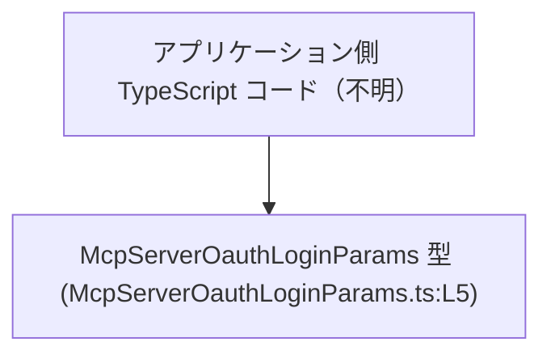
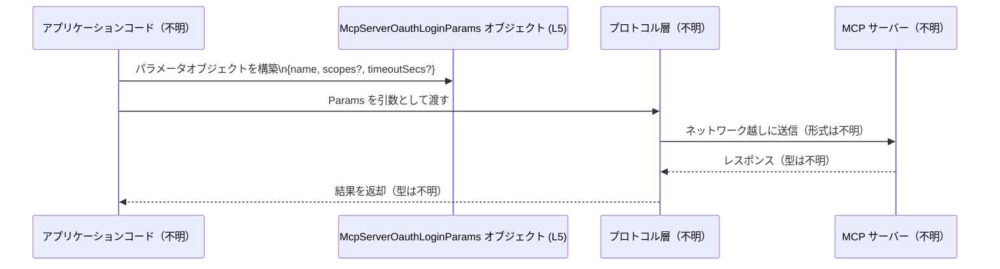

# app-server-protocol/schema/typescript/v2/McpServerOauthLoginParams.ts

## 0. ざっくり一言

このファイルは、自動生成された TypeScript の型エイリアス `McpServerOauthLoginParams` を 1 つ定義し、OAuth ログインに関連すると名前から推測されるパラメータオブジェクトの構造を表現しています（用途は型名からの推測であり、コードだけからは確定できません）  
（`McpServerOauthLoginParams.ts:L1-5`）

---

## 1. このモジュールの役割

### 1.1 概要

- コメントから、このファイルは `ts-rs` ツールにより自動生成されており、手動で編集してはいけないことが分かります  
  （`McpServerOauthLoginParams.ts:L1-3`）
- `export type McpServerOauthLoginParams = { ... }` により、外部から import 可能なオブジェクト型エイリアスが 1 つ公開されています  
  （`McpServerOauthLoginParams.ts:L5-5`）
- ディレクトリパス `app-server-protocol/schema/typescript/v2` から、この型は「アプリケーションとサーバー間のプロトコルのスキーマ（バージョン 2）の一部」であると考えられますが、詳細なプロトコル仕様はこのファイルからは分かりません。

### 1.2 アーキテクチャ内での位置づけ

このファイル自体には import や使用箇所の情報はありませんが、`export type` で公開されているため、他の TypeScript コードから「パラメータの型」として参照されることが想定されます（公開型であることは事実ですが、具体的な利用箇所はこのチャンクには現れません）。

想定される依存関係を、実際の利用コードは「不明」であると明示したうえで図示します。



- 実際に `McpServerOauthLoginParams` を import しているモジュールは、このチャンクには出てこないため「アプリケーション側 TypeScript コード（不明）」としています。
- この図の確実な事実は、「`McpServerOauthLoginParams` が export されているので、他のモジュールから参照できる形になっている」という点だけです（`McpServerOauthLoginParams.ts:L5-5`）。

### 1.3 設計上のポイント

コードから読み取れる設計上の特徴は以下のとおりです。

- **自動生成ファイル**  
  - 冒頭コメントに「GENERATED CODE! DO NOT MODIFY BY HAND!」とあり、さらに `ts-rs` によって生成されたと明記されています  
    （`McpServerOauthLoginParams.ts:L1-3`）。
  - 設計上の意図として、「スキーマの唯一の真実のソースは別の場所にあり、ここはその生成物」であることが示されています。

- **単一責務の型エイリアス**  
  - ファイルの中身は `export type McpServerOauthLoginParams = { ... }` の 1 行のみで、他に関数や追加の型はありません  
    （`McpServerOauthLoginParams.ts:L5-5`）。
  - このファイルは「特定のパラメータオブジェクトの型を提供する」という単一の責務を持つ構造になっています。

- **オプショナル + `null` の併用設計**  
  - `scopes?: Array<string> | null` と `timeoutSecs?: bigint | null` により、「プロパティが存在しない (`undefined`)」「存在するが `null`」「具体的な値が入っている」の 3 状態を区別できるよう設計されています  
    （`McpServerOauthLoginParams.ts:L5-5`）。
  - これにより、クライアント／サーバー間で「値が送られてこなかった」のか「明示的に未設定 (`null`)」なのかを区別することが可能な設計になっていると解釈できます。

- **BigInt の利用**  
  - `timeoutSecs` が `bigint` 型として定義されており、大きな秒数や整数演算の誤差を避けたい意図があると考えられますが、これは型からの推測であり、実際の使用方法はこのファイルからは分かりません  
    （`McpServerOauthLoginParams.ts:L5-5`）。

---

## 2. 主要な機能一覧

このファイルが提供する主要な「機能」は、1 つの公開型だけです。

- `McpServerOauthLoginParams`: OAuth ログインに関連すると名前から推測される、MCP サーバーに渡すパラメータオブジェクトの型エイリアスです（`McpServerOauthLoginParams.ts:L5-5`）。  
  ※ 実際にどのメソッドやエンドポイントで使われるかは、このチャンクには現れません。

---

## 3. 公開 API と詳細解説

### 3.1 型一覧（構造体・列挙体など）

#### 型インベントリー

| 名前 | 種別 | 役割 / 用途 | 定義箇所 |
|------|------|-------------|----------|
| `McpServerOauthLoginParams` | 型エイリアス（オブジェクト型） | MCP サーバーに送るパラメータの構造を表す公開型。型名から OAuth ログイン関連と推測されますが、用途はこのファイルからは確定できません。 | `McpServerOauthLoginParams.ts:L5-5` |

#### `McpServerOauthLoginParams` のプロパティ詳細

`McpServerOauthLoginParams` は次の 3 プロパティを持つオブジェクト型として定義されています。  
（`McpServerOauthLoginParams.ts:L5-5`）

```ts
export type McpServerOauthLoginParams = {
    name: string,
    scopes?: Array<string> | null,
    timeoutSecs?: bigint | null,
};
```

| プロパティ名 | 型 | 必須/任意 | 説明 | 定義箇所 |
|--------------|----|-----------|------|----------|
| `name` | `string` | 必須 | サーバー名・プロバイダ名など「名前」を表す文字列。実際に何の名前かはコードからは不明ですが、`name` という一般的な識別子を表していると解釈できます。 | `McpServerOauthLoginParams.ts:L5-5` |
| `scopes` | `Array<string> \| null`（オプショナル） | 任意 | 権限範囲などを表すと推測される文字列配列。プロパティ自体が存在しない場合（`undefined`）、存在するが `null`、具体的な文字列配列、の 3 状態を取り得ます。具体的なスコープ値の内容はこのファイルからは分かりません。 | `McpServerOauthLoginParams.ts:L5-5` |
| `timeoutSecs` | `bigint \| null`（オプショナル） | 任意 | タイムアウト秒数を表す整数と推測されます。`bigint` を用いることで大きな値も安全に扱える設計ですが、値の解釈や上限などの仕様はこのファイルからは分かりません。`undefined` / `null` / 具体的な `bigint` の 3 状態を取り得ます。 | `McpServerOauthLoginParams.ts:L5-5` |

##### TypeScript 的な安全性の観点

- `name` が必須の `string` であるため、コンパイル時に `name` を省略したり、`number` など別の型を渡したりすると TypeScript がエラーにできます。
- `scopes` と `timeoutSecs` は
  - **プロパティが存在しない**（オブジェクトにキーがない → `undefined`）
  - **存在するが値が `null`**
  - **具体的な値が入っている**
  の 3 状態を区別できるため、呼び出し側・受け取り側はこれを前提とした分岐を書く必要があります。

### 3.2 関数詳細（最大 7 件）

このファイルには関数・メソッドの定義は存在しません。  
（`export type` の 1 行のみで構成されています。`McpServerOauthLoginParams.ts:L5-5`）

### 3.3 その他の関数

このファイルには補助関数やラッパー関数も存在しません。  
（`McpServerOauthLoginParams.ts:L1-5` 全体を確認しても `function` / `=>` を含む関数定義はありません）

---

## 4. データフロー

このファイル単体には実際の呼び出しコードやネットワーク処理は含まれていませんが、`app-server-protocol/schema/typescript/v2` というパスと `McpServerOauthLoginParams` という型名から、「MCP サーバーとやり取りするプロトコルで使われるパラメータ型」であると考えられます（推測であり、このチャンクには仕様は現れません）。

ここでは、**想定される一般的な使用フロー**を、推測であることを明示したうえで示します。



- この図でコードから **直接確認できる事実** は、「`Params` として `McpServerOauthLoginParams` 型のオブジェクトが存在しうる」ことのみです（`McpServerOauthLoginParams.ts:L5-5`）。
- `App` / `Proto` / `Server` は、ファイルパスと型名からの推測に基づく概念的なコンポーネントであり、具体的な実装はこのチャンクには現れません。

---

## 5. 使い方（How to Use）

### 5.1 基本的な使用方法

ここでは、この型を利用する側のコードが同じ TypeScript プロジェクト内にあると仮定し、**型の使い方そのもの**を示す最低限の例を記載します。  
（import パスはプロジェクト構成によって異なるため、このファイルからは分かりません）

```ts
// McpServerOauthLoginParams 型を利用する側のコード例
// 実際の import パスはプロジェクト構成次第であり、このファイルからは分かりません。
import type { McpServerOauthLoginParams } from "…"; // ← 実際のパスは要確認

// OAuth ログイン用のパラメータオブジェクトを作成（用途は型名からの推測）
const params: McpServerOauthLoginParams = {         // params は定義されたオブジェクト型に従う必要がある
    name: "example-server",                        // 必須プロパティ name: string
    scopes: ["read", "write"],                     // 任意プロパティ scopes: string 配列の例
    timeoutSecs: 60n,                              // 任意プロパティ timeoutSecs: bigint の例（60 秒）
};

// この params を、実際のログイン関数などに渡すことが想定されますが、
// そうした関数はこのファイルには定義されていません。
```

ポイント:

- `timeoutSecs` は `number` ではなく `bigint`（末尾に `n` を付けたリテラル）で指定する必要があります。
- `scopes` と `timeoutSecs` は省略可能であり、省略した場合はオブジェクトにキー自体が存在しない状態になります。

### 5.2 よくある使用パターン

#### パターン 1: 最小限の必須情報のみ指定する

`name` だけを指定し、他はデフォルト挙動に任せるパターンです。

```ts
import type { McpServerOauthLoginParams } from "…"; // 実際のパスは不明

const paramsMinimal: McpServerOauthLoginParams = {  // 最小限のパラメータ
    name: "example-server",                        // 必須の name のみ指定
    // scopes と timeoutSecs は省略（プロパティ未定義状態）
};
```

- この場合、利用側（サーバー／プロトコル層）は `scopes` / `timeoutSecs` が **存在しない** 状態を前提に処理する必要があります。

#### パターン 2: 明示的に「指定なし」を表現する

`null` を使って「値を明示的に空とする」パターンです。

```ts
import type { McpServerOauthLoginParams } from "…";

const paramsExplicitNull: McpServerOauthLoginParams = {
    name: "example-server",                        // 必須
    scopes: null,                                  // プロパティは存在するが値は null
    timeoutSecs: null,                             // 同上
};
```

- 「プロパティが存在しない (`undefined`)」場合と、「`null` が明示的に入っている」場合を区別したいときに使う設計です。
- どのように意味づけるか（例: `null` は「サーバー側デフォルトに任せる」等）は、このファイルからは分かりません。

### 5.3 よくある間違い

型定義から推測される、よく起こりうる誤用例とその修正例を示します。

#### 間違い 1: `timeoutSecs` を `number` で渡す

```ts
import type { McpServerOauthLoginParams } from "…";

const badTimeout: McpServerOauthLoginParams = {
    name: "example-server",
    timeoutSecs: 60,          // ❌ コンパイルエラー: number は bigint に代入できない
};
```

正しい例:

```ts
import type { McpServerOauthLoginParams } from "…";

const goodTimeout: McpServerOauthLoginParams = {
    name: "example-server",
    timeoutSecs: 60n,         // ✅ bigint リテラル（末尾 n）で指定
};
```

#### 間違い 2: `scopes` に配列ではなく文字列を渡す

```ts
import type { McpServerOauthLoginParams } from "…";

const badScopes: McpServerOauthLoginParams = {
    name: "example-server",
    scopes: "read",           // ❌ コンパイルエラー: string は Array<string> | null には代入できない
};
```

正しい例:

```ts
import type { McpServerOauthLoginParams } from "…";

const goodScopes: McpServerOauthLoginParams = {
    name: "example-server",
    scopes: ["read"],         // ✅ string の配列で指定
};
```

### 5.4 使用上の注意点（まとめ）

- **自動生成ファイルを直接編集しないこと**  
  - コメントに「GENERATED CODE! DO NOT MODIFY BY HAND!」と明記されています（`McpServerOauthLoginParams.ts:L1-3`）。  
    型の変更やフィールド追加が必要な場合は、生成元（ts-rs の入力側）を変更する必要があります。生成元の場所はこのチャンクからは分かりません。

- **BigInt とシリアライズの注意**  
  - `timeoutSecs` は `bigint` であり、一般的に JSON のようなフォーマットにはそのままではシリアライズできません。  
    どのようなフォーマット／変換を行うかはこのファイルからは分かりませんが、利用側で `string` などへの変換が必要になる可能性があります。

- **`undefined` / `null` / 値あり の 3 状態を区別する必要**  
  - `scopes` / `timeoutSecs` はオプショナル (`?`) かつ `| null` のため、3 状態を意識した処理が必要です。
  - 特に、受け取り側で `params.scopes!.length` のように **非 null 断定** を行うと、`undefined` または `null` の場合に実行時エラーとなるため、型ガードや `if (params.scopes)` のようなチェックが重要になります。

- **TypeScript の型は実行時には存在しない**  
  - `McpServerOauthLoginParams` はコンパイル時の型情報であり、実行時に自動的なバリデーションは行われません。  
    外部から受け取ったデータをこの型として扱う場合、ランタイムのバリデーション（スキーマチェックなど）は別途必要です。

- **並行性・スレッド安全性**  
  - このファイルは単なる型定義であり、状態やスレッド操作を含まないため、直接的な並行性問題は存在しません。  
    実際の並行処理や非同期処理は、この型を利用する側のコードで発生し、その設計はこのファイルからは分かりません。

---

## 6. 変更の仕方（How to Modify）

### 6.1 新しい機能を追加する場合

「新しいフィールドを追加したい」「型を拡張したい」といった場合、コメントにある通り、このファイルを直接編集するのは想定されていません（`McpServerOauthLoginParams.ts:L1-3`）。

一般的な手順のイメージ（あくまで自動生成ファイル全般に対する方針であり、具体的な生成元はこのチャンクには現れません）:

1. **生成元の定義を探す**  
   - `ts-rs` によって生成されていることがコメントから分かるため（`McpServerOauthLoginParams.ts:L1-3`）、対応する元定義（おそらく別言語側の型定義）がどこかに存在するはずです。
   - その具体的な場所・言語（例: Rust など）はこのファイルからは判断できません。

2. **生成元の型にフィールドを追加／変更する**  
   - 必要なフィールドを生成元の型に追加します。
   - `scopes` のようにオプショナル + `null` にするか、必須にするかなどの設計方針も、生成元で決める必要があります。

3. **コード生成プロセスを再実行する**  
   - プロジェクトで用意されているビルド／コード生成コマンドを実行し、`McpServerOauthLoginParams.ts` が再生成されるようにします。
   - 具体的なコマンドはこのファイルからは分かりません。

4. **利用側コードのコンパイルエラーを確認する**  
   - 新フィールド追加や型変更に伴い、`McpServerOauthLoginParams` を使っている側でコンパイルエラーが出る可能性があります。  
   - それらのエラーを手がかりに、呼び出し側コードを更新します。

### 6.2 既存の機能を変更する場合

既存プロパティの型や必須／任意を変更する場合の注意点です。

- **影響範囲の確認**  
  - `McpServerOauthLoginParams` を import している全てのファイルが影響を受けます。
  - このチャンクには import している側の情報がないため、プロジェクト全体でシンボル参照検索を行う必要があります。

- **契約（コンタクト）に関する注意**  
  - `name` を任意プロパティに変える、`scopes` を必須にする、`timeoutSecs` の型を `number` に変える、などはプロトコルの契約を変更することになります。
  - 特にサーバー／クライアント間の通信フォーマットが変わる可能性があるため、どちら側がどのバージョンのスキーマを前提としているかを確認する必要があります（このファイルからはその情報は得られません）。

- **テストに関する注意**  
  - このファイルにはテストコードは含まれていませんが（`McpServerOauthLoginParams.ts:L1-5`）、プロジェクト全体としてはプロトコルの互換性を確認するテストが存在する可能性があります。
  - スキーマ変更後は、関連する統合テスト／エンドツーエンドテストなどを実行して、クライアントとサーバーが期待通りに動作することを確認する必要があります。

---

## 7. 関連ファイル

このチャンクには `McpServerOauthLoginParams.ts` 以外のファイル内容は含まれていないため、**具体的な関連ファイルの一覧は特定できません。**

推測も含めない形で整理すると、次のようになります。

| パス | 役割 / 関係 |
|------|------------|
| `app-server-protocol/schema/typescript/v2/McpServerOauthLoginParams.ts` | 本レポートの対象。`McpServerOauthLoginParams` 型エイリアスを定義する自動生成ファイル（`McpServerOauthLoginParams.ts:L1-5`）。 |
| （不明） | この型を生成している ts-rs の入力側定義や、この型を import している他の TypeScript ファイルは、このチャンクには現れません。 |

このため、「どこからこの型が呼ばれているか」「どのファイルが生成元か」などの詳細は、プロジェクト全体のソースコードを参照して確認する必要があります。
