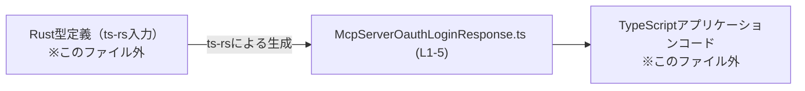
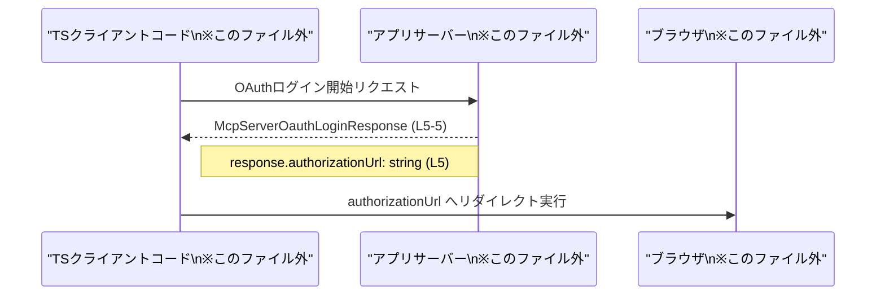

# app-server-protocol/schema/typescript/v2/McpServerOauthLoginResponse.ts コード解説

## 0. ざっくり一言

`McpServerOauthLoginResponse` は、OAuth ログイン処理のレスポンスとして「認可用 URL（authorizationUrl）」を表す TypeScript のオブジェクト型エイリアスです（型名とフィールド名からの解釈です / McpServerOauthLoginResponse.ts:L5-5）。

---

## 1. このモジュールの役割

### 1.1 概要

- このモジュールは、アプリケーションサーバーの「OAuth ログイン」に関するレスポンス形式を TypeScript の型として定義しています（型名より推測 / McpServerOauthLoginResponse.ts:L5-5）。
- Rust から TypeScript の型を生成するツール `ts-rs` により自動生成されたファイルであり、手で編集しない前提になっています（コメントより事実 / McpServerOauthLoginResponse.ts:L1-1, L3-3）。

### 1.2 アーキテクチャ内での位置づけ

- ファイルパス `schema/typescript/v2` から、この型は「アプリケーションサーバープロトコルのスキーマを TypeScript で表現するレイヤー」の一部と考えられます（パス名からの推測）。
- 冒頭コメントに `ts-rs` が明示されているため、Rust 側の型定義を元にこの TypeScript 型が生成されています（McpServerOauthLoginResponse.ts:L1-1, L3-3）。

想定される依存関係（利用イメージ）を、生成元と利用側に絞って図示します。



※ Rust 側定義と TypeScript アプリケーションコードの具体的な場所・内容は、このチャンクには現れません（不明）。

### 1.3 設計上のポイント

- **自動生成であること**  
  - `// GENERATED CODE! DO NOT MODIFY BY HAND!` というコメントにより、自動生成コードであり手動編集禁止であることが明示されています（McpServerOauthLoginResponse.ts:L1-1）。
  - `ts-rs` で生成されたこともコメントに書かれています（McpServerOauthLoginResponse.ts:L3-3）。
- **責務が型定義のみ**  
  - 関数やクラスは定義されておらず、1 つの型エイリアスのみをエクスポートしています（McpServerOauthLoginResponse.ts:L5-5）。
- **シンプルなオブジェクト型**  
  - `authorizationUrl: string` という必須プロパティのみを持つ単純なオブジェクト型です（McpServerOauthLoginResponse.ts:L5-5）。
- **エラーハンドリングや状態管理なし**  
  - ロジックを持たないため、このファイル単体ではエラー処理・並行性・状態管理等の懸念はありません。

---

## 2. 主要な機能一覧

このファイルが提供する「機能」は、実行時ロジックではなく型定義の提供に限られます。

- `McpServerOauthLoginResponse`: OAuth ログインのレスポンスオブジェクト（authorizationUrl を持つ）を表す TypeScript 型エイリアス（McpServerOauthLoginResponse.ts:L5-5）。

---

## 3. 公開 API と詳細解説

### 3.1 型一覧（構造体・列挙体など）

このファイルで公開されている主要な型は 1 つです。

| 名前 | 種別 | 役割 / 用途 | 主なフィールド | 根拠行 |
|------|------|-------------|----------------|--------|
| `McpServerOauthLoginResponse` | 型エイリアス（オブジェクト型） | OAuth ログイン API のレスポンス形式を表す型と解釈できます（型名・プロパティ名からの推測） | `authorizationUrl: string` | McpServerOauthLoginResponse.ts:L5-5 |

フィールドの詳細:

| フィールド名 | 型 | 説明 | 根拠行 |
|--------------|----|------|--------|
| `authorizationUrl` | `string` | OAuth 認可エンドポイントへの URL を表す文字列と解釈できます（名前からの推測）。型としては必須の `string` プロパティです。 | McpServerOauthLoginResponse.ts:L5-5 |

#### 型定義のコード抜粋

```typescript
export type McpServerOauthLoginResponse = { authorizationUrl: string, };
```

（McpServerOauthLoginResponse.ts:L5-5）

### 3.2 関数詳細（最大 7 件）

このファイルには関数・メソッドの定義は存在しません（McpServerOauthLoginResponse.ts:L1-5）。  
そのため、このセクションで詳細説明すべき関数はありません。

### 3.3 その他の関数

- 該当なし（関数定義自体がありません / McpServerOauthLoginResponse.ts:L1-5）。

---

## 4. データフロー

このファイル単体から実際の呼び出し元コードは分かりませんが、`McpServerOauthLoginResponse` がどのように使われるかの「一般的な利用イメージ」を示します。実際のコード構造は不明であるため、あくまで参考イメージです。

### 想定されるデータフロー（OAuth ログイン開始）



- `Server` が返す JSON を、クライアント側 TypeScript コードが `McpServerOauthLoginResponse` 型として扱う、という流れを想定しています。
- このシーケンス図は型名・プロパティ名に基づく推測であり、このチャンクから実際の API パスや HTTP メソッド等は分かりません。

---

## 5. 使い方（How to Use）

### 5.1 基本的な使用方法

`McpServerOauthLoginResponse` 型を利用して、サーバーからのレスポンスオブジェクトに型安全な注釈を付ける例です。

```typescript
// OAuth ログイン開始エンドポイントからレスポンスを取得する関数の例
async function startOauthLogin(): Promise<McpServerOauthLoginResponse> {        // 戻り値に型を付与
    const res = await fetch("/api/oauth/login");                               // 実際のURLはこのファイルからは不明
    const json = await res.json();                                             // any 型相当の値

    // json の構造が期待通りであると仮定して型アサーション
    return json as McpServerOauthLoginResponse;                                // authorizationUrl: string を持つとみなす
}

// 取得した authorizationUrl にリダイレクトする利用例
async function redirectToAuthorization() {
    const response = await startOauthLogin();                                  // 型: McpServerOauthLoginResponse
    window.location.href = response.authorizationUrl;                          // string として補完・型チェックされる
}
```

- `McpServerOauthLoginResponse` 型のおかげで、`authorizationUrl` へのアクセス時に IDE 補完やコンパイル時チェックが効きます（McpServerOauthLoginResponse.ts:L5-5）。
- 実際には `json` の妥当性チェック（プロパティ存在確認など）を挟むことが望ましいですが、このファイルには検証ロジックは含まれていません。

### 5.2 よくある使用パターン

1. **API クライアント層での型注釈**

```typescript
// API クライアント関数
export async function fetchOauthLoginResponse(): Promise<McpServerOauthLoginResponse> {
    const res = await fetch("/api/oauth/login");
    const data = await res.json();

    // 型ガードや zod などで検証するのが理想だが、このファイルからは不明
    return data as McpServerOauthLoginResponse;
}
```

1. **コンポーネント／画面での利用**

```typescript
async function handleLoginClick() {
    const { authorizationUrl } = await fetchOauthLoginResponse();    // 分割代入で取得
    // ここで authorizationUrl は string 型として扱える
    window.open(authorizationUrl, "_self");
}
```

### 5.3 よくある間違い

この型を使う際に起こりうる誤用例と、その修正例です。

```typescript
// 誤りの例: プロパティ名の typo
async function badUsage() {
    const res = await fetch("/api/oauth/login");
    const data = await res.json() as McpServerOauthLoginResponse;

    // コンパイルエラー: 存在しないプロパティ名
    // window.location.href = data.authUrl; // プロパティ 'authUrl' は型に存在しない

    // 正しい例: 定義通りの 'authorizationUrl' を使う
    window.location.href = data.authorizationUrl;
}
```

```typescript
// 誤りの例: 型を付けず any として扱う
async function unsafeUsage() {
    const res = await fetch("/api/oauth/login");
    const data = await res.json();                      // data: any 相当

    // タイプミスしてもコンパイルエラーにならない
    window.location.href = data.authrizationUrl;        // 実行時まで誤りに気づけない
}

// 正しい例: McpServerOauthLoginResponse を付ける
async function safeUsage() {
    const res = await fetch("/api/oauth/login");
    const data = await res.json() as McpServerOauthLoginResponse;

    window.location.href = data.authorizationUrl;       // 型チェックあり
}
```

### 5.4 使用上の注意点（まとめ）

- **自動生成ファイルを直接変更しない**  
  - 冒頭コメントで手動編集禁止が明示されています（McpServerOauthLoginResponse.ts:L1-1, L3-3）。  
    型の変更が必要な場合は、元の Rust 型定義やスキーマを修正し、`ts-rs` で再生成する必要があります。
- **ランタイムの検証は行われない**  
  - TypeScript の型はコンパイル時のみ有効であり、実行時に `authorizationUrl` の存在や URL 形式を保証するものではありません。利用側で必要に応じて検証する前提になります。
- **authorizationUrl の安全性**  
  - `authorizationUrl` は単なる `string` 型であり、値の安全性（期待するドメインかどうか等）はこの型からは分かりません。  
    リダイレクトに使用する場合は、利用側コードでホワイトリストチェックなどを行う必要があります（このファイルには何も記述されていません）。

---

## 6. 変更の仕方（How to Modify）

### 6.1 新しい機能を追加する場合

このファイルは自動生成されるため、直接の追記・変更は想定されていません（McpServerOauthLoginResponse.ts:L1-1, L3-3）。

新しいフィールドを追加したい場合の一般的な流れ（このチャンク外の話です）:

1. **Rust 側の元となる型定義を変更**  
   - `authorizationUrl` に加え、たとえば `state` や `expiresAt` などのフィールドを追加したい場合は、Rust 構造体にフィールドを追加する（場所はこのチャンクからは不明）。
2. **`ts-rs` で TypeScript 型を再生成**  
   - プロジェクトで用意されているビルド／スクリプトを実行し、`McpServerOauthLoginResponse.ts` を再生成する。
3. **TypeScript 側の利用コードを更新**  
   - 新しいフィールドを利用したり、従来フィールドとの整合性を取る。

### 6.2 既存の機能を変更する場合

- **フィールド名・型の変更**  
  - `authorizationUrl` のフィールド名や型（string 以外にする等）を変更したい場合も、同様に Rust 側定義を修正し再生成する必要があります（McpServerOauthLoginResponse.ts:L5-5 が自動生成行であるため）。
- **影響範囲**  
  - TypeScript コード中で `McpServerOauthLoginResponse` を参照している箇所すべてに影響が出ます。  
  - コンパイルエラーを手掛かりに、`authorizationUrl` を使用しているコードを確認することが有効です。
- **契約（前提条件）の意識**  
  - この型は「authorizationUrl が必須で string 型である」という契約を表します（McpServerOauthLoginResponse.ts:L5-5）。  
    型を変更する場合は、その契約に依存しているコードがないかを確認する必要があります。

---

## 7. 関連ファイル

このチャンクだけから特定できる関連ファイルは限られますが、構造とコメントから推測できるものを整理します。

| パス / 要素 | 役割 / 関係 |
|------------|------------|
| （Rust 側の型定義ファイル） | `ts-rs` の入力となる Rust 型定義。ここでの変更が `McpServerOauthLoginResponse.ts` に反映されると考えられます（McpServerOauthLoginResponse.ts:L3-3 に `ts-rs` 明記）。具体的なパスはこのチャンクには現れません。 |
| `app-server-protocol/schema/typescript/v2/` ディレクトリ | `McpServerOauthLoginResponse.ts` を含む TypeScript スキーマ群のディレクトリと考えられます（パスより推測）。他にも類似のレスポンス／リクエスト型定義ファイルが存在する可能性があります。 |
| TypeScript クライアントコード（例: API クライアント層） | `McpServerOauthLoginResponse` 型を import して実際に利用する側のコード。位置やファイル名はこのチャンクには現れません（不明）。 |

---

### コンポーネントインベントリー（まとめ）

このチャンク内コンポーネントを一覧としてまとめると次のようになります。

| コンポーネント名 | 種別 | 内容 / 役割 | 定義行 |
|------------------|------|-------------|--------|
| `McpServerOauthLoginResponse` | TypeScript 型エイリアス（オブジェクト型） | OAuth ログインレスポンスの形（authorizationUrl: string）を表現する型。ロジックは持たない。 | McpServerOauthLoginResponse.ts:L5-5 |

- 関数・クラス・enum・namespace など、他のコンポーネントはこのチャンクには存在しません（McpServerOauthLoginResponse.ts:L1-5）。
