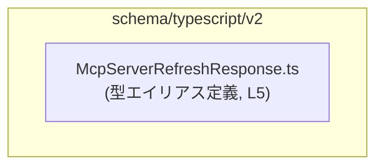
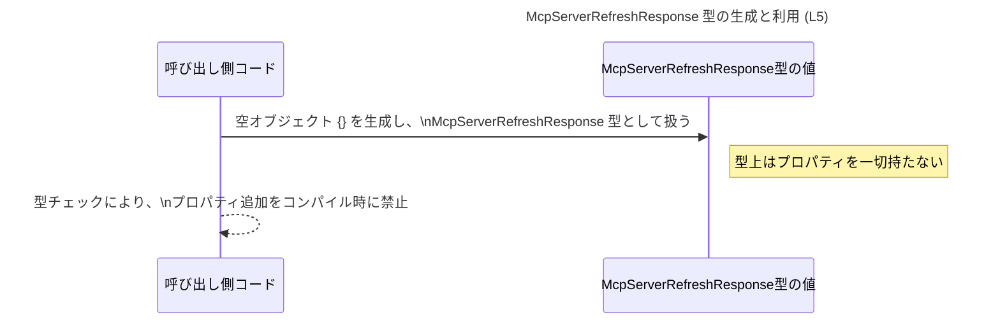

# app-server-protocol\schema\typescript\v2\McpServerRefreshResponse.ts コード解説

## 0. ざっくり一言

- `McpServerRefreshResponse` は、**フィールドを一切持たないサーバー応答**を表す TypeScript の型エイリアスです（`Record<string, never>` として定義, `...McpServerRefreshResponse.ts:L5-5`）。
- このファイルは `ts-rs` により自動生成されており、**手動編集しないこと**が明示されています（`...McpServerRefreshResponse.ts:L1-3`）。

---

## 1. このモジュールの役割

### 1.1 概要

- このモジュールは、**アプリケーションサーバのプロトコルにおける「リフレッシュ応答」メッセージの型定義**を提供します（型名より推測。型定義そのものは `...McpServerRefreshResponse.ts:L5-5`）。
- 実際の処理ロジックや値の生成・送信は他のモジュール側で行われ、このファイルは **型情報（スキーマ）だけ**を持ちます（関数やクラスが存在しないことから, `...McpServerRefreshResponse.ts:L1-5`）。

### 1.2 アーキテクチャ内での位置づけ

- ファイルパスから、この型は **`app-server-protocol/schema/typescript/v2` に属する TypeScript v2 用スキーマ定義の一部**であることが分かります（パス情報より）。
- このチャンクには他モジュールへの `import` や、他モジュールからの参照は現れていないため、**具体的な依存関係は不明**です（`...McpServerRefreshResponse.ts:L1-5`）。

依存関係（このチャンクから分かる範囲のみ）を簡略図で表します。



- 上図は「このファイルがスキーマ定義ディレクトリ内に単独で存在し、他モジュールへの依存がコード上に現れていない」という事実だけを表します。

### 1.3 設計上のポイント

- **自動生成コード**  
  - ファイル先頭コメントで `ts-rs` による自動生成であり、手動変更禁止とされています（`...McpServerRefreshResponse.ts:L1-3`）。
- **状態を持たない型定義のみのモジュール**  
  - 実行時の状態やロジックは持たず、型エイリアス定義のみです（`...McpServerRefreshResponse.ts:L5-5`）。
- **空オブジェクトを強制する型**  
  - `Record<string, never>` によって、**任意のプロパティ名を持つことができるが、その値型が `never`** であるため、実質的に「プロパティを持たないオブジェクト」になります（TypeScript の `Record` と `never` の意味に基づく）。

---

## 2. 主要な機能一覧

このファイルが提供する機能は 1 つだけです。

- `McpServerRefreshResponse` 型: **フィールドを持たないリフレッシュ応答オブジェクト**を表す型エイリアス（`Record<string, never>` として実装, `...McpServerRefreshResponse.ts:L5-5`）

---

## 3. 公開 API と詳細解説

### 3.1 型一覧（構造体・列挙体など）

| 名前                      | 種別      | 役割 / 用途                                                                 | 根拠 |
|---------------------------|-----------|-----------------------------------------------------------------------------|------|
| `McpServerRefreshResponse` | 型エイリアス | プロパティを持たないリフレッシュ応答オブジェクトを表す TypeScript 型。空のレスポンスを型安全に扱う。 | `app-server-protocol\schema\typescript\v2\McpServerRefreshResponse.ts:L5-5` |

#### 型の意味（TypeScript 視点）

- `Record<string, never>` は、「**全ての string キーに対する値の型が `never` であるオブジェクト型**」です。
- 実際には、`{}` のような **プロパティを持たないオブジェクトだけ**がこの型に代入可能です。  
  例（概念的な説明）：

```typescript
// OK: プロパティを持たない空オブジェクトは代入できると考えられます
const ok: McpServerRefreshResponse = {};  // 型エラーは発生しない想定

// NG: 何らかのプロパティを持つオブジェクトはコンパイルエラーになります
// const ng: McpServerRefreshResponse = { refreshed: true }; // 型チェックでエラーになる想定
```

> 上記コードは、この型定義と TypeScript の仕様から論理的に導かれる一般例であり、実際のリポジトリ内のコードではありません。

### 3.2 関数詳細（最大 7 件）

- **このファイルには関数定義が存在しません**（`export type` 以外のトップレベル宣言が無いことから, `...McpServerRefreshResponse.ts:L1-5`）。
- したがって、このセクションで詳細に解説すべき関数はありません。

### 3.3 その他の関数

- 補助関数・内部関数ともに、このチャンクには一切現れません（`...McpServerRefreshResponse.ts:L1-5`）。

---

## 4. データフロー

このファイルには実行時ロジックが無いため、**型レベルの「データ形状」**に関するフローのみが説明可能です。

ここでは、`McpServerRefreshResponse` 型の値が生成され、他の処理に渡されるまでの **一般的な利用パターン**を、型定義（L5）に基づいて模式的に示します。



- このシーケンス図は、「`McpServerRefreshResponse` が `Record<string, never>` として定義されているため、**プロパティの無い応答オブジェクトだけが許容される**」という型レベルの流れを表しています（`...McpServerRefreshResponse.ts:L5-5`）。
- 実際にどのモジュールからこの型が使われているか、どこへ送信されるかといった具体的な呼び出し元・呼び出し先は、このチャンクには現れません（不明）。

---

## 5. 使い方（How to Use）

### 5.1 基本的な使用方法

`McpServerRefreshResponse` は「**空の応答**」を表すための型です。典型的には、次のように値を生成して返却します。

```typescript
// McpServerRefreshResponse型をインポートする（相対パスは例示）
import type { McpServerRefreshResponse } from "./McpServerRefreshResponse";

// リフレッシュ処理の結果、ボディ無しの応答を返す関数の例
function refreshServer(): McpServerRefreshResponse {
    // 空オブジェクトを返すことで、「成功したが追加データは無い」ことを表現できる
    return {};
}

// 使用例
const resp = refreshServer();  // resp の型は McpServerRefreshResponse
// resp にプロパティを追加しようとすると、TypeScript がコンパイルエラーにしてくれる想定
// resp.someField = 123; // エラーになるはず（McpServerRefreshResponseにプロパティは定義されていない）
```

- ここでのポイントは、**戻り値として「何も持たないオブジェクト」を型で保証できる**ことです。

### 5.2 よくある使用パターン

1. **空の成功レスポンスとして使う**

```typescript
function handleRefreshRequest(): McpServerRefreshResponse {
    // 何らかのリフレッシュ処理（詳細は別モジュール）
    // ...
    // 成功したことだけを示し、追加情報は返さない
    return {};
}
```

1. **ジェネリックなレスポンス型と組み合わせる（例）**

```typescript
// 汎用レスポンス型の例
type ApiResponse<T> = {
    ok: boolean;      // 成否
    data: T;          // ペイロード
};

// McpServerRefreshResponse をペイロードとして使う
type RefreshApiResponse = ApiResponse<McpServerRefreshResponse>;

// 使用例
const response: RefreshApiResponse = {
    ok: true,
    data: {},        // data に余計なプロパティを持たせると型エラー
};
```

- `McpServerRefreshResponse` をジェネリックなレスポンス型の `T` に指定すると、「成功・失敗などのメタ情報は別フィールドで持ちつつ、ボディは空」という構造を表現できます。

> 上記は一般的な TypeScript パターンの例であり、このチャンクのコードに直接は現れません。

### 5.3 よくある間違い

```typescript
import type { McpServerRefreshResponse } from "./McpServerRefreshResponse";

// 間違い例: 何かしらの情報をプロパティとして持たせてしまう
// const bad: McpServerRefreshResponse = {
//     message: "refreshed",  // コンパイルエラーになるはず
// };

// 正しい例: プロパティを持たないオブジェクトにする
const good: McpServerRefreshResponse = {};
```

- 型 `McpServerRefreshResponse` は、**プロパティを持たせないこと自体が契約**になっているため、「何かしら追加情報を持たせたい」ときは別の型を定義する必要があります。

### 5.4 使用上の注意点（まとめ）

- **前提条件**
  - `McpServerRefreshResponse` 型の値は、**プロパティを持たないオブジェクト**であることが前提です（`Record<string, never>` の定義より, `...McpServerRefreshResponse.ts:L5-5`）。
- **エラー・型チェック**
  - プロパティを持つオブジェクトを代入しようとすると、TypeScript のコンパイル時型チェックでエラーになります。  
    ランタイムエラーではなく、**ビルド時に検出される**点が安全性上の特徴です。
- **並行性**
  - この型定義自体は実行時の状態を持たないため、**並行処理・スレッド安全性に関する問題は直接発生しません**。
- **セキュリティ**
  - 型の観点では、「この応答にはいかなるフィールドも載せない」ことをコンパイル時に強制できるため、**機密情報を誤って入れてしまうことを防ぎやすい**という効果があります。
  - ただし、実際の送信処理でこの型が無視されれば（例: 生の JavaScript でオブジェクトを構築するなど）、型安全性による保証は効きません。

---

## 6. 変更の仕方（How to Modify）

### 6.1 新しい機能を追加する場合

- ファイル先頭コメントにより、このファイルは `ts-rs` による **自動生成コードであり、手動編集してはいけない**ことが明示されています（`...McpServerRefreshResponse.ts:L1-3`）。
- `McpServerRefreshResponse` に新しいフィールドを追加したい場合は、**生成元の定義（Rust 側やスキーマ定義）を変更し、再生成する必要があります**。
  - 生成元がどこかはこのチャンクには現れないため、**具体的なファイルパスやモジュール名は不明**です。

### 6.2 既存の機能を変更する場合

- 直接このファイルを編集すると、次回のコード生成で上書きされる可能性が高く、**変更が失われる危険**があります（自動生成コードの一般的な性質として）。
- 変更時に注意すべき点：
  - **契約の維持**  
    - 現在の契約は「応答は空オブジェクトであること」です（`Record<string, never>`, `...McpServerRefreshResponse.ts:L5-5`）。
    - これを破ってフィールドを追加する場合、呼び出し元コードが「フィールドが無い前提」で書かれていると互換性が失われる可能性があります。
  - **影響範囲**  
    - どのモジュールが `McpServerRefreshResponse` を利用しているかは、このチャンクには現れません。不明なため、変更時には依存箇所の検索が必須です。

---

## 7. 関連ファイル

このチャンクには `import` 文や他ファイル名は出てこないため、**具体的な関連ファイルは特定できません**（不明）。

この前提の上で、わかる範囲を整理します。

| パス / 名称                                             | 役割 / 関係 |
|--------------------------------------------------------|------------|
| `app-server-protocol\schema\typescript\v2\`            | `McpServerRefreshResponse.ts` を含むディレクトリ。TypeScript v2 用のプロトコルスキーマ群のコンテナと思われるが、他ファイルはこのチャンクには現れないため詳細は不明。 |
| （生成元の Rust/スキーマファイル）                     | `ts-rs` によりこの TypeScript ファイルを生成していると考えられるが、具体的なパス・モジュール名はこのチャンクからは分からない。 |

---

### まとめ（安全性・エッジケース・バグ観点）

- **公開 API** は `McpServerRefreshResponse` 型エイリアスのみ（`...McpServerRefreshResponse.ts:L5-5`）。
- **コアロジックやランタイム処理は存在せず**、コンパイル時の型チェック専用です。
- **エラー / エッジケース**
  - プロパティ付きオブジェクトを代入しようとした場合、コンパイル時エラーになることが想定されます。
  - 空オブジェクト `{}` は問題無く扱える想定です。
- **並行性 / パフォーマンス**
  - 型定義のみであり、実行時コスト・並行性に関する課題はありません。
- **セキュリティ**
  - 「この応答に情報を載せない」という契約を型で表現できるため、機密情報の誤送出を防ぐ一助になりますが、実際の実装がこの型を遵守するかどうかは、他チャンクのコードに依存します（このチャンクには現れません）。
