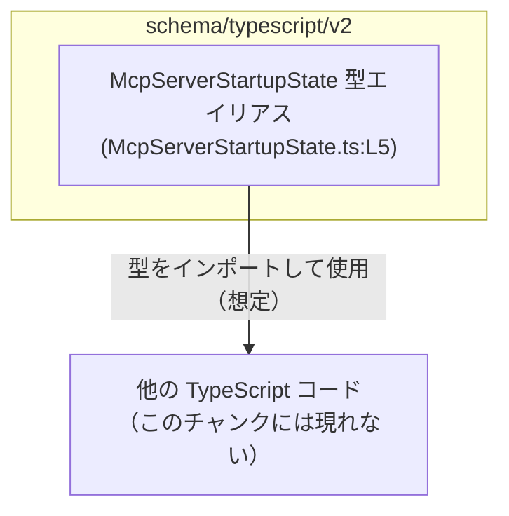
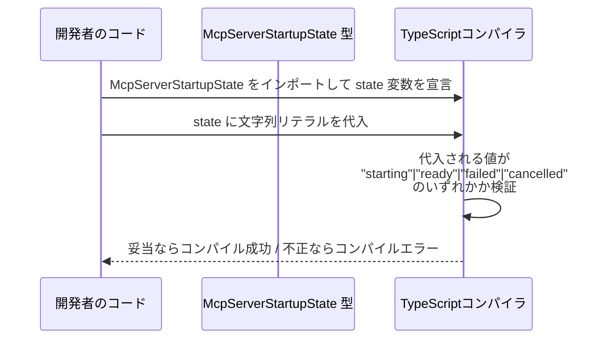

# app-server-protocol/schema/typescript/v2/McpServerStartupState.ts コード解説

## 0. ざっくり一言

`McpServerStartupState` は、MCP サーバーの起動状態を表す **文字列リテラル・ユニオン型**（列挙的な型）を定義する、自動生成された TypeScript ファイルです  
（`McpServerStartupState.ts:L1-5`）。

---

## 1. このモジュールの役割

### 1.1 概要

- このモジュールは、`McpServerStartupState` という型エイリアスを公開し、  
  `"starting" | "ready" | "failed" | "cancelled"` のいずれかだけを取りうる状態として型で表現します  
  （`McpServerStartupState.ts:L5-5`）。
- ファイル先頭のコメントから、この型は Rust 側の定義から `ts-rs` によって自動生成されており、手動編集しないことが前提になっています  
  （`McpServerStartupState.ts:L1-3`）。

### 1.2 アーキテクチャ内での位置づけ

このチャンクには他モジュールとの依存関係は現れていませんが、パスとコメントから、

- 「app-server-protocol」の TypeScript スキーマ群の一部
- 他の TypeScript コードからインポートされ、「サーバー起動状態」を型安全に表すために使われる

という位置づけの **型定義専用モジュール**であると解釈できます  
（`McpServerStartupState.ts:L1-5`）。

依存関係（イメージ）を Mermaid で示します。利用側モジュールの具体名はこのチャンクには存在しないため「他モジュール」としています。



### 1.3 設計上のポイント

- **自動生成コード**  
  - `ts-rs` による自動生成であり、手動編集禁止であることが明示されています  
    （`McpServerStartupState.ts:L1-3`）。
- **列挙的なユニオン型表現**  
  - TypeScript の文字列リテラル・ユニオン型として定義されており、`"starting" | "ready" | "failed" | "cancelled"` 以外の文字列をコンパイル時に排除できます  
    （`McpServerStartupState.ts:L5`）。
- **状態を持たない純粋な型定義**  
  - 実行時の値や処理を持たない、コンパイル時のみの型情報です。副作用や並行性の問題は発生しません。
- **エラーハンドリングの方針**  
  - このファイル内にはロジックやエラー処理はなく、「不正な状態は TypeScript の型チェックで弾く」という静的安全性に依存する設計です。

---

## 2. 主要な機能一覧

このファイルで提供される「機能」は 1 つの型エイリアスのみです。

- `McpServerStartupState` 型:  
  MCP サーバーの起動状態として `"starting" | "ready" | "failed" | "cancelled"` の 4 値のみを許可する文字列リテラル・ユニオン型。

---

## 3. 公開 API と詳細解説

### 3.1 型一覧（構造体・列挙体など）

| 名前                     | 種別                                   | 役割 / 用途                                                                                 | 定義箇所                           |
|--------------------------|----------------------------------------|----------------------------------------------------------------------------------------------|------------------------------------|
| `McpServerStartupState`  | 型エイリアス（文字列リテラル・ユニオン型） | MCP サーバー起動状態を `"starting"`, `"ready"`, `"failed"`, `"cancelled"` のいずれかで表現するための型 | `McpServerStartupState.ts:L5-5`   |

#### 定義コード

```typescript
export type McpServerStartupState = "starting" | "ready" | "failed" | "cancelled";
//                               ^^^^^^^^^^^^^^^^^^^^^^^^^^^^^^^^^^^^^^^^^^^^^^^^^
// 4 つの文字列リテラルのユニオン型として定義されている（McpServerStartupState.ts:L5）
```

### 3.2 関数詳細（最大 7 件）

このファイルには **関数定義は存在しません**（`McpServerStartupState.ts:L1-5`）。  
代わりに、このモジュールの唯一の公開 API である型 `McpServerStartupState` について、関数テンプレート形式で詳細を整理します。

#### `McpServerStartupState`

**概要**

- MCP サーバーの「起動状態」を表すための、列挙的な文字列リテラル・ユニオン型です  
  （`"starting" | "ready" | "failed" | "cancelled"`, `McpServerStartupState.ts:L5`）。
- これにより、誤った文字列（例: `"started"`, `"error"` など）がコンパイル時に検出されます。

**定義**

- 型: `type McpServerStartupState = "starting" | "ready" | "failed" | "cancelled";`  
  （`McpServerStartupState.ts:L5`）
- すべてのメンバーは **string リテラル型** です。

**取り得る値**

- `"starting"`: 起動処理中の状態を表すと解釈できます（名称からの解釈。コードからの厳密な意味は不明）。
- `"ready"`: 起動完了し「準備完了」である状態を表すと解釈できます。
- `"failed"`: 起動に失敗した状態を表すと解釈できます。
- `"cancelled"`: 起動処理がキャンセルされた状態を表すと解釈できます。

※ 上記の意味づけは名前からの推測であり、**正確な仕様はこのチャンクからは分かりません**。

**Examples（使用例）**

以下は、この型を利用した典型的な TypeScript コード例です（すべて架空の使用例であり、このリポジトリ内に実在する関数ではありません）。

```typescript
// McpServerStartupState をインポートして利用する例
import type { McpServerStartupState } from "./McpServerStartupState"; // 型定義をインポート

// 起動状態が ready かどうかを判定する関数
function isServerReady(state: McpServerStartupState): boolean {       // 引数にユニオン型を使用
    return state === "ready";                                         // 許可された 4 つの値のうち "ready" と比較
}

// 使用例
const s1: McpServerStartupState = "starting"; // OK: 許可された値
const s2: McpServerStartupState = "ready";    // OK
// const s3: McpServerStartupState = "started"; // コンパイルエラー: "started" はユニオンに含まれない

console.log(isServerReady(s1)); // false
console.log(isServerReady(s2)); // true
```

このように、コンパイラが `"started"` のような誤記を検出してくれる点が主な利点です。

**Errors / Panics**

- この型はコンパイル時のみ存在する **型情報** であり、実行時の処理やパニックは発生しません。
- ただし、次のようなケースでは TypeScript コンパイルエラーになります。

  - `McpServerStartupState` 型の変数に、ユニオンに含まれない文字列を代入しようとした場合。
  - `switch (state)` で `McpServerStartupState` を完全網羅する `case` を書き、将来ユニオンにメンバーを追加したときに網羅性チェック（`never` 型チェックなど）でエラーになるケース。

**Edge cases（エッジケース）**

- **空文字列 `""`**  
  - ユニオンに含まれないため、`McpServerStartupState` 型の変数に直接代入するとコンパイルエラーになります。
- **大文字・小文字違い**  
  - `"Ready"` や `"READY"` などもユニオンに含まれないため、コンパイルエラーになります。
- **`string` 型からの代入**  
  - 例えば `const s: string = getState();` のような `string` 型の変数は、直接 `McpServerStartupState` には代入できません。  
    型ガードや `as` アサーションを用いる必要があります（アサーションは安全性低下に注意）。
- **実行時の不正値**  
  - TypeScript の型は実行時には消えるため、外部入力から `"starting"` 以外の文字列が来ても、別途ランタイムチェックを入れない限り自動では弾かれません。  
    静的型だけではランタイムの安全性は保証されない点に注意が必要です。

**使用上の注意点**

- **自動生成コードのため、直接編集しない**  
  - コメントに「GENERATED CODE! DO NOT MODIFY BY HAND!」と明示されているため  
    （`McpServerStartupState.ts:L1-3`）、状態を変更・追加したい場合は **生成元（Rust 側の定義）を変更** する必要があります。
- **`string` ではなく `McpServerStartupState` を使う**  
  - 関数の引数や返り値に単なる `string` を使うと、4 つ以外の文字列も許容してしまいます。  
    状態として扱う場所では、積極的に `McpServerStartupState` を型注釈に使うことで、誤値をコンパイル時に防げます。
- **アサーション乱用の注意**  
  - `value as McpServerStartupState` のような型アサーションで無理に型を合わせると、コンパイラのチェックをすり抜けてしまい、  
    実行時に不正な値が紛れ込む可能性が高まります。  
    外部入力には runtime バリデーションを組み合わせる方が望ましいです。
- **並行性・スレッド安全性**  
  - この型自体は純粋な文字列の型定義であり、共有・並行アクセスに伴うスレッド安全性の問題は発生しません。  
    並行処理でこの型を使っても、型の観点から追加の注意事項はありません。

### 3.3 その他の関数

- このファイルには **補助関数やラッパー関数は定義されていません**（`McpServerStartupState.ts:L1-5`）。

---

## 4. データフロー

このモジュールは値やロジックを持たないため、**実行時のデータフローはこのファイルからは分かりません**。  
ここでは、「コンパイル時に型チェックが行われる」という観点での概念的なフローを示します。



- この図は、**型レベルでの検証フローのイメージ**であり、実際の関数呼び出しやモジュール構造はこのチャンクからは確認できません。
- ランタイムにおける実データ（JSON メッセージなど）がこの型に対応しているかどうかは、このファイル単体からは不明です。

---

## 5. 使い方（How to Use）

### 5.1 基本的な使用方法

典型的な利用パターンは、「起動状態を表す変数・プロパティ・関数引数/戻り値に `McpServerStartupState` を付ける」ことです。

```typescript
// McpServerStartupState 型を使った基本的な利用例
import type { McpServerStartupState } from "./McpServerStartupState"; // 型をインポート

// サーバーの状態を保持するオブジェクトの例
interface ServerStatus {                                             // サーバー状態を表すインターフェース
    startupState: McpServerStartupState;                             // 起動状態をユニオン型で表現
}

// 状態を更新する関数の例
function updateStartupState(                                         // 状態を更新する関数
    status: ServerStatus,                                            // 現在のステータス
    next: McpServerStartupState                                      // 次の起動状態（ユニオン型）
): ServerStatus {
    return { ...status, startupState: next };                        // 新しい状態を返す（イミュータブル更新）
}

// 使用例
let status: ServerStatus = { startupState: "starting" };             // OK: 許可された値

status = updateStartupState(status, "ready");                        // OK
// updateStartupState(status, "done");                               // コンパイルエラー: "done" は許可されていない
```

このように、`McpServerStartupState` を通じて、状態として扱う文字列に **型安全な制約** を課すことができます。

### 5.2 よくある使用パターン

1. **状態による分岐（`switch` 文）**

```typescript
import type { McpServerStartupState } from "./McpServerStartupState";

// 状態に応じて処理を分ける例
function handleStartupState(state: McpServerStartupState): void {
    switch (state) {                                     // ユニオン型に対する switch
        case "starting":
            console.log("サーバー起動中...");
            break;
        case "ready":
            console.log("サーバー準備完了");
            break;
        case "failed":
            console.log("サーバー起動失敗");
            break;
        case "cancelled":
            console.log("サーバー起動キャンセル");
            break;
        // 将来ユニオンに値を追加した場合、ここに case を追加する必要がある
    }
}
```

1. **外部入力のバリデーションを組み合わせる**

```typescript
import type { McpServerStartupState } from "./McpServerStartupState";

// 文字列を McpServerStartupState に安全に変換するユーティリティの例
function parseStartupState(value: string): McpServerStartupState | null {
    if (value === "starting" || value === "ready" || value === "failed" || value === "cancelled") {
        return value;                                   // TypeScript は value をユニオン型として扱える
    }
    return null;                                       // 不正値は null で扱う
}
```

このような関数を用意すると、外部からの文字列入力を安全に `McpServerStartupState` 型に変換できます。

### 5.3 よくある間違い

```typescript
import type { McpServerStartupState } from "./McpServerStartupState";

// 間違い例: 型注釈を string にしてしまう
function setStartupStateBad(value: string) {           // string なので何でも入る
    // ...
}

setStartupStateBad("ready");                           // 一見問題ないが
setStartupStateBad("done");                            // 本来ありえない状態でも通ってしまう
```

```typescript
// 正しい例: McpServerStartupState を使って制約をかける
function setStartupStateGood(value: McpServerStartupState) { // 4 つ以外はコンパイルエラーになる
    // ...
}

setStartupStateGood("ready");                          // OK
// setStartupStateGood("done");                        // コンパイルエラー
```

### 5.4 使用上の注意点（まとめ）

- **自動生成ファイルを直接編集しない**  
  - 変更は `ts-rs` の生成元（Rust 側の型定義）で行い、このファイルは再生成する前提です（`McpServerStartupState.ts:L1-3`）。
- **ユニオン型の網羅性に注意**  
  - `switch` 文などで全ケースを列挙している場合、新しい状態が追加されたときにコンパイルエラーで検知されるよう `never` チェックなどを活用すると安全です。
- **ランタイムチェックの併用**  
  - TypeScript 型だけでは実行時の入力値は検証されません。外部データを扱う場合は、`parseStartupState` のようなバリデーション関数を併用する必要があります。
- **性能・スケーラビリティ**  
  - この型はコンパイル時のみ存在し、ランタイムには一切影響しないため、パフォーマンスやスケーラビリティへの直接の影響はありません。

---

## 6. 変更の仕方（How to Modify）

### 6.1 新しい機能を追加する場合（新しい状態の追加など）

このファイルは `ts-rs` による自動生成であり、コメントで手動編集禁止と明示されています（`McpServerStartupState.ts:L1-3`）。  
そのため、新しい起動状態を追加したい場合は次のような流れになります（手順は一般的な `ts-rs` 運用のイメージであり、このリポジトリ固有の手順はこのチャンクからは分かりません）。

1. **生成元の Rust 側型定義を変更する**  
   - Rust の enum や type に、新しい状態（例: `Restarting`）を追加する。
2. **`ts-rs` による TypeScript 再生成を実行する**  
   - ビルドスクリプトや専用コマンドで、この TypeScript ファイルを再生成する。
3. **利用側コードの追従**  
   - `McpServerStartupState` を使った `switch` 文や条件分岐などで、新しい状態を処理するロジックを追加する。

### 6.2 既存の機能を変更する場合（状態の削除・名称変更など）

`"starting" | "ready" | "failed" | "cancelled"` のどれかを削除したり名前を変えたりすることは、**破壊的変更** になりやすいです。

- **影響範囲の確認**  
  - `McpServerStartupState` をインポートしているすべての TypeScript ファイルでコンパイルエラーが出る可能性があります。
- **契約（前提条件）の変更**  
  - プロトコルや API に「起動状態はこの 4 値のいずれか」という契約がある場合、それを破ることになるため、クライアント・サーバー双方の実装・スキーマを確認する必要があります。
- **テスト**  
  - 型エイリアス自体はテスト対象ではありませんが、状態に依存する処理（分岐ロジックなど）のテストを更新する必要があります。

---

## 7. 関連ファイル

このチャンクには他ファイルの実名やパスは現れないため、正確な関連ファイルは特定できません。コメントから分かる範囲を整理します。

| パス / 名称                                       | 役割 / 関係                                                                                       |
|--------------------------------------------------|----------------------------------------------------------------------------------------------------|
| `app-server-protocol/schema/typescript/v2/McpServerStartupState.ts` | 本ファイル。MCP サーバー起動状態を表す TypeScript 型定義（`McpServerStartupState`）を提供する。       |
| `ts-rs` 生成元の Rust 側型定義（パス不明）       | コメントから存在が示唆される、自動生成の元になる Rust の型定義。内容・場所はこのチャンクからは不明。 |

このファイルは、「スキーマ定義群（schema/typescript/v2）」の一部として、他の TypeScript スキーマファイルと組み合わせて使用されると考えられますが、具体的なファイル名・構造は **このチャンクには現れていません**。
