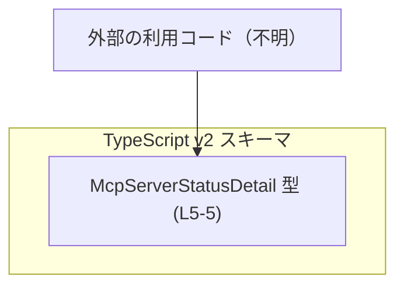
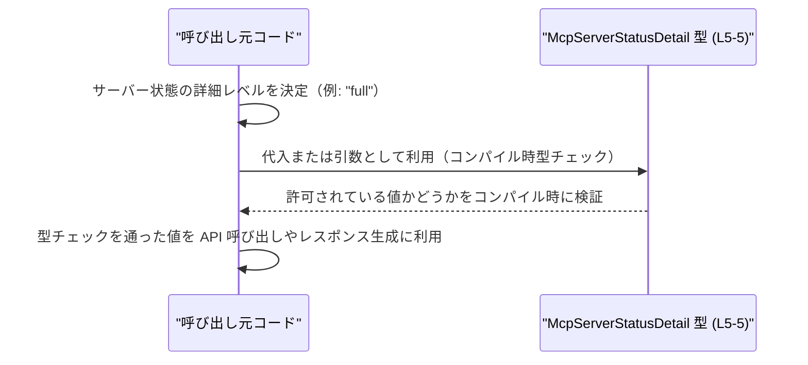

# app-server-protocol/schema/typescript/v2/McpServerStatusDetail.ts

## 0. ざっくり一言

このファイルは、`"full"` または `"toolsAndAuthOnly"` の 2 種類の文字列だけを許可する `McpServerStatusDetail` 型を定義した、ts-rs により自動生成された TypeScript 型定義ファイルです（生成コードのため手動編集禁止）。

---

## 1. このモジュールの役割

### 1.1 概要

- 先頭コメントにより、このファイルが自動生成コードであることが明示されています（`// GENERATED CODE! DO NOT MODIFY BY HAND!`、`McpServerStatusDetail.ts:L1-1`）。
- ts-rs によって生成されたこともコメントから分かります（`McpServerStatusDetail.ts:L3-3`）。
- `export type McpServerStatusDetail = "full" | "toolsAndAuthOnly";` という 1 行の型定義だけを公開しており（`McpServerStatusDetail.ts:L5-5`）、MCP サーバーの「ステータス詳細レベル」を 2 値の列挙的な文字列で表現するための型として利用される設計になっています。

### 1.2 アーキテクチャ内での位置づけ

- パス `schema/typescript/v2` から、このファイルは「v2 スキーマの TypeScript 表現」の一部であると分かります。
- ts-rs は一般に Rust の型から TypeScript 型を生成するツールとして知られているため、`McpServerStatusDetail` は Rust 側の対応する型と 1:1 で対応している可能性がありますが、Rust 側の定義はこのチャンクからは確認できません。
- 本ファイル自体は、このユニオン型を提供するだけで、他のモジュールへの依存や関数呼び出しはありません。

依存関係のイメージ（利用側コードとの関係のみ、概念図）:



※ `U` はこのファイルには登場しない概念上のノードであり、具体的なファイル・関数名は不明です。

### 1.3 設計上のポイント

- 自動生成コード  
  - 先頭コメントで「手動で変更しないこと」が明記されています（`McpServerStatusDetail.ts:L1-1`, `L3-3`）。
- 列挙的な文字列リテラルユニオン型  
  - `"full"` と `"toolsAndAuthOnly"` の 2 つの文字列リテラルだけを許可するユニオン型として設計されています（`McpServerStatusDetail.ts:L5-5`）。
- 型安全性  
  - TypeScript 側ではコンパイル時にこの 2 値以外を排除することで、API 呼び出しやデータ処理の誤りを防ぐ意図が読み取れます。
- 実行時の挙動  
  - 実行時には単なる文字列として扱われるため、型チェックはコンパイル時のみです。ランタイムでのバリデーションはこのファイルでは提供していません。
- 状態・並行性  
  - 変数や関数は定義されておらず、状態や非同期処理・並行性に関わるロジックは存在しません（このチャンクには現れません）。

---

## 2. 主要な機能一覧

このファイルが提供する主な「機能」は 1 つの型定義のみです。

- `McpServerStatusDetail` 型: サーバー・プロトコルにおける「ステータス詳細種別」を `"full"` または `"toolsAndAuthOnly"` の 2 値で表現する文字列リテラルユニオン型です（`McpServerStatusDetail.ts:L5-5`）。

---

## 3. 公開 API と詳細解説

### 3.1 型一覧（構造体・列挙体など）

本ファイルに登場する公開型のインベントリーです。

| 名前                    | 種別                                | 役割 / 用途                                                                                     | 定義位置                                   |
|-------------------------|-------------------------------------|--------------------------------------------------------------------------------------------------|--------------------------------------------|
| `McpServerStatusDetail` | 型エイリアス（文字列リテラルユニオン） | `"full"` または `"toolsAndAuthOnly"` のいずれかの文字列のみを許可する「ステータス詳細種別」の列挙的な型。 | `McpServerStatusDetail.ts:L5-5` |

#### `McpServerStatusDetail`

**概要**

- TypeScript の文字列リテラルユニオン型であり、`"full"` と `"toolsAndAuthOnly"` の 2 つの文字列だけをとることができます（`McpServerStatusDetail.ts:L5-5`）。
- 命名と値から、MCP サーバーの状態情報の「詳細レベル」や「レスポンス内容の範囲」を指定・表現するための型であると推測できますが、具体的な意味や利用箇所はこのファイルからは分かりません。

**内部構造**

- 定義は次の 1 行のみです（`McpServerStatusDetail.ts:L5-5`）。

```typescript
export type McpServerStatusDetail = "full" | "toolsAndAuthOnly";
```

- 型レベルでは以下の性質を持ちます:
  - `McpServerStatusDetail` 型の値は必ず `"full"` か `"toolsAndAuthOnly"` のどちらかでなければならない。
  - それ以外の文字列（例: `"partial"`）を代入しようとすると、TypeScript のコンパイルエラーになります。
  - 実行時には単なる `string` として存在し、ランタイムでのチェックは別途実装しない限り行われません。

**Examples（使用例）**

この型を関数の引数に使うシンプルな例です。ここで示す利用コードはこのファイルには含まれていない仮想コードです。

```typescript
// McpServerStatusDetail 型をインポートする
import type { McpServerStatusDetail } from "./McpServerStatusDetail";

// サーバーステータスの詳細レベルを処理する関数の例
function handleStatusDetail(detail: McpServerStatusDetail) {
    if (detail === "full") {
        // "full" の場合の処理
    } else if (detail === "toolsAndAuthOnly") {
        // "toolsAndAuthOnly" の場合の処理
    }
}

// 正しい使用例: 許可されている 2 つの値のみ渡せる
handleStatusDetail("full");               // OK
handleStatusDetail("toolsAndAuthOnly");   // OK

// 誤りの例（コンパイルエラーになります）
// handleStatusDetail("partial");        // エラー: 型 '"partial"' を 'McpServerStatusDetail' に割り当てられません
```

**Errors / 型安全性**

- TypeScript コンパイラ上でのエラー:
  - `"full"` と `"toolsAndAuthOnly"` 以外の文字列リテラルを `McpServerStatusDetail` 型に代入しようとすると、コンパイルエラーになります。
  - 例: `const x: McpServerStatusDetail = "unknown";` はエラーになります。
- ランタイムエラー:
  - この型定義自体は実行時のチェックを行わないため、`as any` などで型チェックを回避すると、実行時に異常な文字列が流入する可能性があります。

**Edge cases（エッジケース）**

- `null` / `undefined`:
  - `McpServerStatusDetail` には `null` や `undefined` は含まれないため、そのまま代入するとコンパイルエラーになります。
- 空文字列 `""`:
  - ユニオンに含まれていないため、`""` を代入するとコンパイルエラーになります。
- 動的な文字列:
  - 変数 `let s: string` のように一般の `string` 型を持つ値は、そのまま `McpServerStatusDetail` に代入できません。
  - その場合は、ランタイムチェック（if 文やカスタム型ガード）で `"full"` または `"toolsAndAuthOnly"` のどちらかを判定する必要があります。

**使用上の注意点**

- 生成コードであるため、このファイルを直接編集しないこと（`McpServerStatusDetail.ts:L1-1`, `L3-3`）。
- TypeScript の型チェックを有効にして（`strict` など）、`any` に逃げずに利用することで安全性を最大限に活かせます。
- 実行時には文字列でしかないため、信頼できない入力（外部からの JSON 等）に対しては、別途ランタイムバリデーションを実装する必要があります（このファイルには含まれません）。
- この型を使う側のコードは、将来 `"full"` / `"toolsAndAuthOnly"` 以外の値が追加される可能性を考慮して `switch` 文などで `default` ケースを用意するかどうかを設計する必要があります。

### 3.2 関数詳細（最大 7 件）

- このファイルには関数・メソッドは一切定義されていません（このチャンクには現れません）。

### 3.3 その他の関数

- 補助的な関数やラッパー関数も存在しません（このチャンクには現れません）。

---

## 4. データフロー

このファイル単体には処理ロジックが存在しないため、実際の「データフロー」は記述されていません。ただし、`McpServerStatusDetail` 型がどのように値の流れを制約するかについて、典型的な利用例に基づく概念的なフローを示します。

※ 以下は概念図であり、このリポジトリ内の具体的な呼び出しコードはこのチャンクからは確認できません。



このように、`McpServerStatusDetail` は「値そのものを変換する」のではなく、「値として許される文字列を制約する」ことで、型レベルでデータフローの安全性を高める役割を持ちます。

---

## 5. 使い方（How to Use）

### 5.1 基本的な使用方法

この型を利用する典型的なコードフローの例です。

```typescript
// McpServerStatusDetail 型をインポートする
import type { McpServerStatusDetail } from "./McpServerStatusDetail";

// サーバーステータスを表すオブジェクトの例
interface ServerStatus {
    detail: McpServerStatusDetail; // ステータス詳細レベル
    // 他のフィールド...
}

// ステータスを生成する関数の例
function createServerStatus(detail: McpServerStatusDetail): ServerStatus {
    return {
        detail, // ここで detail は "full" か "toolsAndAuthOnly" のいずれか
        // 他のフィールドの初期化...
    };
}

// 利用例
const status1 = createServerStatus("full");               // OK
const status2 = createServerStatus("toolsAndAuthOnly");   // OK

// const status3 = createServerStatus("partial");         // コンパイルエラー
```

この例では、`ServerStatus` の `detail` フィールドと `createServerStatus` の引数に `McpServerStatusDetail` 型を使うことで、不正な文字列が入り込むことをコンパイル時に防いでいます。

### 5.2 よくある使用パターン

1. **API パラメータやレスポンスのフィールドとして利用**

```typescript
import type { McpServerStatusDetail } from "./McpServerStatusDetail";

interface StatusRequest {
    detail: McpServerStatusDetail;
}

// 例: サーバーにステータス詳細を問い合わせる関数
async function fetchStatus(req: StatusRequest) {
    // 実際の HTTP 通信は省略
    // req.detail は "full" または "toolsAndAuthOnly" であることがコンパイル時に保証される
}
```

1. **オプション設定として利用**

```typescript
import type { McpServerStatusDetail } from "./McpServerStatusDetail";

interface ClientOptions {
    statusDetail?: McpServerStatusDetail; // 指定がなければデフォルトの詳細レベルを使う
}

function createClient(options: ClientOptions = {}) {
    const detail: McpServerStatusDetail = options.statusDetail ?? "full";
    // detail は "full" または "toolsAndAuthOnly" のいずれか
}
```

### 5.3 よくある間違い

1. **汎用の `string` 型を使ってしまう**

```typescript
// よくない例: string だと何でも入ってしまう
interface BadStatus {
    detail: string; // "full" 以外も代入可能になってしまう
}
```

**正しい例:**

```typescript
import type { McpServerStatusDetail } from "./McpServerStatusDetail";

interface GoodStatus {
    detail: McpServerStatusDetail; // 許可された 2 つの値だけを許容
}
```

1. **`as any` や不適切な型アサーションで型安全性を壊す**

```typescript
import type { McpServerStatusDetail } from "./McpServerStatusDetail";

const valueFromOutside: string = "unknown";

// よくない例: 強制キャストで型チェックを回避してしまう
const badDetail = valueFromOutside as McpServerStatusDetail; // コンパイルは通るが、実行時には不正な値になりうる
```

**推奨されるパターン: ランタイムチェック + 型ガード**

```typescript
function isMcpServerStatusDetail(value: string): value is McpServerStatusDetail {
    return value === "full" || value === "toolsAndAuthOnly";
}

const valueFromOutside: string = "unknown";

if (isMcpServerStatusDetail(valueFromOutside)) {
    const safeDetail: McpServerStatusDetail = valueFromOutside;
    // safeDetail はここでは正しい 2 値のいずれか
} else {
    // 不正な値への対処
}
```

### 5.4 使用上の注意点（まとめ）

- 自動生成ファイルであるため、**直接編集しないこと**（`McpServerStatusDetail.ts:L1-1`, `L3-3`）。
- TypeScript の型チェックが効く範囲で利用することが前提であり、`any` や不適切な型アサーションで型チェックを回避しないこと。
- 実行時には単なる文字列であるため、外部入力に対しては別途ランタイムチェックを行う必要があります。
- `"full"` / `"toolsAndAuthOnly"` の文字列は API プロトコル上の契約の一部となる可能性が高く、値を変更すると互換性問題が起こりうることに注意が必要です（ただし、このファイル単体からは具体的な API は分かりません）。

---

## 6. 変更の仕方（How to Modify）

### 6.1 新しい機能を追加する場合

このファイルは自動生成コードであり、先頭コメントで「手動で変更しないこと」が明示されています（`McpServerStatusDetail.ts:L1-1`, `L3-3`）。そのため、**このファイルを直接編集して新しい文字列を追加することは想定されていません**。

新しいステータス詳細値（例: `"minimal"`）を追加する必要がある場合は、一般的には次のような手順になります（具体的な生成元ファイルの場所はこのチャンクからは不明です）:

1. ts-rs が生成元としている Rust 側（またはその他の定義元）の型を修正する。
2. ts-rs によるコード生成プロセスを再実行し、このファイルを再生成する。
3. 生成された TypeScript 側で `McpServerStatusDetail` ユニオンに新しい値が含まれていることを確認する。

このとき、利用しているすべての TypeScript コードが新しい値に対応しているか（`switch` 文や条件分岐など）を確認する必要があります。

### 6.2 既存の機能を変更する場合

- 既存の文字列 `"full"` や `"toolsAndAuthOnly"` のスペル変更・削除は、これらに依存しているすべてのコードを壊す可能性があります。
  - 例: `if (detail === "full")` としているコードは、新しい値に合わせて変更が必要です。
- 変更を行う場合も、6.1 と同様に「生成元の型定義」を変更して再生成するのが前提であり、このファイルを手で編集すると、次回の生成時に上書きされる可能性があります。
- この型に依存する API・プロトコル仕様が存在する場合（このチャンクからは詳細不明）、その仕様書との整合性も確認する必要があります。

---

## 7. 関連ファイル

このチャンクには他ファイルへの具体的な参照はありませんが、パス構造とコメントから推測できる範囲の関連を整理します。

| パス                                                | 役割 / 関係 |
|-----------------------------------------------------|------------|
| `app-server-protocol/schema/typescript/v2/*`       | v2 バージョンの他の TypeScript スキーマ定義ファイルが存在すると考えられますが、具体的なファイル名や内容はこのチャンクには現れません。 |
| （生成元ファイル: 不明）                            | コメントから ts-rs による生成であることは分かりますが、対応する Rust 側の型定義ファイルなど、具体的な生成元のパスはこのチャンクからは分かりません。 |

---

### まとめ（安全性・エラー・並行性の観点）

- **安全性（型）**:  
  - `McpServerStatusDetail` により、TypeScript コード上でステータス詳細値を `"full"` / `"toolsAndAuthOnly"` に限定できます（静的型安全性）。
- **エラー**:  
  - 間違った文字列を代入しようとするとコンパイルエラーになります。
  - `any` や不適切なキャストを使うと、この保証を失い、ランタイムで不正値が流入する可能性があります。
- **並行性**:  
  - 本ファイルには関数や状態管理、非同期処理は含まれていないため、並行性やスレッドセーフティに関する情報は存在しません（このチャンクには現れません）。
