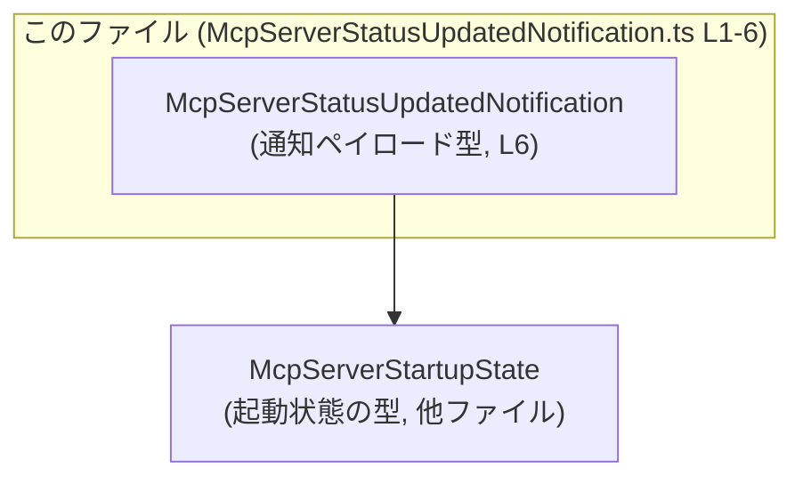
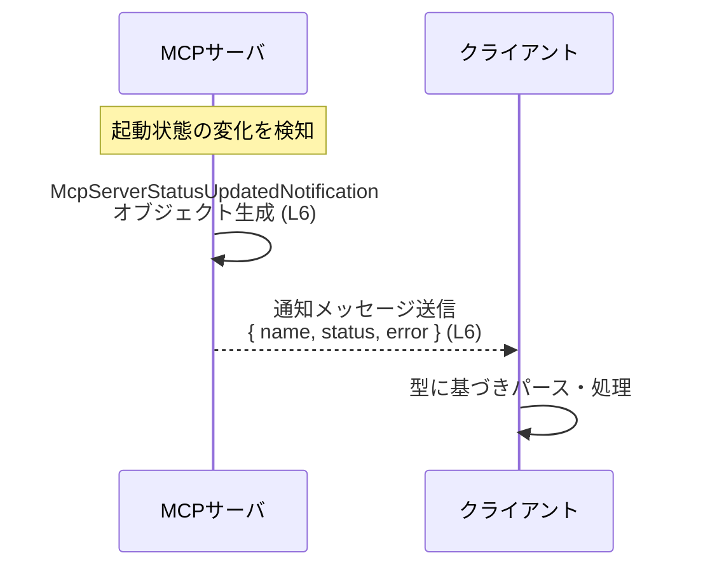

# app-server-protocol/schema/typescript/v2/McpServerStatusUpdatedNotification.ts

## 0. ざっくり一言

MCP サーバの起動状態が変化したときに送られる「ステータス更新通知」の **ペイロード型（オブジェクト形状）** を定義する TypeScript の型エイリアスです（`export type`）。  

---

## 1. このモジュールの役割

### 1.1 概要

- このモジュールは、MCP サーバの状態変化を通知するための **JSON などでシリアライズされるデータ構造** を型として表現しています。
- 具体的には、サーバ名 `name`、起動状態 `status`、エラーメッセージ `error` を持つオブジェクトの形を `McpServerStatusUpdatedNotification` として定義しています（`McpServerStatusUpdatedNotification.ts:L6-6`）。
- ファイル全体が `ts-rs` による自動生成コードであり、手動編集しない前提になっています（コメント `McpServerStatusUpdatedNotification.ts:L1-3`）。

### 1.2 アーキテクチャ内での位置づけ

このファイルに現れている依存関係は以下のとおりです。

- 依存先:
  - `McpServerStartupState` 型（`./McpServerStartupState` からの型インポート、`McpServerStatusUpdatedNotification.ts:L4-4`）

この関係を簡略化した依存関係図は次のようになります。



- このチャンクには、`McpServerStatusUpdatedNotification` を **どのモジュールが利用しているか（呼び出し元）** は現れません。  
  そのため、上流の発行元（サーバ側）や下流の受信側（クライアント側）との具体的な関係は不明です。

### 1.3 設計上のポイント

コードから直接読み取れる設計上の特徴は次のとおりです。

- **データ専用モジュール**  
  - 関数やクラスはなく、通知ペイロードの **型定義のみ** を持ちます（`McpServerStatusUpdatedNotification.ts:L6-6`）。
- **生成コードであることが明示**  
  - `ts-rs` により生成されており、手で編集しないことがコメントで指定されています（`McpServerStatusUpdatedNotification.ts:L1-3`）。  
  - 変更は元になっている Rust 側の定義や `ts-rs` の設定で行う前提と考えられます。
- **明示的なエラー表現**  
  - `error: string | null` という Union 型により、「エラーメッセージがある／ない」を型レベルで表現しています（`McpServerStatusUpdatedNotification.ts:L6-6`）。
- **状態の型安全性**  
  - 起動状態は `McpServerStartupState` 型で表現され、自由な文字列ではなく **限定された状態値** を用いる設計になっています（`McpServerStatusUpdatedNotification.ts:L4-4, L6-6`）。

---

## 2. 主要な機能一覧

このファイルは「機能」というより **データ構造** の定義だけを提供しますが、利用者視点では次のように捉えられます。

- `McpServerStatusUpdatedNotification`:  
  - MCP サーバの **名前・起動状態・エラー情報** をひとまとめにした通知メッセージの型定義（`McpServerStatusUpdatedNotification.ts:L6-6`）。

---

## 3. 公開 API と詳細解説

### 3.1 型一覧（構造体・列挙体など）

このチャンクに現れる公開型のインベントリーです。

| 名前 | 種別 | 役割 / 用途 | 定義位置（根拠行） |
|------|------|-------------|---------------------|
| `McpServerStatusUpdatedNotification` | 型エイリアス（オブジェクト型） | サーバ名・起動状態・エラー内容を含む「ステータス更新通知」ペイロードの形を表す | `McpServerStatusUpdatedNotification.ts:L6-6` |
| `McpServerStartupState` | 型（他ファイル） | サーバの起動状態を表す型。具体的な中身はこのチャンクには現れません。 | インポートのみ: `McpServerStatusUpdatedNotification.ts:L4-4` |

#### `McpServerStatusUpdatedNotification`

**概要**

- 次の 3 つのプロパティを持つオブジェクトの型です（`McpServerStatusUpdatedNotification.ts:L6-6`）。
  - `name: string`
  - `status: McpServerStartupState`
  - `error: string | null`

**プロパティ**

| プロパティ名 | 型 | 説明 | 根拠行 |
|--------------|----|------|--------|
| `name` | `string` | 通知対象となる MCP サーバを識別する文字列。具体的なフォーマット（ID/ホスト名など）はこのチャンクでは不明です。 | `McpServerStatusUpdatedNotification.ts:L6-6` |
| `status` | `McpServerStartupState` | サーバの起動状態を表す列挙（または Union）型。定義の詳細は別ファイルです。 | `McpServerStatusUpdatedNotification.ts:L4-4, L6-6` |
| `error` | `string \| null` | 関連するエラー情報。エラーがない場合は `null`、ある場合は文字列で表現されます。 | `McpServerStatusUpdatedNotification.ts:L6-6` |

**戻り値**

- 型エイリアスであり、関数ではないため「戻り値」はありません。
- 利用側では、「この形のオブジェクトを引数や戻り値として扱う」ことで型安全に通知データを扱えます。

**内部処理の流れ（アルゴリズム）**

- このファイルには関数やクラスのロジックは存在せず、アルゴリズムは定義されていません（`McpServerStatusUpdatedNotification.ts:L1-6`）。

**Examples（使用例）**

以下は、この型を受け取ってログ出力を行う関数の例です。  
（この関数自体はこのファイルには含まれていませんが、型の典型的な使い方を示します。）

```typescript
// 別ファイル側のコード例：通知を受け取りログを出力する関数
import type {                         // 型としてインポートする（実行時には出力されない）
  McpServerStatusUpdatedNotification  // このファイルで定義されている型
} from "./McpServerStatusUpdatedNotification";

// 通知を処理する関数の例
function handleStatusUpdated(         // 通知オブジェクトを 1 つ受け取る
  notification: McpServerStatusUpdatedNotification
): void {
  // サーバ名と状態をログに出力する
  console.log(
    `[${notification.name}] status = ${notification.status}`
  );

  // error が null でなければエラー内容も出力する
  if (notification.error !== null) {  // string | null なので null チェックが必要
    console.error(
      `Error for ${notification.name}: ${notification.error}`
    );
  }
}
```

**Errors / Panics**

- この型自体は **コンパイル時の型定義** であり、実行時に例外を投げるようなロジックは含みません。
- 実行時のエラーは、この型を利用するコード（例: JSON パース時、WebSocket ハンドラ内など）に依存します。

**Edge cases（エッジケース）**

型定義だけから分かる構造上のエッジケースは次のとおりです。

- `name` が空文字列 `""` であっても型レベルでは許容されます。  
  フォーマットの制約はこのチャンクには現れません。
- `error` は `null` または任意の文字列を取れるため:
  - 成功状態でも `error` が非 `null` であることを **禁止する制約は型上存在しません**。
  - 逆に、失敗状態でも `error` が `null` であることを禁止する型制約もありません。
- `status` の具体的な値の種類（例: `Starting`, `Running`, `Failed` など）はこのチャンクには現れません。

**使用上の注意点**

- `error` を使うときは **必ず null チェックを行う** 必要があります（`string | null` のため）。
- ビジネスロジック上の整合性（例: `status` が「失敗」のときは `error` 非 `null` であるべき等）は、  
  型だけでは保証されていないため、上位レイヤで検証が必要です。
- このファイルは `ts-rs` による生成コードであるため、型の変更が必要な場合は **元になっている Rust 側の定義を変更する** のが前提です（`McpServerStatusUpdatedNotification.ts:L1-3`）。

### 3.2 関数詳細（最大 7 件）

- このファイルには **関数・メソッド・クラス定義は存在しません**（`McpServerStatusUpdatedNotification.ts:L1-6`）。
- したがって、関数詳細として説明すべき公開 API はありません。

### 3.3 その他の関数

- 補助関数やラッパー関数も一切定義されていません（`McpServerStatusUpdatedNotification.ts:L1-6`）。

---

## 4. データフロー

このファイル単体には処理フローは記述されていませんが、  
型名・ディレクトリ構造（`app-server-protocol/schema/typescript/v2`）から推測される、代表的な利用シナリオを **例として** 示します。  
※以下は概念図であり、このチャンクのコードから直接は読み取れません。

### 4.1 代表的なシナリオ（概念）

1. MCP サーバが起動処理を行う。
2. 起動状態が変化するたびに、サーバ側で `McpServerStatusUpdatedNotification` 形のオブジェクトが生成される。
3. そのオブジェクトが JSON などにシリアライズされ、クライアントへ通知される。

これをシーケンス図で表現します。



- 「(L6)」は、このオブジェクトの形が `McpServerStatusUpdatedNotification.ts:L6-6` で定義されていることを示します。
- 実際の送受信方法（HTTP, WebSocket, RPC など）は、このチャンクには現れないため不明です。

---

## 5. 使い方（How to Use）

### 5.1 基本的な使用方法

もっとも基本的な使い方は、「この型のオブジェクトを引数・戻り値・変数の型として指定する」ことです。

```typescript
// 型のインポート
import type {
  McpServerStatusUpdatedNotification   // 通知ペイロードの型
} from "./McpServerStatusUpdatedNotification";

// 通知オブジェクトを生成する例
const notification: McpServerStatusUpdatedNotification = {
  name: "example-server",              // サーバを識別する文字列
  status: "Running" as any,            // 本来は McpServerStartupState の値を使う（ここでは簡略化）
  error: null                          // エラーがなければ null
};

// 生成した通知を処理する関数の呼び出し例
handleStatusUpdated(notification);      // 例: ログ出力や UI 更新に使う
```

> 補足: `status` の具体的な値は `McpServerStartupState` の定義に依存します。このチャンクには現れないため、ここでは `as any` で簡略化しています。

### 5.2 よくある使用パターン

1. **イベントリスナーの引数として受け取る**

```typescript
// イベントバスなどから通知を受け取るリスナー例
function onStatusUpdated(
  payload: McpServerStatusUpdatedNotification   // 型付きで受け取る
): void {
  // 型のおかげで name / status / error へのアクセスが補完・型チェックされる
  console.log(`Server ${payload.name} is now ${payload.status}`);

  if (payload.error !== null) {
    console.error(`Error: ${payload.error}`);
  }
}
```

1. **通知の配列を扱う**

```typescript
// 複数サーバの状態をまとめて扱う例
const notifications: McpServerStatusUpdatedNotification[] = []; // 配列型にする

// ループで処理
for (const n of notifications) {
  // 各通知の状態に応じて UI を更新するなどの処理を行う
  updateServerStatusUI(n.name, n.status, n.error);
}
```

### 5.3 よくある間違い

**例 1: `error` の null チェック漏れ**

```typescript
// 間違い例: error をそのまま使っている
function logErrorWrong(n: McpServerStatusUpdatedNotification) {
  // n.error の型は string | null なので、toUpperCase を直接呼び出すとエラー
  // console.error(n.error.toUpperCase()); // コンパイルエラー
}

// 正しい例: null チェックを行う
function logErrorCorrect(n: McpServerStatusUpdatedNotification) {
  if (n.error !== null) {                          // null でないことを確認
    console.error(n.error.toUpperCase());          // ここでは string 型として扱える
  }
}
```

**例 2: プロパティ名のスペルミス**

```typescript
// 間違い例: name を names と書いてしまう
function wrongProperty(n: McpServerStatusUpdatedNotification) {
  // console.log(n.names); // プロパティ 'names' は存在せずコンパイルエラー
}

// 正しい例: 定義どおりのプロパティ名を使う
function correctProperty(n: McpServerStatusUpdatedNotification) {
  console.log(n.name); // OK
}
```

### 5.4 使用上の注意点（まとめ）

- `error` は `string | null` のため、利用時には **null チェックを行うこと** が前提です。
- `status` の許容される値は `McpServerStartupState` 側で定義されており、このファイルだけでは分かりません。
- 生成コードのため、直接編集ではなく **元定義（Rust + ts-rs）側で変更する** 前提です（`McpServerStatusUpdatedNotification.ts:L1-3`）。
- この型は純粋なデータ構造であり、スレッド安全性や並行アクセスに関する制約は TypeScript レベルでは特にありません。  
  並行処理における整合性は、この型を使うアプリケーションロジック側で制御されます。

---

## 6. 変更の仕方（How to Modify）

### 6.1 新しい機能を追加する場合

このファイルは `ts-rs` による自動生成コードであるため（`McpServerStatusUpdatedNotification.ts:L1-3`）、  
**直接編集するのではなく、元の Rust 側定義を変更する** 必要があります。

一般的な手順（このチャンクから推測できる範囲）は次のとおりです。

1. Rust 側で `McpServerStatusUpdatedNotification` に対応する構造体（または型）定義を探す。  
   - このチャンクからはそのファイルパスは分かりません。
2. Rust の定義にフィールドを追加・削除・変更し、`ts-rs` の derive や属性に応じて TypeScript 生成を更新する。
3. TypeScript コードを再生成する（`ts-rs` のビルドステップを実行）。
4. 生成された `McpServerStatusUpdatedNotification.ts` を利用する全ての箇所で、  
   新しいフィールドや変更された型に合わせてコードを修正する。

### 6.2 既存の機能を変更する場合

この型の変更は、プロトコルの互換性に直接影響します。

- **影響範囲の確認**
  - `McpServerStatusUpdatedNotification` を参照している全ての TypeScript ファイルを確認する必要があります。  
    このチャンクには利用箇所が現れないため、実際の影響範囲は不明です。
- **変更時の注意点（契約）**
  - プロパティ名を変更すると、既存のクライアント・サーバ間の通信仕様が変わり、互換性が失われます。
  - 型（例: `error` を `string | null` から `string` に変える）を変更すると、  
    既存コードでの null ハンドリングの前提が崩れる可能性があります。
- **テスト**
  - プロトコルの変更に対しては、少なくとも「シリアライズ／デシリアライズのテスト」「後方互換性テスト」が必要ですが、  
    このチャンクにはテストコードは現れません。

---

## 7. 関連ファイル

このチャンクから直接分かる関連ファイルは次のとおりです。

| パス | 役割 / 関係 |
|------|------------|
| `app-server-protocol/schema/typescript/v2/McpServerStartupState.ts` (推定) | `McpServerStartupState` 型を定義していると考えられます。実際のファイル名はこのチャンクには現れませんが、`"./McpServerStartupState"` からの型インポートが行われています（`McpServerStatusUpdatedNotification.ts:L4-4`）。 |
| Rust 側の対応する構造体定義ファイル（不明） | コメントから、この TypeScript ファイルは `ts-rs` により Rust コードから生成されていることが分かります（`McpServerStatusUpdatedNotification.ts:L1-3`）。具体的なパスはこのチャンクには現れません。 |

---

### Bugs / Security / Contracts / Edge Cases / Performance（このファイルに関するまとめ）

- **Bugs**:  
  - 実行時ロジックがないため、このファイル単体に起因するランタイムバグはありません。
- **Security**:  
  - 型定義のみで直接的な脆弱性はありません。  
  - ただし `error: string` に機密情報を入れるかどうかは、利用側の設計に依存します。
- **Contracts（契約）**:  
  - `name`, `status`, `error` の 3 プロパティを必ず持つこと。  
  - `error` は `null` を含みうること。  
  - `status` は `McpServerStartupState` のいずれかの値であること。
- **Edge Cases**:  
  - 空文字の `name` や `error` は型レベルでは許容される。  
  - `status` と `error` の整合性は型で強制されない。
- **Performance / Scalability**:  
  - 単純なオブジェクト型であり、パフォーマンス上の特別な懸念はありません。  
  - 大量の通知を扱う場合も、この型定義自体がボトルネックになることはありません。
