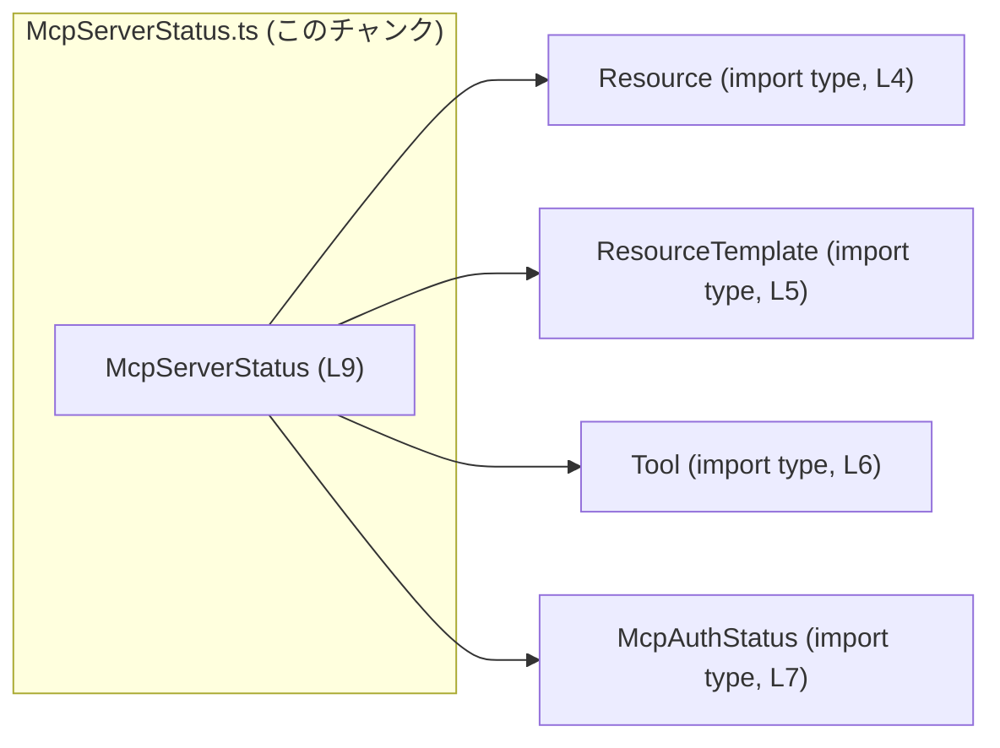
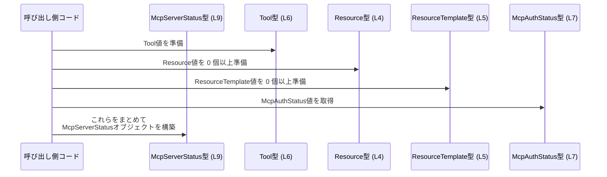

# app-server-protocol/schema/typescript/v2/McpServerStatus.ts

## 0. ざっくり一言

`McpServerStatus` は、サーバーの状態を表現するオブジェクト構造を定義した TypeScript の型エイリアスです。  
サーバー名・利用可能なツール・リソース・リソーステンプレート・認証状態を 1 つの値にまとめます（構造はコード上のフィールド名から読み取れます）。

---

## 1. このモジュールの役割

### 1.1 概要

- このモジュールは、TypeScript 側で利用する **`McpServerStatus` 型エイリアス**を定義します（`export type McpServerStatus = ...`）。  
  （根拠: `McpServerStatus.ts:L9`）
- `McpServerStatus` は以下のプロパティを持つオブジェクト型です（構造そのものの説明です）。
  - `name: string`
  - `tools: { [key in string]?: Tool }`
  - `resources: Array<Resource>`
  - `resourceTemplates: Array<ResourceTemplate>`
  - `authStatus: McpAuthStatus`  
  （根拠: `McpServerStatus.ts:L9`）

### 1.2 アーキテクチャ内での位置づけ

- この型は、他の型定義モジュールに依存しています。
  - `Resource`（`../Resource` からの型インポート）  
    （根拠: `McpServerStatus.ts:L4`）
  - `ResourceTemplate`（`../ResourceTemplate`）  
    （根拠: `McpServerStatus.ts:L5`）
  - `Tool`（`../Tool`）  
    （根拠: `McpServerStatus.ts:L6`）
  - `McpAuthStatus`（`./McpAuthStatus`）  
    （根拠: `McpServerStatus.ts:L7`）
- いずれも `import type` で読み込まれており、**型情報のみを参照し、実行時には依存しない**構造になっています。  
  （根拠: `import type { ... }` の記述, `McpServerStatus.ts:L4-7`）

この依存関係を図示すると、次のようになります。



> 図は、`McpServerStatus` が他の型定義に依存していることのみを表します。  
> それらの型の中身や、どこから使われるかはこのチャンクには現れません。

### 1.3 設計上のポイント

- **自動生成ファイルであることが明示**されています。
  - 「GENERATED CODE」「Do not edit this file manually」とコメントされています。  
    （根拠: `McpServerStatus.ts:L1-3`）
- **型定義専用モジュール**です。
  - `import type` のみで、値のインポートや関数定義・実装ロジックはありません。  
    （根拠: `McpServerStatus.ts:L4-7, L9`）
- **オブジェクトリテラル型＋配列＋インデックスシグネチャ**で構成されています。
  - `tools` は文字列キーから `Tool` へのマップ型（値はオプショナル）です。  
  - `resources` と `resourceTemplates` は配列型です。  
    （根拠: `McpServerStatus.ts:L9`）
- 実行時のエラー処理・並行性制御などは一切含まず、**コンパイル時の型チェックに専念する定義**です。

---

## 2. 主要な機能一覧

このモジュールは関数を持たず、「型定義」という意味での機能を提供します。

- `McpServerStatus` 型: サーバー状態オブジェクトの構造を定義する
- `name` プロパティ: サーバー名を文字列で保持する
- `tools` プロパティ: 文字列キーから `Tool` 型へのマップを表現する
- `resources` プロパティ: `Resource` 型の配列を保持する
- `resourceTemplates` プロパティ: `ResourceTemplate` 型の配列を保持する
- `authStatus` プロパティ: `McpAuthStatus` 型で認証状態を表現する

いずれも型レベルの表現であり、実際の値やビジネスロジックは他のコードに委ねられています。

---

## 3. 公開 API と詳細解説

### 3.1 型一覧（構造体・列挙体など）

このファイルで直接定義される型は `McpServerStatus` の 1 つです。  
その他はすべて外部からインポートされた型です。

| 名前             | 種別       | 役割 / 用途                                                                                                  | 定義/所在                                   | 根拠 |
|------------------|------------|--------------------------------------------------------------------------------------------------------------|---------------------------------------------|------|
| `McpServerStatus`| 型エイリアス| サーバー状態を表すオブジェクト構造。`name`, `tools`, `resources`, `resourceTemplates`, `authStatus` を持つ。 | 本ファイル内 `export type ...`              | `McpServerStatus.ts:L9` |
| `Resource`       | 型（詳細不明） | リソースを表す型。`resources: Array<Resource>` で利用される。内容はこのチャンクには現れない。             | `../Resource` からの `import type`          | `McpServerStatus.ts:L4` |
| `ResourceTemplate`| 型（詳細不明）| リソーステンプレートを表す型。`resourceTemplates: Array<ResourceTemplate>` で利用される。内容は不明。    | `../ResourceTemplate` からの `import type`  | `McpServerStatus.ts:L5` |
| `Tool`           | 型（詳細不明） | ツールを表す型。`tools: { [key in string]?: Tool }` の値として利用される。内容は不明。                    | `../Tool` からの `import type`              | `McpServerStatus.ts:L6` |
| `McpAuthStatus`  | 型（詳細不明） | 認証状態を表す型。`authStatus: McpAuthStatus` に使用される。内容はこのチャンクには現れない。             | `./McpAuthStatus` からの `import type`      | `McpServerStatus.ts:L7` |

> `Resource` / `ResourceTemplate` / `Tool` / `McpAuthStatus` の具体的なフィールド構造や挙動は、このチャンクには現れません。

#### `McpServerStatus` のフィールド構造

```ts
export type McpServerStatus = {
    name: string;
    tools: { [key in string]?: Tool };
    resources: Array<Resource>;
    resourceTemplates: Array<ResourceTemplate>;
    authStatus: McpAuthStatus;
};
```

（整形しただけで、内容は `McpServerStatus.ts:L9` と同じです）

各フィールドの意味（構造的な説明）は次のとおりです。

| フィールド名        | 型                                   | 説明（構造的な意味）                                                                     | 根拠 |
|---------------------|--------------------------------------|------------------------------------------------------------------------------------------|------|
| `name`              | `string`                            | サーバー名などの識別文字列を表すフィールド                                              | `McpServerStatus.ts:L9` |
| `tools`             | `{ [key in string]?: Tool }`        | 文字列キー（任意の string）から `Tool` 型へのマップ。各キーの値はオプショナル（`Tool \| undefined`） | `McpServerStatus.ts:L9` |
| `resources`         | `Array<Resource>`                   | `Resource` 型の配列。0 件以上のリソースを保持可能                                        | `McpServerStatus.ts:L9` |
| `resourceTemplates` | `Array<ResourceTemplate>`           | `ResourceTemplate` 型の配列。0 件以上のテンプレートを保持可能                           | `McpServerStatus.ts:L9` |
| `authStatus`        | `McpAuthStatus`                     | 認証状態を表す `McpAuthStatus` 型の値                                                    | `McpServerStatus.ts:L9` |

### 3.2 関数詳細（最大 7 件）

このファイルには関数・メソッドの定義はありません。  
そのため、関数詳細テンプレートに基づく解説対象は存在しません。

### 3.3 その他の関数

同様に、ヘルパー関数やラッパー関数も定義されていません。

---

## 4. データフロー

ここでは、「`McpServerStatus` 型の値を構築するときに、どのような型間のデータ関係が存在するか」を示します。  
実際のアプリケーションでの呼び出し元や利用箇所は、このチャンクには現れないため、不明です。

### 4.1 型間のデータ関係（シーケンス図）

一般的な TypeScript コードが `McpServerStatus` 型の値を作成する際の、**型レベルの関係**のみを例示します。



> この図は「どの型の値が `McpServerStatus` のどのプロパティに入るか」を表現する概念図です。  
> 具体的な関数名やモジュール名は、このチャンクからは分からないため、登場させていません。

---

## 5. 使い方（How to Use）

### 5.1 基本的な使用方法

同一モジュール内、あるいは適切に `McpServerStatus` をインポートしたモジュール内で、次のように値を作成できます。

```ts
// McpServerStatus 型の値を構築する例
const status: McpServerStatus = {
    name: "example-server",                // サーバー名などの識別子
    tools: {
        // "lint" というキーに Tool 型の値を紐付け
        // （Tool の具体構造はこのチャンクには現れない）
        lint: {} as Tool,                  // ここでは型サンプルとして型アサーションを使用
    },
    resources: [
        {} as Resource,                    // Resource の具体構造は不明だが、配列要素がこの型であることは分かる
    ],
    resourceTemplates: [
        {} as ResourceTemplate,            // 同様に ResourceTemplate 型の配列
    ],
    authStatus: {} as McpAuthStatus,       // 認証状態の値
};
```

> 上記は **型構造の使い方を示すためのサンプル**であり、`Tool` や `Resource` などの中身はこのチャンクには現れないため、`as 型名` でダミー値を置いています。

### 5.2 よくある使用パターン

#### 5.2.1 ツールのマップから値を取り出す

`tools` は `{ [key in string]?: Tool }` なので、マップから値を取り出すときは `Tool | undefined` になります。

```ts
// あるキーに対応する Tool を安全に参照する例
function getTool(status: McpServerStatus, key: string): Tool | undefined {
    const tool = status.tools[key];        // 型は Tool | undefined
    if (!tool) {
        // 該当する Tool が存在しないケース（undefined）のハンドリング
        return undefined;
    }
    // ここでは tool は Tool 型として扱える
    return tool;
}
```

このように、`tools[key]` の戻り値は **常に `undefined` の可能性を考慮**する必要があります。  
（構造上、値がオプショナルであるため: `McpServerStatus.ts:L9`）

#### 5.2.2 リソース配列の走査

`resources` や `resourceTemplates` は単純な配列なので、一般的な配列操作が可能です。

```ts
function listResources(status: McpServerStatus): Resource[] {
    // そのまま配列として扱える
    return status.resources;
}

function hasAnyResourceTemplate(status: McpServerStatus): boolean {
    return status.resourceTemplates.length > 0;
}
```

### 5.3 よくある間違い

構造から推測される、起こりやすい型レベルの誤用例を挙げます。

```ts
// 誤り例: tools マップから取り出した Tool を undefined チェックせずに使う
function useToolWrong(status: McpServerStatus, key: string) {
    const tool = status.tools[key];
    // tool は Tool | undefined 型なので、直接メソッド呼び出しをすると型エラー・実行時エラーの原因になりうる
    // tool.run(); // ← コンパイル時にエラー（Tool の定義によるが、少なくとも undefined の可能性がある）
}

// 正しい例: undefined をチェックする
function useToolCorrect(status: McpServerStatus, key: string) {
    const tool = status.tools[key];
    if (!tool) {
        // Tool が存在しないケースの処理
        return;
    }
    // ここから先は tool は Tool 型として扱える
    // tool.run(); // Tool 型に run があれば、ここで安全に呼び出せる
}
```

### 5.4 使用上の注意点（まとめ）

- **自動生成ファイルであるため、直接編集しないこと**
  - コメントで「GENERATED CODE」「Do not edit this file manually」と明示されています。  
    （根拠: `McpServerStatus.ts:L1-3`）
  - 型に変更を加えたい場合は、通常は ts-rs の元となる Rust 側定義を変更し、再生成する運用が想定されますが、  
    このリポジトリでの具体的な運用はこのチャンクからは分かりません。
- **`tools` の値はオプショナル**
  - 型は `{ [key in string]?: Tool }` なので、`status.tools[key]` の結果は `Tool | undefined` です。  
    `undefined` ハンドリングを忘れると実行時エラーにつながる可能性があります（型安全性の観点）。  
    （根拠: `McpServerStatus.ts:L9`）
- **配列は空配列の可能性を常に考慮する**
  - `resources` および `resourceTemplates` に「少なくとも 1 件ある」という制約は型レベルでは表現されていません。  
    `length === 0` のケースを考慮する必要があります。  
    （根拠: `Array<Resource>`, `Array<ResourceTemplate>` の使用, `McpServerStatus.ts:L9`）
- **並行性・スレッド安全性**
  - このファイルは純粋な型定義のみであり、状態を保持するクラスやミューテーブルなデータ構造を持ちません。  
    並行性やスレッド安全性は、この型を利用する実装側での扱いに依存します。このチャンクからはそれらは不明です。

---

## 6. 変更の仕方（How to Modify）

### 6.1 新しい機能を追加する場合

このファイルは自動生成であり、「手動で編集しない」ことがコメントで明示されています。  
（根拠: `McpServerStatus.ts:L1-3`）

そのため、**直接 `McpServerStatus.ts` を編集して新しいフィールドを追加することは推奨されません**。

一般的な ts-rs の利用形態に基づく変更パターンは次のとおりです（このリポジトリでの運用が同一かどうかはこのチャンクからは不明です）。

1. ts-rs が参照する **Rust 側の元の型定義**（構造体や enum）にフィールドを追加する。
2. ts-rs のコード生成プロセスを再実行し、この TypeScript ファイルを再生成する。
3. 生成された `McpServerStatus` に新フィールドが反映される。

このチャンクだけでは、元の Rust ファイルのパスや構造は分かりません。

### 6.2 既存の機能を変更する場合

同様の理由から、直接このファイル内のフィールド型を変更すると、次のような問題が発生しうる点に注意が必要です。

- **生成プロセスで上書きされる**
  - 再生成時に手動変更部分が失われます。
- **Rust 側との不整合**
  - Rust の元定義と TypeScript 側の型が食い違うと、型定義としての信頼性が低下します。

変更が必要な場合は、次の観点で影響範囲を確認する必要があります。

- `McpServerStatus` を参照している TypeScript コード（このチャンクには出てこないため、検索が必要）
- `Resource` / `ResourceTemplate` / `Tool` / `McpAuthStatus` の定義（これも別ファイル）

---

## 7. 関連ファイル

このモジュールと密接に関係するファイル・モジュールは、`import type` の参照先として次のものがあります。

| パス（import 指定）      | 役割 / 関係                                                                                       | 根拠 |
|--------------------------|----------------------------------------------------------------------------------------------------|------|
| `../Resource`            | `Resource` 型を提供するモジュール。`resources: Array<Resource>` の要素型として利用される。        | `McpServerStatus.ts:L4` |
| `../ResourceTemplate`    | `ResourceTemplate` 型を提供するモジュール。`resourceTemplates: Array<ResourceTemplate>` に利用。  | `McpServerStatus.ts:L5` |
| `../Tool`                | `Tool` 型を提供するモジュール。`tools` マップの値として利用される。                              | `McpServerStatus.ts:L6` |
| `./McpAuthStatus`        | `McpAuthStatus` 型を提供するモジュール。`authStatus: McpAuthStatus` に利用される。               | `McpServerStatus.ts:L7` |

> これらのモジュールの具体的な内容（フィールド構造やロジック）は、このチャンクには現れません。  
> 拡張子（`.ts` / `.js` 等）や配置ディレクトリ構造は、ビルド設定に依存し、このファイルだけからは断定できません。

---

### Bugs / Security / Contracts / Edge Cases のまとめ（本ファイルに限定）

- **Bugs**
  - このファイルは宣言のみで実装ロジックを持たないため、直接的なバグ（ロジックエラー）は存在しません。
  - 型としての設計が適切かどうか（例: `tools` の値がオプショナルであるべきか）は、このチャンクだけでは判断できません。
- **Security**
  - セキュリティロジックは含まれていませんが、`authStatus` というフィールド名から「認証状態を表す型である」ことだけは読み取れます。  
    実際にどのような状態値を持ちうるかは `McpAuthStatus` 側に依存し、このチャンクには現れません。
- **Contracts（契約）**
  - `McpServerStatus` のプロパティはすべて必須フィールドです（`?` が付いていない）。  
    つまり、この型の値を作る際には、5 つすべてのプロパティを必ず設定する必要があります。  
    （根拠: `McpServerStatus.ts:L9`）
  - ただし `tools` の**各キーの値だけがオプショナル**である点に注意が必要です。
- **Edge Cases（エッジケース）**
  - `tools` に指定したキーが存在しない場合、`status.tools[someKey]` は `undefined` となり得ます。
  - `resources` / `resourceTemplates` は空配列であり得ます。  
    「最低 1 件以上ある」という前提は型からは読み取れません。
  - `name` や `authStatus` にどのような値が許されるか（空文字列を許すか、どのような認証状態があるか）は、このチャンクからは分かりません。
