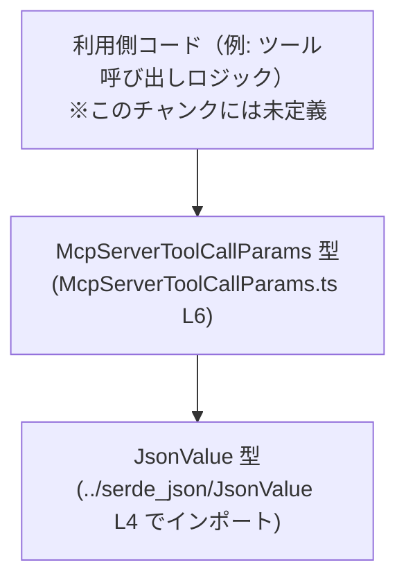
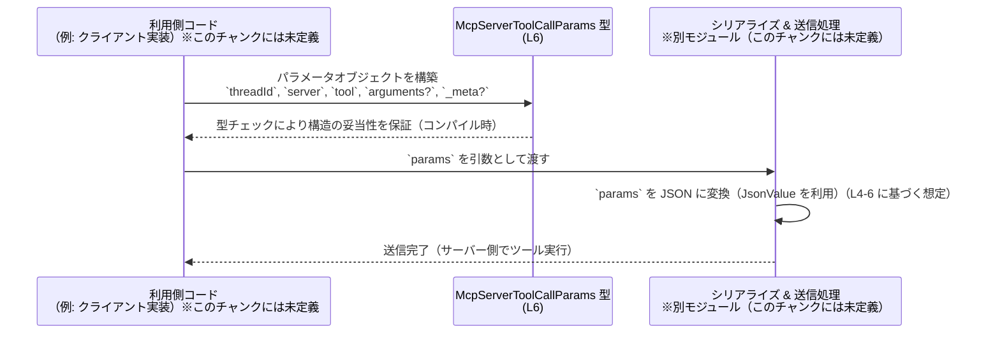

# app-server-protocol/schema/typescript/v2/McpServerToolCallParams.ts コード解説

## 0. ざっくり一言

- サーバー側の「ツール呼び出し」に渡されるパラメータの構造を表現する **TypeScript の型定義（データモデル）** です（`export type ...` 宣言より）（McpServerToolCallParams.ts:L6-6）。
- Rust から `ts-rs` で自動生成されており、このファイル自体は **手動編集しない前提** になっています（コメントより）（McpServerToolCallParams.ts:L1-3）。

---

## 1. このモジュールの役割

### 1.1 概要

- このモジュールは、アプリケーションサーバープロトコル v2 における **「サーバーツール呼び出し」のパラメータ型** `McpServerToolCallParams` を提供します（McpServerToolCallParams.ts:L6-6）。
- パラメータは、スレッドを識別する `threadId`、サーバー名 `server`、ツール名 `tool`、任意の JSON 形式の引数 `arguments`、メタ情報 `_meta` で構成されています（McpServerToolCallParams.ts:L6-6）。
- すべて **型レベルの定義のみ** であり、実行時ロジックや関数は含まれていません（McpServerToolCallParams.ts:L1-6）。

### 1.2 アーキテクチャ内での位置づけ

このモジュールは、次のような位置づけと依存関係を持ちます。

- `JsonValue` 型に依存します（`import type { JsonValue } from "../serde_json/JsonValue";`）（McpServerToolCallParams.ts:L4-4）。
- 他のモジュール（クライアントコードやサーバー実装）は、この `McpServerToolCallParams` 型をインポートしてメッセージパラメータを型安全に扱うと考えられます（型が `export` されていることから推測）（McpServerToolCallParams.ts:L6-6）。実際の利用箇所はこのチャンクには現れません。



### 1.3 設計上のポイント

- **自動生成コード**  
  - 冒頭コメントにより、このファイルは `ts-rs` による自動生成であり、手動編集禁止と明記されています（McpServerToolCallParams.ts:L1-3）。
- **純粋な型定義のみ**  
  - `export type` による型エイリアスのみが定義されており、クラスや関数、ロジックはありません（McpServerToolCallParams.ts:L6-6）。
- **JSON 汎用値の利用**  
  - `arguments` と `_meta` は `JsonValue` 型で定義されており、JSON として表現可能な任意の値を受けられる形になっています（名前と型名からの推測）（McpServerToolCallParams.ts:L4-6）。
- **必須／任意プロパティの区別**  
  - `threadId`, `server`, `tool` は必須（`:`）、`arguments`, `_meta` はオプション（`?:`）となっており、プロパティの存在有無が型で区別されています（McpServerToolCallParams.ts:L6-6）。
- **状態や並行性は持たない**  
  - 型定義のみのため、内部状態・エラーハンドリング・非同期／並行処理はこのモジュールには存在しません（McpServerToolCallParams.ts:L1-6）。

---

## 2. 主要な機能一覧（コンポーネントインベントリー）

このファイルに含まれるコンポーネントを一覧にします。

| コンポーネント名 | 種別 | 役割 / 用途 | 定義位置 |
|------------------|------|-------------|----------|
| `JsonValue`      | 型（import） | `arguments` と `_meta` に使用される JSON 値表現用の型。実体は別ファイルで定義（このチャンクには未定義）。 | McpServerToolCallParams.ts:L4-4 |
| `McpServerToolCallParams` | 型エイリアス（オブジェクト型） | サーバー側のツール呼び出しパラメータの構造を表現するメッセージスキーマ。 | McpServerToolCallParams.ts:L6-6 |

---

## 3. 公開 API と詳細解説

### 3.1 型一覧（構造体・列挙体など）

公開されている主要な型の詳細です。

| 名前 | 種別 | 役割 / 用途 | 主なフィールド | 定義位置 |
|------|------|-------------|----------------|----------|
| `McpServerToolCallParams` | 型エイリアス（オブジェクト型） | サーバーツール呼び出し時に送受信されるパラメータの型。 | `threadId`, `server`, `tool`, `arguments?`, `_meta?` | McpServerToolCallParams.ts:L6-6 |

※ `JsonValue` はこのファイルからは再エクスポートされておらず、`import type` でのみ参照されています（McpServerToolCallParams.ts:L4-4）。

### 3.2 重要な型の詳細：`McpServerToolCallParams`

#### `McpServerToolCallParams`

**概要**

- `McpServerToolCallParams` は、サーバー側の「ツール呼び出し」に関するパラメータをまとめた **オブジェクト型** です（McpServerToolCallParams.ts:L6-6）。
- 各プロパティは以下のような意味を持つと考えられます（名前からの推測であり、詳細仕様はこのチャンクには現れません）:
  - `threadId`: 対象となるスレッドやコンテキストを識別する ID。
  - `server`: ツールを実行するサーバーの識別子。
  - `tool`: 呼び出したいツール名。
  - `arguments`: ツールに渡す引数（任意の JSON）。
  - `_meta`: メタデータ（トレーシングや追加情報などに利用される可能性）。

**フィールド**

| フィールド名 | 型 | 必須/任意 | 説明 | 定義位置 |
|--------------|----|----------|------|----------|
| `threadId`   | `string` | 必須 | 対象スレッドを識別するための文字列 ID と考えられます（名前からの推測）。 | McpServerToolCallParams.ts:L6-6 |
| `server`     | `string` | 必須 | ツールを提供するサーバー名や識別子を表すと考えられます。 | McpServerToolCallParams.ts:L6-6 |
| `tool`       | `string` | 必須 | 実行したいツールの名前を表すと考えられます。 | McpServerToolCallParams.ts:L6-6 |
| `arguments`  | `JsonValue` | 任意 (`?:`) | ツールに渡す引数を JSON で表現したもの。省略可能です。 | McpServerToolCallParams.ts:L6-6 |
| `_meta`      | `JsonValue` | 任意 (`?:`) | メタ情報用の JSON。`_` プレフィックスから内部用の情報と推測されます。 | McpServerToolCallParams.ts:L6-6 |

**使用例（基本）**

ここでは、この型を利用してツール呼び出しパラメータオブジェクトを構築する例を示します。  
`JsonValue` の具体的な定義はこのチャンクには現れないため、例では最低限の形だけを使用しています。

```typescript
import type { McpServerToolCallParams } from "./McpServerToolCallParams";  // 本ファイルの型をインポートする例（パスは利用側の配置に合わせて調整）
import type { JsonValue } from "../serde_json/JsonValue";                  // JsonValue 型も同様にインポート

// ツール呼び出しパラメータを構築する利用側コードの例
const params: McpServerToolCallParams = {                                  // McpServerToolCallParams 型としてオブジェクトを宣言
    threadId: "thread-123",                                                // 必須: スレッドID（任意の文字列）
    server: "example-server",                                              // 必須: サーバー識別子
    tool: "search",                                                        // 必須: ツール名
    arguments: { query: "TypeScript" } as JsonValue,                       // 任意: ツールに渡す引数を JSON として記述（ここではシンプルなオブジェクト）
    // _meta は省略されているため undefined 相当になる
};
```

この例では、TypeScript の型チェックにより以下が保証されます。

- `threadId`, `server`, `tool` の欠落や、`number` など `string` 以外の型を割り当てるとコンパイルエラーになる。
- `arguments` と `_meta` は指定してもしなくてもよい（オプショナル）ことがコンパイル時に表現される。

**使用例（メタ情報付き）**

```typescript
const paramsWithMeta: McpServerToolCallParams = {                          // メタ情報も含めた例
    threadId: "thread-456",                                                // 必須フィールド
    server: "analytics-server",                                            // 必須フィールド
    tool: "analyze",                                                       // 必須フィールド
    arguments: { dataId: 42 } as JsonValue,                                // 引数（JSON）を指定
    _meta: { traceId: "abc-123" } as JsonValue,                            // メタ情報（例: トレースIDなど）を JSON で指定
};
```

ここで `callTool(paramsWithMeta)` のような関数呼び出しを行う利用側コードは、このリポジトリには含まれていない想定コードです。

**型レベルでのエラー条件**

- TypeScript のコンパイル時に発生しうるエラー:
  - 必須フィールド（`threadId`, `server`, `tool`）が不足している場合。
  - これらに `string` 以外の型（`number` など）を割り当てた場合。
  - `arguments` / `_meta` に `JsonValue` と互換性のない型を割り当てた場合（`JsonValue` の具体的な定義に依存しますが、このチャンクには現れません）。

**Edge cases（エッジケース）**

- **空文字列**  
  - `threadId`, `server`, `tool` は `string` 型であるため、空文字列 `""` も許容されます（McpServerToolCallParams.ts:L6-6）。
  - 空文字列を妥当とするかどうかはビジネスロジック側の責務であり、この型定義だけでは制約されません。
- **`arguments` / `_meta` の省略**  
  - 両者はオプショナル（`?:`）のため、省略された場合は `undefined` として扱われます（McpServerToolCallParams.ts:L6-6）。
  - 利用側コードでは、アクセス前に存在チェック（`if (params.arguments) { ... }`）を行うことが一般的です。
- **大きな JSON / ネストの深い JSON**  
  - `JsonValue` は構造に制約をかけない汎用型であると推測されるため、非常に大きい・深くネストした JSON も型上は許容されます。
  - 実際のメモリ消費やシリアライズコストは、この型定義では制御されません。
- **`null` の扱い**  
  - `JsonValue` が `null` を含むかどうかはこのチャンクには現れません。`arguments: null as JsonValue` のような記述が許容されるかは `JsonValue` の定義に依存します。

**使用上の注意点**

- **自動生成コードであること**  
  - 冒頭コメントの通り、このファイルは `ts-rs` により生成されるため、直接編集すると元の Rust 定義との不整合が生じます（McpServerToolCallParams.ts:L1-3）。  
    - 新しいフィールドを追加したい場合などは、元の Rust 側定義を変更した上で再生成する必要があります（Rust 側ファイルの場所はこのチャンクには現れません）。
- **ビジネスルールの検証は別途必要**  
  - 型は `string` かどうか等を保証しますが、「空でない」「特定の形式である」などのドメイン制約は表現していません（McpServerToolCallParams.ts:L6-6）。
  - これらの検証は、利用側ロジックまたはバリデーション層で実装する前提になります。
- **JSON 形式の安全性**  
  - `arguments` および `_meta` が `JsonValue` であるため、任意の JSON 相当のデータが入り得ます（McpServerToolCallParams.ts:L4-6）。
  - 実行時に外部入力をそのまま信頼すると、注入攻撃などのリスクになり得るため、実際の利用時には中身の検査・サニタイズが重要です（これは一般論であり、このチャンクには具体的な対策コードはありません）。
- **並行性・スレッド安全性**  
  - このファイルは純粋な型定義のみであり、状態を持たないため、並行性に起因する問題はこのレベルでは存在しません。

### 3.3 その他の関数

- このファイルには関数・メソッド・クラスは定義されていません（コメントと `export type` のみで構成されていることから確認できます）（McpServerToolCallParams.ts:L1-6）。

---

## 4. データフロー

このファイルには実際の処理コードは含まれていませんが、`schema/typescript/v2` 配下の型定義であることから、典型的な利用イメージとして、以下のようなデータフローが想定されます（あくまで想定であり、このチャンクには送受信コードは現れません）。

1. 利用側ロジックが `McpServerToolCallParams` 型のオブジェクトを構築する。
2. そのオブジェクトが JSON にシリアライズされる（シリアライザは別モジュール）。
3. シリアライズされたメッセージがサーバーに送信され、サーバーがツールを実行する。



この図は、`McpServerToolCallParams` が **データ構造の境界** を定義し、型チェックによって開発時に不正なメッセージ構造を防ぐ、という役割を持つことを示しています。

---

## 5. 使い方（How to Use）

### 5.1 基本的な使用方法

典型的な利用パターンは「関数の引数として `McpServerToolCallParams` を受け取り、ツール呼び出しロジックで使用する」という形です。  
以下のコードは **利用側の例** であり、このリポジトリには含まれていません。

```typescript
import type { McpServerToolCallParams } from "./McpServerToolCallParams";  // 型定義のインポート

// ツール呼び出しを行う仮想的な関数（このファイルには定義されていない利用側コード）
async function sendToolCall(params: McpServerToolCallParams): Promise<void> { // 型を引数として受け取る
    // ここで params を JSON にシリアライズして送信するなどの処理を行う想定
    console.log("thread:", params.threadId);                                  // 必須フィールドは必ず存在
    console.log("server:", params.server);                                    // 必須フィールド
    console.log("tool:", params.tool);                                        // 必須フィールド

    if (params.arguments) {                                                   // オプショナルフィールドは存在チェックが必要
        console.log("arguments present");                                     // 引数が指定されている場合の処理
    }

    if (params._meta) {                                                       // メタ情報も同様にチェック
        console.log("meta present");                                          // メタデータがある場合の処理
    }
}
```

### 5.2 よくある使用パターン

1. **引数なしツールの呼び出し**

```typescript
const paramsNoArgs: McpServerToolCallParams = {       // 引数なしのツール呼び出し
    threadId: "thread-1",                             // スレッドID
    server: "notification-server",                    // サーバー識別子
    tool: "ping",                                     // 引数不要なツール名
    // arguments, _meta は省略
};
```

1. **メタ情報のみを付与する呼び出し**

```typescript
const paramsMetaOnly: McpServerToolCallParams = {     // メタ情報のみ指定する例
    threadId: "thread-2",                             // スレッドID
    server: "logging-server",                         // サーバー識別子
    tool: "log",                                      // ツール名
    _meta: { level: "debug" } as JsonValue,          // メタ情報にログレベルなどを記載
};
```

### 5.3 想定される誤用と正しい例

**1. 必須フィールドの欠落**

```typescript
// 誤り例（コンパイルエラー）: 必須フィールド server が不足
const badParams1: McpServerToolCallParams = {
    threadId: "thread-1",
    // server: "example-server", // 足りない
    tool: "search",
};

// 正しい例: 必須フィールドをすべて指定
const goodParams1: McpServerToolCallParams = {
    threadId: "thread-1",
    server: "example-server",
    tool: "search",
};
```

**2. 型の不一致**

```typescript
// 誤り例（コンパイルエラー）: threadId に number を指定
const badParams2: McpServerToolCallParams = {
    threadId: 123,                     // number なのでエラー
    server: "example-server",
    tool: "search",
};

// 正しい例: string に変換して指定
const goodParams2: McpServerToolCallParams = {
    threadId: String(123),            // "123"
    server: "example-server",
    tool: "search",
};
```

### 5.4 使用上の注意点（まとめ）

- このファイルは自動生成されるため、**直接編集しないこと**（McpServerToolCallParams.ts:L1-3）。
- 必須フィールド（`threadId`, `server`, `tool`）は常に埋める必要があるが、文字列の内容（空文字やフォーマット）は型では制約されていないため、別途チェックが必要（McpServerToolCallParams.ts:L6-6）。
- `arguments` / `_meta` はオプショナルなので、利用側は `undefined` を考慮するコードを書く必要がある（McpServerToolCallParams.ts:L6-6）。
- `JsonValue` は任意の JSON 構造を受け付ける汎用型と推測されるため、中身の検証・サニタイズは利用側の責務となる（McpServerToolCallParams.ts:L4-6）。

---

## 6. 変更の仕方（How to Modify）

### 6.1 新しい機能（フィールド）を追加する場合

- ファイル先頭のコメントにある通り、この TypeScript ファイルは `ts-rs` により生成されており、手動での編集は想定されていません（McpServerToolCallParams.ts:L1-3）。
- 新しいパラメータを追加したい場合の基本的な流れは次のようになります。

1. **Rust 側の元定義を変更する**  
   - `ts-rs` は Rust の構造体／型から TypeScript 型を生成するツールです。  
   - 追加したいフィールドを Rust 側の対応する型（構造体）に追加します。  
   - 具体的な Rust ファイルの場所や構造は、このチャンクには現れません。

2. **`ts-rs` を使って再生成する**  
   - ビルドスクリプトや専用コマンドを実行して、TypeScript のスキーマを再生成します。  
   - その結果、新しいフィールドを含む `McpServerToolCallParams` が再出力されます。

3. **利用側コードを更新する**  
   - 追加されたフィールドを使用するように利用側コードを修正します。  
   - 型エラーを手掛かりに、必要な箇所を更新できます。

### 6.2 既存の機能（フィールド）を変更する場合

- フィールド名や型を変更する場合も、同様に **Rust 側 -> 再生成 -> 利用側コードの更新** という流れになります。
- 変更時に注意すべき点:

  - **互換性への影響**  
    - 例えば `threadId: string` を `threadId: number` に変更すると、既存の TypeScript コードはコンパイルエラーとなります（McpServerToolCallParams.ts:L6-6 を参照）。
  - **プロトコル互換性**  
    - この型は「プロトコル」の一部と考えられるため、変更は通信相手（クライアント／サーバー双方）への影響を伴います。  
    - 実運用ではバージョニングや後方互換性を考慮した変更が必要です（このチャンクにはバージョニング戦略は現れません）。
  - **テストの再確認**  
    - このファイルにはテストは含まれていませんが（McpServerToolCallParams.ts:L1-6）、変更に応じて別箇所のテストコードを更新・追加する必要があります。

---

## 7. 関連ファイル

このモジュールと直接関係があると分かるファイル／パスは次のとおりです。

| パス | 役割 / 関係 |
|------|------------|
| `../serde_json/JsonValue` | `JsonValue` 型の定義を提供するモジュール。`McpServerToolCallParams` の `arguments` および `_meta` フィールドで使用されています（McpServerToolCallParams.ts:L4-6）。拡張子や実ファイル名（`.ts` / `.d.ts` など）はこのチャンクからは不明です。 |
| （Rust 側の ts-rs 対象定義） | 冒頭コメントから、この TypeScript 型は Rust の型定義から `ts-rs` により生成されていることが分かります（McpServerToolCallParams.ts:L1-3）。具体的なファイルパスやモジュール名はこのチャンクには現れません。 |

---

### 付記：安全性・エラー・並行性の観点（このファイルに関するまとめ）

- **安全性**  
  - TypeScript の静的型チェックにより、メッセージ構造の形（フィールド名とその型）はコンパイル時に検証されます（McpServerToolCallParams.ts:L6-6）。  
  - JSON の内容（値の範囲や構造）はこの型定義では制約されないため、実行時バリデーションが必要です。
- **エラー**  
  - 本ファイル単体には実行時エラーや例外処理は存在せず、あくまでコンパイル時の型エラーのみが関係します（McpServerToolCallParams.ts:L1-6）。
- **並行性**  
  - 状態を持たない単なる型定義であるため、スレッド安全性や非同期処理に起因する問題はこのモジュールとは直接関係しません。
