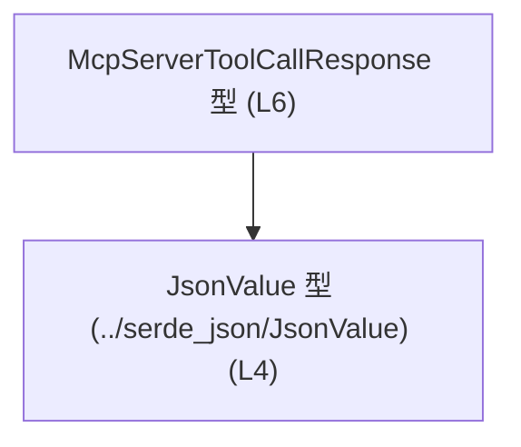
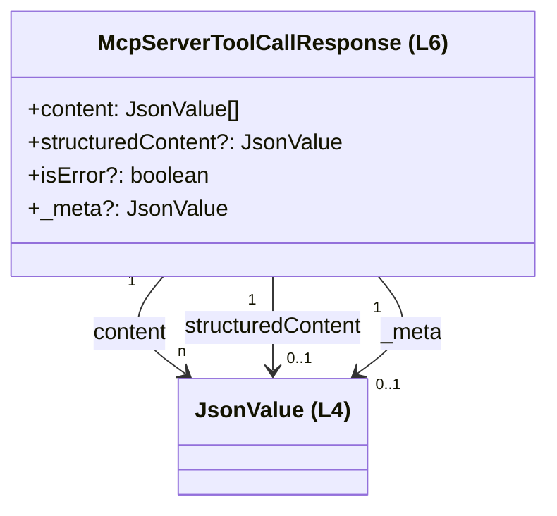
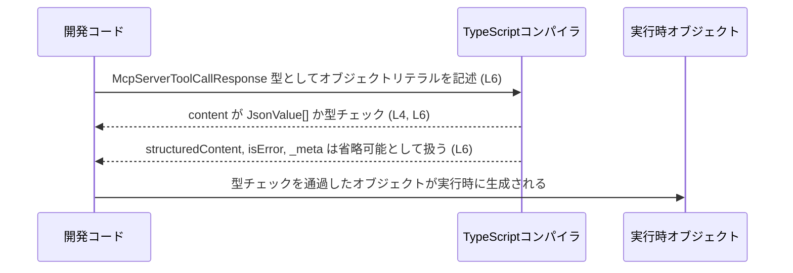

# app-server-protocol/schema/typescript/v2/McpServerToolCallResponse.ts

## 0. ざっくり一言

`McpServerToolCallResponse` 型は、`JsonValue` の配列を中心とした「ツール呼び出しのレスポンス」を表すオブジェクトの型定義です（`content`, `isError` などのプロパティ名から読み取れますが、実際の使用箇所はこのチャンクには含まれていません）。（`McpServerToolCallResponse.ts:L4-6`）

---

## 1. このモジュールの役割

### 1.1 概要

- このモジュールは、MCP サーバーの「ツール呼び出しレスポンス」と思われるデータ構造を TypeScript の型として表現します。（`McpServerToolCallResponse.ts:L6`）
- 実体は単一の型エイリアス `McpServerToolCallResponse` のみで、JSON 互換の値を表す `JsonValue` 型を組み合わせて構成されています。（`McpServerToolCallResponse.ts:L4-6`）
- ファイル冒頭コメントにより、Rust 側などから `ts-rs` によって自動生成されるスキーマ定義の一部であることが分かります。（`McpServerToolCallResponse.ts:L1-3`）

### 1.2 アーキテクチャ内での位置づけ

- このファイルは `schema/typescript/v2` 配下にあり、「プロトコル v2 の TypeScript スキーマ」の 1 要素という位置づけになっています（パス情報から判断）。
- `JsonValue` 型を外部モジュール `"../serde_json/JsonValue"` から `import type` しており、JSON 互換の値表現に依存しています。（`McpServerToolCallResponse.ts:L4`）
- 他のモジュールからは、`McpServerToolCallResponse` 型としてこの構造体を参照することで、レスポンスオブジェクトの形を共有することが想定されますが、実際の呼び出し側コードはこのチャンクには現れません。

依存関係を簡易に図示すると、次のようになります。



### 1.3 設計上のポイント

- **自動生成コード**  
  - コメントで「GENERATED CODE」「Do not edit this file manually」と明示されており、手動での編集を前提としていません。（`McpServerToolCallResponse.ts:L1-3`）
- **単一のデータコンテナ型**  
  - 関数やクラスは一切なく、1 つの型エイリアスだけを提供する構成です。（`McpServerToolCallResponse.ts:L6`）
- **JSON 互換の値型 `JsonValue` による汎用性**  
  - `content`, `structuredContent`, `_meta` はすべて `JsonValue` を利用しており、具体的な JSON 構造に依存しない汎用コンテナになっています。（`McpServerToolCallResponse.ts:L4, L6`）
- **オプショナルなフィールドによる柔軟性**  
  - `structuredContent`, `isError`, `_meta` は `?` が付いたオプショナルプロパティであり、状況に応じて省略できる設計になっています。（`McpServerToolCallResponse.ts:L6`）

---

## 2. 主要な機能一覧

このファイルは関数を持たず、「型定義」という意味での機能のみを提供します。

- `McpServerToolCallResponse` 型:  
  JSON 互換値 `JsonValue` の配列 `content` と、オプションの `structuredContent`, `isError`, `_meta` をまとめたレスポンスオブジェクトの型。（`McpServerToolCallResponse.ts:L6`）

### 2.1 コンポーネントインベントリー（型・モジュール）

| 名前                         | 種別         | export | 定義/使用行                         | 役割 / 説明 |
|------------------------------|--------------|--------|--------------------------------------|-------------|
| `JsonValue`                  | 型（import） | いいえ | `McpServerToolCallResponse.ts:L4`    | JSON 互換の値を表す型。`content` などのプロパティの要素型として利用されます。型の中身はこのチャンクには現れません。 |
| `McpServerToolCallResponse`  | 型エイリアス | はい   | `McpServerToolCallResponse.ts:L6`    | ツール呼び出しレスポンスを表すオブジェクト型。`JsonValue` の配列と複数のオプションフィールドを持ちます。 |

---

## 3. 公開 API と詳細解説

### 3.1 型一覧（構造体・列挙体など）

#### `McpServerToolCallResponse`

```ts
export type McpServerToolCallResponse = {
  content: Array<JsonValue>,
  structuredContent?: JsonValue,
  isError?: boolean,
  _meta?: JsonValue,
};
```

（`McpServerToolCallResponse.ts:L4, L6`）

| 名前                        | 種別       | フィールド名          | 型                   | 必須/任意 | 説明 |
|-----------------------------|------------|------------------------|----------------------|-----------|------|
| `McpServerToolCallResponse` | 型エイリアス | `content`              | `Array<JsonValue>`   | 必須      | JSON 互換値 `JsonValue` の配列。レスポンスの主要なコンテンツをまとめるコンテナとして機能します。 |
|                             |            | `structuredContent`    | `JsonValue`          | 任意      | 構造化されたコンテンツを 1 つ格納するためのフィールドと解釈できます（フィールド名からの推測であり、具体的な構造は `JsonValue` 側の定義次第です）。 |
|                             |            | `isError`              | `boolean`            | 任意      | レスポンスがエラーかどうかを示す真偽値フラグと解釈できます（プロパティ名からの推測）。未指定の場合の扱いは、このチャンクからは分かりません。 |
|                             |            | `_meta`                | `JsonValue`          | 任意      | メタデータを格納するためのフィールドと考えられます（プロパティ名 `_meta` からの推測）。具体的なキー構成は不明です。 |

**TypeScript の安全性・エラー・並行性の観点**

- **型安全性**  
  - `content` が `Array<JsonValue>` であることをコンパイル時に保証します。`JsonValue` と互換性のない要素を入れようとするとコンパイルエラーになります（`McpServerToolCallResponse.ts:L4, L6`）。
  - `structuredContent`, `_meta` は `JsonValue | undefined`、`isError` は `boolean | undefined` として扱われるため、`strictNullChecks` 有効時には未定義チェックを強制できます。
- **実行時エラー**  
  - TypeScript の型はコンパイル時のみで、実行時には消えるため、この定義だけでは「受信した JSON がこの形かどうか」は検証されません。パース・バリデーションは別途必要です。
- **並行性（Concurrency）**  
  - この型自体は非同期処理やスレッドの概念を持たず、通常のミュータブルな JavaScript オブジェクトとして扱われます。  
    複数の非同期処理から同じオブジェクトを共有して書き換える場合は、アプリケーション側で整合性に注意する必要があります。

### 3.2 関数詳細（最大 7 件）

このファイルには関数・メソッドは定義されていません。（`McpServerToolCallResponse.ts:L1-6`）

### 3.3 その他の関数

同上の理由により、補助的な関数も存在しません。（`McpServerToolCallResponse.ts:L1-6`）

---

## 4. データフロー

### 4.1 型内部のデータ関係

`McpServerToolCallResponse` 内でのプロパティと `JsonValue` の関係を図示します。



- `content` は 0 個以上の `JsonValue` を含む配列です。空配列を禁止するような制約はこの型定義にはありません。（`McpServerToolCallResponse.ts:L6`）
- `structuredContent`, `_meta` は存在しない場合もあるため、「あれば `JsonValue` 1 つ、なければ `undefined`」という関係になります。（`McpServerToolCallResponse.ts:L6`）

### 4.2 コンパイル時のチェックフロー（概念図）

以下は、この型がコンパイル時にどのように使われるかの典型的なイメージです。  
実際のプロジェクト内のコードはこのチャンクには含まれていませんが、TypeScript の一般的な挙動として説明します。



---

## 5. 使い方（How to Use）

### 5.1 基本的な使用方法

`McpServerToolCallResponse` 型の値を作成する単純な例です。`JsonValue` の具体的な定義はこのチャンクにはないため、コメントで補足に留めています。

```typescript
// 同一ディレクトリから型をインポートする例                        // ファイルパスに基づいた相対パス
import type { McpServerToolCallResponse } from "./McpServerToolCallResponse"; // (L6)
// JsonValue 型も必要に応じてインポート                             // ../serde_json/JsonValue から import されている (L4)
import type { JsonValue } from "../serde_json/JsonValue";

// JsonValue の値を 1 つ用意する（定義に応じて作成する）             // 実際の JsonValue の定義は別ファイル
const item: JsonValue = /* JsonValue 定義に従った値 */ null as unknown as JsonValue;

// 最低限必要なフィールドだけを持つレスポンスオブジェクトを作成     // content は必須 (L6)
const response: McpServerToolCallResponse = {
  content: [item],                                                    // JsonValue[] を設定
  // structuredContent, isError, _meta は省略可能                     // ? が付いているプロパティはなくても良い (L6)
};
```

このコードでは、TypeScript コンパイラが `content` の型と必須性をチェックし、`structuredContent`, `isError`, `_meta` が存在しなくてもエラーにならないことが分かります。

### 5.2 よくある使用パターン

#### 成功レスポンスとエラーレスポンスの表現（想定されるパターン）

プロパティ名から想定される使い分けの例です（実際のプロジェクトでどう使っているかはこのチャンクからは分かりません）。

```typescript
import type { McpServerToolCallResponse } from "./McpServerToolCallResponse";
import type { JsonValue } from "../serde_json/JsonValue";

// 成功ケースのレスポンス                                          // isError を明示的に false にする例
const successResponse: McpServerToolCallResponse = {
  content: [/* JsonValue */] as JsonValue[],
  structuredContent: /* JsonValue */ null as unknown as JsonValue,
  isError: false,
};

// エラーケースのレスポンス                                         // isError を true にする例
const errorResponse: McpServerToolCallResponse = {
  content: [],                                                       // エラー内容を content で返さないケースも型的には許容
  isError: true,
  _meta: /* エラー詳細など */ null as unknown as JsonValue,
};
```

### 5.3 よくある間違い

#### 1. 必須フィールド `content` の欠落

```typescript
import type { McpServerToolCallResponse } from "./McpServerToolCallResponse";

// 間違い例: content を省略している                                 // content は必須 (L6)
const badResponse: McpServerToolCallResponse = {
  // content: [] が必要
  isError: false,
  // -> TypeScript コンパイラがエラーにする
};
```

#### 2. オプショナルフィールドを未定義チェックせずに使用

```typescript
import type { McpServerToolCallResponse } from "./McpServerToolCallResponse";

declare const resp: McpServerToolCallResponse;

// 間違い例: structuredContent が必ずあると仮定している
// const value = (resp.structuredContent as any).someField;          // undefined の可能性がある (L6)

// 正しい例: 存在チェックを行う
if (resp.structuredContent !== undefined) {
  const value = (resp.structuredContent as any).someField;          // ここでは「ある前提」で扱える
}
```

### 5.4 使用上の注意点（まとめ）

- **必須フィールド `content`**  
  - 常に `JsonValue[]` を設定する必要があります。空配列が許容されるかどうかはこの型定義では制約されていないため、ビジネスロジック側で必要ならチェックする必要があります。（`McpServerToolCallResponse.ts:L6`）
- **オプショナルフィールドの未定義**  
  - `structuredContent`, `isError`, `_meta` は `undefined` の可能性があります。使用前に `undefined` チェックを行うか、TypeScript の型システム（`strictNullChecks` 等）を活用すると安全です。（`McpServerToolCallResponse.ts:L6`）
- **ランタイム検証は別途必要**  
  - ネットワーク越しに受信した JSON をこの型にマッピングする場合、型だけでは不正データを防げません。`JsonValue` の構造や `isError` の意味に応じて、パース時に検証ロジックを用意する必要があります。
- **並行処理での共有**  
  - オブジェクトはミュータブルなため、複数の非同期処理で共有して書き換えると競合が起きる可能性があります。必要に応じてコピーして使用するか、不変データとして扱う運用が望まれます。

---

## 6. 変更の仕方（How to Modify）

### 6.1 新しい機能を追加する場合

このファイルは自動生成であり、「手で変更しないこと」が明記されています。（`McpServerToolCallResponse.ts:L1-3`）

- `McpServerToolCallResponse` に新しいプロパティを追加したい場合でも、このファイル自体を直接編集するのではなく、**生成元**（おそらく Rust 側の定義など）を変更して `ts-rs` による再生成を行う必要があると考えられます。（`McpServerToolCallResponse.ts:L3` のコメントに ts-rs とあることからの推測であり、生成元の場所はこのチャンクには現れません）
- 追加するフィールドは、`JsonValue` を使うのか、より具体的な型を使うのかを整理し、プロトコル全体の整合性を検討する必要があります。

### 6.2 既存の機能を変更する場合

`content` や `isError` の型・意味を変更する場合の注意点です。

- **影響範囲の確認**  
  - `McpServerToolCallResponse` を参照している TypeScript コードすべてに影響します。どのモジュールがこの型を import しているかを IDE や検索で確認する必要があります（このチャンクには使用箇所は現れません）。
- **契約の変更**  
  - たとえば `content` を必須からオプショナルに変える、`isError` の型を `boolean` から別の enum に変える、といった変更は、呼び出し側が仮定している契約を破る可能性があります。  
  - プロトコルのバージョン（ここでは `v2`）を上げる必要があるかどうかも含めて設計する必要があります。
- **自動生成ファイルである点**  
  - 直接編集すると、再生成時に上書きされます。必ず生成元定義を修正する方針を取る必要があります。（`McpServerToolCallResponse.ts:L1-3`）

---

## 7. 関連ファイル

このモジュールから明示的に参照されているファイル・モジュールは次のとおりです。

| パス / モジュール名            | 役割 / 関係 |
|--------------------------------|-------------|
| `../serde_json/JsonValue`      | `JsonValue` 型を提供するモジュールです。`McpServerToolCallResponse` の `content`, `structuredContent`, `_meta` プロパティの型として利用されています。（`McpServerToolCallResponse.ts:L4, L6`） |

※ 自動生成元（Rust 側の型定義など）はコメントから推測できますが、このチャンクにはファイルパス等の具体的情報は現れないため、「どのファイルが生成元か」は不明です。（`McpServerToolCallResponse.ts:L1-3`）

---

## 付録: Bugs / Security / Contracts / Edge Cases の整理

### Bugs / Security 観点

- **潜在的なバグ要因**
  - `isError` がオプショナルであるため、「未指定」と「false」の違いをどう扱うかがコード側の責任になります。明確な運用ルールがないとバグの原因になり得ます。（`McpServerToolCallResponse.ts:L6`）
- **セキュリティ**
  - `JsonValue` は任意の JSON 互換値を保持できる型と考えられるため（名前からの推測）、外部からの入力をそのまま `JsonValue` に載せると、XSS やコマンドインジェクションなど別種の脆弱性の温床になり得ます。  
    この型自体はバリデーション機能を持たないため、入力検証は別レイヤーで実施する必要があります。

### Contracts / Edge Cases

- **必須 / 任意**
  - `content` は必須。`structuredContent`, `isError`, `_meta` は任意。（`McpServerToolCallResponse.ts:L6`）
- **空配列の扱い**
  - `content` に空配列を設定することは型的には許容されます。空配列の意味（「結果なし」「エラー」など）はこの型定義からは分かりません。
- **プロパティ未設定**
  - 任意プロパティが未設定の場合、受け手側で適切なデフォルト動作（例: `isError` undefined を「成功」とみなす等）を決めておく必要がありますが、その規約はこのチャンクには含まれていません。

### Tests / Performance / Observability

- **Tests**  
  - このファイル内にテストコードは存在しません。（`McpServerToolCallResponse.ts:L1-6`）
- **Performance / Scalability**  
  - 型定義のみであり直接の性能問題はありませんが、`content` に非常に大きな配列を持たせる設計にすると、シリアライズ・デシリアライズやネットワーク転送のコストが増大します。
- **Observability**  
  - ログ出力やトレースに関する仕組みはこのファイルには含まれていません。ログに出す場合は `JsonValue` の構造に応じてマスク等を別途実装する必要があります。
