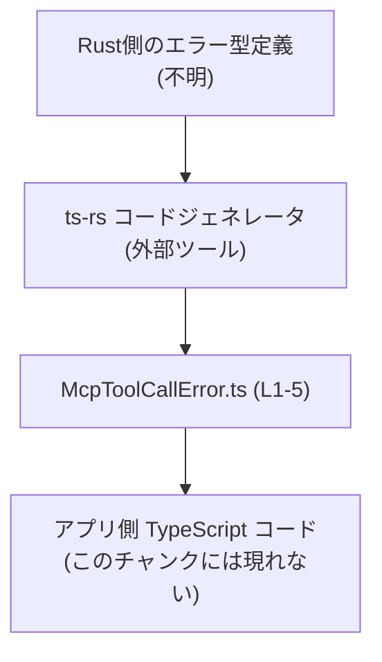
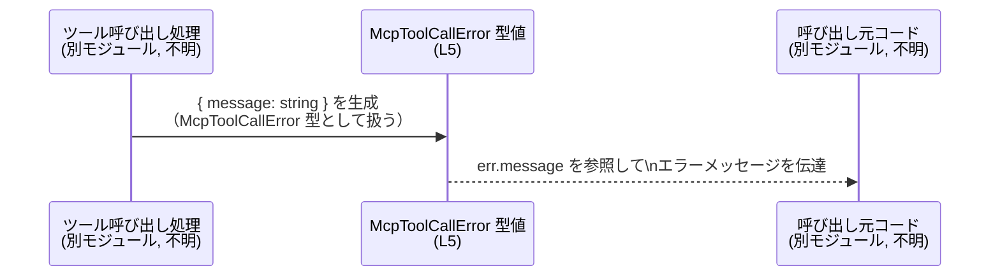

# app-server-protocol\schema\typescript\v2\McpToolCallError.ts コード解説

## 0. ざっくり一言

- MCP ツール呼び出しエラーを表す、`message: string` だけを持つエラーオブジェクト型を定義した、自動生成 TypeScript ファイルです（McpToolCallError.ts:L1-5）。

---

## 1. このモジュールの役割

### 1.1 概要

- このモジュールは、MCP ツール呼び出しに関するエラー情報を表すための TypeScript 型 `McpToolCallError` を提供します（McpToolCallError.ts:L5）。
- 型は `message: string` プロパティのみを持ち、エラーメッセージを表現します（McpToolCallError.ts:L5）。
- ファイル先頭に自動生成である旨のコメントがあり（McpToolCallError.ts:L1, L3）、アプリケーションコードから参照される「スキーマ定義」として利用される想定です。

### 1.2 アーキテクチャ内での位置づけ

- コメントに「This file was generated by ts-rs」とあるため、この型は Rust 側の定義から `ts-rs` ツールによって生成された TypeScript スキーマであると分かります（McpToolCallError.ts:L3）。
- ディレクトリ `schema/typescript/v2` から、このファイルは「アプリケーションサーバープロトコル」の TypeScript 向けスキーマ群の一部と解釈できますが、他のファイルや利用箇所はこのチャンクには現れません。

依存関係のイメージ（コードとコメントから分かる範囲＋最小限の補足）を Mermaid で示します。



- `RustType` の具体的な場所や型名は、このチャンクには現れません。
- `AppCode`（この型を使う実際のアプリケーションコード）も、このチャンクには現れません。

### 1.3 設計上のポイント

コードから読み取れる設計上の特徴は次のとおりです。

- **自動生成コードであること**  
  - 冒頭コメントに「GENERATED CODE! DO NOT MODIFY BY HAND!」とあり（McpToolCallError.ts:L1）、手動編集しない前提の設計です。
  - さらに `ts-rs` によって生成されたと明記されています（McpToolCallError.ts:L3）。
- **単純な型エイリアスによる表現**  
  - `export type McpToolCallError = { message: string, };` の 1 行のみがエクスポートされます（McpToolCallError.ts:L5）。
  - TypeScript の**型エイリアス**であり、インターフェースやクラスではありません。
- **最小限の情報（message のみ）**  
  - プロパティは `message: string` の 1 つだけで、エラーコードやスタックトレースなどは含まれません（McpToolCallError.ts:L5）。
- **状態やロジックを持たない**  
  - 関数・メソッド・クラスは定義されておらず、実行時のロジックや状態は持ちません（McpToolCallError.ts:L1-5）。
  - 役割は「オブジェクトの形（スキーマ）を静的に表現すること」に限定されています。

---

## 2. 主要な機能一覧

このモジュールが提供する機能は 1 つだけです。

- `McpToolCallError` 型定義: MCP ツール呼び出しエラーを表す `{ message: string }` 形式のオブジェクト型を提供する（McpToolCallError.ts:L5）。

---

## 3. 公開 API と詳細解説

### 3.1 型一覧（構造体・列挙体など）＝コンポーネントインベントリー

このファイルに登場する公開型の一覧です。

| 名前              | 種別                      | 役割 / 用途                                               | 定義位置                      |
|-------------------|---------------------------|------------------------------------------------------------|--------------------------------|
| `McpToolCallError` | 型エイリアス（オブジェクト型） | MCP ツール呼び出し時のエラーメッセージを持つオブジェクト型 | McpToolCallError.ts:L5-5      |

#### `McpToolCallError` の詳細

```typescript
export type McpToolCallError = { message: string, };
```

- **概要**  
  - `message` プロパティを必須で持つオブジェクト型です（McpToolCallError.ts:L5）。
  - エラー内容を人間が読める文字列として表現するための型と解釈できますが、使い方はこのチャンクには現れません。

- **フィールド**

| フィールド名 | 型      | 必須/任意 | 説明                          | 根拠 |
|--------------|---------|----------|-------------------------------|------|
| `message`    | `string` | 必須     | エラーメッセージの文字列      | McpToolCallError.ts:L5 |

- **TypeScript 型安全性の観点**  
  - `message` は `string` 型に固定されており、数値などを入れるとコンパイルエラーになります（TypeScript の静的型チェックによる）。  
  - プロパティは必須なので、`{}` や `{ message?: string }` のようなオブジェクトは `McpToolCallError` としては扱えません（McpToolCallError.ts:L5）。

- **エラー/並行性の観点**  
  - この型自体は**実行時のエラー処理や検証ロジックを持ちません**。  
    - たとえば「空文字を許可するか」「最大長」などの制約はこの型からは読み取れません。
  - TypeScript の型はコンパイル時のみ有効なため、実行時には単なる JavaScript オブジェクトになります。
  - 並行性（非同期処理・マルチスレッド）に関する情報も、この型には含まれません。

### 3.2 関数詳細（最大 7 件）

- このファイルには関数・メソッド・クラスは一切定義されていません（McpToolCallError.ts:L1-5）。
- したがって、このセクションで詳述すべき公開関数はありません。

### 3.3 その他の関数

- 補助関数やラッパー関数も存在しません（McpToolCallError.ts:L1-5）。

---

## 4. データフロー

このファイル単体には処理ロジックがないため、**実際の処理フローのコードは存在しません**。  
ここでは、型名と想定される用途に基づく「典型的な利用イメージ」を示します（あくまで一般的な使用例であり、このチャンクには現れません）。

### 4.1 典型シナリオの概要

- どこか別のモジュールで MCP ツール呼び出しを行う。
- エラーが発生した場合、`{ message: string }` 形式のオブジェクトを作成し、`McpToolCallError` として扱う。
- 呼び出し元は `err.message` を参照して、ユーザへの表示やログ出力を行う。

### 4.2 Sequence Diagram（利用イメージ）



- `Tool` や `Caller` に相当する具体的な関数・クラスは、このチャンクには現れません。
- 実際には Promise ベースの非同期処理やコールバックの中でこの型が使われる可能性がありますが、その詳細もこのファイルからは分かりません。

---

## 5. 使い方（How to Use）

### 5.1 基本的な使用方法

同じディレクトリにある `McpToolCallError.ts` を利用する別ファイルからの使用例です。  
インポートパスは「同じディレクトリにある」という前提で `./McpToolCallError` を用いています。

```typescript
// McpToolCallError.ts から型をインポートする                     // 型だけをインポートするので import type を使用
import type { McpToolCallError } from "./McpToolCallError";       // パスは同一ディレクトリ想定

// ツール呼び出しでエラーが発生したときに使う関数の例           // エラー型を受け取りログに出力する関数
function handleToolError(err: McpToolCallError) {                 // 引数 err は McpToolCallError 型
    console.error("ツール呼び出しでエラー:", err.message);        // 型のおかげで message が string と分かる
}

// 実際にエラーオブジェクトを作成して渡す例                     // 正しいオブジェクトの例
const error: McpToolCallError = {                                 // message プロパティを必須で持つ
    message: "ツール実行中に予期しないエラーが発生しました",      // string 型のメッセージ
};

handleToolError(error);                                           // 正常にコンパイル・実行できる
```

TypeScript の型システムにより、次のような誤りはコンパイル時に検出されます。

```typescript
import type { McpToolCallError } from "./McpToolCallError";

// コンパイルエラー例: message が数値になっている               // Type 'number' is not assignable to type 'string'.
const invalid1: McpToolCallError = {
    // @ts-expect-error
    message: 123,                                                  // number は許可されない
};

// コンパイルエラー例: message プロパティが欠けている           // Property 'message' is missing
// @ts-expect-error
const invalid2: McpToolCallError = {};                            // 必須プロパティがないためエラー
```

### 5.2 よくある使用パターン

- **非同期処理のエラー結果として返す**

```typescript
import type { McpToolCallError } from "./McpToolCallError";

// ツール呼び出し結果をラップした型の一例                       // 成功時とエラー時を分けて扱う
type ToolCallResult =
    | { ok: true;  data: unknown }
    | { ok: false; error: McpToolCallError };

async function callTool(): Promise<ToolCallResult> {              // 非同期にツールを呼び出す
    try {
        // 実際のツール呼び出し処理（このチャンクには現れない）
        return { ok: true, data: {/* ... */} };
    } catch (e) {
        return {
            ok: false,
            error: { message: "ツール呼び出しに失敗しました" },  // McpToolCallError を返す
        };
    }
}
```

- **ログ・UI 表示への利用**  
  - `err.message` をログ出力やダイアログ表示に直接渡す使い方が典型的です。
  - この型定義からは、メッセージ内容のフォーマットや言語（日本語/英語）などは分かりません。

### 5.3 よくある間違い

この型を使う上で起こりやすい誤用例と、その修正例を示します。

```typescript
import type { McpToolCallError } from "./McpToolCallError";

// 間違い例: message を任意プロパティとして扱っている
function bad(err: Partial<McpToolCallError>) {                    // Partial にしてしまうと message が省略可能になる
    if (!err.message) {                                           // string | undefined になりうる
        console.error("不明なエラー");                            // 実行時に undefined の可能性
        return;
    }
    console.error(err.message.toUpperCase());
}

// 正しい例: 必須プロパティとして扱う（元の型のまま）
function good(err: McpToolCallError) {                            // message は常に string
    console.error(err.message.toUpperCase());                     // undefined チェック不要
}
```

- `Partial<McpToolCallError>` のようにしてしまうと、コンパイル時には許されても、実行時に `message` が存在しないケースを許容してしまいます。
- エラーを必ずメッセージ付きで扱いたい場合は、元の `McpToolCallError` 型のまま使うほうが安全です。

### 5.4 使用上の注意点（まとめ）

- **前提条件**
  - `message` には「ユーザに見せても問題ない文字列」や「ログに残すメッセージ」を入れることが想定されますが、具体的な制約はこの型からは分かりません。
- **型安全性**
  - `message` は必須の `string` なので、数値やオブジェクトを代入するとコンパイルエラーになります（McpToolCallError.ts:L5）。
  - 実行時には JavaScript オブジェクトになるため、外部からの入力をそのまま `McpToolCallError` とみなす場合は、別途ランタイムバリデーションが必要です。
- **エッジケース**
  - 空文字列 `""` や非常に長い文字列を禁止する制約はこの型からは読み取れません。必要であれば呼び出し側でチェックする必要があります。
- **並行性**
  - TypeScript の型は並行性に関する情報を持ちません。この型自体はイミュータブルではなく、`err.message = "..."` のように書き換え可能です。
  - 共有オブジェクトとして扱う場合、複数の非同期処理から書き換えると意図しない状態になる可能性があるため、必要に応じてコピーして利用するほうが安全です。

---

## 6. 変更の仕方（How to Modify）

### 6.1 新しい機能を追加する場合

ファイル先頭コメントにある通り、**このファイルは自動生成コードであり、手動で編集すべきではありません**（McpToolCallError.ts:L1, L3）。

- たとえば「エラーコード」や「詳細情報」を追加したい場合、
  1. 元になっている Rust 側の型定義（`ts-rs` が参照する定義）を変更する必要があります（場所はこのチャンクには現れません）。
  2. `ts-rs` を再実行して TypeScript コードを再生成します。
  3. 生成された `McpToolCallError.ts` に新しいフィールドが反映されます。

設計上考えられる拡張例（イメージ）：

```typescript
// これはあくまでイメージであり、このチャンクには存在しない
export type McpToolCallError = {
    message: string;   // 既存
    // code?: string;  // 追加したい場合の例（オプションのエラーコード）
};
```

※ 実際には Rust 側の構造体でフィールドを追加し、それを ts-rs が変換します。

### 6.2 既存の機能を変更する場合

既存の `McpToolCallError` を変更する際に注意すべき点です。

- **変更時の影響範囲**
  - `message` の型を `string` から他の型（例: `string | string[]`）に変えると、すべての利用箇所でコンパイルエラーが発生する可能性があります。
  - `message` をオプションにする（`message?: string`）と、`err.message` を前提にしているコードが実行時に `undefined` を受け取るリスクが増えます。
- **契約（コントラクト）の維持**
  - 現在の契約は「必ず `message: string` が存在するエラーオブジェクト」です（McpToolCallError.ts:L5）。
  - 契約を弱める（オプションにする）場合、呼び出し側のバリデーションとエラーハンドリングを見直す必要があります（利用コードはこのチャンクには現れません）。
- **自動生成の前提**
  - 直接この TypeScript ファイルを編集しても、次回のコード生成で上書きされます。
  - 必ず元の定義（Rust 側）＋ ts-rs の設定側で変更を行う必要があります。

---

## 7. 関連ファイル

このチャンクには他ファイルの具体的なパスは現れませんが、ディレクトリ名などから推測できる範囲を整理します。

| パス / 要素                                           | 役割 / 関係 |
|------------------------------------------------------|------------|
| `app-server-protocol\schema\typescript\v2\`          | 本ファイルを含む TypeScript スキーマ定義ディレクトリと考えられます。他のスキーマ型（例: リクエスト/レスポンス型）が存在する可能性がありますが、このチャンクには現れません。 |
| Rust 側の ts-rs 対象型定義（パス不明）               | この `McpToolCallError` の元になっている Rust 型。コメントから存在が示唆されますが、具体的な場所・名前は分かりません（McpToolCallError.ts:L3）。 |
| `ts-rs` ツール（外部ライブラリ）                     | Rust 型から TypeScript 型を生成するコードジェネレータとしてコメントに記載されています（McpToolCallError.ts:L3）。 |

---

### まとめ（このファイルの安全性・エッジケースのポイント）

- このファイルは **実行ロジックを持たない型定義のみ** であり、直接的なバグやセキュリティホールを含むことはほぼありません。
- 一方で、**ランタイムの検証は行われない** ため、
  - 外部から受け取ったデータを `McpToolCallError` として扱う場合は、別途スキーマバリデーションが必要です。
  - `message` の内容（ユーザ入力や外部サービスからの文字列）を UI やログに出すときは、XSS やログ汚染など一般的なセキュリティ対策を適用する必要があります。
- 並行性・性能・スケーラビリティに特有の懸念は、この型定義単体からは生じません。
