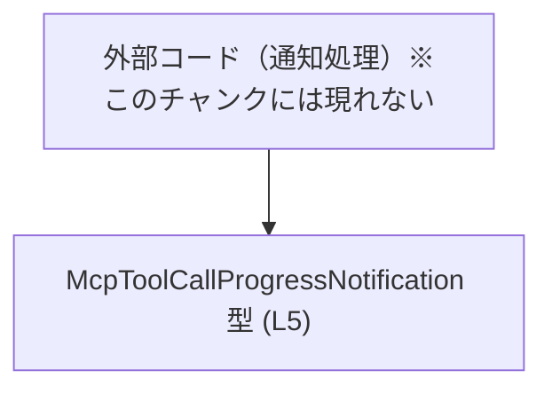
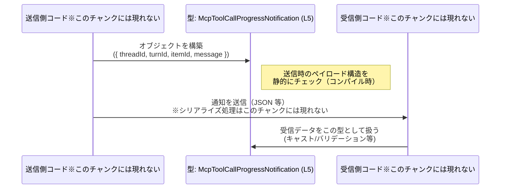

# app-server-protocol/schema/typescript/v2/McpToolCallProgressNotification.ts

## 0. ざっくり一言

MCP ツール呼び出しの「進捗通知」を表現するための、TypeScript のオブジェクト型（型エイリアス）を 1 つだけ公開している自動生成ファイルです（`McpToolCallProgressNotification.ts:L1-5`）。

---

## 1. このモジュールの役割

### 1.1 概要

- このモジュールは、`McpToolCallProgressNotification` という通知メッセージの構造を TypeScript の型として定義します（`McpToolCallProgressNotification.ts:L5-5`）。
- すべてのフィールドは `string` 型で、スレッド・ターン・アイテムの ID と、進捗内容を表すメッセージ文字列を保持します（`McpToolCallProgressNotification.ts:L5-5`）。
- ファイル先頭のコメントから、この型は `ts-rs` によって自動生成されており、手動で編集すべきではないことが分かります（`McpToolCallProgressNotification.ts:L1-3`）。

### 1.2 アーキテクチャ内での位置づけ

- 役割は「通知ペイロードのスキーマ定義」に限定されており、処理ロジックや関数は一切含まれていません（`McpToolCallProgressNotification.ts:L5-5`）。
- 外部の送受信ロジックやアプリケーションコードから、この型を利用して型安全に通知メッセージを扱うことが想定されますが、そのコードはこのチャンクには現れません。

概念的な依存関係（このファイルに現れる要素のみ + 抽象的な利用者）を示します。



### 1.3 設計上のポイント

- 自動生成コード  
  - ファイル先頭に「GENERATED CODE」「Do not edit this file manually」と明示されており（`McpToolCallProgressNotification.ts:L1-3`）、生成元の定義から再生成される前提になっています。
- 純粋なデータ定義のみ  
  - 関数やメソッド、状態を持つクラスは存在せず、単一の型エイリアスのみを公開する構造です（`McpToolCallProgressNotification.ts:L5-5`）。
- 必須プロパティのみ  
  - 4 つのプロパティはすべて必須で、オプショナル（`?`）指定はありません（`McpToolCallProgressNotification.ts:L5-5`）。
- すべて `string` 型  
  - ID もメッセージもすべて `string` として表現され、数値や列挙型などは使用されていません（`McpToolCallProgressNotification.ts:L5-5`）。
- エラー/並行性  
  - 型定義のみのため、このファイル単体では実行時エラー処理や並行性に関するロジックは存在しません。

---

## 2. 主要な機能一覧

このファイルが提供する「機能」は型定義 1 件に集約されます。

- `McpToolCallProgressNotification` 型: MCP ツール呼び出しの進捗通知メッセージの構造（4 つの文字列プロパティ）を表現する。

---

## 3. 公開 API と詳細解説

### 3.1 型一覧（構造体・列挙体など）

| 名前                              | 種別        | 役割 / 用途                                                                 | 定義位置                                           |
|-----------------------------------|-------------|------------------------------------------------------------------------------|----------------------------------------------------|
| `McpToolCallProgressNotification` | 型エイリアス | ツール呼び出しの進捗に関する通知メッセージのデータ構造を表すオブジェクト型 | `McpToolCallProgressNotification.ts:L5-5`          |

`McpToolCallProgressNotification` のプロパティ構造:

| プロパティ名 | 型      | 必須/任意 | 説明（コードから読める範囲）                          | 定義位置                              |
|--------------|---------|-----------|--------------------------------------------------------|---------------------------------------|
| `threadId`   | string  | 必須      | スレッドを識別するための文字列 ID                     | `McpToolCallProgressNotification.ts:L5-5` |
| `turnId`     | string  | 必須      | あるスレッド内のターンを識別するための文字列 ID       | 同上                                  |
| `itemId`     | string  | 必須      | あるターン内のアイテム（ツール呼び出しなど）の文字列 ID | 同上                                  |
| `message`    | string  | 必須      | 進捗内容や状態を説明するメッセージ文字列              | 同上                                  |

> 補足: 「スレッド」「ターン」「アイテム」の正確なドメイン定義は、このチャンクには現れません。ここではプロパティ名から読み取れる範囲のみを記述しています。

### 3.2 関数詳細（最大 7 件）

このファイルには関数・メソッド・クラスは定義されていないため、関数詳細テンプレートに従って説明できる対象はありません（`McpToolCallProgressNotification.ts:L1-5`）。

### 3.3 その他の関数

- 関数や補助的なロジックは存在しません（`McpToolCallProgressNotification.ts:L1-5`）。

---

## 4. データフロー

このファイルは型定義のみで処理ロジックを含まないため、厳密な意味での「データフロー実装」は存在しません。  
ここでは、この型がどのように利用されるかの **概念的なシナリオ** を示します（利用コード自体はこのチャンクには現れません）。



要点:

- この型は「通知メッセージ」の形を決める役割を持ちます。
- TypeScript コンパイラは、送信側・受信側がこの構造を守っているかをコンパイル時にチェックできます。
- ただし、このチャンクにはシリアライズ/デシリアライズや実際の送受信コードは存在しません。

---

## 5. 使い方（How to Use）

### 5.1 基本的な使用方法

この型を用いて進捗通知オブジェクトを作成し、型安全に扱う基本的な例です。  
インポートパスは例示であり、実際のパスはプロジェクト構成によって異なります（このチャンクからは不明です）。

```typescript
// 例: 型エイリアスをインポートする（パスは例示）                 // このファイルの型を他モジュールで使う前提
import type { McpToolCallProgressNotification } from "./McpToolCallProgressNotification"; // 実際のパスは不明

// 進捗通知オブジェクトを作成する                                // 型エイリアスを使ってオブジェクトを定義
const notification: McpToolCallProgressNotification = {         // 4 つの必須フィールドが必要
    threadId: "thread-123",                                     // スレッド ID（文字列）
    turnId: "turn-1",                                           // ターン ID（文字列）
    itemId: "item-42",                                          // アイテム ID（文字列）
    message: "Tool is 50% complete",                            // 進捗メッセージ
};

// 作成したオブジェクトを送信処理などに渡す                      // 実際の送信処理はこのチャンクには現れない
sendNotification(notification);
```

この例では、`notification` オブジェクトが `McpToolCallProgressNotification` 型と一致しない場合（フィールド不足や型の不一致）は、コンパイル時にエラーになります。

### 5.2 よくある使用パターン

1. **関数の引数として使う**

```typescript
// 進捗通知を処理する関数の例                                 // 引数に型エイリアスを適用
function handleProgress(
    notif: McpToolCallProgressNotification,                    // notif は 4 つの string プロパティを持つ
) {
    console.log(`[${notif.threadId}/${notif.turnId}] ${notif.message}`); // 型に基づき安全にアクセス
}
```

1. **配列・ストリームとして扱う**

```typescript
// 通知の履歴を保持する配列                                   // 配列要素の型として利用
const history: McpToolCallProgressNotification[] = [];         // 履歴リスト

// 新しい通知を追加                                           // push するオブジェクトも型チェックされる
history.push({
    threadId: "thread-123",
    turnId: "turn-2",
    itemId: "item-99",
    message: "Tool finished",
});
```

### 5.3 よくある間違い

この型に対して発生しうる典型的な型エラーを示します。

```typescript
// 間違い例: 必須フィールドが足りない                          // itemId が欠けている
const invalid1: McpToolCallProgressNotification = {
    threadId: "thread-123",
    turnId: "turn-1",
    // itemId: "item-42",                                      // ← ないのでコンパイルエラー
    message: "missing itemId",
};

// 間違い例: 型が一致しない                                   // threadId を number で指定
const invalid2: McpToolCallProgressNotification = {
    threadId: 123,                                             // ← string ではなく number のためコンパイルエラー
    turnId: "turn-1",
    itemId: "item-42",
    message: "wrong type",
};
```

いずれも TypeScript の静的型チェックによりコンパイル時に検出され、実行前に修正できます。

### 5.4 使用上の注意点（まとめ）

- **静的型のみで、実行時チェックはない**  
  - このファイルは型エイリアスのみを提供し、実行時のバリデーション処理は含まれていません。JSON 等の外部入力をこの型として扱う場合は、別途実行時の検証が必要です（このチャンクには現れません）。
- **4 フィールドはすべて必須**  
  - `threadId`, `turnId`, `itemId`, `message` のいずれもオプショナルではなく、省略するとコンパイルエラーになります（`McpToolCallProgressNotification.ts:L5-5`）。
- **並行性に関する懸念はない**  
  - この型は不変オブジェクトとして扱われる値の形を表すのみで、内部状態やミューテーションロジックを持ちません。複数スレッド/タスクから同じオブジェクトを読み取っても、この型自体が原因で競合状態が発生することはありません。
- **自動生成ファイルを直接編集しない**  
  - コメントに「Do not modify by hand」「Do not edit this file manually」と明記されているため（`McpToolCallProgressNotification.ts:L1-3`）、変更は生成元の定義側で行う必要があります。

---

## 6. 変更の仕方（How to Modify）

### 6.1 新しい機能を追加する場合

このファイルは自動生成されており、直接編集すべきではない点に注意する必要があります。

- **変更の入口**
  - ファイル先頭コメントより、この型は `ts-rs` によって生成されています（`McpToolCallProgressNotification.ts:L1-3`）。
  - そのため、新しいフィールドを追加したい場合や型を変更したい場合は、「生成元の定義」（おそらく Rust 側の構造体など）を変更し、`ts-rs` による再生成を行うのが前提になります。  
    ※生成元がどこにあるかは、このチャンクには現れません。
- **影響範囲**
  - フィールド追加・名前変更・型変更を行うと、この型を利用しているすべての TypeScript コードにコンパイルエラーが発生しうるため、利用箇所の洗い出しが必要です。
- **テスト**
  - このチャンク内にはテストコードは存在しません。型の変更後は、通知送受信のテスト（別ファイル）で新旧フォーマットの整合性を確認する必要があります。

### 6.2 既存の機能を変更する場合

- **フィールド削除／リネーム**
  - `threadId` などのプロパティ名を変更・削除すると、それにアクセスしているすべてのコードがコンパイルエラーになります。
  - 互換性を維持する必要がある場合は、生成元の側で移行期間用のフィールドを並行して持つなどの設計が必要ですが、その具体的実装はこのチャンクには現れません。
- **型の変更**
  - `string` から `number` など、型を変えると、既存コードでの利用方法（文字列操作など）と不整合が生じます。
- **契約（前提条件）の維持**
  - 現在は「4 つの文字列フィールドが必ず存在する」というシンプルな契約になっています（`McpToolCallProgressNotification.ts:L5-5`）。
  - これをオプショナルに変更したり、意味を変える場合は、呼び出し側が前提としている契約も見直す必要があります。

---

## 7. 関連ファイル

このチャンクから直接参照できる関連ファイル情報は存在しませんが、コメントから以下が推測できます。

| パス / コンポーネント | 役割 / 関係 |
|-----------------------|------------|
| `ts-rs` 生成元定義（Rust 側等）※このチャンクには現れない | `McpToolCallProgressNotification` 型の元になる定義を持つと考えられますが、具体的な場所や内容はこのチャンクには現れません。 |
| 通知送受信ロジック（TypeScript / JavaScript 側）※このチャンクには現れない | この型をインポートして、実際の送信・受信・処理を行うコードが存在するはずですが、このチャンクからは特定できません。 |

> まとめ: `app-server-protocol/schema/typescript/v2/McpToolCallProgressNotification.ts` は、自動生成された 1 つの型エイリアスを提供する「スキーマ定義ファイル」であり、実際のロジックはすべて他ファイルに存在します。
