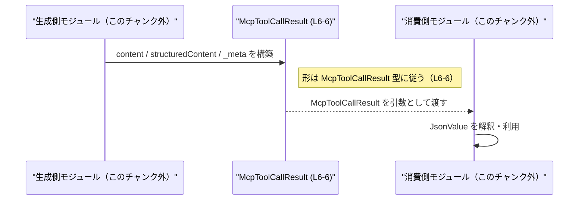

# app-server-protocol\schema\typescript\v2\McpToolCallResult.ts

## 0. ざっくり一言

`JsonValue` を用いて、ツール呼び出し結果と思われるデータ構造 `McpToolCallResult` を定義する **自動生成された TypeScript の型定義ファイル**です（L1–L3, L4–L6）。

---

## 1. このモジュールの役割

### 1.1 概要

- 冒頭コメントにあるとおり、このファイルは `ts-rs` によって生成されたコードであり、手動での編集は想定されていません（L1–L3）。
- `../serde_json/JsonValue` から `JsonValue` 型を型インポートし（L4）、  
  それを用いたエクスポート型 `McpToolCallResult` を定義しています（L6）。
- `McpToolCallResult` は
  - `content: Array<JsonValue>`
  - `structuredContent: JsonValue | null`
  - `_meta: JsonValue | null`
  を持つオブジェクト型エイリアスです（L6）。

名称から「ツール呼び出し結果」を表す型と推測できますが、その用途はこのチャンク単体からは断定できません。

### 1.2 アーキテクチャ内での位置づけ

このファイル内で把握できる依存関係は次のとおりです。

- `McpToolCallResult` は `JsonValue` 型に依存します（L4, L6）。
- `JsonValue` 自体の実体（どのような型か）はこのチャンクには現れません（L4）。

依存関係を簡略に図示すると、次のようになります。


この図は、「このチャンク内で `JsonValue` がインポートされ、その配下で `McpToolCallResult` が構成されている」という関係だけを示しています。  
`McpToolCallResult` がどのモジュールから利用されるかは、このチャンクには現れません。

### 1.3 設計上のポイント

コードから読み取れる設計上の特徴は次のとおりです。

- **自動生成コード**  
  - コメントにより「手で変更しないこと」が明示されています（L1–L3）。
  - 変更が必要な場合は、生成元（おそらく Rust 側の ts-rs 対象型）を変更すべき構造になっていますが、生成元はこのチャンクには現れません。
- **純粋なデータ型エイリアス**  
  - 関数やクラスはなく、1つの型エイリアス `McpToolCallResult` のみをエクスポートします（L6）。
  - 副作用や状態は持たず、型レベルの契約のみを提供します。
- **JSON 互換の汎用表現**  
  - プロパティがすべて `JsonValue` で表現されており、構造化データとメタ情報を柔軟に扱える設計になっています（L6）。
  - `structuredContent` と `_meta` は `JsonValue | null` であり、値がない場合を `null` で表現する契約です（L6）。
- **TypeScript の言語機能**  
  - `Array<JsonValue>` というジェネリック配列型を使い（L6）、  
    型パラメータ `JsonValue` によって配列要素の型安全性を確保しています。
  - `JsonValue | null` はユニオン型であり、「JSON 値または null」の2通りの可能性をコンパイル時に表現しています（L6）。

---

## 2. 主要な機能一覧（=コンポーネントインベントリー）

このファイルはロジックを持たず、**データ構造の定義のみ**を提供します。

### 2.1 コンポーネント一覧（このチャンク）

| 名称                | 種別          | 説明                                                                                           | 定義/参照位置 |
|---------------------|---------------|------------------------------------------------------------------------------------------------|----------------|
| `JsonValue`         | 型（import）  | JSON ライクな値を表す型。詳細な中身はこのチャンクには現れませんが、`McpToolCallResult` の構成要素です。 | `app-server-protocol\schema\typescript\v2\McpToolCallResult.ts:L4-4` |
| `McpToolCallResult` | 型エイリアス  | `content` / `structuredContent` / `_meta` の3プロパティを持つオブジェクト型。エクスポートされています。 | `app-server-protocol\schema\typescript\v2\McpToolCallResult.ts:L6-6` |

「機能」というよりは、「どのような形のデータをやり取りするか」の契約を定義しているファイルです。

---

## 3. 公開 API と詳細解説

### 3.1 型一覧（構造体・列挙体など）

#### 型: `McpToolCallResult`

**概要**

- `JsonValue` ベースで構成されたオブジェクトを表す型エイリアスです（L6）。
- プロパティは以下の3つです（すべて必須プロパティとしてオブジェクトに存在しますが、値として `null` を取り得るものがあります）。

| プロパティ名         | 型                      | 説明                                                                                             |
|----------------------|-------------------------|--------------------------------------------------------------------------------------------------|
| `content`            | `Array<JsonValue>`      | `JsonValue` の配列です。0 個以上の要素が入る可能性があります（L6）。                            |
| `structuredContent`  | `JsonValue \| null`     | 構造化された 1 つの JSON 値または `null` を保持します（L6）。意味上の用途はこのチャンクからは不明です。 |
| `_meta`              | `JsonValue \| null`     | メタ情報と思われる JSON 値または `null` を保持します（L6）。用途はこのチャンクからは不明です。       |

> 契約上、「プロパティそのものが存在しない（`undefined`）」形ではなく、存在した上で `null` または `JsonValue` になる設計です（L6）。

**型の契約（Contracts）**

この型から読み取れる契約は次のとおりです（いずれもコンパイル時の契約です）。

- `content` は常に配列であり、配列要素はすべて `JsonValue` でなければなりません（L6）。
- `structuredContent` は「`JsonValue` である」か「値が存在しないことを `null` で表す」かのいずれかです（L6）。
- `_meta` も同様に `JsonValue` または `null` のどちらかです（L6）。
- どのプロパティもオプショナル（`?`）ではないため、オブジェクト上には必ずキーが存在することが期待されます（L6）。

**Edge cases（エッジケース）**

この型に関する代表的なエッジケースは次のように整理できます。

- `content` が空配列 `[]` の場合  
  - 型レベルでは許容されます（`Array<JsonValue>` に空配列は含まれるため）（L6）。
  - その意味が妥当かどうかは、利用側のロジックに依存し、このチャンクからは判断できません。
- `structuredContent` が `null` の場合  
  - `JsonValue \| null` なので型チェック上は問題ありません（L6）。
  - 利用側では `null` チェックが必須です。
- `_meta` が `null` の場合  
  - 同様に型として許容されます（L6）。
- `JsonValue` の実体に起因する境界値  
  - 例えば「巨大な JSON」「深いネスト」「数値の境界値」などは `JsonValue` の定義次第ですが、  
    その定義はこのチャンクには現れないため不明です（L4）。

**Bugs / Security 観点**

この型自体がバグやセキュリティ問題を直接引き起こすわけではありませんが、一般的な注意点として次が挙げられます。

- **ランタイムとの乖離リスク**  
  - TypeScript の型はコンパイル時のみ有効であり、外部から受け取ったデータが本当に `McpToolCallResult` の形をしているかは、別途ランタイムバリデーションが必要です。
  - 検証なしに信頼して利用すると、「存在するはずのプロパティがない」「`JsonValue` ではないものが入っている」といったバグにつながる可能性があります。
- **JsonValue の安全性**  
  - `JsonValue` の中身がどのように定義されているかがこのチャンクでは不明なため（L4）、  
    例えば HTML に埋め込む・SQL に流し込むといった際のサニタイズ要件については、このファイルからは判断できません。

**性能・スケーラビリティ上の観点（型レベル）**

- この型は単なる型エイリアスであり、追加のランタイムコストはありません（L6）。
- 実際の性能やメモリ使用量は、`content` 配列の要素数や、`JsonValue` が表現するデータの大きさに依存します。  
  これらはこのチャンクからは読み取れません。

### 3.2 関数詳細（最大 7 件）

- このファイルには **関数・メソッドは一切定義されていません**（L1–L6）。
- したがって、関数テンプレートに基づく詳細解説は対象外となります。

### 3.3 その他の関数

- 該当なし（このチャンクには関数が存在しません）。

---

## 4. データフロー

このファイル自体には処理ロジックがありませんが、**この型が使われることを想定したデータの流れの一例**を、型構造にもとづいて示します。  
（以下は「例」であり、このチャンクから直接読み取れる事実ではないことに注意してください。）

### 4.1 代表的なシナリオ例

1. あるモジュールが `JsonValue` の配列やオブジェクトを生成する（このチャンク外）。
2. それらを `McpToolCallResult` 型のオブジェクトにまとめる（`content`, `structuredContent`, `_meta` を設定）。
3. まとめられた `McpToolCallResult` が別モジュール（シリアライズ処理や通信処理）に渡される。

これをシーケンス図として例示します。



- 実際にどのモジュールが `P` や `C` に当たるかは、このチャンクには現れません。
- ただし、「`McpToolCallResult` が **JSON 互換の値をまとめるコンテナ**として利用される」構造だけは、型定義から推測できます（L6）。

---

## 5. 使い方（How to Use）

ここでは、**この型を使う TypeScript コード例**を示します。  
あくまで利用例であり、実際のアプリケーションロジックはこのチャンクからは分かりません。

### 5.1 基本的な使用方法

`McpToolCallResult` オブジェクトを作成し、関数に渡す基本的な例です。

```typescript
import type { JsonValue } from "../serde_json/JsonValue";           // L4 と同じインポート
import type { McpToolCallResult } from "./McpToolCallResult";        // このファイルのエクスポート型をインポート

// McpToolCallResult を受け取り、ログ出力するだけの関数例
function handleResult(result: McpToolCallResult): void {
    console.log("content:", result.content);                         // Array<JsonValue>
    console.log("structuredContent:", result.structuredContent);     // JsonValue | null
    console.log("meta:", result._meta);                              // JsonValue | null
}

// JsonValue の具体的な構造は別定義だが、典型的には JSON に準じた値を入れる
const result: McpToolCallResult = {
    content: [
        { type: "text", text: "example" } as JsonValue,              // JsonValue として解釈される値の例
    ],
    structuredContent: {                                             // 何らかの構造化された情報
        success: true,
        data: { id: 123 }
    } as JsonValue,
    _meta: null,                                                     // メタ情報がない場合は null
};

handleResult(result);
```

このコードから分かるポイント:

- `McpToolCallResult` 型のおかげで、`content` が配列であること、`structuredContent` と `_meta` が `JsonValue | null` であることがコンパイル時に保証されます（L6）。
- 受け取り側 `handleResult` では、`structuredContent` や `_meta` が `null` の可能性を考慮する必要があります。

### 5.2 想定される使用パターンの例

この型構造から想定できるパターンをいくつか示します（あくまで例であり、このチャンクには用途は記述されていません）。

1. **配列中心で使うパターン**

```typescript
const listOnly: McpToolCallResult = {
    content: [ /* 複数の JsonValue */ ],
    structuredContent: null,
    _meta: null,
};
```

- 個々の `JsonValue` を配列要素として扱い、構造化された単一オブジェクトやメタ情報は使わないパターンです。

1. **構造化データとメタ情報を併用するパターン**

```typescript
const structured: McpToolCallResult = {
    content: [],
    structuredContent: {
        result: "ok",
        value: 42,
    } as JsonValue,
    _meta: {
        source: "system",
        timestamp: Date.now(),
    } as JsonValue,
};
```

- `structuredContent` にメインの結果、`_meta` に付随情報を入れるような使い方が可能です。

### 5.3 よくある間違い（起こりうる例）

TypeScript の型に関する一般的な誤用例を、この型に即して示します。

```typescript
import type { McpToolCallResult } from "./McpToolCallResult";

// 間違い例: 必須プロパティを欠いている
const invalid1: McpToolCallResult = {
    content: [],              // OK
    // structuredContent がない -> コンパイルエラー
    _meta: null,
};

// 間違い例: 型が合わない
const invalid2: McpToolCallResult = {
    content: [{ foo: "bar" }], // JsonValue ではなく any として扱われる場合はエラーにならないこともある
    structuredContent: 123,    // JsonValue | null ではない値 -> コンパイルエラー（JsonValue の定義次第）
    _meta: "meta",             // 同上
};
```

- 3つのプロパティがすべて必須であること、および `JsonValue` / `JsonValue | null` の制約を守る必要があります（L6）。
- 実際のコンパイルエラーの内容は `JsonValue` の定義に依存しますが、その定義はこのチャンクには現れません（L4）。

### 5.4 使用上の注意点（まとめ）

- **自動生成ファイルは直接編集しない**  
  - コメントに「GENERATED CODE! DO NOT MODIFY BY HAND!」と明記されています（L1, L3）。
  - 変更する場合は生成元（ts-rs による元定義）を修正する必要がありますが、その位置はこのチャンクからは分かりません。
- **`null` の取り扱い**  
  - `structuredContent` と `_meta` は `null` を取り得るため、利用時には `null` チェックが前提になります（L6）。
- **ランタイムデータの検証**  
  - 外部入力を `McpToolCallResult` として扱う場合、TypeScript 型だけでは安全ではなく、ランタイムのバリデーションが必要です。
- **並行性・スレッド安全性**  
  - この型は純粋なデータ構造であり、JavaScript/TypeScript の通常の単一スレッド実行モデル内で扱われます。
  - 共有可変状態などは含まれていないため、この型自体に固有の並行性上の懸念はありません。

---

## 6. 変更の仕方（How to Modify）

### 6.1 新しい機能（フィールドなど）を追加する場合

- このファイル冒頭には「GENERATED CODE! DO NOT MODIFY BY HAND!」というコメントがあります（L1–L3）。
- したがって、**このファイルを直接編集することは想定されていません。**
- 新たなフィールドを追加したい場合は、次の方向性が考えられますが、いずれもこのチャンク外の情報が必要です。
  - `ts-rs` が生成元としている型定義（おそらく Rust 側）にフィールドを追加する。
  - その後、`ts-rs` によるコード生成を再実行し、このファイルを更新する。

生成元の具体的な場所やコマンドは、このファイルには記載されていないため不明です。

### 6.2 既存の機能（フィールド）を変更する場合

変更に伴う影響範囲の観点を挙げます（実際の修正は生成元で行う前提です）。

- **プロパティ名の変更 (`content`, `structuredContent`, `_meta`)**
  - この型を利用しているすべての TypeScript コードに影響します。
  - 「キーを文字列指定で参照している箇所」なども含めて検索・修正が必要です。
- **型の変更（たとえば `JsonValue` ではなく別の型にする）**
  - 利用側の処理で、`JsonValue` を前提にしたロジックが破綻する可能性があります。
  - 特に `null` を許す/許さないの変更は、呼び出し側の null チェックに直結します。
- **削除**
  - プロパティを削除すると、そのプロパティにアクセスしているコードはコンパイルエラーになります。
  - 削除前に、利用箇所を全て洗い出す必要があります。

このチャンクにはテストコードや利用箇所が含まれていないため、具体的にどのファイルを確認するべきかは不明です。

---

## 7. 関連ファイル

このモジュールと直接関係しているファイルは、コードから次の1つだけが特定できます。

| パス                                                | 役割 / 関係                                                                 |
|-----------------------------------------------------|----------------------------------------------------------------------------|
| `app-server-protocol\schema\typescript\serde_json\JsonValue.ts`（推定） | 実際には `"../serde_json/JsonValue"` からインポートされている型 `JsonValue` の定義ファイル（L4）。正確なファイル名はこのチャンクには現れません。 |

- インポートパス `"../serde_json/JsonValue"`（L4）から、隣接する `serde_json` ディレクトリ内に `JsonValue` の定義があることが分かります。
- それ以外に `McpToolCallResult` を参照しているファイルは、このチャンクには現れません（= 不明です）。

---

以上が、このチャンク（`app-server-protocol\schema\typescript\v2\McpToolCallResult.ts:L1-6`）に基づいて客観的に説明できる内容です。
