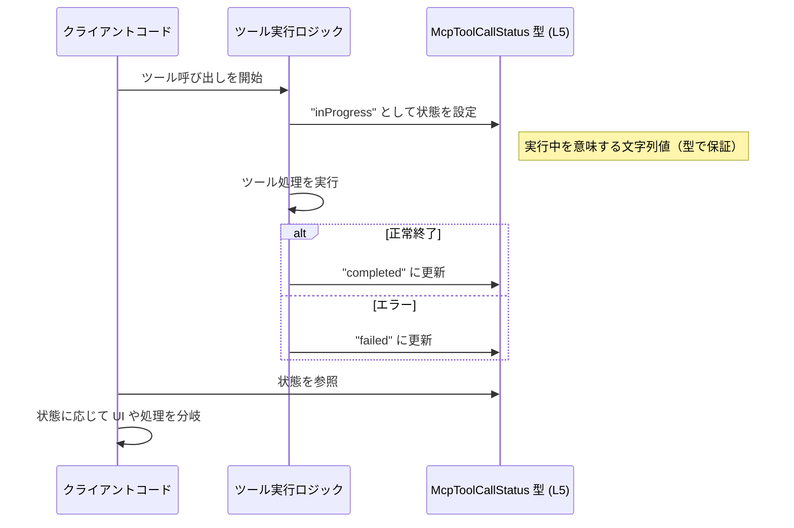

# app-server-protocol\schema\typescript\v2\McpToolCallStatus.ts

## 0. ざっくり一言

- MCP ツール呼び出しのステータスを、3 種類の文字列に限定して表現する TypeScript の型エイリアス定義です【McpToolCallStatus.ts:L5-5】。
- Rust 側の型から ts-rs によって自動生成されたスキーマの一部です【McpToolCallStatus.ts:L1-3】。

---

## 1. このモジュールの役割

### 1.1 概要

- このモジュールは、MCP ツール呼び出しの状態を `"inProgress"`, `"completed"`, `"failed"` のいずれかに限定して表現するための型 `McpToolCallStatus` を提供します【McpToolCallStatus.ts:L5-5】。
- コメントにより、ts-rs による自動生成ファイルであり、手作業による編集を想定していないことが明示されています【McpToolCallStatus.ts:L1-3】。

### 1.2 アーキテクチャ内での位置づけ

- ディレクトリ `app-server-protocol/schema/typescript/v2` から、このファイルは「アプリケーションサーバプロトコル」の TypeScript 向けスキーマ定義群の一部と位置づけられます（パス情報からの判断）。
- コメントに ts-rs の URL が記載されており【McpToolCallStatus.ts:L3-3】、Rust 側の型定義から本ファイルが生成されていることが分かります。
- このチャンクには `McpToolCallStatus` を利用する他モジュールは現れません。利用側コードは不明です。

アーキテクチャ上の流れを概念的に図示します（Rust 側や利用コードはこのチャンクには含まれません）。


### 1.3 設計上のポイント

- **自動生成コード**  
  - 冒頭コメントで「GENERATED CODE! DO NOT MODIFY BY HAND!」と明示されています【McpToolCallStatus.ts:L1-1】。
  - ts-rs が生成しており、手動編集を禁止するコメントがあります【McpToolCallStatus.ts:L3-3】。
- **純粋な型定義のみ**  
  - 実行時の処理や状態は一切持たず、`export type` による型エイリアスのみを提供しています【McpToolCallStatus.ts:L5-5】。
- **閉じたステータス集合**  
  - 許容される値を固定の 3 文字列に限定する「列挙的な文字列リテラルのユニオン型」として設計されています【McpToolCallStatus.ts:L5-5】。
- **TypeScript 特有の安全性**  
  - コンパイル時に、これ以外の文字列や `null` / `undefined` を代入すると型エラーになります（実行時チェックは別途必要）。

---

## 2. 主要な機能一覧

このファイルが提供する機能は 1 つです。

- `McpToolCallStatus`: MCP ツール呼び出しの状態を `"inProgress" | "completed" | "failed"` のいずれかで表すための文字列リテラル型エイリアス【McpToolCallStatus.ts:L5-5】。

---

## 3. 公開 API と詳細解説

### 3.1 型一覧（構造体・列挙体など）

| 名前                | 種別        | 役割 / 用途                                                                 | 定義位置                          |
|---------------------|-------------|-----------------------------------------------------------------------------|-----------------------------------|
| `McpToolCallStatus` | 型エイリアス | MCP ツール呼び出しの状態を 3 種類の文字列のいずれかに限定する列挙的な型     | `McpToolCallStatus.ts:L5-5` |

#### `McpToolCallStatus`

**概要**

- TypeScript の文字列リテラルのユニオン型であり、MCP ツール呼び出しステータスを `"inProgress"`, `"completed"`, `"failed"` のいずれかに限定します【McpToolCallStatus.ts:L5-5】。

**定義**

```typescript
export type McpToolCallStatus = "inProgress" | "completed" | "failed";
```

**意味**

- `"inProgress"`: ツール呼び出しが進行中であることを表すと解釈できます（名前からの推測。コードから厳密な意味付けは読み取れません）。
- `"completed"`: ツール呼び出しが正常に完了した状態を表すと解釈できます（同上）。
- `"failed"`: ツール呼び出しが失敗した状態を表すと解釈できます（同上）。

**TypeScript における安全性**

- この型が付けられた変数には、上記 3 つ以外の文字列を代入するとコンパイルエラーになります【McpToolCallStatus.ts:L5-5】。
- `null` や `undefined` も型として含まれていないため、そのまま代入するとコンパイルエラーになります（ただし、`any` からの代入などで実行時に不正値が入り得る点には注意が必要です）。

### 3.2 関数詳細（最大 7 件）

- このファイルには関数・メソッドは一切定義されていません【McpToolCallStatus.ts:L1-5】。
- したがって、関数に対する詳細テンプレートの適用対象はありません。

### 3.3 その他の関数

- 補助関数やラッパー関数も定義されていません【McpToolCallStatus.ts:L1-5】。

---

## 4. データフロー

このファイル自体には実行時ロジックが含まれないため、純粋な「データの型」として利用されます。想定される典型的な利用フローは次のようになります（利用コードはこのチャンクには現れていません）。

1. ツール呼び出し開始時に、状態を `"inProgress"` として扱う。
2. ツール実行の結果に応じて、状態を `"completed"` または `"failed"` に更新する。
3. 呼び出し元や UI は `McpToolCallStatus` 型に基づいて表示や分岐処理を行う。

これを簡易なシーケンス図として示します（`Client` や `ToolRunner` はこのチャンクには存在しません）。



※ 上記は型名と文字列リテラルから構成した典型例であり、実際の利用方法はこのチャンクからは確定できません。

---

## 5. 使い方（How to Use）

### 5.1 基本的な使用方法

`McpToolCallStatus` を変数やフィールドの型として使うことで、ステータス文字列を 3 種類に限定できます【McpToolCallStatus.ts:L5-5】。

```typescript
// McpToolCallStatus 型をインポートする例（同一ディレクトリ想定のパス）
// 実際のインポートパスはビルド設定に依存し、このチャンクからは確定できません。
import type { McpToolCallStatus } from "./McpToolCallStatus";

// ツール呼び出しの状態を表す変数に型を付ける
let status: McpToolCallStatus;               // status には 3 種類の文字列のみ代入可能

status = "inProgress";                       // OK
status = "completed";                        // OK
status = "failed";                           // OK

// status = "running";                       // コンパイルエラー: "running" は型に含まれていない
// status = "done";                          // コンパイルエラー
```

このように、TypeScript の静的型チェックによって、誤ったステータス文字列の利用がコンパイル時に防止されます。

### 5.2 よくある使用パターン

#### パターン1: インターフェースのフィールドとして利用

ツール呼び出し結果を表すオブジェクトに、`McpToolCallStatus` を組み込むパターンです。

```typescript
import type { McpToolCallStatus } from "./McpToolCallStatus";

// ツール呼び出しを表現するインターフェース
interface McpToolCall {                      // ツール呼び出し全体を表現する型
    id: string;                              // 識別子
    status: McpToolCallStatus;              // 状態: 3 種類に限定
    // 他のフィールド（開始時刻など）はこのチャンクからは不明
}

// ステータスに応じて処理を分岐する関数の例
function handleCall(call: McpToolCall) {    // call.status の型が安全に限定される
    switch (call.status) {
        case "inProgress":
            // 実行中の処理
            break;
        case "completed":
            // 完了時の処理
            break;
        case "failed":
            // 失敗時の処理
            break;
        // default:                         // ここには到達しない想定（型が 3 ケースに限定されるため）
    }
}
```

#### パターン2: 受信データの型付け（実行時チェック併用）

外部から受信した JSON などに対して、実行時チェックで値を確認しつつ `McpToolCallStatus` として扱うパターンです。

```typescript
import type { McpToolCallStatus } from "./McpToolCallStatus";

// 実行時にステータスが妥当かどうかを確認する型ガード関数
function isMcpToolCallStatus(value: unknown): value is McpToolCallStatus {
    return value === "inProgress"
        || value === "completed"
        || value === "failed";
}

// 受信データの例
const payload: any = JSON.parse('{}');      // 受信データ（実際の構造はここからは不明）

if (isMcpToolCallStatus(payload.status)) {  // 実行時チェック
    const status: McpToolCallStatus = payload.status; // 型レベルでも安全
    // status に基づいた処理…
} else {
    // 不正なステータス値が来た場合のエラーハンドリング
}
```

このように、型定義自体は実行時チェックを行いませんが、型ガードと組み合わせることで安全性を高めることができます。

### 5.3 よくある間違い

#### 間違い例1: 単なる `string` 型で扱ってしまう

```typescript
// 間違い例: string 型のまま扱っている
let status: string;                          // どんな文字列でも入ってしまう

status = "running";                          // コンパイル上は許されてしまう
status = "completed";                        // 想定どおりの値も混在
```

```typescript
// 正しい例: McpToolCallStatus を使って値を絞り込む
import type { McpToolCallStatus } from "./McpToolCallStatus";

let status: McpToolCallStatus;

status = "completed";                        // OK
// status = "running";                       // コンパイルエラー
```

#### 間違い例2: `any` や `as` で無理に型を合わせる

```typescript
// 間違い例: any からの代入で型安全性を失う
declare const rawStatus: any;

const status: McpToolCallStatus = rawStatus; // コンパイルは通るが、実行時は任意の文字列が入る危険がある
```

```typescript
// 正しい例: 実行時にチェックしてから代入する
declare const rawStatus: any;

function isMcpToolCallStatus(value: unknown): value is McpToolCallStatus {
    return value === "inProgress"
        || value === "completed"
        || value === "failed";
}

if (isMcpToolCallStatus(rawStatus)) {
    const status: McpToolCallStatus = rawStatus; // 型・実行時ともに安全
} else {
    // エラーハンドリング
}
```

### 5.4 使用上の注意点（まとめ）

- **自動生成コードを直接変更しないこと**  
  - コメントに「GENERATED CODE! DO NOT MODIFY BY HAND!」とあるため【McpToolCallStatus.ts:L1-1】、このファイルの直接編集は避けるべきです。
- **実行時バリデーションは別途必要**  
  - `McpToolCallStatus` はコンパイル時の型定義のみであり、実行時の値チェックは行いません【McpToolCallStatus.ts:L5-5】。
  - 外部入力を扱う場合などは、前述のような型ガード関数で値を検証する必要があります。
- **`null` / `undefined` は含まれない**  
  - 型定義上、`null` や `undefined` は `McpToolCallStatus` に含まれません【McpToolCallStatus.ts:L5-5】。必要であれば `McpToolCallStatus | null` のような拡張型を別途定義して利用する必要があります。
- **並行性に関する注意点**  
  - このファイル自体は純粋な型定義であり、スレッドやイベントループなど並行性に関する挙動は持ちません。並行処理時の整合性は利用側のロジックに依存します。

---

## 6. 変更の仕方（How to Modify）

### 6.1 新しい機能を追加する場合

このファイルは ts-rs による自動生成であり、冒頭コメントで「Do not edit this file manually」と明記されています【McpToolCallStatus.ts:L1-3】。そのため、直接このファイルにコードを追加することは想定されていません。

一般的な ts-rs の利用形態に基づき、変更が必要な場合の方針は次のようになります（対応する Rust コードや設定はこのチャンクには現れません）。

1. **対応する Rust 側の型定義を特定する**  
   - ts-rs は Rust の型から TypeScript 定義を生成するツールであるため、元となる Rust 型がどこかに存在すると考えられます【McpToolCallStatus.ts:L3-3】。
2. **Rust 側に新しい状態を追加する**  
   - 例として、新たなステータス `"cancelled"` を追加したい場合、Rust 側の enum 等に相当するバリアントを追加するのが通常の手順です（具体的な Rust の構造やファイル位置は不明）。
3. **ts-rs のコード生成を再実行する**  
   - Rust 側を変更した後、ts-rs を再実行して TypeScript 側のコードを再生成します。
4. **生成結果を確認し、利用側コードを調整する**  
   - `McpToolCallStatus` に新しい文字列リテラルが追加されるため、それを利用する TypeScript コードも必要に応じて修正します。

### 6.2 既存の機能を変更する場合

既存の 3 種類のステータスの変更（名称変更や削除）についても、同様に自動生成元となる Rust 側の定義とコード生成プロセスを通じて行う必要があります。

変更時に注意すべき点:

- **互換性の影響**  
  - 文字列リテラル名が変わると、既存の TypeScript コードで使用している値がコンパイルエラーになる可能性があります。
- **契約の明確化**  
  - `McpToolCallStatus` の許容値は他のコンポーネントとの「契約」に相当します。値の追加・削除はプロトコル仕様変更となるため、利用側との整合性確認が必要です。
- **テストの更新**  
  - このファイルにテストコードは含まれていませんが【McpToolCallStatus.ts:L1-5】、利用側のテスト（ユニットテスト・統合テストなど）でステータス値が前提になっている箇所を更新する必要があります。

---

## 7. 関連ファイル

このチャンクから直接参照できる関連ファイルはありませんが、コメントやパスから推測される関連要素を整理します。

| パス / 要素                                | 役割 / 関係                                                                 |
|-------------------------------------------|-----------------------------------------------------------------------------|
| Rust 側の対応する型定義ファイル（不明）   | ts-rs による生成元。`McpToolCallStatus` に対応する Rust 型が定義されていると考えられます【McpToolCallStatus.ts:L3-3】。 |
| ts-rs の設定ファイル（不明）              | どの Rust 型からどの TypeScript ファイルを生成するかを制御している可能性があります（一般的な ts-rs の利用形態からの推測）。 |
| `app-server-protocol/schema/typescript/v2` 配下の他ファイル（不明） | 同じプロトコルスキーマの他の型定義が存在すると考えられますが、このチャンクには現れません。 |
| `McpToolCallStatus` をインポートしているアプリケーションコード（不明） | ステータスに基づいて処理や UI を分岐する利用側コードですが、このチャンクには含まれません。 |

---

### Bugs / Security / Edge Cases に関する補足

- **バグの可能性**  
  - このファイルは単一の型定義のみであり、実行時振る舞いがないため、ロジック上のバグは存在しません【McpToolCallStatus.ts:L5-5】。
- **セキュリティ面**  
  - 型定義自体はセキュリティリスクを直接は持ちませんが、外部入力のステータスを適切に検証しない場合、想定外の文字列に基づく処理（例: ログ汚染や誤った画面表示）が起こりうるため、利用側での実行時チェックが重要です。
- **エッジケース（契約）**  
  - `McpToolCallStatus` は `"inProgress" | "completed" | "failed"` のみを許容し、それ以外、ならびに `null` / `undefined` は契約違反となる型です【McpToolCallStatus.ts:L5-5】。
  - この契約が守られていることはコンパイル時には保証されますが、`any` や外部入力を経由すると破られる可能性があるため、型ガードやバリデーションが推奨されます。
