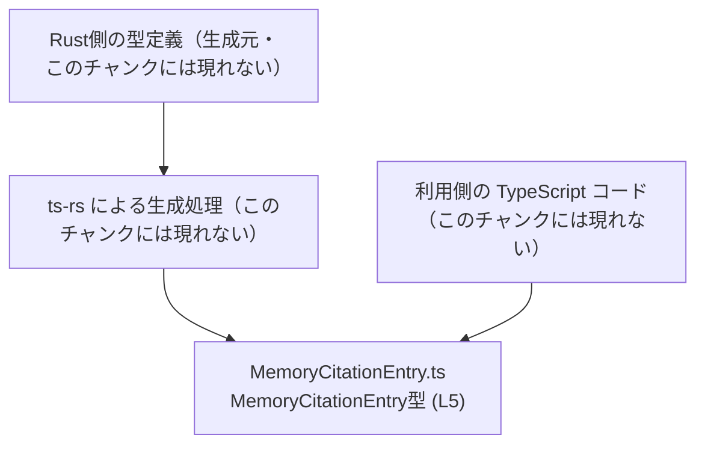
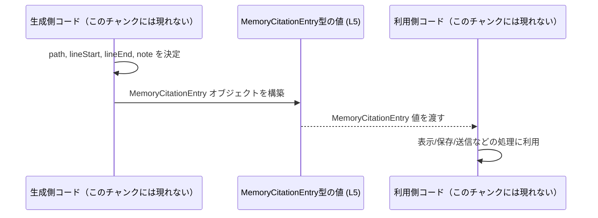

# app-server-protocol\schema\typescript\v2\MemoryCitationEntry.ts

## 0. ざっくり一言

Rust から `ts-rs` によって自動生成された、メモリ上の「引用情報」を表す TypeScript の型エイリアスを 1 つだけ定義しているファイルです（`MemoryCitationEntry.ts:L1-5`）。

---

## 1. このモジュールの役割

### 1.1 概要

- このモジュールは、自動生成された型 `MemoryCitationEntry` を通じて、ある範囲の「位置情報」とメモ文字列をまとめて扱うためのデータ構造を提供します（`MemoryCitationEntry.ts:L1-5`）。
- 型としての役割のみを持ち、関数やロジックは一切含まれていません（`MemoryCitationEntry.ts:L5-5`）。

### 1.2 アーキテクチャ内での位置づけ

このファイル自身は、以下のような立ち位置になっています。

- 入力: なし（このファイル内でデータを生成する処理はありません）。
- 出力: `export type MemoryCitationEntry = { ... }` として、他の TypeScript コードからインポートして利用されることを想定しています（`MemoryCitationEntry.ts:L5-5`）。
- コメントより、この型定義は `ts-rs` による自動生成物であり、Rust 側の定義と対応していると解釈できます（`MemoryCitationEntry.ts:L1-3`）。

概念的な依存関係を Mermaid で表すと、次のようになります（利用側コードは抽象的な概念であり、このチャンクには現れません）。



### 1.3 設計上のポイント

コードから読み取れる特徴は次のとおりです。

- 自動生成コードであり、手動での編集を禁止しています（`// GENERATED CODE! DO NOT MODIFY BY HAND!` コメント, `MemoryCitationEntry.ts:L1-3`）。
- 単一の型エイリアス `MemoryCitationEntry` のみを公開し、関数やクラスなどのロジックを一切持ちません（`MemoryCitationEntry.ts:L5-5`）。
- `MemoryCitationEntry` は以下の 4 つの必須プロパティを持つオブジェクト型として定義されています（`MemoryCitationEntry.ts:L5-5`）。
  - `path: string`
  - `lineStart: number`
  - `lineEnd: number`
  - `note: string`
- いずれのプロパティもオプショナル（`?`）ではなく、常に存在することが型レベルで要求されます（`MemoryCitationEntry.ts:L5-5`）。

---

## 2. 主要な機能一覧

このファイルには実行時の「機能」に相当する処理はありませんが、型として次のような用途を持つと解釈できます（フィールド名に基づく解釈であり、このチャンクには追加の説明はありません）。

- `MemoryCitationEntry` 型:
  - `path`: 何らかのリソース（多くの場合はファイル）を指すパス文字列を保持する（`MemoryCitationEntry.ts:L5-5`）。
  - `lineStart`: 範囲の開始位置を表す数値を保持する（`MemoryCitationEntry.ts:L5-5`）。
  - `lineEnd`: 範囲の終了位置を表す数値を保持する（`MemoryCitationEntry.ts:L5-5`）。
  - `note`: 範囲に対するメモや説明文と思われる文字列を保持する（`MemoryCitationEntry.ts:L5-5`）。

※ 上記の意味付けはプロパティ名からの自然な解釈であり、厳密な仕様はこのチャンクからは分かりません。

---

## 3. 公開 API と詳細解説

### 3.1 型一覧（構造体・列挙体など）

このファイルで公開されている主要な型は 1 つです。

| 名前                  | 種別       | 役割 / 用途（解釈）                                                                                                                                 | 根拠 |
|-----------------------|------------|----------------------------------------------------------------------------------------------------------------------------------------------------|------|
| `MemoryCitationEntry` | 型エイリアス（オブジェクト型） | 4 つのプロパティ `path`, `lineStart`, `lineEnd`, `note` をまとめて扱うためのデータ構造。メモリ上の「引用」や「位置付きノート」を表す用途が想定されます。 | `MemoryCitationEntry.ts:L5-5` |

`MemoryCitationEntry` のフィールド構造は次のとおりです。

| フィールド名  | 型      | 必須/任意 | 説明（解釈）                                                                      | 根拠 |
|--------------|---------|-----------|-----------------------------------------------------------------------------------|------|
| `path`       | string  | 必須      | 何らかのリソースのパスを表す文字列                                               | `MemoryCitationEntry.ts:L5-5` |
| `lineStart`  | number  | 必須      | 範囲の開始行など、開始位置を表す数値                                             | `MemoryCitationEntry.ts:L5-5` |
| `lineEnd`    | number  | 必須      | 範囲の終了行など、終了位置を表す数値                                             | `MemoryCitationEntry.ts:L5-5` |
| `note`       | string  | 必須      | 位置に対する説明・コメントなどの任意の文字列                                     | `MemoryCitationEntry.ts:L5-5` |

### 3.2 関数詳細（最大 7 件）

このファイルには関数・メソッドは定義されていません（`MemoryCitationEntry.ts:L1-5`）。

そのため、関数詳細テンプレートに沿って記述すべき対象はありません。

### 3.3 その他の関数

同様に、補助的な関数やラッパー関数も定義されていません（`MemoryCitationEntry.ts:L1-5`）。

---

## 4. データフロー

このファイルには、`MemoryCitationEntry` 型の値を生成したり処理したりするロジックは含まれていませんが、「型がどのように使われるか」を抽象的なデータフローとして示すことはできます。

想定される代表的な流れ:

1. ある処理が、`path`, `lineStart`, `lineEnd`, `note` に対応する値を計算・取得する（このチャンクには現れないロジック）。
2. それらをまとめて `MemoryCitationEntry` 型のオブジェクトとして構築する。
3. 別の処理や API が `MemoryCitationEntry` 型のオブジェクト（あるいはその配列）を受け取り、表示・保存・送信などを行う。

この抽象的な流れを sequence diagram で表します。



※ ここで「生成側コード」「利用側コード」は、このチャンクには定義されていない抽象的なコンポーネントです。

---

## 5. 使い方（How to Use）

### 5.1 基本的な使用方法

`MemoryCitationEntry` 型を利用する側のコードから見た、最も基本的な使い方の例です。

```typescript
// MemoryCitationEntry 型をインポートする                                  // 実際のパスはビルド構成に合わせて調整が必要
import type { MemoryCitationEntry } from "./MemoryCitationEntry";

// 1つの引用情報を表すオブジェクトを構築する                               // MemoryCitationEntry 型を明示
const citation: MemoryCitationEntry = {
    path: "/path/to/file.txt",                                           // 参照元のパス（文字列）
    lineStart: 10,                                                       // 開始行（数値）
    lineEnd: 20,                                                         // 終了行（数値）
    note: "この範囲は重要なポイントを含む",                                // ノートや説明（文字列）
};

// 関数の引数として受け取る例                                              // 呼び出し側に MemoryCitationEntry を要求する
function handleCitation(entry: MemoryCitationEntry) {
    console.log(entry.path, entry.lineStart, entry.lineEnd, entry.note); // プロパティを参照して処理を行う
}

handleCitation(citation);                                                // 作成したオブジェクトを渡して利用
```

この例から分かるポイント:

- 4 つすべてのプロパティが必須であり、欠けているとコンパイルエラーになります（`MemoryCitationEntry.ts:L5-5`）。
- プロパティの型が一致しない場合（例: `lineStart` に文字列を渡すなど）もコンパイル時にエラーになります。

### 5.2 よくある使用パターン

#### 複数の引用情報を配列で扱う

```typescript
import type { MemoryCitationEntry } from "./MemoryCitationEntry";

// 複数の引用情報を配列で保持する                                          // MemoryCitationEntry 型の配列
const citations: MemoryCitationEntry[] = [
    {
        path: "/docs/guide.md",
        lineStart: 5,
        lineEnd: 15,
        note: "イントロダクション部分",
    },
    {
        path: "/docs/guide.md",
        lineStart: 30,
        lineEnd: 40,
        note: "詳細な説明",
    },
];

// 配列を受け取って一覧処理する関数
function printCitations(items: MemoryCitationEntry[]) {
    for (const item of items) {
        console.log(`${item.path}:${item.lineStart}-${item.lineEnd} ${item.note}`);
    }
}

printCitations(citations);
```

#### 型エイリアスを利用した他の型との組み合わせ

```typescript
import type { MemoryCitationEntry } from "./MemoryCitationEntry";

// 他の結果オブジェクトの一部として埋め込む                               // 例: 検索結果の中に citations を含める
type SearchResult = {
    query: string;                                                       // 検索クエリ
    citations: MemoryCitationEntry[];                                    // 関連する引用情報の配列
};
```

### 5.3 よくある間違い

#### 必須プロパティの欠落

```typescript
import type { MemoryCitationEntry } from "./MemoryCitationEntry";

const badCitation: MemoryCitationEntry = {
    path: "/path/to/file.txt",
    lineStart: 10,
    // lineEnd が欠けている                                                 // コンパイルエラーになる
    note: "不完全な例",
};
```

#### 型の不一致

```typescript
import type { MemoryCitationEntry } from "./MemoryCitationEntry";

const badCitation2: MemoryCitationEntry = {
    path: "/path/to/file.txt",
    lineStart: "10",         // string を渡してしまっている                 // number 型が要求されるためエラー
    lineEnd: 20,
    note: "型不一致の例",
};
```

### 5.4 使用上の注意点（まとめ）

- **すべてのプロパティは必須**  
  - `path`, `lineStart`, `lineEnd`, `note` は省略できません（`MemoryCitationEntry.ts:L5-5`）。
- **値の妥当性は型だけでは保証されない**  
  - `lineStart` と `lineEnd` が負の値でないこと、`lineStart <= lineEnd` であることなどは、この型定義には書かれていません（`MemoryCitationEntry.ts:L5-5`）。このような制約は利用側のロジックでチェックする必要があります。
- **文字列内容の安全性は別途考慮が必要**  
  - `note` には任意の文字列を入れられるため、HTML に直接埋め込むような場合は、エスケープなどの対策を別途行う必要があります。この型自体はそうしたセキュリティ対策を提供しません。
- **実行時オーバーヘッドはない**  
  - TypeScript の型エイリアスはコンパイル後には消えるため、`MemoryCitationEntry` を定義しても、単独では実行時コストは増えません（一般的な TypeScript の性質）。

---

## 6. 変更の仕方（How to Modify）

### 6.1 新しい機能を追加する場合

このファイルはコメントにある通り **自動生成コード** であり、手書きでの編集を禁止しています（`MemoryCitationEntry.ts:L1-3`）。

- 新しいフィールドを `MemoryCitationEntry` に追加したい場合でも、**このファイルを直接編集すべきではありません**。
- 一般的には、`ts-rs` の生成元となる Rust 側の型定義や設定を変更し、そこから再生成する形になります。  
  - ただし、このチャンクには対応する Rust ファイル名や生成手順は記載されていないため、具体的な場所・コマンドは不明です（`MemoryCitationEntry.ts:L1-3` からは読み取れません）。

変更の大まかな手順（概念レベル）:

1. Rust 側の対応する構造体または型定義を特定する（このチャンクからは不明）。
2. その定義にフィールド追加や型変更を行う。
3. `ts-rs` を用いて TypeScript 定義を再生成する。
4. 生成された `MemoryCitationEntry.ts` が新しい構造を反映していることを確認する。

### 6.2 既存の機能を変更する場合

既存のフィールド名や型を変更したい場合も同様です。

- 直接このファイルを書き換えると、次回の自動生成で上書きされ、変更が失われます（`MemoryCitationEntry.ts:L1-3` より、自動生成物であることが明示されているため）。
- 変更の影響範囲としては、`MemoryCitationEntry` を利用しているすべての TypeScript コードが型エラーを起こす可能性があります。  
  - ただし、このチャンクには利用箇所に関する情報がないため、具体的な影響範囲は分かりません。

変更時に注意すべき点（契約的な観点）:

- `path` や `note` の型を `string` 以外に変えると、既存コードで文字列を前提にしている部分が壊れます（`MemoryCitationEntry.ts:L5-5`）。
- `lineStart` / `lineEnd` を別の型（例えば `string`）に変えると、数値としての比較や計算を行っているコードが壊れます（`MemoryCitationEntry.ts:L5-5`）。
- これらはすべてコンパイルエラーとして顕在化するため、変更後は型エラーが解消されるまで関連コードを修正する必要があります。

---

## 7. 関連ファイル

このチャンクから確実に言える関連情報は限られていますが、少なくとも次のようなファイル・コンポーネントが存在することが示唆されます。

| パス / コンポーネント         | 役割 / 関係 |
|------------------------------|------------|
| （Rust 側の型定義ファイル）  | `ts-rs` による生成元となる Rust の型。`MemoryCitationEntry` と同じ構造を持つと考えられますが、具体的なファイル名・モジュール名はこのチャンクには現れません（`MemoryCitationEntry.ts:L3-3`）。 |
| `MemoryCitationEntry.ts`     | 本レポート対象。`MemoryCitationEntry` 型エイリアスの定義を提供し、他の TypeScript コードからインポートされる公開 API となります（`MemoryCitationEntry.ts:L5-5`）。 |
| 利用側の TypeScript ファイル | `import type { MemoryCitationEntry } from "...";` のようにして、この型を参照するコード。具体的なファイルはこのチャンクには現れません。 |

テストコードや補助ユーティリティなど、この型に依存する周辺コードについては、このチャンクには一切現れていないため、詳細は不明です。
