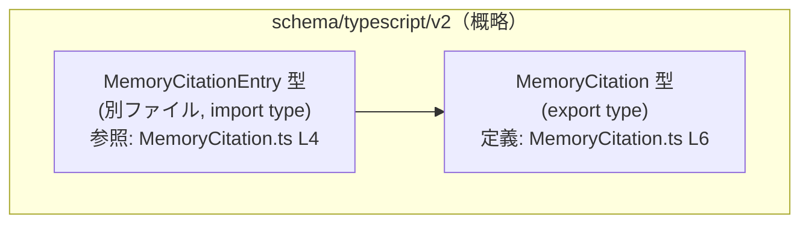
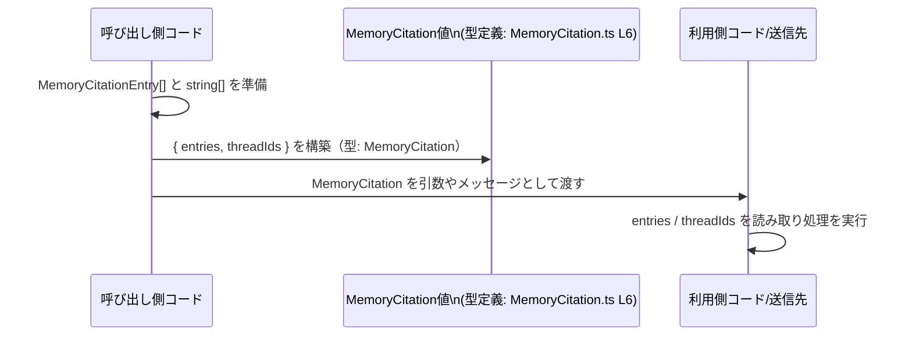

app-server-protocol/schema/typescript/v2/MemoryCitation.ts

---

## 0. ざっくり一言

`MemoryCitation` という TypeScript の型エイリアスを定義し、`MemoryCitationEntry` の配列とスレッド ID の配列を 1 つのオブジェクトとして扱うための「データコンテナ型」を提供する生成コードです（MemoryCitation.ts:L1-3, L4-6）。

---

## 1. このモジュールの役割

### 1.1 概要

- このモジュールは、Rust 側の型を TypeScript に出力するツール `ts-rs` によって生成されたファイルです（MemoryCitation.ts:L1-3）。
- 公開 API として `MemoryCitation` 型をエクスポートし、`entries: MemoryCitationEntry[]` と `threadIds: string[]` を持つオブジェクトの形を静的に保証します（MemoryCitation.ts:L4-6）。
- 実行時ロジックや関数は含まず、静的型情報のみを提供します（MemoryCitation.ts:L1-6）。

### 1.2 アーキテクチャ内での位置づけ

このファイルは TypeScript で書かれたスキーマ定義群の中で、「`MemoryCitation` 型を定義するモジュール」として位置づけられます。唯一の依存先は `MemoryCitationEntry` 型です（MemoryCitation.ts:L4-4）。



※ この図は、本チャンクに現れる依存関係のみを示しています。

### 1.3 設計上のポイント

- **生成コードであること**  
  - 冒頭コメントに「GENERATED CODE! DO NOT MODIFY BY HAND!」「ts-rs によって生成」と明記されています（MemoryCitation.ts:L1-3）。
- **型専用インポート**  
  - `import type { MemoryCitationEntry } from "./MemoryCitationEntry";` により、型情報のみをインポートしています（MemoryCitation.ts:L4-4）。  
    これは TypeScript の構文で、コンパイル後に実行時コードを生成しない形式です。
- **シンプルなオブジェクト型エイリアス**  
  - `export type MemoryCitation = { ... }` という形で、2 つの配列プロパティを持つオブジェクト型に名前を付けています（MemoryCitation.ts:L6-6）。
- **エラー処理・並行性の要素はなし**  
  - 関数・クラス・状態管理は一切含まれておらず、エラー処理や並行性に関するロジックは存在しません（MemoryCitation.ts:L1-6）。

---

## 2. 主要な機能一覧

このファイルが提供する「機能」はすべて型定義レベルです。

- `MemoryCitation` 型:  
  - `entries: MemoryCitationEntry[]` と `threadIds: string[]` をまとめたオブジェクトの形を定義します（MemoryCitation.ts:L6-6）。

---

## 3. 公開 API と詳細解説

### 3.1 型一覧（構造体・列挙体など）

| 名前               | 種別         | 位置                          | 役割 / 用途                                                                 | 根拠                    |
|--------------------|--------------|-------------------------------|------------------------------------------------------------------------------|-------------------------|
| `MemoryCitation`   | 型エイリアス | MemoryCitation.ts:L6-6        | `entries` と `threadIds` を持つオブジェクトの型。公開 API として利用される。 | `export type ...`       |
| `MemoryCitationEntry` | 型（依存先） | MemoryCitation.ts:L4-4（import） | `entries` 配列の要素型。詳細は別ファイルで定義されており、このチャンクからは不明。 | `import type { ... }`   |

#### `MemoryCitation` の構造

`MemoryCitation` は次のような形のオブジェクト型です（MemoryCitation.ts:L6-6）。

```typescript
export type MemoryCitation = {
    entries: Array<MemoryCitationEntry>; // MemoryCitationEntry 型の配列
    threadIds: Array<string>;            // スレッド ID を表す文字列の配列
};
```

- 2 つのプロパティはいずれも **必須** であり、オプショナル（`?`）ではありません（MemoryCitation.ts:L6-6）。
- 配列要素数についての制約（空禁止・長さ一致など）は型としては表現されておらず、このチャンクからは読み取れません。

### 3.2 関数詳細（該当なし）

- このファイルには関数・メソッドは一切定義されていません（MemoryCitation.ts:L1-6）。
- そのため、関数詳細テンプレートに基づいて説明できる対象はありません。

### 3.3 その他の関数

- 補助関数やラッパー関数も定義されていません（MemoryCitation.ts:L1-6）。

---

## 4. データフロー

このファイル自体には処理ロジックはなく、`MemoryCitation` は他のコードから利用される「データの器」です。ここでは、一般的に想定される利用フローの一例を示します（**あくまで利用イメージであり、本チャンクのコードに直接は現れません**）。

### 4.1 典型的な利用フローのイメージ

1. 呼び出し側コードが `MemoryCitationEntry[]` と `string[]`（threadIds）を準備する。
2. それらを使って `MemoryCitation` 型に適合するオブジェクトを構築する。
3. 構築した `MemoryCitation` を、他の関数や API 呼び出しの引数として渡す。
4. 受け手側は `entries` / `threadIds` を読み取り、必要な処理を行う。



---

## 5. 使い方（How to Use）

### 5.1 基本的な使用方法

`MemoryCitation` 型の値を生成し、フィールドにアクセスする基本例です。`MemoryCitationEntry` の中身はこのチャンクから分からないため、型名だけを用いています。

```typescript
// 型定義をインポートする（実行時コードを生成しない type import）
import type { MemoryCitation } from "./MemoryCitation";           // MemoryCitation.ts:L6-6 に対応

// どこかで MemoryCitationEntry[] が用意されていると仮定する
declare const entries: Array<MemoryCitationEntry>;                // 実際の定義は別ファイル

// MemoryCitation 型に適合するオブジェクトを作成する
const citation: MemoryCitation = {                                // 型アノテーションにより形がチェックされる
    entries,                                                      // MemoryCitationEntry[] 型である必要がある
    threadIds: ["thread-1", "thread-2"],                          // string[] 型である必要がある
};

// entries を走査する
for (const entry of citation.entries) {                           // entry の型は MemoryCitationEntry と推論される
    // entry を使った処理を書く
}

// threadIds を利用する
for (const id of citation.threadIds) {                            // id は string と推論される
    console.log(`thread id: ${id}`);
}
```

- TypeScript の型チェックにより、`entries` に誤った型（例: `string[]`）を代入するとコンパイルエラーになります。
- 実行時には型情報は消えるため、受け取る側が適切なバリデーションを行うかどうかは、このファイルからは分かりません。

### 5.2 よくある使用パターン（例）

1. **関数の引数として利用する**

```typescript
import type { MemoryCitation } from "./MemoryCitation";

// MemoryCitation を受け取って何らかの処理をする関数の例
function handleCitation(citation: MemoryCitation) {               // 引数に型を付ける
    console.log(citation.threadIds.length);                       // string[] なので length が使える
    // citation.entries から必要な情報を取り出す処理を書く
}
```

1. **API レスポンス／リクエストの型として利用する**

```typescript
import type { MemoryCitation } from "./MemoryCitation";

// 例: fetch のラッパーなどで JSON レスポンスを MemoryCitation として扱う
async function fetchCitation(): Promise<MemoryCitation> {
    const res = await fetch("/api/citation");                     // 実際の URL や仕様はこのチャンクには現れない
    const json = await res.json();
    // ここで json が MemoryCitation と互換であることは静的には保証されないので、
    // 実運用ではランタイムバリデーションを挟むことが望ましい
    return json as MemoryCitation;                                // 型アサーションの例（安全性には注意）
}
```

※ 上記はあくまで利用例であり、実際のプロジェクト内での使われ方はこのチャンクからは分かりません。

### 5.3 よくある間違い

#### 1) プロパティの書き忘れ

```typescript
import type { MemoryCitation } from "./MemoryCitation";

// ❌ 間違い例: threadIds を指定していない
const badCitation: MemoryCitation = {
    entries: [],                                                  // threadIds が無いためコンパイルエラー
    // プロパティ 'threadIds' が型 'MemoryCitation' に必要
};
```

#### 2) プロパティの型が違う

```typescript
import type { MemoryCitation } from "./MemoryCitation";

// ❌ 間違い例: entries に string[] を入れてしまう
const badCitation2: MemoryCitation = {
    entries: ["not-an-entry"],                                    // MemoryCitationEntry[] ではないのでエラー
    threadIds: ["thread-1"],
};
```

TypeScript の静的型チェックにより、上記のような誤用はコンパイル時に検出されます。  
一方で、`any` や `as` による型アサーションを多用すると、この安全性が損なわれる可能性があります。

### 5.4 使用上の注意点（まとめ）

- **前提条件（契約）**
  - `entries` は `MemoryCitationEntry` 型の配列である必要があります（MemoryCitation.ts:L6-6）。
  - `threadIds` は文字列の配列である必要があります（MemoryCitation.ts:L6-6）。
  - どちらも必須プロパティであり、`undefined` や欠落は許容されません（型定義上）。

- **バグ／セキュリティ上の注意**
  - このファイルは型定義のみであり、直接的なセキュリティ機能は提供しません（MemoryCitation.ts:L1-6）。
  - 外部から受け取ったデータを `MemoryCitation` に型アサートする場合、**実行時の検証がないと不正なデータが紛れ込む可能性**があります。  
    これは型レベルでは防げないため、別途ランタイムバリデーションが必要です。
  - `threadIds` に機密情報を入れるべきかどうか、制約はこのチャンクからは読み取れません。

- **エッジケース**
  - `entries: []`（空配列）は型上許容されます（MemoryCitation.ts:L6-6）。
  - `threadIds: []` も同様に許容されます。空でよいかどうかはビジネスロジック側の判断になります。
  - `entries.length` と `threadIds.length` の一致など、配列同士の関係性は型では表現されておらず、このチャンクでは不明です。

- **テスト観点**
  - このファイル自体は生成コードであり、テストコードは含まれていません（MemoryCitation.ts:L1-6）。
  - 実装側では、Rust 側の型とこの TypeScript 型の整合性を保証するテストや、シリアライズ／デシリアライズの往復テストなどが考えられますが、ここからは存在有無は分かりません。

- **性能・スケーラビリティの観点**
  - 型定義自体は実行時コストを持ちません（`import type` のため）（MemoryCitation.ts:L4-4）。
  - 実際の負荷は `entries` / `threadIds` の要素数に依存します。非常に大きな配列を扱う場合、メモリ使用量や JSON シリアライズのコストが増大しますが、それはこの型の利用側の問題になります。

- **設計上のトレードオフ**
  - シンプルなオブジェクト型エイリアスとして定義されているため、使いやすい反面、  
    「配列が空でない」「ID が一意である」といったビジネスルールは型レベルに反映されていません。
  - クラスではなくプレーンオブジェクトであるため、メソッドを持たず、振る舞いは完全に外部ロジックに委ねられます。

- **リファクタリング時の注意**
  - コメントに「Do not edit this file manually」とあるため、**直接編集してはなりません**（MemoryCitation.ts:L1-3）。
  - フィールド追加・変更が必要な場合は、生成元である Rust 側の定義（ts-rs によって変換される型）を変更し、再生成する必要があります。

- **観測性の観点**
  - ログ出力やメトリクス送信などの観測性に関連するコードは含まれていません（MemoryCitation.ts:L1-6）。
  - `MemoryCitation` 自体はデータ構造に過ぎず、「どこで」「どのように」使われているかはこのチャンクからは分かりません。

---

## 6. 変更の仕方（How to Modify）

### 6.1 新しい機能を追加する場合（フィールド追加など）

このファイルは `ts-rs` による生成物であり、コメントで手動変更禁止と明示されています（MemoryCitation.ts:L1-3）。  
そのため、通常の意味でこのファイルに直接「機能追加」することは前提とされていません。

一般的な手順（推奨される方向性）は次のようになります：

1. **生成元の Rust 型を特定する**  
   - `ts-rs` がどの Rust 型からこの型を生成しているかをリポジトリ側で確認します（このチャンクからは特定できません）。
2. **Rust 側でフィールド追加／変更を行う**  
   - 例: Rust の構造体にフィールドを追加する、型を変更するなど。
3. **`ts-rs` のコード生成を再実行する**  
   - プロジェクトのビルドや専用スクリプトを通じて TypeScript ファイルを再生成する。
4. **TypeScript 側の利用箇所を更新する**
   - 新しいフィールドを扱うコードを追加したり、削除されたフィールドへの参照を修正したりします。

### 6.2 既存の機能を変更する場合（フィールド名・型の変更など）

- **影響範囲の確認**
  - `MemoryCitation` を利用しているすべての TypeScript コード、および生成元の Rust コードに影響します。
  - 特に API の入出力に使われている場合、クライアント／サーバ双方の変更が必要になります。
- **注意すべき契約**
  - `entries` / `threadIds` の意味や必須性が暗黙の契約になっている可能性がありますが、このチャンクからは実際の契約内容は分かりません。
  - 互換性を維持したい場合は、フィールドを削除するのではなく、まず非推奨として扱うなどの段階的な移行が必要になる場合があります。
- **テスト・使用箇所の再確認**
  - 生成元の Rust 側テストと、TypeScript 側で `MemoryCitation` を利用する箇所（型注釈・シリアライズ処理など）を確認し、必要に応じて更新します。

---

## 7. 関連ファイル

このチャンクから明示的に分かる関連ファイルは次の 1 つです。

| パス / モジュール名      | 役割 / 関係                                                                                   | 根拠                       |
|--------------------------|----------------------------------------------------------------------------------------------|----------------------------|
| `./MemoryCitationEntry`  | `MemoryCitationEntry` 型をエクスポートするモジュールと推測される。`entries` の要素型として利用。 | `import type { ... }`（MemoryCitation.ts:L4-4） |

- 拡張子（`.ts` / `.d.ts` / `.js` など）はインポート文からは特定できません。
- `MemoryCitationEntry` の具体的な構造や意味は、このチャンクには現れません。

テストコードやサポートユーティリティなど、その他の関連ファイルについては、このチャンク単体からは情報が得られないため「不明」です。
