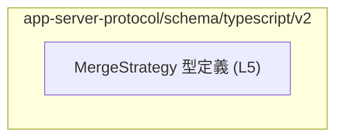
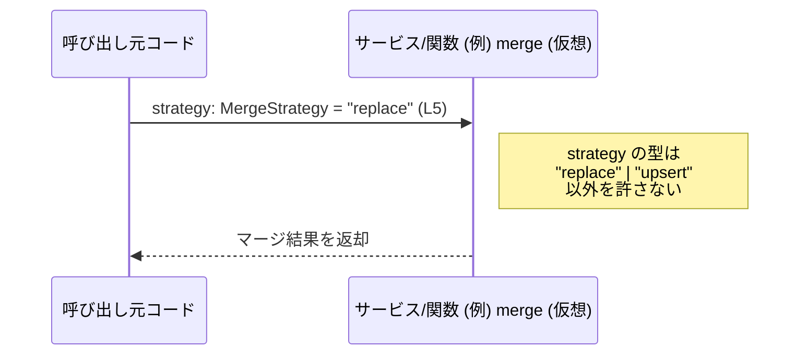

# app-server-protocol\schema\typescript\v2\MergeStrategy.ts

## 0. ざっくり一言

`MergeStrategy` という文字列リテラルのユニオン型を定義し、「マージ戦略」を `"replace"` か `"upsert"` のどちらかに限定して表現するための型定義ファイルです（`ts-rs` による自動生成）。

---

## 1. このモジュールの役割

### 1.1 概要

- このモジュールは **マージ時の戦略を表す型** を TypeScript 側に提供するために存在しています。
- 実行時のロジックは一切含まず、`MergeStrategy` 型そのものが公開 API です。
- コメントから、この型は Rust 側の型定義から [`ts-rs`](https://github.com/Aleph-Alpha/ts-rs) により自動生成されていることが分かります  
  （`MergeStrategy.ts:L1-3`）。

### 1.2 アーキテクチャ内での位置づけ

このファイルは **スキーマ定義層** に属し、他の TypeScript コードから参照される前提の「共通型定義モジュール」とみなせます。

コードから読み取れる事実としては、以下のみです。

- 依存している他モジュール: なし（import 文が存在しない）
- 外部に提供しているもの: `export type MergeStrategy = "replace" | "upsert";`  
  （`MergeStrategy.ts:L5-5`）

そのため、依存関係図は非常に単純です。



※ この図は「このモジュールが単独の型定義として存在する」ことのみを表し、  
どのモジュールがこれを利用しているかは、このチャンクからは分かりません（不明）。

### 1.3 設計上のポイント

コードから読み取れる設計上の特徴は次のとおりです。

- **自動生成コードである**
  - ファイル先頭コメントに *"GENERATED CODE! DO NOT MODIFY BY HAND!"* の記述があります  
    （`MergeStrategy.ts:L1-2`）。
  - Rust 側の元定義から `ts-rs` によって生成されていると明示されています  
    （`MergeStrategy.ts:L3-3`）。
- **文字列リテラルユニオン型による列挙**
  - `MergeStrategy` は `"replace" | "upsert"` のいずれかのみを許す文字列リテラル型です  
    （`MergeStrategy.ts:L5-5`）。
  - 任意の `string` ではなく、特定の 2 値に限定されることで、コンパイル時に型安全性が高まります。
- **実行時ロジックを持たない**
  - 関数やクラス、変数定義は存在せず、型定義のみです。
  - したがって、エラーハンドリングや並行性（非同期処理・スレッド安全性）に関するコードはありません。
- **公開 API としての役割が明確**
  - `export type` として定義されているため、この型自体が外部から直接利用されることが前提です。

---

## 2. 主要な機能一覧

このファイルには実行時機能（関数・クラス等）はありませんが、型レベルの「機能」として次の 1 点を提供します。

- `MergeStrategy` 型定義: マージ戦略を `"replace"` または `"upsert"` の 2 通りに限定する文字列リテラルユニオン型。

---

## 3. 公開 API と詳細解説

### 3.1 型一覧（構造体・列挙体など）

| 名前            | 種別                              | 役割 / 用途                                                                                  | 定義位置                              |
|-----------------|-----------------------------------|----------------------------------------------------------------------------------------------|----------------------------------------|
| `MergeStrategy` | 型エイリアス（文字列リテラル型）  | マージ処理などで使用される戦略を `"replace"` または `"upsert"` の 2 値のいずれかで表すための型 | `MergeStrategy.ts:L5-5` |

**型の定義**

```typescript
export type MergeStrategy = "replace" | "upsert";  // MergeStrategy.ts:L5
```

- この定義により、`MergeStrategy` 型の値として許されるのは `"replace"` と `"upsert"` のみになります。
- 任意の文字列を許す `string` 型よりも制限が厳しく、TypeScript のコンパイル時チェックで不正な値を防ぎます。

> 注意: `"replace"` / `"upsert"` それぞれが**具体的にどのような動作を意味するか**は、このファイルの中では説明されていません。  
> 一般的な用語としては、  
>
> - replace: 既存のデータを置き換える  
> - upsert: 存在しなければ挿入し、存在すれば更新する  
> といった意味で使われることが多いですが、**本リポジトリにおける正確な意味はこのチャンクからは不明**です。

#### 言語固有の安全性

- `MergeStrategy` は `string` よりも狭い **ユニオン型** であり、TypeScript のコンパイラが次のような誤りを検出できます。
  - `"replcae"` のようなスペルミス
  - `"delete"` など、許可されていない戦略名
- これにより、ランタイムエラーではなく **コンパイル時の型エラー** として問題を検出できます。

#### エラー / 並行性について

- このファイル自体は型定義のみであり、実行時の関数・非同期処理・共有状態を扱っていません。
- したがって、このファイルから直接読み取れるエラー処理・並行性に関する挙動はありません（不明）。

### 3.2 関数詳細（最大 7 件）

- このファイルには関数・メソッド・クラスは定義されていません。
- そのため、「関数詳細」の対象となる公開 API は存在しません。

### 3.3 その他の関数

- 補助関数やラッパー関数も定義されていません。

| 関数名 | 役割（1 行） |
|--------|--------------|
| なし   | このチャンクには関数定義が現れません |

---

## 4. データフロー

このファイルには **実行時の処理フロー** を定義するコードはありませんが、`MergeStrategy` がどのように使用されるかの典型的なイメージを示します。

> 以下の図とコード例は、**一般的な TypeScript コードにおける利用イメージ** であり、  
> このリポジトリ内に同名の関数・モジュールが存在することを示すものではありません。

### データフロー（利用イメージ）



### 要点

- 呼び出し元は `strategy: MergeStrategy` という引数に `"replace"` または `"upsert"` のいずれかを渡すことができます。
- TypeScript のコンパイラは、`strategy` に対してその他の文字列を渡した場合にコンパイルエラーを出します。
- 実際のマージ処理の実装・データの流れは、このファイルには含まれておらず不明です。

---

## 5. 使い方（How to Use）

### 5.1 基本的な使用方法

`MergeStrategy` 型を利用する典型的なコードフローの例です。

```typescript
// MergeStrategy をインポートする例（実際のパスはこのチャンクでは不明）
import type { MergeStrategy } from "./MergeStrategy";  // 仮のパス

// MergeStrategy を引数として受け取る関数の例
function mergeRecords(strategy: MergeStrategy) {        // strategy は "replace" か "upsert" のみ許可
    if (strategy === "replace") {
        // ここに「完全に置き換える」ロジックを書くことが想定される
    } else if (strategy === "upsert") {
        // ここに「無ければ挿入・あれば更新」ロジックを書くことが想定される
    }
}

// 呼び出し側
mergeRecords("replace");                                // OK: MergeStrategy に合致
mergeRecords("upsert");                                 // OK
// mergeRecords("delete");                              // コンパイルエラー: "delete" は MergeStrategy ではない
```

このように、関数やクラスの API で `MergeStrategy` を使うことで、許可される戦略名を型レベルで制約できます。

### 5.2 よくある使用パターン

1. **引数として受け取る**

   ```typescript
   function applyStrategy(strategy: MergeStrategy) {
       // strategy に応じて処理を分岐
   }
   ```

2. **設定オブジェクトのプロパティとして利用**

   ```typescript
   interface MergeOptions {
       strategy: MergeStrategy;     // "replace" | "upsert"
   }

   const opts: MergeOptions = { strategy: "upsert" };
   ```

3. **他のユニオン型と組み合わせる**

   ```typescript
   type ExtendedStrategy = MergeStrategy | "ignore";  // "replace" | "upsert" | "ignore"
   ```

   この場合でも、元の `MergeStrategy` は `"replace" | "upsert"` であることが保証されます。

### 5.3 よくある間違い

```typescript
// 誤り例: ただの string として扱っている
function mergeWrong(strategy: string) {         // string 型だと何でも渡せてしまう
    // "repalce" などのスペルミスにも気付きにくい
}

// 正しい使い方: MergeStrategy を利用する
function mergeCorrect(strategy: MergeStrategy) { // "replace" | "upsert" 以外はコンパイル時に弾かれる
}
```

```typescript
// 誤り例: 自動生成コードを手で書き換えてしまう
// export type MergeStrategy = "replace" | "upsert" | "delete";

// 正しい方針（コメントから読み取れる）
/*
  // GENERATED CODE! DO NOT MODIFY BY HAND!
  // ... とコメントがあるため、このファイルを直接編集するのは避ける。
  // Rust 側の元定義を変更し、ts-rs 経由で再生成する必要がある（元定義の場所はこのチャンクには現れない）。
*/
```

### 5.4 使用上の注意点（まとめ）

- **自動生成ファイルであること**
  - 先頭コメントにより、「手動編集すべきでない」ことが明示されています  
    （`MergeStrategy.ts:L1-3`）。
  - 型のバリエーションを増減したい場合は、元となる Rust の型定義を変更して `ts-rs` で再生成する必要があります（元定義の位置は不明）。
- **許可される値が 2 つに固定されている**
  - `"replace"` / `"upsert"` 以外を使いたい場合、`MergeStrategy` の型定義そのものを変更する必要がありますが、前述の通り直接編集は推奨されません。
- **ランタイムのエラー処理や並行性は別の層で扱う**
  - この型は「値の種類の制約」だけを担当しており、実際のマージ処理の成否・エラー処理・非同期制御は、別の関数やモジュールで実装されるはずですが、このチャンクからは詳細は分かりません。

---

## 6. 変更の仕方（How to Modify）

### 6.1 新しい機能を追加する場合

このファイルには実行時ロジックがなく、`MergeStrategy` の型定義のみが存在します。また、コメントで「自動生成コードであり、手で変更しないこと」が明示されています。

そのため、一般的な方針としては次のようになります。

1. **このファイルを直接編集しない**
   - コメント: *"GENERATED CODE! DO NOT MODIFY BY HAND!"* （`MergeStrategy.ts:L1-1`）
2. **元となる Rust 側の型定義を特定する**
   - `ts-rs` によって生成されているため、Rust の構造体や enum などが元になっていると考えられますが、  
     具体的なファイルパスや型名はこのチャンクには現れません（不明）。
3. **Rust 側で新しい戦略を追加し、`ts-rs` で再生成する**
   - 例: Rust 側で `MergeStrategy` に `Ignore` などの variant を追加してから、`ts-rs` のコード生成を再実行する、といったフローが想定されます（一般的な `ts-rs` の利用方法に基づく説明であり、本リポジトリ固有の手順は不明です）。

### 6.2 既存の機能を変更する場合

`"replace"` / `"upsert"` の意味や取り扱いを変更したい場合も、基本的には **元定義側で変更し、再生成** することが推奨されます。

変更時に注意すべき点:

- **API の互換性**
  - 既存の TypeScript コードが `MergeStrategy` を利用している場合、値の追加・削除はコンパイルエラーや挙動の変化を引き起こします。
  - 利用箇所を静的解析（IDE の参照検索など）で確認する必要がありますが、その利用箇所はこのチャンクからは特定できません。
- **契約の維持**
  - `MergeStrategy` は「2 値のどちらかのみが許される」という前提でコードが書かれている可能性があります。
  - 戦略を増やす場合は、`switch` / `if` 分岐など全てのパターンを網羅しているかを確認する必要があります（これは `MergeStrategy` 型を使う側のコードでの注意点です）。

---

## 7. 関連ファイル

このチャンクから直接分かる関連ファイル情報は限定的です。

| パス | 役割 / 関係 |
|------|------------|
| （不明） | コメントから、このファイルは `ts-rs` により Rust 側の型定義から生成されていると分かりますが、元の Rust ファイルのパスや型名はこのチャンクには現れません。 |

- `MergeStrategy` を実際に利用している TypeScript ファイル（サービス層・コントローラ層など）は、このチャンクには現れないため不明です。
- テストコード（TypeScript 側 / Rust 側いずれも）も、このチャンクには登場しません。

---

### コンポーネントインベントリー（このチャンクに現れる要素のまとめ）

| 名前            | 種別                              | 説明                                                                                          | 定義位置                              |
|-----------------|-----------------------------------|-----------------------------------------------------------------------------------------------|----------------------------------------|
| `MergeStrategy` | 型エイリアス（文字列リテラル型）  | `"replace"` または `"upsert"` の 2 値のいずれかのみを許容するマージ戦略を表す型                | `MergeStrategy.ts:L5-5` |

- 関数・クラス・列挙体・インターフェースなど、その他のコンポーネントはこのチャンクには存在しません。
