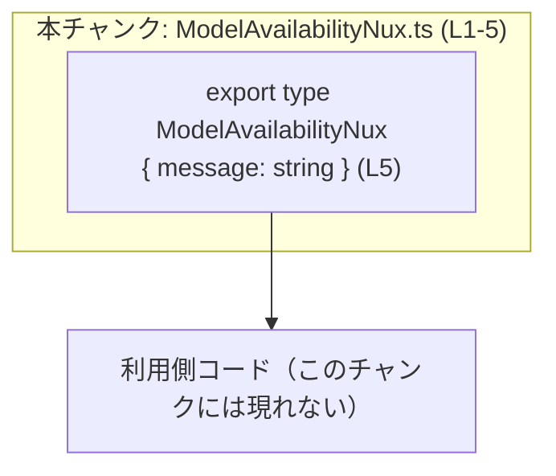
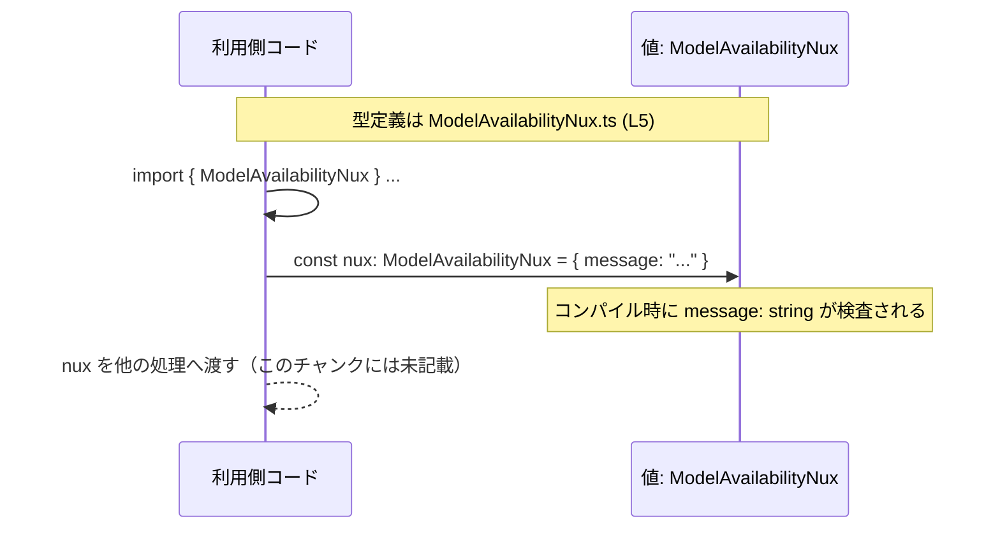

# app-server-protocol/schema/typescript/v2/ModelAvailabilityNux.ts コード解説

## 0. ざっくり一言

`ModelAvailabilityNux` という **1 つのオブジェクト型**（型エイリアス）を定義するだけの、自動生成された TypeScript スキーマファイルです（`message: string` のプロパティを持ちます）（ModelAvailabilityNux.ts:L1-5）。

---

## 1. このモジュールの役割

### 1.1 概要

- このモジュールは、自動生成された型定義として `ModelAvailabilityNux` 型を公開します（ModelAvailabilityNux.ts:L1-3, L5）。
- `ModelAvailabilityNux` は、`message` という文字列プロパティを 1 つ持つオブジェクトの構造を表現します（ModelAvailabilityNux.ts:L5）。

### 1.2 アーキテクチャ内での位置づけ

このファイル内には import/export の依存関係はなく、**1 つの型をエクスポートするだけ**です（ModelAvailabilityNux.ts:L5）。  
従って、この型は他の TypeScript コードからインポートされて利用されることを想定した **スキーマ定義モジュール**と位置づけられます。



> 注: 利用側コード（B）がどのファイルかは、このチャンクには現れません。

### 1.3 設計上のポイント

- **自動生成コード**  
  - 「GENERATED CODE」「Do not edit this file manually」とコメントされており、手動編集禁止であることが明示されています（ModelAvailabilityNux.ts:L1-3）。
- **状態やロジックを持たない**  
  - 関数・クラスは一切定義されておらず、静的な型情報のみを提供します（ModelAvailabilityNux.ts:L5）。
- **シンプルなオブジェクト型**  
  - プロパティは `message: string` のみで、ネストやユニオンなどの複雑な構造はありません（ModelAvailabilityNux.ts:L5）。

---

## 2. 主要な機能一覧

このモジュールが提供する「機能」は、実行時ロジックではなく **型情報** に限られます。

- `ModelAvailabilityNux` 型定義: `message: string` を持つオブジェクトの構造を表す（ModelAvailabilityNux.ts:L5）

---

## 3. 公開 API と詳細解説

### 3.1 型一覧（構造体・列挙体など）

| 名前                 | 種別                            | 役割 / 用途                                                                 | 定義位置                           |
|----------------------|---------------------------------|------------------------------------------------------------------------------|------------------------------------|
| `ModelAvailabilityNux` | 型エイリアス（オブジェクト型） | `message: string` プロパティを持つオブジェクトの型を表す                    | ModelAvailabilityNux.ts:L5-5       |

`ModelAvailabilityNux` の構造は以下のとおりです（ModelAvailabilityNux.ts:L5）。

```typescript
export type ModelAvailabilityNux = {
    message: string;  // 必須。文字列メッセージ
};
```

- `message`: 文字列（`string`）。必須プロパティであり、オプショナル (`?`) ではありません（ModelAvailabilityNux.ts:L5）。

### 3.2 関数詳細（最大 7 件）

このファイルには **関数・メソッドの定義は存在しません**（ModelAvailabilityNux.ts:L1-5）。  
そのため、関数の詳細テンプレートは適用対象がありません。

### 3.3 その他の関数

- なし（関数定義が存在しません）（ModelAvailabilityNux.ts:L1-5）。

---

## 4. データフロー

このモジュール自体は実行時処理を行いませんが、`ModelAvailabilityNux` 型がどのような形で利用されるかの典型パターンを、型レベルのデータフローとして整理します。

### 型レベルのデータフロー概要

1. 他モジュールが `ModelAvailabilityNux` 型を import する（このチャンクには現れない）。
2. `message` プロパティを持つオブジェクトに対して、この型を付けて利用する。
3. 型チェックにより、`message` が必ず文字列で存在することがコンパイル時に保証される（ModelAvailabilityNux.ts:L5）。



> 実際にどの関数や API へ渡されるかは、このチャンクからは分かりません。

---

## 5. 使い方（How to Use）

### 5.1 基本的な使用方法

`ModelAvailabilityNux` 型をインポートして、`message` プロパティを持つオブジェクトに型を付ける基本例です。

```typescript
// ModelAvailabilityNux 型をインポートする
import type { ModelAvailabilityNux } from "./ModelAvailabilityNux";  // 相対パスはプロジェクト構成に合わせて調整

// ModelAvailabilityNux 型に適合するオブジェクトを作成する
const nux: ModelAvailabilityNux = {
    message: "The model is now available.",  // 必須の message プロパティ（string）
};

// 型が付いているので、IDE の補完や型チェックが効く
console.log(nux.message);  // OK: string として扱える
```

このコードは、`message` プロパティが存在し、かつ `string` 型であることをコンパイル時に保証します（ModelAvailabilityNux.ts:L5）。

### 5.2 よくある使用パターン

#### パターン1: 関数の引数として受け取る

```typescript
import type { ModelAvailabilityNux } from "./ModelAvailabilityNux";

// ModelAvailabilityNux 型の値を受け取ってログ出力する関数
function logModelAvailability(nux: ModelAvailabilityNux): void {
    console.log(`Model availability message: ${nux.message}`);  // message にアクセス
}
```

#### パターン2: 関数の戻り値として返す

```typescript
import type { ModelAvailabilityNux } from "./ModelAvailabilityNux";

// ModelAvailabilityNux 型の値を生成して返す関数
function createModelAvailability(message: string): ModelAvailabilityNux {
    return { message };  // オブジェクトリテラルがそのまま ModelAvailabilityNux 型に適合
}
```

### 5.3 よくある間違い

#### 間違い例1: `message` を省略してしまう

```typescript
import type { ModelAvailabilityNux } from "./ModelAvailabilityNux";

const nux: ModelAvailabilityNux = {
    // message: "..." を書き忘れている
    // コンパイルエラー: プロパティ 'message' が型に必要
};
```

#### 正しい例

```typescript
const nux: ModelAvailabilityNux = {
    message: "Some information",  // 必須プロパティを指定
};
```

#### 間違い例2: `message` を文字列以外の型にする

```typescript
const nux: ModelAvailabilityNux = {
    // number を代入しているためコンパイルエラー
    message: 123,  // エラー: 型 'number' を型 'string' に割り当てることはできません。
};
```

### 5.4 使用上の注意点（まとめ）

- **手動でこのファイルを編集しないこと**  
  - 冒頭コメントで「GENERATED CODE」「Do not edit this file manually」と明示されています（ModelAvailabilityNux.ts:L1-3）。  
    型構造を変えたい場合は、このファイルではなく「生成元」を変更する必要があります（生成元の場所はこのチャンクからは分かりません）。
- **`message` は必須・文字列のみ**  
  - プロパティ `message` を省略したり、`string` 以外の型を入れるとコンパイルエラーになります（ModelAvailabilityNux.ts:L5）。
- **値の内容までは制約されない**  
  - 型としては「空文字列」「非常に長い文字列」なども許可されます。  
    内容の妥当性チェック（長さ制限・フォーマットなど）は、このファイルには含まれていません（ModelAvailabilityNux.ts:L5）。

---

## 6. 変更の仕方（How to Modify）

### 6.1 新しい機能を追加する場合

このファイルは自動生成されており、コメントで手動編集禁止が宣言されています（ModelAvailabilityNux.ts:L1-3）。従って、**直接このファイルに新しいプロパティや型を追加することは推奨されません**。

一般的な方針としては:

1. 型に新しい情報が必要な場合
   - `message` 以外の情報を持ちたい場合は、この型の **生成元** を変更する必要があります（ModelAvailabilityNux.ts:L1-3）。  
   - 生成元（おそらく別言語や別ツールで書かれた定義）は、このチャンクには現れないため、場所や変更方法は不明です。
2. 生成された型に依存するコード側で対応
   - 追加の情報を別の型・別のオブジェクトとして扱うなど、この型を拡張しない設計も選択肢になります。

### 6.2 既存の機能を変更する場合

`ModelAvailabilityNux` 型の変更は、利用側コードに大きく影響します。

- **影響範囲の確認**
  - `ModelAvailabilityNux` を import しているすべての箇所が影響を受けます。  
    ただし、このチャンクには import 関係が現れていないため、どこで使われているかは不明です。
- **契約（前提条件）の保持**
  - 現在は「必ず `message: string` が存在する」という契約になっています（ModelAvailabilityNux.ts:L5）。  
  - これをオプショナルにする（`message?: string`）などの変更は、呼び出し側の前提条件を変えることになります。
- **変更方法**
  - コメントの通り、直接編集ではなく生成元での変更が前提です（ModelAvailabilityNux.ts:L1-3）。
- **テスト**
  - このファイルの中にはテストコードは含まれていません（ModelAvailabilityNux.ts:L1-5）。  
    型変更後は、利用側コードのテストでコンパイルエラーや挙動を確認する必要があります。

---

## 7. 関連ファイル

このチャンクには import/export による具体的な関連ファイルは現れていませんが、パス構造から **ディレクトリ単位の関係**は分かります。

| パス                                           | 役割 / 関係 |
|-----------------------------------------------|-------------|
| `app-server-protocol/schema/typescript/v2/`   | 本ファイルが所属するディレクトリ。バージョン `v2` の TypeScript スキーマ群を置くためのディレクトリと推測されますが、詳細はこのチャンクからは不明です。 |
| `app-server-protocol/schema/typescript/v2/ModelAvailabilityNux.ts` | 本ファイル自身。`ModelAvailabilityNux` 型を定義・エクスポートする（ModelAvailabilityNux.ts:L5）。 |

> このチャンクにはテストファイルや他型への参照が一切登場しないため、より細かい関連性（どこから使われているか等）は不明です。
