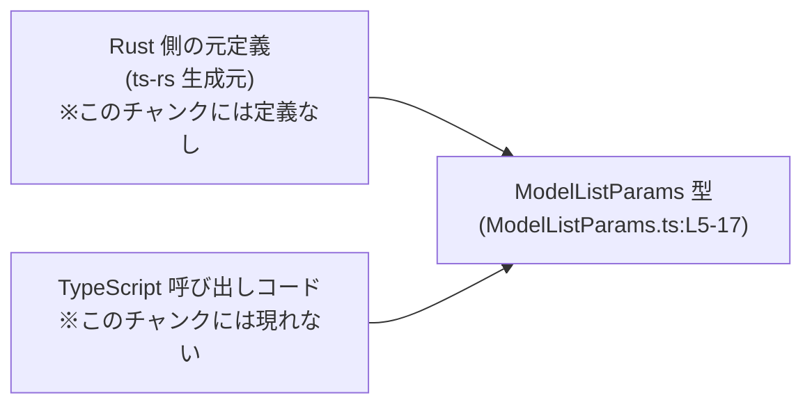
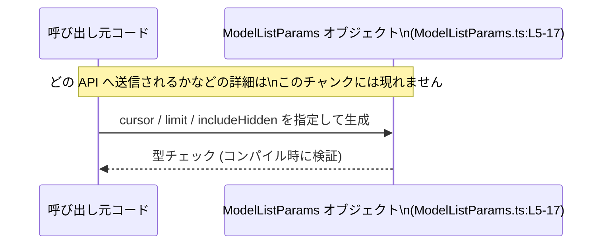

# app-server-protocol/schema/typescript/v2/ModelListParams.ts コード解説

## 0. ざっくり一言

`ModelListParams` は、モデル一覧取得処理のための **ページネーション用パラメータ**（カーソル・件数・非表示モデルを含めるかどうか）を型安全に表現する TypeScript のオブジェクト型定義です（ModelListParams.ts:L5-17）。

---

## 1. このモジュールの役割

### 1.1 概要

- このモジュールは、モデル一覧取得 API などに渡すための **リクエストパラメータ** を表現するために存在し、TypeScript 上での **型安全なインターフェース** を提供します（ModelListParams.ts:L5-17）。
- `cursor` によるカーソルベースのページネーション、`limit` によるページサイズ指定、`includeHidden` による非表示モデルの含有制御をまとめた小さな DTO（データ転送オブジェクト）として設計されています（ModelListParams.ts:L6-16）。
- ファイル先頭のコメントから、この型は Rust 側の定義から `ts-rs` によって **自動生成されている** ことが分かり、手作業で編集すべきではないことが明示されています（ModelListParams.ts:L1-3）。

### 1.2 アーキテクチャ内での位置づけ

このモジュールは、Rust 側の型定義から自動生成された TypeScript 型として、**呼び出し側 TypeScript コードとサーバー側実装の間の契約**を表現します。



- Rust 側の元定義から `ts-rs` により本ファイルが生成されていることがコメントから分かります（ModelListParams.ts:L1-3）。
- `ModelListParams` を実際に利用する呼び出しコード（API クライアントなど）は、このチャンクには登場しません。そのため、**どの関数に渡されるか・どの API を呼ぶか** は、このファイルだけからは分かりません。

### 1.3 設計上のポイント

- **自動生成コード**  
  - ファイル先頭に「GENERATED CODE! DO NOT MODIFY BY HAND!」とあり、手作業での修正は想定されていません（ModelListParams.ts:L1-3）。
- **状態を持たないプレーンなオブジェクト型**  
  - 関数・クラス・メソッドは一切なく、1 つのオブジェクト型エイリアスのみが定義されています（ModelListParams.ts:L5-17）。
- **オプション＋nullable なプロパティ設計**  
  - すべてのプロパティが `?` でオプション指定され、かつ `| null` を含んでいます（ModelListParams.ts:L9, L13, L17）。  
  - つまり各プロパティは「**存在しない / undefined / null / 型どおりの値**」のいずれかを取りうるため、呼び出し側は **null と未指定の違いを意識して扱う必要**があります。
- **型レベルの安全性のみで、実行時のバリデーションはなし**  
  - 型定義だけであり、`limit` の上限チェックなどのロジックはここでは実装されていません。値の妥当性はサーバー側や別の層で扱う前提の設計と解釈できます（ModelListParams.ts:L13）。

---

## 2. 主要な機能一覧

このファイルが提供する機能は、型 1 つに集約されています。

- `ModelListParams` 型: モデル一覧取得処理で利用するページネーションと非表示モデル有無のパラメータを、型安全に表現するオブジェクト型。

---

## 3. 公開 API と詳細解説

### 3.1 型一覧（コンポーネントインベントリー）

このチャンクに登場する公開コンポーネントは 1 つです。

| 名前              | 種別                         | 役割 / 用途                                                                                         | 定義位置                         |
|-------------------|------------------------------|------------------------------------------------------------------------------------------------------|----------------------------------|
| `ModelListParams` | 型エイリアス（オブジェクト型） | モデル一覧 API などに渡す、ページネーション用カーソル・最大件数・非表示モデル含有フラグのセットを表現 | ModelListParams.ts:L5-17 |

型は以下のように定義されています。

```typescript
// 型エイリアス定義（ModelListParams.ts:L5-17）
export type ModelListParams = {
    /**
     * Opaque pagination cursor returned by a previous call.
     */
    cursor?: string | null,
    /**
     * Optional page size; defaults to a reasonable server-side value.
     */
    limit?: number | null,
    /**
     * When true, include models that are hidden from the default picker list.
     */
    includeHidden?: boolean | null,
};
```

#### ModelListParams のフィールド

| プロパティ名     | 型                   | オプション/nullable                     | 説明                                                                                                   | 定義位置                  |
|------------------|----------------------|------------------------------------------|--------------------------------------------------------------------------------------------------------|---------------------------|
| `cursor`         | `string \| null`     | `?` によりプロパティ自体がオプション<br>実質型は `string \| null \| undefined` | 直前の呼び出しから返された「不透明なページネーションカーソル」。中身の構造に依存せず、そのまま再送する前提（ModelListParams.ts:L6-9）。 | ModelListParams.ts:L6-9  |
| `limit`          | `number \| null`     | 実質型は `number \| null \| undefined`   | 1 ページあたりの件数を表す任意の数値。コメント上は「指定しなければサーバーの妥当なデフォルト値が使われる」とあります（ModelListParams.ts:L10-13）。 | ModelListParams.ts:L10-13 |
| `includeHidden`  | `boolean \| null`    | 実質型は `boolean \| null \| undefined`  | `true` のとき、デフォルトのピッカーリストから隠されているモデルも一覧に含めることを示すフラグです（ModelListParams.ts:L14-17）。 | ModelListParams.ts:L14-17 |

**TypeScript の型安全性の観点**

- `any` は使われておらず、それぞれのプロパティが具体的な型（`string` / `number` / `boolean`）＋ `null` で表現されています。
- `?` によりプロパティ自体の省略が可能ですが、プロパティが存在する場合にはコンパイル時に型チェックが行われます。
- 呼び出し側は、「プロパティが存在しない」「`undefined`」「`null`」「有効な値」の区別を念頭に置いて扱う必要があります（これは TypeScript のオプショナルプロパティ共通の注意点です）。

### 3.2 関数詳細

このファイルには **関数・メソッド・クラスコンストラクタなどの実行ロジックは一切定義されていません**（ModelListParams.ts:L1-17）。

そのため、関数詳細テンプレートに該当する対象はありません。

- エラー発生条件・例外・非同期処理・並行性に関する挙動も、このファイル単体からは読み取れません。
- TypeScript の型チェックにより、**不正な型の値を詰めようとした時点でコンパイルエラーになる**のが主な「安全性」のポイントです。

### 3.3 その他の関数

- 補助的な関数やラッパー関数も、このチャンクには存在しません（ModelListParams.ts:L1-17）。

---

## 4. データフロー

このファイルは型定義だけなので、実行時の具体的なフロー（どの API に渡され、どのレスポンスが返るか）は不明です。ただし、**呼び出し元コードが `ModelListParams` 型のオブジェクトを組み立てる**という最小限のデータフローは想定できます。



- 実行時には `Params` は単なるプレーンオブジェクトとして扱われますが、TypeScript コンパイル時には `ModelListParams` 型として **構造とフィールド型の整合性** がチェックされます。
- `Params` がどの関数に渡されるか、サーバーとの通信がどう行われるかは、このファイルには記述されていないため「不明」です。

---

## 5. 使い方（How to Use）

### 5.1 基本的な使用方法

以下は、この型の一般的な利用イメージを示すサンプルです。`fetchModels` はこの説明用に仮定した関数であり、実際のプロジェクトに存在するとは限りません。

```typescript
// ModelListParams 型の定義をインポートする例                        // 型を利用するためにインポートする（パスはプロジェクトに依存）
import type { ModelListParams } from "./ModelListParams";          // 実際の import パスはこのチャンクからは分かりません

// 仮の API 呼び出し関数の型定義                                    // 説明用に定義した関数
async function fetchModels(params: ModelListParams): Promise<void> { // ModelListParams を引数として受け取る
    // 実際にはここで HTTP リクエストなどを行う想定                 // このチャンクには実装は存在しない
    console.log(params);                                            // ここでは単にログに出しているだけ
}

// 初回ページ取得の例                                                // 1 ページ目を取得するイメージ
const firstPageParams: ModelListParams = {                          // ModelListParams 型のオブジェクトを生成
    limit: 20,                                                      // 1 ページあたり 20 件を要求
    // cursor は指定しない → サーバーデフォルトの「最初のページ」扱いが一般的（詳細はこのチャンクからは不明）
};

// 2 ページ目以降取得の例                                            // 以前取得した cursor を再利用する
const nextPageCursor: string = "opaque-cursor-from-previous-call";  // 前回のレスポンスから取得したと仮定したカーソル
const nextPageParams: ModelListParams = {                           // 次のページを取得するためのパラメータ
    cursor: nextPageCursor,                                         // 不透明なカーソル文字列をそのまま指定
    limit: 20,                                                      // 同じページサイズで取得
    includeHidden: false,                                           // 非表示モデルは含めない
};

// 非同期関数の中で利用する例                                        // async/await と組み合わせた使用
async function run() {                                              // 実行用の関数
    await fetchModels(firstPageParams);                             // 1 ページ目を取得
    await fetchModels(nextPageParams);                              // 2 ページ目以降を取得
}
```

ポイント:

- TypeScript の型システムにより、`limit` に文字列などを渡そうとするとコンパイルエラーになります。
- `cursor` はコメントに「Opaque pagination cursor」とあるとおり、呼び出し側で **中身の形式に依存せず再現利用する** ことが想定されています（ModelListParams.ts:L6-8）。

### 5.2 よくある使用パターン

1. **初回取得（cursor を指定しない）**

```typescript
const params: ModelListParams = {           // 初回呼び出し用のパラメータ
    limit: 50,                              // ページサイズだけを指定
    // cursor は未指定 → サーバー側で「最初のページ」と解釈されることが期待される（コメントからの推測）
};
```

1. **カーソルを使った続きの取得**

```typescript
const params: ModelListParams = {           // 連続ページ取得用のパラメータ
    cursor: previousCursor,                 // 1 つ前のレスポンスから取得したカーソル
    limit: 50,                              // 同じページサイズ
};
```

1. **非表示モデルも含めた検索**

```typescript
const params: ModelListParams = {           // 非表示モデルも含めたい場合の例
    includeHidden: true,                    // デフォルトのピッカーには出ないモデルも含める
};
```

> 上記 2・3 のような利用パターンは、プロパティ名とコメントから想定される一般的な使い方です。  
> 実際の API がどう解釈するかは、このチャンクには記載されていません。

### 5.3 よくある間違い

#### 型の誤り

```typescript
// 間違い例: limit に文字列を指定している
const badParams1: ModelListParams = {
    // limit: "10",                         // ❌ string は number に代入できない → コンパイルエラー
};

// 正しい例: number 型を指定する
const goodParams1: ModelListParams = {
    limit: 10,                              // ✅ number 型なので OK
};
```

#### `null` と「未指定」の混同

```typescript
// 間違いになりうる例: どの状態が何を意味するかを決めていない
const ambiguousParams: ModelListParams = {
    cursor: null,                           // null が「最初から」なのか「削除された」のか、契約が曖昧だと混乱の元
};

// より明示的な扱い方の例（契約を決めておく）
const explicitParams: ModelListParams = {
    // cursor プロパティを省略        → 「カーソル未指定（初回ページ）」と解釈すると決める
    // cursor: undefined              → 同じ意味として扱うと決める場合もある（契約次第）
};
```

- このファイルには `null` と未指定（プロパティ省略）をどう区別するかの **契約は書かれていません**。  
  実際の挙動はサーバーや利用側の実装に依存します。

### 5.4 使用上の注意点（まとめ）

- **オプション＋nullable の組み合わせ**  
  - 各プロパティは「省略・`undefined`・`null`・値あり」の全てを取りうるので、「どの状態が何を意味するか」を呼び出し側とサーバー側で明確に合意する必要があります。
- **`limit` の値範囲**  
  - 型としては `number` であればどんな値でも許容されます（負数や小数も含む）。  
    上限値や負数禁止などのルールは、このファイルには定義されていません。
- **カーソルの中身に依存しない**  
  - 「Opaque pagination cursor」とコメントされているため、呼び出し側はカーソル文字列の構造を解析したり加工したりせず、**取得した値をそのまま再利用する**のが安全です（ModelListParams.ts:L6-8）。
- **並行性・スレッドセーフティ**  
  - TypeScript 側では単なるオブジェクト型であり、並行性に関する特別な仕組みはありません。  
    共有オブジェクトを複数箇所で書き換えるといった一般的な JavaScript の注意点は、この型にもそのまま当てはまります。

---

## 6. 変更の仕方（How to Modify）

### 6.1 新しい機能を追加する場合

ファイル先頭に

- `// GENERATED CODE! DO NOT MODIFY BY HAND!`（ModelListParams.ts:L1）
- `// This file was generated by [ts-rs](...)`（ModelListParams.ts:L3）

とあるため、**この TypeScript ファイルを直接編集することは想定されていません**。

新しいプロパティを追加したい場合の一般的な手順は次のようになります（具体的な Rust 側ファイルの場所はこのチャンクからは分かりません）:

1. **Rust 側の元となる型定義を変更する**  
   - ts-rs で `ModelListParams` に対応する Rust 構造体などを探し、新しいフィールドを追加する。  
   - 例: Rust の `struct ModelListParams { ... }` に新メンバーを追加する（※これは一般的なパターンであり、このチャンクには Rust コードは現れません）。
2. **ts-rs によるコード生成を再実行する**  
   - ビルドスクリプトや生成コマンドを実行し、この TypeScript ファイルを再生成する。
3. **生成結果を確認する**  
   - 追加したフィールドが、期待どおりの TypeScript 型として出力されているかを確認する（`?` や `| null` の有無など）。

### 6.2 既存の機能を変更する場合

例えば、`limit` を必須にしたい・`includeHidden` を nullable ではなくしたい、といった変更を行う場合も同様に **元の Rust 側定義を変更**する必要があります。

変更時に意識すべき点:

- **影響範囲の確認**  
  - `ModelListParams` を使用している TypeScript コードすべてが影響を受けます。  
    ただし、このチャンクには使用箇所が現れないため、具体的な参照先は「不明」です。
- **前提条件・契約の維持**  
  - 既存のクライアントが `limit` を省略していた場合、必須化するとコンパイルエラーまたは実行時エラーを引き起こす可能性があります。  
  - API 契約の変更を伴うため、サーバー側実装と利用クライアントの両方で整合性を確認する必要があります。
- **テストの更新**  
  - 型変更により、関連する単体テスト・統合テストが必要に応じて修正されるべきですが、このチャンクにはテストコードは含まれていません。

---

## 7. 関連ファイル

このチャンクから明確に分かる関連は、「ts-rs による生成元となる Rust 側の型定義が存在する」という事実のみです（ModelListParams.ts:L1-3）。

| パス | 役割 / 関係 |
|------|------------|
| *(不明; ts-rs が参照する Rust 側の型定義)* | 本 TypeScript 型 `ModelListParams` の元になっている Rust 型。コメントから ts-rs による自動生成であることが分かるが、具体的なファイルパスやモジュール名はこのチャンクには現れません（ModelListParams.ts:L1-3）。 |

- `ModelListParams` を実際に利用する TypeScript ファイル（API クライアントや UI コンポーネントなど）は、このチャンクには登場しないため、**どのファイルが利用しているかは不明**です。
- テストコードやユーティリティも同様に、このチャンクからは特定できません。

---

以上が、`app-server-protocol/schema/typescript/v2/ModelListParams.ts` に含まれる型定義の構造と役割、および利用上の注意点です。このファイルは純粋な型宣言のみで構成されており、エラー処理・並行性・パフォーマンスなどの実行時挙動は、別の層（主にサーバー側実装と TS 呼び出し側コード）で扱われる前提になっています。
