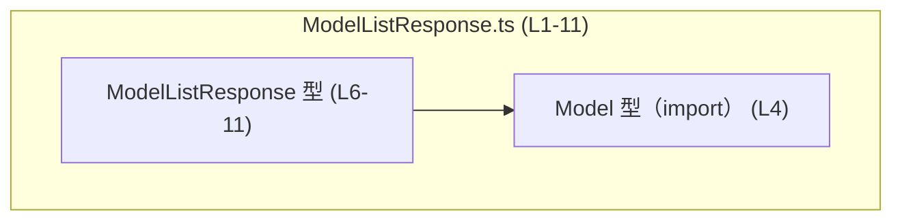
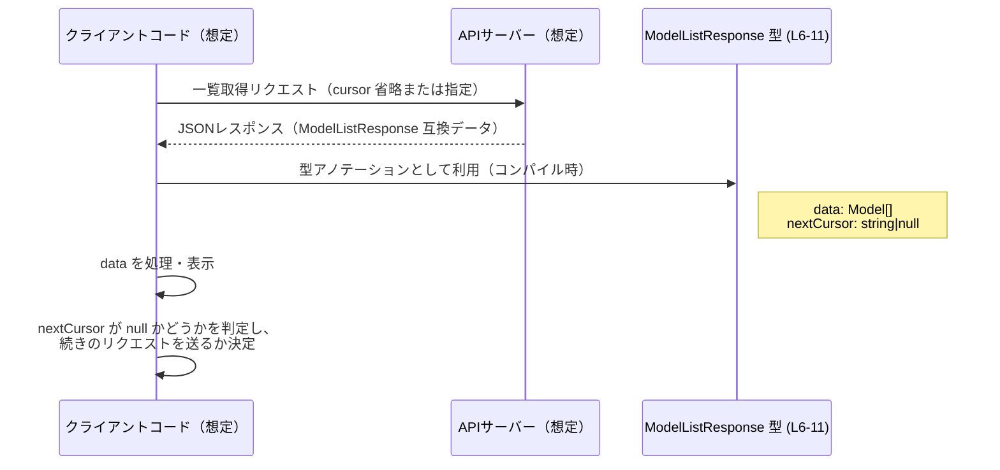

# app-server-protocol/schema/typescript/v2/ModelListResponse.ts

## 0. ざっくり一言

`ModelListResponse` というページング付きモデル一覧レスポンスを表す **型定義（type alias）** を提供する TypeScript ファイルです。`Model` の配列とページング用カーソル文字列をまとめたコンテナ型になっています。[ModelListResponse.ts:L4-11]

---

## 1. このモジュールの役割

### 1.1 概要

- このモジュールは、`Model` 型の一覧結果を表現するためのレスポンス型 `ModelListResponse` を定義します。[ModelListResponse.ts:L4-11]
- レスポンスには
  - `data`: `Model` の配列
  - `nextCursor`: 次ページ取得のためのカーソル文字列（または `null`）
  が含まれます。[ModelListResponse.ts:L6-11]
- ファイル先頭コメントにより、このコードは `ts-rs` によって自動生成されており、手動編集しないことが明示されています。[ModelListResponse.ts:L1-3]

### 1.2 アーキテクチャ内での位置づけ

このファイル単体でわかる依存関係は次の通りです。

- 依存先:
  - `./Model` から `Model` 型を型としてインポートしています。[ModelListResponse.ts:L4]
- 依存元（この型を使う側）については、このチャンクには現れず不明です。

Mermaid 図で表すと次のようになります。



この図は、「`ModelListResponse` が内部で `Model` の配列を持つ」という静的な型依存関係のみを表します。

### 1.3 設計上のポイント

コードから読み取れる設計上の特徴は次の通りです。

- **データコンテナとしての単純な型**  
  - 関数やメソッドは定義されておらず、フィールドを持つ単純なオブジェクト型です。[ModelListResponse.ts:L6-11]
- **型エイリアス（`export type`）による公開**  
  - `export type` を使っており、この型が外部モジュールから利用される公開 API であることが分かります。[ModelListResponse.ts:L6]
- **ページングカーソルの明示**  
  - ドキュメンテーションコメントから、`nextCursor` が「最後に返した要素の次から続きの結果を取得するための不透明カーソル」であり、`null` の場合はこれ以上の結果がないことを意味する契約になっていると読み取れます。[ModelListResponse.ts:L7-10, L11]
- **自動生成コードであることの明示**  
  - 先頭コメントで「GENERATED CODE」「Do not edit manually」と明記されており、このファイルを直接変更せず生成元（Rust 側や `ts-rs` の設定）を変更する前提です。[ModelListResponse.ts:L1-3]

---

## 2. 主要な機能一覧

このファイルは関数を提供せず、1 つの公開型のみを提供します。役割は次の 1 点です。

- `ModelListResponse`: `Model` の配列とページングカーソルをまとめたレスポンス型。[ModelListResponse.ts:L6-11]

---

## 3. 公開 API と詳細解説

### 3.1 型一覧（構造体・列挙体など）

このファイルに定義されている主要な型は次の 1 つです。

| 名前                | 種別       | 役割 / 用途                                                                                         | 定義位置                          |
|---------------------|------------|------------------------------------------------------------------------------------------------------|-----------------------------------|
| `ModelListResponse` | 型エイリアス | `Model` の配列 `data` と、次ページ取得のためのカーソル `nextCursor` をまとめたレスポンスオブジェクト | `ModelListResponse.ts:L6-11`      |

補助的な要素（インポート）は次の通りです。

| 名前   | 種別       | 役割 / 用途                              | 定義位置                     |
|--------|------------|-------------------------------------------|------------------------------|
| `Model`| 型インポート | 各要素の型。`data` 配列の要素型として利用 | `ModelListResponse.ts:L4`    |

#### `ModelListResponse` のフィールド

`ModelListResponse` は通常のオブジェクト型として次のフィールドを持ちます。[ModelListResponse.ts:L6-11]

| フィールド名   | 型                 | 説明 |
|----------------|--------------------|------|
| `data`         | `Array<Model>`     | `Model` 型の配列です。レスポンスに含まれる全モデルを表します。 |
| `nextCursor`   | `string \| null`   | 次のリクエストに渡すためのカーソル文字列。`null` のときは「これ以上の項目はない」という意味であるとコメントに記述されています。 |

**型システム上のポイント**

- `Array<Model>`  
  - `Model` 型の要素配列であることを静的に保証します。[ModelListResponse.ts:L6]
- `string \| null`  
  - ユニオン型により、`nextCursor` を利用する側は `null` チェックを行わないとコンパイルエラーになり得ます（`strictNullChecks` 有効な場合）。これにより「存在しないカーソルを誤って使う」ミスをコンパイル時に検出できます。[ModelListResponse.ts:L11]

### 3.2 関数詳細（最大 7 件）

このファイルには **関数定義は存在しません**。[ModelListResponse.ts:L1-11]

そのため、このセクションで詳説すべき関数はありません。

### 3.3 その他の関数

このファイルには補助関数やラッパー関数も定義されていません。[ModelListResponse.ts:L1-11]

---

## 4. データフロー

### 4.1 代表的なデータフロー（概念図）

このファイルには処理ロジックは含まれず、データ型のみが定義されています。[ModelListResponse.ts:L6-11]  
ここでは、この型がどのように使われると想定されるかを **概念レベル** で示します（具体的な呼び出し元はこのチャンクには現れないため、「想定例」であり断定はできません）。

- API クライアントなどがサーバーから `ModelListResponse` 形の JSON を受け取る。
- デシリアライズ後、そのオブジェクトの
  - `data`: 一覧表示や処理対象のモデル集合。
  - `nextCursor`: さらに続きがあるかどうかの判定、および次ページ取得のパラメータ。
  として使われる、という使い方が想定されます。

概念的なシーケンスを Mermaid のシーケンス図で表します。



※ この図に登場する「クライアントコード」「APIサーバー」は、あくまで典型的な利用シナリオの例であり、このファイルには具体的な実装は現れません。

---

## 5. 使い方（How to Use）

### 5.1 基本的な使用方法

`ModelListResponse` 型を用いて、API からのレスポンスを型安全に扱う例です。  
`Model` の中身はこのチャンクには現れないため、ここでは `console.log` でそのまま出力するに留めています。

```typescript
// ModelListResponse 型と Model 型をインポートする
import type { ModelListResponse } from "./ModelListResponse";  // 本ファイルのエクスポート
import type { Model } from "./Model";                          // 要素型（定義はこのチャンクには不明）

// 一覧レスポンスを処理する関数の例
function handleModelListResponse(resp: ModelListResponse) {    // resp は data と nextCursor を持つ
    // data: Model[] を反復処理
    resp.data.forEach((model: Model) => {                      // 各要素は Model 型
        console.log(model);                                    // ここでは中身には立ち入らずログに出すのみ
    });

    // nextCursor: string | null を確認してページングを制御
    if (resp.nextCursor !== null) {                            // null でなければ続きがある想定
        // 次ページを取得する処理（仮の例）
        // fetchNextPage(resp.nextCursor);
    } else {
        // これ以上のページはない想定
        console.log("no more items");
    }
}
```

このように、`ModelListResponse` 型により `data` と `nextCursor` の存在と型がコンパイル時に保証され、IDE の補完や型チェックが有効になります。[ModelListResponse.ts:L6-11]

### 5.2 よくある使用パターン（想定）

このファイルから具体的なユースケースは読み取れませんが、型の構造から次のようなパターンが想定されます。

1. **初回取得 → ループしながらページング**

```typescript
async function fetchAllModels(fetchPage: (cursor: string | null) => Promise<ModelListResponse>) {
    let cursor: string | null = null;                       // 最初は cursor なし
    const all: Model[] = [];

    while (true) {
        const resp = await fetchPage(cursor);               // cursor を指定してページ取得
        all.push(...resp.data);                             // data の中身を蓄積

        if (resp.nextCursor === null) {                     // null なら終了条件
            break;
        }
        cursor = resp.nextCursor;                           // 次のループで使用
    }

    return all;
}
```

1. **空の `data` と `nextCursor` を利用して「結果なし」を表す**

```typescript
const emptyResponse: ModelListResponse = {
    data: [],                                               // 要素なし
    nextCursor: null,                                       // 続きもない
};
```

### 5.3 よくある間違い（起こりうる誤用例）

型定義から推測される誤用パターンと正しい使い方の対比です。

```typescript
// 誤り例: nextCursor を null チェックせずに使用している
function misuse(resp: ModelListResponse) {
    // const cursorUpper = resp.nextCursor.toUpperCase();   // strictNullChecks 下ではコンパイルエラー
}

// 正しい例: null チェックを行ってから文字列メソッドを使う
function correctUsage(resp: ModelListResponse) {
    if (resp.nextCursor !== null) {                         // null を排除
        const cursorUpper = resp.nextCursor.toUpperCase();  // string として安全に扱える
        console.log(cursorUpper);
    }
}
```

### 5.4 使用上の注意点（まとめ）

- **null チェックが必須**  
  - `nextCursor` は `string \| null` であり、常に存在するとは限りません。[ModelListResponse.ts:L11]
  - 利用前に `resp.nextCursor !== null` などでチェックする必要があります。
- **自動生成ファイルである点**  
  - ファイル先頭に「GENERATED CODE」「Do not edit manually」とあるため、直接編集すると生成処理と不整合が生じます。[ModelListResponse.ts:L1-3]
  - 仕様変更は生成元（Rust の型定義や `ts-rs` 設定）側で行うのが前提です。
- **実データとの整合性**  
  - 実行時には単なる JavaScript オブジェクトであり、サーバーから返る JSON フォーマットとこの型がずれると、ランタイムで例外や `undefined` アクセスが起きる可能性があります。
- **並行性・スレッド安全性**  
  - この型自体はイミュータブルな単なるデータ構造として設計されており、並行アクセスやスレッド安全性に関する特別なロジックは含みません。[ModelListResponse.ts:L6-11]
  - 並行で読み出す場合も、通常のオブジェクト共有と同じ扱いになります。

---

## 6. 変更の仕方（How to Modify）

### 6.1 新しい機能を追加する場合

このファイルは `ts-rs` によって生成されることが明記されています。[ModelListResponse.ts:L1-3]  
そのため、**直接このファイルに型やフィールドを追加するのは前提に反します**。

新しいフィールドや機能を追加したい場合の一般的な流れは次のようになります（ただし、生成元コードはこのチャンクには現れないため、抽象的な記述に留まります）。

1. Rust 側の元の型定義（おそらく `ModelListResponse` 相当の struct）にフィールドを追加する。  
2. `ts-rs` の属性や設定があれば、それも必要に応じて更新する。  
3. コード生成プロセス（ビルドスクリプトなど）を再実行し、この TypeScript ファイルを再生成する。  

この手順により、TypeScript 側と Rust 側の型定義が一貫した状態を保ちやすくなります。

### 6.2 既存の機能を変更する場合

`data` や `nextCursor` の意味や型を変更したい場合も、同様に生成元での変更が必要です。

- **影響範囲の確認**
  - `ModelListResponse` を import しているすべての TypeScript ファイルが影響を受けます。（このチャンクから参照元は分かりません。）
  - `nextCursor` の契約（`null` の意味など）を変える場合は、フロントエンド側のページング処理全般に影響する可能性があります。
- **契約（前提条件・返り値の意味）の注意**
  - コメントには「`nextCursor` が `None`（TypeScript では `null`）のときは「これ以上の項目がない」と書かれています。[ModelListResponse.ts:L7-10, L11]
  - これを変更する場合は、API との合意やドキュメント更新が必要です。
- **関連テスト**
  - このファイルにテストコードは含まれていません。[ModelListResponse.ts:L1-11]
  - 実際のコードベースでは、`ModelListResponse` を使うページングロジックのテスト（初回取得、途中ページ、最終ページなど）を見直す必要があります。

---

## 7. 関連ファイル

このモジュールと直接関係が分かるファイルは次の通りです。

| パス                               | 役割 / 関係 |
|------------------------------------|-------------|
| `app-server-protocol/schema/typescript/v2/Model.ts` | `ModelListResponse` の `data` 配列要素として使われる `Model` 型を提供するモジュール（このチャンクには中身は現れませんが、インポートから存在が分かります）。[ModelListResponse.ts:L4] |

その他、コメントから間接的に分かる外部要素としては次のものがあります。

- `ts-rs`（Rust → TypeScript のコード生成ツール）  
  - コメントに「This file was generated by [ts-rs]」とあり、このツールが生成元であることが示されています。[ModelListResponse.ts:L3]
  - 実際の設定ファイルや Rust 側の定義場所は、このチャンクでは不明です。

---

## 付記: 契約・エッジケース・安全性に関する要点

**契約（Contract）**

- `data` は常に配列であり、要素は `Model` 型であると想定されています。[ModelListResponse.ts:L6]
- `nextCursor` は
  - `string`: 続きのページが存在し、このカーソルを次回リクエストに渡す。
  - `null`: 「これ以上の項目はない」ことを表す。  
  という意味を持つとコメントに書かれています。[ModelListResponse.ts:L7-10, L11]

**エッジケース**

- `data` が空配列 `[]` で `nextCursor` が `null`  
  - 「結果もなく、続きもない」という状態を表現できます。
- `data` が空配列だが `nextCursor` が `string`  
  - 「このページには結果がなかったが、さらに続きがある」状況を表現できます。意味が妥当かどうかはビジネスロジック次第ですが、型上は禁止されていません。
- `nextCursor` の値が空文字列 `""`  
  - 型上は許容されますが、その意味づけ（「無効」「0 番目から」など）は、このチャンクには現れず不明です。

**安全性・セキュリティ**

- このファイルは **型定義のみ** であり、実行時の処理や I/O は持たないため、直接的なセキュリティ上のリスク（SQL インジェクション等）は含みません。[ModelListResponse.ts:L6-11]
- ただし、サーバーから取得した JSON をこの型にアサートする際に、未検証の値を信用しすぎるとランタイムエラーの原因になります。実運用では、バリデーションやランタイム型チェック（zod などのスキーマバリデーション）が併用されることがあります。

**性能・スケーラビリティ**

- 型定義自体はパフォーマンスに影響しませんが、`data` の配列が非常に大きくなる場合、クライアント側でのメモリ使用量や処理時間に影響します。
- ページサイズを適切に設定し、`nextCursor` によるページングを活用することが前提と考えられます（ただし、具体的なページサイズや戦略はこのチャンクには現れません）。

**リファクタリング・観測性**

- リファクタリング時は、この型を参照しているすべてのコード（画面・サービス層など）への影響が出るため、使用箇所を静的解析で洗い出すのが有効です。
- `ModelListResponse` 自体にはログやメトリクスフックはありませんが、この型を受け取る箇所で `data.length` や `nextCursor` の有無をログに出すことで、ページング状況を観測しやすくなります。
