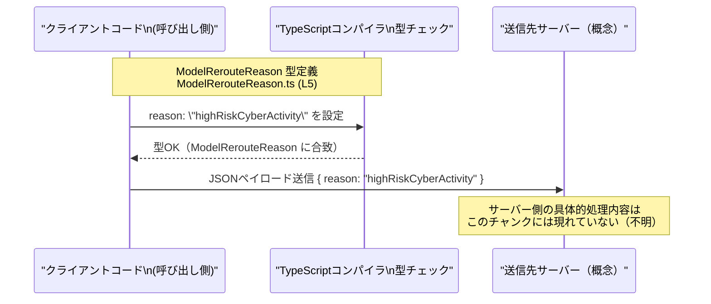

# app-server-protocol/schema/typescript/v2/ModelRerouteReason.ts

## 0. ざっくり一言

- `ModelRerouteReason` は、モデルの「リルート理由」を表す **文字列リテラル型エイリアス** です (ModelRerouteReason.ts:L5)。
- 現時点では、許可される値は `"highRiskCyberActivity"` の 1 種類のみです (ModelRerouteReason.ts:L5)。

---

## 1. このモジュールの役割

### 1.1 概要

- このモジュールは、`ModelRerouteReason` という **ドメイン固有の型** を提供し、リルート理由として使える値をコンパイル時に制限する役割を持ちます (ModelRerouteReason.ts:L5)。
- ファイル先頭のコメントから、`ts-rs` によって自動生成されたコードであり、手動で編集しない前提になっています (ModelRerouteReason.ts:L1-3)。

### 1.2 アーキテクチャ内での位置づけ

- パス `app-server-protocol/schema/typescript/v2` から、このファイルは **アプリケーションサーバープロトコルの TypeScript スキーマ定義** 群の一部として配置されていることが分かります（ユーザー指定パス）。
- 本ファイルには `import` 文が存在せず、他モジュールへの静的な依存はありません (ModelRerouteReason.ts:L1-5)。
- 一方で `export type` により公開されているため、**他モジュールからインポートされて使われることを想定した型定義**になっています (ModelRerouteReason.ts:L5)。

依存関係のイメージ（このファイル単体で分かる範囲）は次のとおりです。

```mermaid
graph TD
    subgraph "ModelRerouteReason.ts (L1-5)"
        MR["型エイリアス ModelRerouteReason\n= \"highRiskCyberActivity\" (L5)"]
    end

    %% 他モジュールはこの型を利用する側として概念的に示す（実在はこのチャンクからは不明）
    Other["他のTSモジュール（利用側・不明）"]
    Other --> MR
```

### 1.3 設計上のポイント

- **自動生成コード**  
  - 冒頭コメントで `GENERATED CODE! DO NOT MODIFY BY HAND!` と明示されており、手動変更は前提としていません (ModelRerouteReason.ts:L1-3)。
- **状態やロジックを持たない純粋な型定義**  
  - 関数やクラスなどは一切なく、型エイリアスのみを提供します (ModelRerouteReason.ts:L5)。
- **列挙に近い表現**  
  - 文字列リテラル型 `"highRiskCyberActivity"` によって、「許される値の集合」を TypeScript の型として表現しています (ModelRerouteReason.ts:L5)。
- **エラーハンドリング・並行性**  
  - 実行時の処理コードが存在しないため、このファイル単体ではエラーハンドリングや並行性に関するロジックは発生しません。

---

## 2. 主要な機能一覧

このモジュールが提供する「機能」は型レベルのものに限定されます。

- `ModelRerouteReason` 型定義: モデルのリルート理由として使用できる文字列を `"highRiskCyberActivity"` のみに制約する型エイリアス (ModelRerouteReason.ts:L5)。
- ts-rs との連携: Rust 側（と推定される）スキーマから生成された TypeScript タイプとして、言語間で理由の値を揃えるために利用される構造になっています（生成元はコメントのみからの推測であり、具体的な元コード位置はこのチャンクには現れません, ModelRerouteReason.ts:L1-3）。

---

## 3. 公開 API と詳細解説

### 3.1 型一覧（構造体・列挙体など）

このファイルに定義されている公開型は 1 つです。

| 名前                 | 種別           | 定義内容 | エクスポート | 定義行 | 役割 / 用途 |
|----------------------|----------------|----------|-------------|--------|-------------|
| `ModelRerouteReason` | 型エイリアス   | `"highRiskCyberActivity"` | `export type` | ModelRerouteReason.ts:L5 | モデルリルート理由を表す文字列リテラル型。許される値を 1 つに固定することで、コンパイル時に誤った値の使用を防ぐ。 |

#### 型の意味（TypeScript 観点）

- `export type ModelRerouteReason = "highRiskCyberActivity";` は、**文字列 `"highRiskCyberActivity"` だけを許容する型**を定義します (ModelRerouteReason.ts:L5)。
- これは列挙型 (`enum`) の 1 要素版のようなもので、通常は将来的に値が増える前提で、文字列リテラル型のユニオン（例: `"A" | "B" | "C"`）として拡張されることが多いパターンです。ただし、このチャンク内では他の値は定義されていないため、詳細な設計意図は不明です。

### 3.2 関数詳細（最大 7 件）

- このファイルには関数定義が存在しません (ModelRerouteReason.ts:L1-5)。
- したがって、関数の詳細解説テンプレートに沿って説明できる対象はありません。

### 3.3 その他の関数

- 補助関数やラッパー関数も定義されていません (ModelRerouteReason.ts:L1-5)。

---

## 4. データフロー

このファイル自体は型定義のみで実行時処理を持たないため、**実際のデータフローはこのチャンクからは読み取れません**。  
ただし、`ModelRerouteReason` がどのように使われるかの典型的なイメージを、コンパイル時の型チェックを含む概念図として示します。



要点:

- 型 `ModelRerouteReason` 自体はコンパイル時のみ存在し、JavaScript にトランスパイルされると **実行時には消える型情報**です。
- そのため、**外部から受け取るデータ**（例: JSON）に対しては、別途ランタイムのバリデーションを実装しない限り、値が `"highRiskCyberActivity"` であることは保証されません。
- このファイルはその前段として、「コードを書くときに誤った文字列を使わない」ことを型システムで支援する役割を担います (ModelRerouteReason.ts:L5)。

---

## 5. 使い方（How to Use）

### 5.1 基本的な使用方法

`ModelRerouteReason` をイベントやリクエストのフィールド型として使用する例です。ここで示すコードは**あくまで利用例**であり、実際に存在するコードではありません。

```typescript
// ModelRerouteReason 型をインポートする（相対パスはプロジェクト構造に応じて調整）
import type { ModelRerouteReason } from "./ModelRerouteReason";  // 型のみをインポート

// モデルのリルートイベントを表すインターフェースを定義する例
interface ModelRerouteEvent {
    reason: ModelRerouteReason;                                  // 理由フィールドに ModelRerouteReason を使用
    // 他のフィールド（タイムスタンプや対象モデルなど）は省略
}

// 正しい値を持つオブジェクトの例
const event: ModelRerouteEvent = {
    reason: "highRiskCyberActivity",                             // 唯一許可されている文字列リテラル
};

// 以下のような代入はコンパイルエラーになる（コメントとしての誤用例）
// const invalidEvent: ModelRerouteEvent = {
//     // エラー: Type '"other"' is not assignable to type 'ModelRerouteReason'.
//     reason: "other",
// };
```

このように、`ModelRerouteReason` を使うことで:

- IDE の補完で `"highRiskCyberActivity"` が提示される
- 誤った文字列（例: `"HighRiskCyberActivity"` など）を使うとコンパイルエラーになる

といったメリットがあります (ModelRerouteReason.ts:L5)。

### 5.2 よくある使用パターン

1. **関数の引数として利用**

```typescript
import type { ModelRerouteReason } from "./ModelRerouteReason";

// リルート理由に応じて処理を行う関数の例
function handleReroute(reason: ModelRerouteReason): void {
    switch (reason) {                                           // reason は "highRiskCyberActivity" のみ
        case "highRiskCyberActivity":
            // 高リスクなサイバー活動が検知された場合の処理を書く
            break;
    }
}
```

- 将来的に `ModelRerouteReason` が `"..." | "..."` のようなユニオンに拡張された場合でも、`switch` に網羅性チェックを効かせやすくなります（ここでは現状 1 ケースのみです, ModelRerouteReason.ts:L5）。

1. **別の型へのラップ**

```typescript
import type { ModelRerouteReason } from "./ModelRerouteReason";

// ラップした DTO 型の例
type RerouteRequestPayload = {
    modelId: string;
    rerouteReason: ModelRerouteReason;                          // string ではなく ModelRerouteReason を使う
};
```

- 生の `string` を使う代わりに `ModelRerouteReason` を使うことで、プロトコル上の「意味」を型で表現できます。

### 5.3 よくある間違い

1. **`string` 型を使ってしまう**

```typescript
// 間違い例: string として定義してしまう
interface BadEvent {
    reason: string;                                             // 何でも入ってしまう
}

// 正しい例: ModelRerouteReason を使う
interface GoodEvent {
    reason: ModelRerouteReason;                                 // 許可された値だけに制約される
}
```

- `string` だと `"other"` や `"HIGHRISKCIBERACTIVITY"` のような誤字も通ってしまい、サーバー側で扱えない値が送られる可能性があります。

1. **無理な型アサーションで型安全性を失う**

```typescript
import type { ModelRerouteReason } from "./ModelRerouteReason";

declare const userInput: string;

// 間違い例: as で無理やり変換すると型チェックをすり抜ける
const reasonUnsafe = userInput as ModelRerouteReason;           // 実際には "highRiskCyberActivity" 以外でも通る

// より安全な例: 値を検査してから代入する
function toModelRerouteReason(
    value: string,
): ModelRerouteReason | undefined {
    if (value === "highRiskCyberActivity") {                    // 許可された値かをチェック
        return value;                                           // 型は ModelRerouteReason に絞られる
    }
    return undefined;                                           // 不正な値は undefined として扱う
}
```

- `as ModelRerouteReason` のような乱用は、**コンパイル時の安全性を自分で壊す**ことになるため注意が必要です。

### 5.4 使用上の注意点（まとめ）

- **値の制約**
  - `ModelRerouteReason` に代入できる値は `"highRiskCyberActivity"` のみです (ModelRerouteReason.ts:L5)。
  - 他の文字列を使うとコンパイルエラーになるため、意図しない値を送信しづらくなります。
- **ランタイム検証の必要性**
  - TypeScript の型はコンパイル時にのみ存在するため、外部から受信した文字列が `ModelRerouteReason` として妥当かどうかは、**別途ランタイムで検証する処理**を実装しない限り保証されません。
- **自動生成コードであること**
  - ファイル冒頭に「DO NOT MODIFY BY HAND」とあり、手動変更しないことが前提です (ModelRerouteReason.ts:L1-3)。
- **並行性・パフォーマンス**
  - 実行時コードではなく型定義のみのため、このファイル自体は並行処理やパフォーマンスに直接影響しません。

---

## 6. 変更の仕方（How to Modify）

### 6.1 新しい機能を追加する場合

このファイルは `ts-rs` によって生成されたコードであり、**直接編集しない前提**です (ModelRerouteReason.ts:L1-3)。  
したがって、`ModelRerouteReason` に新しい理由を追加したい場合、一般的には次のような構造になっていると考えられます（このチャンクから生成元コードは確認できないため、あくまで一般的な ts-rs の利用パターンに基づく説明です）。

1. `ts-rs` の生成元となる型（通常は Rust の構造体や列挙体）に、新しいバリアントや値を追加する。
2. `ts-rs` を再実行して TypeScript のスキーマを再生成する。
3. 生成結果として、本ファイルの `ModelRerouteReason` に `"新しい値"` がユニオンの一部として追加される形になることが多い。

このチャンクには:

- 生成元のファイル
- 生成コマンドやビルド手順

などは一切現れていないため、**実際の変更手順はリポジトリ全体のビルドスクリプトやドキュメントを確認する必要があります**。

### 6.2 既存の機能を変更する場合

`ModelRerouteReason` の名称や `"highRiskCyberActivity"` という文字列を変更したい場合も、同様に:

- **このファイルを直接編集すると、次回生成時に上書きされる**構造になっていると考えられます (ModelRerouteReason.ts:L1-3)。
- そのため、変更は生成元（Rust 側の型定義など）に対して行うのが一般的です。

変更時に注意すべき点:

- **プロトコル互換性**  
  - 文字列を変更すると、既存クライアント／サーバーが期待するプロトコルと不整合が起きる可能性があります。
- **利用箇所の影響範囲**  
  - この型を利用している TypeScript コード（他ファイル）がコンパイルエラーになるか、挙動が変わる可能性があります。  
    ただし、それらの利用箇所はこのチャンクからは確認できません。

---

## 7. 関連ファイル

このファイル内には `import` 文がなく、他ファイルへの直接的な依存は見られません (ModelRerouteReason.ts:L1-5)。  
また、`export type` の利用側もこのチャンクには現れていません。

そのため、「密接に関係するファイル」を特定できる具体的な情報はありませんが、パス構造から次のようなグループには属していると考えられます。

| パス / グループ | 役割 / 関係 |
|----------------|------------|
| `app-server-protocol/schema/typescript/v2/` ディレクトリ | `ModelRerouteReason` と同様に、アプリケーションサーバープロトコルの v2 スキーマを TypeScript で表現するファイル群と考えられます。具体的なファイル名や型は、このチャンクには現れていません。 |

---

### 付記: Bugs / Security / Edge Cases について（このファイルに関する範囲）

- **バグの可能性**
  - 本ファイルは単一の型エイリアスのみであり、実行時処理を持たないため、このファイル固有のロジックバグは存在しません。
  - ただし、**実際に期待される理由の種類が増えているのに型定義が更新されていない**場合、アプリケーションレベルでは仕様との不整合が生じる可能性があります（この点はコード外の契約の問題です）。

- **セキュリティ上の観点**
  - 型自体はセキュリティ機能を提供しませんが、プロトコル上で `"highRiskCyberActivity"` のような意味を持つ値を統一することで、ログ分析やポリシー判定の整合性を保ちやすくなります。
  - 一方で、外部からの入力値を信頼して `as ModelRerouteReason` などでキャストすると、意図しない値が混入しセキュリティロジックが正しく動かない可能性があります。**キャストではなく検査関数によるバリデーション**が推奨されます。

- **エッジケース**
  - 型レベルでは `"highRiskCyberActivity"` 以外はすべてコンパイルエラーとなるため、**エッジケースは「それ以外のすべての文字列」**と言えます (ModelRerouteReason.ts:L5)。
  - ランタイムでは、ユーザー入力や外部 API から `"highRiskCyberActivity"` 以外の値が飛んでくるケースに注意が必要であり、その扱い（エラーにする／デフォルトにフォールバックするなど）はアプリケーション側の別ロジックで決める必要があります。
