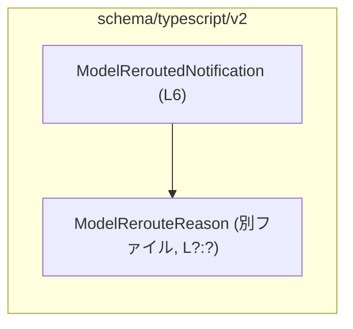
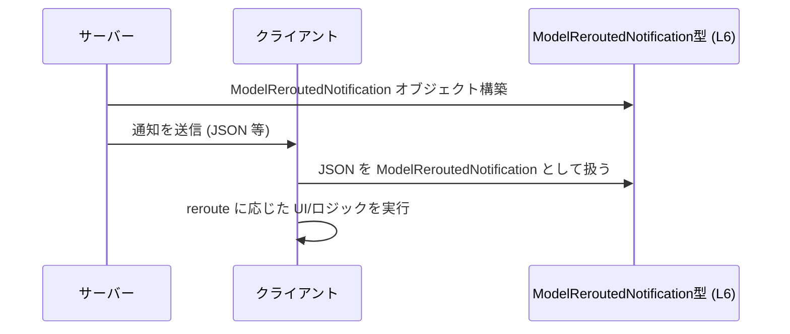

# app-server-protocol\schema\typescript\v2\ModelReroutedNotification.ts コード解説

## 0. ざっくり一言

`ModelReroutedNotification` は、モデルが「別のモデルへ切り替え（reroute）された」ことを表現する通知メッセージの **TypeScript 型エイリアス** です（`ModelReroutedNotification.ts:L6-6`）。  

---

## 1. このモジュールの役割

### 1.1 概要

- このモジュールは、`ModelReroutedNotification` という **1 つの公開型** を提供します（`ModelReroutedNotification.ts:L6-6`）。
- 型の構造は、「スレッド ID」「ターン ID」「切り替え前後のモデル名」「切り替え理由」をフィールドとして持つオブジェクトです（`ModelReroutedNotification.ts:L6-6`）。
- ファイル先頭のコメントから、この型定義は Rust 側から `ts-rs` により自動生成されたものであり、手動で編集しない前提になっています（`ModelReroutedNotification.ts:L1-3`）。

### 1.2 アーキテクチャ内での位置づけ

このファイル単体から分かる依存関係は、「`ModelReroutedNotification` が `ModelRerouteReason` 型を利用している」ことだけです（`ModelReroutedNotification.ts:L4-4, L6-6`）。他モジュールからこの型がどのように利用されているかは、このチャンクには現れません。



> 説明: `ModelReroutedNotification` 型（本ファイル定義, `L6`）が、別ファイルで定義されている `ModelRerouteReason` 型を `import type` で参照しています（`ModelReroutedNotification.ts:L4-4`）。  

この型を誰が送受信し、どのような通信プロトコルで使うかは、このチャンクには現れないため不明です。  
ファイルパス名（`app-server-protocol/schema`）からは、アプリケーションサーバーの通信プロトコル用スキーマの一部と推測できますが、コードからの確定情報ではありません。

### 1.3 設計上のポイント

コードから読み取れる特徴は次のとおりです。

- **自動生成コード**  
  - 先頭コメントで `GENERATED CODE! DO NOT MODIFY BY HAND!` と明示されており（`ModelReroutedNotification.ts:L1-1`）、`ts-rs` により生成されています（`ModelReroutedNotification.ts:L3-3`）。
  - 変更は元の Rust 側定義に対して行い、再生成する想定と解釈できます（コメントに基づく推測）。
- **プレーンなオブジェクト型エイリアス**  
  - `export type ModelReroutedNotification = { ... }` という形式で、クラスや関数を持たない純粋なデータコンテナです（`ModelReroutedNotification.ts:L6-6`）。
- **すべて必須プロパティ**  
  - オプショナル（`?`）や `undefined` の指定は無く、5 つのプロパティがすべて必須です（`ModelReroutedNotification.ts:L6-6`）。
- **理由は専用の列挙/ユニオン型で表現**  
  - `reason` フィールドのみ、外部型 `ModelRerouteReason` を利用しており（`ModelReroutedNotification.ts:L4-4, L6-6`）、理由表現が文字列のままではなく、より限定された型で管理されていることが分かります。
- **状態やロジックを持たない**  
  - フィールド定義だけであり、メソッド・関数・クラス・状態管理は一切ありません。

---

## 2. 主要な機能一覧

このファイルが提供する機能は 1 点です。

- `ModelReroutedNotification` 型: モデルの reroute に関する通知ペイロードの構造を表す TypeScript 型エイリアス（`ModelReroutedNotification.ts:L6-6`）。

### 2.1 コンポーネントインベントリー

このチャンクに現れる型・モジュール要素を一覧します。

| 名前                         | 種別                | 公開/非公開 | 役割 / 用途                                                                                       | 根拠 |
|------------------------------|---------------------|------------|----------------------------------------------------------------------------------------------------|------|
| `ModelReroutedNotification`  | 型エイリアス（オブジェクト） | 公開 (`export`) | モデル reroute 通知メッセージのデータ構造を表す。5 つの必須フィールドを持つ。                          | `ModelReroutedNotification.ts:L6-6` |
| `ModelRerouteReason`         | 型（詳細不明）      | 外部インポート | `reason` プロパティの型として利用される「reroute 理由」を表す型。定義は別ファイルで行われている。 | `ModelReroutedNotification.ts:L4-4, L6-6` |

関数・クラス・列挙体などは、このチャンクには現れません。

---

## 3. 公開 API と詳細解説

### 3.1 型一覧（構造体・列挙体など）

| 名前                        | 種別        | 役割 / 用途                                         | フィールド概要                                                                                                                                 | 根拠 |
|-----------------------------|-------------|------------------------------------------------------|-----------------------------------------------------------------------------------------------------------------------------------------------|------|
| `ModelReroutedNotification` | 型エイリアス | モデル reroute 通知ペイロードの構造を表現する型     | `threadId: string`, `turnId: string`, `fromModel: string`, `toModel: string`, `reason: ModelRerouteReason` の 5 フィールドを持つオブジェクト | `ModelReroutedNotification.ts:L6-6` |

#### `ModelReroutedNotification`

**概要**

`ModelReroutedNotification` は、次の 5 つの必須プロパティを持つオブジェクト型です（`ModelReroutedNotification.ts:L6-6`）。

- `threadId: string`
- `turnId: string`
- `fromModel: string`
- `toModel: string`
- `reason: ModelRerouteReason`

名前から、ある「スレッド」の中の特定の「ターン」において、`fromModel` から `toModel` へモデルが切り替えられた理由を表す通知メッセージと解釈できますが、詳細な意味やドメイン仕様はこのファイルからは分かりません（プロパティ名とパス名に基づく推測）。

**フィールド**

| フィールド名   | 型                   | 説明（コードから読み取れる範囲）                                                                                                  | 根拠 |
|----------------|----------------------|-------------------------------------------------------------------------------------------------------------------------------|------|
| `threadId`     | `string`             | スレッドを識別する ID を文字列で表すと考えられるフィールド。型としては任意の文字列を許容する。                                     | `ModelReroutedNotification.ts:L6-6` |
| `turnId`       | `string`             | スレッド内のターンを識別する ID を文字列で表すと考えられるフィールド。型としては任意の文字列を許容する。                             | `ModelReroutedNotification.ts:L6-6` |
| `fromModel`    | `string`             | reroute 前のモデルを表す文字列。具体的なフォーマット（例: モデル名、ID）はこのチャンクからは不明。                                   | `ModelReroutedNotification.ts:L6-6` |
| `toModel`      | `string`             | reroute 後のモデルを表す文字列。フォーマットの制約はこのチャンクでは分からない。                                                    | `ModelReroutedNotification.ts:L6-6` |
| `reason`       | `ModelRerouteReason` | reroute が行われた理由を表す型。列挙体またはユニオン型である可能性が高いが、定義は別ファイルであり、このチャンクには現れない。       | `ModelReroutedNotification.ts:L4-4, L6-6` |

**型としてのふるまい**

- すべてのプロパティが **必須** です（オプショナル修飾子 `?` が付いていないため, `ModelReroutedNotification.ts:L6-6`）。
- TypeScript のコンパイル時には、これらのプロパティが存在し、指定された型に一致することがチェックされます。
- 実行時には JavaScript のプレーンオブジェクトであり、型情報は存在しません。したがって、外部入力からのデータについては別途ランタイム検証が必要になる可能性があります（一般的な TypeScript の仕様に基づく説明）。

**Examples（使用例）**

> この例の `sendNotification` 関数は、このファイルには定義されていない仮の関数です。通知の送り方の一例として示します。

```typescript
// ModelReroutedNotification 型をインポートする
import type { ModelReroutedNotification } from "./ModelReroutedNotification"; // 同一ディレクトリ想定

// reroute 通知を作成して送信する仮の関数
function notifyModelReroute(
    sendNotification: (msg: ModelReroutedNotification) => void, // 通知送信用コールバック
) {
    const notification: ModelReroutedNotification = {  // 型エイリアスに従ったオブジェクトを構築
        threadId: "thread-123",                        // スレッドを識別する ID（例）
        turnId: "turn-5",                              // ターン ID（例）
        fromModel: "gpt-4.1-mini",                     // 切り替え前モデル名（例）
        toModel: "gpt-4.1",                            // 切り替え後モデル名（例）
        reason: "LoadBalancing" as any,                // 実際は ModelRerouteReason 型の値を指定する（ここでは擬似的に any から代入）
    };

    sendNotification(notification);                    // 通知を送信する
}
```

> `ModelRerouteReason` の具体的な値は、このチャンクには現れないため、上記例では `as any` を使っています。実際には `ModelRerouteReason` の定義に従った値を使用する必要があります。

**Edge cases（エッジケース）**

この型自体は静的な構造定義のみのため、「エッジケース」は主に入力データの内容に関するものになります。

- **空文字列**  
  - `threadId`, `turnId`, `fromModel`, `toModel` は単なる `string` 型であり、空文字列 `""` も静的型チェック上は許容されます。
  - 空文字列を許可するかどうかはアプリケーション側のドメインルールで決まります。このファイルからは判断できません。
- **不正な ID / モデル名**  
  - 型レベルではフォーマットを制約していないため、存在しない ID やモデル名も `string` としては通ってしまいます。
- **`reason` の不正値**  
  - TypeScript 上で `reason` に `ModelRerouteReason` 以外の値を代入するとコンパイルエラーになりますが、実行時に外部から JSON をパースする場合などは、ランタイムでの検証を別途行う必要があります。
- **プロパティ欠落**  
  - いずれかのプロパティが欠落したオブジェクトを `ModelReroutedNotification` として扱うと、TypeScript の型チェックでエラーになります（コンパイル時）。  

**使用上の注意点**

- **自動生成ファイルのため直接編集しないこと**  
  - `GENERATED CODE! DO NOT MODIFY BY HAND!` と明記されているため（`ModelReroutedNotification.ts:L1-1`）、型の変更は元の Rust 定義や `ts-rs` 側に対して行う必要があります。
- **ランタイム検証は別途必要**  
  - TypeScript の型はコンパイル時のみ有効であり、実行時には検証されません。外部からの入力（JSON など）に対しては、`zod` や `io-ts`、もしくはハンドコードによるバリデーションが必要になる場合があります。
- **`ModelRerouteReason` の定義に依存**  
  - `reason` フィールドの取りうる値や意味は `ModelRerouteReason` 次第であり、このファイルだけでは判断できません。この型を利用する際には、`ModelRerouteReason` の定義も合わせて参照する必要があります。
- **並行性に関する注意点は特になし**  
  - この型はイミュータブルなオブジェクト型を想定しており、スレッドやイベントループに関わる状態を持ちません。JavaScript/TypeScript の一般的なオブジェクトと同様に扱えます。

### 3.2 関数詳細（最大 7 件）

このファイルには関数定義が存在しません（`ModelReroutedNotification.ts:L1-6` 全体を見ても `function` / `=>` を含む関数宣言が無い）。

### 3.3 その他の関数

補助関数やラッパー関数も、このチャンクには現れません。

---

## 4. データフロー

このファイル単体からは、具体的な呼び出し元・呼び出し先は分かりませんが、パス名と型名から想定される典型的なデータフローの一例を示します（あくまで利用イメージであり、このチャンクから直接は読み取れない点に注意してください）。

- サーバー側でモデル reroute が発生する。
- サーバーが `ModelReroutedNotification` 型に従ったオブジェクトを構築する（構造は `L6` に従う）。
- それを JSON 等にシリアライズしてクライアントへ送信する。
- クライアント側 TypeScript コードで、この型を使って通知を受け取り、ハンドリングする。



> 再度強調すると、上のシーケンスは型名とファイルパスに基づく典型的な利用イメージであり、このチャンクだけから確定できる仕様ではありません。

---

## 5. 使い方（How to Use）

### 5.1 基本的な使用方法

`ModelReroutedNotification` を利用する基本パターンは「関数の引数や戻り値、変数の型注釈として利用する」です。

```typescript
// 型をインポートする
import type { ModelReroutedNotification } from "./ModelReroutedNotification"; // このファイル自身（相対パス）

// 通知を処理する関数の例
function handleReroutedNotification(
    notification: ModelReroutedNotification,  // 型注釈により構造が保証される
) {
    // プロパティを安全に参照できる（すべて必須フィールド）
    console.log("thread:", notification.threadId); // string として扱える
    console.log("turn:", notification.turnId);
    console.log("from:", notification.fromModel);
    console.log("to:", notification.toModel);
    console.log("reason:", notification.reason);   // ModelRerouteReason 型
}
```

このように型注釈を付けておくことで、プロパティ名のタイプミスや型の取り違えをコンパイル時に検出できます。

### 5.2 よくある使用パターン

1. **イベントハンドラのペイロード型として使う**

```typescript
type ModelReroutedHandler = (payload: ModelReroutedNotification) => void; // イベントハンドラ型

const handlers: ModelReroutedHandler[] = []; // ハンドラの配列
```

1. **配列・ストリームとして複数件を扱う**

```typescript
const notificationQueue: ModelReroutedNotification[] = []; // キューとして保持

function enqueueNotification(n: ModelReroutedNotification) {
    notificationQueue.push(n);
}
```

1. **RPC / API クライアントのレスポンス型として使う**

```typescript
async function fetchRerouteEvents(): Promise<ModelReroutedNotification[]> {
    // 実装はこのファイルには存在しない仮のもの
    const res = await fetch("/api/reroute-events");
    const json = await res.json();
    // json の検証は別途必要
    return json as ModelReroutedNotification[];
}
```

### 5.3 よくある間違い

TypeScript 初学者に起こりそうな誤用例と正しい例です。

```typescript
// 誤り例: プロパティを欠落させている
const invalidNotification: ModelReroutedNotification = {
    threadId: "thread-1",
    turnId: "turn-1",
    fromModel: "model-a",
    // toModel が無い
    // reason も無い
    // → TypeScript の型チェックでエラーになる
};

// 正しい例: すべての必須プロパティを指定する
const validNotification: ModelReroutedNotification = {
    threadId: "thread-1",
    turnId: "turn-1",
    fromModel: "model-a",
    toModel: "model-b",
    reason: "SomeReason" as any, // 実際は ModelRerouteReason の有効な値を使う
};
```

```typescript
// 誤り例: any を使って型安全性を失っている
function handleAny(payload: any) {               // any のため、プロパティミスが検出されない
    console.log(payload.threadID);              // threadId のタイプミスだが、コンパイルは通ってしまう
}

// 正しい例: ModelReroutedNotification 型を使う
function handleTyped(payload: ModelReroutedNotification) {
    console.log(payload.threadId);              // 正しいプロパティ名。タイプミスするとコンパイルエラーになる
}
```

### 5.4 使用上の注意点（まとめ）

- **自動生成コードを直接編集しない**（`ModelReroutedNotification.ts:L1-3`）。
- **外部入力に対してはランタイム検証を行う**（型はコンパイル時のみ）。
- **`ModelRerouteReason` の定義も合わせて参照する**（理由の値と意味付けはそちらに依存する）。
- **文字列フィールドのフォーマットは別途仕様で管理する**（`string` 型だけでは妥当性を保証しない）。
- **並行性やスレッド安全性の問題は特にない**（単なるデータ型であり、共有状態を持たない）。

---

## 6. 変更の仕方（How to Modify）

### 6.1 新しい機能を追加する場合

このファイルは `ts-rs` によって生成されるため、**直接編集するべきではありません**（`ModelReroutedNotification.ts:L1-3`）。

新しいフィールドを追加したい場合の一般的な手順は次のようになります（`ts-rs` の一般的なワークフローに基づく説明であり、このチャンクだけからは詳細は不明です）。

1. **Rust 側の元定義を変更する**  
   - おそらく Rust の構造体や型に `#[ts(export)]` などの属性が付与されており、そこにフィールドを追加する。
2. **`ts-rs` による再生成を行う**  
   - ビルドスクリプトや生成スクリプトを実行し、このファイルを再生成する。
3. **TypeScript 側の利用箇所のコンパイルを通す**  
   - 新フィールドが必須になった場合、利用箇所がコンパイルエラーになるので、適宜対応する。

このチャンクには Rust 側の定義や生成スクリプトは現れないため、具体的なファイルパスやコマンドは不明です。

### 6.2 既存の機能を変更する場合

`threadId` を別名に変える、`fromModel`/`toModel` の型を `string` 以外に変える、といった変更も **元定義側で行い、再生成** する必要があります。

変更時の注意点（この型から読み取れる範囲での契約）:

- **フィールド名の変更**  
  - 既存のクライアントコードは旧フィールド名を前提としているため、型の互換性が失われます。
- **型の変更**  
  - 例えば `threadId: string` を `number` に変えると、すべての利用箇所でコンパイルエラーになります。API バージョニングが必要になる可能性があります。
- **フィールドの削除**  
  - 既存コードで使用されているフィールドを削除すると、コンパイルエラーに加えてサーバー/クライアント間のプロトコル非互換を引き起こす可能性があります。

---

## 7. 関連ファイル

このチャンクから分かる関連ファイルは、インポートされている `ModelRerouteReason` のみです。

| パス / 識別子                    | 役割 / 関係 |
|----------------------------------|------------|
| `./ModelRerouteReason`           | `reason` プロパティの型として利用される外部型。列挙体やユニオン型などで reroute 理由を定義していると推測されますが、定義内容はこのチャンクには現れません（`ModelReroutedNotification.ts:L4-4`）。 |

テストコードやその他のユーティリティは、このチャンクには現れないため不明です。

---

### Bugs / Security / Contracts / Tests / Performance について

- **Bugs**  
  - このファイルは純粋な型定義のみで実行ロジックを持たないため、ロジック上のバグは存在しません。
- **Security**  
  - 型定義自体にはセキュリティ上の懸念はありませんが、外部からの入力データをこの型にマッピングする際に検証を行わないと、不正な値がアプリケーション内に入り得ます（一般的な TypeScript の注意点）。
- **Contracts / Edge Cases**  
  - 契約として「5 つのフィールドが必須であり、それぞれ指定の型である」ことがコンパイル時に保証されます。
  - 値の妥当性までは保証されない点がエッジケースの源になります。
- **Tests**  
  - このチャンクにはテストコードは現れません。
  - 型の整合性は TypeScript コンパイラがチェックするため、型そのものに対するユニットテストは通常不要です。
- **Performance / Scalability**  
  - 単なる型エイリアスであり、実行時オーバーヘッドはありません。大量にインスタンス化しても、通常のオブジェクトと同等です。
