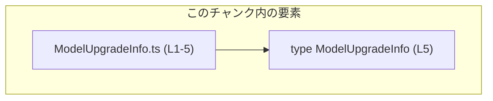
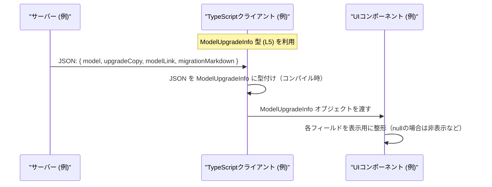

# app-server-protocol/schema/typescript/v2/ModelUpgradeInfo.ts コード解説

## 0. ざっくり一言

- モデルのアップグレードに関するメタ情報（モデル名、コピー文言、リンク、マイグレーション説明など）を表現する **TypeScript のデータ型（型エイリアス）** を定義する自動生成ファイルです（`ModelUpgradeInfo.ts:L1-5`）。

---

## 1. このモジュールの役割

### 1.1 概要

- このモジュールは、アプリケーションサーバーのプロトコル層で使われると考えられる構造化データ **`ModelUpgradeInfo`** の **型定義** を提供します（`ModelUpgradeInfo.ts:L5-5`）。
- ロジックや関数は一切含まず、**クライアント側 TypeScript コードから参照されるスキーマ** としての役割に特化しています。
- ファイル先頭コメントから、この型は Rust 側から `ts-rs` により **自動生成される** ことが明示されています（`ModelUpgradeInfo.ts:L1-3`）。

### 1.2 アーキテクチャ内での位置づけ

このチャンクに現れているのは、生成された型定義のみであり、他モジュールとの具体的な依存関係（どこからインポートされるか等）はコードからは分かりません。

依存関係として分かる事実は次の通りです。

- このファイル自身は **他の TypeScript モジュールを import していません**（`ModelUpgradeInfo.ts:L1-5`）。
- コメントから、Rust コード＋`ts-rs` ツールチェーンに **生成元として依存**していることが分かります（`ModelUpgradeInfo.ts:L1-3`）。

これを、このチャンク内で確認できる範囲に限定して図示すると次のようになります。



※ `ModelUpgradeInfo` をどのモジュールが利用しているかは、このチャンクには現れないため **不明** です。

### 1.3 設計上のポイント

コードから読み取れる設計上の特徴は次の通りです。

- **データのみを表す型**  
  - 関数やクラスはなく、`ModelUpgradeInfo` という 1 つの型エイリアスのみを定義しています（`ModelUpgradeInfo.ts:L5-5`）。
- **null 許容フィールドによる可変情報**  
  - 4 つのプロパティのうち 3 つが `string | null` となっており、「存在しない場合がある」情報を型で表現しています（`ModelUpgradeInfo.ts:L5-5`）。
- **自動生成ファイルであることの明示**  
  - 「手で編集しない」ことがコメントで明記されており（`ModelUpgradeInfo.ts:L1-3`）、変更は生成元（Rust＋`ts-rs`）側で行う前提になっています。
- **状態やエラー処理、並行性のロジックは持たない**  
  - 実行時ロジックがないため、エラーハンドリングや並行性に関する設計要素はここには存在しません。

---

## 2. 主要な機能一覧

このモジュールは型定義のみを提供しており、「機能」は型レベルのものに限られます。

- `ModelUpgradeInfo` 型: モデルアップグレードに関する情報の構造（4 プロパティ）を定義する型エイリアスです。

---

## 3. 公開 API と詳細解説

### 3.1 型一覧（構造体・列挙体など）

このファイルで公開されている型は 1 つです。

| 名前                | 種別        | フィールド / 概要                                                                                                                                                             | 定義位置                     |
|---------------------|-------------|------------------------------------------------------------------------------------------------------------------------------------------------------------------------------|------------------------------|
| `ModelUpgradeInfo`  | 型エイリアス | モデルアップグレードに関する情報を保持するオブジェクト型。`model`（文字列）と、`upgradeCopy` / `modelLink` / `migrationMarkdown`（文字列または `null`）を含みます。 | `ModelUpgradeInfo.ts:L5-5`   |

`ModelUpgradeInfo` のプロパティ詳細は次の通りです（用途は命名からの推測を含むため、その旨を明記します）。

| プロパティ名          | 型               | 説明                                                                                                                                                                | 根拠 |
|-----------------------|------------------|---------------------------------------------------------------------------------------------------------------------------------------------------------------------|------|
| `model`               | `string`         | モデルを識別する文字列です。命名からは「モデル名または ID」を表すと考えられますが、コードからは用途を断定できません。                                             | `ModelUpgradeInfo.ts:L5-5` |
| `upgradeCopy`         | `string \| null` | アップグレードに関連する文言を表すと考えられるフィールドです。存在しない場合は `null` がセットされる前提が型として表現されています。用途の詳細はコードからは不明です。 | `ModelUpgradeInfo.ts:L5-5` |
| `modelLink`           | `string \| null` | モデルに関するリンク URL を表すように見えるフィールドです。リンクが無い場合は `null` となり得ます。実際に URL かどうかはコードからは断定できません。              | `ModelUpgradeInfo.ts:L5-5` |
| `migrationMarkdown`   | `string \| null` | マイグレーション手順などを Markdown 形式で記述した文字列を想定させるフィールド名です。情報が無い場合は `null` となり得ます。具体的な内容はコードからは不明です。   | `ModelUpgradeInfo.ts:L5-5` |

> **TypeScript 的な観点**  
>
> - `string \| null` は「文字列であるか、まったく値が存在しない（`null`）か」を表す**ユニオン型**です。  
> - 非 `null` として扱うには、呼び出し側で **null チェック（型ガード）** を行う必要があります。

### 3.2 関数詳細（最大 7 件）

このファイルには **関数・メソッド・クラスコンストラクタなどの実行時ロジックは一切定義されていません**（`ModelUpgradeInfo.ts:L1-5`）。

そのため、関数詳細テンプレートに沿って解説すべき公開関数は **該当なし** となります。

### 3.3 その他の関数

- 補助関数やユーティリティ関数も、このファイルには存在しません（`ModelUpgradeInfo.ts:L1-5`）。

---

## 4. データフロー

このチャンクには関数やメソッドが存在しないため、**実際の処理フローや呼び出し関係はコードからは特定できません**。

ここでは、`ModelUpgradeInfo` 型の **一般的な利用イメージ** を示すための概念的なデータフロー例を示します。  
※ 以下は、この型を使うときにありそうなパターンの一例であり、**実際のコードベースにこのまま存在するとは限りません**。

### 概念的な利用シナリオの例

想定シナリオ: サーバーがモデルのアップグレード情報を生成し、フロントエンドがそれを受け取って表示する場合。



この図は、**型チェックが行われるのは TypeScript のコンパイル時であり、実行時にはプレーンなオブジェクトとして扱われる**という点を示すものです。

---

## 5. 使い方（How to Use）

### 5.1 基本的な使用方法

`ModelUpgradeInfo` は単なるオブジェクト型なので、**関数の引数・戻り値・状態管理の型注釈**として利用する形が基本的な使い方になります。

以下は、`ModelUpgradeInfo` 型の値を受け取り、内容をログ出力する例です。  
インポートパスはあくまで例です。

```typescript
// ModelUpgradeInfo 型をインポートする（パスはプロジェクト構成に応じて変更が必要）      // 実際のパスはこのチャンクからは不明
import type { ModelUpgradeInfo } from "./ModelUpgradeInfo";                               // 型のみを使うため import type を使用

// モデルアップグレード情報を扱う関数の例                                                     // ModelUpgradeInfo を引数に取る関数
function logUpgradeInfo(info: ModelUpgradeInfo): void {                                   // info は ModelUpgradeInfo 型
    console.log("model:", info.model);                                                    // model は string 確定なのでそのまま使用可能

    if (info.upgradeCopy !== null) {                                                      // string | null なので null チェックが必要
        console.log("upgradeCopy:", info.upgradeCopy);                                    // 非 null であれば string として扱える
    }

    if (info.modelLink !== null) {                                                        // modelLink も string | null
        console.log("modelLink:", info.modelLink);                                        // URL であるかどうかは型的には保証されない
    }

    if (info.migrationMarkdown !== null) {                                                // migrationMarkdown も string | null
        console.log("migrationMarkdown:", info.migrationMarkdown);                        // クライアントで HTML に変換して表示する場合は XSS 等に注意
    }
}

// 関数に渡すための ModelUpgradeInfo 値を作る例                                               // 型に合うオブジェクトリテラルを作成
const exampleInfo: ModelUpgradeInfo = {                                                   // 4 つのプロパティすべてが必須
    model: "example-model-v2",                                                            // model は string
    upgradeCopy: "A newer, faster model is available.",                                   // 文字列または null
    modelLink: "https://example.com/models/example-model-v2",                             // 文字列または null
    migrationMarkdown: "- Step 1: Do this\n- Step 2: Do that",                            // Markdown と思われる文字列（実際の内容はプロジェクト依存）
};

logUpgradeInfo(exampleInfo);                                                              // 作成した値を関数に渡して利用
```

### 5.2 よくある使用パターン

1. **API レスポンスの型定義**

    ```typescript
    import type { ModelUpgradeInfo } from "./ModelUpgradeInfo";                           // 型エイリアスを読み込む

    // API クライアント関数の例（fetch などをラップ）                                         // 実際の実装はプロジェクト依存
    async function fetchModelUpgradeInfo(): Promise<ModelUpgradeInfo> {                   // 戻り値の Promise に型を設定
        const res = await fetch("/api/model-upgrade-info");                               // サーバーから JSON を取得
        const json = await res.json();                                                    // JSON をパース（型は any）
        return json as ModelUpgradeInfo;                                                  // as で型アサーション（実行時検証は別途必要）
    }
    ```

    - **注意**: `json as ModelUpgradeInfo` はコンパイル時の型チェックを通すためのものですが、実行時には構造が保証されません。  
      実際にはバリデーション（`zod` や `io-ts` など）を併用することが推奨されます。このファイルからは、そのような仕組みの有無は分かりません。

2. **UI コンポーネントのプロパティとして利用**

    ```typescript
    import type { ModelUpgradeInfo } from "./ModelUpgradeInfo";                           // 型定義をインポート

    interface Props {                                                                     // React コンポーネントの props 例
        info: ModelUpgradeInfo;                                                           // info プロパティに ModelUpgradeInfo を要求
    }

    function ModelUpgradeBanner({ info }: Props) {                                        // info には常に model が存在し、他は string | null
        return (
            <div>
                <h2>{info.model}</h2>                                                     {/* model は string */}
                {info.upgradeCopy && <p>{info.upgradeCopy}</p>}                           {/* null なら表示されない */}
                {info.modelLink && <a href={info.modelLink}>More details</a>}             {/* null でなければリンク表示 */}
            </div>
        );
    }
    ```

### 5.3 よくある間違い

`string | null` 型のプロパティを **null チェックせずに string として扱う**と、TypeScript のコンパイルエラーになります。

```typescript
import type { ModelUpgradeInfo } from "./ModelUpgradeInfo";

// 間違い例: null を考慮せずにそのまま使っている
function wrong(info: ModelUpgradeInfo) {
    // info.upgradeCopy.toUpperCase();   // コンパイルエラー: Object is possibly 'null'.
}

// 正しい例: null チェックを行う
function correct(info: ModelUpgradeInfo) {
    if (info.upgradeCopy !== null) {
        info.upgradeCopy.toUpperCase(); // ここでは upgradeCopy は string と推論される
    }
}
```

### 5.4 使用上の注意点（まとめ）

- **前提条件**
  - `ModelUpgradeInfo` 型の値は、少なくとも 4 つのプロパティ `model`, `upgradeCopy`, `modelLink`, `migrationMarkdown` を持つ必要があります（`ModelUpgradeInfo.ts:L5-5`）。
- **null の扱い**
  - `upgradeCopy` / `modelLink` / `migrationMarkdown` は `null` の可能性があるため、使用前に必ず null チェックを行う必要があります。
- **実行時検証の欠如**
  - TypeScript の型はコンパイル時のみ有効であり、外部からの JSON などをそのまま `ModelUpgradeInfo` として扱う場合、実行時に構造が異なっていても自動でエラーにはなりません。
- **セキュリティ（Markdown / リンク表示時）**
  - `migrationMarkdown` を HTML に変換してブラウザに表示する場合、一般論として XSS などのリスクがあります。このファイル単体からは実際の処理内容は分かりませんが、レンダリング時のサニタイズが必要か検討が必要です。
- **並行性・パフォーマンス**
  - この型自体はデータ構造のみであり、重い処理や I/O、共有状態を持ちません。そのため、並行性やパフォーマンス上の特別な懸念はありません。

---

## 6. 変更の仕方（How to Modify）

### 6.1 新しい機能を追加する場合

このファイルは自動生成であり、「手で編集しない」ことが明示されています（`ModelUpgradeInfo.ts:L1-3`）。  
したがって、新しいフィールドを追加するなどの変更は、**生成元（Rust コード＋`ts-rs` 設定）側で行う必要があります**。

一般的な手順（推測を含むため、その旨を明記します）:

1. **生成元の Rust 型を変更**  
   - `ModelUpgradeInfo` に対応する Rust の構造体や型に、新しいフィールドを追加・変更します。  
   - 実際の Rust ファイルの場所や名前はこのチャンクからは分かりません。
2. **`ts-rs` による再生成を実行**  
   - ビルドスクリプトや専用コマンドなどで `ts-rs` を実行し、TypeScript スキーマを再生成します。
3. **TypeScript 側の利用箇所を更新**
   - 新しいフィールドに対応する UI 表示やロジックを、利用側で追加します。

### 6.2 既存の機能を変更する場合

`ModelUpgradeInfo` のプロパティ型や名前を変更する場合も、**直接このファイルを書き換えるべきではありません**（`ModelUpgradeInfo.ts:L1-3`）。

変更時に注意すべき点:

- **契約（Contract）の維持**
  - `model` は現在 `string` として定義されており、この前提でクライアントコードが書かれていると考えられます。  
    ここを `string | null` に変更するなどの破壊的変更は、利用側すべてを見直す必要があります。
- **null 許容の意味**
  - `upgradeCopy` / `modelLink` / `migrationMarkdown` が `string | null` であることは、「値が存在しないことがある」という契約の一部になっています。  
    これを `string` のみにすると、サーバー側のレスポンスや既存データがその契約を満たさなくなる可能性があります。
- **影響範囲の確認**
  - TypeScript プロジェクト全体で `ModelUpgradeInfo` を検索し、どのように使われているかを確認してから変更することが望ましいです。
- **テスト**
  - このチャンクにはテストコードは含まれていません。  
    実際のプロジェクトでは、API レスポンスのスナップショットテストや型に依存したユニットテストがあれば、それらを更新する必要があります。

---

## 7. 関連ファイル

このチャンクには他ファイルの情報が含まれていないため、厳密な関連ファイルは特定できません。  
分かる範囲のみを列挙します。

| パス                                                    | 役割 / 関係                                                                                       |
|---------------------------------------------------------|--------------------------------------------------------------------------------------------------|
| `app-server-protocol/schema/typescript/v2/ModelUpgradeInfo.ts` | 本レポート対象ファイル。`ModelUpgradeInfo` 型エイリアスを定義する自動生成 TypeScript スキーマです。 |

- コメントから、生成元として Rust コードと `ts-rs` ツールが存在することは分かりますが、それらの具体的なファイルパスや構造は **このチャンクには現れません**。

---

### コンポーネントインベントリー（再掲）

最後に、このチャンク内の型・ロジックのインベントリーを根拠行番号付きで整理します。

| 種別        | 名前               | 役割 / 概要                                                                                                   | 定義位置                     |
|-------------|--------------------|----------------------------------------------------------------------------------------------------------------|------------------------------|
| 型エイリアス | `ModelUpgradeInfo` | モデルアップグレード情報（`model`, `upgradeCopy`, `modelLink`, `migrationMarkdown`）を表すオブジェクト型。ロジックは持たない純粋なデータ構造です。 | `ModelUpgradeInfo.ts:L5-5`   |

このファイルには関数やクラスが存在しないため、関数インベントリーは **空** です。
