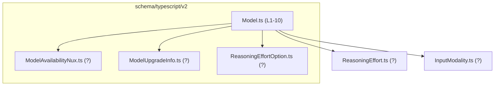
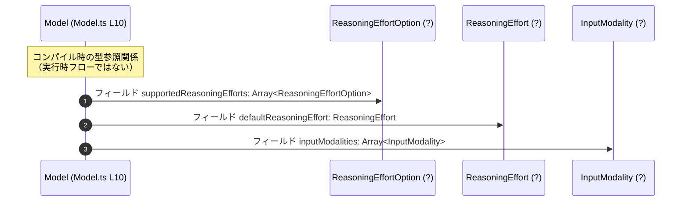

# app-server-protocol/schema/typescript/v2/Model.ts コード解説

## 0. ざっくり一言

- Rust 側の型から `ts-rs` により自動生成された、**「Model」というオブジェクトの TypeScript 型定義**だけを提供するファイルです。（根拠: `Model.ts:L1-3`, `Model.ts:L10-10`）
- モデルの識別子・表示名・説明文・推論設定・入力モダリティなど、**モデルに関するメタ情報を 1 つのオブジェクトとして表現**します。（根拠: `Model.ts:L10-10`）

---

## 1. このモジュールの役割

### 1.1 概要

- このモジュールは、アプリケーションサーバーのプロトコル層で利用する **`Model` 型のスキーマ**を TypeScript で提供します。（根拠: `Model.ts:L10-10`）
- ファイル先頭のコメントから、この型は **Rust 側の型定義から `ts-rs` によって機械的に生成される**ことが分かります。（根拠: `Model.ts:L1-3`）
- 実行ロジックや関数は一切含まれず、**静的な型情報のみ**を扱います。（根拠: `Model.ts:L4-10` に関数やクラスの定義が存在しない）

### 1.2 アーキテクチャ内での位置づけ

このファイルは `schema/typescript/v2` 配下にあり、他のスキーマ型と組み合わせて「v2 プロトコル」の型を構成していると解釈できます。

- 依存関係（インポート）:
  - `InputModality`（入力モダリティを表す型）（根拠: `Model.ts:L4`）
  - `ReasoningEffort`（推論負荷レベルを表す型）（根拠: `Model.ts:L5`）
  - `ModelAvailabilityNux`（利用可能性に関する情報を表す型）（根拠: `Model.ts:L6`）
  - `ModelUpgradeInfo`（アップグレード情報を表す型）（根拠: `Model.ts:L7`）
  - `ReasoningEffortOption`（選択肢としての推論負荷レベル）（根拠: `Model.ts:L8`）

アーキテクチャ上の型依存関係を簡略化して示すと、次のようになります。



> `(?)` としたファイルの行番号・中身は、このチャンクには現れません。

### 1.3 設計上のポイント

コードから読み取れる設計上の特徴は次のとおりです。

- **自動生成コードであることが明示**されており、手動編集は想定していません。（根拠: `Model.ts:L1-3`）
- `export type Model = { ... }` という **型エイリアスで、単一のオブジェクト型を公開**します。（根拠: `Model.ts:L10-10`）
- 状態やメソッドを持つクラスではなく、**不変データを表すプレーンな構造**として設計されています。（根拠: メソッド定義が存在しない `Model.ts:L4-10`）
- `null` を許容するプロパティとそうでないプロパティが混在し、**「プロパティは必ず存在するが値として `null` を取りうる」設計**になっています（例: `upgrade: string | null`）。（根拠: `Model.ts:L10-10`）
- 配列プロパティ（`Array<...>`）を通じて、**複数の選択肢やモダリティを表現する**構造になっています。（根拠: `supportedReasoningEfforts`, `inputModalities`, `additionalSpeedTiers` in `Model.ts:L10-10`）

---

## 2. 主要な機能一覧

このファイルは型定義のみを提供するため、「機能」はすべて **型レベルの表現力**に関するものです。

- `Model` 型の定義: モデルに紐づく各種情報（識別子・表示名・説明・アップグレード情報・推論設定・入力モダリティ等）を 1 つのオブジェクトで表現する。（根拠: `Model.ts:L10-10`）
- 他スキーマ型との連携: `Model` 内のプロパティとして、`InputModality`, `ReasoningEffort`, `ModelAvailabilityNux`, `ModelUpgradeInfo`, `ReasoningEffortOption` を参照する。（根拠: `Model.ts:L4-8`, `Model.ts:L10-10`）

---

## 3. 公開 API と詳細解説

### 3.1 型一覧（構造体・列挙体など）

#### 公開型

| 名前  | 種別                              | 役割 / 用途                                                                                     | 根拠 |
|-------|-----------------------------------|--------------------------------------------------------------------------------------------------|------|
| `Model` | 型エイリアス（オブジェクト型） | 1 つのモデルに関するメタ情報をまとめたオブジェクトを表現する型。フィールド群は下表の通り。 | `Model.ts:L10-10` |

#### 依存型（このファイル内には定義がないが、フィールドで参照されるもの）

| 名前                   | 種別        | このファイルにおける役割                            | 根拠             |
|------------------------|-------------|-----------------------------------------------------|------------------|
| `InputModality`        | 型（詳細不明） | `inputModalities` 配列要素の型                     | `Model.ts:L4`, `Model.ts:L10-10` |
| `ReasoningEffort`      | 型（詳細不明） | `defaultReasoningEffort` プロパティの型            | `Model.ts:L5`, `Model.ts:L10-10` |
| `ModelAvailabilityNux` | 型（詳細不明） | `availabilityNux` プロパティの型                   | `Model.ts:L6`, `Model.ts:L10-10` |
| `ModelUpgradeInfo`     | 型（詳細不明） | `upgradeInfo` プロパティの型                       | `Model.ts:L7`, `Model.ts:L10-10` |
| `ReasoningEffortOption`| 型（詳細不明） | `supportedReasoningEfforts` 配列要素の型           | `Model.ts:L8`, `Model.ts:L10-10` |

これらの依存型の中身は **このチャンクには現れない**ため、詳細な構造や意味は分かりません。

---

### 3.1.1 `Model` 型フィールド詳細

`Model` 型の各プロパティは以下の通りです。（すべて `Model.ts:L10-10` に定義）

| プロパティ名               | 型                                     | 必須 / null許容              | 説明（プロパティ名からの解釈レベル） |
|---------------------------|----------------------------------------|------------------------------|--------------------------------------|
| `id`                      | `string`                               | 必須・null 非許容            | モデルを一意に識別する ID 文字列と解釈できます。 |
| `model`                   | `string`                               | 必須・null 非許容            | モデル名または内部的なモデル識別子と解釈できます。 |
| `upgrade`                 | `string \| null`                       | 必須・値として null 許容     | アップグレード先モデルを示す文字列（ない場合は `null`）と解釈できます。 |
| `upgradeInfo`             | `ModelUpgradeInfo \| null`            | 必須・値として null 許容     | アップグレードに関する詳細情報（ない場合は `null`）と解釈できます。 |
| `availabilityNux`         | `ModelAvailabilityNux \| null`        | 必須・値として null 許容     | 利用可能性に関する追加情報（ない場合は `null`）と解釈できます。 |
| `displayName`             | `string`                               | 必須・null 非許容            | ユーザー向けに表示するモデル名と解釈できます。 |
| `description`             | `string`                               | 必須・null 非許容            | モデルの説明文と解釈できます。 |
| `hidden`                  | `boolean`                              | 必須・null 非許容            | 一覧等から非表示かどうかを示すフラグと解釈できます。 |
| `supportedReasoningEfforts` | `Array<ReasoningEffortOption>`      | 必須・null 非許容            | 利用可能な推論負荷レベルの選択肢一覧と解釈できます。 |
| `defaultReasoningEffort`  | `ReasoningEffort`                      | 必須・null 非許容            | デフォルトの推論負荷設定と解釈できます。 |
| `inputModalities`         | `Array<InputModality>`                 | 必須・null 非許容            | このモデルが対応する入力モダリティ（テキスト等）の一覧と解釈できます。 |
| `supportsPersonality`     | `boolean`                              | 必須・null 非許容            | 「パーソナリティ」機能をサポートするかどうかのフラグと解釈できます。 |
| `additionalSpeedTiers`    | `Array<string>`                        | 必須・null 非許容            | 追加の速度ティア（ラベル）一覧と解釈できます。 |
| `isDefault`               | `boolean`                              | 必須・null 非許容            | デフォルトモデルかどうかのフラグと解釈できます。 |

> 補足: 各プロパティの**厳密なビジネス仕様（値のフォーマット、制約、意味）はこのファイルからは分かりません**。上記の説明はプロパティ名からの解釈にとどまります。（根拠: `Model.ts:L10-10` にコメントや補足説明が存在しない）

---

### 3.2 関数詳細（最大 7 件）

このファイルには **関数・メソッドは一切定義されていません**。（根拠: `Model.ts:L4-10` に `function`, `=>` を含む関数宣言がない）

そのため、関数詳細テンプレートに沿って解説すべき対象はありません。

---

### 3.3 その他の関数

- 補助関数・ラッパー関数も定義されていません。（根拠: `Model.ts:L4-10`）

---

## 4. データフロー

このファイル単体では実行時の処理フローは定義されていないため、ここでは **型間の依存関係としての「データ構造の流れ」**を示します。

- `Model` オブジェクトは、いくつかの基本型（`string`, `boolean`）と、外部定義の複合型（`InputModality`, `ReasoningEffort` など）から構成されます。（根拠: `Model.ts:L4-8`, `Model.ts:L10-10`）
- コンパイル時には、`Model` 型を利用するコードが、それぞれのフィールド型に従って値を設定・参照することで整合性が保証されます。

型レベルの依存関係を sequence diagram 風に表現すると次のようになります。



> `ReasoningEffortOption`, `ReasoningEffort`, `InputModality` の具体的な中身や、実際の API 呼び出しフローは、このチャンクには現れません。

---

## 5. 使い方（How to Use）

### 5.1 基本的な使用方法

`Model` 型を利用した、基本的なオブジェクト生成と利用例です。

```typescript
// Model 型をインポートする                                  // 型のみインポートする（パスはプロジェクト構成に応じて調整）
import type { Model } from "./Model";

// Model 型の値を定義する                                   // すべての必須フィールドに値を設定する
const exampleModel: Model = {
    id: "model-001",                                       // モデル ID
    model: "gpt-example",                                  // 内部モデル名
    upgrade: null,                                         // アップグレード先がなければ null
    upgradeInfo: null,                                     // 詳細情報もない場合は null
    availabilityNux: null,                                 // NUX 情報がなければ null
    displayName: "Example Model",                          // 表示名
    description: "Example model for demonstration",        // 説明文
    hidden: false,                                         // 一覧に表示する場合は false
    supportedReasoningEfforts: [],                         // 選択肢がなければ空配列
    defaultReasoningEffort: "medium" as any,               // 実際は ReasoningEffort 型に合う値を渡す
    inputModalities: [],                                   // 対応モダリティの配列
    supportsPersonality: false,                            // パーソナリティ未対応なら false
    additionalSpeedTiers: [],                              // 追加速度ティアがなければ空配列
    isDefault: false,                                      // デフォルトでなければ false
};

// 利用側のコード例                                        // 型情報によって補完・型チェックが効く
function logModelInfo(model: Model) {
    console.log(model.displayName);                        // displayName は string として利用できる
    console.log(model.description);                        // description も string
    if (model.upgrade !== null) {                          // null 許容フィールドは null チェックが必要
        console.log("Upgradeable to:", model.upgrade);
    }
}
```

- `defaultReasoningEffort` などの外部型部分は、このチャンクでは具体的な列挙値や構造が不明なため、サンプルでは `as any` で型チェックを回避しています。
- 実プロジェクトでは、**対応する型の定義を確認し、正しい値を渡す必要があります**（この情報はこのチャンクには現れません）。

### 5.2 よくある使用パターン

#### パターン 1: モデル一覧から「表示すべき」モデルだけを抽出する

```typescript
import type { Model } from "./Model";

// Model 配列を受け取り、hidden=false のものだけに絞り込む
function visibleModels(models: Model[]): Model[] {
    return models.filter(m => !m.hidden);  // hidden は boolean なので単純な条件で扱える
}
```

- `hidden` の具体的な意味（UI に出すか、選択可能かなど）はこのファイルからは分かりませんが、**ブール値フラグとして利用できる**ことは型から読み取れます。（根拠: `Model.ts:L10-10`）

#### パターン 2: null 許容フィールドの利用

```typescript
import type { Model } from "./Model";

function getUpgradeLabel(model: Model): string {
    // upgradeInfo が null でない場合だけ、何らかのラベルを生成する
    if (model.upgradeInfo !== null) {           // null チェックを行う
        // 実際のフィールド構造はこのチャンクでは不明
        return "Upgradeable";                  // 仮のラベル
    }
    return "No upgrade";
}
```

- `upgrade`, `upgradeInfo`, `availabilityNux` はいずれも `... | null` なので、**利用前に null チェックを行う必要がある**ことが型から分かります。（根拠: `Model.ts:L10-10`）

### 5.3 よくある間違い

#### 間違い例: null 許容を考慮しない

```typescript
// 間違い例: upgrade が常に string と仮定している
function getUpgradeString_bad(model: Model): string {
    return model.upgrade.toUpperCase();  // コンパイルエラー: 'string | null' には toUpperCase がない可能性
}
```

#### 正しい例: null を明示的に扱う

```typescript
// 正しい例: null の場合をハンドリングする
function getUpgradeString(model: Model): string {
    if (model.upgrade === null) {
        return "No upgrade";
    }
    return model.upgrade.toUpperCase();  // ここでは upgrade は string 型に絞り込まれている
}
```

#### 間違い例: 自動生成ファイルを直接編集する

```typescript
// 間違い例: Model.ts に手でプロパティを追加・削除する
// GENERATED CODE! DO NOT MODIFY BY HAND!   ← 冒頭コメントに反する
```

- `ts-rs` による自動生成コードは、**元の Rust 側定義を変更して再生成する**ことが前提です。（根拠: `Model.ts:L1-3`）
- 直接編集すると、次回の自動生成で上書きされる可能性が高く、**変更が失われる危険**があります。

### 5.4 使用上の注意点（まとめ）

- このファイルは **自動生成コード**であり、**直接編集しないことが前提**です。（根拠: `Model.ts:L1-3`）
- `null` 許容フィールド（`upgrade`, `upgradeInfo`, `availabilityNux`）は、**常に null チェックを行う**必要があります。（根拠: `Model.ts:L10-10`）
- 配列フィールド（`supportedReasoningEfforts`, `inputModalities`, `additionalSpeedTiers`）は、**空配列と `null` は区別**されます。この型では `null` は許容されず、必ず配列として存在します。（根拠: `Model.ts:L10-10`）
- この型自体は関数や I/O を持たないため、**スレッド安全性や並行性に関する制約はありません**。ただし、`Model` をどのように共有・更新するかは利用側の設計に依存します。
- セキュリティや認可ロジックは一切含まれていません。`hidden`, `isDefault` などのフラグの解釈によってはアクセス制御に関わる可能性がありますが、**具体的な意味はこのファイルからは分かりません**。

---

## 6. 変更の仕方（How to Modify）

### 6.1 新しい機能を追加する場合

このファイルは `ts-rs` による自動生成コードのため、**直接編集ではなく生成元（Rust 側）を変更する**ことが前提です。（根拠: `Model.ts:L1-3`）

一般的な手順の例（このファイルから読み取れる範囲での説明です）:

1. Rust 側で `Model` に対応する構造体（おそらく `struct Model` 等）を探す。  
   → Rust ソースはこのチャンクには現れないため、実際の場所は不明です。
2. その構造体にフィールドを追加し、`ts-rs` 用の属性が付いている場合は必要に応じて設定を更新する。
3. `ts-rs` のコード生成コマンドを実行し、`Model.ts` を再生成する。
4. 生成された `Model.ts` を確認し、新しいフィールドが `export type Model = { ... }` に追加されていることを確認する。（根拠: `Model.ts:L10-10` の構造）

### 6.2 既存の機能を変更する場合

`Model` 型のフィールドを変更する場合の注意点:

- **型の互換性**  
  - フィールド名の変更や削除は、`Model` を利用するすべての TypeScript コードに影響します。
  - シリアライズされたデータ（JSON など）との互換性も失われる可能性がありますが、その詳細はこのチャンクには現れません。
- **null 許容性の変更**  
  - `string | null` を `string` のみに変更するなどの修正は、**利用側に null チェックを追加させていた前提を壊す場合があります**。
- **テスト**  
  - このファイル自体にはテストコードは含まれていませんが、`Model` を利用するコードのテストを更新する必要があります。（テストファイルはこのチャンクには現れません）

---

## 7. 関連ファイル

このファイルと密接に関係するファイルは、インポートから判断できます。

| パス                          | 役割 / 関係                                                            | 根拠 |
|-------------------------------|------------------------------------------------------------------------|------|
| `schema/typescript/v2/Model.ts` | 本ファイル。`Model` 型の TypeScript 定義を自動生成する。           | `Model.ts:L1-10` |
| `schema/typescript/InputModality.ts` （想定） | `InputModality` 型を定義し、`inputModalities` フィールドで参照される。中身はこのチャンクには現れない。 | `Model.ts:L4`, `Model.ts:L10-10` |
| `schema/typescript/ReasoningEffort.ts` （想定） | `ReasoningEffort` 型を定義し、`defaultReasoningEffort` で参照される。中身は不明。 | `Model.ts:L5`, `Model.ts:L10-10` |
| `schema/typescript/v2/ModelAvailabilityNux.ts` （想定） | `ModelAvailabilityNux` 型を定義し、`availabilityNux` で参照される。中身は不明。 | `Model.ts:L6`, `Model.ts:L10-10` |
| `schema/typescript/v2/ModelUpgradeInfo.ts` （想定） | `ModelUpgradeInfo` 型を定義し、`upgradeInfo` で参照される。中身は不明。 | `Model.ts:L7`, `Model.ts:L10-10` |
| `schema/typescript/v2/ReasoningEffortOption.ts` （想定） | `ReasoningEffortOption` 型を定義し、`supportedReasoningEfforts` で参照される。中身は不明。 | `Model.ts:L8`, `Model.ts:L10-10` |

> 上記の「想定」パスは、インポートの相対パスからの推測であり、**このチャンクだけでは正確なディレクトリ構成は断定できません**。ただし、少なくともこれらのシンボルが別ファイルから提供されていること自体は、インポート文から確実に分かります。（根拠: `Model.ts:L4-8`）

---

### Bugs / Security / Contracts / Edge Cases / Performance についての補足

- **バグの可能性**  
  - このファイルは型定義のみでロジックを含まないため、**実行時バグは型自体からは発生しません**。ただし、誤った型の解釈（例: `null` を想定しない処理）は利用側でバグを生む可能性があります。
- **セキュリティ**  
  - 認証・認可・暗号化などの機能は含まれていません。`hidden` や `isDefault` の扱いを誤ると UI 上の誤表示などは起こり得ますが、具体的なセキュリティモデルはこのファイルからは読み取れません。
- **契約（Contracts）**  
  - 「`supportedReasoningEfforts` が空であってもよいか」「`isDefault` は複数 true を許すか」などのビジネスルールは、このファイルには記述がありません。
- **エッジケース**  
  - `null` 許容フィールドを `null` のまま扱う場合、利用側で必ず分岐が必要です。
  - 配列フィールドが空配列であるケース（例: 対応モダリティがまだ設定されていない）は、型としては許容されています。（根拠: 型に `null` が含まれておらず、`Array<...>` のみである `Model.ts:L10-10`）
- **パフォーマンス / スケーラビリティ**  
  - `Model` は単純なオブジェクト型であり、パフォーマンス上のボトルネックになる要素は含まれていません。スケーラビリティへの影響は、`Model` の個数や取り扱い方（キャッシュ等）に依存しますが、それらはこのファイルからは分かりません。
- **観測性（Observability）**  
  - ロギングやメトリクスなどのコードは存在せず、この型自体は観測性に関する機能を持ちません。
