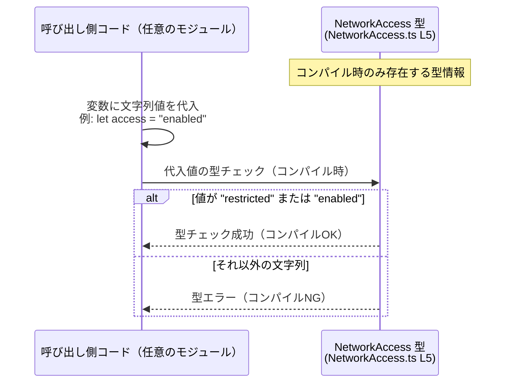

# app-server-protocol/schema/typescript/v2/NetworkAccess.ts コード解説

## 0. ざっくり一言

- ネットワークアクセスの状態を `"restricted"` または `"enabled"` の 2 値で表すための **文字列リテラル union 型** `NetworkAccess` を定義する、自動生成された TypeScript 型定義ファイルです。（根拠: `NetworkAccess.ts:L1-5`）

---

## 1. このモジュールの役割

### 1.1 概要

- このモジュールは、ネットワークアクセスの許可状態を表すための型 `NetworkAccess` を提供します。（根拠: `NetworkAccess.ts:L5-5`）
- 型は `"restricted"` もしくは `"enabled"` のいずれかのみを許可することで、文字列のタイポや不正な値をコンパイル時に検出できるようにします。（根拠: `NetworkAccess.ts:L5-5`）
- ファイル全体は ts-rs により Rust 側の定義から自動生成されており、手動編集は想定されていません。（根拠: `NetworkAccess.ts:L1-3`）

### 1.2 アーキテクチャ内での位置づけ

- このファイルは **型定義のみ** を提供し、実行時ロジックや状態は保持しません。（根拠: `NetworkAccess.ts:L1-5`）
- コメントにより、Rust 側の型定義から ts-rs によって生成されていることが分かります。（根拠: `NetworkAccess.ts:L1-3`）
- 実際の利用は、この `NetworkAccess` 型をインポートする他の TypeScript モジュール側で行われますが、その具体的なモジュール名や場所はこのチャンクには現れません。

代表的な依存関係を概念図として示します（呼び出し元モジュールは「任意」として表現します）。

```mermaid
graph LR
    R["Rust側の型定義<br/>(ts-rsの入力, パス不明)"]
    T["NetworkAccess.ts (L1-5)<br/>type NetworkAccess = \"restricted\" | \"enabled\""]
    C["任意のTypeScriptコード<br/>(NetworkAccessを利用する側,<br/>このチャンク外)"]

    R -- ts-rsにより生成 --> T
    C -- 型をインポートして利用 --> T
```

### 1.3 設計上のポイント

- **自動生成コード**  
  - 冒頭コメントに「GENERATED CODE! DO NOT MODIFY BY HAND!」とあり、手動編集禁止であることが明示されています。（根拠: `NetworkAccess.ts:L1-3`）
- **型のみの提供（ステートレス）**  
  - 関数・クラス・変数定義は存在せず、1 つの型エイリアスだけがエクスポートされています。（根拠: `NetworkAccess.ts:L5-5`）
- **文字列リテラル union 型による表現**  
  - `"restricted"` / `"enabled"` という 2 つの状態を文字列リテラル union 型として定義することで、TypeScript の静的型チェックを活用しています。（根拠: `NetworkAccess.ts:L5-5`）
- **エラーハンドリング方針**  
  - 実行時のエラー処理は含まず、**コンパイル時に不正な値を弾く**ことで安全性を高める設計になっています。（根拠: 型定義のみであること `NetworkAccess.ts:L5-5`）

---

## 2. 主要な機能一覧

このファイルは実行時ロジックではなく型定義のみを提供しますが、型レベルの「機能」としては次のように整理できます。

- ネットワークアクセス状態の列挙:  
  - `"restricted"` と `"enabled"` の 2 状態を定義し、それ以外をコンパイル時に禁止します。（根拠: `NetworkAccess.ts:L5-5`）
- API 設計の制約:  
  - 他のモジュールがパラメータやプロパティに `NetworkAccess` を使うことで、ネットワークアクセスに関する値の取りうる範囲を明示し、型安全にします。（根拠: `NetworkAccess.ts:L5-5`）

---

## 3. 公開 API と詳細解説

### 3.1 型一覧（構造体・列挙体など）

このファイルに定義されている公開型の一覧です。

| 名前             | 種別                                 | 役割 / 用途                                                                 | 定義位置                     |
|------------------|--------------------------------------|------------------------------------------------------------------------------|------------------------------|
| `NetworkAccess`  | 型エイリアス（文字列リテラル union） | ネットワークアクセス状態を `"restricted"` / `"enabled"` の 2 値で表すための型 | `NetworkAccess.ts:L5-5` |

#### `type NetworkAccess = "restricted" | "enabled"`

**概要**

- ネットワークアクセスに関する状態を、2 つの文字列値のいずれかに制限するための型です。（根拠: `NetworkAccess.ts:L5-5`）

**詳細**

- `"restricted"`  
  - ネットワークアクセスが制限されている状態を表すための文字列リテラルです。（意味は命名からの推測であり、コードからは挙動は分かりません）
- `"enabled"`  
  - ネットワークアクセスが有効である状態を表すための文字列リテラルです。（同上）

TypeScript の観点では、`NetworkAccess` は以下のような性質を持ちます。

- `NetworkAccess` 型の変数には、**それ以外の任意の文字列は代入できません**（コンパイルエラーになります）。
- `"restricted"` または `"enabled"` のいずれかであることが保証されるため、`switch` 文などで **網羅的な分岐** を行いやすくなります。

### 3.2 関数詳細（最大 7 件）

- このファイルには **関数定義が存在しません**。（根拠: `NetworkAccess.ts:L1-5`）
- したがって、このセクションで詳細解説すべき公開関数・メソッドはありません。

### 3.3 その他の関数

- 補助関数やラッパー関数も存在しません。（根拠: `NetworkAccess.ts:L1-5`）

---

## 4. データフロー

このファイルには **実行時コードが存在しないため、ランタイムでのデータフローはありません**。（根拠: `NetworkAccess.ts:L1-5`）  
ただし、コンパイル時に行われる「型チェック」の観点で、`NetworkAccess` がどのように利用されるかを概念的に示します。



- 実行時には `NetworkAccess` という型情報は消え、単なる文字列として動作します（これは TypeScript の一般的な特性です）。
- したがって、安全性・エラー検出の要点は「**コンパイル時にどれだけ型チェックを通じて不正値を防ぐか**」となります。

---

## 5. 使い方（How to Use）

### 5.1 基本的な使用方法

`NetworkAccess` を設定値や関数引数の型として利用することで、状態が 2 値に制約されます。

```typescript
// NetworkAccess 型をインポートする（型のみインポート）                    // 本ファイルから型を読み込む
import type { NetworkAccess } from "./NetworkAccess";                       // パスはプロジェクト構成に応じて調整する

// ネットワークアクセス設定を保持する設定オブジェクトの型                 // アプリ全体の設定の一部として利用するイメージ
interface AppConfig {                                                       // 設定オブジェクトの型定義
    networkAccess: NetworkAccess;                                           // "restricted" または "enabled" のみ許可される
}

// 設定に基づき、ネットワークが有効かどうかを判定する関数                 // NetworkAccess 型を引数から間接的に利用
function isNetworkEnabled(config: AppConfig): boolean {                     // AppConfig を受け取り真偽値を返す
    return config.networkAccess === "enabled";                              // "enabled" のときだけ true、それ以外（"restricted"）は false
}
```

- `AppConfig.networkAccess` に `"enabled"` / `"restricted"` 以外の文字列を代入しようとすると、TypeScript コンパイラがエラーを報告します。
- コンパイル時にエラーになるため、実行前にバグを検出できます。

### 5.2 よくある使用パターン

#### 5.2.1 `switch` 文による網羅的分岐

`NetworkAccess` が 2 値であることを利用し、`switch` 文で分岐するパターンです。

```typescript
import type { NetworkAccess } from "./NetworkAccess";                       // NetworkAccess 型をインポート

// NetworkAccess に応じたメッセージを返す関数                             // 各状態ごとにメッセージを切り替える
function getNetworkStatusMessage(access: NetworkAccess): string {           // NetworkAccess 型の引数を受け取る
    switch (access) {                                                       // 状態に応じて分岐
        case "restricted":                                                  // ネットワークが制限されている場合
            return "Network access is restricted.";                         // 制限時のメッセージ
        case "enabled":                                                     // ネットワークが有効な場合
            return "Network access is enabled.";                            // 有効時のメッセージ
        // default を書かないことで、将来値が追加された際に                 // 将来 NetworkAccess に別の値が追加された場合
        // コンパイルエラーで未処理ケースを検出しやすくなる                // ここが未網羅としてエラーになりやすい
    }
}
```

- `default` ケースを敢えて書かないことで、将来 `NetworkAccess` に新しい値が追加された際に **コンパイルエラーを通じて未処理ケースを検出しやすくなる**という利点があります。

#### 5.2.2 フロントエンド設定フォームなどでの使用

UI フォームなどで、選択肢を `NetworkAccess` に対応させるパターンが考えられます。

```typescript
import type { NetworkAccess } from "./NetworkAccess";                       // NetworkAccess 型をインポート

// フォームの選択肢として使用する例                                       // セレクトボックスの候補などに使う
const networkAccessOptions: NetworkAccess[] = [                             // NetworkAccess 型の配列
    "restricted",                                                           // 制限状態
    "enabled",                                                              // 有効状態
];
```

- 配列 `networkAccessOptions` に `"restricted"` / `"enabled"` 以外の文字列を追加しようとすると、コンパイルエラーになります。

### 5.3 よくある間違い

#### 5.3.1 単なる `string` 型として扱ってしまう

```typescript
// 間違い例: string 型を使ってしまう                                    // NetworkAccess 型を使わない
interface BadConfig {
    networkAccess: string;                                                 // どんな文字列でも入ってしまう
}
```

- `string` を使うと `"resticted"` のようなタイポや、想定外の `"unknown"` なども許容されてしまい、型安全性が失われます。
- 正しくは `NetworkAccess` を用いることで、値を 2 値に制約すべきです。

```typescript
// 正しい例: NetworkAccess 型を利用する                                 // 取りうる値を限定する
interface GoodConfig {
    networkAccess: NetworkAccess;                                          // "restricted" | "enabled" のみ許可
}
```

#### 5.3.2 ランタイムの値を検証せずにキャストする

外部入力（JSON など）に対し、検証なしに `as NetworkAccess` を使うのは危険です。

```typescript
import type { NetworkAccess } from "./NetworkAccess";                       // NetworkAccess 型

declare const raw: any;                                                     // 例: 外部からの JSON データ

// 間違い例: 検証せずに as NetworkAccess でキャスト                       // 実行時には任意の文字列が入りうる
const unsafeValue: NetworkAccess = raw.networkAccess as NetworkAccess;      // 不正な値も通ってしまう可能性がある
```

- TypeScript の型は **実行時にはチェックされない** ため、`raw.networkAccess` に `"enabled"` 以外の任意の文字列が入っていても、コンパイルは通ってしまいます。
- その結果、アプリケーションのロジック上「enabled のはず」と思い込んで処理を進めると、セキュリティや機能上の不整合が生じる可能性があります。

**安全な例（ランタイム検証を行う）**

```typescript
import type { NetworkAccess } from "./NetworkAccess";                       // NetworkAccess 型

// 入力値が NetworkAccess として妥当かどうかをチェックする関数           // ランタイムでの安全な変換
function parseNetworkAccess(input: unknown): NetworkAccess | null {         // 妥当なら NetworkAccess、そうでなければ null
    if (input === "restricted" || input === "enabled") {                    // 2 つの許可値のみを受け入れる
        return input;                                                       // TypeScript が NetworkAccess と推論する
    }
    return null;                                                            // 不正値は null として扱う
}
```

- この関数自体は本ファイルには定義されていませんが、この型を安全に使うための典型的なパターンです。

### 5.4 使用上の注意点（まとめ）

- **前提条件**
  - `NetworkAccess` を使うコードでは、値が `"restricted"` または `"enabled"` のいずれかに制限されることを前提とします。（根拠: `NetworkAccess.ts:L5-5`）
- **ランタイム検証の必要性**
  - 外部から取得した文字列に対しては、**型アサーション（`as NetworkAccess`）だけでは不十分**であり、実行時チェックを別途行う必要があります。型はコンパイル時のみ有効であるためです。
- **エラー条件**
  - 型としては、許可されていない文字列を代入するとコンパイルエラーになります（TypeScript の型システム上のエラーであり、ランタイムエラーではありません）。
- **並行性・スレッド安全性**
  - このファイルは **型定義のみ** であり、実行時の共有状態や並行実行に関わるロジックを持たないため、並行性に関する特有の注意点はありません。（根拠: `NetworkAccess.ts:L1-5`）
- **パフォーマンス**
  - 実行時には型情報が取り除かれるため、この型定義は **ランタイムパフォーマンスにほぼ影響しません**。

---

## 6. 変更の仕方（How to Modify）

### 6.1 新しい機能を追加する場合

このファイルは自動生成コードであり、コメントに「Do not modify by hand」とあります。（根拠: `NetworkAccess.ts:L1-3`）  
そのため、**直接このファイルを編集するのは推奨されません**。

新しい状態（例: `"offline"`）を追加したい場合の一般的な手順は、ts-rs の前提に従うと以下のようになります。

1. **Rust 側の元定義を変更する**  
   - `NetworkAccess` に対応する Rust の型（列挙体など）に新しいバリアントを追加します。  
     - 具体的なファイルパスはこのチャンクには現れないため不明です。（根拠: `NetworkAccess.ts:L3-3`）
2. **ts-rs によるコード生成を再実行する**  
   - ビルドスクリプトやコマンドを通じて TypeScript 型定義を再生成すると、本ファイルの union 型に新しい文字列リテラルが追加されます。
3. **TypeScript 側の利用箇所を更新する**
   - `switch` 文や `if` 文などで `NetworkAccess` を扱っている場所がコンパイルエラーになる可能性があります。
   - それらを修正し、新しい状態を考慮した処理を追加します。

### 6.2 既存の機能を変更する場合

例えば `"restricted"` を `"limited"` に名前変更したいケースを考えます。

- **影響範囲の確認**
  - `NetworkAccess` 型を参照しているすべての TypeScript コードが影響を受けます。
  - 文字列リテラルを直接比較しているコードはコンパイルエラーになるか、実行時挙動が変わります。
- **契約（前提条件）の変更**
  - `NetworkAccess` の取りうる値が変更されるため、「`"restricted"` という文字列が来る」という前提は維持できません。
  - API 契約としては「ネットワークアクセス状態を表す文字列リテラルの 1 つ」という抽象的な説明で統一しておくと変更に耐性が出ます。
- **テスト・使用箇所の再確認**
  - このチャンクにはテストコードは含まれていないため（根拠: `NetworkAccess.ts:L1-5`）、プロジェクト側で `NetworkAccess` を利用しているテストを検索し、期待する挙動や文字列が変更に追随しているか確認する必要があります。
- **直接編集の禁止**
  - コメントにより、この TypeScript ファイル自体を直接修正することは避けるべきであり、元の Rust 側の定義から修正を行うことが前提です。（根拠: `NetworkAccess.ts:L1-3`）

---

## 7. 関連ファイル

このチャンクには `NetworkAccess.ts` 以外の実際のファイルは現れませんが、コメントから推測できる関連要素を、推測であることを明示したうえで整理します。

| パス | 役割 / 関係 |
|------|------------|
| `不明（Rust側の ts-rs 対応型定義）` | `NetworkAccess.ts` を生成する元となる Rust の型定義が存在します。コメントに `ts-rs` による生成とあるためですが、具体的なパスや型名はこのチャンクからは分かりません。（根拠: `NetworkAccess.ts:L3-3`） |
| `不明（app-server-protocol/schema/typescript/v2/ 配下の他ファイル）` | 同一ディレクトリに他の TypeScript スキーマファイルが存在する可能性がありますが、このチャンクにはそれらの情報は現れません。存在の有無や名称は不明です。 |

---

### コンポーネントインベントリー（まとめ）

最後に、このチャンクに現れる型コンポーネントの一覧を再掲します。

| 名前             | 種別                                 | 役割 / 用途                                                                 | 定義位置                     |
|------------------|--------------------------------------|------------------------------------------------------------------------------|------------------------------|
| `NetworkAccess`  | 型エイリアス（文字列リテラル union） | ネットワークアクセス状態を `"restricted"` / `"enabled"` の 2 値で表すための型 | `NetworkAccess.ts:L5-5` |

- 関数・クラス・インターフェースなど、他のコンポーネントはこのチャンクには存在しません。（根拠: `NetworkAccess.ts:L1-5`）
