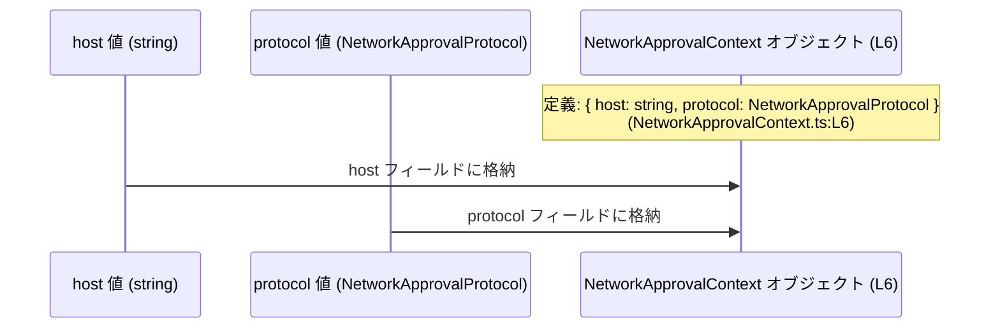

# app-server-protocol/schema/typescript/v2/NetworkApprovalContext.ts コード解説

## 0. ざっくり一言

- `NetworkApprovalContext` 型を定義する、自動生成された TypeScript の型定義ファイルです。  
- `host: string` と `protocol: NetworkApprovalProtocol` の 2 つの情報を 1 つのオブジェクト型としてまとめています。

---

## 1. このモジュールの役割

### 1.1 概要

- このモジュールは、ネットワーク承認に関連する「コンテキスト情報」を表す TypeScript 型 `NetworkApprovalContext` を提供します。  
- コンテキストは `host`（文字列）と `protocol`（`NetworkApprovalProtocol` 型）の 2 フィールドを持つオブジェクトとして表現されています（`NetworkApprovalContext.ts:L6-6`）。  
- ファイル先頭のコメントから、この型定義は `ts-rs` というツールにより自動生成されており、手動編集は意図されていません（`NetworkApprovalContext.ts:L1-3`）。

### 1.2 アーキテクチャ内での位置づけ

このファイルは、他の型定義モジュールから型をインポートし、それらを組み合わせたコンテキスト型をエクスポートする、シンプルな「型ハブ」として位置づけられます。

- `ts-rs` という外部ツールが本ファイルを生成します（コメントより事実として読み取れるのは「コード生成ツール名」のみです）（`NetworkApprovalContext.ts:L3-3`）。
- 本ファイルは `./NetworkApprovalProtocol` というモジュールから `NetworkApprovalProtocol` 型を type-only import します（`NetworkApprovalContext.ts:L4-4`）。
- その型を用いて `NetworkApprovalContext` 型をエクスポートします（`NetworkApprovalContext.ts:L6-6`）。

```mermaid
graph TD
    subgraph "コード生成"
        TSR["ts-rs ツール<br/>(コメントで明示)<br/>(L1-3)"]
    end

    subgraph "TypeScript 型定義 (L1-6)"
        NACFile["NetworkApprovalContext.ts<br/>(本ファイル L1-6)"]
        NAPImport["import type { NetworkApprovalProtocol }<br/>from \"./NetworkApprovalProtocol\" (L4)"]
        NACType["export type NetworkApprovalContext<br/>{ host: string, protocol: NetworkApprovalProtocol } (L6)"]
    end

    TSR --> NACFile
    NACFile --> NAPImport
    NAPImport --> NACType
```

※ この図は、本チャンクに含まれるコード範囲 `L1-6` の関係のみを表現しています。

### 1.3 設計上のポイント

- **自動生成コードであること**  
  - `// GENERATED CODE! DO NOT MODIFY BY HAND!` というコメントにより、手動での編集禁止が明示されています（`NetworkApprovalContext.ts:L1-1`）。  
  - `ts-rs` による生成であるとコメントに記載されています（`NetworkApprovalContext.ts:L3-3`）。

- **型のみのモジュール**  
  - `import type` による型のみのインポートと、`export type` による型エイリアスのエクスポートしか存在せず、実行時ロジックは含まれていません（`NetworkApprovalContext.ts:L4-6`）。  
  - したがって、このモジュール自体は実行時のエラー・並行処理・副作用を持ちません。

- **コンテキスト情報の集約**  
  - `NetworkApprovalContext` は `host: string` と `protocol: NetworkApprovalProtocol` をひとまとめにしたオブジェクト型です（`NetworkApprovalContext.ts:L6-6`）。  
  - 複数の関連する値を 1 つの型として扱うことで、関数シグネチャなどで型安全に扱える設計になっています。

- **型専用インポートの使用**  
  - `import type { NetworkApprovalProtocol }` によって、型情報のみがインポートされ、JavaScript 出力には影響しません（`NetworkApprovalContext.ts:L4-4`）。  
  - これは TypeScript の機能であり、実行バンドルサイズや循環参照のリスクを減らす設計です。

---

## 2. 主要な機能一覧

このファイルは関数やクラスを持たず、1 つの公開型のみを提供します。

- `NetworkApprovalContext` 型: `host` と `protocol` をまとめたコンテキストオブジェクト型（`NetworkApprovalContext.ts:L6-6`）

---

## 3. 公開 API と詳細解説

### 3.1 型一覧

このチャンクに現れる公開型（および関連コンポーネント）の一覧です。

| 名前 | 種別 | 役割 / 用途 | 定義位置（根拠） |
|------|------|-------------|------------------|
| `NetworkApprovalContext` | 型エイリアス（オブジェクト型） | ネットワーク承認に関するコンテキスト情報。`host: string` と `protocol: NetworkApprovalProtocol` を 1 つのオブジェクトとして扱うための型。 | `NetworkApprovalContext.ts:L6-6` |
| `NetworkApprovalProtocol` | 型（詳細は別モジュール） | 承認に用いる「プロトコル」を表す型。ここでは `NetworkApprovalContext` の `protocol` フィールドの型として参照されているのみで、定義内容はこのチャンクには現れません。 | 参照のみ: `NetworkApprovalContext.ts:L4-4` |
| `./NetworkApprovalProtocol` | モジュール | `NetworkApprovalProtocol` 型を提供するモジュール。拡張子や具体的な中身は、このチャンクからは分かりません。 | 参照のみ: `NetworkApprovalContext.ts:L4-4` |

#### `NetworkApprovalContext` のフィールド構造

`NetworkApprovalContext` は次の 2 フィールドを持つオブジェクト型として定義されています（`NetworkApprovalContext.ts:L6-6`）。

| フィールド名 | 型 | 説明 | 根拠 |
|-------------|----|------|------|
| `host` | `string` | ネットワーク先を表すホスト名またはアドレス文字列。文字列型であることだけがコードから読み取れ、それ以上のフォーマット制約はこのファイルからは分かりません。 | `NetworkApprovalContext.ts:L6-6` |
| `protocol` | `NetworkApprovalProtocol` | 承認に用いるプロトコルを表す型。具体的なバリエーションや構造は、このチャンクには存在しません。 | `NetworkApprovalContext.ts:L6-6` |

### 3.2 関数詳細

このファイルには関数・メソッド定義が一切存在しません（`NetworkApprovalContext.ts:L1-6` のいずれにも `function` / アロー関数 / メソッド構文が現れないため）。

- 従って、「関数詳細」のテンプレートを適用できる対象はありません。
- エラー処理・非同期処理・並行処理に関するロジックも、このファイルには含まれていません。

### 3.3 その他の関数

- 該当なし（このチャンクには関数定義が存在しません）。

---

## 4. データフロー

このファイルは型定義のみですが、`NetworkApprovalContext` 型の内部でどのようにデータが構造化されるかを「値の流れ」として図示できます。

### 4.1 型レベルでのデータ構造の流れ

`NetworkApprovalContext` は 2 つの値を 1 つのオブジェクトにまとめる役割を持っています（`NetworkApprovalContext.ts:L6-6`）。



- この図は、**`host` と `protocol` という 2 つの独立した値が `NetworkApprovalContext` という 1 つのオブジェクトにまとめられる**という、型レベルの関係のみを表しています。
- 具体的な生成関数や利用関数はこのチャンクには存在しないため、「どの関数からどのように渡されるか」といった詳細な実行時データフローは、このファイルからは分かりません。

---

## 5. 使い方（How to Use）

このセクションのコード例は、**TypeScript の一般的な利用例を示すための仮想コード**です。  
このリポジトリ内に実際に同一のコードが存在するかどうかは、このチャンクからは分かりません。

### 5.1 基本的な使用方法

`NetworkApprovalContext` を使って、`host` と `protocol` を 1 つの値として扱う基本例です。

```typescript
// NetworkApprovalContext 型と NetworkApprovalProtocol 型を
// 同一ディレクトリにあると仮定してインポートする例です。
import type { NetworkApprovalContext } from "./NetworkApprovalContext";      // 本ファイルがエクスポートする型（仮の import 例）
import type { NetworkApprovalProtocol } from "./NetworkApprovalProtocol";    // protocol フィールドの型（定義内容はこのチャンクからは不明）

// NetworkApprovalProtocol 型の具体的な値を仮定します。
// 実際の allowed 値は NetworkApprovalProtocol の定義側を確認する必要があります。
declare const proto: NetworkApprovalProtocol;  // ここでは外部から与えられると仮定

// NetworkApprovalContext 型の値を作成する例です。
const ctx: NetworkApprovalContext = {          // ctx 変数の型は NetworkApprovalContext に明示
    host: "example.com",                       // host フィールド: string 型の値を設定
    protocol: proto,                           // protocol フィールド: NetworkApprovalProtocol 型の値を設定
};

// ctx を別の処理に渡す、という形でコンテキスト一式をまとめて扱うことができます。
// （どのような処理に渡すかは、このチャンクからは分かりません）
console.log(ctx.host);                         // TypeScript は ctx.host を string と認識
```

このように、`NetworkApprovalContext` を用いることで、「ホスト」と「プロトコル」を個別の引数ではなく 1 つのオブジェクトとして取り扱うことができます。

### 5.2 よくある使用パターン（一般的なパターン例）

以下も一般的な TypeScript コード例であり、このリポジトリに存在することを意味しません。

#### パターン例: 関数の引数としてまとめて渡す

```typescript
// NetworkApprovalContext を引数に取る関数の例です。
// 実際にこのような関数が存在するかは、このチャンクからは不明です。
import type { NetworkApprovalContext } from "./NetworkApprovalContext";  // 型のインポート（仮）

function approveNetwork(context: NetworkApprovalContext): void {         // 引数 context にコンテキスト一式
    // context.host は string 型として扱える
    // context.protocol は NetworkApprovalProtocol 型として扱える
    console.log("host:", context.host);
    console.log("protocol:", context.protocol);
}
```

- 複数の引数を取る代わりに、`NetworkApprovalContext` 1 つにまとめることで、将来的なフィールド追加にも柔軟に対応しやすくなります（TypeScript の設計上の一般的利点です）。

### 5.3 よくある間違い（起こりうる誤用例）

`NetworkApprovalContext` の型に対して起こりうる一般的なタイプミス例です。

```typescript
import type { NetworkApprovalContext } from "./NetworkApprovalContext";

// 間違い例: host に number を代入している
const badCtx1: NetworkApprovalContext = {
    // host: 123, // コンパイルエラー: number は string に割り当てられません
    host: "123",      // 正しくは string 型にする必要がある
    // protocol フィールドを指定し忘れている
    // protocol: ???  // コンパイルエラー: 必須プロパティ 'protocol' がありません
} as any;

// 正しい例: 両フィールドを正しい型で指定する
const goodCtx: NetworkApprovalContext = {
    host: "example.com",     // string 型
    // 実際の値は NetworkApprovalProtocol の定義に従う必要があります
    protocol: {} as any,     // ここでは仮に any からキャスト（実際には適切な値を指定）
};
```

- TypeScript は `host` を `string`、`protocol` を `NetworkApprovalProtocol` と認識するため、誤った型を指定するとコンパイルエラーとなります。
- `protocol` を省略すると、必須プロパティ欠如のエラーになります（`NetworkApprovalContext.ts:L6-6` から、オプショナル（`?`）ではないことが分かります）。

### 5.4 使用上の注意点（まとめ）

- **両フィールドが必須**  
  - `host` と `protocol` のいずれにも `?` が付いていないため、両方とも必須フィールドです（`NetworkApprovalContext.ts:L6-6`）。
- **型のみの情報であり、検証は行われない**  
  - このファイルには値の妥当性検証ロジック（フォーマットチェックなど）は含まれていません。  
  - 例えば `host` の文字列内容が有効なホスト名かどうかは、この型では保証されません。
- **自動生成ファイルであること**  
  - 直接編集すると、再生成時に上書きされる可能性があります（`NetworkApprovalContext.ts:L1-3`）。  
  - 変更が必要な場合、生成元（`ts-rs` の入力側）を変更する必要がありますが、その位置はこのファイルからは特定できません。

---

## 6. 変更の仕方（How to Modify）

### 6.1 新しい機能を追加する場合

このファイルはコメントにより「手動変更禁止」と明示されている自動生成コードです（`NetworkApprovalContext.ts:L1-3`）。したがって、

- **直接このファイルにコードを追加することは推奨されません。**

新しいフィールドや新しいコンテキスト型を追加したい場合の一般的な方針（このリポジトリに適用できるかどうかは、このチャンクからは不明です）:

1. `ts-rs` の入力側（おそらく別言語で書かれたスキーマ定義など）に新しいフィールドや型を追加する。
2. `ts-rs` を再実行して TypeScript コードを再生成する。
3. 生成された TypeScript 側で、`NetworkApprovalContext` に新しいフィールドが反映されていることを確認する。

このファイル単体からは、**生成元の場所・形式・言語は特定できません**。

### 6.2 既存の機能を変更する場合

`NetworkApprovalContext` のフィールドや型を変更する場合の注意点（TypeScript の一般的な性質に基づきます）:

- **フィールド名の変更**  
  - `host` や `protocol` の名前を変更すると、これらのプロパティに依存しているすべてのコードがコンパイルエラーになります。  
  - このファイルからは依存箇所を特定できないため、エディタの参照検索などが必要です。

- **フィールド型の変更**  
  - 例えば `host: string` を `host: URL` のような別の型に変更した場合、既存コードが新しい型に合わせて修正されていないとコンパイルエラーになります。  
  - `protocol` の型を変更する際も同様です。

- **自動生成との整合性**  
  - コメントに反して直接編集した場合、次回のコード生成で上書きされ、変更が失われる可能性があります（`NetworkApprovalContext.ts:L1-3`）。  
  - 安定した変更のためには、生成元の定義を更新し、再生成することが必要です。

---

## 7. 関連ファイル

このチャンクから特定できる関連モジュールは次のとおりです。

| パス / 識別子 | 役割 / 関係 |
|---------------|-------------|
| `app-server-protocol/schema/typescript/v2/NetworkApprovalContext.ts` | 本レポート対象のファイル。`NetworkApprovalContext` 型をエクスポートする自動生成 TypeScript モジュール（`NetworkApprovalContext.ts:L1-6`）。 |
| `app-server-protocol/schema/typescript/v2/NetworkApprovalProtocol.*` | `import type { NetworkApprovalProtocol } from "./NetworkApprovalProtocol";` で参照されるモジュール。拡張子や中身はこのチャンクからは不明だが、`NetworkApprovalContext` の `protocol` フィールドの型を提供している（`NetworkApprovalContext.ts:L4-4`）。 |
| `ts-rs`（外部ツール名） | ファイル先頭コメントで言及されているコード生成ツール。どのような入力からこのファイルを生成しているか、またどの環境で実行されるかは、このチャンクからは分かりません（`NetworkApprovalContext.ts:L3-3`）。 |

---

### Bugs / Security / Contracts / Edge Cases / Tests / Performance に関する補足

- **Bugs / Security**  
  - このファイルは型定義のみであり、実行時の処理や I/O を含まないため、**このファイル単体から直ちに導けるバグやセキュリティホールはありません**。  
  - ただし、`host` の値の検証や `protocol` の値の妥当性は別のコードに依存しており、このファイルはそれらを保証しません。

- **Contracts（契約）**  
  - `NetworkApprovalContext` は「`host` は必ず string」「`protocol` は必ず `NetworkApprovalProtocol`」という型レベルの契約を提供します（`NetworkApprovalContext.ts:L6-6`）。  
  - それ以外の制約（null 非許容、特定フォーマットなど）は、このファイルからは読み取れません。

- **Edge Cases（エッジケース）**  
  - `host` が空文字列であっても、型としては有効です（TypeScript の string 型の一般的性質）。  
  - `protocol` の許容値・エッジケースは `NetworkApprovalProtocol` の定義側に依存し、このチャンクには現れません。

- **Tests**  
  - このファイルにはテストコードや型テストに関する記述はありません。  
  - 関連するテストファイルの有無は、このチャンクからは分かりません。

- **Performance / Scalability / Observability**  
  - このファイルはコンパイル時にのみ使用される型情報（`import type` / `export type`）であり、実行時のパフォーマンスやスケーラビリティ、ログ・メトリクスなどの観測可能性に直接の影響はありません。
