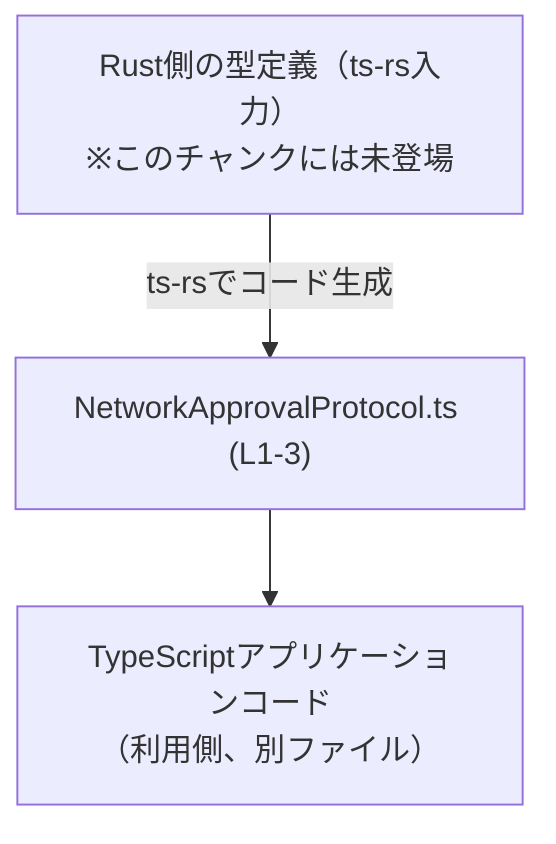
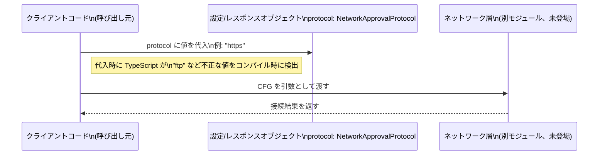

# app-server-protocol/schema/typescript/v2/NetworkApprovalProtocol.ts

## 0. ざっくり一言

このファイルは、ネットワーク承認に使うプロトコル種別を `"http" | "https" | "socks5Tcp" | "socks5Udp"` の4種類に限定する TypeScript の**文字列リテラル・ユニオン型** `NetworkApprovalProtocol` を定義する、自動生成ファイルです（`NetworkApprovalProtocol.ts:L1-3`）。

---

## 1. このモジュールの役割

### 1.1 概要

- このモジュールは、ネットワークアクセスや「承認」処理で利用される**プロトコル識別子**を型レベルで表現し、それを **4 つの固定値に制約**するために存在しています（`NetworkApprovalProtocol.ts:L3-3`）。
- ファイル先頭コメントより、この型定義は Rust から TypeScript 型を生成するツール **ts-rs** によって自動生成されたものであり、手動編集しないことが前提です（`NetworkApprovalProtocol.ts:L1-2`）。

### 1.2 アーキテクチャ内での位置づけ

このファイルは、Rust 側のドメインモデル（ts-rs が参照する型定義）から生成される **スキーマ層（schema/typescript/v2）** の一部であり、アプリケーションコードから参照される「共通の契約（Contract）」として機能していると解釈できます（自動生成コメントよりの推測、コードからは生成元パスは不明です）。



- `NetworkApprovalProtocol.ts` 自身は、他の TypeScript ファイルへの import は行っておらず、純粋に型エイリアスを export するだけです（`NetworkApprovalProtocol.ts:L3-3`）。

### 1.3 設計上のポイント

コードから読み取れる設計上の特徴は次のとおりです。

- **自動生成であり手動変更禁止**  
  - `// GENERATED CODE! DO NOT MODIFY BY HAND!` というコメントから、ビルド／コード生成プロセスで上書きされる前提です（`NetworkApprovalProtocol.ts:L1-1`）。
- **ts-rs による Rust ↔ TypeScript 連携**  
  - `// This file was generated by [ts-rs]` より、Rust 側の型と TypeScript 側の型を同期させるための自動生成です（`NetworkApprovalProtocol.ts:L2-2`）。
- **文字列リテラル・ユニオンによる閉じた集合**  
  - `export type NetworkApprovalProtocol = "http" | "https" | "socks5Tcp" | "socks5Udp";` により、許容される値が 4 つに限定されています（`NetworkApprovalProtocol.ts:L3-3`）。
- **実行時ロジックや状態を持たない**  
  - 関数・クラス・変数定義はなく、型エイリアス 1 つのみです（`NetworkApprovalProtocol.ts:L3-3`）。
- **TypeScript の型安全性を利用した検査**  
  - TypeScript のコンパイル時に「存在しないプロトコル名」が検出されるため、アプリケーションコード側のミススペルや不正値を早期に防ぐ意図があると考えられます（この意図は TypeScript の仕組みに基づく一般的な性質であり、コードからもリテラルユニオンであることは確認できます：`NetworkApprovalProtocol.ts:L3-3`）。

---

## 2. 主要な機能一覧

このファイルが提供する「機能」は、1 つの型定義に集約されています。

- `NetworkApprovalProtocol` 型定義:  
  ネットワーク承認に利用可能なプロトコル種別を `"http" | "https" | "socks5Tcp" | "socks5Udp"` の 4 種類に制限する文字列リテラル・ユニオン型です（`NetworkApprovalProtocol.ts:L3-3`）。

---

## 3. 公開 API と詳細解説

### 3.1 型一覧（構造体・列挙体など）

| 名前                      | 種別                             | 役割 / 用途                                                                                   | 定義箇所                               |
|---------------------------|----------------------------------|-----------------------------------------------------------------------------------------------|----------------------------------------|
| `NetworkApprovalProtocol` | 型エイリアス（文字列リテラル型） | ネットワーク承認で利用されるプロトコル識別子を 4 種類（http/https/socks5Tcp/socks5Udp）に限定する | `NetworkApprovalProtocol.ts:L3-3` |

#### 型の詳細

```typescript
export type NetworkApprovalProtocol = "http" | "https" | "socks5Tcp" | "socks5Udp";
```

- **型の意味**（`NetworkApprovalProtocol.ts:L3-3`）
  - `"http"`: HTTP プロトコルを利用することを示す文字列。
  - `"https"`: HTTPS プロトコル（HTTP over TLS）を利用することを示す文字列。
  - `"socks5Tcp"`: SOCKS5 プロキシの TCP 転送を利用することを示す文字列。
  - `"socks5Udp"`: SOCKS5 プロキシの UDP 転送を利用することを示す文字列。
- **型安全性**  
  - TypeScript のコンパイル時に、これ以外の文字列（例えば `"ftp"` や `"http "` など）が代入されると型エラーになります。
- **実行時の挙動**  
  - TypeScript の型は JavaScript の実行時には存在しないため、このファイルだけで実行時チェックが行われるわけではありません。
  - 外部入力（JSON など）からこの型に対応する値を受け取る場合は、別途ランタイムバリデーションが必要です（このファイルにはそのロジックはありません）。

### 3.2 関数詳細（最大 7 件）

このファイルには**関数は定義されていません**（コメントと型エイリアスのみ、`NetworkApprovalProtocol.ts:L1-3`）。

そのため、

- 関数シグネチャ
- 戻り値
- エラー条件
- アルゴリズム

などを説明する対象はありません。

### 3.3 その他の関数

補助関数やラッパー関数も、このファイルには登場しません（`NetworkApprovalProtocol.ts:L1-3`）。

---

## 4. データフロー

この型は単体ではロジックを持たず、「値がどのように流れるか」は**利用側のコード**に依存します。ここでは典型的な利用シナリオを想定したデータフローを示します（あくまで一般的な使われ方の例であり、このリポジトリ内の具体的な関数名はこのチャンクには現れません）。

### 4.1 代表的なシナリオ（概念図）

- 設定や API レスポンスのオブジェクトに `protocol: NetworkApprovalProtocol` フィールドが存在すると仮定します。
- 呼び出し側コードが `"https"` などの文字列リテラルを設定し、その値がネットワーク層に渡される流れです。



- この図で表現している型制約は、`NetworkApprovalProtocol` の定義（`NetworkApprovalProtocol.ts:L3-3`）に基づきます。
- 実際のネットワーク処理（NET）はこのファイルには存在せず、ここでは概念的なコンポーネントとして示しています。

---

## 5. 使い方（How to Use）

このセクションでは、この型を利用する側（別ファイルの TypeScript コード）での典型例を示します。

### 5.1 基本的な使用方法

#### 例1: 変数に型注釈として使う

```typescript
// NetworkApprovalProtocol.ts から型をインポートする
import type { NetworkApprovalProtocol } from "./NetworkApprovalProtocol";  // パスは例

// NetworkApprovalProtocol 型の変数を定義する
let protocol: NetworkApprovalProtocol;

// 許可された値は代入できる
protocol = "http";      // OK
protocol = "https";     // OK
protocol = "socks5Tcp"; // OK
protocol = "socks5Udp"; // OK

// 許可されていない値はコンパイルエラーになる
// protocol = "ftp";      // 型エラー: Type '"ftp"' is not assignable to type 'NetworkApprovalProtocol'.
```

- `NetworkApprovalProtocol` の定義により、コンパイラが `"ftp"` などの誤入力を検出します（`NetworkApprovalProtocol.ts:L3-3`）。
- IDE（VS Code など）はこの型注釈を利用して、自動補完やリファクタリング支援を行います。

#### 例2: 設定オブジェクトのプロパティとして使う

```typescript
import type { NetworkApprovalProtocol } from "./NetworkApprovalProtocol";

interface NetworkApprovalConfig {
    protocol: NetworkApprovalProtocol; // このプロパティは 4 種類のいずれか
    host: string;
    port: number;
}

// 設定オブジェクトを作成する
const config: NetworkApprovalConfig = {
    protocol: "https", // OK
    host: "example.com",
    port: 443,
};

// 誤ったプロトコルを指定するとコンパイルエラー
const badConfig: NetworkApprovalConfig = {
    // protocol: "http2",   // エラー: 'http2' は NetworkApprovalProtocol ではない
    protocol: "http",
    host: "example.com",
    port: 80,
};
```

### 5.2 よくある使用パターン

1. **関数の引数として使う**

   ```typescript
   import type { NetworkApprovalProtocol } from "./NetworkApprovalProtocol";

   // NetworkApprovalProtocol を利用してプロトコルを指定する関数
   function approveNetworkAccess(protocol: NetworkApprovalProtocol): void {
       // 実際のロジックは利用側で実装される
       console.log(`Approving network access over: ${protocol}`);
   }

   approveNetworkAccess("https"); // OK
   // approveNetworkAccess("ftp");   // コンパイルエラー
   ```

2. **サーバーからのレスポンス型として使う**

   ```typescript
   import type { NetworkApprovalProtocol } from "./NetworkApprovalProtocol";

   interface ApprovalResponse {
       protocol: NetworkApprovalProtocol;
       approved: boolean;
   }

   // サーバーから JSON を受け取り、型アサーションする例
   const raw = JSON.parse('{"protocol": "socks5Tcp", "approved": true}') as ApprovalResponse;
   // 実行時にはプロパティ値の検証は行われないので、
   // 実際には別途ランタイムチェックを組み合わせることが推奨されます。
   ```

### 5.3 よくある間違い

1. **`string` 型で済ませてしまう**

   ```typescript
   // よくない例: string だと何でも入ってしまう
   function approveNetworkAccessBad(protocol: string) {
       // "ftp" など予期しない値も入る可能性がある
   }
   ```

   正しくは `NetworkApprovalProtocol` を利用して値を制限します。

   ```typescript
   import type { NetworkApprovalProtocol } from "./NetworkApprovalProtocol";

   function approveNetworkAccessGood(protocol: NetworkApprovalProtocol) {
       // 許可された値だけが渡る前提で実装できる
   }
   ```

2. **`any` を使ってしまう**

   ```typescript
   // よくない例: any だと型チェックが効かない
   function useProtocol(protocol: any) {
       // "httpss" や null なども受け取れてしまう
   }
   ```

   `NetworkApprovalProtocol` を用いることで、コンパイル時に不正値を防げます。

3. **外部入力に対して TypeScript の型だけで安心してしまう**

   - JSON や HTTP リクエストから受け取る文字列は、実行時にはただの `string` です。
   - `as NetworkApprovalProtocol` のように型アサーションだけで済ませると、実際には `"ftp"` なども通ってしまう可能性があります。
   - そのため、**ランタイムでのバリデーション**（`if (value === "http" || ...)` のようなチェックやバリデーションライブラリ）との併用が必要です。

### 5.4 使用上の注意点（まとめ）

- **自動生成ファイルを直接編集しないこと**  
  - ファイル先頭コメントに「`DO NOT MODIFY BY HAND`」とあり、ビルド時に上書きされる可能性があります（`NetworkApprovalProtocol.ts:L1-2`）。
- **外部入力には別途バリデーションが必要**  
  - TypeScript の型はコンパイル時のみ有効であり、実行時には存在しないため、JSON・HTTP などから渡ってくるデータはランタイムで検証する必要があります。
- **型の変更は広範囲に影響する**  
  - プロトコル候補を追加・削除・変更すると、この型を使っている全コードにコンパイルエラーや意味変更が波及します。
- **エラー・並行性（Concurrency）について**  
  - このファイルは純粋な型定義のみであり、例外や Promise、並行処理の仕組みは含まれません。
  - エラー処理・非同期処理は利用側のコードで行われ、この型はそれらの引数・戻り値の一部として使われる想定です。

---

## 6. 変更の仕方（How to Modify）

### 6.1 新しい機能（プロトコル）を追加する場合

コードから分かる重要な点は、「このファイルが ts-rs による自動生成である」ことです（`NetworkApprovalProtocol.ts:L1-2`）。したがって：

1. **このファイルを直接編集してはいけません**  
   - 手で `"http2"` などの文字列を追加しても、次回のコード生成で上書きされます。
2. **元となる Rust 側の型定義を変更する必要があります**  
   - どの Rust ファイルかはこのチャンクからは分かりません（「このチャンクには現れません」）。
   - 一般的には、ts-rs のアノテーション（`#[derive(TS)]` など）を付けた Rust の enum や struct が生成元です。
3. **ts-rs のコード生成プロセスを実行する**  
   - 具体的なコマンド（例: `cargo run` や専用の生成スクリプト）はこのチャンクには書かれていませんが、プロジェクトのビルド手順に従う必要があります。

### 6.2 既存の機能を変更・削除する場合

`"http" | "https" | "socks5Tcp" | "socks5Udp"` のいずれかを変更・削除すると、利用コードに大きな影響があります（`NetworkApprovalProtocol.ts:L3-3`）。

- **変更（例: `"socks5Tcp"` → `"socks5"`）**
  - 変更後の文字列リテラルに合わせて、すべての利用箇所を書き換える必要があります。
  - TypeScript コンパイラが不一致箇所をエラーとして指摘してくれるので、それを手掛かりに修正できます。
- **削除**
  - 削除した値を使っていたコードはすべてコンパイルエラーになります。
  - 実際のビジネスロジックとして本当にサポートしなくてよいか確認する必要があります。
- **追加**
  - 新しい文字列リテラルを追加すると、`switch` 文や条件分岐で `NetworkApprovalProtocol` を exhaustive（網羅的）に扱っている箇所に、未処理ケースが生じる可能性があります。
  - `default` 分岐に落ちるなど、意図しない挙動にならないよう注意が必要です。

---

## 7. 関連ファイル

このチャンクには、他の具体的なファイルパスは現れませんが、次のような関係が推測できます。

| パス / コンポーネント                        | 役割 / 関係                                                                                   |
|---------------------------------------------|----------------------------------------------------------------------------------------------|
| `app-server-protocol/schema/typescript/v2/NetworkApprovalProtocol.ts` | 本ファイル。`NetworkApprovalProtocol` 型を定義する自動生成の TypeScript ファイル（`L1-3`）。 |
| Rust 側の生成元ファイル（パス不明）         | ts-rs によって本ファイルを生成するための Rust の型定義。パスや名前はこのチャンクには現れませんが、存在が示唆されています（`L2-2`）。 |
| この型を import する TypeScript コード（別ファイル） | `NetworkApprovalProtocol` を設定値・API レスポンス・関数引数などで利用するアプリケーションコード。具体的なファイル名はこのチャンクには現れません。 |

---

## 付記: Bugs / Security / Tests / Performance 観点（このファイルに関するまとめ）

- **Bugs（バグ）**
  - このファイル自体は単純な型定義であり、ロジックを含まないため、内部バグの可能性は低いです。
  - 実際のバグは「この型を使っていない」「型アサーションで無理に通す」など利用側のコードで生じる可能性があります。
- **Security（セキュリティ）**
  - 不正なプロトコルを受け取った際の対処（拒否、ログ出力など）は利用側のロジックに依存します。
  - 型レベルでは `"http"` などに制限されますが、外部入力をそのまま信用すると、実行時には任意の文字列が流入し得るため、ランタイムバリデーションが重要です。
- **Contracts / Edge Cases（契約とエッジケース）**
  - 契約: 「`NetworkApprovalProtocol` は 4 種類の文字列のいずれかである」という前提に依存しているコードがある前提で設計されていると解釈できます（`L3-3`）。
  - エッジケース: 空文字列 `""` や `null` / `undefined` はこの型には含まれません。これらを扱う場合は、`NetworkApprovalProtocol | undefined` など別の型で表現する必要があります（利用側での設計事項）。
- **Tests（テスト）**
  - このファイル単体にはロジックがないため、通常は個別にテストを書く対象ではありません。
  - 代わりに、「この型を使う関数やコンポーネント」のテストで、許可される文字列と拒否すべき文字列をケースとして含めることが有効です。
- **Performance / Scalability（性能・スケーラビリティ）**
  - TypeScript の型定義はコンパイル時のみに影響し、実行時オーバーヘッドはありません。
  - 本ファイルの存在がランタイム性能やスケーラビリティに直接悪影響を与えることはありません。

以上が、`NetworkApprovalProtocol.ts` のコード（`L1-3`）から読み取れる範囲での解説になります。
