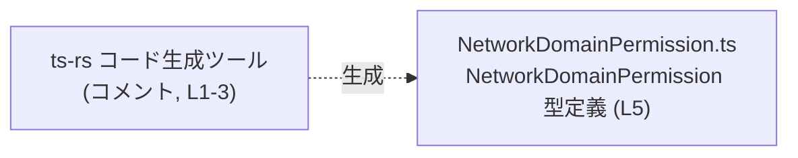
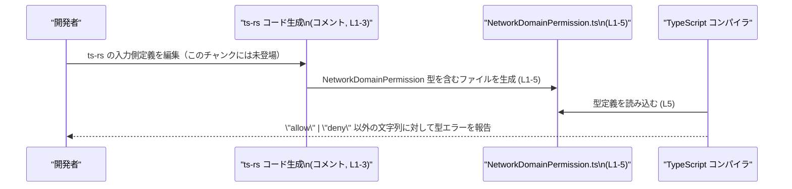

# app-server-protocol/schema/typescript/v2/NetworkDomainPermission.ts

## 0. ざっくり一言

`"allow"` か `"deny"` のいずれかの文字列だけを許可する、`NetworkDomainPermission` 型エイリアスを公開する自動生成ファイルです（`NetworkDomainPermission.ts:L1-5`）。

---

## 1. このモジュールの役割

### 1.1 概要

- このモジュールは、値が `"allow"` または `"deny"` の 2 通りに限定された文字列リテラルユニオン型 `NetworkDomainPermission` を定義し、エクスポートします（`NetworkDomainPermission.ts:L5-5`）。
- ファイル先頭のコメントから、この定義は [`ts-rs`](https://github.com/Aleph-Alpha/ts-rs) により生成されており、手動編集しないことが明示されています（`NetworkDomainPermission.ts:L1-3`）。

### 1.2 アーキテクチャ内での位置づけ

- ファイルパスから、この型は `app-server-protocol/schema/typescript/v2` 配下の **スキーマ定義の一部** として配置されています。
- このファイル自身は、他のモジュールを `import` していません（`NetworkDomainPermission.ts:L1-5` に `import` 文が存在しない）。
- 先頭コメントにより、`ts-rs` というコード生成ツールから出力される成果物の 1 つであることが分かります（`NetworkDomainPermission.ts:L1-3`）。

この関係を、生成ツールと本ファイルに絞って図示すると次のようになります。



> 補足: 上図はコメントに書かれている事実（ts-rs により生成されている）だけを反映しており、本リポジトリ内の他ファイルとの具体的な依存関係は、このチャンクからは分かりません。

### 1.3 設計上のポイント

- **自動生成 + 手動編集禁止**
  - 「GENERATED CODE」「Do not edit this file manually」と明記されています（`NetworkDomainPermission.ts:L1-3`）。
- **コンパイル時専用の型情報**
  - 実行時のロジックや状態を持つコードは一切なく、型エイリアス 1 つだけで構成されています（`NetworkDomainPermission.ts:L5-5`）。
- **文字列リテラルユニオンによる制約**
  - 値を `"allow"` か `"deny"` の 2 値に限定することで、TypeScript コンパイル時に不正な文字列の混入を検出できる構造になっています（`NetworkDomainPermission.ts:L5-5`）。
- **エラーハンドリング・並行性**
  - 関数やクラスが存在しないため、このファイル単体にはエラーハンドリングや並行性に関するロジックはありません（`NetworkDomainPermission.ts:L1-5`）。

---

## 2. 主要な機能一覧

- `NetworkDomainPermission` 型: 値を `"allow"` または `"deny"` のどちらかに限定する、文字列リテラルユニオン型エイリアスを提供します（`NetworkDomainPermission.ts:L5-5`）。

---

## 3. 公開 API と詳細解説

### 3.1 型一覧（構造体・列挙体など）

このファイルで公開されている型は 1 つです。

| 名前                      | 種別        | 役割 / 用途                                                                 | 定義箇所                                   |
|---------------------------|-------------|-----------------------------------------------------------------------------|--------------------------------------------|
| `NetworkDomainPermission` | 型エイリアス | `"allow"` または `"deny"` の 2 通りの文字列だけを許可する文字列リテラルユニオン型 | `NetworkDomainPermission.ts:L5-5`          |

> 備考: この型は `export type` で公開されているため、他の TypeScript ファイルからインポートして利用できます（`NetworkDomainPermission.ts:L5-5`）。

### 3.2 関数詳細（最大 7 件）

このファイルには関数が 1 つも定義されていません（`NetworkDomainPermission.ts:L1-5`）。  
代わりに、公開 API の中心である `NetworkDomainPermission` 型について詳細を整理します。

#### `NetworkDomainPermission`

**概要**

- TypeScript の文字列リテラルユニオン型です。
- 取り得る値は `"allow"` または `"deny"` の 2 つに限定されます（`NetworkDomainPermission.ts:L5-5`）。

```typescript
export type NetworkDomainPermission = "allow" | "deny";
```

**値のバリエーション**

| 値       | 説明（型レベルの事実）                      |
|----------|---------------------------------------------|
| `"allow"` | `NetworkDomainPermission` が取り得る 1 つの文字列リテラル |
| `"deny"`  | `NetworkDomainPermission` が取り得る もう 1 つの文字列リテラル |

**戻り値 / エラー**

- これは関数ではなく型定義なので、直接の戻り値やエラーはありません。
- ただし、`NetworkDomainPermission` を使うコードに対して:
  - `"allow"` / `"deny"` 以外の文字列を代入・渡そうとすると、TypeScript コンパイラが型エラーとして検出します（一般的な TypeScript の仕様による）。

**Examples（使用例）**

> ここからは「この型をどう使えるか」という一般的な TypeScript コード例です。実際のプロジェクト内のファイル構成・モジュールパスはこのチャンクからは分からないため、`"path/to/NetworkDomainPermission"` というプレースホルダを使っています。

```typescript
// 型をインポートする（実際のパスはプロジェクト構成に応じて調整する）
import type { NetworkDomainPermission } from "path/to/NetworkDomainPermission";

// NetworkDomainPermission 型を受け取る関数の例
function updateRule(permission: NetworkDomainPermission) {
    if (permission === "allow") {
        // "allow" の場合の処理を書く
    } else {
        // "deny" の場合の処理を書く
    }
}

// 正しい呼び出し例
updateRule("allow"); // OK: 型 NetworkDomainPermission の許可値
updateRule("deny");  // OK: 同上

// 誤った呼び出し例（TypeScript のコンパイルエラーになる）
// updateRule("block"); 
// エラー: 型 '"block"' を型 'NetworkDomainPermission' に割り当てることはできません
```

**Edge cases（エッジケース）**

型レベルで想定される代表的なケースは次のとおりです。

- `"allow"` / `"deny"` 以外の文字列リテラル  
  - 例: `"ALLOW"`, `"Allow"`, `"denied"` などは `NetworkDomainPermission` としては不正であり、コンパイル時にエラーになります（TypeScript 一般仕様）。
- ただの `string` 型の値  
  - 型が `string` の変数を `NetworkDomainPermission` として扱うには、型ガードや型アサーションが必要になります。
- `null` / `undefined`  
  - `NetworkDomainPermission` には含まれないため、そのままでは代入できません。`"allow" | "deny" | null` のように別途ユニオンを定義する必要があります。

**使用上の注意点**

- この型は **コンパイル時のチェック専用** であり、実行時には自動でバリデーションされません。外部入力（JSON, HTTP リクエストなど）から値を受け取る場合は、ランタイムで `"allow"` / `"deny"` かどうかを確認するコードが別途必要です。
- 型アサーション（`as NetworkDomainPermission`）や `any` 型を経由すると、本来型で防げるはずの不正な値も通ってしまうため、必要最小限に留めることが推奨されます（TypeScript 一般仕様）。
- 大文字・小文字は区別されます。`"allow"` と `"ALLOW"` は別の値として扱われ、後者は型エラーになります。

### 3.3 その他の関数

- このファイルには補助的な関数やラッパー関数も一切存在しません（`NetworkDomainPermission.ts:L1-5`）。

---

## 4. データフロー

このファイルには実行時の処理や関数が存在しないため、**ランタイムのデータフロー** はこのチャンクからは分かりません。  
一方で、コメントから分かる **コード生成〜コンパイル時** の流れを概念的に示すことはできます。



> 重要: 上図のうち、「このファイルが ts-rs によって生成される」という点はコメントに明示されています（`NetworkDomainPermission.ts:L1-3`）。  
> 実際にどのファイルが ts-rs の入力になっているか、また `NetworkDomainPermission` がどのコードから参照されているかは、このチャンクには現れていません。

---

## 5. 使い方（How to Use）

### 5.1 基本的な使用方法

`NetworkDomainPermission` を利用して、値を `"allow"` / `"deny"` の 2 通りに限定したい場面の典型的な使い方です。

```typescript
// 型をインポートする（実際のパスはプロジェクトに応じて変更する）
import type { NetworkDomainPermission } from "path/to/NetworkDomainPermission";

// 例: NetworkDomainPermission 型を引数に取る関数
function setPermission(permission: NetworkDomainPermission) {
    if (permission === "allow") {
        // 許可のときの処理
    } else {
        // 拒否のときの処理（permission === "deny"）
    }
}

// 正常系の利用例
setPermission("allow"); // OK
setPermission("deny");  // OK

// エラー例（コンパイル時に検出）
// setPermission("ALLOW"); // エラー: 型 '"ALLOW"' を 'NetworkDomainPermission' に割り当て不可
```

このように関数やオブジェクトのプロパティ型として使うことで、「許可／不許可」の区別を **任意の文字列ではなく限定されたリテラル** で表現できます。

### 5.2 よくある使用パターン

1. **設定オブジェクトのプロパティ型として使う**

```typescript
import type { NetworkDomainPermission } from "path/to/NetworkDomainPermission";

// ある設定オブジェクトの例
type DomainRule = {
    domain: string;                     // 対象ドメイン名
    permission: NetworkDomainPermission; // "allow" か "deny"
};

const rule: DomainRule = {
    domain: "example.com",
    permission: "allow", // "deny" も可
};
```

1. **キーに対する権限マップとして使う**

```typescript
import type { NetworkDomainPermission } from "path/to/NetworkDomainPermission";

const permissionsByDomain: Record<string, NetworkDomainPermission> = {
    "example.com": "allow",
    "another.com": "deny",
    // "block.com": "block", // エラー: 'block' は NetworkDomainPermission ではない
};
```

### 5.3 よくある間違い

```typescript
import type { NetworkDomainPermission } from "path/to/NetworkDomainPermission";

// 間違い例 1: 文字列のスペル・大小を変えてしまう
// const p1: NetworkDomainPermission = "ALLOW"; 
// エラー: '"ALLOW"' は 'NetworkDomainPermission' に代入できない

// 正しい例
const p1: NetworkDomainPermission = "allow";

// 間違い例 2: 型をただの string にしてしまい、制約が失われる
let p2: string = "allow";
p2 = "block"; // コンパイラはエラーにできない

// 正しい例: NetworkDomainPermission を使う
let p3: NetworkDomainPermission = "allow";
// p3 = "block"; // エラー: '"block"' は 'NetworkDomainPermission' に代入できない
```

### 5.4 使用上の注意点（まとめ）

- `NetworkDomainPermission` は **型レベルの制約** であり、実行時に自動検証されるわけではありません。外部入力から値を受け取る場合は `"allow"` / `"deny"` かどうかを明示的にチェックする必要があります。
- 値は **完全一致かつ大小文字区別** で評価され、「allow」「ALLOW」は別物として扱われます。
- `any` 型や過度な型アサーションを使うと、この型による安全性を失いやすくなります。
- 並行性・スレッド安全性に関する懸念は、このファイル単体には存在しません（実行時ロジックを持たないため）。

---

## 6. 変更の仕方（How to Modify）

### 6.1 新しい機能を追加する場合

このファイルはコメントで「GENERATED CODE」「Do not edit this file manually」と明示されているため（`NetworkDomainPermission.ts:L1-3`）、**直接編集することは前提にされていません**。

`NetworkDomainPermission` に関連する機能を追加したい場合の一般的な方針は次のとおりです。

1. **コード生成元を特定する**
   - コメントにあるとおり、ts-rs によって生成されているため（`NetworkDomainPermission.ts:L1-3`）、元になる定義（通常は Rust 側の型定義など）がどこにあるかをリポジトリ全体から確認します。
   - このチャンクには元定義の場所は記載されていません。

2. **元の定義に新しい値や型を追加する**
   - たとえば（一般論として） `"allow"` / `"deny"` に加えて別の状態を許可したい場合は、元定義にその状態を追加します。
   - 具体的な追加方法は ts-rs の設定および元言語側の型定義に依存し、このチャンクからは分かりません。

3. **ts-rs による再生成を行う**
   - コード生成プロセスを実行し、`NetworkDomainPermission.ts` を再生成します。

### 6.2 既存の機能を変更する場合

`"allow"` / `"deny"` のどちらかしか取れないという前提を変更したい場合の注意点です。

- **直接編集しない**
  - コメントに反してこのファイルを直接変更すると、次回の自動生成で上書きされる可能性があります（`NetworkDomainPermission.ts:L1-3`）。
- **値の名前を変える / 値を追加・削除する場合**
  - 生成元の定義を変更したうえで再生成する必要があります。
  - 変更後は、リポジトリ全体を検索し、`NetworkDomainPermission` を使用している箇所が新しい値セットに整合しているかを確認することが重要です。
- **契約（前提条件）の確認**
  - 現状の型は「この型を使うコードは `"allow"` または `"deny"` のどちらかを扱う」という契約を暗黙に表現しています。
  - 値のセットを変更すると、この契約も変わるため、利用側コードがそれを前提にしていないかを確認する必要があります。

---

## 7. 関連ファイル

このチャンク内には他のファイルへの `import` や、具体的な関連ファイルパスは一切記載されていません（`NetworkDomainPermission.ts:L1-5`）。  
そのため、**このファイルから直接特定できる関連ファイルはありません**。

| パス | 役割 / 関係 |
|------|------------|
| （不明） | このチャンクには `NetworkDomainPermission` を参照するファイルや、ts-rs の生成元ファイルのパスは記載されていません |

> 補足: `ts-rs` によって生成されていることから、何らかの元定義ファイルが存在することは推測できますが、その具体的な場所や名前はこのチャンクには現れないため、本レポートでは「不明」としています。
