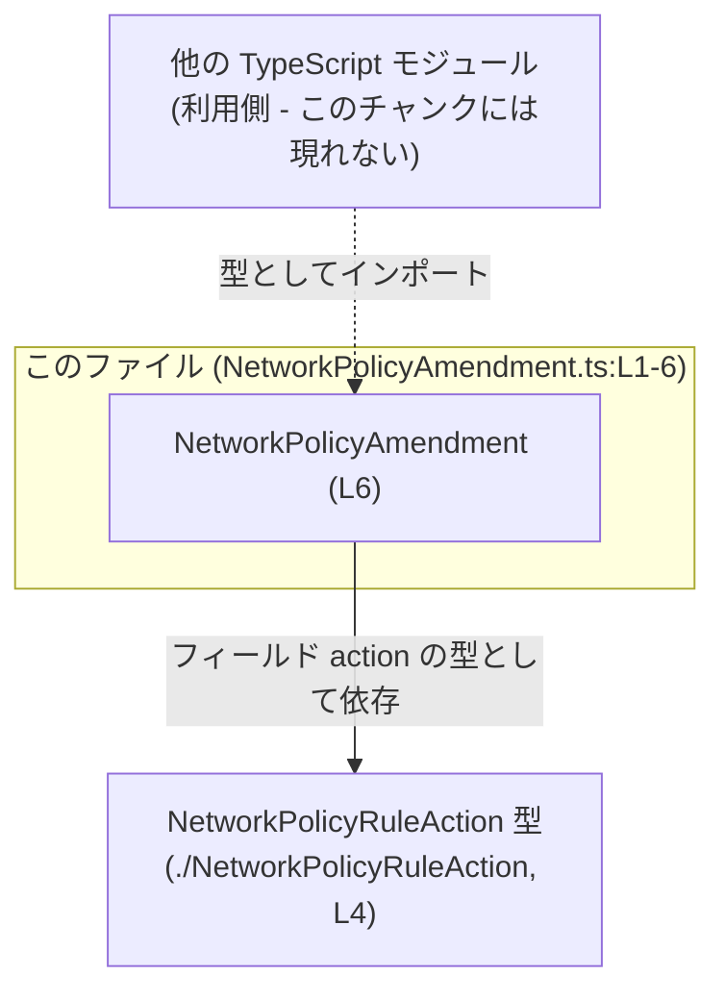
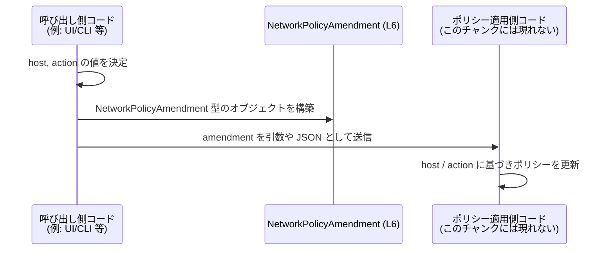

# app-server-protocol\schema\typescript\v2\NetworkPolicyAmendment.ts

## 0. ざっくり一言

`NetworkPolicyAmendment` は、対象ホスト名と、そのホストに対して適用するネットワークポリシーのアクションをまとめて表現する TypeScript の型定義です（NetworkPolicyAmendment.ts:L6-6）。

---

## 1. このモジュールの役割

### 1.1 概要

- このモジュールは、**「ネットワークポリシーの 1 件の変更内容」**を表すデータ構造を提供します（NetworkPolicyAmendment.ts:L6-6）。
- 具体的には、
  - `host`: 対象となるホスト名（文字列）
  - `action`: そのホストに対して実行するポリシーアクション（`NetworkPolicyRuleAction` 型）
  をフィールドとして持つオブジェクト型 `NetworkPolicyAmendment` をエクスポートします（NetworkPolicyAmendment.ts:L4-6）。
- 実行時のロジックは一切含まれず、コンパイル時の型チェックのための **スキーマ的な役割** を果たします（NetworkPolicyAmendment.ts:L4-6）。

### 1.2 アーキテクチャ内での位置づけ

- このモジュールは、同一ディレクトリの `./NetworkPolicyRuleAction` モジュールに依存しています（NetworkPolicyAmendment.ts:L4-4）。
- 他方で、このチャンクには `NetworkPolicyAmendment` を利用する側のコードは一切現れていません。そのため、**どのモジュールがこの型を使うかは不明**です。

依存関係の概念図を示します。



- 実際に `NetworkPolicyAmendment` をインポートしているモジュールは、このチャンクには存在しないため「Other」はあくまで概念上のノードです。

### 1.3 設計上のポイント

- **自動生成コードであること**  
  - 冒頭コメントに「GENERATED CODE」「Do not edit this file manually」と明記されています（NetworkPolicyAmendment.ts:L1-3）。
  - ts-rs というツールによって生成されたことがコメントから分かりますが（NetworkPolicyAmendment.ts:L3-3）、生成元の詳細や言語はこのチャンクからは特定できません。
- **型専用の依存関係**  
  - `import type { NetworkPolicyRuleAction } from "./NetworkPolicyRuleAction";` と `import type` で読み込んでおり（NetworkPolicyAmendment.ts:L4-4）、TypeScript のコンパイル後の JavaScript にはこの import は現れません。  
    → つまり **ランタイム依存ではなく、型チェックのためだけの依存** になっています。
- **単純なオブジェクト型のエイリアス**  
  - `export type NetworkPolicyAmendment = { host: string, action: NetworkPolicyRuleAction, };` という 1 行で完結したオブジェクト型です（NetworkPolicyAmendment.ts:L6-6）。
  - フィールドは `host` と `action` の 2 つのみで、オプショナルなプロパティやジェネリクスなどの複雑さはありません。
- **状態・並行性・エラー処理を持たない**  
  - クラスや関数がなく、単なる型エイリアスであるため、このファイル単体では状態管理・エラーハンドリング・非同期処理・並行性などのロジックは一切持ちません（NetworkPolicyAmendment.ts:L1-6）。

---

## 2. 主要な機能一覧

このファイルは 1 つの公開型のみを提供します。

- `NetworkPolicyAmendment`: 対象ホスト (`host`) と、そのホストに対するネットワークポリシーアクション (`action`) を一体で表すオブジェクト型（NetworkPolicyAmendment.ts:L6-6）。

---

## 3. 公開 API と詳細解説

### 3.1 型一覧（構造体・列挙体など）

このチャンクに登場する型および依存コンポーネントのインベントリーです。

| 名前 | 種別 | 定義/参照位置 | 役割 / 用途 | 備考 |
|------|------|---------------|------------|------|
| `NetworkPolicyAmendment` | 型エイリアス（オブジェクト型） | NetworkPolicyAmendment.ts:L6-6 | `host` と `action` を持つネットワークポリシー変更のペイロードを表す | このファイル唯一のエクスポート |
| `NetworkPolicyRuleAction` | 依存型（型インポート） | NetworkPolicyAmendment.ts:L4-4 | `action` フィールドの型として使用される | 定義本体は `./NetworkPolicyRuleAction` モジュール側にあり、このチャンクには現れない |

> 関数・クラス・列挙体・インターフェースなどは、このファイルには定義されていません（NetworkPolicyAmendment.ts:L1-6）。

---

### 3.2 関数詳細（最大 7 件）

このファイルには **関数・メソッドは存在しません**（NetworkPolicyAmendment.ts:L1-6）。  
代わりに、公開 API である `NetworkPolicyAmendment` 型について、関数詳細テンプレートに準じた形で解説します。

#### `type NetworkPolicyAmendment = { host: string; action: NetworkPolicyRuleAction }`

**概要**

- ネットワークポリシーに関する「1 件の変更（Amendment）」を表すオブジェクトの型エイリアスです（NetworkPolicyAmendment.ts:L6-6）。
- 2 つの必須プロパティを持ちます。
  - `host`: 対象ホスト名（文字列）
  - `action`: そのホストに対して適用するアクション（`NetworkPolicyRuleAction` 型）

**フィールド**

| フィールド名 | 型 | 説明 | 根拠 |
|-------------|----|------|------|
| `host` | `string` | 対象となるホスト名を表す文字列。ドメイン名やホスト識別子などを格納すると想定されますが、具体的な形式はこの型では制約されていません。 | NetworkPolicyAmendment.ts:L6-6 |
| `action` | `NetworkPolicyRuleAction` | 対象ホストに適用するネットワークポリシーアクション。具体的なバリエーションや値は、`./NetworkPolicyRuleAction` モジュール側の定義に依存します。 | NetworkPolicyAmendment.ts:L4-4, L6-6 |

**内部処理の流れ（アルゴリズム）**

- この定義は **型エイリアス** であり、関数やメソッドのような実行時処理は一切ありません（NetworkPolicyAmendment.ts:L6-6）。
- TypeScript コンパイラが行う主なことは次の通りです。
  - `NetworkPolicyAmendment` 型として宣言・使用された値に対して、
    - `host` プロパティが存在し、その型が `string` であること
    - `action` プロパティが存在し、その型が `NetworkPolicyRuleAction` であること  
    をコンパイル時にチェックします（NetworkPolicyAmendment.ts:L6-6）。
  - これらの条件を満たさない場合、**コンパイルエラー** になります。  
- コンパイル後に生成される JavaScript には、この型そのものは存在せず、オブジェクトリテラル／構造だけが残ります。

**Examples（使用例）**

以下は、この型を利用した典型的なコード例です。  
（`NetworkPolicyRuleAction` の具体的な中身はこのチャンクには現れないため、プレースホルダコメントで示します。）

```typescript
// NetworkPolicyAmendment 型をインポートする例
import type { NetworkPolicyAmendment } from "./NetworkPolicyAmendment";  // 同一ディレクトリから型をインポート（実際のパスはプロジェクト構成に依存）

// action 用の型もインポート（定義本体は別モジュール）
import type { NetworkPolicyRuleAction } from "./NetworkPolicyRuleAction"; // NetworkPolicyAmendment.ts:L4-4 に対応

// どこかで有効なアクション値を用意する（定義はこのチャンクには現れない）
const action: NetworkPolicyRuleAction = /* NetworkPolicyRuleAction 型の値 */;

// NetworkPolicyAmendment 型の値を作成する
const amendment: NetworkPolicyAmendment = {
    host: "example.com",   // 対象ホスト（string 型）
    action,                // 適用するアクション（NetworkPolicyRuleAction 型）
};
```

- `host` に数値を入れようとすると、`string` ではないためコンパイルエラーになります。
- `action` に `NetworkPolicyRuleAction` 以外の型（たとえば単なる文字列など）を代入すると、同様にコンパイルエラーになります。

**Errors / Panics**

この型自体には実行時エラーや panic の概念はありませんが、TypeScript の型チェックとして次のようなエラーが発生し得ます。

- `host` が `string` でない場合

  ```typescript
  const bad: NetworkPolicyAmendment = {
      host: 123,        // エラー: number 型は string 型に割り当てられない
      //       ~~~
      action,           // ここは型が合っていれば OK
  };
  ```

- `action` が `NetworkPolicyRuleAction` 以外の型の場合

  ```typescript
  const bad: NetworkPolicyAmendment = {
      host: "example.com",
      action: "ALLOW",  // エラー: string 型は NetworkPolicyRuleAction 型に割り当てられない可能性が高い
      //       ~~~~~~
  };
  ```

これらはすべて **コンパイル時** に検出され、JavaScript として実行される前に修正を促します。

**Edge cases（エッジケース）**

型レベルで表現されていない（= 実行時やドメインロジック側に委ねられている）エッジケースとして、次のようなものが考えられます。

- `host` が空文字列 `""` の場合  
  - 型としては `string` なので許容されます（NetworkPolicyAmendment.ts:L6-6）。  
  - 実際にこれを許すかどうかは、利用側のロジック・バリデーション次第であり、このチャンクからは分かりません。
- `host` が不正な形式（ホスト名としてあり得ない文字列）の場合  
  - 同様に、型としては `string` の範囲内であれば何でも通ります。
- `action` の値が「論理的には不適切」な場合  
  - たとえば「ホワイトリスト用のアクションなのに、ある種のホストには適用できない」といった業務的制約があっても、それは `NetworkPolicyRuleAction` 側や利用側のロジックで扱う必要があります。  
  - `NetworkPolicyAmendment` 型は、そうした業務制約までは表現していません（NetworkPolicyAmendment.ts:L6-6）。

**使用上の注意点**

- **自動生成ファイルのため直接編集しない**  
  - コメントに「Do not edit this file manually」とあるため（NetworkPolicyAmendment.ts:L1-3）、新しいフィールド追加や型変更は **生成元（ts-rs 側など）で行い再生成する** 前提と考えられます。  
  - 生成元がどこにあるか、このチャンクだけでは特定できません。
- **バリデーションは別途必要**  
  - `host` が単なる `string` であるため、形式チェック（FQDN か、IP アドレスかなど）は別レイヤで行う必要があります（NetworkPolicyAmendment.ts:L6-6）。
- **並行性・共有に関する注意**  
  - この型は通常のオブジェクトであり、プロパティは可変です（`readonly` ではない）。  
  - 非同期処理間で同じオブジェクトを共有し、後から `host` や `action` を書き換えるような使い方をすると、ロジック上の競合状態を生む可能性があります。  
  - 必要に応じてコピーして使うか、`Readonly<NetworkPolicyAmendment>` などで読み取り専用化することが検討されます。
- **セキュリティ面**  
  - この型自身は入力のサニタイズを行わない単なるコンテナです。  
  - ネットワーク越しに受け取った `host` や `action` をそのまま信頼して利用する場合は、利用側で十分な検証・フィルタリングが必要です。

---

### 3.3 その他の関数

- このファイルには補助関数やラッパー関数を含め、**一切の関数定義が存在しません**（NetworkPolicyAmendment.ts:L1-6）。

---

## 4. データフロー

このチャンクには `NetworkPolicyAmendment` を実際に利用するコードは含まれていませんが（NetworkPolicyAmendment.ts:L1-6）、一般的な利用イメージとして、次のようなデータフローが想定されます。

1. 呼び出し側がユーザー入力や別システムから受け取った情報を基に `host` と `action` を決定する。
2. それらを用いて `NetworkPolicyAmendment` 型のオブジェクトを生成する。
3. 生成したオブジェクトを、ネットワークポリシー関連の処理を行うコンポーネント（サーバー側など）に渡す。

概念的なシーケンス図です。



- 上記の `Server` の部分は、このファイルでは定義されておらず、あくまで典型的な利用シナリオの例に過ぎません。

---

## 5. 使い方（How to Use）

### 5.1 基本的な使用方法

`NetworkPolicyAmendment` 型を引数として受け取り、ポリシーを適用する関数を定義する例です。  
（利用側の関数はこのチャンクには現れないため、ここではサンプルとして示します。）

```typescript
// 型定義をインポートする（パスはプロジェクトの構造に応じて調整）
import type { NetworkPolicyAmendment } from "./NetworkPolicyAmendment";      // このファイルの公開型
import type { NetworkPolicyRuleAction } from "./NetworkPolicyRuleAction";    // action 用の型

// NetworkPolicyAmendment 型の値を受け取り、何らかの処理を行う関数の例
function applyNetworkPolicy(amendment: NetworkPolicyAmendment) {             // 引数に型を付けることで、安全にアクセスできる
    // host と action に型安全にアクセスできる
    console.log("Host:", amendment.host);                                    // amendment.host は string 型
    console.log("Action:", amendment.action);                                // amendment.action は NetworkPolicyRuleAction 型

    // 実際のポリシー適用処理はこのチャンクからは不明
}

// どこかでアクション値を用意する
const action: NetworkPolicyRuleAction = /* ... 有効な NetworkPolicyRuleAction ... */;

// NetworkPolicyAmendment 型の値を作成して関数を呼び出す
const amendment: NetworkPolicyAmendment = {
    host: "example.com",                                                     // 対象ホスト
    action,                                                                  // 適用するアクション
};

applyNetworkPolicy(amendment);                                               // 型チェック済みの値を渡す
```

### 5.2 よくある使用パターン

1. **複数の変更を配列で扱う**

```typescript
import type { NetworkPolicyAmendment } from "./NetworkPolicyAmendment";

// 複数の NetworkPolicyAmendment をまとめて扱う例
const amendments: NetworkPolicyAmendment[] = [
    { host: "example.com", action: /* ... */ },   // 1 件目の変更
    { host: "api.example.com", action: /* ... */ } // 2 件目の変更
];

// まとめて処理する
for (const amendment of amendments) {             // 各要素は NetworkPolicyAmendment 型
    // amendment.host / amendment.action に安全にアクセス
}
```

1. **部分更新用に `Partial` と組み合わせる**

```typescript
import type { NetworkPolicyAmendment } from "./NetworkPolicyAmendment";

// 変更差分だけを扱うような場面（PATCH 相当）の例
type NetworkPolicyAmendmentPatch = Partial<NetworkPolicyAmendment>; // host, action がどちらもオプショナルになる

const patch: NetworkPolicyAmendmentPatch = {
    action: /* ... */ ,                          // host を変えずに action だけ変更したい場合など
};
// 実際の適用ロジックは別途実装が必要（このチャンクには現れない）
```

### 5.3 よくある間違い

1. **型に合わない値を入れてしまう**

```typescript
import type { NetworkPolicyAmendment } from "./NetworkPolicyAmendment";

// 間違い例: host に number を入れてしまう
const wrong1: NetworkPolicyAmendment = {
    host: 123,           // エラー: number 型は string 型に割り当てられない
    action: /* ... */,
};

// 正しい例: host は string にする
const correct1: NetworkPolicyAmendment = {
    host: "123",         // OK: string 型
    action: /* ... */,
};
```

1. **必須フィールドを省略してしまう**

```typescript
// 間違い例: action を省略している
const wrong2: NetworkPolicyAmendment = {
    host: "example.com",
    // action がないためエラー
};

// 正しい例: host と action を両方指定する
const correct2: NetworkPolicyAmendment = {
    host: "example.com",
    action: /* ... */,
};
```

### 5.4 使用上の注意点（まとめ）

- **型は単純だが、ドメイン制約は表現していない**  
  - `host` は任意の文字列を受け入れるため、ホスト名として妥当かどうかは別途検証が必要です（NetworkPolicyAmendment.ts:L6-6）。
- **自動生成ファイルを直接編集しない**  
  - コメントに従い、変更は生成元側で行い、このファイルは上書きされる前提で扱う必要があります（NetworkPolicyAmendment.ts:L1-3）。
- **オブジェクトのミューテーションに注意**  
  - 同じ `NetworkPolicyAmendment` オブジェクトを複数箇所で共有し、あとから書き換えると予期せぬ副作用が起こる可能性があります。  
  - 必要なら `Readonly<NetworkPolicyAmendment>` を利用するか、コピーして扱うことが推奨されます。
- **テストコードの所在は不明**  
  - このチャンクにはテストは含まれておらず、`NetworkPolicyAmendment` に対するテストがどこにあるかは不明です（NetworkPolicyAmendment.ts:L1-6）。

---

## 6. 変更の仕方（How to Modify）

### 6.1 新しい機能を追加する場合

このファイルは自動生成されており、「手で編集してはいけない」とコメントされています（NetworkPolicyAmendment.ts:L1-3）。そのため、**直接このファイルを書き換えることは前提になっていません**。

一般的な方針としては次のようになります。

1. `NetworkPolicyAmendment` に新しいフィールド（例: `port` や `protocol`）を追加したい場合:
   - ts-rs によって生成されている元の定義（スキーマ）を探し、そちらにフィールドを追加する必要があります。  
     - ただし、その場所や形式はこのチャンクからは分からないため、プロジェクト全体の構成を確認する必要があります。
2. 生成元を変更したら、ts-rs によるコード生成を再実行し、このファイルを自動で更新します。
3. 追加されたフィールドを利用しているコード（呼び出し側・サーバー側等）に対しても、型エラーが発生していないか確認します。

### 6.2 既存の機能を変更する場合

`host` や `action` の型を変更することは、広い影響範囲を持つ可能性があります。

- **影響範囲の確認**
  - `NetworkPolicyAmendment` をインポートしているモジュールを検索し、どこでどのように使われているかを確認する必要があります（このチャンクには使用箇所が現れないため、IDE や検索を使って調査が必要です）。
- **契約（コントラクト）の観点**
  - `host` が `string` であること（NetworkPolicyAmendment.ts:L6-6）。
  - `action` が `NetworkPolicyRuleAction` 型であること（NetworkPolicyAmendment.ts:L4-4, L6-6）。  
  これらを変更する場合、既存コードとの互換性が失われる可能性があります。
- **再生成とテスト**
  - 変更後は ts-rs による生成を再実行し、型定義が期待どおりになっていることを確認します。
  - その上で、関連するテストや実行環境での動作確認が必要です（テストの所在はこのチャンクからは不明です）。

---

## 7. 関連ファイル

このモジュールと直接の関係があるものは、import で参照されているモジュールのみです。

| パス / モジュール名 | 役割 / 関係 |
|---------------------|------------|
| `./NetworkPolicyRuleAction` | `NetworkPolicyAmendment` の `action` フィールドの型として利用されるモジュールです（NetworkPolicyAmendment.ts:L4-4）。実際のファイル名や拡張子（`.ts` / `.d.ts` など）は、このチャンクからは特定できません。 |

- この他に `NetworkPolicyAmendment` を利用しているファイルが存在する可能性は高いですが、このチャンクには現れません。利用側の特定には、プロジェクト全体のコード検索が必要です。
