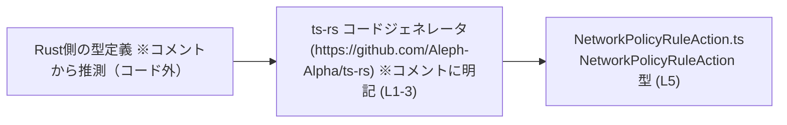
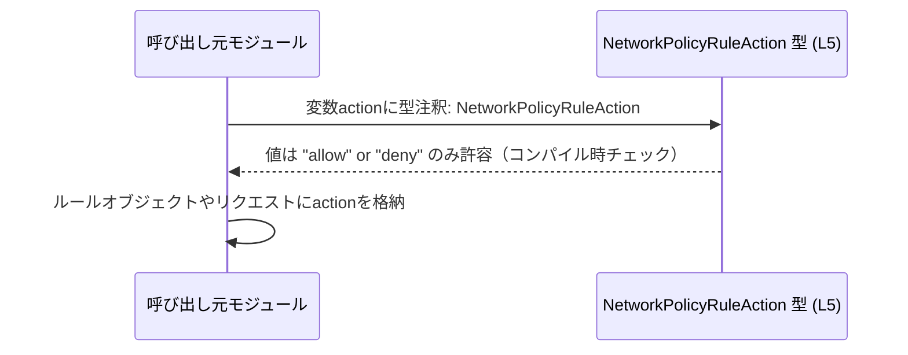

# app-server-protocol/schema/typescript/v2/NetworkPolicyRuleAction.ts コード解説

## 0. ざっくり一言

- ネットワークポリシーのルールが取り得るアクションを `"allow"` と `"deny"` の2種類に限定する、文字列リテラルのユニオン型定義です（NetworkPolicyRuleAction.ts:L5-5）。

---

## 1. このモジュールの役割

### 1.1 概要

- このモジュールは、ネットワークポリシーのルールアクションを表す TypeScript 型 `NetworkPolicyRuleAction` を提供します（NetworkPolicyRuleAction.ts:L5-5）。
- 型レベルで `"allow"` または `"deny"` 以外の文字列を排除し、コンパイル時の型安全性を高める目的で利用されると解釈できます（ただし、具体的な利用箇所はこのチャンクには現れません）。

### 1.2 アーキテクチャ内での位置づけ

- ファイル先頭コメントから、この型定義は Rust 向けライブラリ **ts-rs** によって自動生成されていることが分かります（NetworkPolicyRuleAction.ts:L1-3）。
- したがって、Rust 側の対応する型定義（ts-rs の入力）と TypeScript 側のスキーマの橋渡しをする役割を持つと読み取れますが、具体的な Rust 型名や呼び出し関係はこのチャンクには現れません。

概念的な依存関係（コメントから読み取れる範囲）を図示します。



※ Rust 側の型定義や、この型をインポートする他の TypeScript モジュールは、このチャンクには現れないため、図には「概念的なもの」としてのみ示しています。

### 1.3 設計上のポイント

- 自動生成コードであり、手で編集すべきでないことがコメントで明示されています（NetworkPolicyRuleAction.ts:L1-3）。
- 実行時のロジックや状態は一切持たず、**文字列リテラルユニオン型** だけを提供する、純粋な型定義ファイルです（NetworkPolicyRuleAction.ts:L5-5）。
- `"allow"` / `"deny"` を列挙することで、TypeScript の型システムにより、スペルミスや無効なアクション値をコンパイル時に検出できる設計になっています。

---

## 2. 主要な機能一覧

- `NetworkPolicyRuleAction` 型定義: ネットワークポリシーのルールアクションを `"allow"` または `"deny"` のいずれかに限定する文字列リテラルユニオン型。

---

## 3. 公開 API と詳細解説

### 3.1 型一覧（構造体・列挙体など）

| 名前                      | 種別                        | 定義箇所                                   | 役割 / 用途 |
|---------------------------|-----------------------------|--------------------------------------------|-------------|
| `NetworkPolicyRuleAction` | 型エイリアス（文字列ユニオン） | NetworkPolicyRuleAction.ts:L5-5           | ネットワークポリシーのルールが取り得るアクションを `"allow"` または `"deny"` に制限する |

#### `NetworkPolicyRuleAction` の詳細

- 定義:

  ```typescript
  export type NetworkPolicyRuleAction = "allow" | "deny";
  //                                   ^^^^^^^^^^^^^^^^^
  //                                   文字列リテラルユニオン (L5)
  ```

- 型の意味:
  - この型を使うと、変数やプロパティ、関数の引数/戻り値などに `"allow"` または `"deny"` のどちらかしか代入できません。
  - それ以外の文字列（例: `"ALLOW"`, `"block"`）を代入するとコンパイルエラーになります。

- 安全性（TypeScript特有の観点）:
  - ユニオン型により、**コンパイル時** に値の取り得る範囲を制限できます。
  - `string` 型単体に比べて、IDE の補完や `switch` 文での網羅性チェックが効きやすくなります。

- 並行性・エラー:
  - この型自体には実行時処理がなく、並行性や実行時エラーに関する懸念は直接的にはありません。
  - ただし、この型を使わずに `any` や単なる `string` を利用すると、値の誤りが実行時まで検出されない可能性があります。

### 3.2 関数詳細（最大 7 件）

- このファイルには関数・メソッドは定義されていません（NetworkPolicyRuleAction.ts:L1-5）。

### 3.3 その他の関数

- 該当なし（関数定義が存在しません）。

---

## 4. データフロー

このファイル単体には関数や処理フローは含まれていないため、実際のデータフローは記述されていません（NetworkPolicyRuleAction.ts:L1-5）。  
ここでは、**利用される際に想定される一般的な流れ** を、あくまで概念的な例として示します（このようなコードは本チャンクには存在しません）。

### 概念的なシナリオ

- 呼び出し元モジュールで `NetworkPolicyRuleAction` 型を使って変数 `action` を定義する。
- その値を、ネットワークポリシールールを表すオブジェクトや API リクエストの一部として利用する。



※ 上記は TypeScript の型システム上の制約を概念的に表したものであり、実際のモジュール構成や呼び出し関係はこのチャンクには現れません。

---

## 5. 使い方（How to Use）

このファイルからは利用コードは読み取れませんが、`NetworkPolicyRuleAction` 型をどのように活用できるかを示すために、代表的な使用例を示します（**実際の import パスや周辺コードはプロジェクト構成に依存し、このチャンクには現れません**）。

### 5.1 基本的な使用方法

#### 例1: プロパティとして利用する

```typescript
// import のパスはプロジェクト構成に応じて調整する必要があります。
import type { NetworkPolicyRuleAction } from "./NetworkPolicyRuleAction"; // 仮のパス

// ネットワークポリシーのルールを表すインターフェースの例
interface NetworkPolicyRule {
    action: NetworkPolicyRuleAction; // "allow" または "deny" のみ
    // 他のフィールドは省略
}

// 正しい値の例
const rule1: NetworkPolicyRule = {
    action: "allow",  // OK
};

// 間違った値の例（コンパイルエラーになる）
const rule2: NetworkPolicyRule = {
    // @ts-expect-error: "ALLOW" は NetworkPolicyRuleAction に含まれない
    action: "ALLOW",  // NG: 大文字は許可されない
};
```

このように、型を付けることで `"ALLOW"` のようなスペルや大文字小文字の誤りをコンパイル時に検出できます。

### 5.2 よくある使用パターン

#### 例2: 関数の引数として利用する

```typescript
import type { NetworkPolicyRuleAction } from "./NetworkPolicyRuleAction";

// ルールアクションを受け取り処理する関数の例
function applyAction(action: NetworkPolicyRuleAction) {
    switch (action) {
        case "allow":
            // 許可処理
            break;
        case "deny":
            // 拒否処理
            break;
        // ユニオン型のため、他のケースは存在しない
    }
}

// 呼び出し例
applyAction("allow"); // OK
// @ts-expect-error: "block" は許可されていない値
applyAction("block"); // コンパイルエラー
```

- `switch` 文と組み合わせると、TypeScript は `action` が `"allow"` または `"deny"` に限定されることを把握できるため、不要な `default` 分岐を省略できます。

### 5.3 よくある間違い

```typescript
import type { NetworkPolicyRuleAction } from "./NetworkPolicyRuleAction";

// 間違い例: 型を単なる string にしてしまう
let action1: string = "allow";                     // コンパイルは通るが "alow" などの誤りも通ってしまう
action1 = "alow";                                  // スペルミスでもエラーにならない

// 正しい例: NetworkPolicyRuleAction を利用する
let action2: NetworkPolicyRuleAction = "allow";    // OK
// @ts-expect-error: "alow" は NetworkPolicyRuleAction に含まれない
action2 = "alow";                                  // コンパイルエラーで誤りに気づける

// 間違い例: any を使ってしまう
let action3: any = "deny";                         // 型チェックが効かない
action3 = "something-else";                        // 何でも入ってしまう

// 正しい例: ユニオン型をそのまま使う
let action4: NetworkPolicyRuleAction = "deny";     // OK
```

### 5.4 使用上の注意点（まとめ）

- **値は `"allow"` と `"deny"` のみ**  
  - 文字列の大文字小文字も区別されるため、`"Allow"` や `"ALLOW"` は別の値として扱われ、型エラーになります（NetworkPolicyRuleAction.ts:L5-5）。
- **自動生成ファイルのため手動編集しない**  
  - ファイル先頭に「GENERATED CODE! DO NOT MODIFY BY HAND!」と記載されており（NetworkPolicyRuleAction.ts:L1-3）、元となる定義（Rust 側の型など）を変更して再生成するのが前提です。
- **セキュリティ/バグ観点**  
  - 実行時ロジックはないため、この型自体が直接セキュリティホールになることはありません。
  - ただし、この型を使わずに自由な文字列を扱うと、意図しないアクション値が入るバグの原因となる可能性があります。

---

## 6. 変更の仕方（How to Modify）

### 6.1 新しい機能を追加する場合

- このファイルは ts-rs による自動生成コードであり、コメントで手動編集禁止が明示されています（NetworkPolicyRuleAction.ts:L1-3）。
- そのため、例えば `"log"` や `"monitor"` のような新しいアクションを追加したい場合は:
  - **元となる定義側（Rust の型など）** に新しいバリアントや値を追加し、
  - ts-rs による再生成を行う必要があります。
- このファイルを直接編集して `"allow" | "deny" | "log"` のように変更すると、再生成時に上書きされる可能性が高く、一貫性が保てなくなる点に注意が必要です。

### 6.2 既存の機能を変更する場合

- `"allow"` や `"deny"` の文字列そのものを変更したい場合も、同様に元定義側を変更して再生成するのが前提です（NetworkPolicyRuleAction.ts:L1-3）。
- 変更時に注意すべき点:
  - この型を使用しているすべての TypeScript コードが影響を受けるため、**呼び出し元のビルドエラーを確認しながら** 影響範囲を洗い出す必要があります。
  - サーバー/クライアント間のプロトコルとして使われている場合、両者のスキーマが同期していることが前提になりますが、本チャンクからは具体的な通信仕様は分かりません。

---

## 7. 関連ファイル

このチャンクには、他ファイル名や具体的な参照関係は現れていません。コメントとパス構造から推測される関連を、事実と推測を分けて整理します。

| パス / 区分 | 役割 / 関係 |
|-------------|------------|
| `app-server-protocol/schema/typescript/v2/NetworkPolicyRuleAction.ts` | 本ファイル。ネットワークポリシールールのアクションを `"allow"` / `"deny"` に限定する型定義を提供する（NetworkPolicyRuleAction.ts:L5-5）。 |
| Rust 側の対応する型定義（パス不明） | ts-rs による自動生成元となると思われる Rust の型定義。コメントから存在が示唆されるが、このチャンクにはパスや名称は現れない（NetworkPolicyRuleAction.ts:L1-3）。 |
| `app-server-protocol/schema/typescript/v2/` 配下の他ファイル | 同じスキーマバージョン (`v2`) に属する TypeScript 型定義群と推測されるが、本チャンクには具体的なファイル名や依存関係は現れない。 |

---

### コンポーネントインベントリー（このファイル内のまとめ）

| 種別   | 名前                      | 定義箇所                         | 備考 |
|--------|---------------------------|----------------------------------|------|
| 型     | `NetworkPolicyRuleAction` | NetworkPolicyRuleAction.ts:L5-5 | `"allow"` / `"deny"` の文字列リテラルユニオン。自動生成コードとしてエクスポートされている。 |
| 関数   | なし                      | -                                | このファイルには関数定義は存在しない。 |
| クラス | なし                      | -                                | このファイルにはクラス定義は存在しない。 |

このファイルは非常に小さな型定義ですが、ネットワークポリシーのアクション値を型レベルで制約することで、全体のバグ防止とスキーマの一貫性に貢献する位置づけになっています。
