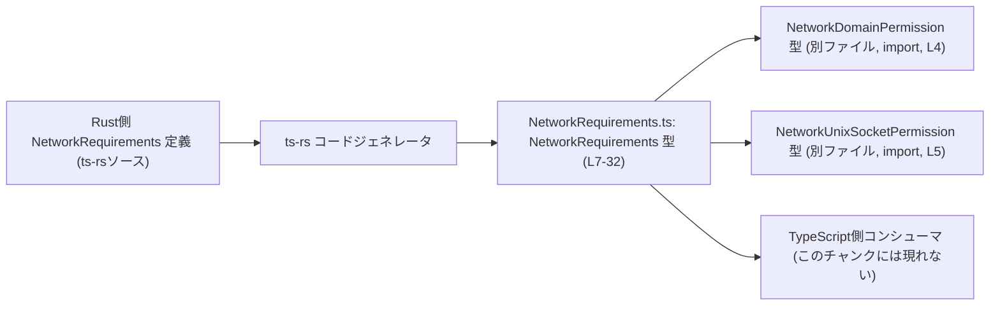

# app-server-protocol/schema/typescript/v2/NetworkRequirements.ts

## 0. ざっくり一言

`experimental_network` 機能まわりのネットワーク設定・権限（ドメインと Unix ソケット）を 1 つのオブジェクトで表現するための **自動生成された TypeScript 型定義**です（生成元: ts-rs）。  
（根拠: 自動生成コメント `// GENERATED CODE!` と ts-rs 言及 `This file was generated by [ts-rs]`、`NetworkRequirements.ts:L1-3`）

---

## 1. このモジュールの役割

### 1.1 概要

- Rust 側のスキーマから ts-rs によって生成された、**App Server Protocol v2 用の TypeScript スキーマの一部**です（パスとコメントより判断）  
  （根拠: パス `schema/typescript/v2` と ts-rs コメント `NetworkRequirements.ts:L1-3`）
- 実験的ネットワーク機能 `experimental_network` に関する要求事項（ポート、プロキシ許可、ドメイン許可、Unix ソケット許可など）を一括して表現するための **構造化データ** を提供します。  
  （根拠: フィールド名と JSDoc コメント `experimental_network` 言及 `NetworkRequirements.ts:L8-11,L25-28`）
- このファイル自身には **関数やロジックは一切なく**、あくまで型（データ構造）のみを定義しています。  
  （根拠: `export type ... = { ... }` のみで関数定義がない `NetworkRequirements.ts:L7-32`）

### 1.2 アーキテクチャ内での位置づけ

このファイルが担う位置づけを、依存関係ベースで図示します。



- Rust 側の定義から ts-rs により本ファイルが生成される構成です（コメントより）。  
  （根拠: `This file was generated by [ts-rs]` `NetworkRequirements.ts:L3`）
- このファイルは `NetworkDomainPermission` と `NetworkUnixSocketPermission` の 2 つの型に依存しますが、両者の定義は別ファイルであり、このチャンクには含まれていません。  
  （根拠: import 文 `NetworkRequirements.ts:L4-5`）
- `NetworkRequirements` 型を実際に利用するコード（クライアントやサーバ）は、このチャンクには現れません。

### 1.3 設計上のポイント

- **コード生成された型**  
  - 直接編集しないことが明示されています。変更は Rust 側スキーマで行う前提です。  
    （根拠: `GENERATED CODE! DO NOT MODIFY BY HAND!` `NetworkRequirements.ts:L1`）
- **三値（true/false/null）を多用**  
  - すべてのフラグ・数値フィールドが `T | null` になっており、「未指定」を `null` で表現できる設計です。  
    （根拠: `enabled: boolean | null, httpPort: number | null, ...` `NetworkRequirements.ts:L7,L16,L20,L24,L32`）
- **正規形（canonical）＋レガシービューの二層構造**  
  - `domains` / `unixSockets` が「canonical」な権限マップで、`allowedDomains` / `deniedDomains` / `allowUnixSockets` はそこから導出される「Legacy compatibility view」とされています。  
    （根拠: コメント `Canonical ... map` と `Legacy compatibility view derived from ...` `NetworkRequirements.ts:L8-11,L17-20,L21-24,L25-28,L29-32`）
- **辞書型マップによる権限テーブル**  
  - ドメインと Unix ソケットは、それぞれ文字列キーのマップ `{ [key in string]?: ... }` で表現されます。  
    （根拠: `domains: { [key in string]?: NetworkDomainPermission } | null`、`unixSockets: { [key in string]?: NetworkUnixSocketPermission } | null` `NetworkRequirements.ts:L11,L28`）
- **このファイル単体では並行性やエラー処理は扱わない**  
  - TypeScript の型定義のみで、非同期処理・並行性・例外処理は利用側の実装に依存します。

---

## 2. 主要な機能一覧

このモジュールが提供する「機能」は 1 つの型ですが、その内部フィールドは役割ごとに分かれています。

- `NetworkRequirements` 型: `experimental_network` のためのネットワーク関連設定をまとめたデータ構造
  - 実験的ネットワーク機能の有効/無効やポート番号を保持 (`enabled`, `httpPort`, `socksPort`)（`NetworkRequirements.ts:L7`）
  - 上流プロキシや危険な設定フラグを表す (`allowUpstreamProxy`, `dangerouslyAllowNonLoopbackProxy`, `dangerouslyAllowAllUnixSockets`)（`NetworkRequirements.ts:L7`）
  - ドメイン権限の正規マップ＋レガシーな許可/拒否リスト (`domains`, `allowedDomains`, `deniedDomains`)（`NetworkRequirements.ts:L8-11,L17-20,L21-24`）
  - Unix ソケット権限の正規マップ＋レガシーな許可リスト (`unixSockets`, `allowUnixSockets`)（`NetworkRequirements.ts:L25-28,L29-32`）
  - 管理対象のみを尊重するモードや、ローカルバインディング・フルアクセス関連のフラグ (`managedAllowedDomainsOnly`, `allowLocalBinding`, `dangerFullAccessDenylistOnly`)（`NetworkRequirements.ts:L16,L32`）

---

## 3. 公開 API と詳細解説

### 3.1 型一覧（構造体・列挙体など）

| 名前 | 種別 | 役割 / 用途 | 定義位置 |
|------|------|-------------|----------|
| `NetworkRequirements` | 型エイリアス（オブジェクト型） | `experimental_network` に関する設定・権限をまとめたルートオブジェクト | `NetworkRequirements.ts:L7-32` |
| `NetworkDomainPermission` | 型（外部定義） | ドメイン単位のネットワーク権限を表す型。`domains` の値として利用される | import: `NetworkRequirements.ts:L4`（定義は別ファイル） |
| `NetworkUnixSocketPermission` | 型（外部定義） | Unix ソケット単位のネットワーク権限を表す型。`unixSockets` の値として利用される | import: `NetworkRequirements.ts:L5`（定義は別ファイル） |

#### `NetworkRequirements` 型のフィールド一覧

| フィールド名 | 型 | 説明（分かる範囲） | 定義位置 |
|--------------|----|---------------------|----------|
| `enabled` | `boolean \| null` | 実験的ネットワーク機能の有効/無効を表すと推測される三値フラグ。用途は名前からの推測であり、コメント上の明示はありません | `NetworkRequirements.ts:L7` |
| `httpPort` | `number \| null` | HTTP 用ポート番号と思われる数値。詳細な意味づけはこのファイルでは明示されていません | `NetworkRequirements.ts:L7` |
| `socksPort` | `number \| null` | SOCKS プロキシ用ポート番号と思われる数値。詳細は不明 | `NetworkRequirements.ts:L7` |
| `allowUpstreamProxy` | `boolean \| null` | 上流プロキシ利用を許可するフラグと推測されますが、コメントはありません | `NetworkRequirements.ts:L7` |
| `dangerouslyAllowNonLoopbackProxy` | `boolean \| null` | ループバック以外のプロキシを危険な設定として許可するかを示すと推測されます | `NetworkRequirements.ts:L7` |
| `dangerouslyAllowAllUnixSockets` | `boolean \| null` | すべての Unix ソケットを許可する危険な設定フラグと推測されます | `NetworkRequirements.ts:L7` |
| `domains` | `{ [key: string]?: NetworkDomainPermission } \| null` | `experimental_network` のための正規のドメイン権限マップ。キーはドメイン名文字列、値がその権限 | `NetworkRequirements.ts:L8-11` |
| `managedAllowedDomainsOnly` | `boolean \| null` | `true` のとき、管理された allowlist エントリのみが、管理されたネットワーク強制中に尊重されることがコメントで明示されています | `NetworkRequirements.ts:L12-16` |
| `allowedDomains` | `Array<string> \| null` | `domains` から導出されるレガシー互換の「許可ドメイン」ビュー | `NetworkRequirements.ts:L17-20` |
| `deniedDomains` | `Array<string> \| null` | `domains` から導出されるレガシー互換の「拒否ドメイン」ビュー | `NetworkRequirements.ts:L21-24` |
| `unixSockets` | `{ [key: string]?: NetworkUnixSocketPermission } \| null` | `experimental_network` のための正規の Unix ソケット権限マップ | `NetworkRequirements.ts:L25-28` |
| `allowUnixSockets` | `Array<string> \| null` | `unix_sockets`（Rust 側のフィールド名と思われる）から導出されるレガシー互換の Unix ソケット許可ビュー | `NetworkRequirements.ts:L29-32` |
| `allowLocalBinding` | `boolean \| null` | ローカルアドレスへのバインディングを許可するかを示すと推測されますが、コメントはありません | `NetworkRequirements.ts:L32` |
| `dangerFullAccessDenylistOnly` | `boolean \| null` | 名前から、フルアクセス＋ denylist のみを使う危険なモードを示すフラグと推測されますが、コメントがなく詳細は不明です | `NetworkRequirements.ts:L32` |

> 注意: 多くのフィールドは名前から用途を推測しています。コメントで明示されていない点については、**確定した仕様としてではなく推測である**ことに留意する必要があります。

### 3.2 関数詳細

このファイルには **関数・メソッドは一切定義されていません**。したがって、関数詳細テンプレートを適用できる対象はありません。  
（根拠: `export type NetworkRequirements = { ... }` 以外に関数宣言が存在しない `NetworkRequirements.ts:L7-32`）

### 3.3 その他の関数

- なし

---

## 4. データフロー

この型はロジックを持ちませんが、コメントから分かる **データの関係性（正規マップとレガシービューの関係）** を図示します。

```mermaid
flowchart LR
  subgraph NetworkRequirements["NetworkRequirements オブジェクト (L7-32)"]
    D[domains<br/>{[domain]: NetworkDomainPermission}<br/>(L8-11)]
    AD[allowedDomains: string[] (L17-20)]
    DD[deniedDomains: string[] (L21-24)]
    US[unixSockets<br/>{[path]: NetworkUnixSocketPermission}<br/>(L25-28)]
    AUS[allowUnixSockets: string[] (L29-32)]
  end

  D -->|Legacy compatibility view derived from `domains`| AD
  D -->|Legacy compatibility view derived from `domains`| DD
  US -->|Legacy compatibility view derived from `unix_sockets`| AUS
```

- `domains` と `unixSockets` が **canonical（正規形）** として定義されており、それぞれから配列ベースのレガシービューが **導出される** とコメントに記載されています。  
  （根拠: `Canonical ... map for 'experimental_network'.` および `Legacy compatibility view derived from ...` `NetworkRequirements.ts:L8-11,L17-20,L21-24,L25-28,L29-32`）
- 実際の変換ロジック（どのように `domains` から `allowedDomains` / `deniedDomains` が計算されるか等）は、このチャンクには存在しません。そのため、**変換の具体的な規則やタイミングは不明**です。

---

## 5. 使い方（How to Use）

### 5.1 基本的な使用方法

この型は「ネットワーク要求設定」を表す DTO（データ転送オブジェクト）のようなものとして利用される想定です。  
以下は、この型を使ってオブジェクトを構築する例です。

```typescript
// NetworkRequirements 型をインポートする（実際の相対パスはプロジェクト構成に依存します）
import type { NetworkRequirements } from "./schema/typescript/v2/NetworkRequirements"; // 仮のパス

// NetworkRequirements オブジェクトの例
const netReq: NetworkRequirements = {
    enabled: true,                       // ネットワーク機能を有効化（推測上の意味）
    httpPort: 8080,                      // HTTP ポート番号
    socksPort: null,                     // SOCKS ポートは未設定
    allowUpstreamProxy: false,           // 上流プロキシは許可しない（推測）

    dangerouslyAllowNonLoopbackProxy: null, // 未指定
    dangerouslyAllowAllUnixSockets: false,  // 危険な「すべての Unix ソケット許可」は無効

    domains: {                           // canonical ドメイン権限マップ
        "example.com": { /* NetworkDomainPermission */ },
        "internal.local": { /* NetworkDomainPermission */ },
    },

    managedAllowedDomainsOnly: true,     // コメントに基づく意味: 管理された allowlist のみ尊重

    allowedDomains: ["example.com"],     // レガシー互換 view（実際には別ロジックで生成される想定）
    deniedDomains: ["internal.local"],   // 同上

    unixSockets: {                       // canonical Unix ソケット権限マップ
        "/var/run/app.sock": { /* NetworkUnixSocketPermission */ },
    },

    allowUnixSockets: ["/var/run/app.sock"], // レガシー互換 view
    allowLocalBinding: true,             // ローカルバインディングを許可（推測）
    dangerFullAccessDenylistOnly: null,  // 未指定
};
```

- TypeScript の型システム上、すべてのプロパティは必須ですが、値として `null` を許容する設計である点がポイントです。  
  （根拠: 各フィールドが `T | null` であり、`?` が付いていない `NetworkRequirements.ts:L7-32`）

### 5.2 よくある使用パターン

1. **canonical マップを主に利用し、レガシービューは読み取り専用として扱うパターン**

    - 実装上の本筋は `domains` / `unixSockets` を参照し、`allowedDomains` / `deniedDomains` / `allowUnixSockets` は古い API との互換性のためにのみ使用する設計が想定されます。  
      （根拠: `Legacy compatibility view derived from ...` というコメント `NetworkRequirements.ts:L17-20,L21-24,L29-32`）

2. **`managedAllowedDomainsOnly` による強制モードのオン/オフ**

    - コメントより、「管理されたネットワーク強制がアクティブなときに、管理された allowlist エントリだけを尊重するかどうか」をこのフラグの `true` が決めることが分かります。  
      （根拠: `When true, only managed allowlist entries are respected...` `NetworkRequirements.ts:L12-16`）
    - `false` や `null` の扱いはこのファイルだけでは不明です。

### 5.3 よくある間違い

このファイルから推測される、起こりやすそうな誤用例とその修正例です。

```typescript
// 誤りやすい例: null を考慮せずに boolean として扱う
function isNetworkEnabled(req: NetworkRequirements): boolean {
    return req.enabled; // 型エラー: boolean | null を boolean に代入できない
}

// 正しい扱い方の一例: null を明示的に処理する
function isNetworkEnabledSafe(req: NetworkRequirements): boolean {
    // null を「無効」とみなすか、「未設定」とみなすかは仕様次第だが、
    // いずれにせよ分岐が必要になる
    return req.enabled === true;
}
```

- すべてのフラグが `boolean | null` であるため、**そのまま boolean として扱うと型エラー**になります。  
  （根拠: 型定義 `boolean | null` `NetworkRequirements.ts:L7,L16,L32`）

```typescript
// 誤りやすい例: canonical マップとレガシー view を同時にソース・オブ・トゥルースとして更新する
netReq.domains = { "example.com": /* ... */ };
netReq.allowedDomains = ["example.com"]; // ここで手動で揃える必要が生じる

// より一貫した扱い方の一例:
// canonical マップを唯一のソースとし、レガシー view は別ロジックで生成する
netReq.domains = { "example.com": /* ... */ };
netReq.allowedDomains = null; // ここでは保持せず、必要なときに derive する想定
```

- コメント上、レガシービューは canonical マップから導出されるとされているため、**両方を手動で別々に更新すると整合性が崩れるリスク**があります。  
  （根拠: `Legacy compatibility view derived from 'domains'` 等 `NetworkRequirements.ts:L17-20,L21-24,L29-32`）

### 5.4 使用上の注意点（まとめ）

- **`null` の意味を仕様で定義する必要がある**  
  - 型として `T | null` を許容しているだけで、「null をどう解釈するか」はこのファイルからは分かりません。利用側で「未設定」「既定値を利用」などの明確なルールを決める必要があります。
- **canonical マップ vs レガシービュー**  
  - コメント上、canonical マップ（`domains` / `unixSockets`）が主であり、配列ビューは互換用であると読めます。整合性維持のため、どちらをソース・オブ・トゥルースにするかを統一した方が安全です。
- **セキュリティに関わるフラグの扱い**  
  - `dangerouslyAllowNonLoopbackProxy`, `dangerouslyAllowAllUnixSockets`, `dangerFullAccessDenylistOnly` など「danger〜」な名称のフラグは、誤設定がセキュリティに直結する可能性があります。ただし具体的な挙動はこのファイルには書かれていないため、利用する際は実装側のドキュメントや Rust 側の定義を確認する必要があります。
- **並行性・スレッド安全性**  
  - この型は単なるデータ構造であり、どのように共有・変更されるかは利用側のコードによって決まります。  
    - 例: Node.js でグローバル変数として共有しつつ書き換える場合は、レースコンディションに注意する必要がありますが、それはこの型ではなく利用パターンの問題です。

---

## 6. 変更の仕方（How to Modify）

### 6.1 新しい機能を追加する場合

このファイルは ts-rs によって **自動生成**されるため、直接編集すると上書きされます。

新しいフィールドや機能を追加したい場合の基本的な流れは次のようになります（このファイルから読み取れる範囲 + ts-rs の一般的な使い方に基づく方針であり、具体的な Rust 側構成はこのチャンクからは不明です）:

1. **Rust 側の NetworkRequirements 相当の構造体にフィールドを追加する**  
   - 生成コメントから、Rust 側に対応する構造体が存在すると推測されます。  
     （根拠: ts-rs 生成コメント `NetworkRequirements.ts:L1-3`）
2. **ts-rs の derive 属性などで TypeScript への出力を有効にする**  
   - 具体的な設定は ts-rs 側のドキュメント依存で、このチャンクには現れません。
3. **コード生成を再実行する**  
   - これにより、この `NetworkRequirements.ts` が更新され、新しいフィールドが TypeScript 側にも反映されます。
4. **TypeScript 側のコンシューマを更新する**  
   - 新フィールドを利用したり、既存ロジックが `never` 到達するなどの型エラーが出ないか確認します。

### 6.2 既存の機能を変更する場合

- **フィールド名の変更や削除は広範囲に影響**  
  - `enabled` や `domains` などのフィールドは、クライアント側・サーバ側双方で参照されている可能性があります。このファイルだけでは使用箇所が分からないため、IDE の参照検索等で利用箇所を洗い出す必要があります。
- **契約（前提条件・返り値の意味）への影響**  
  - 例: `domains` の意味を変えたり、`allowedDomains` との関係性を変更する場合、「Legacy compatibility view derived from ...」という前提を変更することになります。  
    （根拠: コメント `NetworkRequirements.ts:L17-20,L21-24`）
- **テストの確認**  
  - このファイルにはテストは含まれていません。プロジェクト全体で、`NetworkRequirements` を取り扱う単体テスト／統合テストが存在するかどうかは、このチャンクからは分かりませんが、変更時にはそれらを更新・追加する必要があります。

---

## 7. 関連ファイル

このモジュールと密接に関係しそうなファイル・コンポーネント（このチャンクから分かる範囲）です。

| パス / コンポーネント | 役割 / 関係 |
|------------------------|------------|
| `app-server-protocol/schema/typescript/v2/NetworkRequirements.ts` | 本稿で解説した `NetworkRequirements` 型定義。Rust 側スキーマから ts-rs により生成される |
| `./NetworkDomainPermission` | ドメイン単位の権限を表す型。`domains` マップの値として利用される（定義はこのチャンクには現れない）<br>（根拠: import `NetworkRequirements.ts:L4`） |
| `./NetworkUnixSocketPermission` | Unix ソケット単位の権限を表す型。`unixSockets` マップの値として利用される（定義はこのチャンクには現れない）<br>（根拠: import `NetworkRequirements.ts:L5`） |
| Rust 側の NetworkRequirements 構造体（ファイルパス不明） | ts-rs の生成元。フィールド追加・削除などの変更は Rust 側で行う必要があると推測される（コメントからの推測であり、このチャンクには現れない） |

---

### Bugs / Security 観点での補足（このファイルから分かる範囲）

- **潜在的な命名の注意点**  
  - `dangerFullAccessDenylistOnly` はやや珍しいスペルで、意図が分かりづらい可能性があります。ただし、これがバグ（タイポ）なのか仕様上の名前なのかは、このファイルからは判断できません。  
    （根拠: フィールド名 `NetworkRequirements.ts:L32`）
- **危険な設定の誤用リスク**  
  - `dangerouslyAllowNonLoopbackProxy` や `dangerouslyAllowAllUnixSockets` のようなフラグは、`true` にすると本来禁止したい通信を許可するモードになる可能性があります。  
  - しかし、このファイルには挙動の詳細やガードロジックは一切含まれていないため、**実際の安全性は利用側の実装に依存**します。
- **エッジケース / Contracts**  
  - `domains` / `unixSockets` が `null` の場合にどう扱うべきか（すべて禁止／すべて許可／既定値使用など）は、このファイルからは分かりません。利用側で明確に決めておかないと、実装間で解釈がずれる可能性があります。

このファイルはあくまで「型定義」であり、実際のセキュリティや挙動は、Rust 側および TypeScript 側のロジックに委ねられています。そのため、**安全性評価やバグ判定は、このファイル単体では行えない**点に注意が必要です。
