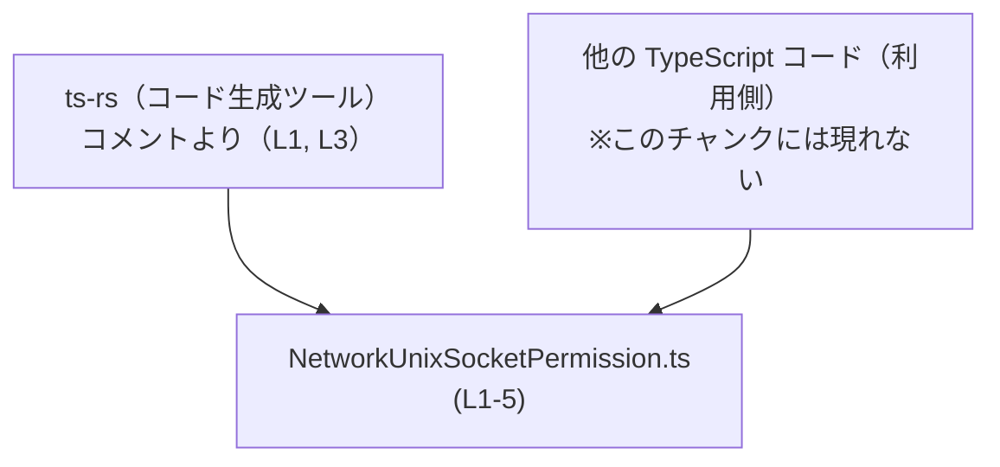
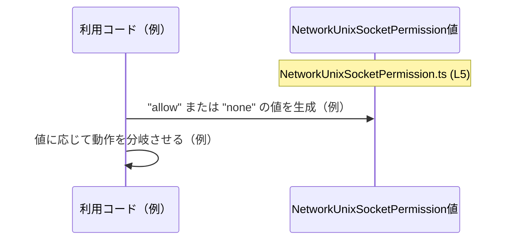

# app-server-protocol/schema/typescript/v2/NetworkUnixSocketPermission.ts コード解説

## 0. ざっくり一言

- このファイルは、文字列リテラル `"allow"` または `"none"` のいずれかだけを取る `NetworkUnixSocketPermission` という TypeScript の型エイリアスを定義・公開するモジュールです（`app-server-protocol/schema/typescript/v2/NetworkUnixSocketPermission.ts:L5-5`）。

---

## 1. このモジュールの役割

### 1.1 概要

- このモジュールは、自動生成された TypeScript 型定義を 1 つ提供します（`L1-1`, `L3-3`）。
- 公開されているのは `NetworkUnixSocketPermission` という型エイリアスで、値として `"allow"` か `"none"` のみを許可する文字列リテラル・ユニオン型です（`L5-5`）。
- 実行時のロジックや関数は含まれておらず、コンパイル時の型安全性を高めるためだけの定義になっています（`L5-5`）。

### 1.2 アーキテクチャ内での位置づけ

- ファイル先頭コメントから、このファイルは `ts-rs` ツールによって自動生成されていることが分かります（`L1-1`, `L3-3`）。
- このチャンク内には、`NetworkUnixSocketPermission` を実際に利用している他モジュールや関数は現れません。そのため、具体的にどのモジュールから参照されているかは不明です。
- 役割としては、「あるドメイン値が `"allow"` / `"none"` の 2 値しか取らない」という制約を TypeScript 型として表現し、他の TypeScript コードから利用される前提の **スキーマ的な型定義** と位置づけられます（`L5-5`）。

依存関係イメージ（このファイルの範囲に基づく概念図）:



### 1.3 設計上のポイント

- **自動生成ファイルであることが明示されている**  
  - `// GENERATED CODE! DO NOT MODIFY BY HAND!`（`L1-1`）  
  - `// This file was generated by [ts-rs] ... Do not edit this file manually.`（`L3-3`）  
  → 変更は生成元（ts-rs の入力側）で行う前提の設計です。
- **値の取りうるパターンを型レベルで限定**  
  - `export type NetworkUnixSocketPermission = "allow" | "none";`（`L5-5`）  
  → 文字列リテラル・ユニオン型により、TypeScript のコンパイル時チェックで `"allow"` / `"none"` 以外を防ぎます。
- **状態を持たない純粋な型定義のみ**  
  - クラス・関数・変数などは定義されていません（`L5-5` 以外にコード行がないため）。
- **ランタイム負荷ゼロ**  
  - 型エイリアスのみのため、JavaScript 出力には影響せず、実行時コストや並行性上の影響はありません（TypeScript の仕様に基づく）。

---

## 2. 主要な機能一覧

このモジュールが提供する主要な「機能」は 1 つの型定義です。

- `NetworkUnixSocketPermission` 型: `"allow"` または `"none"` の 2 値だけを取る文字列リテラル・ユニオン型を公開する（`L5-5`）。

---

## 3. 公開 API と詳細解説

### 3.1 型一覧（構造体・列挙体など）

このファイルで公開されている型は次の 1 つです。

| 名前 | 種別 | 役割 / 用途 | 定義箇所 |
|------|------|-------------|----------|
| `NetworkUnixSocketPermission` | 型エイリアス（文字列リテラル・ユニオン） | 値を `"allow"` または `"none"` のいずれかに制限するための型。型名から、ネットワークの UNIX ソケットに関する許可状態を表す目的と解釈できますが、利用箇所はこのチャンクには現れません。 | `NetworkUnixSocketPermission.ts:L5-5` |

### 3.2 型詳細（関数はないため型に対してテンプレート適用）

#### `NetworkUnixSocketPermission`

**概要**

- TypeScript の型エイリアスで、許容される文字列を `"allow"` と `"none"` の 2 つに限定するユニオン型です（`L5-5`）。
- この型を使うことで、他のコードで `"allow"` / `"none"` 以外の文字列を指定すると、コンパイルエラーになります。

**許容される値**

| 値 | 説明 |
|----|------|
| `"allow"` | 許可状態を表す文字列であると解釈できます（用途は型名からの推測のみで、このチャンク単体からはロジック不明）。 |
| `"none"`  | 何も許可しない状態を表す文字列であると解釈できます（同上）。 |

**戻り値 / 実行時の振る舞い**

- 型エイリアスのため「戻り値」はありません。
- TypeScript コンパイル時にのみ効力を持ち、実行時（JavaScript）にはこの型情報は存在しません。  
  → そのため、ランタイムにおけるエラーや例外は発生させず、あくまで **コンパイル時の型チェック専用** です。

**Examples（使用例）**

以下のコード例は、この型の典型的な使い方を示すものであり、リポジトリに実在する関数ではありません。

```typescript
// 仮のインポート例（実際の相対パスはプロジェクト構成に依存する）
import type { NetworkUnixSocketPermission } from "./NetworkUnixSocketPermission"; // NetworkUnixSocketPermission.ts (L5) を利用する想定

// NetworkUnixSocketPermission 型を引数として受け取る関数例
function setPermission(permission: NetworkUnixSocketPermission) {  // permission には "allow" か "none" だけが渡せる
    if (permission === "allow") {                                 // "allow" の場合の分岐例
        console.log("Permission: allow");                         // 許可状態（例）
    } else {                                                      // それ以外に可能なのは "none" だけ
        console.log("Permission: none");                          // 非許可状態（例）
    }
}

// 正しい呼び出し例
setPermission("allow");  // OK: NetworkUnixSocketPermission の一種
setPermission("none");   // OK: NetworkUnixSocketPermission の一種

// 間違った呼び出し例（コンパイルエラーになる）
/*
setPermission("deny");   // エラー: "deny" は "allow" | "none" に含まれない
*/
```

**Errors / Panics（型レベルでのエラー）**

- この型自体はランタイムのエラーや例外を発生させません。
- ただし、他のコードで `NetworkUnixSocketPermission` 型を使う場合に、  
  `"allow"` / `"none"` 以外の文字列リテラルを渡そうとすると **TypeScript コンパイルエラー** となります。
- 外部入力（JSON など）を `any` として扱い、明示的な型チェックをしないままこの型にアサートすると、  
  型チェックをすり抜けてランタイムで不正な文字列が存在しうるため、別途バリデーションが必要です。

**Edge cases（エッジケース）**

- **空文字列 `""`**  
  - 型定義に含まれていないため、`NetworkUnixSocketPermission` に代入しようとするとコンパイルエラーになります。
- **大小文字の違い（例: `"Allow"`）**  
  - `"Allow"` などの表記ゆれはユニオンに含まれていないため、コンパイルエラーになります。
- **外部からの文字列入力**  
  - JSON パース結果などが `string` 型のまま扱われている場合はコンパイル時に値の具体的中身が分からないため、  
    そのまま `NetworkUnixSocketPermission` とみなすには型ガードやバリデーションが必要です（このチャンクにはそうした関数は現れません）。

**使用上の注意点**

- このファイルは自動生成であり、「手で編集しない」ことが明示されています（`L1-1`, `L3-3`）。  
  仕様を変えたい場合は、生成元（ts-rs の入力側）を変更する必要があります（具体的な場所はこのチャンクからは分かりません）。
- `NetworkUnixSocketPermission` を利用するコードは、`"allow"` / `"none"` の **両方のケースを扱う分岐** を実装することが望ましいです。  
  片方だけを想定すると将来の拡張（値の追加）に弱くなります。
- `any` や `unknown` からこの型にキャストする場合、**ランタイムで値が保証されない** ため、型ガードや条件分岐を実装してから代入するほうが安全です。
- 並行性・スレッド安全性については、この型自体はコンパイル時の概念だけであり、JavaScript ランタイム上で状態を持たないため、特別な考慮は不要です。

### 3.3 その他の関数

- このファイルには関数定義は一切含まれていません（`L5-5` に `export type` しか存在しないため）。

---

## 4. データフロー

このファイル単体には関数や処理フローは定義されていませんが、`NetworkUnixSocketPermission` 型の **一般的な利用イメージ** として、値がどのように流れるかを概念的に示します。

### 4.1 概念的なデータフロー（利用側コードとの関係）

以下は、`NetworkUnixSocketPermission` 型を使う側のコードを仮定したイメージ図です。  
ここで登場する「利用コード」はリポジトリに実在するとは限らず、あくまで説明用の概念です。



要点:

- `NetworkUnixSocketPermission` 型は **値の制約** を表すだけで、自身ではどこにもデータを送信しません（`L5-5`）。
- 実際のデータフローは、これを利用する関数・モジュール側に依存しますが、その詳細はこのチャンクには現れません。

---

## 5. 使い方（How to Use）

### 5.1 基本的な使用方法

`NetworkUnixSocketPermission` 型を設定オブジェクトなどで利用する、もっとも素直なコード例です。

```typescript
// 仮のインポートパス（実際の相対パスはプロジェクト構成に依存する）
import type { NetworkUnixSocketPermission } from "./NetworkUnixSocketPermission";  // (L5) の型エイリアスを利用する例

// 仮の設定オブジェクトの型定義
type AppConfig = {                                           // アプリケーション設定全体の型（例）
    unixSocketPermission: NetworkUnixSocketPermission;       // UNIX ソケットに関する許可を NetworkUnixSocketPermission で表す（例）
};

// 設定を受け取って何か処理する関数例
function initApp(config: AppConfig) {                        // AppConfig 型の設定を受け取る
    if (config.unixSocketPermission === "allow") {           // "allow" の場合の分岐
        console.log("UNIX socket is allowed.");              // 許可状態の処理（例）
    } else {                                                 // "none" の場合の分岐
        console.log("UNIX socket is disabled.");             // 非許可状態の処理（例）
    }
}

// 設定の作成例
const config: AppConfig = {                                  // AppConfig 型の値を作成
    unixSocketPermission: "allow",                           // "allow" を指定（"none" でもよい）
};

initApp(config);                                             // 関数を呼び出す（型チェック済み）
```

- ここでの `AppConfig` や `initApp` はあくまで例であり、このチャンクには登場しません。
- `unixSocketPermission` フィールドに `"deny"` や `"ALlOW"` のような値を入れるとコンパイルエラーになります。

### 5.2 よくある使用パターン

1. **オプションパラメータとしての利用（デフォルト値あり）**

```typescript
import type { NetworkUnixSocketPermission } from "./NetworkUnixSocketPermission"; // (L5)

// デフォルト値を "none" として扱う関数例
function withDefaultPermission(
    permission: NetworkUnixSocketPermission = "none",        // デフォルト値を "none" に設定
) {
    // permission は必ず "allow" か "none"
    return permission;
}

const p1 = withDefaultPermission();                          // p1 は "none"
const p2 = withDefaultPermission("allow");                   // p2 は "allow"
// withDefaultPermission("deny");                            // コンパイルエラー
```

1. **ユニオン型による分岐の exhaustiveness チェック**

```typescript
import type { NetworkUnixSocketPermission } from "./NetworkUnixSocketPermission"; // (L5)

function describePermission(p: NetworkUnixSocketPermission): string { // 2 ケースのみを受け取る
    switch (p) {                                                       // p の値で分岐
        case "allow":
            return "Allowed";                                          // "allow" の説明
        case "none":
            return "Not allowed";                                      // "none" の説明
        default:
            // ユニオンが "allow" | "none" だけなら、ここは実行されない想定
            // 将来値が増えたときに TypeScript がコンパイル時に警告できる形
            const _exhaustiveCheck: never = p;                         // 型レベルの安全性を高めるテクニック
            return _exhaustiveCheck;
    }
}
```

### 5.3 よくある間違い

```typescript
import type { NetworkUnixSocketPermission } from "./NetworkUnixSocketPermission"; // (L5)

// 間違い例: 型を string として定義してしまう
type BadConfig = {
    unixSocketPermission: string;              // string だと "deny" や "foo" も許されてしまう
};

// 正しい例: NetworkUnixSocketPermission を使う
type GoodConfig = {
    unixSocketPermission: NetworkUnixSocketPermission;  // "allow" | "none" に制限される
};

// 間違い例: 型アサーションで無理に通す
declare const input: string;                     // 外部から来た文字列（中身は不明）

const unsafe: NetworkUnixSocketPermission = input as NetworkUnixSocketPermission;
// ↑ コンパイルは通るが、ランタイムでは "deny" なども通ってしまう可能性がある

// 正しい例: 値をチェックしてから代入する
function parsePermission(value: string): NetworkUnixSocketPermission | null {  // 文字列から安全に変換する例
    if (value === "allow" || value === "none") {                               // 許容値のみを受け入れる
        return value;                                                          // NetworkUnixSocketPermission として返せる
    }
    return null;                                                               // 不正な場合は null などを返す
}
```

### 5.4 使用上の注意点（まとめ）

- このファイルはコメントで「手で編集しない」ことが明示されています（`L1-1`, `L3-3`）。  
  仕様変更は ts-rs 側の設定や入力に対して行う必要があります（具体的なファイルはこのチャンクには現れません）。
- 外部入力の文字列を直接 `NetworkUnixSocketPermission` にキャストすると、型安全性を失うため、  
  必ず `"allow"` / `"none"` かどうかのチェックを行ってから代入することが推奨されます。
- 値が 2 パターンだけであるため、`switch` 文や `if` 文で **両方のケースを明示的に扱う** 設計にしておくと、  
  将来的に値が増えた場合にもコンパイル時に未対応ケースを検出しやすくなります。
- 型定義のみであり、実行時のパフォーマンス・メモリ・並行性に影響を与えることはありません。

---

## 6. 変更の仕方（How to Modify）

### 6.1 新しい機能を追加する場合

- コメントから、このファイルは `ts-rs` によって自動生成されていることが分かります（`L1-1`, `L3-3`）。  
  そのため、**このファイル自体に新しい型や値を直接追加するべきではありません**。
- `NetworkUnixSocketPermission` に新しい値（例: `"read-only"`）を追加したい場合は、生成元（ts-rs の入力側）を変更する必要があります。  
  具体的にどの Rust 型や設定ファイルなのかは、このチャンクからは分かりません。
- TypeScript だけで追加の挙動を定義したい場合は、別の `.ts` ファイルを新規作成し、この型をインポートしてラッパー関数や補助的な型を定義するのが安全です。

### 6.2 既存の機能を変更する場合

- `NetworkUnixSocketPermission` の文字列リテラルを変更・削除すると、その型を使っている全ての TypeScript コードに影響します。  
  しかし、このチャンクには利用箇所が現れないため、影響範囲を特定するにはプロジェクト全体の検索が必要です。
- 自動生成であることから、変更しても次回の生成で上書きされる可能性が高いため、  
  **このファイルを直接編集することは推奨されません**（`L1-1`, `L3-3`）。生成元での変更を検討する必要があります。
- 契約（Contract）としての前提条件:
  - `NetworkUnixSocketPermission` は `"allow"` / `"none"` という 2 値のユニオンである（`L5-5`）。
  - 利用側コードは **この 2 パターンに依存している** 可能性があるため、値の追加・変更は慎重に行う必要があります。

---

## 7. 関連ファイル

このチャンク内には、直接の関連ファイルやモジュールを示すコードはありません。

| パス | 役割 / 関係 |
|------|------------|
| （不明） | コメントから、このファイルは `ts-rs` によって自動生成されていることだけが分かります（`L1-1`, `L3-3`）。生成元の Rust ファイルや設定ファイルの場所は、このチャンクには現れません。 |
| （利用側 TypeScript ファイル） | `NetworkUnixSocketPermission` をインポートして利用するファイルが存在すると考えられますが、具体的なパス・名前はこのチャンクには現れません。 |

---

### コンポーネントインベントリーのまとめ

- **型エイリアス**
  - `NetworkUnixSocketPermission`（`app-server-protocol/schema/typescript/v2/NetworkUnixSocketPermission.ts:L5-5`）

- **関数 / クラス / 変数**
  - このチャンクには定義されていません。

このファイルは、型レベルでドメインの制約を表現する **シンプルかつ自動生成されたスキーマ定義** であり、  
TypeScript 特有の文字列リテラル・ユニオン型を用いて、安全に `"allow"` / `"none"` の 2 値を扱うための土台を提供しています。
