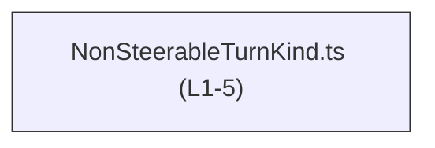
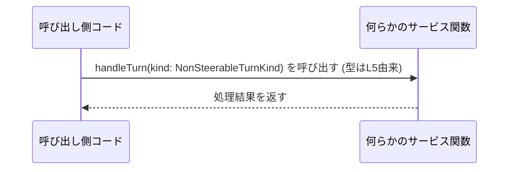

# app-server-protocol/schema/typescript/v2/NonSteerableTurnKind.ts

## 0. ざっくり一言

`NonSteerableTurnKind` という **文字列リテラル・ユニオン型**（2 種類の文字列だけを許す型）を定義して、他の TypeScript コードから利用できるようにしているファイルです（`NonSteerableTurnKind.ts:L5-5`）。  
このファイルは `ts-rs` によって自動生成されており、手動での編集は想定されていません（`NonSteerableTurnKind.ts:L1-3`）。

---

## 1. このモジュールの役割

### 1.1 概要

- このモジュールは、TypeScript 側で `NonSteerableTurnKind` という型別名（type alias）を定義します（`NonSteerableTurnKind.ts:L5-5`）。
- 型は `"review"` か `"compact"` のどちらかだけを受け付ける文字列リテラル・ユニオン型です（`NonSteerableTurnKind.ts:L5-5`）。
- ファイル先頭のコメントから、この型定義は `ts-rs` により自動生成されたものであり、手作業で編集すべきではないことが分かります（`NonSteerableTurnKind.ts:L1-3`）。

### 1.2 アーキテクチャ内での位置づけ

このファイルは他のモジュールを `import` しておらず、依存先はありません（`NonSteerableTurnKind.ts` 全体に `import` が存在しない）。  
どのモジュールから `import` されているかは、このチャンクには現れないため不明です。

依存関係のイメージ（このファイル内で確定できるのは「単独で型を定義している」点のみです）:



- 上図は、このファイルが単独で型を提供していることだけを示しています。
- どのコンポーネントがこの型を使うかは、このチャンクには出てきません。

### 1.3 設計上のポイント

- **自動生成コード**  
  - コメントで `// GENERATED CODE! DO NOT MODIFY BY HAND!` と明示されています（`NonSteerableTurnKind.ts:L1-1`）。
  - `ts-rs` による生成であることが `// This file was generated by [ts-rs] ...` から分かります（`NonSteerableTurnKind.ts:L3-3`）。
- **シンプルな型エイリアス**  
  - `export type NonSteerableTurnKind = "review" | "compact";` という 1 行のみで型を表現しています（`NonSteerableTurnKind.ts:L5-5`）。
  - enum ではなく文字列リテラル・ユニオン型を使うことで、生成コードを簡潔に保っています。
- **状態を持たない**  
  - 関数やクラス、変数定義はなく、状態を持たない純粋な型定義モジュールです。
- **エラーハンドリングはコンパイル時のみ**  
  - 不正な値（例えば `"reviews"` のようなタイプミス）を使おうとすると、TypeScript の型チェックでコンパイルエラーになります。
  - 実行時のガード処理はこのファイルには含まれません。

---

## 2. 主要な機能一覧

このモジュールが提供する機能は 1 つだけです。

- `NonSteerableTurnKind`: `"review"` か `"compact"` の 2 種類の文字列だけを許可する文字列リテラル・ユニオン型（`NonSteerableTurnKind.ts:L5-5`）。

---

## 3. 公開 API と詳細解説

### 3.1 型一覧（構造体・列挙体など）

| 名前                    | 種別            | 役割 / 用途                                                                 | 定義位置                            |
|-------------------------|-----------------|-------------------------------------------------------------------------------|--------------------------------------|
| `NonSteerableTurnKind` | 型エイリアス    | `"review"` または `"compact"` の 2 種類の値だけを許容する文字列リテラル・ユニオン型 | `NonSteerableTurnKind.ts:L5-5`      |

#### 型の意味（TypeScript 初学者向け補足）

```typescript
export type NonSteerableTurnKind = "review" | "compact";
```

- **type エイリアス**: `NonSteerableTurnKind` という名前に、ある型（ここではユニオン型）を紐づけています。
- **文字列リテラル型**: `"review"` や `"compact"` のように、特定の文字列だけを表す型です。
- **ユニオン型**: `A | B` という形で、「A または B のどちらか」という型を表します。

このため `NonSteerableTurnKind` は「`"review"` か `"compact"` のどちらか」という制約を持つ型になります。

### 3.2 関数詳細（最大 7 件）

このファイルには関数（通常の `function` や `=>` 形式の関数、メソッド）は定義されていません（`NonSteerableTurnKind.ts` 全行を確認）。

- そのため、関数詳細テンプレートに該当する公開関数はありません。
- このモジュールの「コアロジック」は、あくまで型レベルの制約にあります。

### 3.3 その他の関数

- 補助関数やラッパー関数も存在しません（`NonSteerableTurnKind.ts` 全行を確認）。
- 実行時のロジックは一切含まれていない純粋な型定義ファイルです。

---

## 4. データフロー

このファイル自体には実行時の処理フローは一切含まれていません。  
ここでは、**この型がどのように利用されるかの典型的な流れの例**（仮想コード）を示します。

### 4.1 典型的な利用シナリオ（例）

想定される利用イメージ（※実際の呼び出し元はこのチャンクには現れません）:



- `NonSteerableTurnKind` 型は `Service` 側の引数や戻り値、あるいはオブジェクトのプロパティ型として使われることが想定されます。
- 呼び出し側は `"review"` か `"compact"` のどちらかを渡そうとするときに、コンパイラが値の妥当性をチェックします（型安全性）。

※上記の関数名・処理内容は**例示**であり、実コードとしてこのチャンクには現れません。

---

## 5. 使い方（How to Use）

### 5.1 基本的な使用方法

`NonSteerableTurnKind` を変数や関数の引数に使う基本例です。

```typescript
// NonSteerableTurnKind 型をインポートする例
import type { NonSteerableTurnKind } from "./NonSteerableTurnKind";  // 相対パスは例示

// この型を引数に取る関数を定義する
function handleTurn(kind: NonSteerableTurnKind) {
    // kind は "review" か "compact" のどちらかに限定される
    if (kind === "review") {
        // レビュー用の処理を行う
    } else {
        // "compact" の場合の処理を行う
    }
}

// 正しい使い方（コンパイル OK）
handleTurn("review");
handleTurn("compact");

// 間違い（コンパイルエラー: 型 '"rev"' を NonSteerableTurnKind に割り当てられない）
handleTurn("rev");
```

- TypeScript の型チェックにより、 `"rev"` などのタイプミスをコンパイル時に検出できます。
- ランタイムでチェックするコードはこのモジュールにはないため、実行時のエラーは型アサーションなどで無理に型チェックをすり抜けた場合にのみ起こりえます。

### 5.2 よくある使用パターン

1. **オブジェクトのプロパティとして使う**

```typescript
import type { NonSteerableTurnKind } from "./NonSteerableTurnKind";

interface TurnOptions {
    kind: NonSteerableTurnKind;  // "review" または "compact"
    // 他の設定項目...
}

const options: TurnOptions = {
    kind: "compact",  // OK
    // ...
};
```

1. **戻り値の型として使う**

```typescript
import type { NonSteerableTurnKind } from "./NonSteerableTurnKind";

function getDefaultTurnKind(): NonSteerableTurnKind {
    return "review";  // 2 種類のどちらかを返す
}
```

### 5.3 よくある間違い

```typescript
import type { NonSteerableTurnKind } from "./NonSteerableTurnKind";

// 間違い例: string 型をそのまま受け取ってしまう
function badHandleTurn(kind: string) {
    // 任意の文字列が許されてしまい、型安全性が失われる
}

// 正しい例: NonSteerableTurnKind 型を使う
function goodHandleTurn(kind: NonSteerableTurnKind) {
    // "review" か "compact" のみ許可される
}
```

- `string` 全体を受け取ると、 `"reivew"` などのタイプミスがコンパイル時に検出されません。
- `NonSteerableTurnKind` を使うと、**型による「契約」** を明示でき、安全性が高まります。

### 5.4 使用上の注意点（まとめ）

- **自動生成ファイルを直接編集しない**  
  - ファイル冒頭に「GENERATED CODE」「Do not edit this file manually」とあり、自動生成であることが明示されています（`NonSteerableTurnKind.ts:L1-3`）。
  - 型のバリアントを増減したい場合は、元の Rust 側定義や `ts-rs` の設定を変更し、再生成する必要があります。このファイルを直接変更すると、再生成時に上書きされます。
- **型アサーションの乱用に注意**  
  - `as NonSteerableTurnKind` のような型アサーションを多用すると、コンパイル時チェックをすり抜けて実行時に予期しない文字列が流入する可能性があります。
- **ランタイムの入力検証は別途必要**  
  - この型はコンパイル時のチェックしか行いません。外部入力（JSON 等）をパースする際は、 `"review"` / `"compact"` 以外の値が来ないかどうかを実行時にも検証する必要があります。

---

## 6. 変更の仕方（How to Modify）

### 6.1 新しい機能を追加する場合

`NonSteerableTurnKind` に新しい値（例: `"summary"`）を追加したい場合の手順は、コメントにある自動生成の方針から次のように解釈できます。

1. **元の定義側を変更する**  
   - `ts-rs` によって生成されているため、元の Rust コード側の定義に新しいバリアントを追加するのが自然と考えられます（ただし、このチャンクには元ファイルの場所や名前は現れません）。
2. **`ts-rs` による再生成を行う**  
   - 生成スクリプトやビルド手順に従って TypeScript ファイルを再生成します。
3. **利用箇所の修正**  
   - TypeScript 側で `NonSteerableTurnKind` を使っている箇所は、コンパイラのサポートで必要な修正箇所が分かります（`switch` 文などで exhaustiveness check をしていれば、コンパイルエラーとして現れます）。

※ このファイルを直接編集すると、次回の生成時に変更が失われる可能性があります。

### 6.2 既存の機能を変更する場合

- `"review"` や `"compact"` の文字列を変更・削除したい場合も、**直接編集せず** 元の定義を変更して再生成する必要があります。
- 変更の影響範囲:
  - `NonSteerableTurnKind` を利用するすべての関数・インターフェース・クラスの型定義に影響します。
  - `switch (kind)` などでケース分岐しているコードは、新しい値に対応した分岐が必要になります。
- 契約（前提条件・返り値の意味など）:
  - 「`NonSteerableTurnKind` は `"review"` / `"compact"` の2つだけ」という前提で書かれているコードがある場合、その前提が崩れるため注意が必要です。

---

## 7. 関連ファイル

このチャンクには、具体的な関連ファイルのパスは現れません。  
自動生成コメントと内容から推測できる範囲を、推測であることを明示したうえで整理します。

| パス                     | 役割 / 関係                                                                                          |
|--------------------------|-------------------------------------------------------------------------------------------------------|
| （不明）Rust 側の定義     | `ts-rs` によりこの TypeScript 型が生成されている元の Rust 型定義が存在すると考えられます（パスは不明）。 |
| app-server-protocol/schema/typescript/v2/**\*.ts** | 同じスキーマディレクトリ内の他の型定義ファイルが、同様に `ts-rs` で生成された関連型である可能性があります（このチャンクには個別の記述はありません）。 |

※ 上記の関連性はコメントにある `ts-rs` からの生成という事実（`NonSteerableTurnKind.ts:L3-3`）に基づく一般的な構造の説明であり、具体的なファイル名・パスはこのチャンクからは特定できません。

---

### 補足: Bugs / Security / Tests / Performance の観点（本ファイルに限定した整理）

- **Bugs**  
  - 実行時ロジックがないため、このファイル単体でのロジックバグはありません。
  - 元の定義と異なる値が生成されるといった問題は、`ts-rs` 側・生成プロセス側の問題になります（このチャンクには詳細は現れません）。
- **Security**  
  - このファイルは型定義のみで、直接的なセキュリティリスクはありません。
  - ただし、外部入力の検証を「型に任せたつもりになる」と、実行時には `"review"` / `"compact"` 以外の文字列が通ってしまう可能性があるため、別途バリデーションが必要です。
- **Contracts / Edge Cases**  
  - 契約: 「`NonSteerableTurnKind` は `"review"` または `"compact"` である」という点が型レベルの契約です（`NonSteerableTurnKind.ts:L5-5`）。
  - エッジケース: 型定義上、`null` や `undefined`、空文字 `""`、その他任意の文字列は許可されず、すべてコンパイルエラーになります。
- **Tests**  
  - このファイルにはテストコードは含まれていません（`NonSteerableTurnKind.ts` 内に `describe` / `it` 等は存在しない）。
  - 一般的には、この型を利用するロジック側でテストを書く形になります。
- **Performance / Scalability**  
  - 型定義のみであり、ランタイムのパフォーマンスやスケーラビリティへの影響はありません。
  - 型の複雑さも非常に小さいため、コンパイル時間への影響もほぼ無視できます。
